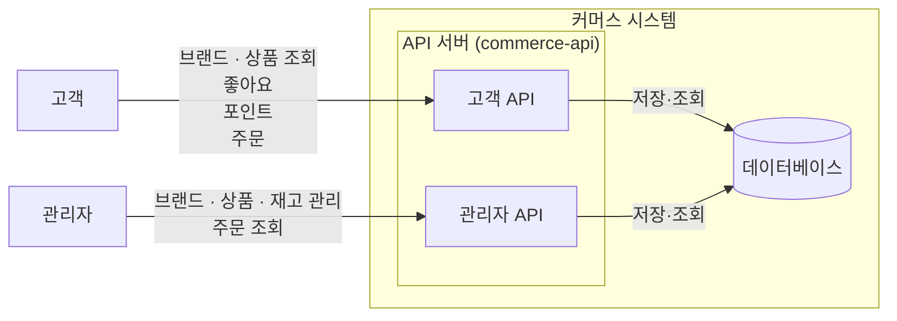

# 1. 버드뷰

## 1.1 시스템 개요

이 시스템은 고객이 브랜드와 상품을 탐색하고, 관심 있는 상품에 좋아요를 표시하며, 포인트를 충전하고 상품을 주문할 수 있는 커머스 시스템이다.

관리자는 고객에게 노출되는 브랜드와 상품을 관리하고, 상품 재고를 변경하며 주문 현황을 조회한다.

고객과 관리자의 요청은 API 서버(`commerce-api`)가 처리하고, 데이터는 데이터베이스에 저장한다.

## 1.2 시스템 구성과 기능 범위

*그림 1. 고객·관리자와 커머스 시스템의 경계 및 요청 방향*

API 서버(`commerce-api`)는 고객용 API와 관리자용 API를 구분한다. 두 사용자는 브랜드와 상품처럼 같은 데이터를 다루기도 하지만, 허용하는 기능과 접근 가능한 데이터의 범위는 서로 다르다. 관리자가 변경한 브랜드·상품·재고 정보는 고객의 조회와 주문 처리에 사용된다.

각 역할이 실제로 수행하는 기능은 다음과 같다.

### 고객

- 브랜드 상세 정보와 상품 목록·상세 정보를 조회한다.
- 상품에 좋아요를 등록·취소하고 자신의 좋아요 목록을 조회한다.
- 포인트를 충전하고 현재 잔액을 조회한다.
- 주문을 생성·확정하고 자신의 주문 목록과 상세 정보를 조회한다.

### 관리자

- 브랜드를 등록·조회·수정·삭제한다.
- 상품을 등록·조회·수정·삭제한다.
- 상품 재고를 변경한다.
- 전체 주문 목록과 주문 상세 정보를 조회한다.

외부 결제·배송·알림과 같은 외부 서비스 연동은 이번 설계 범위에서 다루지 않는다.

개별 API 계약, 상세 도메인 관계, 처리 순서, 계층별 책임은 뒤의 설계에서 구체화한다.
