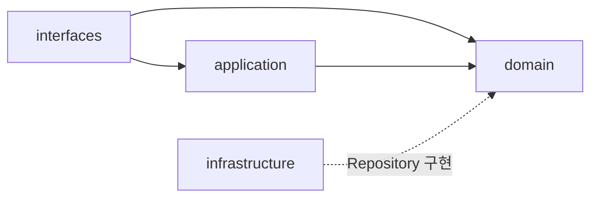

# 2. 구조와 의존

## 2.1 적용 범위와 패키지 구조

`commerce-api`는 계층 우선(layer-first) 구조를 따른다. 최상위를 계층(`interfaces`, `application`, `domain`, `infrastructure`)으로 나누고, 각 계층 아래에 기능별 패키지를 구성한다.

```text
com.loopers
├── interfaces/api/{feature}
│   ├── {Feature}V1Controller
│   └── {Feature}AdminV1Controller  (관리자 API가 있는 경우)
├── application/{feature}
├── domain/{feature}
├── domain/common  (기능 간 공유 Value Object)
├── infrastructure/{feature}
└── support
```

고객용 API와 관리자용 API는 같은 기능 패키지에 배치하되, Controller와 요청·응답 모델을 분리한다.
상품과 주문에서 함께 사용하는 `Money`는 독립 기능이 아니라 공유 Value Object이므로 `domain/common`에 둔다.

layer-first는 HTTP 요청 처리, 유스케이스 조율, 도메인 규칙과 저장 구현을 책임의 종류에 따라 구분하고, 계층 간 의존 방향을 패키지 구조에 명확히 드러낼 수 있다.

feature-first는 한 기능과 관련된 코드를 가까운 위치에 모을 수 있다는 장점이 있다. 그러나 현재는 `Like`와 `Stock`을 독립 기능으로 볼지 다른 기능에 포함할지 등 기능 경계가 확정되지 않았으며, 주문 확정처럼 여러 기능 영역이 협력하는 유스케이스가 존재한다.

현재 시스템의 기능 경계와 프로젝트 규모를 고려해, 기능별 격리보다 계층별 책임과 의존 방향을 명확히 드러내는 layer-first 구조를 선택한다. 이 선택으로 하나의 기능을 변경할 때 여러 계층의 패키지를 오가야 하는 비용이 발생한다.

## 2.2 레이어별 역할과 주요 구성 요소

각 레이어의 책임과 해당 레이어에 배치하는 주요 구성 요소는 다음과 같다. 일반적인 API 유스케이스의 Application Service는 `{Domain}Facade`, 별도 처리 흐름과 변경 범위가 분명한 유스케이스는 `{UseCase}Facade`로 명명한다.

|계층|역할|주요 구성 요소|
|---|---|---|
|interfaces|고객·관리자의 요청을 입력으로 변환하고, 처리 결과와 예외를 HTTP 응답으로 변환한다.|고객·관리자 Controller, 요청·응답 DTO, API 명세, 예외 응답 처리|
|application|모든 API 유스케이스의 진입점과 트랜잭션 경계를 관리한다. Facade는 Repository로 객체를 조회·저장하고 Entity·Value Object 또는 필요한 Domain Service의 행동을 호출하며, 업무 규칙을 직접 구현하지 않는다.|Facade, 입력·결과 모델|
|domain|Entity와 Value Object는 상태와 업무 규칙을 표현하고 스스로 유효성을 지킨다. 어느 한 객체에 자연스럽게 둘 수 없는 실제 도메인 규칙만 Domain Service가 담당한다. Repository·QueryRepository 인터페이스와 조회 결과 계약도 domain에 선언한다.|Entity, Value Object, Domain Service, Repository·QueryRepository 인터페이스, QueryResult|
|infrastructure|domain이 선언한 저장소 인터페이스를 JPA 등 구체적인 저장 기술로 구현한다.|Repository 구현체, Spring Data JPA Repository|
|support|공통 오류 처리 등 애플리케이션 전반에서 사용하는 지원 코드를 제공한다.|공통 예외, 오류 타입|

Domain Service는 기본적으로 Repository 조회·저장, API 처리 순서, 응답 조립과 트랜잭션 경계를 담당하지 않는다. 여러 도메인 객체의 정보가 필요한 업무 판단은 우선 Entity·Value Object에 둘 수 있는지 확인하고, 어느 하나가 책임지기 어려울 때만 Domain Service에 둔다. Repository 조회 자체가 도메인 판단의 일부이고 Facade가 객체나 값으로 준비해 전달하기 어려운 경우에는 비용과 대안을 먼저 검토한 뒤 예외를 둘 수 있지만, 현재 그런 예외는 없다. 현재 `OrderService`는 중복 주문 품목의 수량을 안전하게 합치고 Facade가 존재와 활성 상태를 확인한 상품의 가격으로 초안 주문을 만드는 규칙만 담당한다.

실습 템플릿으로 제공된 `example` 패키지는 현재 Commerce API의 설계·리팩터링 범위에서 제외한다. 아래 Facade와 트랜잭션 원칙은 브랜드·상품·좋아요·포인트·주문과 공통 요청자 식별 흐름에 적용한다.

비즈니스 Domain Entity와 JPA Entity는 기본적으로 `{Domain}Model` 하나로 사용하며 `commerce-api`의 `domain/{feature}`에 배치한다. 두 모델을 분리할 필요가 생기면 해당 모델만 `{Domain}JpaEntity`로 분리해 infrastructure에 둔다. `modules/jpa`에는 비즈니스 Entity를 두지 않고 `BaseEntity`와 공통 JPA 설정만 둔다. 분리 판단 사례와 선택에 따른 비용은 [부록 A.6](./appendix-decisions.md#a6-domain-entity와-jpa-entity의-분리-여부)에서 비교한다.

모든 Controller는 application의 Facade만 호출한다. 조회와 상태 변경 모두 Facade가 domain의 Repository 인터페이스를 직접 사용하며, Repository 호출을 중계하기 위한 Domain Service를 두지 않는다.

```text
Controller
    → Facade @Transactional
        ├→ Repository 인터페이스로 객체 조회·저장
        ├→ Entity·Value Object 행동 호출
        └→ 필요한 경우 순수 Domain Service 호출
```

브랜드명·좋아요 수·현재 재고 수량을 포함한 상품 목록·상세처럼 여러 값을 조합하더라도, 하나의 조회 포트가 완성된 읽기 전용 결과를 반환하고 도메인 행동을 조율하지 않는다면 다음과 같이 처리한다.

```text
Controller
    → Facade @Transactional(readOnly = true)
        → QueryRepository
            → QueryResult
```

`ProductFacade`는 `ProductQueryRepository`가 반환한 `ProductQueryResult`를 그대로 조회 계약으로 사용한다. `BrandFacade`는 Brand 삭제와 연결된 미삭제 Product의 bulk soft delete를 하나의 트랜잭션에서 조율한다. 일괄 삭제 포트는 domain의 ProductRepository에 선언하고 infrastructure에서 구현하며, 상세 순서와 보장 범위는 [4.1](./04-use-cases.md#41-브랜드와-연관-상품-일괄-삭제)에 둔다. `OrderFacade`는 요청한 Product가 모두 존재하고 활성 상태인지 확인한 뒤 준비된 객체를 순수 Domain Service인 `OrderService`에 전달하고, 주문 품목 구성 규칙을 맡긴 뒤 Order를 저장한다. 주문 확정은 별도 처리 흐름에서 Order·Point·Product의 상태를 함께 변경하므로 `OrderConfirmFacade`가 조율한다.

Facade는 Domain Service를 반드시 거치지 않는다. Entity·Value Object가 스스로 지킬 수 있는 규칙은 해당 객체의 행동을 직접 호출하고, 여러 객체에 걸친 실제 도메인 규칙이 있을 때만 Domain Service를 호출한다. Facade가 다른 Facade를 호출하지 않으며, 여러 Aggregate가 협력하는 별도 흐름은 해당 흐름을 책임지는 `{UseCase}Facade`가 필요한 Repository와 Domain Service에 직접 의존한다.

```text
Controller
    → Facade @Transactional
        ├→ Repository 인터페이스로 객체 조회·저장
        ├→ Entity 행동 호출
        └→ 필요한 Domain Service 호출
```

조회 유스케이스는 Facade의 `@Transactional(readOnly = true)`, 상태 변경 유스케이스는 Facade의 `@Transactional`을 경계로 사용한다. Domain Service에는 트랜잭션 애노테이션을 두지 않으므로 유스케이스 안의 모든 조회·검증·변경·저장은 Facade가 시작한 하나의 트랜잭션에 포함된다.

PointHistory와 StockHistory는 각각 Point와 Stock의 상태 변경에 부속된 감사 기록이다. `PointFacade`, `ProductFacade`, `OrderConfirmFacade`는 상태 변경과 해당 History 저장을 같은 트랜잭션으로 묶는다.

이 설명은 `@Transactional`의 기본 전파 속성인 `REQUIRED`를 기준으로 한다. 이후 `REQUIRES_NEW`처럼 별도 트랜잭션을 생성하는 전파 속성을 사용하면 트랜잭션 경계를 다시 검토한다.

Facade는 Repository를 통한 조회·저장과 유스케이스 순서를 담당하고, Entity·Value Object·Domain Service는 업무 규칙을 담당한다. Facade가 Entity의 검증을 `if` 문으로 다시 구현하지 않으며, 서로 다른 처리 흐름과 변경 범위를 함께 가지게 되면 `{UseCase}Facade`로 분리한다.

Facade는 단순한 결과에는 Entity·Value Object·QueryResult 같은 domain 타입을 반환할 수 있고, 여러 값을 조합하거나 트랜잭션 안에서 값 복사가 필요하면 application의 `{Domain}Info`를 반환한다. Controller는 어느 경우에도 전달받은 객체를 HTTP 응답으로 직접 직렬화하지 않고 API 응답 DTO로 변환한다. `OrderConfirmFacade`는 지연 로딩에 의존하지 않도록 트랜잭션 안에서 `OrderInfo`를 구성한다. 반환 모델 경계의 대안과 비용은 [부록 A.12](./appendix-decisions.md#a12-레이어-간-반환-모델)에서 비교한다.

호출 경계와 트랜잭션 위치의 대안 및 현재 구조를 선택한 이유는 [부록 A.7](./appendix-decisions.md#a7-단일다중-애그리게잇-유스케이스의-호출-경계와-트랜잭션-위치)에서 비교한다. 읽기 전용 조합 조회의 경계는 [부록 A.11](./appendix-decisions.md#a11-읽기-전용-조합-조회의-호출-경계)에서 별도로 비교한다.

## 2.3 허용하는 의존 방향



*그림 2. `commerce-api`의 계층 간 허용 의존 방향*

- **domain**은 interfaces·application·infrastructure에 의존하지 않는다.
- **application**은 domain에 의존하며 interfaces·infrastructure는 참조하지 않는다.
- **interfaces**는 application·domain에 의존할 수 있으나 infrastructure는 직접 참조하지 않는다.
- **infrastructure**는 domain이 선언한 인터페이스를 구현하기 위해 domain에 의존한다. application·interfaces에는 의존하지 않는다.
- **support**는 주요 계층과 별도로 공통 지원 코드를 제공한다. 하위 패키지의 역할에 따라 참조 범위를 정하며, 모든 계층이 자유롭게 참조할 수 있는 독립 계층으로 간주하지 않는다.

## 2.4 Repository 추상화 위치

domain이 필요한 저장 행동을 인터페이스로 선언하고, infrastructure가 이를 구현한다(DIP). Facade는 Spring Data JPA Repository나 QueryDSL 구현체를 직접 참조하지 않고 domain의 Repository 인터페이스를 사용한다. 현재 순수 Domain Service는 Repository에 의존하지 않는다. 여기서 순수하다는 것은 Repository·트랜잭션 경계·외부 I/O 없이 도메인 규칙을 수행한다는 뜻이며, Spring 빈 등록을 위한 stereotype 사용 자체를 금지한다는 뜻은 아니다. Repository가 도메인 판단에 반드시 필요한 예외는 이유와 결합 비용을 기록한 뒤 별도로 결정한다.

- Entity의 조회·저장처럼 애그리게잇 상태를 다루는 인터페이스는 `domain/{기능}`에 `{기능}Repository`로 선언한다.
- 목록·상세 화면에 필요한 조인·집계 결과를 한 번에 반환하는 읽기 전용 인터페이스는 `domain/{기능}`에 `{기능}QueryRepository`로 선언하고 `{기능}QueryResult`를 반환한다.
- 구현체는 `infrastructure/{기능}`에 `{기능}RepositoryImpl`(도메인 인터페이스 구현)과 `{기능}JpaRepository`(Spring Data JPA)로 둔다. 단순 조회·저장은 JpaRepository에 위임하고, 동적 조건이나 복잡한 조회가 필요하면 RepositoryImpl에서 QueryDSL을 사용할 수 있다.

```java
// domain/product
public interface ProductRepository {
    Optional<ProductModel> find(long productId);
}

public interface ProductQueryRepository {
    Optional<ProductQueryResult> findDetail(long productId);
}

// infrastructure/product
// ProductRepositoryImpl이 ProductRepository를 구현하고, 내부에서 ProductJpaRepository(Spring Data JPA)에 위임한다.
// ProductQueryRepositoryImpl은 필요한 경우 JPAQueryFactory로 Product·Brand를 조인하고 Like를 집계한다.
// Facade는 목적에 맞는 Repository 인터페이스를 주입받아 사용한다.
```

`ProductQueryResult`의 `brandName`과 `likeCount`는 조회 시 계산·조합되는 스칼라 값이며 ProductModel의 영속 상태가 아니다. `stockQuantity`는 Product가 소유한 Stock의 현재 수량을 읽은 값이다. QueryRepository는 읽기 모델을 위한 포트이므로 애그리게잇 변경에 사용하지 않는다.

찾는 대상이 없을 때의 처리(예: NOT_FOUND)는 Repository가 아니라 호출자인 Facade가 판단한다.

상태 변경에 필요한 비관적 잠금은 기존 일반 읽기 포트와 분리해 domain Repository에 명시한다. 주문 확정용 Order 단독 PK 잠금, 충전·결제용 사용자 Point 잠금, 상품 수정·삭제·최종 재고 설정용 Product 단건 잠금, 주문 확정용 여러 활성 Product의 ID 오름차순 잠금 계약을 각각 `findForUpdate`, `findByUserIdForUpdate`, `findActiveForUpdate`, `findAllActiveByIdsForUpdate`로 구현했다. JPA 잠금·SQL·힌트는 infrastructure에 둔다. 기존 상세·목록·DRAFT 생성·좋아요·잔액 조회까지 잠그지 않는다. 호출 Facade의 동일 트랜잭션에서 첫 Entity 조회부터 보호하며, 별도 commit·런타임 전략 전환·재시도 계층을 도입하지 않는다. 잠금 범위와 일반 단일 쿼리 → PK 힌트 → ID별 조회의 선택 기준은 [4.3](./04-use-cases.md#43-주문-확정)을 따른다.

이 추상화로 Facade는 구체적인 저장·조회 구현에 직접 의존하지 않으며, Repository 인터페이스가 유지되는 범위에서는 구현 변경의 영향을 infrastructure에 제한할 수 있다. 테스트에서는 fake 구현을 연결해 업무 로직을 검증할 수 있지만, JPA의 영속성 동작은 실제 데이터베이스를 사용하는 테스트로 확인해야 한다. Domain Entity와 JPA Entity를 통합하고 JPA의 관리 Entity와 변경 감지 기능을 활용하는 선택도 유지하므로, 다른 저장 기술로 교체할 때 domain이나 Facade의 수정이 없다고 보장하지는 않는다. 대신 필요한 저장 행동을 domain의 Repository 인터페이스에 명시하고 infrastructure에 위임 코드를 작성해야 하는 비용을 받아들인다.

## 2.5 ArchUnit 검증 규칙

`ArchitectureTest.java`는 다음 계층 간 금지 의존을 검사하며, 위반하면 테스트가 실패한다.

|검사 대상|금지하는 의존|
|---|---|
|domain|interfaces·application·infrastructure|
|application|interfaces·infrastructure|
|interfaces|infrastructure|
|infrastructure|application·interfaces|
|`*Controller`|`*Service`·`*Repository` 직접 의존|
|`*Facade`|다른 `*Facade` 의존|

support는 독립된 계층으로 취급하지 않으므로 계층 간 의존 규칙의 검증 대상에 포함하지 않는다.

이 테스트는 컴파일된 클래스의 패키지·타입 의존을 검사한다. 각 클래스가 업무적으로 적절한 책임을 가졌는지와 런타임 동작의 정확성까지 보장하지는 않는다.

## 2.6 클래스와 파일 명명 규칙

Java의 public 클래스와 파일 이름은 동일하게 사용한다. 문서 본문과 관계 개요도에서는 `Order`, `Product`처럼 도메인 개념명을 사용하고, 실제 구현 클래스와 [3.3](./03-domain-model.md#33-도메인-클래스-설계)의 클래스 다이어그램에는 다음 접미사 규칙을 적용한다.

|역할|명명 규칙|예시|
|---|---|---|
|Domain/JPA 통합 Entity|`{Domain}Model`|`OrderModel`|
|분리한 JPA Entity|`{Domain}JpaEntity`|`OrderJpaEntity`|
|Domain↔JPA 변환기|`{Domain}JpaMapper`|`OrderJpaMapper`|
|Value Object|도메인 용어|`Stock`, `Money`|
|일반 Application Service|`{Domain}Facade`|`ProductFacade`|
|별도 흐름 Application Service|`{UseCase}Facade`|`OrderConfirmFacade`|
|Domain Service|`{Domain}Service`|`OrderService`|
|Facade 결과 모델|`{Domain}Info`|`OrderInfo`|
|Repository 인터페이스|`{Domain}Repository`|`OrderRepository`|
|읽기 전용 조회 인터페이스|`{Domain}QueryRepository`|`ProductQueryRepository`|
|읽기 전용 조회 결과|`{Domain}QueryResult`|`ProductQueryResult`|
|Repository 구현체|`{Domain}RepositoryImpl`|`OrderRepositoryImpl`|
|읽기 전용 조회 구현체|`{Domain}QueryRepositoryImpl`|`ProductQueryRepositoryImpl`|
|Spring Data JPA Repository|`{Domain}JpaRepository`|`OrderJpaRepository`|
|고객 API 명세·Controller·DTO|`{Domain}V1ApiSpec`, `{Domain}V1Controller`, `{Domain}V1Dto`|`OrderV1Controller`|
|관리자 API 명세·Controller·DTO|`{Domain}AdminV1ApiSpec`, `{Domain}AdminV1Controller`, `{Domain}AdminV1Dto`|`ProductAdminV1Controller`|

통합한 모델은 `{Domain}Model` 하나가 Domain Entity와 JPA Entity의 역할을 함께 담당하므로 별도의 `{Domain}JpaEntity`와 Mapper를 만들지 않는다. 선택적으로 분리한 경우에는 `{Domain}Model`을 domain에 유지하고, `{Domain}JpaEntity`와 `{Domain}JpaMapper`를 `infrastructure/{feature}`에 둔다. RepositoryImpl은 Mapper를 사용해 두 모델을 변환하며, application과 domain에 JpaEntity를 노출하지 않는다.

`{Domain}Info`는 Facade가 여러 domain 결과를 조합해 Controller에 전달할 때만 사용한다. Domain Service는 application의 Info를 참조하지 않으며, Controller는 Facade가 반환한 Info나 domain 타입을 `{Domain}V1Dto.Response`로 변환한다. Info는 application 모델이므로 [3.3](./03-domain-model.md#33-도메인-클래스-설계)의 도메인 클래스 다이어그램에는 포함하지 않는다.
