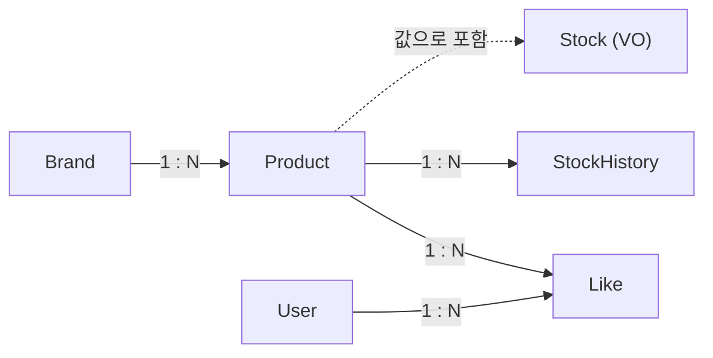
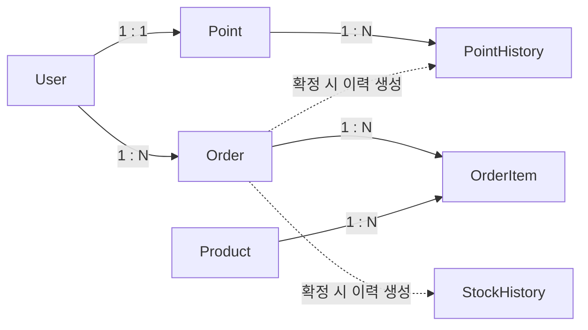
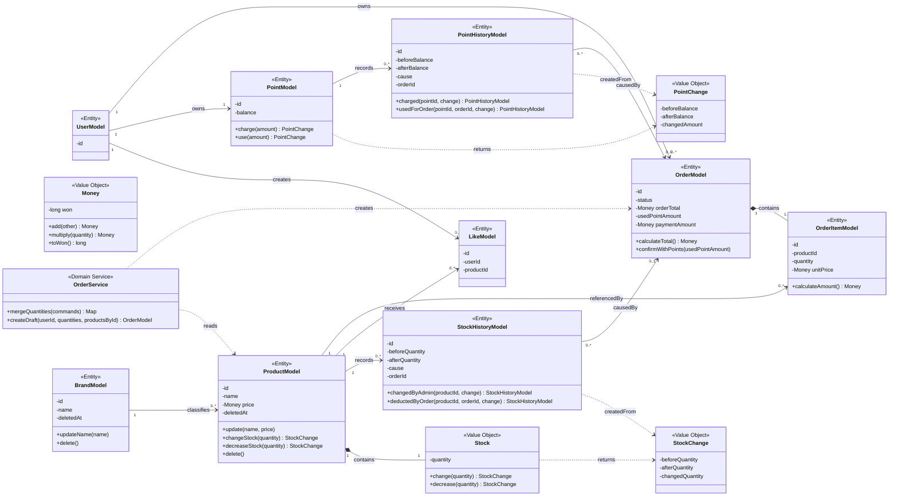

# 3. 도메인 관계

## 3.1 도메인 구성과 주요 모델

시스템의 주요 도메인과 각 도메인에 포함되는 모델은 다음과 같다. 주요 모델에는 Entity뿐 아니라 요구사항에서 독립된 책임이 드러나는 Value Object도 포함하며, 구현 과정에서 생길 수 있는 모든 Value Object를 나열하지는 않는다.

|도메인 영역|주요 모델|담당 영역|
|---|---|---|
|브랜드|`BrandModel`|브랜드 정보와 생명주기|
|상품|`ProductModel`, `Stock`·`StockChange` (VO), `StockHistoryModel`, `LikeModel`|상품 정보, 현재 재고와 변경 이력, 사용자 좋아요 관계|
|사용자|`UserModel`|사용자 식별과 소유 관계의 기준|
|주문|`OrderModel`, `OrderItemModel`|주문 상태, 주문 품목과 결제 정보|
|포인트|`PointModel`, `PointChange` (VO), `PointHistoryModel`|사용자별 포인트 잔액과 변경 이력|

`Money`는 상품 가격과 주문 당시 단가·품목 금액·주문 총액·결제액에 공통으로 사용하는 Value Object다. 별도 식별자 없이 `long` 타입의 원 단위 값을 감싸며, 금액 계산과 표현 범위 검사를 맡는다. 포인트 잔액과 포인트 사용액은 원화 금액과 구분해 `Money`로 표현하지 않는다. 기본형 숫자나 `BigDecimal`을 사용하는 대안과 선택 비용은 [부록 A.15](./appendix-decisions.md#a15-금전적-값의-표현과-숫자-타입)에서 비교한다.

Stock은 Product와 독립된 식별자와 생명주기가 필요하지 않으므로 Product가 소유하는 Value Object로 둔다. 독립 Entity나 단순 수량 필드로 표현하는 대안과 선택에 따른 비용은 [부록 A.5](./appendix-decisions.md#a5-stock-모델링-방식)에서 비교한다. `Money`, `PointChange`, `StockChange`는 생성 후 값이 바뀌지 않는 불변 객체로 두고, 현재 수량을 보유한 `Stock`은 소유자인 Product의 행동을 통해서만 변경한다. 계산값과 변경 결과는 변경되지 않게 유지하면서 재고 변경 규칙은 Stock에 모으기 위한 선택이다. Point와 Stock은 각각 현재 잔액과 재고의 기준이며, PointHistory와 StockHistory는 상태를 계산하기 위한 원장이 아니라 변경 원인과 결과를 남기는 기록으로 사용한다.

현재 이력 조회 API는 없지만, 포인트 충전·사용과 관리자 재고 변경·주문 차감의 원인과 결과를 추적하기 위한 내부 기록으로 PointHistory와 StockHistory를 둔다. 현재 상태만 저장하는 대안과 선택에 따른 비용은 [부록 A.1](./appendix-decisions.md#a1-포인트재고의-현재-상태와-변경-이력)에서 비교한다.

Point와 Stock은 상태 변경 전후 값과 변경량을 각각 `PointChange`, `StockChange`로 반환한다. History는 이 변경 결과와 유스케이스의 원인을 받는 이름 있는 팩토리 메서드로 생성한다. 이 책임 배치의 대안과 비용은 [부록 A.10](./appendix-decisions.md#a10-상태-변경-결과와-history-생성-책임)에서 비교한다.

## 3.2 모델 간 관계와 책임

*그림 3. 상품·좋아요·재고 모델 간 관계*

*그림 4. 주문·포인트·이력 모델 간 관계*

두 그림에 반복 등장하는 User·Product·StockHistory는 각각 동일한 모델이며, 관계별 책임과 규칙은 아래 표에 함께 정리한다. Product는 Stock을 값으로 포함하고, Order는 OrderItem의 생명주기를 소유한다. History는 Product 또는 Point에 속한다. Order와 History 사이의 점선은 소유 관계가 아니라 주문 확정에 따른 변경 원인 관계다. 주문 확정으로 생성된 History는 원인이 된 Order 식별자를 선택적으로 기록한다. 나머지 선은 모델 간 업무 관계를 나타내며, 구체적인 단방향·양방향 참조와 JPA 연관관계 매핑 방식은 구현 단계에서 결정한다.

|관계|책임과 핵심 규칙|
|---|---|
|Brand–Product|Product는 하나의 Brand에 속한다. BrandFacade는 연결된 미삭제 Product의 bulk soft delete와 Brand 자신의 삭제 행동을 같은 트랜잭션에서 조율한다. 활성 Product가 존재한다는 이유로 Brand 삭제를 거절하지 않는다.|
|Product–Stock|Product는 Stock Value Object를 소유한다. Stock은 현재 수량을 관리하고 음수 재고를 허용하지 않으며, 관리자 변경과 주문 확정에 필요한 수량 변경 행동을 제공한 뒤 `StockChange`를 반환한다.|
|Product–StockHistory|StockHistory는 `StockChange`와 변경 원인을 받는 이름 있는 팩토리 메서드로 관리자 재고 변경과 주문 확정의 결과를 기록한다.|
|User–Like–Product|Like는 User와 Product 사이의 관계를 나타낸다. 같은 사용자가 같은 상품에 만든 Like 관계는 중복될 수 없다.|
|User–Point|이번 설계에서는 User 생성 API를 다루지 않는다. 테스트는 fixture 코드로 User와 잔액 0인 Point를 테스트 DB에 함께 저장한다. 따라서 정상적으로 준비된 User는 하나의 Point를 가진다. Point는 현재 잔액과 충전·사용 행동을 관리하고 `PointChange`를 반환하며, 잔액은 0을 허용하지만 음수가 될 수 없다.|
|Point–PointHistory|PointHistory는 소유자인 Point의 식별자와 `PointChange`, 변경 원인을 받는 이름 있는 팩토리 메서드로 포인트 충전과 주문 사용의 결과를 기록한다.|
|User–Order|Order는 소유자인 User를 식별한다. 고객은 자신의 주문만 조회하고 확정할 수 있다.|
|Order–OrderItem|Order는 하나 이상의 OrderItem을 소유한다. OrderItem은 주문 당시 상품, 수량과 단가를 보관하고, Order는 품목 금액의 합으로 주문 총액을 관리한다.|
|Product–OrderItem|OrderItem은 주문한 Product를 참조한다. 상품 정보가 변경되더라도 이미 저장된 주문 품목의 수량과 단가는 변경되지 않는다.|
|Order–StockHistory·PointHistory|주문 확정으로 생성된 StockHistory와 PointHistory는 원인이 된 주문 식별자를 기록한다. 관리자 재고 변경과 포인트 충전으로 생성된 History에는 주문 참조가 없다.|

Order는 `DRAFT`와 `CONFIRMED` 상태를 가진다. 주문 생성 시 `DRAFT`가 되며, 소유자의 주문 확정 과정에서 재고와 포인트 차감이 모두 성공하면 `CONFIRMED`로 전이한다. 이미 `CONFIRMED`인 주문은 다시 확정할 수 없다.

동시 확정에서는 Order 행을 먼저 비관적으로 잠근 뒤 소유권·DRAFT를 확인한다. OrderItem은 생성 이후 변경 운영 경로가 없으므로 별도 쓰기 잠금 없이 같은 트랜잭션에서 복원하고, 생성 시 이미 합산된 Product당 한 품목의 수량을 사용한다. Point와 Product 행도 공통 잠금 계약으로 보호한 현재 상태에서 기존 행동·Change VO·History를 사용한다. 새 version 필드, 독립 Stock Entity, Point 검증 전용 모델이나 별도 동시성 프레임워크는 추가하지 않는다. 자원 획득·차감 순서와 보장 범위는 [4.3](./04-use-cases.md#43-주문-확정)에 둔다.

Order는 주문 총액, 포인트 사용액과 결제액을 구분해 기록한다. 각 금액의 정의와 계산 규칙은 [5.1](./05-api-contract.md#51-공통-계약과-입력-정책)을 따르며, 구분해 저장하는 이유와 비용은 [부록 A.4](./appendix-decisions.md#a4-주문-금액과-결제-정보의-구분)에서 비교한다.

재고·포인트의 유효성이나 주문 상태 전이처럼 모델 자신의 상태로 판단할 수 있는 규칙은 해당 모델이 지킨다. Brand는 자신의 삭제 상태를 변경하고, BrandFacade는 ProductRepository의 일괄 삭제와 Brand 삭제를 조율한다. Product의 bulk 경로는 개별 Entity 행동을 거치지 않으므로 변경 필드와 영속성 처리 조건을 [4.1](./04-use-cases.md#41-브랜드와-연관-상품-일괄-삭제)에 명시한다. OrderConfirmFacade는 Order·Point·Product처럼 여러 비즈니스 애그리게잇의 상태 변경을 조율하되 업무 규칙은 각 모델에 맡긴다. Brand 삭제 책임의 기존 결정과 전제 변경은 [부록 A.9](./appendix-decisions.md#a9-brand-삭제-규칙의-위치)에서 비교한다.

상품 목록·상세 조회는 `ProductFacade`가 읽기 전용 트랜잭션에서 `ProductQueryRepository`를 호출해 `ProductQueryResult`를 반환한다. 이 결과에는 Product가 소유한 Stock의 현재 수량도 포함한다. Product·Brand 조인과 Like 집계는 한 번의 읽기 전용 쿼리로 처리하며, `brandName`과 `likeCount`는 조회 결과의 스칼라 값이지 ProductModel의 상태가 아니다. 조회 결과를 완성하는 책임은 QueryRepository에 두되 API 진입점과 트랜잭션 경계는 ProductFacade로 통일한다. 이 경계의 대안과 비용은 [부록 A.11](./appendix-decisions.md#a11-읽기-전용-조합-조회의-호출-경계)에서 비교한다.

## 3.3 도메인 클래스 설계

다음 다이어그램은 [3.1](./03-domain-model.md#31-도메인-구성과-주요-모델)에서 정의한 주요 모델의 대표 상태와 행동을 표현한다. 구현할 모든 필드와 메서드를 나열하지 않으며, 명시하지 않은 필드의 타입과 JPA 애너테이션·연관관계 매핑은 구현 단계에서 결정한다.

*그림 5. 주요 도메인 모델의 상태·행동과 클래스 관계*

BrandModel은 자신의 삭제 상태를 변경하며 연결 Product 존재 여부로 삭제를 거절하지 않는다. ProductModel의 개별 삭제 행동은 유지하되 Brand 일괄 삭제에서는 Repository의 bulk 경로를 사용한다. ProductModel은 Stock의 행동을 통해 재고 규칙을 지키며, 외부 객체가 수량을 직접 변경하지 못하게 한다. Stock은 수량 변경 전에 유효성을 검사하고 자신의 상태를 바꾼 뒤 불변인 StockChange를 반환한다. PointModel도 잔액 변경 전후 상태를 불변인 PointChange로 반환한다. Money는 원 단위 금액의 덧셈과 수량 곱셈을 담당하고 결과가 `long` 범위를 넘는지 검사하며, 연산 결과를 새 Money로 반환한다. OrderItemModel은 Money로 품목 금액을 계산하고, OrderModel은 이를 합산해 주문 총액을 관리한다. OrderService는 요청 순서를 유지하며 중복 상품 수량을 합치고, OrderFacade가 존재와 활성 상태를 확인해 준비한 상품의 주문 시점 가격으로 OrderItem과 초안 Order를 만든다. OrderModel은 포인트 사용액의 원화 환산 값이 주문 총액과 같은지 검증한 뒤 결제액과 상태를 변경한다. `DRAFT` 상태에서는 포인트 사용액과 결제액이 없으며, `CONFIRMED`로 전이할 때 기록한다.

LikeModel은 UserModel과 ProductModel의 중복될 수 없는 관계를 표현한다. StockHistoryModel과 PointHistoryModel은 변경 결과를 받는 이름 있는 팩토리 메서드로 생성되어 필드 구성 규칙을 한곳에 모은다. 호출자는 관리자 변경·충전·주문 사용과 같은 유스케이스의 원인을 선택하고 생성된 History를 저장한다. 두 History의 `orderId`는 주문 확정으로 생성된 경우에만 존재하며, 관리자 재고 변경과 포인트 충전으로 생성된 이력에는 존재하지 않는다.

## 3.4 삭제 정책

**선택한 정책**

Brand와 Product는 삭제 시각을 기록하는 Soft Delete 방식을 사용한다. 기존 주문·좋아요·이력과의 관계를 보존하면서, 삭제된 데이터를 고객 조회와 신규 주문에서 제외하기 위해서다. Brand 삭제는 재고 0을 포함한 연결 미삭제 Product의 일괄 삭제를 같은 트랜잭션에서 수행한다. 다른 Brand·Product와 과거 주문은 변경하지 않는다.

Like는 Hard Delete한다. Like는 그 자체로 보존해야 할 거래·이력 자원이 아니라 사용자–상품 사이의 현재 관계이며, 같은 사용자–상품 Like가 하나만 존재한다는 제약을 유니크 제약(`uk_like_user_product`)으로 지키기 때문이다. 현재 유니크 제약을 그대로 둔 채 Soft Delete를 적용하면 취소한 관계가 행으로 남아 재등록 시 충돌하고, 좋아요 수 집계와 내 좋아요 목록 조회에 `deleted_at IS NULL` 조건을 추가로 관리해야 한다. 취소 이력이 필요해지면 Like 자체를 Soft Delete로 바꾸기보다 별도의 이력 테이블을 검토한다.

Brand 일괄 삭제의 bulk 구현 원칙과 동시성 보장 범위는 [4.1](./04-use-cases.md#41-브랜드와-연관-상품-일괄-삭제)에 둔다. 관리자 조회에서 삭제된 데이터를 포함할지와 이미 삭제된 대상에 대한 요청 처리는 [5장](./05-api-contract.md#5-api-계약과-주요-규칙)의 API 계약과 주요 규칙에서 정한다.

Brand·Product의 삭제 방식에 대한 대안과 선택에 따른 비용은 [부록 A.2](./appendix-decisions.md#a2-브랜드상품-삭제-정책)에서 비교한다.
