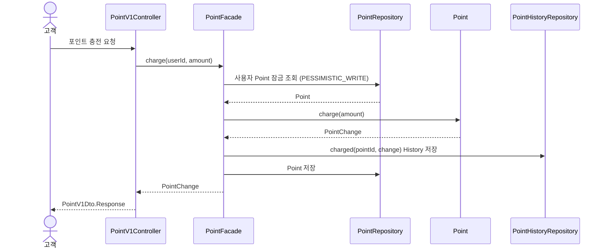
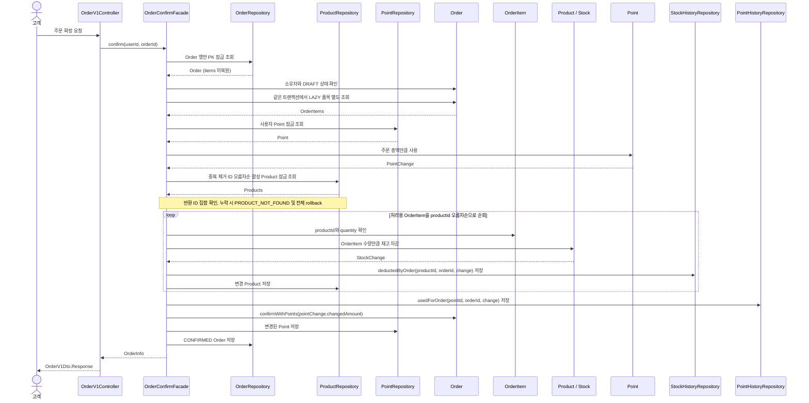

# 4. 대표 흐름

## 4.1 브랜드와 연관 상품 일괄 삭제

기존에 활성 상품이 있으면 브랜드 삭제를 거절하던 계약을, 브랜드와 연결 상품을 함께 삭제하는 계약으로 변경한다. 브랜드 삭제 시 연결된 미삭제 상품을 단일 bulk UPDATE로 Soft Delete하고, 브랜드 삭제와 하나의 트랜잭션으로 묶는다. 상품별 Entity 조회와 개별 UPDATE 반복을 피하기 위해 bulk 방식을 선택한다.

2026-10-07 브랜드 일괄 삭제의 구현·검증을 완료했다. 아래 계약과 검증 기준은 이후 회귀에도 유지한다. 실행계획 확인 범위는 4.1.6, 완료 근거는 4.1.7에 구분해 기록한다. 4.2~4.3의 공통 잠금·주문 동시성도 이후 구현·검증했으며 완료 근거는 4.3.5에 둔다.

### 4.1.1 대상과 보존 범위

상품 삭제 조건은 `brand_id = 요청한 brandId AND deleted_at IS NULL`이다. 재고가 0인 상품도 포함하며, 이미 삭제된 상품의 삭제·수정 시각과 다른 브랜드·상품은 변경하지 않는다. 연결 상품이 없는 활성 브랜드도 정상 삭제한다. 없는 브랜드와 이미 삭제된 브랜드는 상품 변경 전에 `BRAND_NOT_FOUND`로 거절한다.

상품에서는 `deleted_at`과 `updated_at`만 변경한다. 기존 재고·가격·생성 시각, Like 관계, StockHistory와 과거 Order·OrderItem의 품목·수량·단가·총액·포인트 결제 결과는 유지한다. 삭제는 재고 조정이나 거래 기록 삭제가 아니다.

### 4.1.2 호출 순서와 트랜잭션

```text
BrandAdminV1Controller.delete
  → Spring Transaction Proxy
    → BrandFacade.delete @Transactional
        1. BrandRepository.findActive(brandId)
           → 없거나 이미 삭제됐으면 BRAND_NOT_FOUND
        2. ProductRepository.softDeleteAllActiveByBrandId(brandId, deletedAt)
           → 단일 UPDATE 실행, 변경 행 수 0도 정상
        3. Brand.delete()
        4. BrandRepository.save(brand)
    → 정상 처리 후 commit 완료 시 Brand와 Product 전체 확정
    → commit 전 업무 거절·중간 처리 RuntimeException 전파 시 전체 rollback
```

`BrandFacade.delete()`를 기존 진입점과 하나의 쓰기 트랜잭션 경계로 유지한다. domain의 `ProductRepository`에 브랜드별 일괄 삭제 포트를 선언하고 infrastructure에서 bulk UPDATE를 구현한다. Facade에 JPQL·SQL을 두지 않고, 새 Domain Service나 별도 Removal Facade를 추가하지 않는다. Product별 `REQUIRES_NEW`, 단계별 독립 commit, 일부 성공 응답과 예외 삼키기는 사용하지 않는다.

commit 중 통신 장애로 완료 여부를 확인하지 못한 경우까지 오류 응답만으로 rollback을 단정하지 않는다. 이 한계의 기록은 장애 실험·복구 기능을 추가하라는 요구가 아니며, [5.1의 공통 실패 계약](./05-api-contract.md#51-공통-계약과-입력-정책)을 따른다.

확정한 Repository 계약은 `int softDeleteAllActiveByBrandId(Long brandId, ZonedDateTime deletedAt)`이다. domain의 `ProductRepository`에 선언하고, infrastructure의 `ProductRepositoryImpl`이 `ProductJpaRepository`의 `@Modifying` native SQL UPDATE에 위임한다. 반환값은 변경된 상품 수이며, 사전에 조회한 상품 수와 같아야 한다는 조건이나 최소 1개라는 조건은 두지 않는다.

기존 `BrandModel.delete(boolean hasActiveProducts)`의 상품 존재 여부 기반 거절 규칙은 제거하고, Brand 삭제는 상속한 `BaseEntity.delete()`를 사용한다. 단순히 부모 행동을 호출하기 위한 override는 추가하지 않는다. 삭제 거절을 위해 사용하던 `ProductRepository.existsActiveByBrandId()`와 대응하는 infrastructure·JPA Repository 메서드는 다른 사용처가 없다면 함께 제거한다. `BRAND_HAS_ACTIVE_PRODUCTS`도 변경 후 사용처가 없다면 제거하되, 부록의 과거 결정 설명은 보존한다. `BrandFixture`의 `delete(false)` 호출은 `delete()`로 변경하며, fixture는 데이터 준비 역할을 유지하고 일괄 삭제 유스케이스를 재현하지 않는다.

```sql
UPDATE product
   SET deleted_at = :deletedAt,
       updated_at = :deletedAt
 WHERE brand_id = :brandId
   AND deleted_at IS NULL;
```

상품들의 삭제·수정 시각에는 한 번 생성한 값을 사용한다. Brand는 기존 Entity 삭제 행동을 사용하며, Brand와 Product의 삭제 시각이 정확히 같아야 한다는 계약은 두지 않는다.

### 4.1.3 bulk와 영속성 컨텍스트

bulk UPDATE는 개별 `Product.delete()`, 변경 감지와 `@PreUpdate` 콜백을 거치지 않는다. 따라서 기존 `BaseEntity` 콜백에 맡기지 않고 `updated_at`도 쿼리에 명시한다. 상품별 업무 행동·검증·이벤트가 삭제에 추가되면 bulk 경로에서 이를 어떻게 보존할지 다시 검토한다.

이 흐름에서는 삭제 대상 Product Entity를 미리 조회하거나 bulk 이후 관리 객체를 계속 사용하지 않는다. Brand는 bulk 전에 조회하되 자신의 삭제 변경은 bulk 이후에 수행한다. 다만 이 순서만으로 다른 호출 경로에서 이미 적재한 Product까지 자동 동기화된다고 보장하지는 않는다.

bulk 전에 필요한 미반영 변경이 있다면 먼저 flush하고, 이후 영향을 받은 관리 객체를 다시 사용해야 한다면 재조회·refresh 또는 영속성 컨텍스트 정리를 판단한다. 무조건 `clear()`하면 아직 flush하지 않은 변경을 잃고 Brand도 분리될 수 있으므로 자동 clear를 기본 정책으로 두지 않는다. 현재 구현의 `@Modifying`은 `flushAutomatically`·`clearAutomatically`를 켜지 않으며 운영 흐름에 명시적 flush·clear를 추가하지 않았다. bulk 영속성 컨텍스트 테스트에서는 bulk 전에 적재한 Brand·Product가 계속 관리 상태이고 Product 객체가 자동 동기화되지 않는 점을 확인했다.

### 4.1.4 삭제 이후 사용 제한과 조회 방어

일괄 삭제된 상품은 고객·관리자 목록과 상세, 새 Like, 내 Like 목록, 새 주문, 관리자 수정·재고 변경·재삭제 대상에서 제외한다. 삭제 전에 만든 DRAFT 주문도 확정 시 잠금 조회로 상품 상태를 다시 확인해 하나라도 삭제됐다면 기존 `PRODUCT_NOT_FOUND`로 거절한다. 주문 확정은 4.3의 `Order → Point → Product` 순서를 따르므로 Point 검증·사용이 먼저 수행될 수 있지만, 실패 요청의 포인트·재고·주문·History 변경은 전체 rollback한다. Point 부족 등과 상품 삭제가 함께 있는 경우의 복합 오류 우선순위는 별도 계약으로 보존하지 않는다. 기존 자신의 Like 취소와 과거 주문 조회는 유지한다.

현재 `ProductQueryRepositoryImpl`은 상품 조회와 관련 count 쿼리에 Product와 Brand 양쪽의 `deletedAt IS NULL` 조건을 이미 적용한다. 이 조건을 유지하고 고객·관리자 상품 목록·상세와 내 Like 목록의 비노출을 검증한다. 삭제가 commit된 이후 시작된 새 조회에서, 경쟁으로 뒤늦게 등록된 상품도 삭제 Brand 조건으로 숨기는 방어 수단이다. 기존 스냅샷을 읽는 진행 중 트랜잭션에 즉시 반영된다는 보장은 하지 않는다.

조회 방어는 상품 행 자체의 삭제를 대신하지 않는다. 현재 명령용 `ProductRepository.findActive()`와 `findAllActiveByIds()`는 Product 자신의 삭제 여부만 확인하므로, `삭제 Brand + 미삭제 Product`가 남으면 화면에서 숨겨져도 상품 ID 기반 명령에서 사용할 가능성이 있다. 이번에는 이 한계를 기록하며 명령 경로의 Brand 조건 추가나 동시 등록 차단까지 구현한 것으로 간주하지 않는다.

### 4.1.5 동시성 범위와 향후 대안

브랜드 일괄 삭제 경로에는 별도의 명시적 잠금을 추가하지 않는다. 보장 범위는 한 삭제 요청에서 bulk UPDATE가 변경한 Product와 Brand 변경의 원자성이다. 4.3의 주문·개별 상품 변경 잠금 규칙을 이 bulk 경로까지 확장한 것은 아니다. Brand 삭제와 상품 등록·수정·재고 변경·DRAFT 확정·Like 또는 주문 생성 간 경쟁의 정합성은 별도 확장 범위다.

MySQL InnoDB의 REPEATABLE READ를 전제로, 일반 SELECT의 MVCC 스냅샷과 UPDATE의 배타적 잠금을 구분한다. bulk UPDATE는 사용 인덱스와 검색 범위에 따라 record·next-key/gap lock으로 INSERT를 대기시킬 수 있다. 그러나 잠금 해제 후 INSERT가 진행될 수 있으므로, 벌크 잠금 자체가 삭제된 Brand의 상품 등록을 거부하는 업무 규칙은 아니다. 실제 격리 수준과 실행계획은 구현·실험 시 확인한다.

```text
TX B: 활성 Brand 확인 후 상품 등록 준비
TX A: Product bulk 삭제, Brand 삭제
TX B: INSERT 시도 → 잠금과 겹치면 대기
TX A: commit 및 잠금 해제
TX B: Brand를 다시 검사하지 않고 INSERT·commit → 미삭제 상품 잔존 가능
```

이 경쟁 자체를 팬텀 리드로 부르지 않는다. 같은 조건의 반복 조회 결과가 달라지는 읽기 현상과, 삭제·등록의 업무 규칙이 엇갈리는 문제를 구분한다. RR의 일반 SELECT와 UPDATE가 대상으로 삼는 데이터도 반드시 같지는 않다.

다음 두 대안은 검토 후보로만 남기며 이번에는 구현하지 않는다.

- 사후 보정 배치: 삭제 Brand 아래의 미삭제 Product를 찾아 삭제한다. 보정 전 사용 가능성을 막지는 못하며, 배치를 구현하기 전에는 자동 복구도 보장하지 않는다.
- 공통 Brand 잠금: 상품 등록과 Brand 삭제 양쪽이 같은 Brand 행을 `FOR UPDATE`로 조회하고, 잠금을 획득한 뒤 최신 삭제 여부를 검사한다. 기존 Product 행만 잠그거나 삭제 경로만 Brand를 잠그는 것으로 새로운 상품 INSERT를 업무적으로 차단했다고 보장하지 않는다.

### 4.1.6 인덱스와 설계 재검토 기준

이번 구현에 `product(brand_id)` 단독 인덱스를 추가한다. 목적은 bulk UPDATE에서 해당 Brand의 상품을 찾는 탐색 비용을 줄이는 것이다. `brand_id`로 대상을 찾고 `deleted_at IS NULL`을 추가 검사한다. 인덱스는 `ProductModel`의 `@Table(indexes = …)`에 `@Index(columnList = "brand_id")`로 선언하고, local·test의 기존 `ddl-auto: create` 설정에 따른 스키마 생성으로 반영한다. 새 마이그레이션 체계는 도입하지 않는다. 어노테이션 선언만으로 스키마 생성을 하지 않는 기존 DB까지 변경된다고 보장하지 않으며, 동일한 인덱스를 중복 생성하지 않는다. 실제 사용 여부는 실행계획으로 확인한다.

2026-10-07 브랜드 bulk의 EXPLAIN은 정상 삭제·rollback 증명이 아니라 `brand_id` 인덱스 선택의 보조 근거로 확인했다. 테스트에서 수집한 native bulk SQL·바인딩을 기준으로, 사용자가 기존 DB `loopers`의 버전·격리 수준·DDL·인덱스·건수를 확인한 뒤 `brand_id = 1 AND deleted_at IS NULL` 조건의 UPDATE에 EXPLAIN을 직접 실행했다. 당시 product는 0건이었고 결과는 `type=range`, `key=IDX1td6gorl25rsvufiiive2svlx`, `rows=1`, `Extra=Using where`였다. `rows=1`은 추정치이며 실제 대상 건수가 아니다.

테스트 DB의 단독 인덱스 생성·중복 없음과 실제 데이터의 bulk 동작 테스트를 함께 근거로 삼아, 사용자 결정으로 이번 브랜드 bulk의 인덱스 실행계획 확인 항목을 충족한 것으로 인정했다. 제안한 5,000건 삽입·ANALYZE·추가 EXPLAIN은 진행하지 않았으며, 데이터가 있는 조건의 bulk 실행계획·탐색 효율·성능은 미검증이다. 두 DB의 MySQL 버전과 격리 수준은 8.0.46·REPEATABLE-READ로 같지만, 사용자 테이블 collation은 utf8mb4_0900_ai_ci, Testcontainers 서버 옵션은 utf8mb4_general_ci이며 테스트 테이블의 실제 collation은 미확인이다.

`(brand_id, deleted_at)` 복합 인덱스는 필수가 아니다. 이미 삭제된 상품이 많이 누적되어 불필요한 탐색이 커지면 비교한다. 대부분 미삭제라면 탐색 감소 이점이 작을 수 있고, 복합 인덱스의 공간 및 삭제 시 인덱스 갱신 비용도 고려한다.

이번 실습에서는 성능 측정을 필수 검증 범위에 포함하지 않는다. commit을 포함한 삭제 API 응답시간 2초 이내, 3초 초과의 반복은 향후 설계 재검토를 위한 잠정 참고 기준으로만 둔다. 측정으로 도출한 수치나 성능 보장이 아니며, 운영 요구와 향후 측정 결과에 따라 조정한다. API timeout·거절 조건이나 자동 비동기 전환 규칙으로 사용하지 않는다.

- 응답 지연이 반복되거나 다른 요청의 잠금 대기가 커지면 실행계획·탐색량·인덱스·잠금 대기를 먼저 확인한다.
- 1,000개 같은 임의의 상품 수 API 상한은 추가하지 않는다. 향후 성능 측정 시 상품 수·전체 테이블 규모·동시 요청·실행 환경을 함께 기록한다.
- 개선 후에도 동기 처리가 적절하지 않으면 비동기 또는 분할 배치를 검토한다. 비동기는 DB 작업 자체를 줄이지 않으며, 분할 commit은 전체 원자성 계약을 바꾸므로 삭제 진행 상태·응답 의미·재시도와 실패 처리까지 별도 설계한다.

### 4.1.7 검증 계획

실습의 핵심 검증은 정상 일괄 삭제와 중간 실패 시 전체 rollback이다. 기존 검증은 새 계약에서도 유효한 경우에만 유지한다. 브랜드 이름 검증·등록·조회·수정, 연결 상품 없는 Brand 삭제, 연결 상품이 모두 삭제된 Brand 삭제, 다른 Brand·Product 보존, 없는·이미 삭제된 Brand 거절은 유지한다. `활성 Product가 있으면 Brand 삭제 거절`처럼 사라진 규칙을 검증하는 도메인·통합·API 테스트는 제거한다. 기존 테스트마다 다른 테스트를 대응시켜 대체할 필요는 없으며, 새 일괄 삭제와 rollback 계약은 별도로 검증한다. 이는 폐기된 규칙의 검증을 정리하는 것이며, 새 설계에서도 유효한 테스트나 lint·ArchUnit 규칙을 완화하는 것은 아니다.

정상 일괄 삭제 테스트에서는 재고 0을 포함한 연결 미삭제 Product 전체와 Brand의 삭제, 연결 상품 없는 Brand 성공, 없는·삭제된 Brand 오류, 이미 삭제된 상품의 삭제·수정 시각 보존, 다른 Brand·Product와 과거 주문 보존을 확인한다.

rollback 통합 테스트는 Brand와 연결 Product 2개(하나는 재고 0), 다른 Brand의 Product와 과거 주문을 준비하고 먼저 commit한다. 테스트 전체를 하나의 부모 트랜잭션으로 감싸지 않으며, 실제 Spring bean의 `BrandFacade.delete()`를 프록시를 통해 호출해 유스케이스 트랜잭션이 시작·종료되게 한다.

rollback 테스트는 실제 MySQL에서 Product bulk UPDATE를 실행한 뒤, 테스트 구성의 다음 Brand 저장 경계에서 RuntimeException을 유발한다. 전체 Repository를 mock하지 않고, bulk 쿼리를 생략하거나 실제 SQL 실행 전에 실패시키지 않는다. 운영 코드에 테스트용 실패 분기·sleep·barrier를 넣지 않는다.

Facade 트랜잭션이 끝난 뒤 새로운 트랜잭션·영속성 컨텍스트에서 Brand와 모든 대상 Product의 삭제·수정 시각 등 상태가 작업 전과 같은지 확인한다. 활성 데이터 조회만으로 판단하지 않고 삭제 행도 조회할 수 있는 경로로 변경 전후 상태를 비교한다. 다른 대상과 과거 주문도 유지되고 예외가 호출자에게 전파되어야 한다. 단순 `save()` 호출 횟수나 같은 관리 객체의 값은 rollback 증거로 사용하지 않는다.

HTTP 테스트와 중간 실패 rollback 통합 테스트의 역할은 구분한다. HTTP에서는 관리자 삭제 성공의 `200`과 데이터 없는 성공 응답(내부 `data` 값은 null이며 실제 JSON에서는 생략), 없는·이미 삭제된 Brand의 `404 BRAND_NOT_FOUND`, 일반 사용자·익명 요청의 `403`을 실제 DB 결과와 연결해 확인한다. 성공 시 대상 전체가 삭제되고, 거절 시에는 Brand·Product가 변경되지 않아야 한다. 관리자 변경 요청과 역할 거절 테스트에는 기존 정책에 따라 유효한 CSRF 입력을 보낸다. 실패 주입에 의한 전체 rollback은 위 실제 MySQL Facade 통합 테스트로 증명하며, HTTP 계층에서 같은 실패 주입을 반복하는 것을 필수로 두지 않는다.

변경 영향에 대한 회귀 테스트로 삭제 이후 조회·사용 제한, 기존 Like 취소와 DRAFT 확정 거절을 검증한다. 영향받는 브랜드·상품·포인트·주문 테스트와 기존 lint(Checkstyle)·ArchUnit도 실행한다.

브랜드 삭제와 상품 등록의 동시 실행 테스트는 선택 확장이다. 4.1.5의 사후 보정 배치와 공통 Brand 잠금은 향후 대안으로 유지하되, 이번에 구현하거나 검증한 것으로 간주하지 않는다.

2026-10-07 완료 근거: 정상 bulk·보존·영속성·인덱스 확인에 이어, `BrandRemovalTransactionIntegrationTest`의 전용 `BrandRepository` spy에서 현재 트랜잭션의 실제 DB 조회로 삭제 상품 총 3건을 확인한 뒤 RuntimeException을 주입했다. 준비 데이터는 기존 삭제 1건과 bulk 대상 미삭제 2건이었다. 검증용 native SELECT 직전의 AUTO flush로 Brand UPDATE도 전송됐으며, 이는 테스트 조회가 유발한 동작이다. Facade 종료 후 새 조회에서 Brand·Product의 삭제/수정 시각 등 상태와 과거 주문·Like가 작업 전과 같음을 확인했다. 삭제 후 회귀에서는 사용 제한·과거 주문 보존·DRAFT 확정 거절과 HTTP·접근 경계를 확인했다. 브랜드 인계 시점의 `cleanTest check` 결과는 326건·실패/오류/skip 0, Checkstyle·ArchUnit 통과다. 이후 주문·동시성과 정리 보호 보완을 포함한 최종 결과는 4.3.5에 둔다.

## 4.2 포인트 충전

포인트 충전은 Spring 프록시를 통과하는 public `PointFacade.charge()`의 `@Transactional`이 유스케이스 전체를 관리한다. 주문 결제와 같은 Point 행을 변경하므로, 첫 Entity 조회부터 사용자별 Point를 비관적 쓰기 잠금으로 복원하고 잠금 획득 후의 잔액에서 충전한다. PointHistory는 Point 변경에 부속된 감사 기록으로 같은 트랜잭션에서 저장하며 잠금은 commit 또는 rollback까지 유지한다. 잔액 조회의 기존 비잠금 경로는 유지한다.

공통 요청자 식별 단계에서 `UserFacade`가 테스트 DB에 준비된 User의 존재를 확인한 뒤, PointFacade는 해당 User와 함께 fixture로 준비된 Point를 조회한다. 존재하는 User에게 Point가 없는 경우에는 최초 충전으로 간주해 새로 생성하지 않고 비정상적인 데이터 상태로 처리한다. 구체적인 오류 응답은 [5장](./05-api-contract.md#5-api-계약과-주요-규칙)의 API 계약에서 정한다.



*그림 6. 포인트 충전 객체 협력 흐름*

Point는 충전 금액이 양수인지 확인하고 잔액을 증가시킨 뒤 변경 전후 잔액과 충전액을 담은 PointChange를 반환한다. PointFacade는 `PointHistoryModel.charged(pointId, change)`로 충전 이력을 생성해 저장하고 domain 타입인 PointChange를 Controller에 반환한다. Controller는 충전 후 잔액을 `PointV1Dto.Response`로 변환한다. fixture에서 Point에 설정한 초기 잔액 0은 충전이나 사용에 따른 변경이 아니므로 PointHistory를 생성하지 않는다. Point 변경과 History 저장은 같은 트랜잭션에서 처리하며, 입력이나 저장에 실패하면 잔액과 History는 모두 변경되지 않는다.

## 4.3 주문 확정

2026-10-06 확정한 3주차 설계다. 최초 주문 확정의 전체 원자성과 동일 Order·Point·Product를 변경하는 요청의 경쟁을 함께 다룬다. 설계 확정과 전체 구현·검증 완료는 구분한다. Product 잠금 조회의 실행계획 확인 근거는 4.3.3에 기록하며, 그 결과만으로 주문·동시성 전체의 검증 완료를 뜻하지 않는다.

주문 생성은 이 흐름보다 먼저 완료되어 있으며, 고객이 소유한 `DRAFT` 주문이 존재한다고 가정한다. 포인트 충전과 주문 확정은 서로 다른 API 요청이자 별도의 트랜잭션이다. 따라서 주문 확정이 실패하더라도 앞서 완료된 포인트 충전 결과는 유지된다.

주문 확정은 [5.1](./05-api-contract.md#51-공통-계약과-입력-정책)의 전액 포인트 결제 규칙을 따른다. 주문 총액 전부를 포인트로 결제하며, 주문 확정 요청에서 사용할 포인트를 별도로 입력하지 않는다. 따라서 포인트 사용액과 결제액은 주문 총액과 같으며, 고객의 포인트 잔액이 주문 총액보다 적으면 확정을 거절한다.

주문 생성은 `OrderFacade`가 Product 조회, 요청한 모든 Product의 존재·활성 상태 확인, Order 저장과 트랜잭션을 담당하고, 순수 Domain Service인 `OrderService`가 중복 품목 병합과 준비된 상품의 주문 시점 가격으로 초안 Order를 만드는 규칙을 담당한다. 주문 확정은 별도 처리 흐름과 변경 범위를 가진 `OrderConfirmFacade`가 Order, Product·Stock, Point의 변경 순서와 전체 트랜잭션을 관리한다. 두 Facade는 서로 호출하지 않고 필요한 Repository와 도메인 객체에 직접 의존한다.



*그림 7. 주문 확정 객체 협력 흐름*

### 4.3.1 진입점과 전체 원자성

현재 구현의 호출 경계는 다음과 같다. 잠금 조회는 domain Repository의 `findForUpdate`, `findByUserIdForUpdate`, `findAllActiveByIdsForUpdate`와 infrastructure의 비관적 쓰기 잠금 쿼리로 구현했다.

```text
CustomerIdArgumentResolver → UserFacade.requireExists (별도 읽기 트랜잭션 종료)
OrderV1Controller.confirm
  → Spring Transaction Proxy
    → public OrderConfirmFacade.confirm @Transactional
        1. Order 단독 PK 잠금 조회 → requireOwnedBy → requireConfirmable
        2. 같은 트랜잭션에서 저장 items 별도 복원
        3. 사용자 Point 잠금 조회 → point.use(orderTotal)
        4. 중복 제거 productId 오름차순 활성 Product 잠금 조회 → 누락 검증
        5. 처리용 품목 ID 오름차순 재고 차감 → StockHistory와 Product 저장
        6. PointHistory 저장 → order.confirmWithPoints → Point와 Order 저장
        7. 트랜잭션 안에서 OrderInfo 복사
    → 정상 처리 후 commit 완료 시 전체 변경 확정
    → commit 전 업무 거절·중간 처리 RuntimeException 전파 시 전체 rollback
```

유효한 요청자의 존재는 공통 resolver가 확인하고, 실제 주문 소유권과 DRAFT는 잠근 Order에서 확인한다. 없는·다른 사용자 주문은 `ORDER_NOT_FOUND`, 이미 확정된 주문은 `ORDER_NOT_CONFIRMABLE`이다. 동일 주문의 동시 확정은 성공 1건만 허용하며 나머지는 대기 후 기존 상태 오류로 거절한다. 새 요청 키나 성공 응답 재사용은 추가하지 않는다.

재고 차감에 사용하는 상품과 수량은 확정 요청에서 다시 받지 않고 저장된 OrderItem의 `productId`와 `quantity`를 기준으로 한다. 생성의 `OrderService.mergeQuantities()`가 각 입력의 양수·합산 overflow를 검증해 Product당 하나의 품목을 저장하므로, 확정에서 다시 합산하거나 비정상 중복 품목을 복구하는 책임은 추가하지 않는다. 저장 단가·품목 금액·총액은 현재 상품 가격으로 재계산하지 않는다.

Order는 요청자가 주문 소유자인지와 현재 상태가 `DRAFT`인지 확인한다. Point는 잔액이 주문 총액 이상인지 확인한 뒤 주문 총액을 먼저 차감하고 PointChange를 반환한다. 이후 각 OrderItem에 대응하는 Product와 Stock이 상품의 주문 가능 여부와 재고를 확인하고 수량을 차감한 뒤 StockChange를 반환한다. OrderConfirmFacade는 각 변경 결과에 주문 식별자를 더해 `PointHistoryModel.usedForOrder(pointId, orderId, change)`와 `StockHistoryModel.deductedByOrder(productId, orderId, change)`로 이력을 생성하고 저장한다. Order는 PointChange의 포인트 사용액이 주문 총액과 같은지 확인하고, 같은 금전적 가치를 결제액으로 기록한 뒤 `CONFIRMED`로 전이한다. OrderConfirmFacade는 트랜잭션 안에서 확정된 주문·품목·결제 정보를 `OrderInfo`로 구성해 반환하고, Controller는 이를 `OrderV1Dto.Response`로 변환한다. 이 상태 전이가 주문 확정과 결제의 성공 결과를 나타낸다. Point와 Stock의 처리 순서를 선택한 근거와 비용은 [부록 A.3](./appendix-decisions.md#a3-주문-확정의-포인트재고-처리-순서)에서 비교한다.

주문이 없거나 요청자가 소유자가 아닌 경우, 주문이 이미 확정된 경우, 상품이 없거나 삭제된 경우, 재고 또는 포인트가 부족한 경우에는 확정을 거절한다. commit 전 업무 거절 또는 중간 검증·저장의 RuntimeException이 전파되면 재고·포인트·History·주문 상태 변경을 모두 롤백한다. 앞서 별도 트랜잭션으로 완료된 포인트 충전은 이 롤백에 포함되지 않는다. 이 rollback은 설계 계약이며, 실제 SQL 이후 실패 주입과 새 조회로 계약의 이행을 확인했다(4.3.5).

Facade가 시작한 같은 물리 트랜잭션에 모든 변경을 포함한다. 자기 호출된 하위 메서드의 애너테이션에 새 경계를 기대하지 않고, 다른 Facade 호출·예외 삼키기·상품별 또는 단계별 독립 commit·`REQUIRES_NEW`를 추가하지 않는다. 기존 `CoreException`은 RuntimeException이며 예외 응답 변환은 Facade 프록시 종료 뒤 `ApiControllerAdvice`가 담당한다. History는 보호된 현재 상태의 Change VO와 원인 식별자로 생성하는 기존 행동을 유지한다.

### 4.3.2 보호 대상·공통 순서·조회 경계

주 전략은 Order·Point·Product 행의 비관적 쓰기 잠금(`PESSIMISTIC_WRITE`)이다. Stock은 Product에 포함된 VO이며 별도 재고 테이블·잠금 모델을 도입하지 않는다.

|변경 경로|잠금 대상과 획득 순서|
|---|---|
|`OrderConfirmFacade.confirm`|`Order → Point → Product(ID 오름차순)`|
|`PointFacade.charge`|해당 사용자 Point 하나|
|`ProductFacade.update/delete/changeStock`|해당 Product 하나; 이후 Point·Order 획득 없음|

Order는 EntityGraph와 잠금 조회를 결합하지 않고 행만 PK로 잠근 뒤, 소유권·상태를 확인하고 LAZY items를 같은 트랜잭션에서 별도 SELECT로 복원한다. 현재 품목 변경 운영 경로가 없어 Item 쓰기 잠금은 필요하지 않다. 조인 잠금 범위의 불확실성을 피하고 고정 1회 추가 SELECT 비용을 수용한다. EntityGraph 자체는 잠금 범위 명세가 아니므로 실제 Order 단독 잠금 SQL과 품목 복원 SQL을 확인한다.

Point를 잠근 직후 기존 `point.use(orderTotal)`로 부족 판단과 변경을 수행한다. 부족 요청이 공유 Product 잠금을 얻기 전에 끝나며, Point를 기다리는 동안 인기 Product를 보유하지 않는 것이 선택 이유다. 반대로 Product 대기 동안 자신의 Point를 보유하므로 같은 사용자의 충전·다른 주문은 더 기다릴 수 있다. 별도 Point 검증 전용 행동은 도입하지 않는다.

Product는 잠금 조회의 `deletedAt IS NULL` 조건과 반환 ID 집합을 요청한 중복 제거 ID 집합과 비교해 누락을 `PRODUCT_NOT_FOUND`로 거절한다. 모든 대상 보호 후 처리용 품목 목록을 ID 오름차순으로 순회해 재고·History·저장을 처리한다. 수정 불가 `OrderModel.getItems()`나 DB 복원 순서에 의존하지 않으며 저장·응답 품목 순서의 새 계약은 추가하지 않는다. 이 처리 순서가 Hibernate의 모든 flush SQL 순서를 보장하는 것은 아니다.

상품 수정·삭제는 재고 변경 목적이 아니더라도 같은 Product Entity를 저장한다. 오래된 Entity의 UPDATE 컬럼 집합에 안전성을 맡기지 않고 첫 조회부터 같은 행을 잠근다. 메타데이터 변경도 주문과 직렬화되는 비용을 수용한다. `changeStock`은 보호된 현재 재고를 기준으로 최종 수량을 설정하고 ADMIN_CHANGE History를 같은 트랜잭션에 저장한다. 상품 수정·삭제는 재고 History를 추가하지 않는다.

일반 읽기와 잠금 조회 포트는 분리한다. 상세·목록, DRAFT 생성, 좋아요의 Product 확인과 잔액 조회에 기존 비잠금 메서드를 유지하며 기존 읽기를 일괄 잠금으로 바꾸지 않는다. 변경 경로는 일반 Entity를 먼저 읽고 나중에 잠금만 붙이지 않고 첫 Entity 조회부터 잠근 현재 상태를 사용한다. 잠금은 Repository 반환 시 해제되는 것이 아니라 바깥 Facade 트랜잭션 종료까지 유지한다. 새 계층·전략 프레임워크 없이 domain Repository에 계약을 선언하고 infrastructure에서 구현한다.

### 4.3.3 여러 Product 잠금 쿼리의 구현 선택 기준

기본은 활성 조건의 `IN (...) ORDER BY id ASC` 단일 잠금 조회다. 한 번의 DB 왕복과 기존 일괄 조회 구조를 유지하되, 결과 정렬만으로 내부 잠금 획득 순서까지 보장된다고 단정하지 않는다.

|단계|확인·선택 기준|
|---|---|
|1. 일반 단일 쿼리|실제 SQL의 활성 조건·IN·ORDER BY id ASC·잠금 절 확인. EXPLAIN에서 PRIMARY 접근·오름차순 스캔 근거·별도 filesort 없음 확인|
|2. PK 힌트 단일 쿼리|1에서 예상한 접근 근거를 얻지 못하면 infrastructure native SELECT에 MySQL `FORCE INDEX (PRIMARY)` 적용 후 같은 기준으로 확인|
|3. ID별 PK 조회|2에서도 근거를 얻지 못하면 중복 제거 ID를 오름차순으로 개별 잠금 조회. 같은 Facade 트랜잭션과 활성·누락 검증 유지|

일반 EXPLAIN과 필요 시 `EXPLAIN FORMAT=TREE`로 접근 방식·정렬 노드·역방향 스캔 여부를 함께 본다. `key = PRIMARY` 하나만으로 통과시키지 않는다. 대표 단건·다건 ID 집합의 SQL·DB 버전·실제 격리 수준·선택 단계·계획을 기록하며 EXPLAIN ANALYZE는 필수가 아니다. 힌트 SELECT도 같은 영속성 컨텍스트의 관리 Product를 반환하며 domain·Facade에 SQL을 노출하지 않는다.

filesort는 인덱스 순서 외의 별도 정렬이며 반드시 디스크 사용을 뜻하지 않는다. 힌트는 인덱스 선택을 제한할 뿐 filesort 금지나 잠금 순서 보장 명령이 아니다. EXPLAIN은 접근 계획의 근거이지 잠금 획득 추적이나 모든 deadlock 부재의 증명이 아니므로 겹치는 다중 Product의 실제 서비스 경쟁 검증도 수행한다.

이 단계 선택은 구현·검증 시 한 번 결정하는 기준이며 운영 요청 중 전략 전환·deadlock 재시도가 아니다. ID별 조회도 앞의 잠금·connection을 매번 반납하지 않으므로 대기열이 사라지는 대안은 아니며, N번 DB 왕복으로 잠금 요청 순서를 더 직접 제어하는 선택이다. IN의 최소~최대 전체 범위를 무조건 잠근다는 가정도 하지 않는다. 실제 보호 범위는 격리 수준·접근 계획·스캔 범위에 의존한다.

2026-10-07 실행계획 확인: 테스트에서 Hibernate의 실제 Product 잠금 SQL과 BIGINT 바인딩을 수집한 뒤, 사용자가 기존 DB `loopers`에서 동일한 SQL 형태에 대표 ID를 대입해 일반·TREE EXPLAIN을 실행했다. 환경은 MySQL 8.0.46·REPEATABLE-READ·InnoDB, PK `id`이며 임시 상품 1,000건 중 활성 900건·삭제 100건을 확인하고 통계를 갱신했다. 테스트 바인딩 ID는 `1, 2, 3`, 수동 확인 ID는 `1, 501, 999`로 서로 다르다. Collation 차이는 4.1.6과 같으며 테스트 테이블의 실제 값은 미확인이다.

|대표 조건|일반 EXPLAIN|TREE EXPLAIN|
|---|---|---|
|다건: `id IN (1, 501, 999) AND deleted_at IS NULL ORDER BY id FOR UPDATE`|`type=range`, `key=PRIMARY`, `rows=3`, `Extra=Using where`; `Using filesort` 없음|`Filter` 아래 PRIMARY의 `(id = 1) OR (id = 501) OR (id = 999)` index range scan; 별도 Sort·역방향 스캔 표시 없음|
|단건: `id = 1 AND deleted_at IS NULL FOR UPDATE`|`type=const`, `key=PRIMARY`, `rows=1`, Extra 없음|`Rows fetched before execution`|

이 대표 조건의 PK 접근·별도 정렬 없는 계획을 근거로 **1단계 일반 단일 잠금 쿼리를 유지**하고, PK 힌트나 ID별 개별 조회는 도입하지 않는다. `rows`는 추정치이며, 이 확인은 모든 데이터 분포의 계획·성능이나 내부 잠금 획득 순서·deadlock 부재를 증명하지 않는다. TREE 확인에 사용한 수동 콘솔 세션의 출력 형식은 `TRADITIONAL`로 복원했고, 임시 데이터 정리는 사용자 완료 보고를 받았다. 운영 설정 변경이나 EXPLAIN ANALYZE는 수행하지 않았다.

### 4.3.4 오류·재시도·설정과 보장 범위

소유권·DRAFT·상품 활성·재고·잔액과 기존 입력·overflow 검증은 유지한다. 복합 오류 우선순위를 별도 외부 계약으로 보존하지 않으므로 삭제 상품과 잔액 부족이 함께 있으면 Point 오류가 먼저 노출될 수 있다. Point가 먼저 변경·flush되더라도 뒤의 상품·재고 검증 실패 시 그 요청의 전체 변경은 rollback한다.

deadlock·lock timeout·DB·connection·flush·commit 실패는 업무 부족이 아닌 기술 오류다. 기존 HTTP 500과 `ErrorType.INTERNAL_ERROR` 처리를 유지하며 실제 `meta.errorCode`는 enum 이름이 아닌 `Internal Server Error`다.

재시도 정책은 사용자 재요청이다. 애플리케이션 내부 자동 재시도·충돌 재시도 한도·새 오류 코드를 추가하지 않는다. 실패가 확인되면 추가 재실행 없이 기존 오류 응답으로 요청을 종료하고, 사용자가 재요청 여부를 결정한다. 재요청은 새 트랜잭션에서 현재 상태를 다시 판단하며 이미 CONFIRMED이면 기존 상태 오류로 거절한다. 서버 내부 반복 실행 대신 실패와 재요청의 선택권을 사용자에게 전달하는 정책이며, 일시적인 기술 실패에서도 사용자가 직접 다시 요청해야 하는 비용을 수용한다. 재고·잔액 부족이나 상태 오류까지 무조건 재요청하라는 의미는 아니다.

이는 실패 확인 후 내부 재시도로 응답을 더 지연시키지 않는 정책이지, 잠금 경합을 즉시 실패시키거나 응답시간 상한을 보장하는 정책이 아니다. 비관적 잠금 대기는 기존 DB·연결 설정에 따른다.

이번에는 격리 수준과 운영 lock timeout을 새로 지정하지 않고 기존 DB·연결 기본값을 사용한다. 실행 시 실제 격리 수준을 기록하며 특정 값으로 미리 단정하지 않는다. 풀 connection 획득 timeout과 DB 행 잠금 대기는 다르다. 테스트 제한 시간은 운영 잠금 정책과 분리한다.

commit 전 업무 거절·중간 실패로 rollback된 요청 자신의 부분 차감·확정·결제·성공 History는 남지 않는다. 단독 DRAFT 실패는 준비 상태를 유지하지만 공유 자원에 대한 다른 성공 요청의 변경까지 되돌리지 않는다. 동일 주문의 중복 확정 거절 뒤 공유 최종 Order는 성공 요청의 CONFIRMED이고, 이미 CONFIRMED인 주문 거절도 기존 결제 결과를 유지한다.

DB 변경은 하나의 트랜잭션으로 전체 commit 또는 rollback한다. 다만 commit 중 통신 장애로 완료 여부를 확인하지 못한 경우에는 기술 오류로 처리하며 오류 응답만으로 rollback을 단정하지 않는다. 이 결과 불확실성의 장애 실험·복구 기능은 이번 구현·검증 범위에 포함하지 않는다. 이는 commit 전 업무 거절·중간 실패의 전체 rollback 계약을 완화하는 것이 아니다.

일관된 순서는 현재 경로의 역순 자원 획득 위험을 줄이지만 gap/next-key·다른 인덱스·추가 SQL까지 모든 deadlock 부재를 보장하지 않는다. 브랜드 bulk 삭제와의 동시 경쟁, 상품 등록 경쟁, 보정 배치·비동기 처리는 포함하지 않는다. 브랜드 삭제가 먼저 commit된 뒤 기존 DRAFT 확정을 거절하는 순차 회귀는 포함한다.

### 4.3.5 구현 단계 검증 계획

다음은 준비·실행·판정 기준이며, 실행 결과는 이 절 끝의 완료 근거에 구분해 둔다. 기존 MySQL fixture와 실제 Spring Facade·Repository를 사용하고, 운영 코드·설정에 테스트용 sleep·barrier·실패 분기나 flush를 추가하지 않는다.

commit 중 통신 장애·완료 응답 유실을 재현하는 실험은 추가하지 않는다. 아래 검증은 commit 전 실패의 rollback과 실제 서비스 경쟁을 다루며, 실행 중 발생한 기술 오류를 무시하거나 정상으로 집계한다는 뜻은 아니다.

**실제 SQL 뒤 전체 rollback:** 여러 품목 DRAFT와 충분한 재고·Point를 준비·commit하고 부모 테스트 트랜잭션 없이 Facade 프록시를 호출한다. 전용 통합 테스트의 OrderRepository spy가 마지막 `save(order)` 진입에서 현재 트랜잭션의 EntityManager를 flush한다. 실제 Product·Point·Order 변경 SQL과 History INSERT 전송·flush 완료를 확인한 뒤 RuntimeException을 던진다. 관리 Order의 확정 변경도 flush 대상이므로 원래 save를 실행하기 전에 실패를 주입할 수 있다. flush 자체 실패는 의도한 주입 증거가 아니다. Facade 종료 뒤 새 트랜잭션·새 영속성 컨텍스트로 DRAFT·null 결제·초기 재고·잔액·품목 스냅샷·주문 성공 History 없음과 예외 전파를 확인한다. 모든 Repository mock이나 save 횟수는 rollback 증거가 아니다.

**갱신 유실 대조군:** 테스트 전용 독립 트랜잭션 두 개가 commit된 재고 5를 비잠금 SELECT로 읽은 뒤 post-read 장벽을 풀어 상수 4를 조건·version 없이 저장한다. 두 읽기·쓰기·commit 완료, 성공 2·최종 4·`2 + 4 != 5`를 assertion한다. 두 번째 UPDATE의 실제 변경 행 수 0을 업무 실패로 세지 않는다. 최소 두 worker·connection을 확보하고 timeout·SQL 오류를 재현 성공으로 세지 않는다. 이 장벽과 대조군은 실제 서비스 검증과 분리한다.

**실제 경쟁 공통 실행:** fixture 선행 commit, 요청별 독립 트랜잭션·connection, worker 시작만 동기화, 부모 테스트 트랜잭션 없음. 요청별 성공·업무 거절·기술 오류와 반환 결과를 수집한다. 시나리오가 허용한 기존 업무 오류 외의 예외는 기술 오류로 실패시킨다. future·latch에 제한 시간을 두고 finally에서 대기 해제·취소·executor 종료 후 worker 종료를 제한 시간 내 확인한다. future 취소만으로 JDBC·트랜잭션 종료를 가정하거나 살아 있는 worker와 DB cleanup을 병행하지 않는다. 정리 실패도 테스트 실패로 기록하며 안전한 DB 재사용을 주장하지 않는다. 모든 worker 종료 후 새 조회로 최종 상태를 확인하고 실제 pool 점유 구조도 점검한다.

각 준비 요청의 최초 호출 결과를 집계한다. 사용자 재요청 정책을 이유로 실패 worker를 다시 호출하거나 그 결과를 성공으로 대체해 기대 건수를 맞추지 않는다.

|시나리오|준비·실행|판정|
|---|---|---|
|동일 주문|같은 DRAFT를 둘 이상이 확정, 충분한 재고·Point|성공 1, 나머지 ORDER_NOT_CONFIRMABLE, 기술 오류 0; 공유 Order CONFIRMED, 차감·PointHistory 1회와 품목별 StockHistory 1회|
|재고 경쟁 — 발제 필수|재고 5, 서로 다른 사용자·DRAFT 8개가 같은 Product를 1개씩 주문, 충분한 Point|확정 5, INSUFFICIENT_STOCK 3, 기술 오류 0, 최종 재고 0|
|Point 경쟁 — 발제 필수|한 사용자 잔액 10,000, 서로 다른 4,000원 DRAFT 3개, 주문별 별도 Product·충분한 재고|확정 2, INSUFFICIENT_POINT 1, 기술 오류 0, 최종 잔액 2,000; 거절 주문 재고 유지|
|충전·결제 — 발제 필수|잔액 10,000에서 충전 2,000과 주문 7,000, 충분한 재고|모두 성공, 기술 오류 0, 최종 잔액 5,000; History는 10,000→12,000→5,000 또는 10,000→3,000→5,000|
|관리자 최종 설정·차감|재고 5, 최종 10 설정과 수량 1 확정, 충분한 Point|모두 성공, 기술 오류 0; ADMIN_CHANGE 5→10 후 차감 10→9 또는 차감 5→4 후 ADMIN_CHANGE 4→10|
|겹치는 여러 Product|P1·P2 재고 각각 8, 별도 사용자·DRAFT 8개가 각 1개 주문. 생성 입력 순서는 절반씩 반대로 준비|확정 8, 업무·기술 오류 0, 각 최종 재고 0·차감 History 8건. DB 품목 복원 순서를 전제로 하지 않음|
|상품 수정·확정 — 합의 확장|재고 5, 수량 1 DRAFT·충분한 Point에서 update와 confirm|모두 성공, 업무·기술 오류 0, 재고 4·수정 정보 보존·주문 저장 단가/결제 보존·주문 History 각각 1건. 수정 응답 순간 재고는 직렬 순서에 따름|
|상품 삭제·확정 — 합의 확장|재고 5, 수량 1 DRAFT·충분한 Point에서 delete와 confirm|확정 먼저: 모두 성공·삭제 Product 재고 4·CONFIRMED·History 각각 1건. 삭제 먼저: 삭제 성공·PRODUCT_NOT_FOUND 거절·재고 5·DRAFT/null·초기 잔액·주문 성공 History 없음. 모두 기술 오류 0·품목 보존|

관리자 경쟁 수치는 보호 우회 경로를 검증하기 위해 선택했고, 수정·삭제 경쟁은 변경 경로 확장에 따라 추가했다. 단일 실행에서 가능한 두 직렬 순서를 모두 관찰했다고 주장하지 않는다. 삭제 Product는 활성 필터 없는 조회로 행·재고를 확인한다.

요청 결과와 Order·OrderItem·Product·Point·History를 함께 판정한다.

- `성공 + 업무 거절 + 기술 오류 = 전체 요청 수`.
- 주문 차감만 있으면 `초기 재고 - 성공 주문 품목 수량 합 = 최종 재고`.
- 관리자 변경이 있으면 `초기 재고 + ADMIN_CHANGE의 (after - before) 합 - 성공 주문 수량 합 = 최종 재고`.
- `초기 잔액 + 성공 충전액 합 - 성공 결제액 합 = 최종 잔액`.
- 성공 Order만 확정·결제를 남긴다. 동일 orderId의 거절은 성공자의 최종 CONFIRMED를 공유하며, 다른 성공 요청이 없는 실패 DRAFT는 DRAFT/null을 유지한다.
- ORDER_USE·ORDER_DEDUCTION의 orderId 집합·건수·차감량은 성공 주문·품목과 일치한다. CHARGE·ADMIN_CHANGE는 주문 원인과 분리한다.
- 실행분 History의 before/after는 초기→최종으로 연결한다. 준비 History는 기준선으로 분리하고, StockChange의 변경량 크기를 signed delta로 오해하지 않는다. 관리자 경쟁에서는 ADMIN_CHANGE와 ORDER_DEDUCTION 전체를 연결한다.
- 실패 요청 기여는 없고 모든 저장 품목·수량·단가·금액은 보존한다. 공유 재고·잔액의 초기값 복원과 혼동하지 않는다.

대표 HTTP에서는 정상 200, Point·Stock 부족과 중복 확정 409, 없는·다른 사용자 주문 및 상품 삭제 404와 DB 결과를 연결한다. 브랜드 삭제 commit 뒤 기존 DRAFT 거절은 충분한 Point로 PRODUCT_NOT_FOUND를 분리 검증한다. 일반 기술 예외는 기존 Advice의 500·`Internal Server Error`와 연결하며 SQL 이후 rollback 증거와 역할을 나눈다. 고객 헤더·관리자 역할/CSRF 경계와 기존 검증을 유지하고 경쟁 시나리오 전체를 HTTP에서 반복하지 않는다.

관련 회귀는 DRAFT 생성·중복 수량/overflow·스냅샷·확정/History·Point 충전·관리자 상품 변경과 주문·Point HTTP를 포함한다. 구현·검증에서는 `OrderConfirmFacadeIntegrationTest`, `OrderFacadeIntegrationTest`, `PointFacadeIntegrationTest`, `AdminProductCommandIntegrationTest`, `ProductFacadeIntegrationTest`, `OrderV1ApiE2ETest`, `PointV1ApiE2ETest`, `ArchitectureTest` 등의 유효한 검증을 유지·보강했다. 유효한 기대값·Checkstyle·ArchUnit은 완화하지 않았으며 최종 검사 결과는 아래에 둔다.

**구현·검증 완료 근거(2026-10-07)**

`OrderTransactionIntegrationTest`는 마지막 Order 저장 진입에서 테스트 spy의 flush를 완료하고, 현재 트랜잭션의 DB 조회로 주문 확정·결제액·잔액·재고·History 변경을 확인한 뒤 RuntimeException을 주입했다. Facade 종료 후 새 조회로 DRAFT·null 결제·초기 잔액·재고·품목·History 기준선이 유지됨을 확인했다. 별도의 HTTP 사례에서는 일반 기술 예외의 `500 Internal Server Error` 응답과 DB 무변경을 확인했다. 운영 코드에는 실패 분기나 명시적 flush를 추가하지 않았다.

`LostUpdateControlIntegrationTest`는 서로 다른 connection의 두 트랜잭션이 재고 5를 읽고 상수 4를 저장해 commit한 결과, 성공 2·최종 재고 4·불변식 위반을 assertion하는 Green 대조군이다. `OrderConcurrencyIntegrationTest`의 8개 사례는 위 표의 실제 Facade 경쟁을 검증했다. 재고 경쟁은 확정 5·재고 부족 3·최종 0, Point 경쟁은 확정 2·잔액 부족 1·최종 2,000원, 충전과 결제는 모두 성공·최종 5,000원이며 모든 사례의 기술 오류는 0건이었다. 요청 집계와 주문·품목·잔액·재고·History를 함께 비교했다.

잠금 범위 테스트는 다른 connection의 `FOR UPDATE NOWAIT`로 Order 단독 잠금·Item 비잠금, Point·Product의 잠금과 종료 후 해제, 일반 조회의 비잠금을 확인했다. 테스트용 `LockProbe`와 경쟁 worker는 executor의 실제 종료를 확인한 경우에만 해당 DB 정리를 허용한다. `LockProbeTest` 4건은 정상 종료·작업 실패 후 종료·인터럽트 무시·종료 대기 중 인터럽트를 확인했다. 종료 미확인 시 테스트를 실패시키고 해당 TRUNCATE를 보류하지만, 같은 JVM의 후속 테스트가 같은 DB를 쓰는 것을 자동 차단하지는 않는다. 그 실행은 정상 회귀 근거로 사용하지 않는다. 실행자는 필요 시 실행을 중단하고 테스트 자원을 정리하며, 테스트 JVM·컨테이너 종료·폐기를 확인한 뒤 새 환경에서 재검증한다. 종료·폐기를 확인하기 전에는 해당 테스트 DB의 안전한 재사용을 보장하지 않는다.

최종 `:apps:commerce-api:cleanTest :apps:commerce-api:check`의 저장된 JUnit XML은 353건·실패/오류/skip 0이며 ArchUnit 3건을 포함한다. 실행 보고는 BUILD SUCCESSFUL·exit 0이고, Checkstyle은 직전 검사 통과 이후 Java 소스 변경이 없어 최종 실행에서 UP-TO-DATE였다. 브랜드 인계 당시 326건, 주문·동시성 구현 당시 349건, LockProbe 도우미 검증 4건 추가 후 최종 353건을 구분한다.

최종 경쟁 실행에서는 충전·관리자 재고 설정·상품 삭제가 각각 주문 확정보다 먼저인 순서를 관찰했다. 상품 삭제 경쟁의 확정 먼저 분기는 assertion을 갖췄지만 이 실행에서는 관찰하지 못했으며, 가능한 모든 직렬 순서를 검증한 것으로 간주하지 않는다. 실제 JDBC 호출이 멈춘 장애는 재현하지 않았고, 잠금 대기 시간·성능·모든 deadlock 부재는 미검증이다. 대표 EXPLAIN과 브랜드 bulk 경쟁·commit 통신 장애 등의 보장 한계는 4.3.3~4.3.4 및 4.1의 범위를 유지한다.
