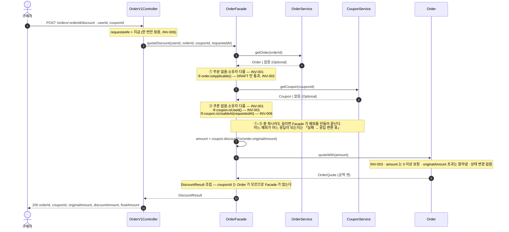

# 주문 할인 설계 기록 (W1)

기준 문장 하나를 사실·조건·질문으로 가르고, 답이 없는 채로도 진행할 수 있는 설계를 남긴다.

| | |
|---|---|
| **주어진 것** | `POST /orders/{orderId}/discount` · 쿠폰 한 장 · `finalAmount = originalAmount - discountAmount` |
| **정한 것** | 적용은 **아무것도 저장하지 않는다**. 조회·판정·계산만 하고 쓰기는 확정에서만 일어난다 (「결정 2」 — 열린 질문 넷에 기대는 **임시 판단**)<br>오류는 도메인 예외 계층으로 표현하고 Advice 가 한 곳에서 변환한다 (「결정 1」) |
| **못 정한 것** | Q-1~Q-5. 그중 **Q-1**(쿠폰 적용이 쿠폰을 잡아두는가)이 저장 구조·동시성·해제 경로를 한꺼번에 정한다 |

| | |
|---|---|
| **요구를 가른다** | [기준 문장](#기준-문장) · [1 확인된 사실](#1-확인된-사실-2) · [2 실습 조건](#2-실습-장면의-조건-4) · [3 물을 질문](#3-제품-담당자에게-물을-질문-5) · [4 도구 제안 처리](#4-도구-제안-처리) |
| **확인한다** | [5 현재 동작 관찰](#5-현재-동작-관찰) · [6 불변식과 반례](#6-불변식과-반례) |
| **정한다** | [7 외부 계약](#7-외부-계약) · [8 세 가지 결정](#8-세-가지-결정) · [9 내부 경계](#9-내부-경계) |
| **범위 밖** | [범위 밖](#범위-밖) · [임시 판단](#임시-판단) |

## 기준 문장

> 구매자는 주문 확정 전에 보유 쿠폰을 적용할 수 있고, 확정된 할인 금액은 나중에 바뀌지 않아야 합니다.

출처: Vol5 W1 Action Quest "이번 주에 정해진 입력 — 확인된 제품 약속". 같은 문장이 W1 강의 자료 "주문 흐름에서 먼저 지킬 약속" 절에 "제품 담당자와 범위를 확인한 뒤 고친 문장"으로 소개된다.

"나중에"는 빼도 뜻이 달라지지 않아 약속으로 세지 않았다. 문장에 있는 동사는 **"적용" 하나**다. 교체·해제·취소는 문장에 없다(→ 「범위 밖」). "확정"은 문장의 핵심 단어인데 어느 사건인지 정의가 없다(→ Q-3).

---

## 1. 확인된 사실 (2)

문장·공식 정책·현재 동작에서 근거를 가리킬 수 있는 것.

| # | 사실 | 근거 | 관련 규칙 |
|---|---|---|---|
| F-1 | 구매자는 주문 확정 전에 자기가 보유한 쿠폰을 적용할 수 있다 | 기준 문장의 "주문 확정 전에" · "보유" | `INV-002` (확정 전), `INV-001` (쿠폰에 보유자가 있다) |
| F-2 | 확정된 할인 금액은 이후 정책·가격 변화에도 바뀌지 않는다 | 기준 문장의 "확정된 … 바뀌지 않아야" | `INV-004` |

문장에 없는데 규칙이 쓰고 있는 것은 셋이다.

- **"보유 쿠폰만".** 문장은 "적용할 수 있다"는 허용을 말했지, "보유하지 않은 쿠폰은 안 된다"는 금지를 말하지 않았다. "만"은 우리가 넣었다.
- **주문 소유권.** 문장은 "주문"이라고만 하고 그것이 누구 것인지 말하지 않는다. 맥락상 자연스러운 읽기이지만 해석이다.
- **요청자가 누구인가.** 문장은 "구매자"라는 업무 개념만 말하고 HTTP 요청을 보낸 주체는 말하지 않는다. 요청자를 구매자로만 보는 것은 「외부 계약」의 액터 결정이다.

앞의 둘은 **보안 기본**에서 온다. 남의 주문·쿠폰을 막는 것은 제품이 약속해서가 아니라 그러지 않으면 사고이기 때문이다. `INV-001`의 출처 구분을 「제품 약속」으로 적은 것은 주어진 세 값 중 가장 가까운 것을 고른 결과이고, 실제로는 둘이 섞여 있다.

## 2. 실습 장면의 조건 (4)

실습 장면이 고정해 준 것. 우리가 고른 것이 아니지만 뒤집힐 수 있으므로 영향 범위를 남긴다.

| # | 조건 | 규칙 | 지금 성립하는 것 | 뒤집히면 |
|---|---|---|---|---|
| C-1 | 한 주문에 쿠폰 한 장 | `INV-002` | 아래 표 | 요청 필드가 복수가 되고 `INV-002`의 "한 장"이 사라진다 |
| C-2 | `finalAmount = originalAmount - discountAmount` | `INV-003` | 정액·정률 모두 만족한다. 쿠폰 쪽에서 받은 값을 쓰므로 계산 방식이 바뀌어도 식은 그대로다 | **쿠폰이 주문 전체에 적용된다는 뜻이기도 하다.** 항목 단위가 되면 `OrderItem`이 들어오고 모델이 통째로 바뀐다. 실무에서는 항목 단위가 더 흔하고, **주문 단위를 고른 대가는 이미 나타나 있다** — 「도구 제안 처리」의 "부분 환불 시 할인 배분" 보류 |
| C-3 | 같은 요청의 결과 재사용 | `INV-005` | 적용이 상태를 안 바꾸므로(「결정 2」) 같은 경로가 같은 답을 낸다 — 재사용이 구조로 나온다 | "결과"의 범위와 "같은 요청"의 기준이 다시 필요해진다 |
| C-4 | 요청 시작 시각으로 만료 판단 | `INV-006` | 시각을 한 번만 읽으면 되고 안쪽은 시계를 모른다 | 만료 판단 시점이 둘로 늘어난다 (→ Q-4). 적용은 성공했는데 확정에서 막히는 구간이 생긴다 |

| C-1 이 성립시키는 것 | 한 장일 때 | 복수일 때 |
|---|---|---|
| `INV-002` "한 장" | 확정 요청이 `couponId` 하나만 받아 **구조로 보장** | 몇 장까지인지 판정해야 한다 |
| 교체 | 저장이 없어 **개념 자체가 없음** | 여러 장을 담아야 하므로 "추가"와 "제거"가 생긴다 |
| `INV-005` 멱등 | 무상태라 **자동** | Q-5까지 "예"면 같은 요청 두 번에 행이 둘. `UNIQUE(order_id, coupon_id)` 필요 |

## 3. 제품 담당자에게 물을 질문 (5)

관문 셋을 다 통과한 것만 남긴다. 어디서 떨어지느냐가 그것이 갈 자리를 정한다.

| 관문 | 떨어지면 |
|---|---|
| ① 답이 사용자 응답·저장 데이터·권한 중 하나를 바꾸나 | 범위 밖 |
| ② 요구 문장·강의 자료·현재 동작 어디에도 답이 없나 | 사실(F)·조건(C)·관찰 |
| ③ 사용자에게 보이는 장면으로 물을 수 있나 | **임시 판단** — 물을 형태가 아니라 우리가 정한다 |

셋을 통과해 질문이 되어도 답이 올 때까지는 무언가 해야 하므로, 질문에 임시 판단이 하나씩 붙기도 한다 (Q-1 → "계산으로 본다").

| # | 질문 | 무엇을 정하나 | 답이 바꾸는 것 | "예"이면 따라오는 것 |
|---|---|---|---|---|
| Q-1 | 주문A에 쿠폰을 적용해 둔 채로, 확정하지 않고 주문B에 같은 쿠폰을 적용하려 하면 막아야 하는가? | 적용이 **쿠폰 쪽**에 흔적을 남기는가 | 사용자 응답, 저장 데이터 | 쿠폰 쪽에 점유 정보 + hold 만료 + 해제 경로. 아래 갈래 표 |
| Q-2 | 적용 화면에서 본 9,000원이 확정 시점에 9,500원이 될 수 있는가? | 적용이 **금액**까지 저장하는가 | 사용자 응답, 저장 데이터 | 금액을 굳혀야 하므로 적용 기록이 생긴다 (「결정 2」 뒤집힘) |
| Q-3 | 구매자가 "주문이 완료되었습니다"를 어느 시점에 보는가? 주문 버튼을 누른 직후 / 결제가 승인된 뒤 / 판매자가 수락한 뒤 | 저장이 아니라 **확정이 어느 사건인가**. 나머지 넷의 "확정"이 가리키는 지점 | 저장 데이터, 사용자 응답 | `INV-002`의 "확정 전" 구간, `INV-004` 발동 시점, snapshot 위치. **확정이 원자적일 수 있는지도 여기서 갈린다** |
| Q-4 | 유효할 때 고른 쿠폰이 확정 전에 만료되면 그 할인을 유지하는가? 유지하지 않는다면 확정을 막는가? | 적용이 **시각**까지 저장하는가. 만료된 쿠폰으로 확정을 허용하는가 | 사용자 응답, 저장 데이터 | "유지"면 언제 골랐는지 알아야 해 적용 시각을 저장한다 (「결정 2」 뒤집힘) |
| Q-5 | 쿠폰을 고른 뒤 주문서를 새로고침하거나 다른 기기에서 열면, 그 쿠폰이 그대로 선택되어 있어야 하는가? | 적용이 **선택**을 저장하는가 | 저장 데이터 | `orders.coupon_id` 컬럼이 생긴다. 「결정 2」가 뒤집힌다 |

| Q-4 답 | 확정에서 | 구매자가 보는 것 |
|---|---|---|
| 봐준다 | 만료 쿠폰으로 할인 적용 | 그대로 결제된다 |
| 막는다 | `409` + 만료 code | 다이얼로그 → 쿠폰을 빼고 재요청 |
| 쿠폰만 빼고 진행 | **「막는다」로 접힌다** — 재확인이 붙으면 서버가 하는 일이 같다 | 프런트가 자동 재요청하든 사용자가 직접 빼든 응답은 `409` 하나 |

동의한 금액보다 더 청구하는 것은 제품이 고를 선택지가 아니므로 **재확인 없이** 진행하는 경우만 배제한다. 알림 시점과 방식은 프런트 UX 라 관문 ①에서 떨어진다. **올라가면 재확인, 내려가면 그대로 진행**은 Q-2 와 Q-4 가 공유하는 기준이다.

**Q-2 의 원인 셋은 지금 다 막혀 있어 두 답이 같은 응답을 낸다** — 그래서 금액을 안 굳히는 결정이 성립한다.

| 금액이 변하는 원인 | 지금 왜 문제가 안 되나 |
|---|---|
| 원금 변동 | 구매자가 스스로 수량을 고친 경우라 **보장 대상이 아니다**(「임시 판단」) |
| 쿠폰 조건 변경 | 「기대는 것」에서 쿠폰 도메인에 건 **발급 이후 불변 전제**가 막는다 |
| 만료 소급 | 같은 전제 |

전제가 깨지면 그때 Q-2 에 답이 있어야 한다. `INV-004`는 확정 **이후**만 보호하므로 이 구간을 답해 주지 않는다.

경합이 **한 사용자 안에서만** 일어나는 것도 Q-1 의 무게를 줄인다. 쿠폰이 특정 구매자에게 발급된 것이라(`INV-001`) 다투는 주문이 전부 그 사람 것이고, **예약의 대표적 이득인 "남이 먼저 채가는 것을 막는다"가 여기엔 없다**(부하 쪽 영향은 「비기능과 관측」).

**확정 단계에서는 어느 답이든 쿠폰을 잡는다.** Q-1이 정하는 것은 잡느냐가 아니라 **언제부터** 잡느냐다.

| 갈래 | 따라오는 것 |
|---|---|
| **계산** | 같은 쿠폰을 여러 주문에서 고를 수 있음(전부 같은 사람 주문이다). 쿠폰 상태는 확정 전까지 그대로라 **쿠폰함에 보여줄 중간 상태가 없다** |
| **예약** | 쿠폰이 다른 주문에서 막힘. 적용 시점부터 쿠폰 쪽에 저장이 생김. hold 기간이 새 제품 질문이 되고, 해제 경로가 필수가 되며, 쿠폰을 다른 주문으로 옮기려면 먼저 떼야 한다 |

### 질문 후보였지만 질문으로 남기지 않은 것

| 후보 | 어느 관문에서 떨어졌나 | 어디로 갔나 |
|---|---|---|
| 발급 뒤 쿠폰의 할인 조건이 바뀌면 이미 받은 쿠폰도 따라 바뀌는가 | **③** — 원인을 묻는 형태라 담당자에게 보여줄 장면이 없다. 우리 저장 구조를 설명해 달라는 것과 같다 | **결과**를 묻는 문장으로 바꿔 현재의 Q-2 가 됐다. 그렇게 물으면 원금 변동과 조건 변경이 한 질문으로 모인다. 답이 바꾸는 것은 쿠폰 도메인 안의 모양이라 `Coupon`에 거는 네 질문은 그대로이고, 「기대는 것」에서 요구로 걸었다 |
| 운영자도 남의 주문에 쿠폰을 적용할 수 있는가 (강의 자료 예시) | **①** — 답이 권한을 바꾸는 **좋은 질문이지만** 바꾸는 대상이 이 엔드포인트가 아니다. 구매자가 주문서를 보는 동안 운영자가 끼어드는 장면이 없다 | 확정 전이면 **발급**(액터는 여전히 구매자), 확정 후면 **사후 조정**(별도 자원)으로 환원된다. 「외부 계약」에서 액터를 구매자로 좁히는 결정으로 처리. 액터를 넓히면 다시 질문으로 올린다 |
| 남의 주문·쿠폰에 `404` 인가 `403` 인가 | **③** — 둘 다 구매자가 보는 것은 같은 거절 화면이다 | 우리가 보안 기본으로 정하고 「임시 판단」에 남긴다. 강의 자료 `INV-001` 예시가 "존재를 노출하지 않고 거절"로 방향을 보여준다 |
| 쿠폰은 정액인가 정률인가, 반올림은 | **①②** — 이 계약은 `discountAmount`를 입력으로 받고, 기존 제품이 있다면 현재 동작에서 확인할 수 있다 | 쿠폰 도메인의 결정. 범위 밖 |

## 4. 도구 제안 처리

출처 없는 제안은 채택하지 않고 보류·거절로 남긴다. 아래는 대화 중 도구(Claude)가 제안한 것과, 그에 대해 작성자가 검토·판단한 것이다. 강의 자료의 예시를 검토한 것은 「질문 후보였지만 질문으로 남기지 않은 것」에 있다.

| 제안 | 출처 | 판단 | 이유 |
|---|---|---|---|
| 쿠폰 소유권을 주문 소유권과 구분한다 | 도구 (기준 문장의 "보유") | **채택** | 문장에 근거가 있다. F-1과 `INV-001`에 반영 |
| 쿠폰 적용 시 쿠폰을 RESERVED 로 점유한다 | 도구 (실무 관행) | **보류 → Q-1** | 정책 근거가 없다. 이번 구현은 "계산"으로 둔다 |
| 주문 확정 시 쿠폰을 재검증한다 | 도구 (실무 관행) | **보류 → Q-4** | 관행일 뿐 근거가 없고, 재검증 여부가 사용자 응답을 바꾼다 |
| 초안 주문 만료 후 예약 자동 해제 | 도구 | **보류** | Q-1이 "잡아둔다"로 답해질 때만 의미가 생긴다 |
| 정률 할인의 반올림을 확정 시점에 고정한다 | 도구 | **거절 (범위 밖)** | 쿠폰 도메인의 결정. 이 계약은 결과만 받는다 |
| 주문 취소 시 쿠폰 복구, 부분 환불 시 할인 배분 | 도구 | **보류 (범위 밖)** | 확정보다 바깥의 사건이다 |
| 만료 판단 시각을 `java.time.Clock` 포트로 | 도구 | **거절** | 어떤 질문에도 뒤집히지 않아 포트의 근거가 없다. `INV-006`은 진입점에서 시각을 한 번 읽어 내려보내 지킨다 — 안쪽 어디서도 `now()`를 못 부르므로 규칙이 구조로 강제된다. 테스트에서 시각을 고정하려면 진입점에 주입하면 되고, 그건 구현 편의다 |
| 도메인 전용 예외 계층 + `sealed` 중간 계층 | 작성자 | **채택** | 「네 안 비교」의 세 기준을 모두 만족하는 유일한 안. 비용은 템플릿 `CoreException` 방식과의 공존 |
| `CoreException` 상속만으로 처리 | 작성자 | **거절** | 비용은 가장 작지만 기준 셋 중 둘을 통과하지 못한다 |
| `ErrorType`에서 `HttpStatus`를 떼어낸다 | 도구 | **위 행에 흡수** | 결합은 실제로 있었다. 도메인 예외가 성질을 자기 타입으로 들면 `ErrorType`을 아예 안 쓰게 되어 풀린다 |
| `meta.errorCode`에 업무 오류 코드를 넣는다 | 도구 | **위 행에 흡수** | `code()`를 그대로 내보내면 된다. `ErrorType` enum 확장은 기존 네 값과 `ContractClassificationTest`에 영향이 가 버렸다 |

## 5. 현재 동작 관찰

`ContractClassificationTest` 실행 결과. 추측이 아니라 실제 응답이며, 테스트의 assertion과 이 표가 같은 값을 가리킨다.

| 입력 | HTTP status | `meta.result` | `meta.errorCode` | `data` |
|---|---|---|---|---|
| `GET /api/v1/examples/{저장된 id}` | 200 | `SUCCESS` | 없음 | 있음 |
| `GET /api/v1/examples/abc` | 400 | `FAIL` | `Bad Request` | 없음 |
| `GET /api/v1/examples/9223372036854775807` | 404 | `FAIL` | `Not Found` | 없음 |
| `GET /api/v1/this-endpoint-does-not-exist` | 404 | `FAIL` | `Not Found` | 없음 |

기존 `ExampleV1ApiE2ETest`가 확인하는 것은 위 표의 앞 세 줄과 같은 입력이지만(`나나`가 숫자 아닌 ID 자리) **status 뿐**이다(`is2xxSuccessful()`, `BAD_REQUEST`, `NOT_FOUND`). `meta.result`·`errorCode`·`data` 유무는 어느 기존 테스트도 assertion 하지 않는다. envelope을 추측하지 않으려면 관찰 테스트가 따로 필요했던 이유다. 미매핑 URL도 기존 테스트에 없는 네 번째 입력이다.

**관찰 메모**

| 관찰한 것 | 이 문서에 준 영향 |
|---|---|
| 없는 자원과 미매핑 URL이 같은 `404` + `Not Found`로 돌아와 **응답만으로는 구분되지 않는다.** 미매핑 URL도 `handleNotFound(NoResourceFoundException)`을 거쳐 같은 envelope 이 된다 | 「결정 1」의 표현을 정했다. "URL 오타를 구분한다"는 말을 쓰지 않는 근거 |
| `meta.errorCode`가 업무 코드가 아니라 **HTTP reason phrase**다 (`"Not Found"`). `ErrorType`이 `HttpStatus.getReasonPhrase()`를 코드로 쓴다 | 업무 코드를 실으려면 `code`를 따로 들어야 한다 → 「실패 → 응답 변환 표」 |
| `ErrorType`이 `INTERNAL_ERROR / BAD_REQUEST / NOT_FOUND / CONFLICT` **넷뿐**이라 업무 의미를 담을 자리가 없다 | 만료(`INV-006`)를 어디로 보낼지가 값의 개수로 강제된다 → 「결정 1」이 ②를 버린 이유 |
| 변환 지점은 **이미 있다.** `ExampleService`가 `CoreException(ErrorType…)`을 직접 던지고 `handle(CoreException)`이 응답을 만든다 | **변환 지점만 물려받고 던지는 쪽은 바꾼다.** 도메인이 `ErrorType`을 직접 드는 부분이 ②로 버린 것 |
| 계층 이름은 `application/Facade` → `domain/Service` → `domain/Repository` ← `infrastructure/RepositoryImpl` | `Service`가 도메인 이름이므로 이 문서의 응용 진입점은 `Facade`로 부른다 |
| `CoreException`·`ErrorType`·`ApiControllerAdvice` 셋 다 `commerce-api` 소유이고, `support.error` 참조 파일이 이 앱 안 **8개뿐**이다 | `streamer`·`batch`가 영향받지 않아 구현 단계에서 고칠 수 있다 → 「결정 1」은 제약이 아니라 판단 |

**「결정 1」을 실제 `ApiResponse`와 Spring 6.2.5로 컴파일해 확인한 것 셋**

검증은 저장소 밖 임시 소스 트리에서 했다. `apps/commerce-api/src/main`에는 아무것도 쓰지 않았고, `git diff --name-only -- apps/commerce-api/src/main`은 비어 있다.

1. Advice 추가분은 메서드 하나(7줄) + import 두 줄이고, 기존 핸들러 9개와 private 헬퍼는 무수정이다. `ApiResponse.fail(String, String)`이 이미 String 두 개를 받아 `ErrorType`을 경유하지 않는다.
2. 그 뒤 구체 클래스 5개를 더해도 Advice diff는 없다.
3. 도메인 예외 쪽에는 `HttpStatus`가 개입하지 않는다. Spring 없는 classpath에서 컴파일되고, 바이트코드 참조도 0건이며, `import` 문 자체가 없다.

다시 건드리는 경우는 새 성질(= 새 status)을 만들 때뿐이고, 그때는 `switch`가 컴파일 에러를 낸다. 미처리 예외를 500으로 삼키는 기존 `handle(Throwable)`이 있으므로, 이 컴파일 검사가 조용한 500을 막는다. **다만 막는 범위는 도메인 예외까지다** — Spring 이 컨트롤러 앞에서 내는 예외는 이 계층 밖이라 여전히 열려 있고, `X-USER-ID` 누락이 그 예다(「실패 → 응답 변환 표」).

---

## 6. 불변식과 반례

이 번호는 구현의 테스트 이름과 지표에도 그대로 쓴다. 규칙이 사라지면 번호도 비워 두고 다른 규칙에 다시 붙이지 않는다. 같은 번호가 다른 뜻이 되면 문서와 테스트가 조용히 어긋나기 때문이다.

| 규칙 ID | 규칙 | 출처 구분 | 깨지는 입력 | 기대 결과 | 책임 후보 |
|---|---|---|---|---|---|
| `INV-001` | 성공한 적용에서 **주문의 소유자와 쿠폰의 소유자는 모두 요청자와 같고, 그 쿠폰은 아직 소진되지 않았다** | 제품 약속 | 다른 `X-USER-ID`로 남의 주문에 요청 | 거절. 주문의 존재를 노출하지 않는다 (`NOT_FOUND`) | 판정은 도메인 안 — `Order.isOwnedBy(userId)`와 `Coupon.isOwnedBy(userId)`가 각각 답한다. `OrderFacade`는 판정하지 않고 요청자 ID를 두 도메인에 넘긴 뒤, 없음·소유자 다름 네 경로를 존재 숨기는 하나의 의미로 모은다 (「추가 실패 경로와 해석」 참조) |
| `INV-002` | 쿠폰 적용은 **`DRAFT` 주문에만**, 한 주문에 최대 한 장이다 | 제품 약속 | 이미 확정된 주문에 쿠폰 적용 요청 | 거절 (`CONFLICT`) | `Order.isApplicable()`이 자기 상태로 판정 — **"확정이 아니다"가 아니라 "`DRAFT`다"**를 본다. "한 장"은 확정 요청이 `couponId` 하나만 받아 구조로 보장되므로 판정할 것이 없다 |
| `INV-003` | `0 ≤ discountAmount ≤ originalAmount`, `finalAmount = originalAmount - discountAmount` | 실습 조건 | 원금 5,000원 주문에 10,000원 할인 쿠폰 적용 | `discountAmount = 5000`, `finalAmount = 0` | 상한은 `Order`가 자름 — 원금이 확정 전 변할 수 있어 드문 경로가 아니다. 하한(0 이상)은 검사하지 않고 `Coupon.discountFor`의 반환 타입 `DiscountAmount`(음수 생성 불가)가 보장 |
| `INV-004` | 확정된 할인 금액은 이후 정책·가격 변화에도, 누가 요청해도 바뀌지 않는다 | 제품 약속 | 확정 후 그 쿠폰의 할인 조건을 10% → 20%로 바꾸고 재조회 | 저장된 최종 금액이 동일 | `Order.confirm`이 만드는 snapshot (확정은 범위 밖 — 아래 참조) |
| `INV-005` | 같은 주문·쿠폰으로 다시 요청하면 효과를 늘리지 않고 같은 적용 상태를 돌려준다 | 실습 조건 | 같은 요청을 두 번 전송 — **적용이 저장을 하는 설계라면** 행이 둘이 되어 할인이 누적된다 | 두 응답이 같다. 이 설계에서는 서버 상태가 없어 누적될 효과 자체가 없으므로 **이 입력으로는 깨지지 않는다** | 아무도 판정하지 않는다 — 적용이 서버 상태를 바꾸지 않아 멱등이 구조로 나온다 |
| `INV-006` | 쿠폰의 **만료** 판정은 요청 시작 시각 한 번으로 한다 | 실습 조건 | `requestedAt` 기준으로 유효한 쿠폰이 응답을 만들기 전에 만료됨 | 시작 시각 기준으로 성공. 안쪽 어디서도 `now()`를 부르지 않는다 | 컨트롤러 — 시각을 한 번 읽어 `requestedAt`으로 내려보냄. 안쪽은 시계를 모른다 |

### 6.1 추가 실패 경로와 해석

표에는 규칙을 가장 작게 깨는 반례 하나만 두었다. 더 찾은 경로와 규칙 문장에 숨어 있던 해석은 여기에 둔다. **한 불변식에서 실패는 여러 개 나오고, 실패와 응답은 일대일이 아니다.**

| 규칙 | 문장에 숨어 있던 해석 (= 임시 판단) | 표에 없는 실패 경로 |
|---|---|---|
| `INV-001` | 기준 문장의 **"보유"**를 "발급받았고 아직 안 쓴"으로 읽어 규칙에 풀어 넣었다. 이 규칙만 책임이 한 객체로 안 모이는데 **두 도메인에 걸쳐 있기** 때문이다 — 주문 소유권은 `Order`가, 쿠폰 소유권은 발급분이 답하고 서로를 모른다 | 다섯이다. 남의 주문·없는 주문·남의 쿠폰·없는 쿠폰은 **응답이** 모두 `NOT_FOUND`(클래스는 넷으로 갈라 로그에서 구분). 이미 소진된 쿠폰은 `CONFLICT` — "소진됨"이 언제 생기는지는 Q-1 에 달렸고, 계산 갈래에서는 확정 전 두 주문에 같은 쿠폰이 붙는 것이 허용이고 뒤에 확정하는 쪽이 막힌다 |
| `INV-002` | **"적용된"이 성공인지 시도인지 정의할 필요가 없다** — 저장이 없어 "적용된 상태"가 아예 없기 때문이다. 저장하는 설계라면 실패해 롤백된 시도까지 한 장으로 세어 정상적인 재적용이 막히는 반례가 생긴다. 기준 문장은 "확정 전"이라고만 하는데 **`DRAFT`만 허용**으로 좁혔다. **이 계약이 아는 주문 상태는 `DRAFT` 와 확정 이후 둘뿐이다** — 취소·결제대기 같은 것이 있는지는 확인하지 못했고, 있다면 Q-3 이 상태 모델 전체를 묻는 질문이 된다 | **화이트리스트라 모르는 상태는 자동으로 거절된다.** "확정이 아니면 통과"로 두면 새 상태(취소·결제대기)가 생길 때 조용히 통과하는데, 좁혀 두면 가정이 틀려도 안전한 쪽으로 틀린다. "한 장"은 판정할 것이 안 남는다 — 저장이 없어 "이미 붙은 쿠폰"이 없고 확정 요청이 `couponId` 하나만 받는다 |
| `INV-003` | 해석이 아니다. **`0 ≤ 할인액 ≤ 원금`과 전액 할인 허용은 강의 자료가 준 것**이다 — 「반례로 다듬기」가 "`할인액은 주문 금액보다 작다`는 100% 할인에서 깨진다. 의도가 전액 할인 허용이라면 `0 ≤ 할인액 ≤ 품목 합계`가 정확하다"로 상한과 자르기를 함께 정했다 | **음수는 설계된 실패가 아니다.** 우리 쪽 계산 오류를 변환 표에 올리는 것은 종류가 다른 것을 섞는 일이라 검사 대신 타입으로 막는다 — 아래 |
| `INV-004` | 표의 반례는 강의 자료의 것이다. 발급 이후 조건 불변 전제가 서면 이 반례는 `INV-004`가 아니라 **그 전제**를 검사하는 것이 된다 | 운영자의 확정 주문 수정(→ 거절, 조정은 별도 자원), 확정된 주문에 확정 재호출(→ `CONFLICT`). 확정 주문에 오는 적용 요청은 `INV-002`로 먼저 걸려 snapshot 에 닿지 않는다 |
| `INV-005` | 멱등이 **판정 대상이 아니라 구조**다. 적용이 상태를 안 바꾸므로 | 원금이 변했으면 응답 금액도 변하는데, 그것이 어긋남이 아니라 맞는 답이다 |
| `INV-006` | 실습 조건이 말하는 것은 **"만료"뿐**이라 그대로 둔다. 쿠폰에 사용 시작일이 있는지는 확인하지 못했고, 있다면 이 규칙에 조건이 하나 붙는다 | 만료일이 날짜 단위("9/30까지")면 23:59:59 의 타임존이 비므로 **쿠폰 도메인이 절대 시각으로** 들어야 한다 — 날짜만 들면 비교하는 쪽이 타임존을 정해 규칙이 두 곳에 걸린다 |

**음수 할인액을 타입으로 막는다.** `Coupon.discountFor`의 반환 타입을 음수를 만들 수 없는 `DiscountAmount`로 두면 음수는 쿠폰 도메인 안에서 생성 시점에 터지고, 그것은 프로그래밍 오류라 기존 `handle(Throwable)`이 500으로 처리한다. `Order`는 0 이상을 전제로 상한만 다룬다. 규칙을 검사하는 대신 **위반을 표현 불가능하게** 만든다.

**소유자 범위로 조회를 좁히는 안을 버렸다.** `getCoupon(couponId, userId)`로 두면 "남의 쿠폰"과 "없는 쿠폰"이 애초에 같은 결과가 되어 `404`로 뭉치는 것이 구조로 나오지만, 서버도 둘을 구분할 수 없어 "실제 원인은 로그·지표에만 남긴다"를 지킬 수 없다. 응답에서만 뭉치고 서버는 아는 쪽을 택했다.

**규칙끼리 충돌하지 않는다.** 초안에서는 `INV-005` 대 `INV-002`, `INV-005` 대 `INV-006` 둘을 충돌로 적었다. 재요청을 특별 취급해 나머지 판정을 건너뛰기 때문에 생기는 충돌이었는데, 적용이 아무것도 안 쓰면 재요청이라는 개념 자체가 없어지고 모든 요청이 매번 전부 판정한다. `INV-005`의 적용 범위는 "같은 조건에서 반복하면 같은 답"이지 "상황이 변해도 첫 답을 고수한다"가 아니다. **대신 Q-4 가 저장 데이터를 바꾸는 질문이 된다** — 만료를 봐주려면 언제 골랐는지 알아야 하고, 그러려면 적용 시각을 저장해야 한다.

#### 이 계약 안에서 검증할 수 없는 둘

| 규칙 | 왜 여기서 확인할 수 없나 | 대신 확인할 수 있는 것 |
|---|---|---|
| `INV-004` | snapshot 이 확정 시점에 생기는데 확정 경계가 범위 밖이다 | "적용이 금액을 저장하지 않으므로 재계산이 과거 확정 금액을 바꿀 여지가 구조적으로 없다" — 주문에 할인 금액 필드가 없음을 고정하면 된다 |
| `INV-002` "한 장" | 근거가 **확정 요청의 모양**이라 확정이 범위 밖이면 확인할 수 없다 | 같다. 쿠폰·할인 금액 필드가 없으면 "이미 붙은 쿠폰"이 생길 자리가 없다는 것까지 함께 고정된다 |

---

## 7. 외부 계약

기본 장면: `POST /api/v1/orders/{orderId}/discount`, 요청 `couponId`, 응답에 주문·원금·할인·최종 금액.

| 항목 | 결정 | 왜 |
|---|---|---|
| 액터 | 구매자만 | 운영자 개입은 발급과 사후 조정으로 분리돼 이 엔드포인트의 액터가 아니다 |
| method · path | `POST /api/v1/orders/{orderId}/discount` | `discount`를 하위 리소스로 두면 Q-5 가 "예"일 때 `GET`·`DELETE`를 같은 주소에 붙일 수 있다 |
| 사용자 식별 | `X-USER-ID` 헤더 | 본문으로 받으면 타인 사칭이 가능해 `INV-001`을 검증할 근거가 사라진다 |
| request | `{ "couponId": <long> }` — 단수 | C-1 이 뒤집히면 배열이 된다. `couponId`는 **발급분 한 장의 ID이며 쿠폰 정책의 ID가 아니다**(「임시 판단」) |
| success | `200` + `data`에 주문·쿠폰 ID 와 금액 셋 | `couponId`를 되돌려주는 것은 저장하지 않아 서버가 다음 요청에서 이 값을 모르기 때문이다 |
| 금액 필드 이름 | `originalAmount` · `discountAmount` · `finalAmount`, `long`(원) | **중립으로 둔다.** `estimatedFinalAmount` 처럼 "확정 아님"을 새기면 Q-2 가 "예"일 때 이름이 전부 바뀐다 — `PUT` 대신 `POST` 를 고른 것과 같은 원칙 |
| error meaning | `400`(입력 문법) / `409`(상태 충돌·만료) / `404`(미존재·소유권) | 미존재와 소유권을 `404`로 뭉치는 것은 현재 동작과도 맞다. 실제 원인은 로그·지표에만 |

```jsonc
// POST /api/v1/orders/100/discount     X-USER-ID: 1
{ "couponId": 42 }

// 200
{ "meta": { "result": "SUCCESS" },
  "data": { "orderId": 100, "couponId": 42,
            "originalAmount": 10000, "discountAmount": 3000, "finalAmount": 7000 } }

// 404 · 409
{ "meta": { "result": "FAIL", "errorCode": "COUPON_ALREADY_USED", "message": "..." },
  "data": null }
```

**기본 장면과 다른 점.** 외부 모양은 같지만 **성공의 의미**가 다르다. 강의 자료 `INV-005`는 "재요청은 **저장된 결과를 돌려주고** 효과를 늘리지 않는다"로 저장을 전제하는데, 이 문서가 따른 것은 실습 조건의 문구 **"같은 요청의 결과 재사용"**이다 — 저장이라는 말이 없어서, 무상태로도 재사용이 성립한다고 읽었다(C-3). 강의 자료 UC-01은 성공 결과를 "할인 결과 기록", 종료 조건을 "그 기록은 이후 정책·가격 변화에도 동일"로 두어 적용 시점 고정을 전제한다. 이 문서는 확정 전 응답을 "요청 시점에 계산된 값이며 저장된 snapshot이 아니다"로 둔다. Q-2가 열려 있어 적용 시점에 금액을 굳힐 근거가 없고, 굳히면 쿠폰 조건 변경 시 화면 값과 어긋나는 구간이 생기기 때문이다. Q-2가 "적용 시점"으로 답해지면 UC-01 쪽으로 돌아간다.

### 검토했으나 버린 모양 — 명사와 메서드 두 축

| 후보 | 왜 버렸나 | 언제 다시 후보가 되나 |
|---|---|---|
| **명사** `/coupon` | 이 자원의 내용은 **할인이지 쿠폰이 아니다.** 응답은 `discountAmount`·`finalAmount`이고 쿠폰은 입력이다. `/coupon`에 `GET`을 붙이면 붙어 있는 쿠폰이 나와야 하는데 우리가 주는 것은 금액이다 | 안 된다. 보조로, 복수 쿠폰이 허용되면 단수 `/coupon`은 더 틀린 이름이 된다. 두 이름의 비용이 같으니 덜 틀리는 쪽을 고른다 |
| **메서드** `PUT` | 지금은 **대체할 자원이 없다** | Q-5 가 "예"로 답해져 `orders.coupon_id`가 생기면 0..1 단일 자원이 되어 후보가 된다. 그래도 걸림돌은 남는다 — 클라이언트가 보내는 것은 `couponId` 하나인데 자원의 내용(금액)은 서버가 만든다 |
| **메서드** `GET` | **지금의 안쪽 설계와는 가장 잘 맞는다.** 읽기 전용이라 안전·멱등이 메서드 의미에 드러난다. 그럼에도 버린 이유 둘 — ⑴ 「결정 2」가 임시 판단이라 Q-1·2·4·5 중 하나만 "예"면 쓰기가 생겨 `GET`이 틀린 메서드가 된다. **`POST`만 어느 답에서도 맞다.** ⑵ 명사도 함께 바뀐다. `GET .../discount`는 "붙어 있는 할인을 가져온다"로 읽히는데 그 자원이 없어 `discount-quote` 로 가야 하고, 주어진 외부 모양에서 두 겹 벗어난다 | 네 질문이 모두 "아니오"로 닫히면 |
| **메서드** `PATCH` | 수정할 자원이 없고 필드가 하나뿐이라 `PUT`과 구별되지도 않는다. `PATCH`는 값 하나가 아니라 **변경 지시서**를 받는 메서드다 | 안 된다 |
| `201` | `INV-005`의 기대 결과가 "두 응답이 같다"인데 첫 요청 `201`·재요청 `200`으로 갈리면 그 문장이 그 자리에서 깨진다 | **`200`-always 는 취향이 아니라 `INV-005`가 강제한 선택이다** |

**`POST`의 비용은 적어 둔다.** 이 요청은 실제로 안전하고 멱등이지만 그 사실이 프로토콜에 드러나지 않는다. HTTP 클라이언트·프록시는 `POST`를 비멱등으로 취급해 타임아웃 시 자동 재시도를 하지 않으므로 `INV-005`는 전부 서버 구현 책임이 된다. 클라이언트 재시도가 필요해지면 `Idempotency-Key`를 따로 얹어야 한다.

### 비기능과 관측

숫자 목표(응답 시간, TPS)는 이 계약이 정할 것이 아니다.

| 성질 | |
|---|---|
| 호출당 **읽기 2 · 쓰기 0** | 주문·쿠폰. N+1 없고 응답은 필드 다섯이다 |
| **읽기 전용** | 「결정 2」로 쓰기가 없어 캐시와 읽기 레플리카를 쓸 수 있다. Q-5 가 "예"면 이 이득을 잃는다 |
| 금액을 안 굳혀 **호출마다 쿠폰을 다시 읽는다** | 굳혔으면 아꼈을 조회다 |
| **동시성 위험이 낮다** | 쿠폰이 특정 구매자에게 발급된 것이라 경합이 **한 사용자 안에서만** 일어나고 발급분별 행이라 핫스팟도 없다. 어뷰징으로 만들어도 결과가 `409` 하나라 서버 비용이 없다 — 필요해지면 락 강화가 아니라 rate limit 이고 그건 인프라 층이다 |
| **미정** | 응답 시간 목표. 쿠폰 조회가 원격이 될 때의 타임아웃·폴백 — 지금 `getCoupon`에 실패가 없는 모양이라 자리가 없다. "쿠폰 조회가 느리면 할인 없이 보여주는가, 막는가"는 사용자가 보는 것이 달라지므로 질문 후보다 |

`NOT_FOUND` 넷을 응답에서 뭉치는 근거가 "실제 원인은 로그·지표에만 남긴다"이므로, 무엇을 남길지 여기서 정한다.

| 남길 것 | 왜 |
|---|---|
| 실패마다 **구체 예외 클래스 이름** | 응답에서 뭉친 `NOT_FOUND` 넷이 클래스로는 갈려 있어 여기서만 구분된다 |
| `errorCode` 별 카운트 | 어느 실패가 흔한지. `CONFLICT` 가족을 나중에 뭉쳐도 되는지의 근거 |
| 확정에서 쿠폰 예약·소진에 **실패한 횟수** | "드문 경합"이라는 전제를 데이터로 확인한다. Q-1의 답을 뒷받침하고, 특정 사용자가 반복하면 **어뷰징 탐지 지표**가 된다 |
| `orderId` · `couponId` · 요청자 | 추적. 단 응답에는 싣지 않는다 |

### 범위 밖

관문 ①에서 떨어진 것들. 답이 이 계약의 **응답·저장·권한을 바꾸지 않아서** 뺐고, 실습 장면이 준 조건 안에서 다루지 않는다.

> 주문 확정 엔드포인트 · 쿠폰 교체·해제 · 운영자 개입 · 주문 취소·환불과 쿠폰 복구 · 주문서 조회 · 쿠폰 사용 자격 조건(**원금** 기준 최소 주문 금액, 카테고리·첫 구매 한정) · 다른 쿠폰과 중복 사용 · 할인 방식(정액·정률·반올림) · 적용 가능 쿠폰 목록 조회

이 중 셋은 **Q-5 가 "예"로 답해지면 들어온다** — 교체·해제(`DELETE`), 주문서 조회가 저장값을 읽는 경로, 그리고 그때 저장된 `coupon_id`를 그대로 믿지 말고 쿠폰 상태를 함께 읽어 거르는 규칙이다.

### 임시 판단

답이 없어 우리가 정한 것. 물을 상대가 없거나, 물어도 답이 나오지 않는 것들이다(관문 ③).

| 판단 | 근거 (확인 못 한 것 포함) | 뒤집히면 |
|---|---|---|
| 남의 주문·쿠폰은 **`404`로 존재를 숨긴다** | 강의 자료 `INV-001` 예시와 일치하지만 정책 근거는 아니다. 회사에 보안 가이드가 있다면 그것을 따른다 | `INV-001` 기대 결과와 변환 표 첫 행. `*NotOwned` 둘이 **상속하는 중간 계층만** `Forbidden`으로 바뀌고 `permits`에 하나 는다. 클래스는 안 늘고 Advice 는 한 줄, 빠뜨리면 컴파일 에러 |
| **적용 시점에 주문이 이미 존재한다** | 계약이 `orders/{orderId}`인 것. 가이드가 준 URL 에서 나온다 | 주문 생성이 이 계약 안으로 들어온다 |
| **확정 전 원금은 변할 수 있다** | 주문서에서 수량을 고치는 것은 흔한 UX 이고 부분 품절도 있다. 확인 못 했지만 **두 가정의 비용이 비대칭**이다 — 불변으로 봤다가 틀리면 굳힌 금액이 어긋나지만, 가변으로 봤다가 실제로 불변이면 재계산이 매번 같은 값일 뿐이다 | 아무것도. 「결정 2」가 금액을 안 굳히므로 클래스와 외부 계약이 그대로다. `originalAmount`를 요청마다 다시 읽는다는 뜻만 남는다 |
| **쿠폰이 할인 조건을 어떻게 아는지는 정하지 않는다** | 직접 들든 별도 정책을 참조하든 `discountFor` 뒤의 일. 저장소에 쿠폰 도메인이 없어 확인 못 했다 | 발급 이후 조건·기간 불변 전제가 깨지면 비용이 생긴다(「기대는 것」) |
| **`couponId`는 발급분 한 장을 가리킨다** | 기준 문장의 "보유 쿠폰"에서 구매자가 쿠폰이라 부르는 것은 자기가 가진 한 장이다. 쿠폰 쪽 실제 이름은 확인 못 했다 | 정책 ID 로 읽으면 같은 정책을 두 장 가진 구매자에게 서버가 어느 장을 쓸지 골라야 하고, 그 선택이 문서에 없는 정책이 된다 |
| **쿠폰 적용은 잡아두기가 아니라 계산이다** (Q-1) | 정책 근거가 없다 | 적용 시점에 쿠폰 상태를 바꾸게 되고 정책 셋이 딸려온다 — 주문 취소 시 되돌리기, hold 만료, 직접 떼는 경로. 취소 경로가 없으면 쿠폰이 영구히 잠긴다 |
| **요청자는 구매자만이다** | 운영자 개입을 범위 밖으로 분리했다 | `X-USER-ID`를 구매자 ID 로 읽는 전제가 바뀐다 |
| **`finalAmount`가 `0`이어도 주문이 성립한다** | 자르기와 전액 할인 허용은 강의 자료가 준 것이지만, **결제 없이 주문이 성립하는지는 아무도 말하지 않았다.** `0`원은 PG 에 보낼 수 없으므로 확정이 결제 단계를 건너뛰어야 하는데, 그런 경로가 있는지 확인하지 못했다 | 없으면 **최소 결제 금액**이 생기고, `INV-003`의 상한이 `originalAmount - 최소결제금액`으로 내려가 `Order.quoteWith`의 자르기 식이 바뀐다. "그러면 적용 불가"로 답하면 구체 예외와 변환 표 행이 하나씩 는다. 쿠폰 자격으로서의 최소 **주문** 금액(원금 기준)과는 다른 축이다. 반대로 `0`원 주문이 허용되면 확정이 결제를 건너뛰므로 그 경로만 한 트랜잭션에 끝난다 |
| **실패 종류는 `meta.errorCode`로 가른다** | 프론트가 종류별로 분기하는지 확인 못 했다. 갈라 두는 비용은 0 에 가깝고, 뭉쳐 둔 것을 나중에 가르는 것은 프론트가 매칭 중일 수 있어 비싸다 | 분기하지 않는 것이 확정되면 `CONFLICT` 쪽 `code`를 하나로 뭉쳐도 된다 |

## 8. 세 가지 결정

| 결정 | 선택 | 버린 대안 |
|---|---|---|
| 오류를 구분하는 방식 | `400`/`409`는 구분하고 미존재·소유권 실패는 `404`로 뭉친다. 표현은 도메인 전용 예외 | ① 업무 코드로 `NOT_FOUND` 경로까지 전부 구분(`ORDER_NOT_OWNED` 등) ② 템플릿 방식 그대로 ③ `CoreException` 상속 |
| snapshot과 재계산 | 적용은 아무것도 저장하지 않는다. 쓰기는 확정에서만 | ① 선택을 저장 ② 할인액까지 고정 ③ 적용 시점에 쿠폰을 잡아둠 |
| 호출 순서를 숨길 책임 경계 | `OrderFacade.quoteDiscount` 하나. `Order`에 할인액만 넘긴다 | `Order`가 `Coupon`을 받아 조회·판정까지 직접 관리 |

### 결정 1 · 오류를 구분하는 방식

**선택.** `400`/`409`는 구분하고 미존재·소유권은 `404`로 뭉치되, 실제 원인은 로그·지표에 남긴다. 표현은 Spring 을 모르는 `OrderDiscountException` 계층이다. 타입 구조와 변환 규칙은 「실패 → 응답 변환 표」.

**어디까지 가를지.** 강의 자료 UC-01 의 실패 4종 중 앞의 둘(주문 없음·소유자 다름)은 구분하는 순간 주문 존재가 노출돼 `INV-001`이 깨지므로 뭉친다. 뒤의 둘은 요청자의 다음 행동이 달라 구분한다. 미매핑 URL 도 `404`임을 관찰했으므로 "URL 오타를 구분한다"는 표현은 쓰지 않는다.

| 버린 안 | 왜 |
|---|---|
| ① 업무 코드로 `NOT_FOUND` 경로까지 전부 구분 | 주문 존재가 노출돼 `INV-001`이 지키려던 것이 깨진다 |
| ② **템플릿 방식 그대로** (처음 택했다가 버렸다) | 결함 셋. ⑴ `404`/`403` 판단이 바뀌면 응용 코드의 `ErrorType`을 고쳐야 한다(전송 정책이 응용 계층을 건드림) ⑵ 만료→`CONFLICT`는 업무 의미가 아니라 **값이 넷뿐이라** 고른 것이다(전송 계층이 도메인 구분을 왜곡) ⑶ `CONFLICT` 네 실패가 응답에서 구분되지 않는다 |
| ③ `CoreException` 상속 | 도메인 코드가 읽기 좋아질 뿐 `ErrorType` 결합과 `errorCode: "Conflict"` 뭉침이 그대로다. 세 기준 중 둘 미달 |

**도메인 예외 + `sealed` 중간 계층이 ②의 셋을 한 번에 푼다.** 도메인·응용 코드에 `HttpStatus`도 `ErrorType`도 없고, `404`/`403`이 뒤집히면 상속하는 중간 계층만 바뀌며, `code`가 `errorCode`가 되어 클라이언트가 다음 행동을 고른다. 도메인이 "이 실패는 상태 충돌 성질이다"까지 아는 것은 업무 의미라 허용하고 **"409다"는 모르게 한 것**이 중간 계층과 `HttpStatus`의 차이다. 클래스가 일곱으로 느는 것은 대가가 아니다 — 판단 기준은 클래스 수가 아니라 「네 안 비교」의 세 기준이다.

### 결정 2 · snapshot과 재계산

**선택.** 적용은 **아무것도 저장하지 않는다.** 조회·판정·계산을 거쳐 금액을 돌려줄 뿐이고 DB 값이 하나도 바뀌지 않는다. 쓰기는 확정에서만 일어난다.

| | 무엇 | 왜 |
|---|---|---|
| **적용** | 쓰기 없음 | 규칙이 요구하지 않는다 (아래) |
| **판정** | 발급분의 소진 상태 | 소진 여부의 **유일한 진실** |
| **계산** | `discountAmount`, `finalAmount` | 요청마다 그 시점 원금으로. 응답에만 있다 |
| **확정** | 예약 → 소진 + 금액 snapshot | 유일한 쓰기 지점. 여기서부터 `INV-004` |

**여섯 규칙 중 적용 시점 저장을 요구하는 것이 없다.**

| 규칙 | 필요한가 |
|---|---|
| `INV-001` 소유권 · `INV-006` 만료 | 아니오. 요청마다 판정한다 |
| `INV-002` `DRAFT` 판정 | 아니오. `Order`가 자기 상태로 답한다 |
| `INV-002` 한 장 | 아니오. 확정 요청이 `couponId` 하나만 받아 구조로 보장된다 |
| `INV-003` 금액 | 아니오. 계산이다 |
| `INV-005` 재요청 | 아니오. 상태가 없으면 저절로 성립한다 |

**저장을 정당화할 수 있는 것은 규칙이 아니라 "구매자의 선택이 새로고침·다른 기기에서도 남아야 한다"는 요구 하나인데, 그것이 요구인지 확인되지 않았다.** 그래서 Q-5로 올리고, 답이 올 때까지 만들지 않는다. 답이 "남아야 한다"면 `orders.coupon_id` 컬럼 하나를 추가하면 되므로 되돌리기가 싸다. 반대로 미리 만들어 두고 아니라고 하면 적용 기록·낡은 상태·교체 규칙까지 함께 지워야 한다.

**적용의 판정은 보장이 아니라 조기 알림이다.** 적용 시점에 통과했다는 사실은 확정 시점을 보장하지 않는다. 그 사이에 쿠폰이 만료되거나 다른 주문에서 소진될 수 있으므로 확정에서 **소유권까지 포함해** 다시 판정해야 한다 — 저장하지 않으므로 확정이 받는 `couponId`는 클라이언트가 보낸 값이다. 흔한 실수(이미 쓴 쿠폰, 남의 쿠폰, 만료)는 적용에서 바로 알려 주고, 드문 경합만 확정까지 간다.

**버린 대안 셋.**

| 대안 | 버린 이유 |
|---|---|
| 선택(`orders.coupon_id`)을 저장한다 | 규칙이 요구하지 않는다. 근거는 "선택 보존"뿐인데 그것이 요구인지 미확인이라 Q-5로 올렸다. 저장하면 같은 쿠폰이 여러 주문에 붙어 낡은 값이 생기고, 확정 예약과 함께 저장이 두 곳으로 갈린다 |
| 적용 시점에 할인액까지 고정 | Q-2가 "보장된다"일 때만 성립. 지금은 재계산이 같은 값을 내므로 굳힐 이유가 없고, 원금이 변할 때 화면과 어긋난다 |
| 적용 시점에 쿠폰을 잡아둔다 | Q-1을 "예약"으로 답하는 일이다. 정책 근거가 없고, hold 만료·해제 경로가 따라온다 |

**넷 중 하나가 "예"이면 바뀐다. 어느 쪽이 되어도 외부 계약은 그대로다.**

| 열린 항목 | "예"이면 |
|---|---|
| Q-1 쿠폰을 잡아두는가 | 적용 시점에 쿠폰 상태를 바꾼다 + 취소·hold 만료·해제 정책 |
| Q-2 금액이 확정까지 보장되는가 | 금액을 굳혀야 하므로 적용 기록이 생긴다 |
| Q-4 만료를 봐주는가 | 언제 골랐는지 알아야 하므로 적용 시각을 저장한다 |
| **Q-5 선택이 보존되어야 하는가** | `orders.coupon_id` 컬럼 하나 |

**이 선택이 맞지 않는 경우**(강의 자료 「확정값 저장과 최신값 재계산 비교」). 확정 주문에 snapshot이 맞는 것은 `INV-004` 때문이지 기술 취향이 아니다. "현재 값"이 계약인 화면(실시간 환율 견적, 재고 연동 가격)에서는 snapshot이 오히려 틀린 선택이 된다. 확정 전 구간이 그런 화면에 가깝다고 봤기에 snapshot을 확정까지 미룬다.

### 결정 3 · 호출 순서를 숨길 책임 경계

**선택.** 바깥이 부르는 것은 `OrderFacade.quoteDiscount` 하나다(템플릿의 `ExampleFacade` 자리). Facade 가 조회 둘과 판정 다섯(①~⑤)을 마친 뒤 `Order`에 **할인액만** 넘겨 `INV-003`을 맡긴다. `Order`는 쿠폰 타입도 `couponId`도 모르므로 금액 셋(`OrderQuote`)만 돌려주고 응답 모델은 Facade 가 조립한다. 이 호출로 상태가 바뀌지 않아 **트랜잭션 경계를 정할 것도 없다** — 두 도메인에 걸친 쓰기는 확정에서만 일어나고 그 경계는 범위 밖이다.

| | |
|---|---|
| **버린 대안** | `Order`가 `Coupon`을 받아 조회·판정까지 직접 관리 (강의 자료의 `order.applyDiscount(coupon)`) |
| **왜** | ⑴ **순서가 어느 한 도메인의 것이 아니다.** 주문 소유권은 `Order`가, 쿠폰 소유권은 `Coupon`이 아는데 "둘을 어떤 순서로 보는가"는 양쪽 다 모르는 정보다. `Order`에 몰면 주문이 쿠폰 판정 순서까지 소유하게 된다 ⑵ **`Order`가 `Coupon` 타입에 묶인다.** 금액만 넘기면 나중에 포인트·프로모션 할인이 들어와도 `Order`는 그대로다 |
| **버린 쪽의 강점** | 적어 둔다. `boolean`을 돌려주면 **호출자가 검사를 빠뜨려도 통과한다.** 새 호출 경로가 생길 때마다 순서를 다시 구현해야 하고 하나만 놓쳐도 구멍이 난다. 이쪽 답은 `Order`에 모는 것이 아니라 **호출 경로를 하나로 유지하는 것**이며, Facade 를 "두 도메인을 잇는 유일한 곳"으로 둔 이유가 그것이다 |
| **`apply`가 아니라 `quote`인 이유** | `applyDiscount`는 두 번 틀린다 — 이 시점에 적용되는 것은 할인이 아니라 쿠폰이고, 그나마도 적용되지 않는다(「결정 2」). 할인이 실제로 먹는 것은 확정이라 그 이름은 거기에 남긴다. 외부 계약은 그대로 `POST .../discount` 다 |

## 9. 내부 경계

코드가 아니라 약속의 수준으로 적는다. 필드·테이블·트랜잭션 범위·락 전략은 구현 단계에서 정한다.

### 클래스별 역할

| 클래스 | 계층 | 맡는 것 | 모르는 것 |
|---|---|---|---|
| `OrderV1Controller` | interfaces | `requestedAt`을 한 번 읽어 내려보낸다 (`INV-006`) | 판정 순서, 도메인 규칙 |
| `OrderFacade` | application | 두 도메인을 잇는 유일한 곳. **판정 순서**(소유권·확정을 쿠폰 조회보다 앞 — `INV-001`의 존재 숨김), 어느 예외를 던질지, 응답 모델 `DiscountResult` 조립 | `ErrorType`, `HttpStatus`, 쿠폰의 내부 |
| `OrderService` | domain | 주문 조회 하나. `Optional<Order>`를 돌려주고 **예외를 던지지 않는다**. 읽기 전용이라 얕다 — `Order`로 안 가는 로직이 생기기 전까지는 빼도 된다 | 쿠폰 |
| `Order` | domain (순수 객체) | `INV-002`의 `DRAFT` 판정, `INV-003`. `quoteWith`는 **상태를 안 바꾸고 예외도 안 던진다** — 금액 셋(`OrderQuote`)만 돌려주고 `couponId`가 붙은 `DiscountResult`는 Facade가 만든다 | 쿠폰 타입, JPA, 자기가 어떻게 저장되는지 |
| `CouponService` | domain.coupon | 발급분 조회. `Optional<Coupon>`을 돌려주고 **예외를 던지지 않는다** | 주문, `OrderDiscountException` |
| `Coupon` | domain.coupon | 주문이 묻는 네 가지에 **예/아니오로만** 답한다 (「기대는 것」). `ownerId`를 노출해 주문이 비교하게 하지 않는다 — 소유자의 뜻은 가족 공유·양도로 바뀔 수 있다 | 주문, 그 답이 어디에 쓰이는지 |
| `OrderRepository` | domain (interface) | `Order`를 돌려준다. 설계 결정으로서의 포트가 아니다 | 쿠폰, 판정, `OrderEntity` |
| `OrderEntity` | infrastructure | 테이블 매핑(`@Entity`)과 `Order` ↔ 자신의 변환 | 규칙 — 판정 메서드를 갖지 않는다 |
| `OrderDiscountException` | domain | 실패의 성질(중간 계층 둘)과 업무 코드 | Spring, `ErrorType`, `HttpStatus` — import 문 자체가 없다 |
| `ApiControllerAdvice` | interfaces | 중간 계층 → `HttpStatus`, `code` → `errorCode` | 어느 실패인지 |

### 경계 결정과 대가

| 결정 | 왜 | 대가 · 뒤집히면 |
|---|---|---|
| **`Order`는 JPA 를 모르고 매핑은 `OrderEntity`가 진다** | `OrderDiscountException`에 "`import` 문 자체가 없다"를 결정으로 적어 놓고 규칙을 드는 `Order`에 `@Entity`를 붙이면 기준이 한쪽에만 적용된다. 지키는 것은 교체 가능성이 아니라 **규칙이 사는 자리**다 — 기본 생성자와 세터 없이 자기 불변식을 든다. "저장 기술을 바꿀 질문이 없다"는 「포트를 두지 않는다」의 잣대이지 이쪽 근거가 아니다 | 매핑 코드, 그리고 `Example`이 단일 모델로 남아 한 앱에 두 방식이 공존한다. 지금은 `Order`가 넷 다 읽기라 이득이 작고, `confirm`이 상태 전이와 snapshot 불변성을 지는 순간 커진다 |
| **두 도메인 서비스 모두 `Optional`을 돌려주고, 일곱 예외는 전부 Facade 가 만든다** | 쿠폰 쪽은 안 그러면 `domain.coupon`이 `domain.order`를 import 한다(예외가 주문 쪽에 산다). 주문 쪽은 제약이 없어 `orElseThrow` 로 던져도 된다. 대칭을 택한 것은 "어느 실패를 어느 예외로"라는 결정을 한 파일에 모으기 위해서이며, **존재 숨김 자체는 중간 계층과 `code` 가 보장하므로 어느 쪽이어도 깨지지 않는다** | 던지는 쪽으로 가면 호출부가 단순해지는 대신 그 결정이 두 파일에 흩어진다 |
| **도메인 객체는 예/아니오만 답한다** | `isOwnedBy`·`isUsed`·`isUsableAt`·`isApplicable`. "소유자가 같다"의 뜻은 가족 공유·양도로 바뀔 수 있어 `ownerId`를 노출해 주문이 비교하게 하지 않는다 | 뜻이 바뀌면 `Coupon` 안에서 끝나고, 응답이 바뀌어야 하면 Facade 에서 끝난다 |
| **`Order`는 금액 셋(`OrderQuote`)만 돌려준다** | 쿠폰을 모른다는 말이 반환 타입에서도 지켜져야 한다 | `couponId`가 붙은 응답 모델 `DiscountResult`는 Facade 가 조립한다 |
| **"사용 불가" 하나로 뭉치지 않는다** | 이유(없음·보유자·만료)를 삼키면 변환 표의 `NOT_FOUND`/`CONFLICT` 구분이 불가능해진다 | `discountFor`가 음수를 만들 수 없는 `DiscountAmount`를 돌려주는 것도 같은 결 — `INV-003` 하한을 타입이 보장한다 |
| **구체 예외는 실패 경로마다 하나씩 일곱**(목록은 변환 표) | 응답을 하나로 만드는 것은 중간 계층과 `code`이지 클래스가 아니다. 가르지 않으면 로그에도 안 남는다 | `sealed`라 새 성질을 `permits`에 넣고 `switch`에서 빠뜨리면 컴파일 에러가 난다 |
| **쿠폰 포트를 두지 않는다** | 근거로 들었던 "`domain.order`가 쿠폰에 컴파일 의존한다"가 성립하지 않는다 — 쿠폰을 부르는 것은 `OrderFacade`이고 `Order`는 금액만 받는다. Q-1 이 "예약"으로 뒤집혀도 예약·해제를 **호출해야** 하므로 Facade 가 어차피 바뀐다. **뒤집힐 질문이 없으면 추상화의 근거가 없다**(`Clock` 포트와 같은 잣대) | Facade 단위 테스트에 인터페이스 스텁을 못 꽂고 `Coupon`을 팩토리로 만들어 넣는다. 포트가 실제로 감추는 것은 쿠폰이 별도 서비스가 될 때 하나인데 그 질문이 이 계약에 없다 |
| **실패 표현은 주문 쪽만 새 방식** | W1 이 `src/main`을 못 건드려 `Example`의 `CoreException`이 그대로 남는다 | 한 앱에 두 방식. 통일 여부는 다른 도메인이 생길 때 판단한다 |
| **쿠폰 쪽 저장 모양은 정하지 않는다** | 쿠폰 도메인이 정할 일이다 | 이 계약이 요구하는 것은 「기대는 것」의 네 질문에 답하는 것뿐이다 |

### 쿠폰 적용 요청 하나의 순서

아래 순서는 전부 `OrderFacade.quoteDiscount` 안에 숨는다. 컨트롤러는 이 순서를 모른다. **쓰기가 하나도 없다.**



### 질문이 뒤집힐 때 바뀌는 범위

| 뒤집히는 것 | 바뀌는 모듈 | 안 바뀌는 모듈 |
|---|---|---|
| Q-1 잡아둔다 | 쿠폰 도메인에 점유 상태, Facade에 예약·해제 호출 | `Order`, `OrderService`, 컨트롤러 |
| Q-2 "보장된다" → 적용 시점 금액 고정 | 「결정 2」가 뒤집힘 — 적용 기록과 저장이 생긴다 | 컨트롤러, 외부 계약, 쿠폰 도메인 |
| **Q-3 확정이 어느 사건인가** | 나머지 넷의 "확정"이 가리키는 지점이 정해진다. 확정이 **이 API 호출**로 답해지면 「결정 2」까지 뒤집혀 snapshot 저장이 들어온다 | `INV-001`·`INV-006` 판정, 실패 → 응답 변환 표 |
| Q-4 확정 때 재판단 | 확정 경계(범위 밖)에 판정 추가 | 이 계약의 모든 모듈 |
| Q-5 선택 보존 | `orders.coupon_id` 컬럼, 저장·조회 경로, `DELETE`(해제) | 계산 로직, 확정 경계, 외부 계약 |
| C-1 복수 쿠폰 | request 배열, `INV-003`에 합산·우선순위, 확정 요청도 배열 | 쿠폰 도메인, 변환 표 |

각 행에서 바뀌는 모듈이 한두 개에 그치고, 그 모듈이 질문과 같은 이름을 가리키면 경계가 제대로 잡힌 것이다.

### 이 계약이 쿠폰 도메인에 기대는 것

이 계약이 `Coupon`에게 묻는 네 가지가 발급분이 무엇을 답할 수 있어야 하는지를 정한다. 반대로 어느 질문에도 대응되지 않는 것은 이 계약이 요구하지 않는다는 뜻이다.

| 묻는 것 | 발급분이 답할 수 있어야 하는 것 | 규칙 | Q-1 이 "예약"이면 |
|---|---|---|---|
| `isOwnedBy(userId)` | 이 쿠폰의 소유자 | `INV-001` | 그대로 |
| `isUsableAt(at)` | 그 시각에 만료되지 않았는가 | `INV-006` | 그대로 |
| `isUsed()` | 이미 소진되었는가 (`USED`만) | `INV-001` | 상태값에 `RESERVED`가 하나 늘고 잡아둔 기간이 붙는다 |
| `discountFor(originalAmount)` | 이 원금에 대한 할인액 | `INV-003` | 그대로 |
| — | `orderId`는 **어느 질문에도 대응되지 않는다** | — | 판정용으로 필요해진다("지금 다른 주문에 매여 있는가"). 계산 갈래에서는 감사·정산용으로만 쓸모가 있다 |

**답이 어디서 오는지는 요구하지 않는다.** 발급분이 조건을 직접 들든 별도 정책을 참조하든 `discountFor` 뒤의 일이고, 어느 쪽이어도 묻는 넷과 응답은 그대로다. 쿠폰 도메인이 저장소에 없어 실제 모양은 확인하지 못했다.

**다만 하나에 기대고 있다 — 발급된 쿠폰의 할인 조건과 기간이 발급 이후 바뀌지 않을 것.** 쿠폰 도메인이 정할 일이라 우리가 보장할 수 없다. 깨지면 구매자가 쿠폰함에서 본 할인율과 적용 결과가 갈리고, 우리 쪽에서 할 수 있는 것은 적용 시점에 금액을 굳히는 것뿐인데(「결정 2」가 뒤집힘) 그것은 적용 **이후**만 보호한다. **조회~적용 사이**를 막으려면 요청에 기대 금액을 실어 다르면 거절해야 하므로 요청 모양까지 바뀐다. **확정 snapshot 의 범위도 함께 늘어난다** — 전제가 서 있는 동안은 `applied_coupon_id` 로 발급분을 되짚어 당시 조건을 알 수 있지만, 깨지면 그 행이 바뀌어 있으므로 당시 할인율을 주문 쪽에 남겨야 한다.

**`orderId`가 양쪽에 생기지 않는 이유.** 적용 시점에는 어느 쪽에도 아무것도 안 남으므로(「결정 2」) 둘이 어긋날 여지가 없다. 발급분의 `orderId`는 **확정에서 예약할 때** 생기고, 그때는 감사가 아니라 판정에 쓰인다 — 소진·해제를 "내가 잡은 것만" 하려면 필요하다.

### 실패 → 응답 변환 표

두 층으로 나뉜다. 예외의 **타입**이 실패의 성질을, 최상위의 `code()`가 업무 코드를 정하고, Advice는 중간 계층 → `HttpStatus`만 정한다(두 줄, 에러 클래스가 늘어도 불변). `code`는 `meta.errorCode`로 그대로 나간다. **클래스와 `code`는 일대일이 아니다** — 존재 숨김 넷이 하나를 같이 쓴다.

| 중간 계층 (도메인 타입) | `HttpStatus` |
|---|---|
| `NotFound` — 대상을 특정할 수 없다 (없음, 소유자 다름) | 404 |
| `StateConflict` — 지금 상태로는 쓸 수 없다 | 409 |

성질은 실제로 쓰는 둘만 `permits`에 둔다. 입력 문법 오류(400)는 Spring이 컨트롤러 앞에서 내고, 프로그래밍 오류(500)는 설계된 실패가 아니므로 둘 다 기존 Advice 핸들러가 처리한다. 성질을 미리 만들어 두지 않으니 쓰이지 않는 값이 남지 않고, 나중에 필요해지면 `permits`에 넣는 순간 `switch`가 컴파일 에러로 알려준다.

| 예외 | 규칙 | 중간 계층 | `code` | 다음 행동 | 왜 이 응답인가 |
|---|---|---|---|---|---|
| `OrderNotFound` · `OrderNotOwned` · `CouponNotFound` · `CouponNotOwned` | `INV-001` | `NotFound` | `NOT_FOUND` | 대상 재확인 | 존재를 숨긴다. **클래스는 넷, 응답은 하나** — 구분은 로그에만 남는다. 한 클래스로 묶으면 던지는 순간 그 구분이 사라진다 |
| `CouponAlreadyUsed` | `INV-001` | `StateConflict` | `COUPON_ALREADY_USED` | 다른 쿠폰 선택 | 대상이 아니라 상태의 문제다 |
| `OrderNotApplicable` | `INV-002` | `StateConflict` | `ORDER_NOT_APPLICABLE` | 주문 상태 확인 | `DRAFT` 가 아닌 주문 |
| `CouponExpired` | `INV-006` | `StateConflict` | `COUPON_EXPIRED` | 다른 쿠폰 선택 | "지금은 못 쓴다"라 상태 충돌이다 |
| `couponId` 문법 오류 | — | 도메인 예외 아님 | `Bad Request` · 400 | 입력 수정 | Spring 이 컨트롤러 앞에서 내고 기존 핸들러가 받는다 |
| `X-USER-ID` 누락 | — | 도메인 예외 아님 | **지금 500** (고쳐야 한다) | 입력 수정 | 핸들러가 없어 `handle(Throwable)`이 잡는다 |

- **마지막 행의 500은 읽어서 확인했다.** `ApiControllerAdvice` 핸들러 일곱에 `MissingRequestHeaderException`이 없고 이 클래스가 `ResponseEntityExceptionHandler`를 상속하지 않는다. 템플릿에 헤더를 요구하는 엔드포인트가 없어 **HTTP 로는 관찰하지 못했다.** 구현 단계에서 `MissingRequestHeaderException` 핸들러 하나를 더해야 `400`이 된다.
- **`401`이 아닌 이유.** `X-USER-ID`는 검증되는 자격 증명이 아니라 식별자라 부재가 인증 실패일 수 없고, 클라이언트도 안 보냈다는 것을 이미 안다. 인증이 붙어도 `401`은 이 계약 앞의 인증 계층에서 나간다.
- **Example API 의 응답은 그대로다.** `ContractClassificationTest`가 고정한 기존 네 값(`"Bad Request"`, `"Not Found"`)을 건드리지 않는다. `message`는 문구·다국어로 바뀌므로 계약이 아니다.

### 네 안 비교

실패 표현을 고를 때 쓴 기준은 셋이다. **우리가 세운 것이 아니라 강의 자료 「불변식과 오류 타입을 꼭 일대일로 만들어야 할까?」가 제시한 잣대**를 그대로 썼다 — "핵심은 클래스 수가 아니라 업무 의미가 안정적으로 식별되고, 요청자의 다음 행동과 운영 관찰이 가능하며, 전송 계층이 도메인 규칙을 왜곡하지 않는가".

1. **업무 의미가 안정적으로 식별되는가** — 실패의 이름이 응답에 남고 그 이름이 잘 바뀌지 않는가.
2. **요청자가 다음 행동을 고를 수 있는가** — 응답만 보고 입력을 고칠지, 대상을 다시 찾을지, 다른 쿠폰을 쓸지 알 수 있는가.
3. **전송 계층이 도메인 규칙을 왜곡하지 않는가** — HTTP 값의 개수나 이름 때문에 업무 구분이 뭉개지지 않는가.

| 안 | 업무 의미 식별 | 다음 행동 가능 | 운영 관찰 | 전송이 도메인 왜곡 안 함 | 에러 추가 시 | 도메인이 아는 것 |
|---|---|---|---|---|---|---|
| 템플릿 그대로 (`CoreException(ErrorType)` 직접) | ✗ 값 넷, reason phrase | ✗ `Conflict` 뭉침 | △ message만 | ✗ 만료→CONFLICT 강제 | 없음 | `HttpStatus` |
| `CoreException` 상속 | △ 타입은 있으나 응답엔 없음 | ✗ | ✓ 로그에 타입 | ✗ | 클래스 1 | `HttpStatus` |
| 도메인 예외 + Advice 예외별 매핑 | ✓ | ✓ | ✓ | ✓ | 클래스 1 + case 1 | 없음 |
| **도메인 예외 + `sealed` 중간 계층, Advice는 타입→status** | ✓ | ✓ | ✓ | ✓ | 클래스 1 | 실패의 성질 (자기 타입) |

넷째를 택한 이유는 기준 셋을 모두 만족하면서 에러 추가 비용이 둘째와 같기 때문이다. 둘째는 비용이 가장 작지만 기준 둘을 통과하지 못한다.
