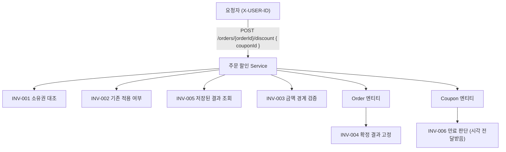

# 주문 할인 설계 기록 (W1)

> **이 문서의 목표** — 문서만 넘기고 자리를 떠도, 사람이든 AI든 같은 결과물을 만들 수 있게 한다.
> 그 판정 기준은 네 가지가 다 있는가이다: **기능 요구사항 · 비기능 요구사항 · 제약사항 · 불변식**
>
> **작성 규칙** — 이 문서에는 코드를 넣지 않는다. 관찰값·계약·규칙만 남긴다.

## 이 문서의 위치 (PDCA)

**이 문서 전체가 PDCA 의 `Plan` 산출물이다.** W1 은 제품 코드를 만들지 않으므로 `Do` 에 해당하는 구현은 없다.

| 단계 | 언제 | 산출물 |
|---|---|---|
| **Plan** | **W1 (이 문서)** | 요구 분류, 기능·비기능 요구사항, 제약, 불변식, 계약, 책임, 설계 결정 |
| **Do** | W2 | 이 문서의 규칙 ID·반례·기대 결과를 테스트와 제품 코드로 옮긴다 |
| **Check** | W2 이후 | 구현 결과가 이 문서의 계약과 일치하는지 대조 |
| **Act** | W2 이후 | 어긋난 지점과 새로 열린 질문을 다음 Plan 으로 되돌린다 |

아래 본문의 `P · Plan` ~ `A · Act` 표기는 **이 문서 안의 구획**이다. Plan 단계 안에서도 근거 수집(현재 동작 관찰) → 설계 → 자체 점검 → 이월 정리의 순서를 밟았음을 보이기 위한 것이며, 주차 단위의 PDCA 와는 층위가 다르다.

**문서를 나누지 않은 이유** — 라운드톡의 HLD(배경·기능/비기능 요구사항·제약)와 LLD(불변식·도메인 정책·계약)를 한 파일에 담았다. W1 범위에서는 파일을 가를 때 생기는 상호 참조 비용이 내용보다 커서 구획으로만 나눴다. 도메인이 실제로 생기는 W2 부터 분리를 재검토한다.

---

# P · Plan

## 1. 배경

- 기획 티켓은 "주문에 쿠폰을 적용할 수 있어야 한다" 한 문장이었다. 그대로 구현하면 소유권·중복 적용·확정 후 금액 변동 같은 정책을 개발자가 대신 결정하게 된다.
- 현재 저장소에는 `example` 도메인만 있고 주문·쿠폰·회원 개념이 없다. `X-USER-ID` 같은 요청자 식별 장치도 없다. 즉 "현재 동작"에서 확인할 수 있는 것은 Example API 의 응답 계약뿐이다.
- 그래서 이번 주에는 제품 코드를 만들지 않고, W2 구현자가 정책을 추측하지 않도록 확인된 약속 · 이번 과제 전제 · 아직 답이 필요한 질문을 갈라 기록한다.

## 2. 기준 문장과 출처

> 구매자는 주문 확정 전에 보유 쿠폰을 적용할 수 있고, 확정된 할인 금액은 나중에 바뀌지 않아야 합니다.

- 출처: 1주차 실습 과제 "이번 주에 정해진 입력"

## 3. 요구사항 분류

### 3-1. 확인된 제품 약속 (사실)

기준 문장에서 근거를 직접 가리킬 수 있는 항목.

| # | 내용 | 근거 |
|---|---|---|
| F-1 | 구매자는 주문 확정 전에 보유 쿠폰을 적용할 수 있다. | 기준 문장 |
| F-2 | 확정된 할인 금액은 이후에도 유지된다. | 기준 문장 |

### 3-2. 이번 과제에서만 적용하는 실습 전제

제품 정책으로 확정된 것이 아니라 설계 범위를 좁히기 위해 주어진 조건. 일반화하지 않는다.

| # | 내용 | 되돌릴 때 영향 범위 |
|---|---|---|
| A-1 | 한 주문에는 쿠폰 한 장만 적용한다. | 복수 쿠폰을 허용하면 INV-002 와 그 반례, 409 응답, 할인 합산 순서 정의가 함께 바뀐다. request 에 배열이나 우선순위를 미리 넣지 않았으므로 되돌리는 비용은 API 형태 변경에 그친다 |
| A-2 | `finalAmount = originalAmount - discountAmount` 로 계산한다. | 세금·배송비가 계산에 들어오면 INV-003 의 금액 경계와 snapshot 필드가 함께 바뀐다. 영향 범위가 가장 넓은 전제다 |
| A-3 | 같은 요청의 결과를 재사용한다. | 재요청을 거절로 바꾸면 INV-005 의 기대 결과가 `200 SUCCESS` 에서 `409` 로 뒤집히고 NFR-1(멱등)도 함께 사라진다 |
| A-4 | 쿠폰 만료 여부는 요청 시작 시각을 기준으로 판단한다. | 저장 시각 기준으로 바꾸면 경계에 걸친 요청의 성공·실패가 뒤집힌다. 판단 시각을 Coupon 에 전달하는 구조(INV-006 책임)도 다시 봐야 한다 |

### 3-3. 제품 담당자에게 확인할 질문 (3~5개)

> 판정 기준: 답이 달라지면 **사용자 응답 / 저장 데이터 / 권한** 중 하나가 바뀌는가?
> 하나의 정책 질문이 여러 지점에 동시에 영향을 줄 수 있으므로, 해당되는 것을 모두 적는다. (멘토 확인)

| # | 질문 | 답이 A면 | 답이 B면 | 바뀌는 것 (복수 가능) |
|---|---|---|---|---|
| Q-1 | 한 쿠폰을 서로 다른 두 주문에 쓸 수 있는가? | **여러 주문 가능**: 사용 이력을 남길 필요가 없다. 매번 성공한다. | **한 번만**: "이 쿠폰은 이미 사용됨"을 저장해야 하고, 두 번째 요청에 대한 실패 응답이 하나 더 생긴다. (A-3/INV-005 는 *같은* 주문·쿠폰 재요청만 답하므로 이 경우는 비어 있다) | 저장 데이터, 사용자 응답 |
| Q-2 | 쿠폰은 상품 단위인가, 주문 단위인가? (적용 대상을 쿠폰 종류가 정하는가) | **주문 단위**: 원금 전체에 적용한다. 요청은 `couponId` 하나로 충분하고 기본 API 모양을 유지할 수 있다. | **상품 단위**: 주문에 담긴 여러 상품 중 어디에 적용할지 지목할 수단이 필요하다. 기본 API(`couponId` 만 받음)로는 표현할 수 없어 외부 계약이 달라진다. 할인액도 대상에 따라 달라진다. | 사용자 응답(외부 API 모양·응답 필드), 저장 데이터(할인이 어느 대상에 붙었는지) |
| Q-3 | 할인은 정률(%)인가, 정액(원)인가? | **정률**: 할인액이 주문 원금에 종속된다. 원금이 바뀌면 할인액도 바뀌므로, 확정 시점의 원금과 계산 결과를 함께 남기지 않으면 INV-004(확정 결과 보존)를 지킬 수 없다. | **정액**: 할인액이 쿠폰에 고정되어 원금과 무관하다. 대신 원금보다 큰 경우가 생기므로 INV-003(0 ≤ 할인액 ≤ 원금)의 절단 규칙이 필요하다. | 저장 데이터(무엇을 확정 시점에 남기는가), 사용자 응답(원금 미달 시 절단인지 거절인지) |

### 3-4. 도구(AI) 제안 처리

> 요구 문장·공식 정책·현재 동작에서 근거를 찾을 수 없는 제안은 제품 정책으로 채택하지 않는다.

이번 주 설계는 AI 도구(Claude)와의 대화로 진행했다. 도구가 제안한 항목과 그 판정은 다음과 같다.

| # | 도구가 제안한 내용 | 출처 유무 | 판정 | 사유 |
|---|---|---|---|---|
| 1 | INV-001 의 실패를 `403`/`409` 가 아니라 `404` 로 | **있음** — 강의 자료 "주문 존재를 노출하지 않고 거절" + 현재 동작(스타터가 없는 자원에 `404` 반환) | **채택** | `404 Not Found` 는 페이지뿐 아니라 데이터가 없을 때도 쓰는 코드이며, 스타터가 이미 그렇게 쓰고 있어 기존 동작과 일관된다 |
| 2 | INV-005 재요청은 실패가 아니라 `200 SUCCESS` (멱등) | **있음** — 실습 전제 A-3 "같은 요청의 결과를 재사용한다" | **채택** | "거절"이 아니라 "결과 재사용"이라고 적혀 있다. 재시도한 클라이언트에게 실패를 돌려주면 실제 상태와 응답이 어긋난다 |
| 3 | INV-004 의 책임을 Order 엔티티에 두기 | 판단 근거는 학습자가 세운 기준을 적용한 것이며, 요구 문장·현재 동작에 직접 근거는 없음 | **보류** | 확정값 보존의 책임 주체가 엔티티인지 Service 인지 판단이 서지 않는다. W2 에서 실제로 구현하며 재검토한다 |
| 4 | snapshot 으로 남길 6개 필드 목록 | **대체로 있음** — `snapshot` 은 강의 자료가 쓰는 용어이고("확정 시 snapshot", "snapshot 을 남기면"), 5개 필드는 과제 기본 API 의 응답 항목과 대응한다. 다만 "적용 시각"은 INV-006 에서 유추한 것으로 직접 근거가 없다 | **채택** | 확정 금액 보존(INV-004)을 지키려면 값을 복사해 두어야 한다는 근거가 자료에 있다. "적용 시각"의 필요 여부는 W2 구현에서 판단한다 |
| 5 | "비회원도 쿠폰을 쓸 수 있는가"를 질문 후보에서 제외 | **없음** — 이 시스템에 비회원 개념이 있다는 근거가 요구 문장·현재 동작 어디에도 없다 | **보류** | 출처가 없어 제품 정책으로 확정하지 않는다. 도구가 처음 제시한 "새 개념 창조" 라는 사유는 부정확했고, 실제 사유는 "출처 없음"이다. 필요해지면 담당자에게 확인한다 |

## 3.5 사용자와 사용 장면 (액터 · 유스 케이스)

**액터** — 이번 장면의 주 사용자는 **구매자** 하나다. 판매자·운영자·정산 시스템은 같은 주문을 보더라도 권한과 성공 기준이 다르지만, 이번 요구 문장에 근거가 없어 범위에서 제외하고 `A · Act` 에 질문 후보로 남긴다.

**UC-01 · 주문에 쿠폰 적용**

| 항목 | 내용 |
|---|---|
| 주 사용자 | 구매자 |
| 시작 조건 | 요청자가 소유한 주문이며 아직 확정되지 않았다 |
| 시작 사건 | 구매자가 `couponId` 를 선택해 적용을 요청한다 |
| 성공 결과 | 확정 시점의 계산 결과를 값으로 남기고(10-2), 주문 ID·원금·할인 금액·최종 금액을 반환한다 |
| 실패 결과 | 주문 없음 또는 소유자 다름(INV-001) / 이미 다른 쿠폰이 적용됨(INV-002) / 할인액이 금액 경계를 벗어남(INV-003) / 쿠폰 만료(INV-006) |
| 재요청 | 같은 주문·같은 쿠폰의 재요청은 실패가 아니라 첫 결과를 그대로 돌려준다(INV-005) |
| 종료 조건 | 성공한 할인 결과는 이후 정책·가격 변화에도 동일하다(INV-004) |

"CouponService 를 만든다"는 유스 케이스가 아니다. class 는 이 약속을 지키는 수단이다.

## 4. 기능 요구사항 (Functional)

| # | 요구사항 | 출처 |
|---|---|---|
| FR-1 | 구매자는 자신이 소유한, 아직 확정되지 않은 주문에 보유 쿠폰을 적용할 수 있다 | F-1 |
| FR-2 | 적용 결과로 주문 ID·원금·할인 금액·최종 금액을 반환한다 | 과제 기본 API 장면 |
| FR-3 | 확정된 주문의 할인 금액을 조회하면 확정 시점의 값이 그대로 반환된다 | F-2 |
| FR-4 | 적용에 실패하면 실패 성격에 따라 구분된 오류를 반환해 요청자가 다음 행동을 정할 수 있다 | 관찰(2단계) + 10-1 |

## 5. 비기능 요구사항 (Non-functional)

> 정합성·동시성·응답 의미·관찰 가능성 등. "무엇을 보장해야 하는가"를 상태로 쓴다.

| # | 요구사항 | 왜 필요한가 |
|---|---|---|
| NFR-1 | 같은 주문·쿠폰 요청이 여러 번 도착해도 할인 효과가 한 번만 반영된다 (멱등) | 네트워크 재시도로 요청이 중복될 수 있다. INV-005 |
| NFR-2 | 동시에 도착한 두 요청이 모두 "쿠폰 없음"을 읽고 각각 적용하는 상황을 허용하지 않는다 | 순차 요청은 상태 검사로 막히지만 동시 요청은 막히지 않는다. INV-002 |
| NFR-3 | 적용·계산·저장이 한 단위로 성립하거나 전부 취소된다 | 할인만 반영되고 금액이 저장되지 않는 중간 상태가 남으면 INV-003 이 깨진다 |
| NFR-4 | 실패한 요청의 원인을 운영에서 식별할 수 있다 (안정된 error code) | 같은 코드로 뭉개면 어떤 규칙이 깨졌는지 추적할 수 없다 |

## 6. 제약사항 (Constraints)

> 선택의 폭을 좁히는 조건. 무엇을 추가할 때 어떤 대가가 따르는지 함께 쓴다.

| # | 제약 | 그래서 못 하게 되는 것 |
|---|---|---|
| C-1 | 이번 주에는 `apps/commerce-api/src/main` 을 수정하지 않는다 | 주문·쿠폰 도메인을 실제로 만들 수 없다. 이 문서는 설계 기록까지만 남긴다 |
| C-2 | 응답 오류 표현이 기존 `ErrorType` 4종(`400`·`404`·`409`·`500`)으로 제한된다 | 실패를 5종 이상으로 나눌 수 없다. 세분화가 필요해지면 `ErrorType` 확장을 먼저 논의해야 한다 |
| C-3 | 응답 형식이 `ApiResponse{meta{result, errorCode, message}, data}` 로 고정되어 있다 | 실패 시 `data` 로 구조화된 문맥을 함께 주는 방식을 쓸 수 없다 |
| C-4 | 외부 결제(PG) 연동이 범위 밖이다 | 결제 확정·환불과 얽힌 할인 정합성은 이번에 다루지 않는다 |
| C-5 | `commerce-api` 외에 `commerce-batch`·`commerce-streamer` 가 같은 도메인을 공유하는 구조다 | API 를 거치지 않는 실행 경로가 생길 수 있어, Service 에만 둔 규칙은 그 경로에서 보장되지 않는다 |

---

# D · Design

## 7. 불변식과 반례 (INV-001..006)

> 불변식은 class 이름이 아니라 **관찰 가능한 상태 관계**로 쓴다.

| ID | 출처 구분 | 규칙 | 깨지는 입력 (반례) | 기대 결과 | 책임 후보 |
|---|---|---|---|---|---|
| INV-001 | 제품 약속 (F-1) | 구매자는 자신이 소유한 주문만 변경한다 | 다른 `X-USER-ID` 로 같은 주문에 쿠폰 적용을 요청 | `404 Not Found` / `FAIL` / `Not Found` / `data=null` — 주문의 존재 자체를 노출하지 않는다. 요청자는 대상을 다시 찾는다 | Service — 요청자 정보와 주문 양쪽을 봐야 하므로 한 엔티티 안에서 닫히지 않는다 |
| INV-002 | 실습 전제 (A-1) | 확정 전 한 주문에는 보유 쿠폰이 한 장만 적용된 상태여야 한다 | 쿠폰 A가 적용된 주문 #1001 에 쿠폰 B로 다시 적용 요청 | `409 Conflict` / `FAIL` / `Conflict` / `data=null` — 요청자는 주문의 현재 쿠폰 상태를 확인한다 | **Service** (버린 대안: Order 엔티티. 이번 범위에는 API 외의 실행 경로가 없어 지금 엔티티로 옮기는 것은 과한 추상화로 판단) |
| INV-003 | 실습 전제 (A-2) | `finalAmount = originalAmount - discountAmount` 이며 `0 ≤ discountAmount ≤ originalAmount` 이다 | 원금 10,000원 주문에 30,000원 정액 쿠폰 적용 요청 | `409 Conflict` / `FAIL` / `Conflict` / `data=null` — 절단하지 않고 거절한다 (버린 대안: 원금까지 절단해 200 반환) | Service — 주문 원금과 쿠폰 값 양쪽이 필요하다 |
| INV-004 | 제품 약속 (F-2) | 확정된 주문의 할인 금액은 이후 정책·가격 변화로 바뀌지 않는다 | 할인 정책을 10% → 20% 로 바꾼 뒤 과거 확정 주문의 최종 금액을 조회 | 확정 시점에 저장된 최종 금액이 그대로 반환된다. 재계산하지 않는다 | Order 엔티티 (**잠정 · 3-4 #3 보류**) — 확정 결과는 주문 자신의 저장값이라는 판단이나, Service 로 두는 안과 아직 가르지 못했다 |
| INV-005 | 실습 전제 (A-3) | 같은 주문·쿠폰으로 재요청해도 저장된 결과를 돌려주고 할인 효과가 늘지 않는다 | 같은 주문·같은 쿠폰으로 동일 요청을 두 번 전송 (네트워크 재시도) | `200 OK` / `SUCCESS` / `errorCode=null` / 첫 요청과 동일한 할인 결과. 할인 효과가 누적되지 않는다 (멱등) | Service — 저장된 적용 결과를 조회해 같은 요청인지 판정해야 한다 |
| INV-006 | 실습 전제 (A-4) | 쿠폰 만료 여부는 요청 시작 시각을 기준으로 판단한다 | 요청 도착 시각에는 유효하나 저장 시점에는 만료된 쿠폰으로 적용 요청 | 요청 시작 시각 기준으로 판단하므로 적용에 성공한다. 이미 만료된 뒤 도착한 요청은 `409 Conflict` / `FAIL` / `Conflict` / `data=null` | Coupon 엔티티 — 만료 여부는 쿠폰만의 상태이므로 쿠폰이 스스로 판단한다 (판단 시각은 Service 가 전달) |

> 다뤄야 할 주제: 소유권 / 쿠폰 개수 / 금액 경계 / 확정 결과 보존 / 중복 요청 / 만료 경계
> 출처 구분: `제품 약속` · `실습 전제` · `제품 질문`

## 8. 외부 API 계약

W2 기본 장면: `POST /api/v1/orders/{orderId}/discount`

| 항목 | 값 |
|---|---|
| method · path | `POST /api/v1/orders/{orderId}/discount` |
| 사용자 식별 | `X-USER-ID` 요청 헤더 (강의 자료의 INV-001 반례가 이 헤더를 기준으로 기술됨) |
| request | `couponId` |
| 성공 응답 | 주문 ID, 원금, 할인 금액, 최종 금액 |

### 오류 상황별 외부 의미

| 실패 상황 | HTTP status | `meta.result` | error code | `data` | 요청자의 다음 행동 |
|---|---|---|---|---|---|
| `couponId` 누락·형식 오류 | `400` | `FAIL` | `Bad Request` | `null` | 입력을 고쳐 재요청 |
| 주문이 없거나 요청자의 주문이 아님 (INV-001) | `404` | `FAIL` | `Not Found` | `null` | 대상을 다시 찾음 |
| 이미 다른 쿠폰이 적용됨 (INV-002) | `409` | `FAIL` | `Conflict` | `null` | 주문의 현재 쿠폰 상태 확인 |
| 할인액이 원금을 초과 (INV-003) | `409` | `FAIL` | `Conflict` | `null` | 다른 쿠폰 선택 |
| 쿠폰이 이미 만료됨 (INV-006) | `409` | `FAIL` | `Conflict` | `null` | 다른 쿠폰 선택 |
| 같은 주문·쿠폰 재요청 (INV-005) | `200` | `SUCCESS` | `null` | 첫 결과와 동일 | 실패가 아니다. 응답을 그대로 사용 |

- 기본 API 형태와 다르게 설계했다면 차이와 이유: 기본 장면(`POST /api/v1/orders/{orderId}/discount`, `couponId`)을 그대로 따른다. 다만 Q-2 의 답이 "상품 단위"로 오면 적용 대상을 지목할 수단이 필요해 request 형태가 달라진다. 답이 오기 전에는 배열이나 대상 필드를 미리 넣지 않는다.

## 9. 책임 경계

> 요청자가 알아야 할 개념을 줄이고, 변경 이유를 경계 안에 가둔다.
> 이름은 이미 있는 개념을 쓴다 — 새 개념을 만들지 않는다.

요청자는 조회·검증·계산·저장의 순서를 알지 못한다. 노출되는 개념은 `orderId` 와 `couponId` 둘뿐이다.

**책임을 가르는 기준** — 한 엔티티 안에서 닫히는 규칙은 그 엔티티가, 두 개 이상에 걸치는 규칙은 Service 가 진다.

| 규칙 | 책임 후보 | 보장해야 하는 상태·행동 |
|---|---|---|
| INV-001 주문 소유권 | Service | 요청자와 주문 소유자를 대조하고, 불일치 시 주문 존재를 노출하지 않는다 |
| INV-002 쿠폰 한 장 | Service | 적용 전 해당 주문의 기존 쿠폰 적용 여부를 확인한다 |
| INV-003 금액 경계 | Service | 원금과 쿠폰 값을 대조해 할인액이 0~원금 범위를 벗어나면 거절한다 |
| INV-004 확정 결과 보존 | Order 엔티티 (잠정) | 확정 시 계산 결과를 자신의 상태로 고정하고 이후 재계산하지 않는다 |
| INV-005 멱등성 | Service | 저장된 적용 결과를 조회해 같은 요청이면 그 결과를 반환한다 |
| INV-006 만료 판단 | Coupon 엔티티 | 전달받은 판단 시각으로 자신의 만료 여부를 답한다 |

책임 구분 대상: 주문 상태 확인(Service) / 쿠폰 사용 가능 여부 확인(Coupon) / 할인 계산(Service) / 결과 저장(Order)

## 10. 세 가지 설계 결정

### 10-1. 오류를 어떻게 구분하고 표현할지

- **선택** — 요청자가 취할 다음 행동을 기준으로 세 가지를 나눈다.

  | 실패 성격 | HTTP | error code | 요청자의 다음 행동 |
  |---|---|---|---|
  | 요청 값 자체가 잘못됨 (문법) | `400` | `Bad Request` | 입력을 고쳐 재요청 |
  | 대상이 없거나 노출하면 안 됨 | `404` | `Not Found` | 대상을 다시 찾음 |
  | 요청은 정상이나 현재 상태와 충돌 | `409` | `Conflict` | 주문·쿠폰의 현재 상태를 확인 |

- **버린 대안** — 실패를 모두 `400 Bad Request` 로 통일하고 `message` 문구로만 구분하기.
- **이유** — 관찰(2단계)에서 `abc`(문법 오류)와 존재하지 않는 ID가 이미 `400` / `404` 로 갈려 있었고, 반대로 존재하지 않는 ID와 미매핑 URL은 네 값이 모두 같아 요청자가 구분할 수 없었다. `message` 는 사람이 읽는 설명이라 클라이언트가 분기 근거로 쓸 수 없다. 상태 충돌을 `400` 에 합치면 요청자가 "입력을 고쳐야 하는지, 상태를 확인해야 하는지" 판단할 정보를 잃는다.

### 10-2. snapshot 저장 vs 재계산

- **선택** — 확정 시점의 계산 결과와 근거를 값으로 복사해 남긴다(snapshot). 조회 시 재계산하지 않는다.

  | 남기는 값 | 왜 필요한가 |
  |---|---|
  | `orderId` | 어느 주문의 결과인가 |
  | `couponId` | 어떤 쿠폰이 쓰였는가 (추적) |
  | `originalAmount` | 그 시점의 원금. 정률 할인이면 이 값이 있어야 금액이 설명된다 |
  | `discountAmount` | 계산된 할인액 |
  | `finalAmount` | 최종 금액 |
  | 적용 시각 | INV-006 의 만료 판단 기준이 된 시각 |

- **버린 대안** — 주문에 `couponId` 만 남기고, 금액이 필요할 때마다 쿠폰의 현재 정책으로 다시 계산하기.
- **이유** — 참조만 남기면 쿠폰 정책이 10%→20% 로 바뀌었을 때 과거 확정 주문의 금액까지 바뀌어 INV-004 가 깨진다. `finalAmount` 하나만 남기는 것도 부족하다. 나중에 "왜 이 금액인가"를 설명하려면 원금과 할인액이 함께 있어야 한다. 반대로 아직 확정 전인 견적 화면처럼 "현재 값"이 계약인 경우에는 재계산이 옳으므로, 이 선택은 *확정된* 주문에 한정한다.

### 10-3. 호출 순서를 숨길 내부 경계

- **선택** — Service 가 조회·검증·계산·저장의 순서를 조정하고, 엔티티는 자기 안에서 닫히는 규칙만 진다. 요청자(Controller·외부 호출자)는 그 순서를 알지 못한다.
- **버린 대안** — 모든 규칙을 Order 엔티티에 모아 `order.applyDiscount(coupon)` 하나로 감추기.
- **이유** — 이번 범위의 규칙 여섯 중 넷(INV-001·002·003·005)이 주문·쿠폰·요청자·저장소 중 둘 이상을 동시에 봐야 하므로, 엔티티 하나에 모으면 엔티티가 저장소와 요청자 정보를 알게 되어 오히려 결합이 늘어난다. 다만 `commerce-batch`·`commerce-streamer` 처럼 API 를 거치지 않는 실행 경로가 생기면 Service 밖에서 규칙이 깨질 수 있으므로, 그때 INV-002 를 엔티티로 옮기는 것을 재검토한다.

---

# D · Do — 현재 동작 관찰

> 이번 주에는 제품 코드를 만들지 않는다. 이미 존재하는 Example API의 동작만 관찰한다.

| 입력 | HTTP status | `meta.result` | error code | `data` |
|---|---|---|---|---|
| 존재하는 숫자 ID | `200 OK` | `SUCCESS` | `null` | 있음 |
| `abc` (숫자 아님) | `400 BAD_REQUEST` | `FAIL` | `Bad Request` | `null` |
| 존재하지 않는 숫자 ID | `404 NOT_FOUND` | `FAIL` | `Not Found` | `null` |
| 미매핑 URL | `404 NOT_FOUND` | `FAIL` | `Not Found` | `null` |

- 검증 위치: `apps/commerce-api/src/test/java/com/loopers/interfaces/api/ContractClassificationTest.java`
- 관찰 메모: 존재하지 않는 숫자 ID(입력 3)와 미매핑 URL(입력 4)의 네 값이 모두 같다. `message` 만 다르지만 `message` 는 계약 항목이 아니므로, 요청자는 "경로를 고쳐야 하는지, 다른 대상을 찾아야 하는지" 구분할 수 없다. 강의 자료는 미매핑 URL 을 "별도 경계"로 두었으나 현재 구현은 `ApiControllerAdvice` 가 `NoResourceFoundException` 을 `NOT_FOUND` 로 처리해 두 경우를 합치고 있다. 이번 주에는 제품 코드를 바꾸지 않으므로 관찰로만 남기고, 새로 설계하는 할인 API 에서는 같은 뭉개기를 반복하지 않도록 10-1 에서 실패를 세 갈래로 나누었다.

---

# C · Check

| 점검 항목 | 결과 |
|---|---|
| `git rev-parse HEAD` = 가이드 지정 commit | ✅ `313abe5821abd4bde6b29e2a16a849177cff01e2` |
| `git diff --name-only -- apps/commerce-api/src/main` 빈 출력 | ✅ 출력 없음 |
| Example E2E / ContractClassificationTest / 전체 test — 0개·skip 없이 통과 | ✅ `tests=15 skipped=0 failures=0 errors=0`, BUILD SUCCESSFUL |
| 사실 2 · 전제 4 · 질문 3~5 가 구분되어 있음 | ✅ 3-1 / 3-2 / 3-3 |
| INV-001..006 각 행에 출처·반례·기대 결과·책임 후보 있음 | ✅ 6행 |
| 설계 결정 3개마다 버린 대안과 이유 있음 | ✅ 10-1 / 10-2 / 10-3 |
| 이 문서에 코드가 없음 | ✅ 관찰값·계약·규칙만 기재 |

**환경 메모** — Docker Engine 29 는 API 1.40 미만을 거부하는데 Testcontainers 1.20.6 의 docker-java 는 1.32 를 보낸다. build/dependency 를 바꿀 수 없으므로 저장소 밖 `~/.docker-java.properties` 에 `api.version=1.44` 를 두어 우회했다. 스타터 저장소 차원의 문제로 공유가 필요하다.

---

# A · Act

## 아직 닫히지 않은 질문 (이번 주 3~5개에는 넣지 않음)

| 후보 | 왜 지금은 뺐는가 |
|---|---|
| 쿠폰에 사용 조건(최소 주문금액 · 쿠폰 자체 최대 할인액)이 존재하는가? | 없다고 두어도 이번 흐름 구현이 멈추지 않는다. 우선순위 밀림 |
| 배송비에도 쿠폰을 적용할 수 있는가? | 주문에 배송비가 존재한다는 근거가 요구 문장·현재 동작 어디에도 없다 |
| 구매자가 아닌 액터(운영자·판매자)도 쿠폰을 적용할 수 있는가? | 구매자 기준으로 구현을 시작할 수 있어 손이 멈추지 않는다 |
| 쿠폰 발급(수량·대상·발급 방식)은 어떻게 정해지는가? | 이번 장면은 "이미 보유한 쿠폰의 적용"이라 발급 도메인은 범위 밖 |
| 중복 요청이 결제까지 두 번 일으킬 수 있는가? | 이번 장면은 "주문 확정 전" 적용이라 결제 흐름과 분리되어 있다 |

## W2로 넘길 것

| 항목 | 내용 |
|---|---|
| 규칙 ID | `INV-001` ~ `INV-006` (의미를 바꿔 재사용하지 않는다) |
| 입력 · 기대 결과 | 3장 INV 표의 반례와 기대 결과를 그대로 테스트로 옮긴다 |
| 책임 후보 | Service(INV-001·002·003·005) / Order(INV-004) / Coupon(INV-006) |
| 외부 계약 | `POST /api/v1/orders/{orderId}/discount`, `X-USER-ID` 헤더, 8장 오류 표 |
| 재검토 조건 | Q-1·Q-2·Q-3 의 답이 오면 INV-002·003·005 와 request 형태를 다시 본다 |
| 미해결 | `ErrorType` 4종으로 실패 구분이 충분한지 (C-2) |
