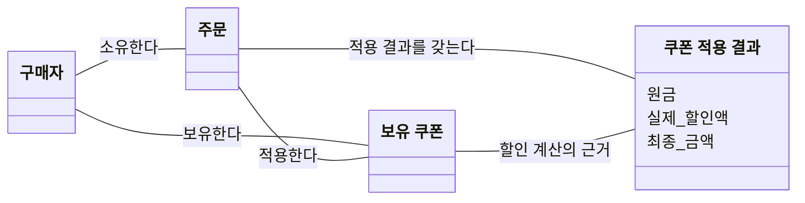

# 설계 문서

## 이번 주에 정해진 입력

- **확인된 제품 약속:** 구매자는 주문 확정 전에 보유 쿠폰을 적용할 수 있고, 확정된 할인 금액은 이후에도 유지된다.
- **실습 장면의 조건:** 쿠폰 한 장, `finalAmount = originalAmount - discountAmount`, 같은 요청의 결과 재사용, 요청 시작 시각의 만료 판단.
- **학습자가 정할 것:** 실제 제품에 물어볼 질문, API 오류 의미, 규칙을 맡을 책임과 내부 경계, 비교할 대안.

## 1. 기존 테스트에서 확인한 내용

`ExampleV1ApiE2ETest`를 읽고 다음 결과를 예상했다.

- 존재하는 숫자 ID: 2xx
- 숫자가 아닌 ID `나나`: 400 Bad Request
- 존재하지 않는 숫자 ID `-1`: 404 Not Found

기존 실행에서 세 테스트가 모두 통과했다. 다만 이 테스트에는 미매핑 URL이 없고, 응답 body의 공통 필드도 모두 확인하지는 않는다.

## 2. 네 HTTP 입력의 관찰 결과

| 사례 | HTTP 입력 | 실행 전 예상 | 실제 HTTP status | `meta.result` | `meta.errorCode` | `data` 존재 여부 |
| --- | --- | --- | --- | --- | --- | --- |
| 정상 숫자 ID | `GET /api/v1/examples/{존재하는 ID}` | 2xx | 200 | `SUCCESS` | `null` | 있음 |
| 숫자가 아닌 ID | `GET /api/v1/examples/abc` | 400 (`나나` 사례 기준) | 400 | `FAIL` | `Bad Request` | 없음 |
| 존재하지 않는 숫자 ID | `GET /api/v1/examples/-1` | 404 | 404 | `FAIL` | `Not Found` | 없음 |
| 미매핑 URL | `GET /api/v1/no-mapping-url` | 기존 테스트 범위 밖 | 404 | `FAIL` | `Not Found` | 없음 |

## 3. 요구사항에서 확인한 내용과 남은 질문

### 기준 문장과 출처

> 구매자는 주문 확정 전에 보유 쿠폰을 적용할 수 있고, 확정된 할인 금액은 나중에 바뀌지 않아야 합니다.

### 확인된 사실

| ID | 확인된 사실 | 출처 |
| --- | --- | --- |
| FACT-001 | 구매자는 주문 확정 전에 자신이 보유한 쿠폰을 적용할 수 있다. | 과제의 확인된 제품 약속 |
| FACT-002 | 확정된 할인 금액은 이후에도 유지된다. | 과제의 확인된 제품 약속 |

### 실습 장면의 조건

| ID | 실습 조건 | 출처 |
| --- | --- | --- |
| CONDITION-001 | 한 주문에는 보유 쿠폰 한 장만 적용한다. | 학습 본문 INV-002 |
| CONDITION-002 | `finalAmount = originalAmount - discountAmount`이며, `0 ≤ discountAmount ≤ originalAmount`를 지킨다. | 계산식은 과제, 할인액 범위는 학습 본문 INV-003 |
| CONDITION-003 | 같은 주문·쿠폰으로 다시 요청하면 저장된 결과를 반환하고 할인 효과를 늘리지 않는다. | 과제의 결과 재사용, 학습 본문 INV-005 |
| CONDITION-004 | 쿠폰 만료 여부는 요청 시작 시각을 기준으로 판단한다. | 과제의 만료 판단, 학습 본문 INV-006 |

### 질문을 선택한 기준

주어진 요구만으로 의미나 처리 기준을 정할 수 없는 부분을 질문으로 선정했다.

### 제품 질문 5개
  
다음 질문은 모두 **정책 확인 필요(보류)** 상태다. 처리 기준을 아직 정하지 않았으며, 아래 설계 선택이 이 질문들의 답을 대신하지 않는다.

| ID | 내가 고민한 상황과 질문 | 기존 요구와의 연결 | 답에 따라 달라지는 항목 |
| --- | --- | --- | --- |
| QUESTION-001 | 같은 구매자가 여러 브라우저·기기에 로그인한 뒤, 서로 다른 상품의 주문에 같은 보유 쿠폰을 동시에 적용하려고 한다. 각 주문의 쿠폰 적용은 어떤 기준으로 허용하거나 거절하는가? | 보유 쿠폰 적용. 같은 주문의 재요청과는 다른 상황이다. | 사용자 응답·저장 데이터: 각 주문의 적용 성공·실패와 쿠폰 사용 상태 |
| QUESTION-002 | 요청 시작 시각과 쿠폰 만료 시각이 정확히 같으면 쿠폰을 사용할 수 있는가? | 요청 시작 시각을 기준으로 만료 판단 | 사용자 응답: 적용 성공 또는 만료 오류 |
| QUESTION-003 | 주문 요청을 보낸 뒤 주문 서버가 다운되면 이미 보낸 주문 요청은 어떻게 처리되는가? 만약 주문이 누락되어 처리되지 않았다면, 그 주문에 사용하려던 쿠폰을 다시 사용할 수 있는가? | 주문 요청의 결과와 쿠폰 적용·재요청 결과 | 사용자 응답·저장 데이터: 주문 처리 결과와 쿠폰의 사용 가능 여부 |
| QUESTION-004 | 원금(`originalAmount`)은 상품 가격의 합계인가, 아니면 상품 할인 등 다른 할인이 이미 반영된 금액인가? | `finalAmount = originalAmount - discountAmount`와 `0 ≤ discountAmount ≤ originalAmount`의 기준 금액 | 사용자 응답·저장 데이터: 할인 계산의 기준, 실제 할인액의 상한과 최종 금액 |
| QUESTION-005 | 확정된 할인 금액을 유지한다는 약속은 해당 주문을 환불하는 경우에도 적용되는가? | 확정된 할인 금액 보존 | 저장 데이터: 환불한 주문의 기존 할인 금액을 유지하는 범위 |

#### AI 제안의 보류·거절
- **쿠폰의 주문 간 일회성 사용 제한·선착순 처리: 보류.** 주어진 요구에서 확인되지 않은 정책이며, QUESTION-001의 답변이 필요하다. 한 주문에 쿠폰 한 장을 적용한다는 조건만으로 여러 주문 사이의 사용 제한까지 정하지 않는다.
- **주문 수량·구성 변경을 핵심 질문으로 추가: 거절.** 내가 제시한 고민을 넘어 AI가 확장한 사례이므로 이번 질문 목록에서 제외했다.
  
## 4. 여섯 규칙을 반례와 연결한다

| 규칙 ID | 규칙 | 출처 구분 | 깨지는 입력 | 기대 결과 | 책임 후보 |
| --- | --- | --- | --- | --- | --- |
| INV-001 | 구매자는 자신의 주문만 변경할 수 있고, 타인의 주문 존재를 알 수 없어야 한다. | 실습 조건: 학습 본문 INV-001 | B가 자신의 쿠폰으로 A의 주문을 변경한다. 같은 요청 형식으로 존재하지 않는 주문도 요청한다. | 두 경우를 구분할 수 없는 동일한 응답으로 거절한다. 구체적인 오류 표현은 5.1에서 선택한 `ORDER_NOT_FOUND`를 사용한다. 주문 금액과 적용 결과는 변경하지 않는다. | 주문 접근 확인과 외부 오류 응답 |
| INV-002 | 주문 확정 전, 한 주문에는 구매자가 보유한 쿠폰 한 장만 적용한다. | 제품 약속: FACT-001 실습 조건: CONDITION-001, 학습 본문 INV-002 | 같은 주문에 쿠폰 A와 B를 각각 요청해 두 장이 함께 적용된다. 또는 자신의 주문에 타인의 쿠폰을 적용한다. | 두 쿠폰을 누적 적용하지 않는다. 타인의 쿠폰과 주문 확정 뒤 신규 적용은 거절한다. | 주문 할인 변경과 쿠폰 사용 가능 판단 |
| INV-003 | `finalAmount = originalAmount - discountAmount`와 `0 ≤ discountAmount ≤ originalAmount`를 함께 지킨다. | 실습 조건: CONDITION-002, 학습 본문 INV-003 | 원금 `1,000원`, 실제 할인액 `1,500원`, 최종 금액 `-500원`인 결과를 성공으로 저장한다. | 범위를 벗어난 결과를 성공으로 저장·반환하지 않는다. 실제 할인액이 `1,000원`이면 최종 금액은 `0원`이다. | 할인 계산과 금액 범위 확인 |
| INV-004 | 주문 확정 뒤 할인 결과를 현재 정책으로 다시 계산해 바꾸지 않는다. | 제품 약속: FACT-002 학습 본문 INV-004 | 할인액을 `2,000원`으로 확정한 뒤 쿠폰 정책이 `1,000원`으로 바뀌자, 기존 주문의 할인액도 바뀐다. | 할인액 `2,000원`과 당시 최종 금액이 그대로 유지된다. | 확정 할인 결과 보존 |
| INV-005 | 같은 주문·쿠폰 재요청에는 저장된 결과를 반환하고 이미 적용 받은 할인을 변경하지 않는다. | 실습 조건: CONDITION-003, 학습 본문 INV-005 | 첫 적용은 저장됐지만 응답이 유실됐다. 같은 요청을 다시 보내자 할인 결과가 추가로 저장되거나 다른 금액이 반환된다. | 요청자의 접근 권한을 확인한 뒤 최초 결과를 반환한다. 중복 저장·추가 할인은 없다. | 재요청 판별과 기존 결과 재사용 |
| INV-006 | 신규 쿠폰 적용의 만료 여부는 요청 시작 시각으로 판단한다. | 실습 조건: CONDITION-004, 학습 본문 INV-006 | 만료가 `12:00:00`인 쿠폰을 `11:59:59`에 요청해 `12:00:01`에 처리했는데, 완료 시각을 기준으로 거절한다. | 요청 시작 때 유효했다면 만료를 이유로 거절하지 않는다. 시작 시각과 만료 시각이 같은 경우는 QUESTION-002 답변 후 정한다. | 요청 시각 기록과 쿠폰 만료 판정 |

## 5. 외부 계약과 내부 경계를 선택한다

### 5.1. 외부 API 계약

과제에서 제시한 method·path, 쿠폰 ID 요청, 주문·금액 응답 구성을 사용한다.

| 항목 | 설계 내용 |
| --- | --- |
| Method | `POST` |
| Path | `/api/v1/orders/{orderId}/discount` |
| 사용자 식별 | `X-USER-ID`를 구매자 식별 입력으로 받고 주문 접근 권한을 확인한다. |
| Request | body에 쿠폰 ID 하나를 받는다. 예: `{"couponId": 10}` |
| Success | `200 OK`와 기존 `ApiResponse` 형식으로 응답한다. |
| 성공 데이터 | `data`에 `orderId`, `originalAmount`, `discountAmount`, `finalAmount`를 담는다. |
| Error | `meta.result=FAIL`, `meta.errorCode`, `meta.message`, `data=null`을 사용한다. |

`X-USER-ID`는 실습의 식별 입력이다. 헤더를 받는 것만으로 실제 인증이나 위조 방지까지 구현됐다고 보지는 않는다.

#### 오류 의미

아래 업무 오류 코드와 HTTP 응답의 조합은 과제에서 학습자가 정하도록 한 API 오류 의미에 대한 설계 선택이다. 학습 본문에 제시된 코드 목록이나 기존 Example API에서 관찰한 오류 코드로 보지는 않는다. 도메인 오류에는 HTTP status를 넣지 않고 API 계층에서 변환한다.

| 업무 오류 코드 | 의미 | API의 HTTP 응답 |
| --- | --- | --- |
| `INVALID_REQUEST` | 요청 값이 없거나 형식이 잘못됐다. | `400 Bad Request` |
| `COUPON_NOT_OWNED` | 구매자가 보유하지 않은 쿠폰이다. | `403 Forbidden` |
| `ORDER_NOT_FOUND` | 주문이 없거나 요청자의 주문이 아니다. 두 경우를 외부에 구분하지 않는다. | `404 Not Found` |
| `COUPON_NOT_FOUND` | 쿠폰을 찾을 수 없다. | `404 Not Found` |
| `ORDER_NOT_DISCOUNTABLE` | 현재 주문에는 쿠폰을 적용할 수 없다. | `409 Conflict` |
| `COUPON_EXPIRED` | 요청 시작 시각을 기준으로 쿠폰이 만료됐다. | `409 Conflict` |

오류 응답에서 지킬 사항은 다음과 같다.

- 타인의 주문과 없는 주문은 같은 HTTP status, 오류 코드, 메시지(`주문을 찾을 수 없습니다.`), `data=null`로 응답한다.
- 검증에서 거절한 신규 요청은 주문 금액과 적용 결과를 변경하지 않는다.
- 저장은 완료됐지만 응답만 유실된 경우는 아래 재요청 조건에 따라 처리한다.

### 5.2. 같은 요청의 조건과 식별 제안

**주어진 조건(INV-005)**

같은 주문·쿠폰 재요청에는 저장된 결과를 반환하고 할인 효과를 늘리지 않는다. 적용 결과가 저장됐지만 응답만 유실된 경우도 여기에 해당한다. 재요청에서도 주문 소유권 규칙(INV-001)에 따라 접근 권한을 확인한다.

**설계 제안**

기존 설계의 구매자 식별값(`X-USER-ID`), `orderId`, `couponId` 조합으로 같은 주문·쿠폰 재요청을 식별하는 방안을 제안한다. 별도 요청 식별자는 추가하지 않는 안이다.

**이 제안으로 결정되지 않는 정책**

- **QUESTION-001:** 서로 다른 상품의 별도 주문은 같은 요청으로 합치지 않는다. 그러나 그 주문들에 같은 쿠폰을 함께 사용할 수 있는지는 별도의 정책이다.
- **QUESTION-003:** 저장된 결과를 재사용한다는 조건만으로 모든 서버 장애의 처리 정책이 정해지지는 않는다. 주문 누락·초기화나 쿠폰 복원을 사실로 가정하지 않는다.

### 5.3. 세 가지 설계 결정과 비교한 대안

#### 결정 1. 오류는 업무 코드로 구분한다

규칙마다 예외 클래스를 따로 만들 수도 있겠지만, 이번에는 주문 할인에서 사용하는 공통 도메인 예외에 업무 오류 코드를 담는 방식으로 정했습니다. HTTP 상태로 바꾸는 일은 API 계층에서 맡도록 했습니다.

지금은 오류 코드로 실패 이유를 구분할 수 있어서, 예외 클래스까지 각각 나눌 필요는 없겠다고 생각했습니다. 나중에 오류마다 처리하는 방식이 달라진다면 그때 타입을 나누는 것도 다시 고민해보려고 합니다.

#### 결정 2. 확정 금액은 snapshot으로 보관한다
확정된 원금·실제 할인액·최종 금액은 snapshot으로 저장하는 방식을 선택했습니다.

조회할 때마다 최신 정책으로 다시 계산하는 방법도 생각했지만, 그러면 쿠폰 정책이 바뀌었을 때 과거 주문의 금액까지 달라질 수 있습니다. 이번 요구에서는 확정된 금액을 유지해야 하므로, 계산한 값을 snapshot으로 관리하는 쪽이 맞겠다고 판단했습니다(INV-004).

같은 주문·쿠폰을 다시 요청했을 때도 이전에 성공한 결과를 돌려줘야 하므로, 적용 결과를 기록해두려고 합니다(INV-005).

이 부분은 처음에는 비슷하게 느껴졌는데, 저장하는 이유가 달랐습니다. 재요청에서는 같은 처리를 반복해 할인 효과가 늘어나지 않게 하려는 것이고, 주문 확정 후에는 정책이 바뀌어도 당시 금액을 유지하려는 것입니다.

그래서 적용 결과를 저장했다는 이유만으로 주문이 확정됐다고 보지는 않았습니다. 그렇다고 두 기록을 별도 테이블이나 클래스로 나눌지까지 정한 것은 아닙니다.

#### 결정 3. 쿠폰 적용의 처리 순서는 호출자가 직접 조합하지 않도록 하기

Controller에서 접근 권한을 확인하고, 기존 결과를 조회하고, 검증·계산·저장을 각각 호출하는 방법도 생각할 수 있습니다. 하지만 이렇게 하면 Controller가 쿠폰 적용에 필요한 단계와 순서를 모두 알아야 합니다.

이번에는 Controller가 쿠폰 적용을 요청하면, 주문 할인 처리를 맡은 쪽에서 필요한 단계를 조율하도록 설계하려고 합니다. Controller는 필요한 입력을 전달하고 결과나 오류를 받는 방법만 알도록 하고요.

내부에서는 주문 접근 권한을 확인하고, 같은 주문·쿠폰의 기존 결과가 있다면 재사용합니다. 신규 적용이라면 필요한 검증과 계산을 거쳐 결과를 저장하도록 합니다.

이렇게 하면 호출하는 쪽에서 검증을 빠뜨리거나 재요청인데도 새로 계산하는 흐름을 만들지 않도록 책임을 모을 수 있겠다고 생각했습니다. 내부 처리 순서가 바뀌더라도 Controller가 그 순서를 다시 조합할 필요도 없고요.

### 5.4. 제품 답변 전까지 확정하지 않는 정책

위 API와 내부 경계를 설계하더라도, 다음 정책은 여전히 답변이 필요하다.

| 질문 ID | 아직 정하지 않은 내용 |
| --- | --- |
| QUESTION-001 | 서로 다른 주문에 같은 쿠폰을 동시에 적용할 때의 허용·거절 기준 |
| QUESTION-002 | 요청 시작 시각과 쿠폰 만료 시각이 같을 때의 허용 여부 |
| QUESTION-003 | 서버 장애 이후 주문 처리 결과와, 주문이 처리되지 않았을 때 쿠폰을 다시 사용할 수 있는지 |
| QUESTION-004 | 원금이 상품 가격 합계인지, 다른 할인이 반영된 금액인지 |
| QUESTION-005 | 환불한 주문에도 확정 할인 금액 보존 약속이 적용되는지 |

---

### 용어와 개념 다이어그램

| 용어 | 이 문서에서 사용하는 의미 |
| --- | --- |
| 구매자 | 자신의 주문에 보유 쿠폰을 적용하려는 주체 |
| 보유 쿠폰 | 구매자가 보유한 쿠폰. 한 주문에 한 장이라는 조건을 주문 간 일회성 사용 제한으로 확대하지 않는다. |
| 쿠폰 적용 결과 | 주문에 쿠폰을 적용하여 얻은 원금·실제 할인액·최종 금액 |
| 원금(`originalAmount`) | 계산식과 실제 할인액 상한의 기준 금액. 상품 가격 합계인지 다른 할인 반영 후 금액인지는 QUESTION-004로 확인한다. |
| 주문 확정 | 학습 본문에서 할인 금액 보존의 기준으로 제시한 상태·사건. |
| 같은 주문·쿠폰 재요청 | 학습 본문 INV-005가 기존 결과를 반환하도록 정한 요청. 서로 다른 상품의 별도 주문에 같은 쿠폰을 사용하는 QUESTION-001과 구분한다. |

선은 개념 사이의 관계이며, 처리 순서를 뜻하지 않는다. 
