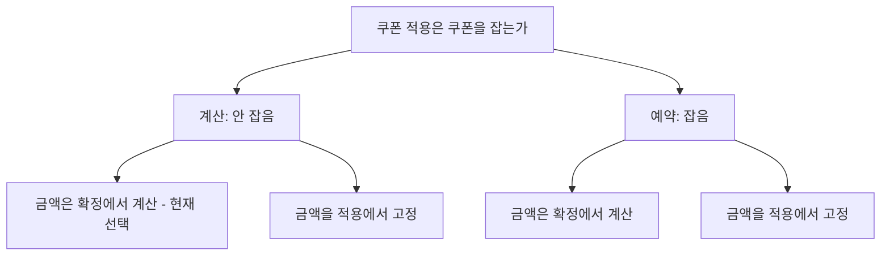
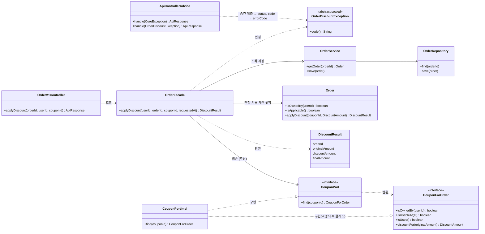
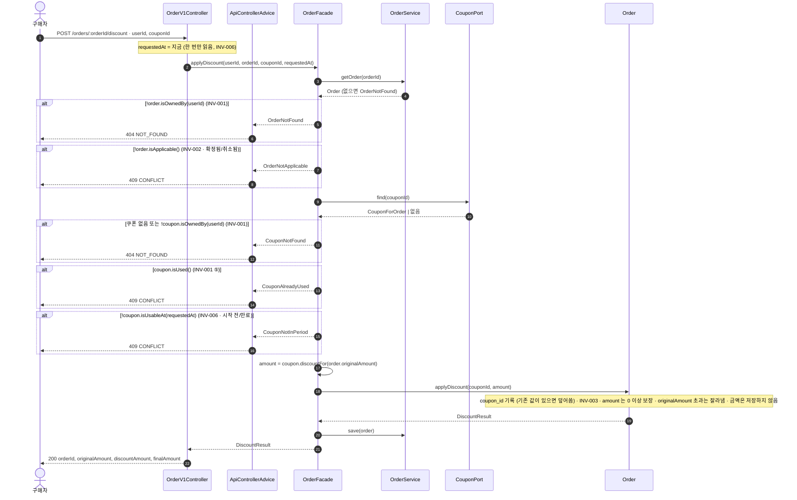

# 주문 할인 설계 기록 (W1)

## 기준 문장

> 구매자는 주문 확정 전에 보유 쿠폰을 적용할 수 있고, 확정된 할인 금액은 나중에 바뀌지 않아야 합니다.

출처: Vol5 W1 Action Quest "이번 주에 정해진 입력 — 확인된 제품 약속". 같은 문장이 W1 강의 자료 "주문 흐름에서 먼저 지킬 약속" 절에 "제품 담당자와 범위를 확인한 뒤 고친 문장"으로 소개된다.

"나중에"는 빼도 뜻이 달라지지 않아 약속으로 세지 않았다. 문장에 있는 동사는 **"적용" 하나**다. 교체·해제·취소는 문장에 없다(→ Q-5). "확정"은 문장의 핵심 단어인데 어느 사건인지 정의가 없다(→ Q-3).

---

## 1. 확인된 사실 (2)

문장·공식 정책·현재 동작에서 근거를 가리킬 수 있는 것.

| # | 사실 | 근거 | 관련 규칙 |
|---|---|---|---|
| F-1 | 구매자는 주문 확정 전에 자기가 보유한 쿠폰을 적용할 수 있다 | 기준 문장의 "주문 확정 전에" · "보유" | `INV-002` (확정 전), `INV-001` (쿠폰에 보유자가 있다) |
| F-2 | 확정된 할인 금액은 이후 정책·가격 변화에도 바뀌지 않는다 | 기준 문장의 "확정된 … 바뀌지 않아야" | `INV-004` |

F-1이 문장에서 실제로 나오는 것은 둘이다. 적용이 확정보다 앞이라는 **순서**, 그리고 쿠폰에 **보유자**라는 개념이 있다는 것.

문장에 없는데 규칙이 쓰고 있는 것은 셋이다.

- **"보유 쿠폰만".** 문장은 "적용할 수 있다"는 허용을 말했지, "보유하지 않은 쿠폰은 안 된다"는 금지를 말하지 않았다. "만"은 우리가 넣었다.
- **주문 소유권.** 문장은 "주문"이라고만 하고 그것이 누구 것인지 말하지 않는다. 맥락상 자연스러운 읽기이지만 해석이다.
- **요청자가 누구인가.** 문장은 "구매자"라는 업무 개념만 말하고 HTTP 요청을 보낸 주체는 말하지 않는다. 요청자를 구매자로만 보는 것은 「외부 계약」의 액터 결정이다.

앞의 둘은 **보안 기본**에서 온다. 남의 주문·쿠폰을 막는 것은 제품이 약속해서가 아니라 그러지 않으면 사고이기 때문이고, 표의 출처 구분을 `INV-001` 행에서 「제품 약속」으로 적은 것은 세 값 중 가장 가까운 것을 고른 결과이고, 실제로는 둘이 섞여 있다. 404/403 선택을 "보안 정책이 정할 항목"으로 분류해 질문에서 내린 것과 같은 출처다.

## 2. 실습 장면의 조건 (4)

답을 기다리는 동안 둔 판단. 뒤집힐 수 있으므로 영향 범위를 남긴다.

| # | 조건 | 관련 규칙 | 뒤집히면 |
|---|---|---|---|
| C-1 | 한 주문에 쿠폰 한 장 | `INV-002` | 요청 필드가 복수가 되고 `INV-002`의 "한 장"이 사라진다 |
| C-2 | `finalAmount = originalAmount - discountAmount` | `INV-003` | 식은 유지된다. 계산 방식이 바뀌어도 그대로 |
| C-3 | 같은 요청의 결과 재사용 | `INV-005` | "결과"의 범위와 "같은 요청"의 기준이 다시 필요해진다 |
| C-4 | 요청 시작 시각으로 만료 판단 | `INV-006` | 만료 판단 시점이 둘로 늘어난다 (→ Q-4) |

- **C-1.** 복수가 되면 둘이 함께 열린다.
  - `INV-003`에 할인액 **합산과 우선순위** 규칙이 붙는다. 정률을 먼저 적용하는가, 중복 사용이 가능한 조합인가.
  - 적용 기록의 **소유 방향**이 다시 열린다. `Order`가 `OrderDiscount` 목록을 갖는 쪽과, 발급분이 `orderId`를 드는 쪽이다. 후자로 가면 `Order`가 자기 할인 합계를 세려고 쿠폰 도메인을 조회해야 해서 「결정 3」이 무너진다. 어느 쪽이든 쿠폰 한 장은 주문 하나에만 붙으므로 여전히 1:N이고, 매핑 테이블이 필요한 M:N이 아니다.
- **C-2.** 식 자체는 정액·정률 모두 만족한다. 이 계약은 `discountAmount`를 쿠폰 쪽에서 받은 값으로 다루므로 계산 방식이 바뀌어도 식은 그대로다. 확정 전 원금이 변할 수 있으므로(아래 임시 판단) `originalAmount`는 요청마다 다시 읽는 값이지 고정된 값이 아니다. "적용된 할인을 유지할지 재계산할지"는 「결정 2」가 재계산으로 답한다.
- **C-3.** 적용이 `couponId`를 덮어쓰기만 하므로(「결정 2」) 같은 요청을 반복해도 같은 값이 남고 같은 계산이 나온다. 재사용이 구조로 나온다. "결과"를 응답 금액까지로 읽어도 마찬가지다 — 원금과 쿠폰 조건이 그대로면 값이 같고, 달라졌다면 그때는 달라진 값이 맞는 답이다.
- **C-4.** 주문 확정 시 재검증이 추가되면, 적용은 성공했는데 확정에서 막히는 구간이 생긴다.

처음에는 C-3과 C-4가 "적용 시점에 무언가 남는다"를 전제한다고 읽었다. 그렇지 않다. 재요청을 **알아볼** 필요가 없고(같은 값을 덮어쓰면 그만이다), 만료 기준 시각도 요청마다 새로 읽으면 된다. 여섯 규칙 중 적용 시점 저장을 요구하는 것은 하나도 없다. 그럼에도 `couponId` 하나를 저장하는 근거는 규칙이 아니라 기준 문장의 "적용할 수 있고"이며, 그 구분이 「결정 2」다.

## 3. 제품 담당자에게 물을 질문 (5)

답에 따라 사용자 응답·저장 데이터·권한 중 하나가 달라지고, 요구 문장·강의 자료·현재 동작 어디에서도 확인할 수 없는 것만 남긴다. 담당자가 답할 수 있도록 사용자에게 보이는 장면으로 묻는다.

| # | 질문 | 답이 바꾸는 것 |
|---|---|---|
| Q-1 | 쿠폰을 적용해 둔 주문서를 닫고 같은 쿠폰으로 다른 주문을 시작하면 막혀야 하는가? | 저장 데이터 |
| Q-2 | 쿠폰을 적용해 확인한 최종 금액은 주문을 확정할 때까지 보장되는가? | 사용자 응답, 저장 데이터 |
| Q-3 | "주문 확정"은 어느 사건인가? 주문 버튼 클릭 / 결제 승인 완료 / 판매자 승인 | 저장 데이터, 사용자 응답 |
| Q-4 | 유효할 때 고른 쿠폰이 확정 전에 만료되면 그 할인은 유지되는가? | 사용자 응답, 저장 데이터 |
| Q-5 | 적용한 쿠폰을 확정 전에 바꾸거나 뗄 수 있는가? | 사용자 응답, 저장 데이터 |

**Q-1** — 쿠폰 적용이 그 쿠폰을 잡아두는 행위인가, 계산만 하는 행위인가.

잡아둔다면 쿠폰 쪽에 매인 주문과 잡아둔 기간을 저장해야 하고, 기간이 끝났을 때 푸는 규칙과 구매자가 직접 푸는 경로(Q-5)가 필수가 된다. 계산만이면 쿠폰 상태는 그대로다.

**Q-2** — 적용 화면에서 본 9,000원이 확정 시점에 9,500원이 될 수 있는가.

- "보장된다"면 적용 시점에 금액을 굳혀야 한다. 지금은 아무것도 저장하지 않으므로(「결정 2」) 적용 기록 자체가 새로 생긴다.
- "확정 시점 값이 진짜다"면 확정에서 재계산하고, 확정 화면에 금액 재확인 단계가 필요하다.
- `INV-004`는 확정 **이후**만 보호하므로 이 구간을 답해 주지 않는다.
- 원인이 아니라 결과를 묻는 형태다. 원금 변동, 캠페인 소급, 만료 소급이 모두 이 한 질문으로 모인다.

**Q-3** — `INV-002`의 "확정 전" 구간 길이, `INV-004`가 발동하는 시점, snapshot이 만들어지는 위치가 모두 이 답에 붙는다.

**Q-4** — 확정 때 다시 판단하면 유효할 때 골라 둔 주문이 나중에 막히고, 판단하지 않으면 만료된 쿠폰으로 할인이 나간다. "봐준다"로 답하려면 **언제 골랐는지**를 알아야 하므로 적용 시점 저장이 필요해진다 — 「결정 2」가 뒤집히는 경로다.

**Q-5** — 되돌릴 수 있는가(사용자 응답), 덮어쓰기인가 이력인가(저장 데이터). "가능하다"면 해제 엔드포인트가 따라붙는다.

**질문끼리 겹치지 않는 이유.** Q-1은 저장이 쿠폰 도메인으로 번지는지와 Q-4의 존폐를 정하고, Q-2는 적용이 저장을 하게 되는지를 정한다. Q-4는 만료된 쿠폰으로 확정을 **허용하는가**를 묻고, Q-2는 금액이 **유지되는가**를 묻는다.

확정 전 원금이 변할 수 있다고 보므로(「임시 판단」), Q-2에서 구매자가 스스로 수량을 고쳐 금액이 달라지는 경우는 빠진다. 자기가 바꾼 것은 보장 대상이 아니다. 남는 것은 이 질문이다.

> 구매자가 주문서를 **건드리지 않았는데도** 최종 금액이 바뀔 수 있는가?

그러면 캠페인 소급과 만료 소급만 남고, 둘 다 "발급 이후 할인 조건 불변"이라는 임시 판단이 막고 있다. 그것이 서 있는 동안에는 Q-2의 두 답이 같은 응답을 내므로 금액을 굳히지 않는 결정이 성립한다. 그 판단이 뒤집히면 두 답이 갈라지고, 그때는 Q-2에 답이 있어야 한다.

| 갈래 | 따라오는 것 |
|---|---|
| **계산** | 같은 쿠폰이 여러 주문에 붙을 수 있음. 만료 재검증이 필요하고 Q-5 가 남음. 저장은 주문 쪽에만 |
| **예약** | 쿠폰이 다른 주문에서 막힘. 잡아둔 동안은 만료와 무관해 Q-5 가 거의 필요 없어짐. 대신 hold 기간이라는 새 질문이 생기고 저장이 쿠폰 쪽까지 확장됨 |

### 질문 후보였지만 질문으로 남기지 않은 것

**발급 뒤 캠페인 정책이 바뀌면 이미 받은 쿠폰도 따라 바뀌는가.** 처음 Q-2가 이 문장이었고, 원인을 묻는 형태라 질문에서 내렸다.

- 이 문장의 답이 바꾸는 것은 발급분과 `CouponCampaign`을 어떻게 잇느냐, 즉 쿠폰 도메인 안의 모양이다. 포트의 질문 네 개는 어느 답에서도 그대로이고 `CouponPortImpl`의 구현만 바뀐다.
- 담당자에게는 **결과**를 묻는 문장(현재의 Q-2)으로 바꿔 물었다. 사용자에게 보이는 장면으로 물어야 담당자가 답할 수 있고, 그렇게 물으면 원금 변동·캠페인 소급·만료 소급이 한 질문으로 모인다. 원인을 각각 묻는 것은 우리 저장 구조를 담당자에게 설명해 달라고 하는 것과 같다.
- 애초에 질문이 아니라 **조사 항목**이다. 담당자가 아직 정하지 않은 것이 아니라 캠페인 도메인에 이미 있거나 그쪽이 정할 사실이므로, 확인하면 답이 나온다. 확인 상대는 제품 담당자가 아니라 캠페인 쪽 담당자·코드다.
- 「외부 계약」의 임시 판단으로 남겼다.

**조건부로 열리는 질문 하나.** 위 조사에서 "캠페인이 배포 후 바뀐다"로 확인되면 그때 제품 질문이 하나 생긴다. *"구매자가 화면에서 본 할인율과 적용 결과가 다를 수 있는가? 다르면 조용히 적용하는가, 알려주고 막는가?"* 답이 요청 모양을 바꾸므로(기대 금액 필드) 질문 자격이 있지만, 지금 물으면 담당자가 그 상황이 왜 생기는지부터 되물어야 한다. 조사 결과가 먼저다. 「내부 경계」의 캠페인 불변 요구가 서면 이 질문은 열리지 않는다.

**운영자도 다른 사람의 주문에 쿠폰을 적용할 수 있는가** (강의 자료 예시). 장면을 그려보면 이 계약의 질문이 아니다. 구매자가 주문서를 보고 있는 동안 운영자가 끼어드는 장면은 없다. 실제 운영자 개입은 확정 전이면 **발급**(운영자가 쿠폰을 주고 구매자가 스스로 적용 → 액터는 여전히 구매자), 확정 후면 **사후 조정**(확정 snapshot은 그대로 두고 조정 기록을 얹음 → 별도 자원)으로 환원된다. 시점·액터·자원이 모두 달라 범위 밖으로 보낸다. 좋은 질문이 아니라는 뜻은 아니다 — 답이 권한과 감사 기록을 바꾸므로 담당자 질문의 전형이다. 다만 그 답이 바꾸는 것이 이 엔드포인트가 아니어서, 「외부 계약」에서 액터를 구매자로 좁히는 결정으로 처리하고 질문 자리는 이 계약의 응답을 바꾸는 것에 썼다. 액터를 운영자까지 넓히면 다시 질문으로 올린다.

**남의 주문·쿠폰 요청에 404와 403 중 무엇을 줄 것인가.** 답에 따라 응답이 달라지지만 제품 담당자가 아니라 보안 정책이 정할 항목이다. 강의 자료 `INV-001` 예시가 "존재를 노출하지 않고 거절"로 방향을 보여준다. 임시 판단(404, 보안 확인 필요)으로 둔다.

**쿠폰은 정액인가 정률인가, 반올림은 어떻게 하는가.** 기존 쿠폰 제품이 있다면 현재 동작에서 확인할 수 있는 조사 항목이고, 이 계약은 `discountAmount`를 입력으로 받으므로 계산 방식은 쿠폰 도메인의 결정이다. 범위 밖으로 보낸다.

## 4. 도구 제안 처리

출처 없는 제안은 채택하지 않고 보류·거절로 남긴다. 아래는 대화 중 도구(Claude)가 제안한 것과, 그에 대해 작성자가 검토·판단한 것이다. 강의 자료의 예시를 검토한 것은 「질문 후보였지만 질문으로 남기지 않은 것」에 있다.

| 제안 | 출처 | 판단 | 이유 |
|---|---|---|---|
| 쿠폰 소유권을 주문 소유권과 구분한다 | 도구 제안 (기준 문장의 "보유") | **채택** | 문장에 근거가 있다. F-1과 `INV-001`에 반영 |
| 쿠폰 적용 시 쿠폰을 RESERVED 상태로 점유한다 | 도구 제안 (실무 관행) | **보류 → Q-1** | 정책 근거가 없다. 이번 구현은 "계산"으로 둔다 |
| 주문 확정 시 쿠폰을 재검증한다 | 도구 제안 (실무 관행) | **보류 → Q-4** | 관행일 뿐 근거가 없고, 재검증 여부가 사용자 응답을 바꾼다 |
| 초안 주문 만료 후 예약 자동 해제 | 도구 제안 | **보류** | Q-1이 "잡아둔다"로 답해질 때만 의미가 생긴다 |
| 정률 할인의 반올림을 확정 시점에 고정한다 | 도구 제안 | **거절 (범위 밖)** | 쿠폰 도메인의 결정. 이 계약은 `discountAmount`를 입력으로 받는다 |
| 주문 취소 시 쿠폰 복구, 부분 환불 시 할인 배분 | 도구 제안 | **보류 (범위 밖)** | 확정보다 바깥의 사건이다 |
| 만료 판단 시각을 `java.time.Clock` 포트로 추상화한다 | 도구 제안 | **거절** | 아래 참고 |
| 도메인 전용 예외 계층 + `sealed` 중간 계층, Advice에서 변환 | 작성자 판단 | **채택 (W2)** | 아래 참고. 비교는 「네 안 비교」 |
| `CoreException` 상속만으로 처리 | 작성자 검토 | **거절** | 비용은 가장 작지만 기준 셋 중 둘을 통과하지 못한다 |
| `ErrorType`에서 `HttpStatus`를 떼어 Advice 대응표로 | 도구 제안 | **채택 행에 흡수** | 아래 참고 |
| `meta.errorCode`에 업무 오류 코드를 넣는다 | 도구 제안 | **채택 행에 흡수** | 아래 참고 |

**`Clock` 포트를 거절한 이유.** 어떤 질문의 답에도 뒤집히지 않아 포트의 근거가 없다. `INV-006`은 시계 추상화가 아니라 진입점에서 시각을 한 번 읽어 인자로 내려보내는 구조로 지킨다. 테스트용 `Clock` 주입은 진입점의 구현 편의로만 남긴다.

**예외 계층을 채택한 이유.** 「네 안 비교」의 세 기준을 모두 만족하는 유일한 안이다. 성질을 별도 필드가 아니라 타입으로 들기 때문에 분류가 한 곳에만 있고, 에러가 늘어도 Advice는 바뀌지 않는다(알맞은 중간 계층을 상속한 클래스 하나 추가로 끝). 비용은 템플릿 `Example`의 `CoreException` 방식과 공존한다는 것, 그리고 Advice 핸들러 하나 추가가 W2 범위에 있어야 한다는 것이다. 후자는 「현재 동작 관찰」 마지막 항목에서 확인했다.

**`CoreException` 상속안을 거절한 이유.** `CONFLICT` 넷이 `errorCode: "Conflict"`로 뭉치고, 만료→`CONFLICT`는 여전히 값 넷 중 고른 것이다. "응답은 같게, 로그만 다르게"는 `NOT_FOUND`로 나가는 것들(존재 숨김)에는 맞지만, `CONFLICT`로 나가는 넷에는 프론트가 분기하지 않는다는 전제가 필요하고 그 전제는 확인되지 않았다.

**흡수된 두 제안.** `ErrorType`과 `HttpStatus`의 결합은 실제로 있었다. 404/403 판단이 바뀌면 응용 코드가 던지는 `ErrorType`을 고쳐야 하고, 만료→`CONFLICT`는 업무 의미가 아니라 값이 넷뿐이어서 고른 것이었다. 도메인 예외가 성질을 자기 타입으로 들면 주문 쪽 코드가 `ErrorType`을 아예 쓰지 않으므로 `ErrorType` 자체를 고칠 필요가 없어진다. 업무 오류 코드도 같은 방식으로 풀린다. 도메인 예외의 `code()`를 Advice가 `errorCode`로 그대로 내보내면 되고, `ErrorType` enum에 값을 추가하는 방식은 버렸다. `ErrorType`을 건드리면 기존 네 값의 응답과 `ContractClassificationTest`에 영향이 가고 도메인이 다시 `ErrorType`을 알게 되기 때문이다. `NOT_FOUND` 네 경로는 존재 숨김을 위해 하나의 코드로 뭉친다. 템플릿의 기존 네 값은 그대로 둔다.

---

## 5. 현재 동작 관찰

`ContractClassificationTest` 실행 결과. 추측이 아니라 실제 응답이며, 테스트의 assertion과 이 표가 같은 값을 가리킨다.

| 입력 | HTTP status | `meta.result` | `meta.errorCode` | `data` |
|---|---|---|---|---|
| `GET /api/v1/examples/{저장된 id}` | 200 | `SUCCESS` | 없음 | 있음 |
| `GET /api/v1/examples/abc` | 400 | `FAIL` | `Bad Request` | 없음 |
| `GET /api/v1/examples/9223372036854775807` | 404 | `FAIL` | `Not Found` | 없음 |
| `GET /api/v1/this-endpoint-does-not-exist` | 404 | `FAIL` | `Not Found` | 없음 |

기존 `ExampleV1ApiE2ETest`가 확인하는 것은 위 표의 앞 세 줄과 같은 입력이지만(`나나`가 숫자 아닌 ID 자리) **status 뿐**이다(`is2xxSuccessful()`, `BAD_REQUEST`, `NOT_FOUND`). `meta.result`·`errorCode`·`data` 유무는 어느 기존 테스트도 assertion 하지 않는다. envelope을 추측하지 않으려면 관찰 테스트가 따로 필요했던 이유다. 미매핑 URL도 기존 테스트에 없는 네 번째 입력이다.

**관찰 메모**

- 없는 자원과 미매핑 URL이 같은 `404` + `Not Found`로 돌아와 응답만으로는 구분되지 않는다. 미매핑 URL도 `ApiControllerAdvice.handleNotFound(NoResourceFoundException)`을 거쳐 같은 envelope으로 감싸진다. 이 관찰이 「결정 1」의 표현을 정했다.
- `meta.errorCode`는 업무 코드가 아니라 HTTP reason phrase(`"Not Found"`, `"Bad Request"`)다. `ErrorType`이 `HttpStatus.getReasonPhrase()`를 코드로 쓴다.
- `ErrorType`에 `INTERNAL_ERROR / BAD_REQUEST / NOT_FOUND / CONFLICT` 네 개뿐이라 업무 의미를 담을 자리가 없다. 만료(`INV-006`) 실패를 어디로 보낼지는 「실패 → 응답 변환 표」에서 정한다.
- 실패의 표현 방식은 템플릿이 이미 정해 두었다. 도메인 계층 `ExampleService`가 `new CoreException(ErrorType.NOT_FOUND, ...)`를 직접 던지고, `ApiControllerAdvice.handle(CoreException)`이 `errorType.getStatus()`와 `getCode()`로 응답을 만든다. "안정된 업무 오류 코드 + 한 곳에서 변환" 방식이며 변환 지점은 이미 존재한다. 이 계약도 이 방식을 따른다.
- 계층 이름 컨벤션: `application/ExampleFacade`(응용) → `domain/ExampleService`(도메인) → `domain/ExampleRepository`(인터페이스) ← `infrastructure/ExampleRepositoryImpl`. `Service`는 도메인 계층의 이름이므로, 이 문서의 응용 진입점은 `Facade`로 부른다.
- `CoreException`, `ErrorType`, `ApiControllerAdvice` 셋 다 `apps/commerce-api/src/main` 안에 있다. 루트의 공용 모듈(`supports/jackson` 등)이 아니라 이 앱 소유이고, `support.error`를 참조하는 파일은 `apps/commerce-api` 안 8개뿐이라 `commerce-streamer`·`commerce-batch`는 영향받지 않는다. W2에서 고칠 수 있다는 뜻이며, 「결정 1」은 제약이 아니라 판단이다.

**「결정 1」을 실제 `ApiResponse`와 Spring 6.2.5로 컴파일해 확인한 것 셋**

1. Advice 추가분은 메서드 하나(7줄) + import 두 줄이고, 기존 핸들러 9개와 private 헬퍼는 무수정이다. `ApiResponse.fail(String, String)`이 이미 String 두 개를 받아 `ErrorType`을 경유하지 않는다.
2. 그 뒤 구체 클래스 5개를 더해도 Advice diff는 없다.
3. 도메인 예외 쪽에는 `HttpStatus`가 개입하지 않는다. Spring 없는 classpath에서 컴파일되고, 바이트코드 참조도 0건이며, `import` 문 자체가 없다.

다시 건드리는 경우는 새 성질(= 새 status)을 만들 때뿐이고, 그때는 `switch`가 컴파일 에러를 낸다. 미처리 예외를 500으로 삼키는 기존 `handle(Throwable)`이 있으므로, 이 컴파일 검사가 조용한 500을 막는다.

---

## 6. 불변식과 반례

이 번호는 W2의 테스트 이름과 지표에도 그대로 쓴다. 규칙이 사라지면 번호도 비워 두고 다른 규칙에 다시 붙이지 않는다. 같은 번호가 다른 뜻이 되면 문서와 테스트가 조용히 어긋나기 때문이다.

| 규칙 ID | 규칙 | 출처 구분 | 깨지는 입력 | 기대 결과 | 책임 후보 |
|---|---|---|---|---|---|
| `INV-001` | 구매자는 자신이 소유한 주문에, 자신이 보유한(발급받았고 아직 쓰지 않은) 쿠폰만 적용할 수 있다 | 제품 약속 | 다른 `X-USER-ID`로 남의 주문에 요청 | 거절. 주문의 존재를 노출하지 않는다 (`NOT_FOUND`) | 판정은 도메인 안 — `Order.isOwnedBy(userId)`와 `Coupon.isOwnedBy(userId)`가 각각 답한다. `OrderFacade`는 판정하지 않고 요청자 ID를 두 도메인에 넘긴 뒤 실패 ①~④를 존재 숨기는 하나의 의미로 모은다 (「추가 실패 경로와 해석」 참조) |
| `INV-002` | 쿠폰 적용은 적용 가능 상태(확정 전)의 주문에만, 한 주문에 최대 한 장이다 | 제품 약속 | 이미 확정된 주문에 쿠폰 적용 요청 | 거절 (`CONFLICT`) | "확정 전"은 `Order`가 자기 상태로 판정. "한 장"은 `orders.coupon_id`가 컬럼 하나라 구조로 보장되므로 판정할 것이 없다 (교체는 덮어쓰기) |
| `INV-003` | `0 ≤ discountAmount ≤ originalAmount`, `finalAmount = originalAmount - discountAmount` | 실습 조건 | 원금보다 큰 할인액 | 원금까지만 적용, `finalAmount = 0` | 상한은 `Order`가 자름 — 원금이 확정 전 변할 수 있어 드문 경로가 아니다. 하한(0 이상)은 검사하지 않고 포트 반환 타입 `DiscountAmount`(음수 생성 불가)가 보장 |
| `INV-004` | 확정된 할인 금액은 이후 정책·가격 변화에도, 누가 요청해도 바뀌지 않는다 | 제품 약속 | 확정 후 할인 정책을 10% → 20%로 변경하고 재조회 | 저장된 최종 금액이 동일 | `Order.confirm`이 만드는 snapshot (W2 범위 밖, 아래 참조) |
| `INV-005` | 같은 주문·쿠폰으로 다시 요청하면 효과를 늘리지 않고 같은 적용 상태를 돌려준다 | 실습 조건 | 같은 요청을 두 번 전송 | 두 응답이 같다. 누적될 효과가 없다 | 아무도 판정하지 않는다 — 같은 `couponId`를 덮어쓸 뿐이라 멱등이 구조로 나온다 |
| `INV-006` | 쿠폰의 사용 가능 기간 판정은 요청 시작 시각 한 번으로 한다 | 실습 조건 | 만료 직전 도착한 요청이 처리 도중 만료 시각을 지남 | 시작 시각 기준으로 성공 | 컨트롤러 — 시각을 한 번 읽어 `requestedAt`으로 내려보냄. 안쪽은 시계를 모른다 |

### 6.1 추가 실패 경로와 해석

표에는 규칙을 가장 작게 깨는 반례 하나만 두었다. 규칙을 두드려 보며 더 찾은 경로와, 규칙 문장에 숨어 있던 해석은 여기에 둔다. 한 불변식에서 실패는 여러 개 나오고, 그 실패들이 `ErrorType` 하나로 묶이거나 여러 개로 갈릴 수 있다. 불변식↔실패↔`ErrorType`은 일대일이 아니다.

**INV-001.** "보유"를 "발급받았고 아직 사용하지 않은"으로 읽은 것은 해석이며 임시 판단이다.

이 규칙만 책임이 한 객체로 모이지 않는 이유는 **두 도메인에 걸쳐 있기** 때문이다. 주문 소유권은 `Order`가, 쿠폰 소유권은 발급분이 답하는데 `Order`는 쿠폰을 모르고 발급분은 주문을 모른다. 그래서 둘을 엮는 자리만 밖에 남는다.

검토했으나 버린 방식이 하나 있다. 조회를 소유자 범위로 좁혀 `CouponPort.find(couponId, userId)`로 두면 "남의 쿠폰"과 "없는 쿠폰"이 애초에 같은 결과가 되어, 404로 뭉치는 것이 구조로 나온다. 그런데 그러면 서버도 둘을 구분할 수 없어 "실제 원인은 로그·지표에만 남긴다"(「외부 계약」)를 지킬 수 없다. 응답에서만 뭉치고 서버는 아는 쪽을 택했다.

실패 경로는 다섯이다.

- ① 남의 주문 ② 없는 주문 ③ 남의 쿠폰 ④ 없는 쿠폰 → 모두 `NOT_FOUND`. 존재를 숨기기 위해서이며, 이 임시 판단이 "존재를 밝힌다"로 바뀌면 ①③이 `403`으로 갈린다.
- ⑤ 이미 다른 주문에서 사용된 쿠폰 → `CONFLICT`. "사용됨"이 언제 생기는지는 Q-1에 달린다. 계산 방식이면 확정 시점에 생기므로 확정 전 두 주문에 같은 쿠폰이 붙는 것은 허용이고, 뒤에 확정하는 쪽이 막히는 것은 Q-4 영역이다.

**INV-002.** "한 장"은 실습 조건(C-1)이고 "확정 전"은 제품 약속(F-1)이다. "확정 전 = 적용 가능"은 주문 상태가 둘뿐이라는 임시 판단이며, 취소·만료된 초안 주문이 있다면 Q-3이 주문 상태 모델 전체를 묻는 질문이 된다. 추가 경로: 취소된 주문에 요청 → `CONFLICT`(상태 모델이 생기면 재분류).

"한 장"은 판정할 것이 남지 않는다. 적용이 서버 상태를 바꾸지 않으므로 "이미 붙은 쿠폰"이라는 상태가 존재하지 않고, 확정 요청이 `couponId` 하나만 받으므로 주문당 한 장이 구조로 나온다. 구매자가 쿠폰을 바꾸는 것은 그냥 다른 `couponId`로 다시 계산하는 것이라 교체·해제(Q-5)가 이 계약에서 문제가 되지 않는다 — 되돌릴 상태가 없기 때문이다.

동시성도 이 경계에는 없다. 같은 쿠폰으로 두 주문을 동시에 **확정**하는 경합은 남지만, 그것은 확정 경계의 일이고 쿠폰 상태 전이를 조건부로 거는 것으로 막는다.

**INV-003.** 원금 초과를 거절이 아니라 자르기로 한 이유는, 쿠폰이 원금보다 큰 것이 정상 상황이고 거절하면 구매자가 쿠폰을 못 쓰는 손해가 더 크기 때문이다. 전액 할인을 허용하지 않는다면 거절로 바뀌며 반례는 그대로 쓴다.

음수 할인액은 **설계된 실패가 아니다.** 처음엔 `Order`가 검사해 `INTERNAL_ERROR`로 거절하는 것으로 두었으나, 클라이언트가 고칠 수 없는 우리 쪽 계산 오류를 변환 표에 올리는 것은 종류가 다른 것을 섞는 일이었다. 대신 포트 계약으로 막는다.

- `CouponForOrder.discountFor`의 반환 타입을 음수를 만들 수 없는 값 객체 `DiscountAmount`로 둔다.
- 음수는 쿠폰 쪽 어댑터 안에서 생성 시점에 터지고, 그것은 쿠폰 도메인의 불변식 위반(프로그래밍 오류)이라 기존 `handle(Throwable)`이 500으로 처리한다.
- `Order`는 0 이상을 전제로 상한만 다룬다.

규칙을 검사하는 대신 위반을 표현 불가능하게 만드는 방식이며, `requestedAt`을 인자로 내려 `now()`를 못 부르게 한 것과 같은 결이다. 0으로 조용히 고치는 안은 쿠폰 쪽 버그를 주문 쪽에서 감추므로 여전히 버린다.

**INV-004.** 표의 반례는 강의 자료의 것이다. 단, 발급분이 조건을 발급 시점에 들고 있으면(「외부 계약」의 임시 판단) 캠페인 정책 변경은 발급 쿠폰에 닿지 않아 이 반례는 `INV-004`가 아니라 쿠폰이 조건을 스스로 들고 있는지를 검사하는 것이 된다. 그 경우 `INV-004`를 실제로 깨뜨릴 수 있는 경로는 운영자의 확정 주문 수정 시도(→ 거절, 조정은 별도 자원)와 확정된 주문에 다시 확정이 호출되는 것(→ `CONFLICT`)이다. 확정된 주문에 오는 할인 계산 요청은 `INV-002`로 거절되고, 애초에 아무것도 저장하지 않으므로 snapshot에 닿지 않는다.

**INV-005.** 적용이 `couponId`를 덮어쓰기만 하므로 멱등이 판정 대상이 아니라 구조다. 같은 요청은 같은 값을 남기고 같은 계산을 거친다. 응답 금액은 그 시점 원금으로 계산한 값이라, 원금이 변했으면 값도 변한다 — 그것이 어긋남이 아니라 맞는 답이다. 「결정 2」가 금액을 굳히지 않기 때문에 성립한다.

**INV-006.** 실습 조건은 "만료"만 말하지만 사용 시작 전 쿠폰을 막지 않을 이유가 없어 "기간"으로 넓혔다(임시 판단). 시작 전 쿠폰 → `CONFLICT`(만료와 같은 부류). 만료일이 날짜 단위("9/30까지")면 그날 23:59:59의 타임존이 비어 있다. 쿠폰 도메인이 만료 시각을 절대 시각으로 들고 있어야 하며, 날짜만 들고 있으면 비교하는 쪽(우리)이 타임존을 정하게 되어 규칙이 두 곳에 걸린다. 단계마다 `now()`를 부르면 처리 도중 판정이 바뀌는 중간 상태가 남는다는 것이 표의 반례가 막는 것이다.

**규칙끼리 충돌하지 않는 이유.** 초안에서는 충돌 둘을 적었다. `INV-005`(재요청은 같은 상태) 대 `INV-002`(확정 후 적용 불가), 그리고 `INV-005` 대 `INV-006`(만료면 거절)이다. 둘 다 **재요청을 특별 취급한다는 전제에서만 생긴다.** 저장된 기록을 보고 재요청이라고 판단한 뒤 나머지 판정을 건너뛰기 때문에 생기는 충돌이었다.

「결정 2」로 적용이 덮어쓰기가 되면 재요청이라는 개념 자체가 없어진다. 모든 요청이 매번 전부 판정하고 같은 값을 남긴다. 건너뛰는 단계가 없으니 우선순위를 정할 일도 없다.

- 확정된 주문에 적용 요청이 오면 `INV-002`로 `409`다. `INV-005`가 요구하는 것은 "효과가 누적되지 않는다"인데 아무 효과도 없으므로 침해가 아니다.
- 만료된 쿠폰으로 적용 요청이 오면 `INV-006`으로 `409`다. 이전에 같은 요청이 성공했든 아니든 지금은 못 쓰는 쿠폰이고, 그것이 맞는 답이다.

`INV-005`의 적용 범위는 "같은 조건에서 반복하면 같은 답"이지 "상황이 변해도 첫 답을 고수한다"가 아니다. 상태가 없으면 이 구분이 저절로 생긴다.

**대신 Q-4가 저장 데이터를 바꾸는 질문이 된다.** "유효할 때 골랐는데 확정 전에 만료된 쿠폰을 봐줄 것인가"에 봐주려면 **언제 골랐는지**를 알아야 하고, 그러려면 `applied_at`이 규칙 필드가 되어야 한다. 지금은 그 값이 없으므로 확정에서 막는 것 외에 선택지가 없다. "봐준다"로 답해지면 「결정 2」에 컬럼이 하나 붙는다.

#### INV-004의 W2 검증 위치

snapshot은 주문 확정 시점에 만들어지는데(「결정 2」), 확정 경계는 이번 계약 범위 밖이다(「범위 밖」). 따라서 W2에서는 `INV-004` 반례 ①을 직접 실행하지 않고 **이월**한다. 대신 W2에서 확인할 대체 조건은 "적용 기록에 금액을 저장하지 않으므로, 재계산이 과거 확정 금액을 바꿀 여지가 구조적으로 없다"이며, 적용 기록의 필드에 금액이 없음을 테스트로 고정한다. 확정 경계가 범위에 들어오는 주에 반례 ①·②를 그대로 옮긴다.

---

## 7. 외부 계약

W2 기본 장면: `POST /api/v1/orders/{orderId}/discount`, 요청 `couponId`, 응답에 주문·원금·할인·최종 금액.

| 항목 | 결정 |
|---|---|
| 액터 | 구매자만 |
| method · path | `POST /api/v1/orders/{orderId}/discount` |
| 사용자 식별 | `X-USER-ID` 헤더 |
| request | `{ "couponId": <long> }` — 단수 |
| success | `200` + `meta.result=SUCCESS`, `data`에 주문 ID·원금·할인액·최종 금액 |
| error meaning | `400`(입력 문법) / `409`(상태 충돌·만료) / `404`(미존재·소유권) |

- **액터.** 운영자 개입은 발급과 사후 조정으로 분리되어 이 엔드포인트의 액터가 아니다(「질문 후보였지만 질문으로 남기지 않은 것」). 요청자 = 구매자로 해석한다.
- **path.** 기본 장면 그대로다. `discount`를 하위 리소스로 둔 덕분에, Q-5가 "뗄 수 있다"로 답해져도 `DELETE`를 같은 주소에 붙일 수 있다.
- **사용자 식별.** 요청 본문이나 path로는 받지 않는다. 본문으로 받으면 타인 사칭이 가능해 `INV-001`을 검증할 근거가 사라진다.
- **request.** C-1이 뒤집히면 배열로 바뀐다. `couponId`는 **구매자에게 발급된 쿠폰 한 장의 ID이며 쿠폰 정책의 ID가 아니다**(아래 이름 체계). 정책 ID로 읽으면 같은 정책의 쿠폰을 두 장 보유한 구매자에게 서버가 어느 장을 쓸지 골라야 하고, 그 선택이 문서에 없는 정책이 된다.
- **error meaning.** 미존재와 소유권 실패를 `404`로 뭉치는 것은 현재 동작(미존재와 미매핑을 `404`로 뭉침)과도 맞다. 만료는 `409`다(「실패 → 응답 변환 표」). 실제 원인은 로그·지표에만 남긴다.

**기본 장면과 다른 점.** 외부 모양은 같지만 **성공의 의미**가 다르다. 강의 자료 UC-01은 성공 결과를 "할인 결과 기록", 종료 조건을 "그 기록은 이후 정책·가격 변화에도 동일"로 두어 적용 시점 고정을 전제한다. 이 문서는 확정 전 응답을 "요청 시점에 계산된 값이며 저장된 snapshot이 아니다"로 둔다. Q-2가 열려 있어 적용 시점에 금액을 굳힐 근거가 없고, 굳히면 쿠폰 조건 변경 시 화면 값과 어긋나는 구간이 생기기 때문이다. Q-2가 "적용 시점"으로 답해지면 UC-01 쪽으로 돌아간다.

### 검토했으나 버린 모양 — 명사와 메서드 두 축

**명사: `/coupon`이 아니라 `/discount`.** 버린 모양은 `PUT /api/v1/orders/{orderId}/coupon`이다. 이 자원의 내용은 할인이지 쿠폰이 아니다. 응답이 돌려주는 것은 `discountAmount`·`finalAmount`이고 쿠폰은 입력이다. `/coupon`에 GET을 붙이면 이 주문에 붙은 쿠폰이 나와야 하는데 우리가 주는 것은 금액이다. 보조 근거로, 복수 쿠폰이 허용되면 단수 `/coupon`은 틀린 이름이 된다. C-1이 실습 조건이라 지금 일어날 일은 아니지만, 두 이름의 비용이 같으므로 덜 틀리는 쪽을 고른다.

**메서드: `PUT /orders/{orderId}/discount`도 성립하는 안이었다.** `discount`는 0..1 단일 자원이라 PUT의 대상이 되고, `INV-005`가 요구하는 멱등성이 메서드 의미에 그대로 드러난다. 그래도 POST로 가는 근거는, PUT이 "보낸 표현으로 자원을 대체하라"인데 클라이언트가 보내는 것은 `couponId` 하나뿐이고 자원의 내용(금액)은 서버가 만들기 때문이다.

**메서드: `GET`은 후보가 아니다.** 「결정 2」로 적용이 `orders.coupon_id`를 갱신하므로 이 요청은 서버 상태를 바꾼다. 상태를 바꾸는 `GET`은 잘못이다. 저장하지 않는 안을 검토하던 동안에는 `GET`이 가장 정확한 후보였고, 그 안을 버리면서 함께 탈락했다(「결정 2」 버린 대안 ①).

**POST의 비용은 적어 둔다.** 이 요청은 실제로 멱등이지만(같은 값을 덮어쓴다) 그 사실이 프로토콜에 드러나지 않는다. HTTP 클라이언트·프록시는 POST를 비멱등으로 취급해 타임아웃 시 자동 재시도를 하지 않으므로, `INV-005`는 전부 서버 구현 책임이 된다. 클라이언트 쪽 재시도가 필요해지면 `Idempotency-Key`를 따로 얹어야 한다.

**201이 아니라 200인 근거도 `INV-005`다.** `INV-005`의 기대 결과가 "응답은 첫 응답과 같다"이므로, 첫 요청 201·재요청 200으로 갈리면 그 문장이 그 자리에서 깨진다. 상태 코드로 분기하는 클라이언트가 재시도에서 다르게 동작하는 것이 `INV-005`가 막으려는 것이다. 200-always는 취향이 아니라 `INV-005`가 강제한 선택이다.

### 범위 밖

- **주문 확정 엔드포인트.** 확정이 어느 사건인지가 Q-3으로 열려 있다. `INV-004`가 적용되기 시작하는 경계로만 참조한다(→ 「INV-004의 W2 검증 위치」).
  - 「결정 2」로 이 경계가 지는 것: 서버가 든 `orders.coupon_id`로 쿠폰을 다시 읽어 **기간과 소진을 재검증**하고, `USABLE → USED` 조건부 전이로 소진시키며, 금액 snapshot을 만든다. 소유권은 서버가 저장한 값이라 위조 위험이 없지만, 기간과 소진은 적용 이후에 변할 수 있으므로 재검증이 필수다.
  - 같은 쿠폰으로 두 주문을 동시에 확정하는 경합은 `WHERE state = 'USABLE'` 조건부 전이가 막는다. 별도 락이 필요 없다.
  - 이번 계약이 하는 일이 줄어든 만큼 확정이 늘어난 것이고, 그 교환을 「결정 2」에서 택했다. Q-3의 답이 더 급해진다는 뜻이기도 하다.
- **쿠폰 교체·해제.** 문장에 없는 동사다(Q-5). 「결정 2」로 적용이 아무것도 남기지 않으므로 뗄 상태 자체가 없고, 구매자가 쿠폰을 바꾸는 것은 다른 `couponId`로 다시 계산하는 것일 뿐이다. 해제 엔드포인트가 필요해지는 것은 저장하기로 할 때다.
- **운영자 개입.** 발급은 쿠폰 도메인, 사후 조정은 별도 자원이다. `INV-004` 반례 ②로만 경계를 남긴다.
- **주문 취소·환불과 쿠폰 복구.** 확정보다 바깥의 사건이며 환불·정산과 결합된다.
- **주문 항목 변경(수량·품목).** 원금 불변을 임시 판단으로 두었으므로 이번 범위 밖이다. 열리면 변경 엔드포인트가 생기고, 그 응답이 이 계약과 **같은 할인 계산을 공유해야** 한다. 계산이 두 곳에 생기면 같은 주문의 금액이 화면마다 달라진다. 프런트가 표시용으로 계산하는 것은 무방하지만 판정은 서버가 다시 한다. 클라이언트가 보낸 금액을 믿으면 요청 조작으로 금액을 바꿀 수 있기 때문이다.
- **쿠폰 사용 자격 조건(최소 주문 금액, 카테고리 한정, 첫 구매 한정 등).** 요구 문장에도 실습 조건에도 없어 이번 범위 밖이다. 들어오면 `CouponForOrder`에 다섯 번째 질문(`isUsableFor(originalAmount)` 등)이 붙는다. `discountFor`가 0을 돌려주는 것으로 대신할 수 없다 — 포트가 이유를 삼키면 안 된다는 원칙에 걸리고, 구매자는 "왜 할인이 0원인지" 알 수 없다. 딸려오는 것은 구체 예외 클래스 하나와 변환 표 한 행이며, `sealed` 구조 덕에 Advice는 바뀌지 않는다. 원금 가변과 겹치면 아래 「미해결 충돌」이 하나 늘어난다.
- **쿠폰의 할인 방식(정액·정률·반올림).** 쿠폰 도메인의 결정이고, 그중에서도 발급분이 아니라 `CouponCampaign`이 갖는 정책이다. 이 계약은 `CouponForOrder.discountFor(originalAmount)`의 결과만 받는다.
  - 발급된 쿠폰 조건의 캠페인 소급 여부도 여기 둔다(이유는 「질문 후보였지만 질문으로 남기지 않은 것」). 그 답이 바꾸는 것은 쿠폰 도메인이 발급분과 캠페인을 잇는 모양이고, 이 계약이 관찰하는 응답·데이터는 "발급 이후 할인 조건 불변"이라는 아래 임시 판단이 서 있는 동안 달라지지 않는다.
- **적용 가능 쿠폰 목록 조회(GET).** 쿠폰 도메인의 별도 유스 케이스이고, "적용 가능" 판정에 주문 맥락이 필요해 그 자체가 또 하나의 설계다.
  - 목록이 사용됨·기간 밖·남의 쿠폰을 걸러 주면, 이 계약의 `CONFLICT`는 경합(목록과 적용 사이의 시간 차, 다른 기기 사용)에서만 발생하는 드문 실패가 된다.
  - 그래도 서버 검사는 그대로 필요하다. 목록에 없는 `couponId`를 직접 보낼 수 있고(`INV-001`), 목록 시각과 적용 시각이 다르다(`INV-006`).
  - 목록이 쓰는 판정(`isOwnedBy`, `isUsableAt`, `isUsed`)은 이 계약의 `CouponForOrder` 질문과 같으므로 쿠폰 도메인에 한 번만 있어야 한다.
  - 이 경우 `errorCode`를 가르는 이유는 "프론트 분기"가 아니라 "드문 경합 상황에서 사용자에게 정확한 이유를 알려 CS를 줄이는 것"이 된다.

### 임시 판단

- **남의 주문·쿠폰 요청은 `404`로 존재를 숨긴다.** 강의 자료 `INV-001` 예시와 일치하지만 정책 근거는 아니며, 보안 정책 확인이 필요하다. `403`으로 바뀌면 `INV-001` 기대 결과와 「실패 → 응답 변환 표」 첫 행이 바뀐다.
- **적용 시점에 주문이 이미 존재한다.** 계약이 `orders/{orderId}`인 것이 근거이며, 이쪽은 가이드가 준 URL에서 나온다.
- **확정 전 원금은 변할 수 있다고 본다.** 주문서에서 수량·품목을 고치는 것은 흔한 UX이고, 부분 품절로 서버가 줄이는 경우도 있다. 실제로 어느 쪽인지는 확인하지 못했지만 두 가정의 비용이 비대칭이라 이쪽으로 둔다. 불변으로 가정했다가 틀리면 굳힌 금액이 어긋나고 Q-2가 다시 열리지만, 가변으로 가정했다가 실제로 불변이면 재계산이 매번 같은 값일 뿐 비용이 없다. 「결정 2」가 금액을 굳히지 않으므로 이 판단이 어느 쪽이어도 클래스와 외부 계약은 그대로다 — `originalAmount`를 요청마다 다시 읽는다는 뜻만 남는다.
- **발급된 쿠폰의 할인 조건은 `campaignId`로 `CouponCampaign`을 참조하고, 만료 시각만 발급 시점에 계산해 발급분이 든다.** 조건을 복사하지 않는 근거는 **캠페인이 발급분에 닿는 필드를 배포 후 바꾸지 않는다**는 요구(「이 계약이 쿠폰 도메인에 요구하는 보장」)다. 그것이 서면 참조와 복사의 결과가 같아 복사는 중복이다. 이 계약의 질문이 아니라 쿠폰 도메인의 모델링 결정이므로 질문이 아닌 임시 판단으로 둔다. 저장소에 쿠폰 도메인이 없어 확인할 수 없다.
  - 요구가 깨지면 적용 시점에 금액을 굳혀야 하고, `INV-004` 반례 ①이 살아나며, `INV-006`은 만료일 소급 문제를 안고, 조회~적용 창이 열린다.
  - `CouponPort`가 돌려주는 `CouponForOrder`는 정책이 아니라, 이 발급된 쿠폰을 주문 쪽 시점에서 본 것이다.
- **쿠폰 쪽 이름 체계는 정책이 `CouponCampaign`, 발급분이 `Coupon`이다.** 기준 문장의 "보유 쿠폰"에서 구매자가 쿠폰이라 부르는 것은 자기가 가진 한 장이고, 요청 필드 `couponId`도 그 한 장을 가리키게 되어 위 request 행의 모호함이 이름만으로 사라진다. 반대 방향(`Coupon`이 정책, `IssuedCoupon`이 발급분)도 성립하지만 그러면 `couponId`가 정책 ID처럼 읽혀 필드 이름을 바꿔야 하고, 가이드가 고정한 외부 모양과 어긋난다. 저장소에 쿠폰 도메인이 없어 확인할 수 없는 임시 판단이며, 실제 이름이 다르면 이 문서의 `Coupon`을 그 이름으로 읽으면 된다.
- **이 계약은 `CouponCampaign`을 몰라도 된다.** `CouponForOrder`의 질문 네 개는 전부 발급분에게 묻고, 그 답이 발급 시점에 복사된 필드에서 오는지 캠페인 조회에서 오는지는 `CouponPortImpl` 뒤에 있다. 캠페인 소급이 어느 쪽이어도 포트의 모양은 그대로이고 구현만 바뀐다. 그래서 이 계약의 질문이 아니다. 다만 "캠페인 참조" 쪽이면 확정 전 재계산 값이 실제로 흔들려 적용 시점 금액 고정이 필요해진다. 「결정 2」를 버린 대안으로 뒤집는 경로다.
- **쿠폰 적용은 잡아두는 것이 아니라 계산으로 본다**(Q-1). 예약으로 바뀌면 쿠폰 쪽에 점유 정보와 잡아둔 기간 만료가 생기고, 같은 쿠폰의 동시 적용이 적용 시점에 막히며, 해제 경로(Q-5)가 필수가 된다.
- **요청자는 구매자만이다.** 운영자 개입은 범위 밖으로 분리했으므로 `X-USER-ID`를 구매자 ID로 읽는다.
- **실패 종류는 `meta.errorCode`로 가른다**(`NOT_FOUND`로 나가는 넷은 존재 숨김을 위해 하나로 뭉침). 프론트가 종류별로 분기하는지는 확인하지 못했지만, 갈라 두는 비용은 0에 가깝고 뭉쳐 둔 것을 나중에 가르는 것은 프론트가 매칭 중일 수 있어 비싸다. 프론트가 분기하지 않는 것이 확정되면 `CONFLICT`로 나가는 것들의 `code`를 하나로 뭉쳐도 된다.

## 8. 세 가지 결정

| 결정 | 선택 | 버린 대안 |
|---|---|---|
| 오류를 구분하는 방식 | `400`/`409`는 구분하고 미존재·소유권 실패는 `404`로 뭉친다. 표현은 도메인 전용 예외 | ① 업무 코드로 `NOT_FOUND` 경로까지 전부 구분(`ORDER_NOT_OWNED` 등) ② 템플릿 방식 그대로 ③ `CoreException` 상속 |
| snapshot과 재계산 | 선택(`coupon_id`)만 저장하고 금액은 계산한다. snapshot은 확정 시점 | ① 아무것도 저장 안 함 ② 할인액까지 고정 ③ 적용 기록을 별도 개념으로 |
| 호출 순서를 숨길 책임 경계 | `OrderFacade.applyDiscount` 하나. `Order`에 쿠폰 ID와 할인액만 넘긴다 | `Order`가 `Coupon`을 받아 조회·판정까지 직접 관리 |

### 결정 1 · 오류를 구분하는 방식

**선택.** 입력 문법 오류(`400`)와 상태 충돌(`409`)은 구분하고, 미존재·소유권 실패는 `404`로 뭉친다. 실제 원인은 로그·지표에만 남긴다. 표현은 Spring을 모르는 도메인 전용 예외(`OrderDiscountException` 계층)를 던진다. 최상위가 `sealed`이고, 중간 계층 둘(`NotFound` / `StateConflict`)이 실패의 성질을, 최상위의 `code()`가 업무 코드를 든다. `ApiControllerAdvice`의 핸들러 하나가 중간 계층으로 status를 정하고 `code`를 `errorCode`로 내보낸다. 내용은 「실패 → 응답 변환 표」.

**어디까지 가를지.** UC-01의 실패 4종(주문 없음, 소유자 다름, 주문 확정, 쿠폰 사용 불가) 중 앞의 둘을 구분하는 순간 주문 존재가 노출되어 `INV-001`이 지키려던 것이 깨지므로 뭉친다. 뒤의 둘은 요청자의 다음 행동이 달라 구분한다. 「현재 동작 관찰」에서 미매핑 URL도 `404`임을 확인했으므로 "URL 오타를 구분한다"는 표현은 쓰지 않는다.

**②를 버린 이유.** 처음엔 "템플릿이 이미 변환 지점을 갖고 있으니 그 위의 예외 계층은 얕은 wrapper"라고 보고 ②를 택했다. 그런데 ②는 이 문서 안에서 결함 셋을 남겼다.

- 404/403 판단이 바뀌면 응용 코드가 던지는 `ErrorType`을 고쳐야 한다 (전송 정책이 응용 계층을 건드림).
- 만료→`CONFLICT`는 업무 의미가 아니라 값이 넷뿐이어서 고른 것이다 (전송 계층이 도메인 구분을 왜곡).
- `CONFLICT` 네 실패가 응답에서 구분되지 않는다.

도메인 예외 + `sealed` 중간 계층은 셋을 한 번에 푼다. 도메인·응용 코드에 `HttpStatus`도 `ErrorType`도 등장하지 않고, 404/403 판단이 뒤집히면 해당 예외가 상속하는 중간 계층만 바뀌며, `code`가 `errorCode`가 되어 클라이언트가 다음 행동을 고를 수 있다. 도메인이 "이 실패는 상태 충돌 성질이다"까지 아는 것은 업무 의미라 허용하고 "409다"는 모르게 한 것이, 중간 계층과 `HttpStatus`의 차이다. 도메인 쪽에 `HttpStatus`가 개입하지 않는 것은 「현재 동작 관찰」 마지막 항목에서 확인했다.

**③을 버린 이유.** 상속으로는 도메인 코드가 읽기 좋아질 뿐, `ErrorType`(→`HttpStatus`) 결합과 `errorCode: "Conflict"` 뭉침이 그대로다. 세 기준 중 둘 미달이다. 예외 클래스는 실패 경로마다 하나씩 다섯이며 그 정도는 지나치지 않다. 늘어나는 것은 구체 클래스뿐이고, 판단 기준은 클래스 수가 아니라 「네 안 비교」의 세 기준이다.

### 결정 2 · snapshot과 재계산

**선택.** 적용은 **구매자의 선택만 저장하고 계산 결과는 저장하지 않는다.** 네 줄로 요약된다.

| | 무엇 | 왜 |
|---|---|---|
| **저장** | `orders.coupon_id` — 구매자가 고른 쿠폰 | 선택은 새로고침·다른 기기에서도 남아야 한다 |
| **판정** | `issued_coupon.state` — 소진 여부의 **유일한 진실** | 진실이 둘이 되면 어긋난다 |
| **계산** | `discountAmount`, `finalAmount` | 요청마다 그 시점 원금으로. 응답에만 있다 |
| **확정** | `state → USED` + 금액 snapshot | 선택이 사실이 되는 지점. 여기서부터 `INV-004` |

**저장하는 것이 왜 `couponId` 하나인가.** 여섯 규칙을 하나씩 대 보면 적용 시점 저장을 요구하는 것이 없다.

| 규칙 | 적용 시점 저장이 필요한가 |
|---|---|
| `INV-001` 소유권 | 아니오. 요청마다 판정한다 |
| `INV-002` 확정 전 | 아니오. `Order`가 자기 상태로 답한다 |
| `INV-002` 한 장 | 아니오. 컬럼이 하나라 구조로 보장된다 |
| `INV-003` 금액 | 아니오. 계산이다 |
| `INV-005` 재요청 | 아니오. 같은 값을 덮어쓰므로 멱등이 공짜다 |
| `INV-006` 기간 | 아니오. 요청 시각으로 그때그때 판정한다 |

그래서 `couponId`를 저장하는 근거는 규칙이 아니라 **기준 문장의 "적용할 수 있고"** 다. 적용했는데 주문서를 다시 열면 사라진다면 그것을 적용이라 부르기 어렵다. 반대로 금액은 선택의 **결과**라 저장할 이유가 없다 — 저장하면 원금이 변할 때마다(「임시 판단」) 동기화해야 하고, 그 동기화를 빠뜨리는 것이 버그의 표준 형태다. `finalAmount`는 `originalAmount - discountAmount`라 저장하면 셋이 어긋날 수 있는 상태가 생긴다.

**`orders.coupon_id`는 판정에 쓰지 않는다.** 소진 여부의 진실은 `issued_coupon.state` 하나다. 이 컬럼은 주문 상태에 따라 뜻이 달라진다 — 확정 전에는 "고른 것"이고, 확정 후에야 "실제로 쓴 것"이다. 그래서 확정 전에는 이 값만 보고 할인이 유효하다고 판단할 수 없고, 언제나 `IssuedCoupon`을 함께 읽어야 한다.

**unique 제약을 걸지 않는다.** `UNIQUE(coupon_id)`를 거는 것은 Q-1을 "예약"으로 답하는 일이다. 제약 한 줄이 정책 셋을 끌고 온다 — 주문 취소 시 `NULL`로 되돌리기, 방치된 초안의 hold 만료, 구매자가 직접 떼는 경로. 특히 취소 경로가 없으면 쿠폰이 영구히 잠긴다.

**딸려오는 비용 — 낡은 상태.** 같은 쿠폰이 여러 주문에 붙을 수 있고(계산 갈래), 한 쪽이 확정되면 나머지는 못 쓰는 쿠폰을 붙인 채 남는다. 그래서 **주문서 조회가 저장된 `coupon_id`를 그대로 믿으면 안 된다** — 쿠폰 상태를 함께 읽어 걸러야 한다. 만료도 같은 이유로 확인해야 하므로 추가 부담은 작지만, 그 요구가 「범위 밖」인 주문 조회로 넘어간다는 것은 기록해 둔다.

**낡아진 `coupon_id`를 지우지 않는다.** 확정 이벤트로 다른 주문의 값을 비동기로 비우는 안을 검토했으나 두 가지로 버렸다.

- **정합성 장치가 아니라 청소다.** 비동기라 지연이 있어 그 사이에 열면 낡은 값을 본다. 조회 시 판정을 대체하지 못하고 그 위에 얹힐 뿐이며, 이벤트 유실·순서·컨슈머 장애라는 실패 모드가 새로 생겨 결국 두 메커니즘을 유지하게 된다. 확정 트랜잭션 안에서 동기로 지우는 안은 몇 개인지 모르는 다른 주문 행을 잠그고 애그리거트 경계를 넘으므로 더 나쁘다.
- **남겨 두는 편이 구매자에게 낫다.** 값이 있어야 "선택하신 쿠폰은 다른 주문에서 사용되었습니다"를 보여줄 수 있다. 지우면 주문서를 열었을 때 쿠폰이 조용히 사라져 있고, 구매자는 자기가 고르지 않았다고 여기거나 시스템이 임의로 지웠다고 생각한다. 낡은 값은 불필요한 찌꺼기가 아니라 설명할 근거다.

정리가 필요해지는 것은 정합성이 아니라 운영 쪽이다 — 낡은 행이 통계·운영 쿼리에 걸릴 만큼 쌓이면 그때 배치로 지운다.

**적용의 판정은 보장이 아니라 조기 알림이다.** 적용 시점에 통과했다는 사실은 확정 시점을 보장하지 않는다. 그 사이에 쿠폰이 만료되거나 다른 주문에서 소진될 수 있다.

| 검증 | 적용 시점 | 확정 시점 |
|---|---|---|
| 주문·쿠폰 소유권 | 조기 알림 | 보장 — 서버가 든 `coupon_id`를 쓰므로 위조 위험은 없다 |
| 주문 상태 | 조기 알림 | 보장 — 조건부 상태 전이 |
| 쿠폰 소진 | 조기 알림 | 보장 — `WHERE state = 'USABLE'` 조건부 전이 |
| 쿠폰 기간 | 조기 알림 | 보장 — 재검증 |
| 금액 | 참고값 | 보장 — 재계산 후 snapshot |

흔한 실수(이미 쓴 쿠폰, 남의 쿠폰, 만료)는 적용에서 바로 알려 주고, 드문 경합만 확정까지 간다.

**버린 대안 ①: 아무것도 저장하지 않는다.** 규칙만 보면 이쪽이 맞다 — 위 표대로 저장을 요구하는 규칙이 없다. 그런데 둘을 잃는다. 주문서를 다시 열면 선택이 사라지고, 확정 요청이 `couponId`를 클라이언트에게서 받아야 해서 소유권을 반드시 재검증해야 한다(안 하면 남의 쿠폰 ID로 할인이 나간다). 신뢰 경계를 서버 쪽에 두는 편이 낫다고 봤다.

**버린 대안 ②: 적용 시점에 할인액까지 고정한다.** Q-2가 "보장된다"로 답해질 때만 성립한다. 지금은 "발급 이후 할인 조건 불변" 임시 판단이 서 있어 확정 전 재계산이 같은 값을 내므로 굳힐 이유가 없고, 굳히면 원금이 변할 때 화면 값과 어긋나는 구간이 생긴다.

**버린 대안 ③: 적용 기록을 별도 개념으로 둔다** (`OrderDiscount(couponId, appliedAt)`). 0..1이면 컬럼 두 개로 족하고, `appliedAt`은 어느 규칙도 요구하지 않는 감사 필드다. 별도 테이블이 값을 하는 것은 C-1(복수 쿠폰)이나 Q-5(이력)가 뒤집힐 때다.

**뒤집히는 조건.** 아래 셋 중 하나가 "예"로 답해지면 이 결정이 바뀐다.

| 열린 항목 | "예"이면 |
|---|---|
| Q-1 쿠폰을 잡아두는가 | `UNIQUE(coupon_id)` + 취소·만료·해제 정책 셋 |
| Q-2 금액이 확정까지 보장되는가 | 금액 컬럼이 붙고 무효화 로직이 생긴다 |
| Q-4 만료를 봐주는가 | 언제 골랐는지 알아야 하므로 `applied_at`이 규칙 필드가 된다 |

어느 쪽이 되어도 **외부 계약은 바뀌지 않는다.** method·path·request·success가 그대로이고 안쪽 저장만 달라진다.

**이 선택이 맞지 않는 경우.** 확정 주문에 snapshot이 맞는 것은 기술 취향이 아니라 `INV-004` 때문이다. 그래서 "현재 값"이 계약인 화면(실시간 환율 견적, 재고·시세 연동 가격)에서는 snapshot이 오히려 틀린 선택이 된다. 이 계약이 snapshot을 확정 시점까지 미루는 것도, 확정 전 구간은 "현재 값"이 계약인 화면에 가깝다고 봤기 때문이다.

### 결정 3 · 호출 순서를 숨길 책임 경계

**선택.** 바깥이 부르는 것은 응용 계층 `OrderFacade.applyDiscount` 하나다(템플릿의 `ExampleFacade` 자리). Facade가 조회와 판정 넷(소유권·주문 상태·쿠폰 상태·기간)을 마친 뒤 `Order`에 두 가지를 넘긴다 — `couponId`는 선택을 기록하도록, 할인액은 `INV-003`(원금 상한으로 자르기, 최종 금액)을 맡기도록. `Order`는 쿠폰 타입을 모르고 금액과 ID만 받는다.

**이유.** 쿠폰 점유가 주문 밖의 사건일 수 있어(Q-1), 주문이 쿠폰 수명을 소유하면 답이 바뀔 때 경계가 함께 무너진다. 강의 자료의 `order.applyDiscount(coupon)`은 쿠폰 타입을 주문 안으로 들이므로 쓰지 않고, 조회·검증은 바깥에 둔 채 ID와 금액만 넘긴다.

**교체는 덮어쓰기다.** 이미 다른 쿠폰이 선택된 주문에 새 쿠폰을 적용하면 그냥 덮어쓴다. 거절하지 않는 이유는 기준 문장이 교체를 금지하지 않았고(문장에 없는 것은 허용도 금지도 아니다), 해제 경로가 없는 상태에서 거절하면 구매자가 첫 선택을 되돌릴 수 없기 때문이다. 덕분에 `INV-002`의 "한 장"이 컬럼 하나로 구조에서 나오고, `INV-005`도 같은 값 덮어쓰기라 저절로 멱등이 된다.

**트랜잭션 경계는 Facade다.** 두 도메인(주문·쿠폰)에 걸친 일이라 `OrderService` 안에 있을 수 없다. 동시에 도착한 두 요청은 조건부 갱신으로 가른다 — `WHERE id = ? AND status = 'PENDING'`.

## 9. 내부 경계

코드가 아니라 약속의 수준으로 적는다. 엔티티 필드·테이블·트랜잭션 범위·락 전략은 W2에서 정한다.

### 클래스별 역할

**`OrderV1Controller`** — 바깥 경계

- `POST /api/v1/orders/:orderId/discount`.
- `requestedAt`을 여기서 한 번 읽어 내려보낸다(`INV-006`). 안쪽은 시계를 모르고 인자만 쓴다.
- 템플릿 컨벤션대로 `OrderV1ApiSpec`을 implements 한다. method·path·요청·응답·오류 의미가 적히는 자리는 컨트롤러가 아니라 그 interface이고, 내용은 「외부 계약」 표다.

**`OrderFacade`** — 안쪽 경계, application 계층 (템플릿의 `ExampleFacade` 자리)

- 호출자가 아는 전부. 두 도메인(주문·쿠폰)을 잇는 유일한 곳.
- 숨기는 것: 조회 순서, 소유권·만료 판정의 순서(`INV-001`, `INV-006`), 재요청 인식(`INV-005`).
- 실패는 `OrderDiscountException` 하위 타입으로 던진다. `ErrorType`을 모른다.

**`OrderService`** — domain 계층 (템플릿의 `ExampleService` 자리)

- 주문 조회 하나만 한다. 없으면 `OrderNotFound`. 쿠폰을 모른다.
- 「결정 2」로 저장이 없어져 `save`가 사라졌다. 남은 것이 한 줄이라 이 층을 둘지는 「모듈 깊이」에서 다룬다.

**`Order`** — `INV-002`의 "확정 전"과 `INV-003`을 보장

- `isOwnedBy` / `isApplicable`은 예·아니오만 답한다. 어느 예외를 던질지는 Facade가 정한다.
- `applyDiscount`는 `couponId`를 자기 필드에 기록하고, 원금을 알고 있으므로 상한을 잘라 최종 금액을 낸다. 쿠폰 타입은 모르고 ID와 금액만 받는다. 이미 다른 쿠폰이 있으면 덮어쓴다.
- 바뀌는 것은 `coupon_id` 하나다. 금액은 저장하지 않는다(「결정 2」). 덮어쓰기라 충돌 예외를 던질 일이 없다.
- 별도 적용 기록(`OrderDiscount`)은 두지 않는다. C-1이나 Q-5가 뒤집힐 때 생긴다.

**`CouponPort` / `CouponForOrder`** — 주문이 쿠폰에게 묻는 네 가지

- 포트는 조회만 하고 판정하지 않는다. "사용 불가" 하나로 이유(없음/보유자/만료)를 삼키면 「실패 → 응답 변환 표」의 `NOT_FOUND`/`CONFLICT` 구분이 불가능해진다.
- `CouponForOrder`는 `domain.order`가 정의한 "주문이 보는 쿠폰"이다. 쿠폰 엔티티가 이것을 직접 구현하지 않는다.
- 답의 로직(소유·기간·계산)은 쿠폰 도메인의 것이고, `domain.coupon`은 `order`를 모른다.
- `discountFor`는 음수를 만들 수 없는 `DiscountAmount`를 돌려준다. `INV-003`의 하한을 타입으로 보장한다.
- 어느 예외를 던질지는 Facade가 정한다.

**`CouponPortImpl`** — infrastructure.order

- 양쪽을 아는 유일한 파일. 쿠폰 도메인 서비스로 엔티티를 읽어 `CouponForOrder`로 번역한다.
- 쿠폰 엔티티가 바뀌면 깨지는 곳은 여기 하나다.

**`OrderRepository`** — 설계 결정으로서의 포트가 아니다

- 뒤집힐 질문이 없다. 템플릿 컨벤션(`domain` 인터페이스 + `infrastructure` Impl)은 따르되 이 문서의 추상화 결정은 아니다.
- 이 계약은 읽기만 한다. 쓰기는 확정 경계(범위 밖)의 일이다.

**`OrderDiscountException`** — domain.order, `RuntimeException`

- Spring도 `ErrorType`도 `HttpStatus`도 모른다. import 문 자체가 없다(「현재 동작 관찰」).
- 중간 계층 둘: `NotFound`(대상 없음·소유자 다름), `StateConflict`(지금 상태로는 불가).
- 구체 예외 클래스는 「추가 실패 경로와 해석」의 실패 경로마다 하나씩 다섯: `OrderNotFound`, `OrderNotApplicable`, `CouponNotFound`, `CouponAlreadyUsed`, `CouponNotInPeriod`. 교체를 덮어쓰기로 정하면서(「결정 3」) `DiscountAlreadyApplied`가 사라졌다.
- 음수 할인은 예외가 아니라 `DiscountAmount` 타입이 막는다.

**`ApiControllerAdvice`**

- 기존 `handle(CoreException)`은 그대로 두고, W2에서 `handle(OrderDiscountException)` 하나를 추가한다. 중간 계층 → `HttpStatus` 두 줄, `code` → `meta.errorCode`.
- 에러 클래스가 늘어도 이 핸들러는 바뀌지 않는다. 최상위가 `sealed`라 새 성질을 `permits`에 넣고 `switch`에서 빠뜨리면 컴파일 에러가 난다.

### 이 모양을 고른 이유

- 구매자가 아는 것은 HTTP 한 줄, 컨트롤러가 아는 것은 `applyDiscount` 한 메서드다.
- `<<interface>>`로 표시한 쿠폰 포트는 질문의 답에 따라 구현이 바뀌는 자리라 추상화했다. 여기서 "포트"는 Java 키워드가 아니라 **경계에서 안쪽이 자기 언어로 정의하고 바깥이 구현하는 약속**이라는 역할을 뜻한다. 저장소에는 뒤집힐 질문이 없어 이 뜻의 포트가 아니고, 숨기는 변화가 없는 얕은 wrapper다.
- 쿠폰 엔티티를 포트가 그대로 돌려주는 대안은 파일이 줄지만, `domain.order`가 쿠폰 엔티티에 컴파일 의존하게 되어 쿠폰이 바뀔 때 주문이 깨진다. 격리를 택했고, 의존 방향은 주문 인프라 → 쿠폰 도메인 한 방향이다.
- 소유·만료 확인은 세 층으로 나뉜다. 포트는 가져오기만 하고, `CouponForOrder`·`Order` 타입이 `isOwnedBy`·`isUsed`·`isUsableAt`·`isApplicable`로 예/아니오만 답하며, Facade가 그 답을 순서대로 확인해 어느 예외를 던질지 정한다. "소유자가 같다"의 뜻이 바뀌면 타입 안에서 끝나고, 응답이 바뀌어야 하면 Facade에서 끝난다.
- 실패 표현은 주문 쪽만 `OrderDiscountException` 방식을 쓰고 템플릿의 `CoreException` 방식은 `Example`에 그대로 남는다. 공존 비용은 「도구 제안 처리」와 「세 가지 결정」에 적었다.

### 쿠폰 적용 요청 하나의 순서

아래 순서는 전부 `OrderFacade.applyDiscount` 안에 숨는다. 컨트롤러는 이 순서를 모른다. 쓰기는 마지막 한 번뿐이다.

**쓰기는 마지막 `save` 한 번뿐이고, 저장되는 것은 `coupon_id` 하나다.** 초안에 있던 재요청 판정 블록은 사라졌다 — 같은 쿠폰을 다시 적용하면 같은 값을 덮어쓸 뿐이라 멱등이 구조로 나온다. 다른 쿠폰이면 교체되고, 그것도 거절할 일이 아니다(「결정 3」).

순서에 의미가 있는 곳은 한 군데다. **주문 소유권과 확정 여부가 쿠폰 조회보다 앞**에 있다. 남의 주문으로 요청한 사람이 쿠폰 응답 차이로 무언가를 알아내지 못하게 하기 위해서다(`INV-001`의 "존재를 노출하지 않는다").

`Order.applyDiscount`는 선택 기록과 `INV-003`만 맡는다. 쿠폰이 무엇인지도, 왜 이 금액인지도 모른다.

### 질문이 뒤집힐 때 바뀌는 범위

| 뒤집히는 것 | 바뀌는 모듈 | 안 바뀌는 모듈 |
|---|---|---|
| Q-1 잡아둔다 | `CouponPort` 구현, Facade의 호출 한 줄(예약·해제) | `Order`, `OrderService`, 컨트롤러 |
| Q-2 "보장된다" → 적용 시점 금액 고정 | 「결정 2」가 뒤집힘 — 적용 기록과 저장이 생긴다 | 포트, 컨트롤러, 외부 계약 |
| Q-4 확정 때 재판단 | 확정 경계(범위 밖)에 판정 추가 | 이 계약의 모든 모듈 |
| Q-5 교체·해제 허용 | 없음 — 저장하지 않으므로 뗄 상태가 없다. 다른 `couponId`로 다시 계산하면 된다 | 전부 |
| C-1 복수 쿠폰 | request 배열, `INV-003`에 합산·우선순위, 확정 요청도 배열 | 포트, 저장소, 변환 표 |

각 행에서 바뀌는 모듈이 한두 개에 그치고, 그 모듈이 질문과 같은 이름을 가리키면 경계가 제대로 잡힌 것이다.

시각은 포트가 아니다. `INV-006`을 지키는 방법은 시계를 추상화하는 것이 아니라 진입점에서 한 번 읽어 `requestedAt`으로 내려보내는 것이다. 그러면 안쪽 어디서도 `now()`를 부를 수 없어 규칙이 구조로 강제된다. 테스트에서 시각을 고정하려면 진입점에 `java.time.Clock`을 주입하면 되지만, 그것은 구현 편의다.

메서드 이름과 인자는 W2가 읽을 약속이며, 필드·매핑·트랜잭션은 이 그림에 넣지 않는다.

### 이 계약이 쿠폰 도메인에 요구하는 것

포트의 질문 네 개가 발급분(`Coupon`)이 무엇을 들어야 하는지를 이미 정한다. 반대로 어느 질문에도 대응되지 않는 것은 이 계약이 요구하지 않는다는 뜻이다.

| 포트 질문 | 발급분이 들어야 하는 것 | 관련 규칙 |
|---|---|---|
| `isOwnedBy(userId)` | 소유자 (`userId`) | `INV-001` |
| `isUsableAt(at)` | 발급분의 `expiresAt` (캠페인 참조가 아니다) | `INV-006` |
| `isUsed()` | 상태 (`USABLE` / `USED`) | `INV-001` ⑤ |
| `discountFor(originalAmount)` | 발급분의 `campaignId` → `CouponCampaign` 참조 | `INV-003` |

- **`expiresAt`을 발급분이 드는 이유.** 정책이 "발급일로부터 30일"이면 만료 시각이 발급분마다 다르다. 캠페인은 기간 규칙을, 발급분은 발급 시점에 계산된 절대 시각을 든다.
- **할인 조건을 캠페인에서 참조하는 이유.** 캠페인이 불변이라 언제 계산해도 같으므로, 발급분이 조건을 복사할 이유가 없다.

원칙은 **발급 시점에 확정되는 것만 발급분이 복사하고, 나머지는 캠페인을 참조한다**는 것 하나다. 소유자·상태는 발급분마다 다르고, 만료 시각은 발급 시점에 계산되며, 할인 조건은 캠페인에 한 번만 있으면 된다.

#### 이 계약이 쿠폰 도메인에 요구하는 보장

발급된 쿠폰에 닿는 캠페인 필드(할인 조건, 기간 규칙)는 **배포 후 불변**이어야 한다. 앞으로의 발급에만 닿는 것(발급 중단, 캠페인 종료, 수량 한도)은 바뀌어도 된다. 잘못 배포했으면 고치는 것이 아니라 종료하고 새 캠페인을 낸다.

이 보장이 서면 참조 방식이 안전해지고, 조회 화면에서 본 할인율과 적용 시점의 할인율이 구조적으로 같아진다. 깨지면 비용이 전부 이쪽으로 온다. 적용 시점에 금액을 굳혀야 하고(「결정 2」가 뒤집힘), 그것으로도 **조회~적용 사이**는 막히지 않아 요청에 기대 금액을 실어 다르면 거절하는 방식이 필요해진다. 요청 모양까지 바뀐다. 굳히는 것은 적용 **이후**를 보호하지 이전을 보호하지 않는다.

`userId`, 상태, 기간은 Q-1이 어느 쪽으로 답해져도 필요하다. 특히 상태는 "이미 다른 주문에서 사용된 쿠폰"(`INV-001` ⑤)을 판정할 근거이므로 계산 갈래에서도 있어야 한다. Q-1의 답이 바꾸는 것은 값의 개수다. 계산이면 `USABLE`/`USED` 둘이고, 예약이면 `RESERVED`가 하나 늘고 잡아둔 기간이 붙는다.

`orderId`는 어느 질문에도 대응되지 않는다. 이 계약은 발급분이 주문을 가리키는 것을 요구하지 않는다는 뜻이다. 필요해지는 경로는 둘이고 성격이 다르다.

- **판정용.** Q-1이 "잡아둔다"로 답해지면 "이 쿠폰이 지금 다른 주문에 매여 있는가"를 쿠폰 쪽이 알아야 한다.
- **감사·정산용.** 소진된 쿠폰이 어느 주문에서 쓰였는지 되짚는 용도이고, 계산 갈래에서도 유용하다.

둘째만 필요한데 판정에도 쓰면 진실이 둘이 된다. 주문은 쿠폰 A를 붙였다고 하는데 쿠폰 A는 다른 주문을 가리키는 상태가 만들어질 수 있기 때문이다. 이 계약은 아무것도 저장하지 않으므로(「결정 2」) 확정 전에는 어느 쪽에도 진실이 없다. 발급분의 `orderId`는 확정 시점에 남기는 파생 기록으로만 둔다.

### 실패 → 응답 변환 표

두 층으로 나뉜다. 예외의 **타입**이 실패의 성질을, 최상위의 `code()`가 업무 코드를 정하고(도메인, 실패 경로와 일대일), Advice는 중간 계층 → `HttpStatus`만 정한다(두 줄, 에러 클래스가 늘어도 불변).

| 중간 계층 (도메인 타입) | `HttpStatus` |
|---|---|
| `NotFound` — 대상을 특정할 수 없다 (없음, 소유자 다름) | 404 |
| `StateConflict` — 지금 상태로는 쓸 수 없다 | 409 |

성질은 실제로 쓰는 둘만 `permits`에 둔다. 입력 문법 오류(400)는 Spring이 컨트롤러 앞에서 내고, 프로그래밍 오류(500)는 설계된 실패가 아니므로 둘 다 기존 Advice 핸들러가 처리한다. 성질을 미리 만들어 두지 않으니 쓰이지 않는 값이 남지 않고, 나중에 필요해지면 `permits`에 넣는 순간 `switch`가 컴파일 에러로 알려준다.

| 예외 클래스 | 관련 규칙 | 중간 계층 | `code` (= `meta.errorCode`) | 요청자의 다음 행동 |
|---|---|---|---|---|
| `OrderNotFound` / `CouponNotFound` (①~④) | `INV-001` | `NotFound` | `NOT_FOUND` | 대상 재확인 |
| `CouponAlreadyUsed` (⑤) | `INV-001` | `StateConflict` | `COUPON_ALREADY_USED` | 다른 쿠폰 선택 |
| `OrderNotApplicable` (확정·취소) | `INV-002` | `StateConflict` | `ORDER_NOT_APPLICABLE` | 주문 상태 확인 후 대체 흐름 |
| `CouponNotInPeriod` (시작 전·만료) | `INV-006` | `StateConflict` | `COUPON_NOT_IN_PERIOD` | 다른 쿠폰 선택 |
| `couponId` 문법 오류 / `X-USER-ID` 헤더 누락 | — | 도메인 예외 아님 | `Bad Request` (기존 그대로, 400) | 입력 수정 |

- 없음과 소유자 다름을 같은 예외로 묶어 `NOT_FOUND` 코드 하나를 쓴다. 존재를 숨기기 위해서다. 임시 판단이 `403`으로 바뀌면 `OrderNotOwned`/`CouponNotOwned`를 추가하고 중간 계층 `Forbidden`을 `permits`에 하나 넣는다. Advice는 그때 한 줄이고, 빠뜨리면 컴파일 에러로 잡힌다.
- `CouponNotInPeriod`의 성질은 "지금 상태로는 못 쓴다"라 상태 충돌로 분류했다. 클라이언트가 실제로 읽는 것은 `code`다.
- 마지막 행은 Spring이 컨트롤러 앞에서 내고 기존 Advice 핸들러가 처리한다. 헤더가 없으면 `INV-001`을 판정할 주체가 없으므로 소유권 실패가 아니라 입력 오류다.

**템플릿 방식을 그대로 썼다면.** 409로 나가는 네 행이 모두 `errorCode: "Conflict"`로 같아져 "요청자의 다음 행동" 칸이 지켜지지 않았을 것이다(`message`는 문구·다국어로 바뀌므로 계약이 아니다). `code`를 `errorCode`로 내보내는 것이 이 표를 실제 응답으로 만든다. `ContractClassificationTest`가 고정한 기존 네 값(`"Bad Request"`, `"Not Found"`)은 건드리지 않으므로 Example API의 응답은 그대로다.

**축은 작은 타입 계층이다.** 성질을 중간 계층으로, 실패 경로를 구체 클래스로 두고, 업무 코드(`code`)를 응답에 실으면서 HTTP 변환은 Advice에만 둔다.

- 구체 클래스 다섯 개는 지나치지 않다. 중간 계층이 있어 "세부 규칙마다 하위 타입을 만들면 클래스가 급증한다"는 주의점에도 걸리지 않는다. 늘어나는 것은 구체 클래스뿐이고, Advice가 보는 것은 중간 계층이다.
- 변환 표가 누락되면 외부 응답이 흔들리는데, 최상위가 `sealed`라 성질을 늘리고 `switch`에서 빠뜨리면 컴파일 에러로 잡히므로 구조로 막힌다. 새 구체 클래스는 중간 계층 중 하나를 반드시 상속하므로 성질 자체를 빠뜨릴 수 없다.
- 템플릿 `Example`의 `CoreException` 방식과 공존하는 것은 W1이 `src/main`을 건드릴 수 없어 생긴 비용이다. 통일 여부는 쿠폰 등 다른 도메인이 생길 때 판단한다.

### 네 안 비교

실패 표현을 고를 때 쓴 기준은 셋이다.

1. **업무 의미가 안정적으로 식별되는가** — 실패의 이름이 응답에 남고 그 이름이 잘 바뀌지 않는가.
2. **요청자가 다음 행동을 고를 수 있는가** — 응답만 보고 입력을 고칠지, 대상을 다시 찾을지, 다른 쿠폰을 쓸지 알 수 있는가.
3. **전송 계층이 도메인 규칙을 왜곡하지 않는가** — HTTP 값의 개수나 이름 때문에 업무 구분이 뭉개지지 않는가.

클래스 수는 기준이 아니다. 셋을 만족하는 안 중에서 가장 적게 늘어나는 것을 고른다. 이 기준으로 재면 다음과 같다.

| 안 | 업무 의미 식별 | 다음 행동 가능 | 운영 관찰 | 전송이 도메인 왜곡 안 함 | 에러 추가 시 | 도메인이 아는 것 |
|---|---|---|---|---|---|---|
| 템플릿 그대로 (`CoreException(ErrorType)` 직접) | ✗ 값 넷, reason phrase | ✗ `Conflict` 뭉침 | △ message만 | ✗ 만료→CONFLICT 강제 | 없음 | `HttpStatus` |
| `CoreException` 상속 | △ 타입은 있으나 응답엔 없음 | ✗ | ✓ 로그에 타입 | ✗ | 클래스 1 | `HttpStatus` |
| 도메인 예외 + Advice 예외별 매핑 | ✓ | ✓ | ✓ | ✓ | 클래스 1 + case 1 | 없음 |
| **도메인 예외 + `sealed` 중간 계층, Advice는 타입→status** | ✓ | ✓ | ✓ | ✓ | 클래스 1 | 실패의 성질 (자기 타입) |

넷째를 택한 이유는 기준 셋을 모두 만족하면서 에러 추가 비용이 둘째와 같기 때문이다. 둘째는 비용이 가장 작지만 기준 둘을 통과하지 못한다. "비용이 작은 안"과 "기준을 만족하는 안"을 구분하는 것이 이 비교의 요점이었다.