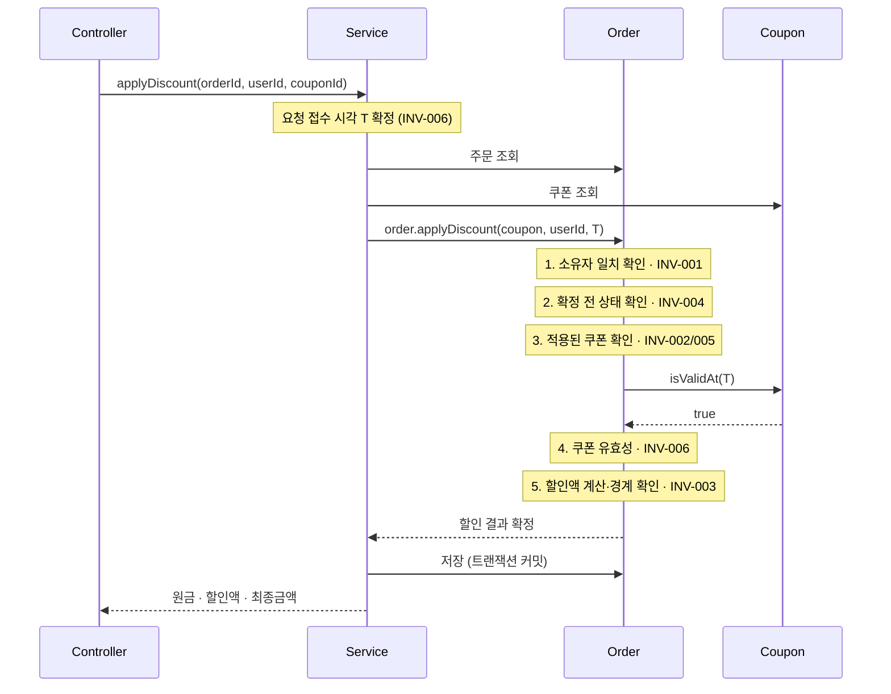
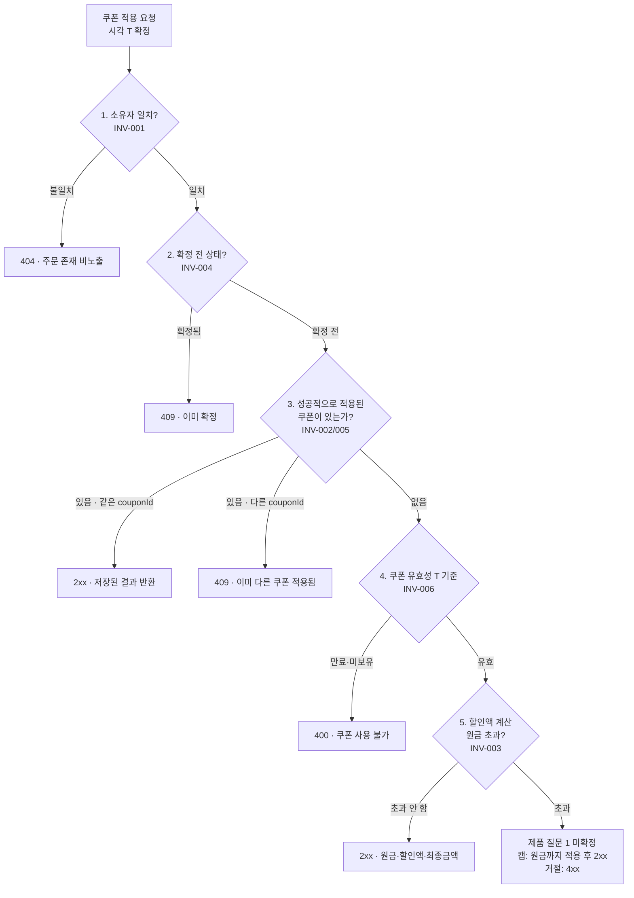

# 주문 쿠폰 할인 설계 계약

**기준 문장** (출처: 실습 가이드)
> 구매자는 주문 확정 전에 보유 쿠폰을 적용할 수 있고, 확정된 할인 금액은 이후에도 바뀌지 않는다.

---

## 1. 요구 분류

### 확인된 사실

1. 구매자는 주문 확정 전에 보유 쿠폰을 적용할 수 있다.
2. 확정된 할인 금액은 이후에도 바뀌지 않는다.

### 실습 장면의 조건

1. 확정 전 한 주문에는 쿠폰 한 장만 적용한다.
2. `finalAmount = originalAmount - discountAmount`
3. 동일 주문·쿠폰 재요청은 최초 결과를 재사용하며 효과가 누적되지 않는다.
4. 쿠폰 만료 여부는 요청을 받은 시각으로 판단한다.

### 제품 담당자에게 물을 질문

| # | 질문 | 답에 따라 달라지는 것 | 영향 범위 |
|---|---|---|---|
| 1 | 할인액이 원금을 초과할 때 원금까지만 적용(캡)하는가, 적용을 거절하는가? | 사용자 응답(성공/실패), 저장 데이터(쿠폰 소진 여부) | 4장 검증 흐름 5번의 분기, INV-003 기대 결과 |
| 2 | 쿠폰 종류(정액/정률/무료배송)를 지원하는가? | 데이터 구조, 할인 계산 로직 | 할인 계산 책임의 위치 (INV-003은 종류와 무관하게 성립) |
| 3 | 주문 취소 시 쿠폰은 재사용 가능한 상태로 복구되는가? | 저장 데이터(사용 이력의 의미) | 쿠폰 사용 여부 기록의 생명주기 |
| 4 | 확정 전에 구매자가 쿠폰 적용을 스스로 해제할 수 있는가? | API 모양(해제 엔드포인트), 사용자의 다음 행동 | 5장 오류 매핑 중 "이미 다른 쿠폰 적용됨"의 상태 코드 |

### 보류·거절

| 항목 | 처리 | 이유 |
|---|---|---|
| 쿠폰 사용 횟수 제한 및 동시 사용 시 한도 초과 제어 | 거절 | 과제 범위 밖으로 선언. 횟수 제한 기능이 없으면 동시성 문제도 발생하지 않음 |
| 최소 주문 금액, 특정 카테고리 한정 조건 | 거절 | 일반적인 구매 흐름의 필수 요소가 아님. 유효기한만 쿠폰 개념에 내재된 속성으로 판단해 남김 |
| 쿠폰 발급 주체·발급 선행조건·복수 발급 | 거절 | 이번 설계는 이미 발급된 쿠폰의 적용만 다룸 |
| 쿠폰 폐기 시 확정된 할인도 무효화되는가 | 보류 | INV-004는 어떤 이유로도 재계산하지 않는 것으로 정의했다. 다만 어뷰징 등으로 발급된 쿠폰을 회수해야 하는 정책이 생기면 INV-004 자체를 수정해야 하므로 질문을 닫지 않는다 |
| AI 도구가 제안한 항목 | 해당 없음 | 채택한 제안 없음 |

---

## 2. 불변식과 반례

### INV-001 · 소유권

- **규칙**: 요청자의 userId와 주문에 기록된 소유자 userId가 일치할 때만 쿠폰을 적용할 수 있다.
- **출처**: 확인된 사실
- **반례 1**: 소유자 불일치를 403, 주문 없음을 404로 나누어 응답하면, 응답 차이만으로 타인의 주문 존재 여부를 알아낼 수 있다. 권한을 막았다고 해서 정보까지 막힌 것은 아니다.
- **반례 2**: 소유권 검증을 다른 검증보다 뒤에 두면, 앞선 검증의 응답 차이만으로 남의 주문 상태가 노출된다. 규칙이 있어도 실행 순서가 틀리면 무력화된다. 4장 검증 흐름에서 이 검증의 위치를 고정한 근거다.
- **기대 결과**: 소유자가 아니면 주문 존재 여부와 무관하게 동일한 응답(404)을 반환한다.
- **책임 후보**: `Order` 도메인. Service에 두면 기능마다 검증을 복사해야 하고, 한 곳만 빠뜨려도 보안 구멍이 된다.

### INV-002 · 쿠폰 단일 적용

- **규칙**: 성공적으로 완료된 주문 상태에서, 적용된 쿠폰은 최대 한 장이다.
- **출처**: 실습 조건
- **반례**: "적용된"이 성공한 결과를 뜻하는지 시도 자체를 뜻하는지 정하지 않으면, 결제 실패 등으로 롤백된 시도까지 한 장으로 세어져 정상적인 재적용이 막힌다.
- **기대 결과**: 성공적으로 반영된 쿠폰만 센다. 이미 한 장이 적용된 상태에서 다른 `couponId` 요청은 거절하고, 같은 `couponId`는 INV-005의 멱등 처리로 위임한다.
- **책임 후보**: `Order` 도메인

### INV-003 · 금액 경계

- **규칙**: `finalAmount = originalAmount - discountAmount`, **실제 적용된** 할인액은 `0 ≤ discountAmount ≤ originalAmount`
- **출처**: 실습 조건
- **반례 1**: "할인액 < 원금"(엄격 부등호)이면 100% 할인이라는 정상 케이스가 위반이 된다.
- **반례 2**: 쿠폰 액면가를 기준으로 쓰면 5,000원 쿠폰을 3,000원 주문에 적용할 때 `5000 ≤ 3000`이 거짓이 된다. 기준은 액면가가 아닌 실제 적용값이어야 한다.
- **기대 결과**: 액면가와 무관하게 실제 적용값이 경계 안에 있으면 성립. 정액·정률 모두 동일하게 통과한다.
- **책임 후보**: `Order` 도메인
- **버린 대안**: 초과분을 잔여 쿠폰으로 이월 — 잔여 쿠폰 생성은 사실상 재발급이라 "발급은 범위 밖"과 충돌하고, 재요청 시 잔여 쿠폰이 중복 생성되어 멱등성이 깨진다.

### INV-004 · 확정 결과 보존

- **규칙**: 결제 성공이 기록된 주문의 `discountAmount`는 기록 시점의 값과 항상 같다.
- **출처**: 확인된 사실
- **반례 1**: "확정" 시점을 정의하지 않으면 개발자마다 주문 클릭·결제 승인·배송 시작으로 다르게 해석해 같은 상황에서 정반대로 동작한다.
- **반례 2**: "재계산되지 않는다"고만 쓰면 환불이나 부분 취소로 실제 결제 금액이 달라질 때 규칙이 거짓처럼 보인다. 불변인 대상을 `discountAmount` 필드로 특정해야 후속 거래와 무관하게 규칙이 유지된다.
- **기대 결과**: 결제 완료를 확정 시점으로 고정. 그 이전은 사용자가 브라우저를 닫는 것만으로 되돌아가지만, 이후에는 결제 취소라는 명시적 행위가 필요하다.
- **책임 후보**: `Order` 도메인
- **사용자에게 유리한 변경도 막는 이유**: 확정 금액 변경은 카드사 취소·재승인, 회계 정정, 정산 재계산으로 이어져 이 기능과 무관한 이해관계자까지 영향을 받는다.

### INV-005 · 재요청 멱등성

- **규칙**: 동일 `orderId`+`couponId` 조합으로 몇 번을 요청하든, 주문에 반영된 할인 효과는 최초 성공 시점의 한 번뿐이다.
- **출처**: 실습 조건
- **반례**: "저장된 결과 반환"만 쓰면 첫 시도가 네트워크 오류로 실패한 경우 그 실패가 영구 고정되어 정상 재시도까지 막힌다.
- **기대 결과**: 성공한 결과만 멱등 재사용, 실패한 시도는 재시도 허용
- **이 규칙이 필요한 이유**: 응답 지연으로 버튼을 두 번 누르면 10,000원 쿠폰이 두 번 적용되어 20,000원이 할인된다. 연타하면 INV-003까지 깨진다. 실수와 의도적 연타를 시스템이 구분할 수 없으므로 단순 버그가 아니라 악용 가능한 결함이다.
- **책임 후보**: `Order` 도메인. 판단에는 두 정보가 필요하며 각각 다른 구멍을 막는다 — 쿠폰의 사용 여부는 한 쿠폰의 여러 주문 사용을, 주문의 쿠폰 기록은 같은 주문의 중복 요청을 막는다.

### INV-006 · 만료 판단 기준 시각

- **규칙**: 만료 여부는 서버가 요청을 받은 시각과 쿠폰 만료시각을 비교해 판단하며, 클라이언트가 보낸 시각은 신뢰하지 않는다.
- **출처**: 실습 조건
- **반례**: "만료시각이 되면 못 쓴다"고만 쓰면 비교 대상이 빠져 실행할 수 없다. 클라이언트 시각을 기준으로 삼으면 OS 날짜를 과거로 되돌려 만료 쿠폰을 사용할 수 있다.
- **기대 결과**: 요청 접수 시각을 한 번 확정해 전달하고 그 값으로 판단
- **책임 후보**: `Coupon`이 `isValidAt(time)`으로 판단하고, 시각은 외부에서 주입. 내부에서 직접 현재 시각을 조회하면 만료 경계를 테스트할 수 없고 호출 시점마다 값이 달라진다.

---

## 3. 유스케이스

```
UC-01: 주문에 쿠폰 적용
주 액터: 구매자
사전 조건: 구매자 소유 주문이며 아직 확정되지 않음
시작 사건: couponId 선택 후 적용 요청
성공 결과: 할인 결과 기록, 최종 주문 금액 반환
실패 결과: 소유자 불일치 / 이미 확정됨 / 이미 다른 쿠폰 적용됨 / 쿠폰 만료·미보유
종료 조건: 확정된 할인 결과는 이후 정책·가격 변화에도 동일
```

```
UC-02: 동일 쿠폰 재요청
주 액터: 구매자
사전 조건: 같은 주문에 같은 couponId 적용이 이미 성공한 상태
시작 사건: 응답 지연 등으로 동일한 요청이 다시 도착
성공 결과: 최초 성공 결과를 그대로 반환하며 할인은 누적되지 않음
실패 결과: 이전 시도가 실패로 끝났다면 재시도로 취급하여 UC-01의 검증 흐름을 다시 수행
종료 조건: 요청 횟수와 무관하게 주문의 할인액은 한 번만 반영됨
근거: INV-005
```

```
UC-03: 확정 이후의 정책 변경
주 액터: 운영·정산 시스템 (구매자의 행위가 아님)
사전 조건: 결제 완료로 확정된 주문이 존재하고, 그 주문에 할인이 기록되어 있음
시작 사건: 해당 쿠폰의 할인 정책이 변경되거나 쿠폰이 폐기됨
성공 결과: 확정 시점에 기록된 할인 금액과 최종 금액이 그대로 유지됨
실패 결과: 해당 없음 (확정된 주문은 재계산 대상이 아님)
종료 조건: 카드사·회계·정산에 전달된 금액과 시스템 기록이 일치한 상태로 유지
근거: INV-004. 쿠폰 폐기 시의 처리는 보류 항목으로 남아 있음
```

---

## 4. 처리 흐름

### 성공 경로



모든 불변식 검증이 `Order` 내부에서 이루어진다. Service는 조회·호출·저장만 담당하고 검증 순서를 알지 못한다.

### 검증 순서와 실패 응답



**순서를 이렇게 둔 근거**

- **1번은 위치 고정**: 인가 검증 전에 주문 내부 상태가 응답에 반영되면, 응답 차이만으로 타인의 주문 상태가 노출된다.
- **2번이 4번보다 앞**: 확정된 주문은 쿠폰을 바꿔도 적용할 수 없다. 되돌릴 수 없는 실패를 먼저 알려야 사용자가 헛된 재시도를 하지 않는다.
- **3번의 판정 기준**: 세는 대상은 성공적으로 적용된 쿠폰뿐이다(INV-002). 결제 실패 등으로 롤백된 이전 시도는 애초에 대조 대상이 아니므로 "없음"으로 분류되어 정상 검증 흐름을 다시 탄다. 같은 `couponId`가 이미 성공적으로 적용되어 있으면 새로 적용하지 않고 저장된 결과를 반환한다(INV-005).
- **5번의 분기는 미확정**: 할인액이 원금을 초과할 때 캡할지 거절할지는 제품 질문 1의 답에 따라 결정된다. 어느 쪽이든 INV-003(`0 ≤ 적용 할인액 ≤ 원금`)은 성립한다. 캡이면 성공 상태에서 경계값을 만족하고, 거절이면 성공 상태 자체가 없어 검사 대상이 아니다.

---

## 5. 외부 계약과 내부 경계

### 5-1. 외부 계약 — 클라이언트가 의존하는 약속

| 항목 | 내용 |
|---|---|
| method · path | `POST /api/v1/orders/{orderId}/discount` |
| 사용자 식별 | 인증 계층이 전달한 식별자 (전달 방식 잠정) |
| request | `{ "couponId": ... }` |
| 성공 응답 | `orderId`, `couponId`, `originalAmount`, `discountAmount`, `finalAmount`, `appliedAt` |

**전제**: 사용자 식별자는 인증 계층이 검증하여 전달한다고 가정한다. 전달 방식(`X-USER-ID` 헤더 / 토큰 클레임)은 저장소에 인증이 필요한 API가 없어 관찰할 수 없었으므로 잠정이다. 다만 클라이언트가 이 값을 임의로 설정할 수 있다면 INV-001이 무력화되므로, 어떤 방식을 택하든 그 검증은 이 API 바깥에서 보장되어야 한다.

**method 선택**: `POST`를 택했다. 버린 대안은 `PATCH /api/v1/orders/{orderId}`로, 표준 PATCH가 기대하는 덮어쓰기 시맨틱이 "같은 쿠폰은 멱등 처리, 다른 쿠폰은 거절"이라는 이 API의 동작과 어긋나 혼란을 준다.

응답은 기존 `ApiResponse<T>` 래퍼를 그대로 따른다.

```json
{ "meta": { "result": "SUCCESS", "errorCode": null, "message": null }, "data": { ... } }
{ "meta": { "result": "FAIL", "errorCode": "...", "message": "..." }, "data": null }
```

`meta.result`는 `SUCCESS`/`FAIL` 두 값뿐이며, 실패 시 `data`는 항상 `null`이다.

**실패 케이스별 매핑**

기존 `ErrorType`에 정의된 네 가지(`INTERNAL_ERROR` 500, `BAD_REQUEST` 400, `NOT_FOUND` 404, `CONFLICT` 409) 안에서 선택했다. `errorCode`는 별도 업무 코드가 아니라 HTTP reason phrase를 그대로 사용하는 구조다.

| 실패 케이스 | ErrorType | HTTP | 요청자의 다음 행동 |
|---|---|---|---|
| 소유자 불일치 | `NOT_FOUND` | 404 | 대상 재확인 (주문 존재 여부는 노출되지 않음) |
| 주문 없음 | `NOT_FOUND` | 404 | 대상 재확인 |
| 이미 확정된 주문 | `CONFLICT` | 409 | 이 주문으로는 불가, 다른 흐름으로 |
| 이미 다른 쿠폰 적용됨 | `CONFLICT` | 409 | 기존 쿠폰 해제 후 재시도 (제품 질문 4에 의존) |
| 쿠폰 만료·미보유 | `BAD_REQUEST` | 400 | 다른 쿠폰 선택 후 재요청 (입력 수정) |

400과 409를 가른 기준은 "요청자가 입력을 고치면 해결되는가"이다. 만료 쿠폰은 다른 `couponId`를 보내면 해결되므로 400이다. 반면 다른 쿠폰이 이미 적용된 상태에서는 어떤 `couponId`를 보내도 거절되며 리소스의 상태를 먼저 바꿔야 하므로 409다.

**남는 한계**: "이미 확정된 주문"과 "이미 다른 쿠폰 적용됨"이 같은 409이고, `errorCode`가 HTTP reason phrase이므로 클라이언트가 둘을 구분할 수단은 `message` 문자열뿐이다. 두 경우의 다음 행동이 다르므로(전자는 불가, 후자는 해제 후 가능) 구분이 필요하다면 `ErrorType` 확장을 제품 담당자와 논의해야 한다. 이 한계는 6장에서 관찰한 기존 API의 동작(존재하지 않는 리소스와 미매핑 URL이 같은 `Not Found`)과 동일한 구조다.

### 5-2. 내부 경계 — 클라이언트가 몰라도 되는 것

| 결정 | 선택 | 버린 대안 | 버린 이유 |
|---|---|---|---|
| 오류 구분 | 도메인 예외와 HTTP 변환 분리 | 도메인에서부터 하나로 합치기 | 로그에서 권한 위반과 실제 부재를 구분 못 함 |
| 값 보존 | 확정 시점 snapshot 기록 | 조회 시마다 재계산 | 확정 금액이 정책 변경에 따라 바뀌어 INV-004 위반 |
| 책임 경계 | `Order.applyDiscount()`가 캡슐화 | Service가 순서 직접 조립 | 기능마다 검증 복사 필요, 한 곳만 빠뜨려도 보안 구멍 |

**오류 구분 보충** — INV-001은 응답의 동일성을 요구할 뿐 기록의 동일성까지 요구하지 않는다. 도메인에서는 소유자 불일치와 주문 없음을 구분해 던지고, 변환 계층에서만 동일한 404로 합친다.

**값 보존 보충** — 재계산이 항상 틀린 선택은 아니다. 실시간 시세처럼 "현재 값"이 계약인 화면에서는 재계산이 맞다. 다만 결제·정산의 기준이 되는 주문에는 맞지 않는다.

**책임 경계 보충** — INV-001은 실행 순서가 틀리면 무력화되므로(2장 반례 2), 검증 순서 자체를 도메인 안에 가두는 편이 안전하다. `Order.applyDiscount(coupon, requesterId, requestedAt)`의 호출자는 검증 항목도 순서도 알지 못한다.

---

## 6. 기존 동작 관찰

`ContractClassificationTest` 실행 결과다.

| 입력 | HTTP status | meta.result | meta.errorCode | data | meta.message |
|---|---|---|---|---|---|
| 존재하는 숫자 ID | 200 | `SUCCESS` | `null` | 있음 | `null` |
| `abc` | 400 | `FAIL` | `Bad Request` | `null` | 요청 파라미터 'exampleId' (타입: Long)의 값 'abc'이(가) 잘못되었습니다. |
| 존재하지 않는 숫자 ID | 404 | `FAIL` | `Not Found` | `null` | [id = -1] 예시를 찾을 수 없습니다. |
| 미매핑 URL | 404 | `FAIL` | `Not Found` | `null` | 존재하지 않는 요청입니다. |

미매핑 URL은 존재하지 않는 리소스와 동일한 응답 계약(404, `Not Found`)을 가지며 차이는 `message` 문자열뿐이다.
