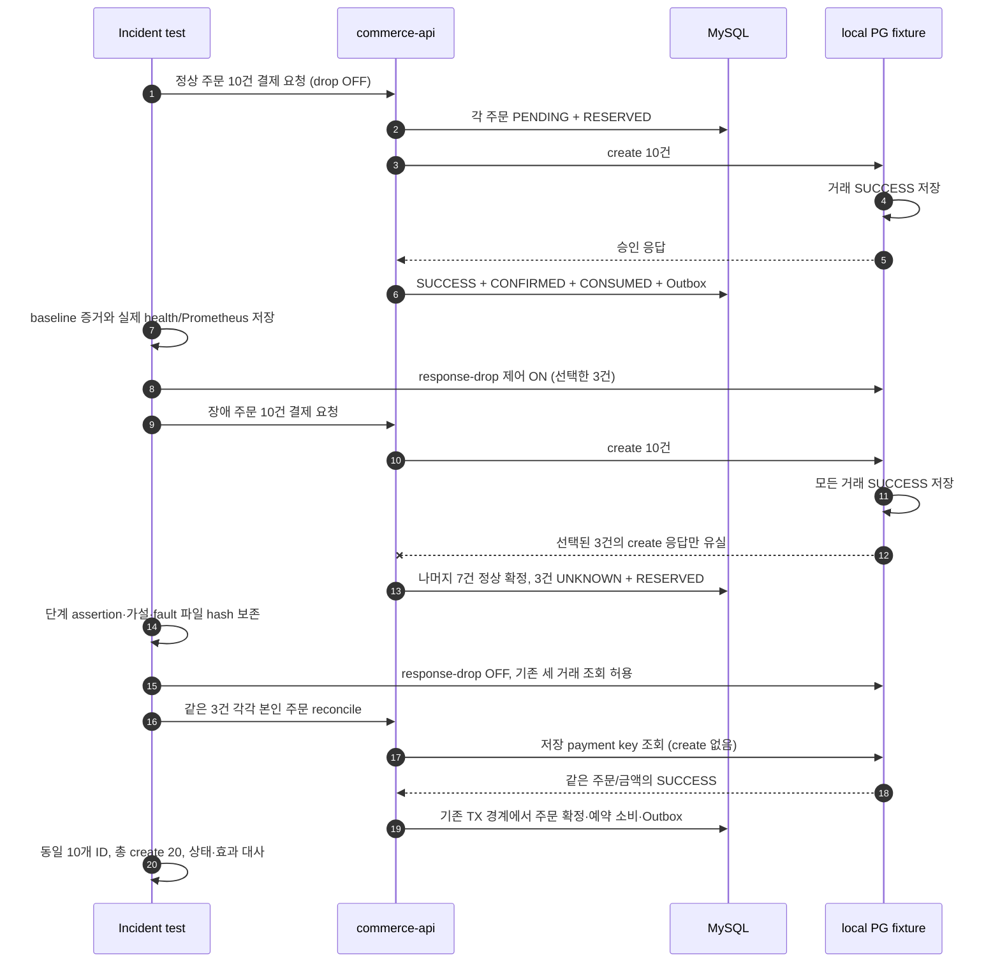
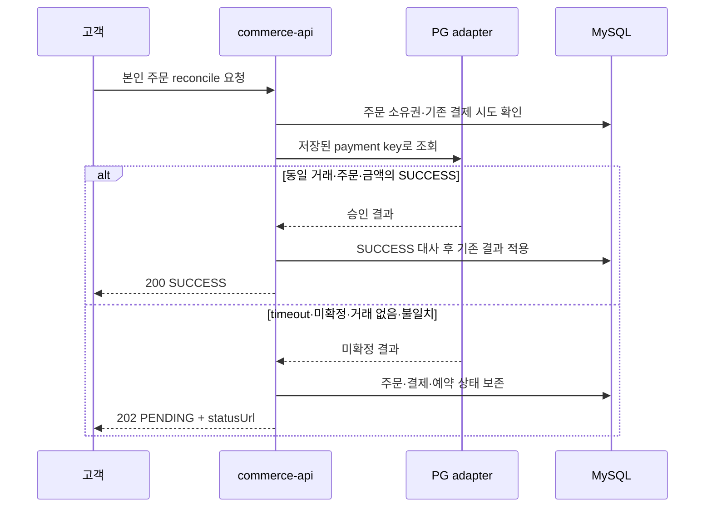

# Week 10 대표 흐름

## PG SUCCESS 응답 유실 후 same-order recovery

```mermaid
sequenceDiagram
    autonumber
    participant T as Incident test
    participant API as commerce-api
    participant DB as MySQL
    participant PG as local PG fixture

    T->>API: 정상 주문 10건 결제 요청 (drop OFF)
    API->>DB: 각 주문 PENDING + RESERVED
    API->>PG: create 10건
    PG->>PG: 거래 SUCCESS 저장
    PG-->>API: 승인 응답
    API->>DB: SUCCESS + CONFIRMED + CONSUMED + Outbox
    T->>T: baseline 증거와 실제 health/Prometheus 저장

    T->>PG: response-drop 제어 ON (선택한 3건)
    T->>API: 장애 주문 10건 결제 요청
    API->>PG: create 10건
    PG->>PG: 모든 거래 SUCCESS 저장
    PG--xAPI: 선택된 3건의 create 응답만 유실
    API->>DB: 나머지 7건 정상 확정, 3건 UNKNOWN + RESERVED
    T->>T: 단계 assertion·가설·fault 파일 hash 보존

    T->>PG: response-drop OFF, 기존 세 거래 조회 허용
    T->>API: 같은 3건 각각 본인 주문 reconcile
    API->>PG: 저장 payment key 조회 (create 없음)
    PG-->>API: 같은 주문/금액의 SUCCESS
    API->>DB: 기존 TX 경계에서 주문 확정·예약 소비·Outbox
    T->>T: 동일 10개 ID, 총 create 20, 상태·효과 대사
```

## 미확정 결과 처리

```mermaid
sequenceDiagram
    participant C as 고객
    participant API as commerce-api
    participant PG as PG adapter
    participant DB as MySQL
    C->>API: 본인 주문 reconcile 요청
    API->>DB: 주문 소유권·기존 결제 시도 확인
    API->>PG: 저장된 payment key로 조회
    alt 동일 거래·주문·금액의 SUCCESS
        PG-->>API: 승인 결과
        API->>DB: SUCCESS 대사 후 기존 결과 적용
        API-->>C: 200 SUCCESS
    else timeout·미확정·거래 없음·불일치
        PG-->>API: 미확정 결과
        API->>DB: 주문·결제·예약 상태 보존
        API-->>C: 202 PENDING + statusUrl
    end
```
