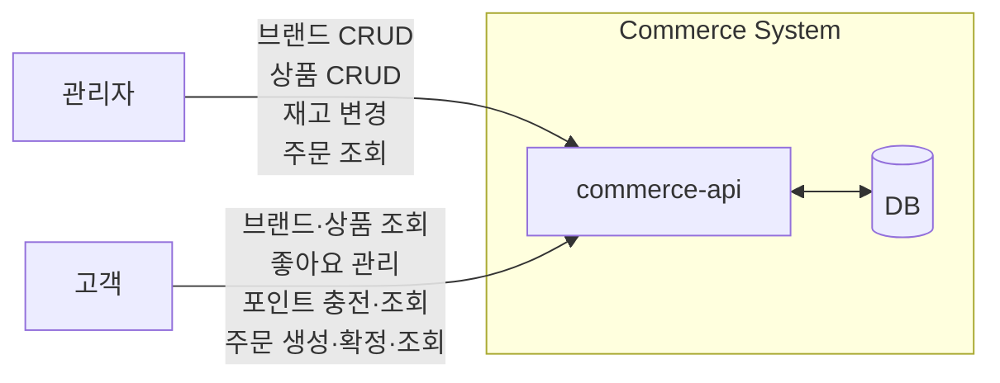
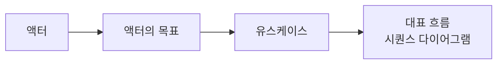
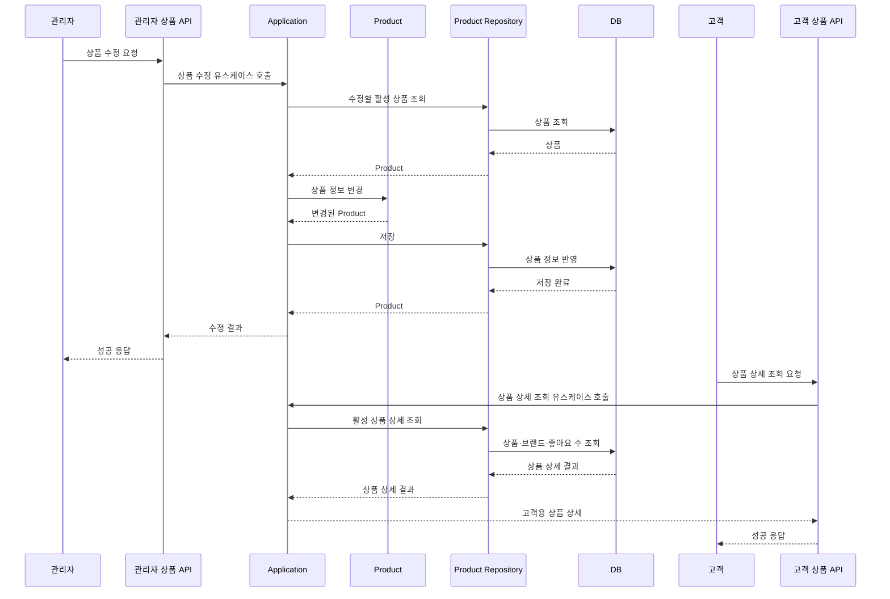
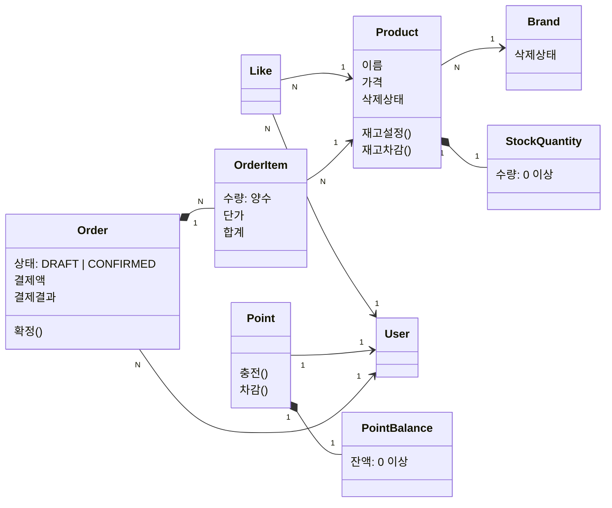
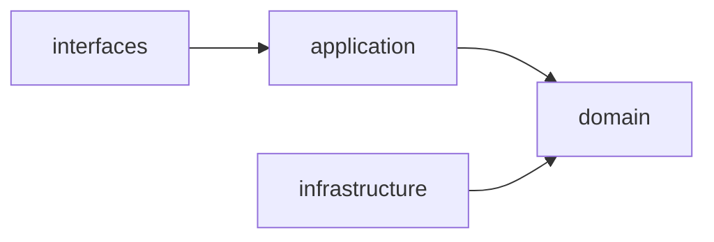

## 1. 버드뷰

고객과 관리자의 요청은 `commerce-api`에서 처리하며, 조회·변경에 필요한 데이터를 DB와 주고받는다.

## 2. 대표 흐름

이 문서의 대표 흐름은 **관리자 상품 수정 → 고객 상품 상세 조회**이다. 관리자가 삭제되지 않은 상품의 이름과 가격을 수정하면, 고객은 상품 상세 조회에서 변경된 상품 정보와 브랜드 정보·좋아요 수를 확인한다.

### 2.1 액터

대표 흐름을 기능 목록이 아니라 사용자의 목표에서 출발시키기 위해 먼저 액터를 정리한다.

이 흐름이 도메인 책임을 바로 결정하지는 않지만, 어떤 객체가 어떤 변화에 책임져야 하는지 판단하는 단서가 된다.

| 구분 | 의미 | 예시 |
|----|----|-----|
| 액터 | 시스템 밖에서 목표를 가지고 시스템과 상호작용하는 역할 | 관리자 고객 |
| 목표 | 액터가 얻고 싶은 결과 | 상품을 찾고 구매한다. |
| 유스케이스 | 목표를 이루기 위해 시스템에서 하는 하나의 행동 단위 | 상품을 조회한다. 주문을 생성한다. 주문을 확정한다. |

### 2.2 액터의 목표

#### 관리자

무엇을 관리하기 위해 서비스를 이용하는가?

- 판매할 브랜드와 상품을 운영한다.
- 상품의 재고를 관리하고 고객 주문 현황을 조회한다.

#### 고객

무엇을 위해 서비스를 이용하는가?

- 상품을 찾고 구매한다.
- 좋아요를 통해 추후 구매할 상품을 저장한다.

### 2.3 유스케이스

유스케이스는 API가 아니라, 예를 들어 "고객이 주문을 확정한다"처럼 시스템을 통해 달성하려는 행동이다.

#### 관리자

- 브랜드를 등록•수정•삭제한다.
- 상품을 등록•수정•삭제한다.
- 상품 재고를 변경한다.
- 브랜드를 조회한다.
- 상품을 조회한다.
- 고객 주문을 조회한다.

#### 고객

- 좋아요를 등록하거나 취소한다.
- 포인트를 충전한다.
- 주문을 생성한다.
- 주문을 확정한다.
- 브랜드 정보를 조회한다.
- 상품을 조회한다.
- 내 좋아요 목록을 조회한다.
- 내 포인트 잔액을 조회한다.
- 내 주문 목록•상세를 조회한다.

### 2.4 시퀀스 다이어그램

## 3. 도메인 관계와 업무 규칙

### 3.1 Brand–Product

- [관계] Brand 1 : N Product
- [도메인 규칙] 상품 등록 시 (존재하고) 삭제되지 않은 Brand가 필요하다.
- [도메인 규칙] Product 수정 시 기존 Brand는 변경하지 않는다.
- [불변식] 삭제되지 않은 Product가 하나라도 있으면 Brand 삭제를 거절한다. 재고가 0개인 Product도 포함한다.

#### 삭제 전략에 대한 설계 판단

- [대안 1] Brand와 Product를 물리 삭제한다.
  - 삭제된 행이 남지 않아 조회에서 삭제 여부를 따로 다루지 않아도 된다.
  - 기존 Order가 참조하던 Product가 사라져 주문 내역의 품목 정보가 깨진다.
- [대안 2] Brand와 Product를 논리 삭제한다.
  - 주문이 참조하는 상품 정보가 남고, 삭제된 Product에 걸린 좋아요도 취소할 수 있다.
  - 모든 조회 경로에서 삭제 여부를 조건으로 다뤄야 한다.

- [설계 결정] Brand와 Product는 논리 삭제한다.
- [이유] 주문 내역은 구매 시점의 품목 정보를 그대로 보여줘야 하는데, 물리 삭제하면 이 참조가 깨진다. 삭제된 Product에 남은 좋아요를 취소할 수 있어야 한다는 요구도 삭제 기록이 남아야 만족한다.
- [결과] 삭제 상태를 보존하므로, 고객 조회와 새 주문에서는 삭제된 Brand와 Product를 제외한다. 수정·재고 변경은 삭제되지 않은 대상에만 허용한다.
  - 기존 Order는 삭제된 Product의 참조와 저장된 정보를 유지한다.

### 3.2 User–Like–Product

- [관계] User 1 : N Like N : 1 Product
- [도메인 규칙] 삭제된 Product에는 좋아요를 할 수 없다.
- [도메인 규칙] User는 삭제된 Product에 남아 있는 자신의 좋아요를 취소할 수 있다.
- [불변식] User는 하나의 Product에 Like를 여러 번 할 수 없다.

#### 조회 규칙

- Product의 좋아요 수는 Like 관계 수로 계산한다.
- 내 좋아요 목록에서는 삭제된 Product를 제외한다.

### 3.3 Order–OrderItem

- [관계] Order 1 : N OrderItem
- [관계] User 1 : N Order
- [관계] OrderItem N : 1 Product
- [도메인 규칙] Order 생성 시 여러 OrderItem의 수량·단가·합계와 DRAFT 상태를 저장한다.
- [도메인 규칙] Order 생성 시 재고와 포인트는 차감하지 않는다.
- [도메인 규칙] Order 생성·확정 시 존재하고 삭제되지 않은 Product와 양수 수량을 확인한다.
- [도메인 규칙] User는 자신의 DRAFT Order만 확정할 수 있다.
- [도메인 규칙] Order 확정 시 재고·포인트를 차감하고, 결제액·결과를 저장한 뒤 CONFIRMED 상태로 변경한다.
- [도메인 규칙] Order 확정 시 재고 또는 잔액이 부족하면 거절한다.
- [불변식] OrderItem의 수량은 양수여야 한다.
- [불변식] CONFIRMED 상태의 Order에는 결제액과 결제 결과가 저장되어야 한다.

#### 중복 Product 품목 처리에 대한 설계 판단

- [대안 1] 중복된 Product 품목이 있으면 주문을 거절한다.
  - 요청한 품목 구성과 저장된 품목 구성이 항상 일치한다.
  - 같은 상품을 두 번 담은 요청이 주문 자체를 실패시킨다.
- [대안 2] 중복된 Product 품목의 수량을 합산한다.
  - 하나의 Order에서 동일한 Product가 하나의 OrderItem으로 표현된다.
  - 요청한 품목 수와 저장된 품목 수가 달라질 수 있다.

- [설계 결정] 중복된 Product 품목은 수량을 합산한다.
- [이유] 품목이 나뉘어 있으면 재고를 품목마다 따로 확인하게 되어 총수량 기준 판단이 어긋날 수 있다. 합산하면 Product당 한 번만 재고를 확인하면 된다.
- [결과] 요청한 품목 수와 저장된 품목 수가 달라질 수 있어, 주문 생성 응답은 합산된 품목을 돌려줘야 한다.
- [도메인 규칙] 중복 Product 품목을 합산한 뒤, 해당 Product의 총수량으로 재고를 확인한다.

### 3.4 재고·포인트 책임

재고와 포인트는 모두 하나의 주체에 딸린 수량 상태다. 
그래서 **그 값을 바꾸는 맥락과 주체를 조회하는 맥락이 겹치는지**를 같은 기준으로 놓고 각각 판단한다.

#### 재고 책임에 대한 설계 판단

- [대안 1] Stock을 Product와 분리된 도메인으로 관리한다.
  - 재고만 독립적으로 확장하거나 변경 이력을 붙이기 쉽다.
  - 상품 조회와 주문 확정에서 Product와 Stock을 각각 조회해 조합해야 한다.
- [대안 2] Product가 재고 수량과 변경 규칙을 함께 관리한다.
  - 재고를 바꾸는 맥락과 상품을 조회하는 맥락이 모두 Product를 대상으로 해서 함께 다룰 수 있다.
  - Product가 상품 정보와 재고 상태를 함께 책임져 변경 이유가 둘로 늘어난다.

- [설계 결정] Product가 재고 수량과 재고 변경 규칙을 책임진다.
- [이유] 재고는 Product에 종속된 하나의 상태이고, 상품 조회에서도 함께 필요하다. Product를 통해 변경하면 재고 0 이상과 재고 부족 검증을 한 곳에서 보장할 수 있다.
- [결과] 창고별 재고나 재고 변경 이력이 필요해지면 Product에서 재고를 분리해야 한다.

#### 재고 규칙

- [불변식] Product의 재고 수량은 0 이상이어야 한다.
- [도메인 규칙] 관리자는 Product 재고를 0 이상인 최종 수량으로 설정할 수 있다.
- [도메인 규칙] Order 확정 시 Product는 주문 수량만큼 재고를 차감하고, 재고가 부족하면 거절한다.

#### 재고 수량 표현에 대한 설계 판단

- [대안 1] 재고 수량을 원시 타입 필드로 두고 Product에서 검증한다.
  - 클래스가 늘지 않고 영속성 매핑과 값 비교가 단순하다.
  - 0 이상 검증이 재고를 바꾸는 호출 지점마다 흩어질 수 있다.
- [대안 2] 재고 수량을 값 객체로 캡슐화한다.
  - 0 이상 규칙이 값 객체 한 곳에 모인다.
  - 임베디드 타입 매핑과 값 변환 코드가 는다.

- [설계 결정] Product의 재고 수량은 StockQuantity VO로 관리한다.
- [이유] 재고 수량은 독립된 식별자·생명주기 없이 값과 0 이상 규칙이 중요하다. 관리자의 재고 설정과 주문 확정의 재고 차감이 서로 다른 경로로 들어오므로, 검증을 값 객체에 모아 두면 경로가 늘어도 규칙이 한 곳에 남는다.
- [결과] 재고를 바꾸는 모든 경로가 StockQuantity 생성을 거치므로, 0 이상 검증을 우회할 수 없다.

#### 포인트 책임에 대한 설계 판단

- [대안 1] User가 사용자별 포인트 잔액과 충전·차감 규칙을 함께 관리한다.
  - 포인트 변경 정책이 추가되면 User도 함께 변경해야 한다.
- [대안 2] Point를 User와 분리된 도메인으로 관리한다.
  - Point가 사용자별 잔액과 충전·차감 규칙을 독립적으로 책임진다.
  - 포인트 충전과 주문 확정 시 요청자의 `userId`로 Point를 별도로 조회해 조합해야 한다.

- [설계 결정] Point가 사용자별 잔액과 충전·차감 규칙을 책임진다.
- [이유] Point는 `userId`로 소유자인 User와 연결되고, 사용자별 잔액과 포인트 변경 규칙을 책임지도록 분리한다.
  - 포인트 변경 정책이 User 등 다른 도메인 책임에 영향을 주지 않는다.
- [결과] User에는 잔액을 중복 저장하지 않는다. 충전과 주문 확정은 요청자의 `userId`로 Point를 조회해 처리한다.
  - 이후 포인트 이력, 만료일, 적립·차감 사유 등 기능이 필요하면 User를 변경하지 않고 Point 영역에서 확장할 수 있다.

#### 포인트 규칙

- [관계] User 1 : 1 Point
- [도메인 규칙] 1포인트는 1원이다.
- [불변식] Point 잔액은 0포인트 이상이어야 한다.
- [도메인 규칙] 충전액은 양의 정수여야 하며, 0과 음수는 거절한다.
- [도메인 규칙] 충전은 기존 잔액에 충전액을 더하고, 합산 결과가 표현 범위를 넘으면 거절한다.
- [도메인 규칙] Order 확정 시 Point는 결제액만큼 잔액을 차감하고, 잔액이 부족하면 거절한다.

#### 포인트 잔액 VO 선택

- [설계 결정] Point의 잔액은 PointBalance VO로 관리한다.
- [이유] 잔액도 독립된 식별자·생명주기 없이 값과 0 이상·표현 범위 규칙이 중요하고, 충전과 주문 확정이라는 서로 다른 경로로 변경되기 때문에, 값 규칙을 PointBalance라는 VO에서 관리한다.
- [결과] Point는 PointBalance가 검증한 새 잔액만 반영한다. 따라서 0 이상과 표현 범위 검증을 우회할 수 없고, 충전이 거절되면 기존 잔액이 유지된다.

## 4. 구조와 의존

### 4.1 계층의 역할

#### interfaces

- HTTP 요청과 API 요청 DTO를 검증하고 Application 유스케이스를 호출한다.
- Application 결과를 응답 DTO로 변환해 `ApiResponse`로 반환한다.
- Application 계층에만 의존하고, Domain·Infrastructure 계층은 직접 호출하지 않는다.

#### application

- 유스케이스 단위로 요청자를 식별하고 도메인 객체·서비스를 오케스트레이션한다.
- HTTP와 영속성 구현에 의존하지 않고 Domain 계층에만 의존한다.
- 유스케이스 요청·결과 모델을 통해 HTTP DTO와 Domain 모델을 분리한다.

#### domain

- Entity, VO, 도메인 서비스와 비즈니스 규칙·불변식을 관리한다.
- 필요한 조회·저장 기능을 Repository 인터페이스로 정의한다.
- interfaces, application, infrastructure 계층에 의존하지 않는다.

#### infrastructure

- Domain의 Repository 인터페이스를 JPA·DB 기술로 구현한다.
- DB, Redis, Kafka 등 외부 기술과의 연결을 책임진다.
- Domain에 의존해 Repository 계약을 구현하고, 상위 계층에는 의존하지 않는다.
