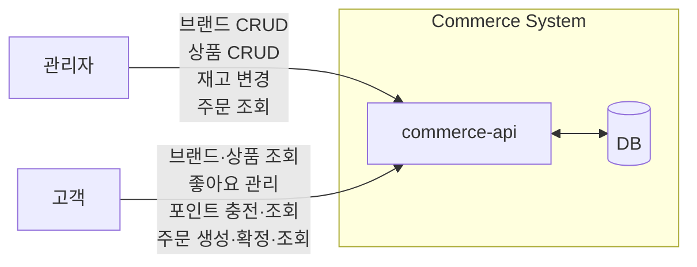
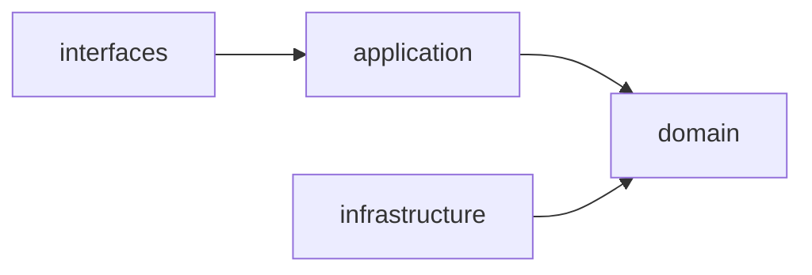
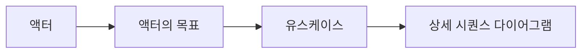
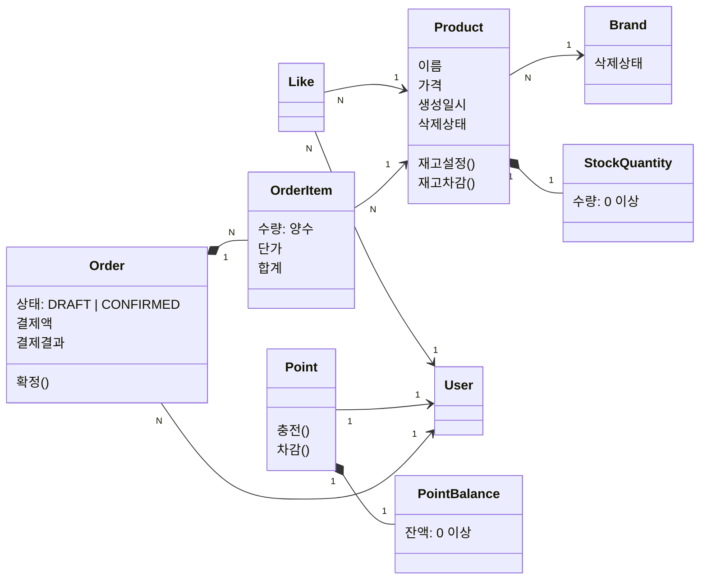
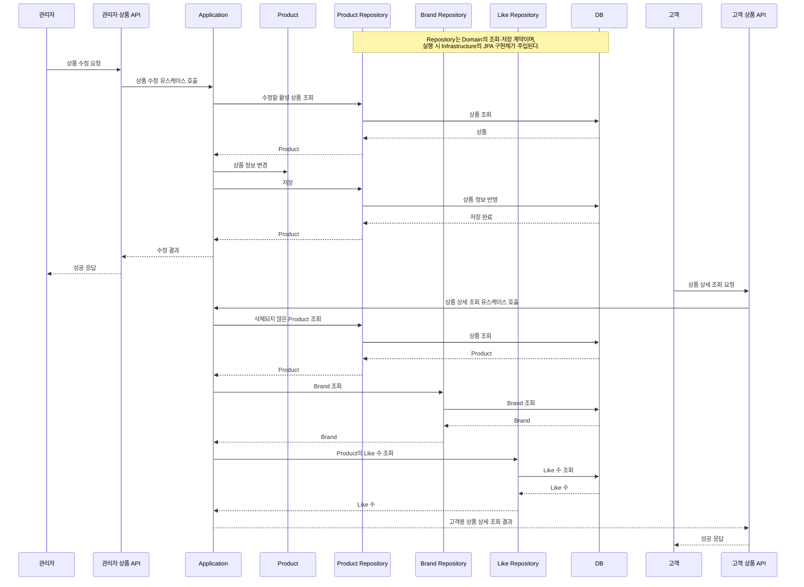

# Commerce API 설계

## 1. HLD

### 1.1 버드뷰

고객과 관리자의 요청은 `commerce-api`에서 처리하며, 조회·변경에 필요한 데이터를 DB와 주고받는다.

### 1.2 구조와 의존

#### 1.2.1 계층의 역할

##### interfaces

- HTTP 요청과 API 요청 DTO를 검증하고 Application 유스케이스를 호출한다.
- Application 결과를 응답 DTO로 변환해 `ApiResponse`로 반환한다.
- Application 계층에만 의존하고, Domain·Infrastructure 계층은 직접 호출하지 않는다.

##### application

- 유스케이스 단위로 요청자를 식별하고 도메인 객체·서비스를 오케스트레이션한다.
- HTTP와 영속성 구현에 의존하지 않고 Domain 계층에만 의존한다.
- 유스케이스 요청·결과 모델을 통해 HTTP DTO와 Domain 모델을 분리한다.

##### domain

- Entity, VO, 도메인 서비스와 비즈니스 규칙·불변식을 관리한다.
- 필요한 조회·저장 기능을 Repository 인터페이스로 정의한다.
- interfaces, application, infrastructure 계층에 의존하지 않는다.

##### infrastructure

- Domain의 Repository 인터페이스를 JPA·DB 기술로 구현한다.
- DB, Redis, Kafka 등 외부 기술과의 연결을 책임진다.
- Domain에 의존해 Repository 계약을 구현하고, 상위 계층에는 의존하지 않는다.

### 1.3 대표 흐름

이 문서의 대표 흐름은 **관리자 상품 수정 → 고객 상품 상세 조회**이다. 관리자가 삭제되지 않은 상품의 이름과 가격을 수정하면, 고객은 상품 상세 조회에서 변경된 상품 정보와 브랜드 정보·좋아요 수를 확인한다.

#### 1.3.1 액터

대표 흐름을 기능 목록이 아니라 사용자의 목표에서 출발시키기 위해 먼저 액터를 정리한다.

이 흐름이 도메인 책임을 바로 결정하지는 않지만, 어떤 객체가 어떤 변화에 책임져야 하는지 판단하는 단서가 된다.

| 구분 | 의미 | 예시 |
|----|----|-----|
| 액터 | 시스템 밖에서 목표를 가지고 시스템과 상호작용하는 역할 | 관리자 고객 |
| 목표 | 액터가 얻고 싶은 결과 | 상품을 찾고 구매한다. |
| 유스케이스 | 목표를 이루기 위해 시스템에서 하는 하나의 행동 단위 | 상품을 조회한다. 주문을 생성한다. 주문을 확정한다. |

#### 1.3.2 액터의 목표

##### 관리자

무엇을 관리하기 위해 서비스를 이용하는가?

- 판매할 브랜드와 상품을 운영한다.
- 상품의 재고를 관리하고 고객 주문 현황을 조회한다.

##### 고객

무엇을 위해 서비스를 이용하는가?

- 상품을 찾고 구매한다.
- 좋아요를 통해 추후 구매할 상품을 저장한다.

#### 1.3.3 유스케이스

유스케이스는 API가 아니라, 예를 들어 "고객이 주문을 확정한다"처럼 시스템을 통해 달성하려는 행동이다.

##### 관리자

- 브랜드를 등록•수정•삭제한다.
- 상품을 등록•수정•삭제한다.
- 상품 재고를 변경한다.
- 브랜드를 조회한다.
- 상품을 조회한다.
- 고객 주문을 조회한다.

##### 고객

- 좋아요를 등록하거나 취소한다.
- 포인트를 충전한다.
- 주문을 생성한다.
- 주문을 확정한다.
- 브랜드 정보를 조회한다.
- 상품을 조회한다.
- 내 좋아요 목록을 조회한다.
- 내 포인트 잔액을 조회한다.
- 내 주문 목록•상세를 조회한다.

## 2. LLD

### 2.1 도메인 관계와 업무 규칙 및 설계 판단

#### 2.1.1 Brand–Product

- [관계] Brand 1 : N Product
- [도메인 규칙] 상품 등록 시 (존재하고) 삭제되지 않은 Brand가 필요하다.
- [도메인 규칙] Product 수정 시 기존 Brand는 변경하지 않는다.
- [불변식] Product 이름은 공백만으로 구성될 수 없고, 1자 이상 20자 이하여야 한다.
- [불변식] Product 가격은 0원 이상 100,000,000원 이하여야 한다.
- [불변식] 삭제되지 않은 Product가 하나라도 있으면 Brand 삭제를 거절한다. 재고가 0개인 Product도 포함한다.

##### 삭제 전략에 대한 설계 판단

- [대안 1] Brand와 Product를 물리 삭제한다.
  - 삭제된 행이 남지 않아 조회에서 삭제 여부를 따로 다루지 않아도 된다.
  - 기존 Order가 참조하던 Product가 사라져 주문 내역의 품목 정보가 깨진다.
- [대안 2] Brand와 Product를 논리 삭제한다.
  - 주문이 참조하는 상품 정보가 남고, 삭제된 Product에 걸린 좋아요도 취소할 수 있다.
  - 모든 조회 경로에서 삭제 여부를 조건으로 다뤄야 한다.

- [설계 결정] Brand와 Product는 논리 삭제한다.
- [이유] 주문 내역은 구매 시점의 품목 정보를 그대로 보여줘야 하는데, 물리 삭제하면 이 참조가 깨진다. 삭제된 Product에 남은 좋아요를 취소할 수 있어야 한다는 요구도 삭제 기록이 남아야 만족한다.
- [결과] 삭제 상태를 보존하므로, 고객 조회와 새 주문에서는 삭제된 Brand와 Product를 제외한다. 수정·재고 변경은 삭제되지 않은 대상에만 허용한다.
  - 기존 Order는 삭제된 Product의 참조와 저장된 정보를 유지한다.
  - 관리자 목록·상세 조회는 삭제된 대상도 반환하고 삭제 상태를 제공한다. 목록은 `status`로 삭제 상태를 필터링한다.

#### 2.1.2 User–Like–Product

- [관계] User 1 : N Like N : 1 Product
- [도메인 규칙] 삭제된 Product에는 좋아요를 할 수 없다.
- [도메인 규칙] User는 삭제된 Product에 남아 있는 자신의 좋아요를 취소할 수 있다.
- [불변식] User는 하나의 Product에 Like를 여러 번 할 수 없다.

##### 조회 규칙

- Product의 좋아요 수는 Like 관계 수로 계산한다.
- 내 좋아요 목록에서는 삭제된 Product를 제외한다.

#### 2.1.3 Order–OrderItem

- [관계] Order 1 : N OrderItem
- [관계] User 1 : N Order
- [관계] OrderItem N : 1 Product
- [도메인 규칙] Order 생성 시 여러 OrderItem의 수량·단가·합계와 DRAFT 상태를 저장한다.
- [도메인 규칙] Order 생성 시 재고와 포인트는 차감하지 않는다.
- [도메인 규칙] Order 생성·확정 시 존재하고 삭제되지 않은 Product와 양수 수량을 확인한다.
- [도메인 규칙] User는 자신의 DRAFT Order만 확정할 수 있다.
- [도메인 규칙] Order 확정 시 재고·포인트를 차감하고, 결제액·결과를 저장한 뒤 CONFIRMED 상태로 변경한다.
- [도메인 규칙] Order 확정 시 재고 또는 잔액이 부족하면 거절한다.
- [불변식] OrderItem의 수량은 양수여야 한다.
- [불변식] CONFIRMED 상태의 Order에는 결제액과 결제 결과가 저장되어야 한다.

##### 중복 Product 품목 처리에 대한 설계 판단

- [대안 1] 중복된 Product 품목이 있으면 주문을 거절한다.
  - 요청한 품목 구성과 저장된 품목 구성이 항상 일치한다.
  - 같은 상품을 두 번 담은 요청이 주문 자체를 실패시킨다.
- [대안 2] 중복된 Product 품목의 수량을 합산한다.
  - 하나의 Order에서 동일한 Product가 하나의 OrderItem으로 표현된다.
  - 요청한 품목 수와 저장된 품목 수가 달라질 수 있다.

- [설계 결정] 중복된 Product 품목은 수량을 합산한다.
- [이유] 품목이 나뉘어 있으면 재고를 품목마다 따로 확인하게 되어 총수량 기준 판단이 어긋날 수 있다. 합산하면 Product당 한 번만 재고를 확인하면 된다.
- [결과] 요청한 품목 수와 저장된 품목 수가 달라질 수 있어, 주문 생성 응답은 합산된 품목을 돌려줘야 한다.
- [도메인 규칙] 중복 Product 품목을 합산한 뒤, 해당 Product의 총수량으로 재고를 확인한다.

#### 2.1.4 재고·포인트 책임

재고와 포인트는 모두 하나의 주체에 딸린 수량 상태다. 
그래서 **그 값을 바꾸는 맥락과 주체를 조회하는 맥락이 겹치는지**를 같은 기준으로 놓고 각각 판단한다.

##### 재고 책임에 대한 설계 판단

- [대안 1] Stock을 Product와 분리된 도메인으로 관리한다.
  - 재고만 독립적으로 확장하거나 변경 이력을 붙이기 쉽다.
  - 관리자 재고 변경과 주문 확정에서 Product와 Stock을 각각 조회해 조합해야 한다.
- [대안 2] Product가 재고 수량과 변경 규칙을 함께 관리한다.
  - 관리자 재고 변경과 주문 확정이 모두 Product를 대상으로 하므로, 재고를 함께 다룰 수 있다.
  - Product가 상품 정보와 재고 상태를 함께 책임져 변경 이유가 둘로 늘어난다.

- [설계 결정] Product가 재고 수량과 재고 변경 규칙을 책임진다.
- [이유] 재고는 Product에 종속된 하나의 상태다. Product를 통해 변경하면 재고 0 이상과 재고 부족 검증을 한 곳에서 보장할 수 있다.
- [결과] 창고별 재고나 재고 변경 이력이 필요해지면 Product에서 재고를 분리해야 한다.

##### 재고 규칙

- [불변식] Product의 재고 수량은 0 이상이어야 한다.
- [도메인 규칙] 관리자는 Product 재고를 0 이상인 최종 수량으로 설정할 수 있다.
- [도메인 규칙] Order 확정 시 Product는 주문 수량만큼 재고를 차감하고, 재고가 부족하면 거절한다.

##### 재고 수량 표현에 대한 설계 판단

- [대안 1] 재고 수량을 원시 타입 필드로 두고 Product에서 검증한다.
  - 클래스가 늘지 않고 영속성 매핑과 값 비교가 단순하다.
  - 0 이상 검증이 재고를 바꾸는 호출 지점마다 흩어질 수 있다.
- [대안 2] 재고 수량을 값 객체로 캡슐화한다.
  - 0 이상 규칙이 값 객체 한 곳에 모인다.
  - 임베디드 타입 매핑과 값 변환 코드가 는다.

- [설계 결정] Product의 재고 수량은 StockQuantity VO로 관리한다.
- [이유] 재고 수량은 독립된 식별자·생명주기 없이 값과 0 이상 규칙이 중요하다. 관리자의 재고 설정과 주문 확정의 재고 차감이 서로 다른 경로로 들어오므로, 검증을 값 객체에 모아 두면 경로가 늘어도 규칙이 한 곳에 남는다.
- [결과] 재고를 바꾸는 모든 경로가 StockQuantity 생성을 거치므로, 0 이상 검증을 우회할 수 없다.

##### 포인트 책임에 대한 설계 판단

- [대안 1] User가 사용자별 포인트 잔액과 충전·차감 규칙을 함께 관리한다.
  - 포인트 변경 정책이 추가되면 User도 함께 변경해야 한다.
- [대안 2] Point를 User와 분리된 도메인으로 관리한다.
  - Point가 사용자별 잔액과 충전·차감 규칙을 독립적으로 책임진다.
  - 포인트 충전과 주문 확정 시 요청자의 `userId`로 Point를 별도로 조회해 조합해야 한다.

- [설계 결정] Point가 사용자별 잔액과 충전·차감 규칙을 책임진다.
- [이유] Point는 `userId`로 소유자인 User와 연결되고, 사용자별 잔액과 포인트 변경 규칙을 책임지도록 분리한다.
  - 포인트 변경 정책이 User 등 다른 도메인 책임에 영향을 주지 않는다.
- [결과] User에는 잔액을 중복 저장하지 않는다. 충전과 주문 확정은 요청자의 `userId`로 Point를 조회해 처리한다.
  - 이후 포인트 이력, 만료일, 적립·차감 사유 등 기능이 필요하면 User를 변경하지 않고 Point 영역에서 확장할 수 있다.

##### 포인트 규칙

- [관계] User 1 : 1 Point
- [도메인 규칙] 1포인트는 1원이다.
- [불변식] Point 잔액은 0포인트 이상이어야 한다.
- [도메인 규칙] 충전액은 양의 정수여야 하며, 0과 음수는 거절한다.
- [도메인 규칙] 충전은 기존 잔액에 충전액을 더하고, 합산 결과가 표현 범위를 넘으면 거절한다.
- [도메인 규칙] Order 확정 시 Point는 결제액만큼 잔액을 차감하고, 잔액이 부족하면 거절한다.

##### 포인트 잔액 VO 선택

- [설계 결정] Point의 잔액은 PointBalance VO로 관리한다.
- [이유] 잔액도 독립된 식별자·생명주기 없이 값과 0 이상·표현 범위 규칙이 중요하고, 충전과 주문 확정이라는 서로 다른 경로로 변경되기 때문에, 값 규칙을 PointBalance라는 VO에서 관리한다.
- [결과] Point는 PointBalance가 검증한 새 잔액만 반영한다. 따라서 0 이상과 표현 범위 검증을 우회할 수 없고, 충전이 거절되면 기존 잔액이 유지된다.

### 2.2 대표 흐름 시퀀스 다이어그램

### 2.3 API 계약 — HTTP 요청·응답·오류

#### 2.3.1 관리자 API

공통 Prefix: `/api-admin/v1`

##### 브랜드

| 기능 | Method | Path | 입력      | 성공                | 대표 오류                                    |
|---|---|---|---------|-------------------|------------------------------------------|
| 브랜드 목록 조회 | `GET` | `/brands` | Query: `status` (`ACTIVE`, `DELETED`, `ALL`; 기본 `ALL`) | `200 OK` 삭제 상태를 포함한 브랜드 목록 | `400 Bad Request` 잘못된 `status` 입력 |
| 브랜드 등록 | `POST` | `/brands` | Body: 브랜드 정보 | `201 Created` 생성된 브랜드 정보 | `400 Bad Request` 브랜드 정보 검증 실패       |
| 브랜드 상세 조회 | `GET` | `/brands/{brandId}` | Path: `brandId` | `200 OK` 삭제 상태를 포함한 브랜드 상세 정보 | `404 Not Found` 없는 Brand             |
| 브랜드 수정 | `PUT` | `/brands/{brandId}` | Path: `brandId` Body: 브랜드 정보 | `200 OK` 수정된 브랜드 정보 | `400 Bad Request` 브랜드 정보 검증 실패 |
| 브랜드 삭제 | `DELETE` | `/brands/{brandId}` | Path: `brandId` | `200 OK` 삭제 완료 | `409 Conflict` 삭제되지 않은 연결 Product 존재 |

##### 상품·재고

| 기능 | Method | Path | 입력 | 성공 | 대표 오류 |
|---|---|---|---|---|---|
| 상품 목록 조회 | `GET` | `/products` | Query: `status` (`ACTIVE`, `DELETED`, `ALL`; 기본 `ALL`) | `200 OK` 삭제 상태를 포함한 상품 목록 | `400 Bad Request` 잘못된 `status` 입력 |
| 상품 등록 | `POST` | `/products` | Body: `brandId`, 이름(공백만 불가, 1~20자), 가격(0~100,000,000원) | `201 Created` 재고 0으로 생성된 상품 정보 | `400 Bad Request` 상품 이름·가격 검증 실패 |
| 상품 상세 조회 | `GET` | `/products/{productId}` | Path: `productId` | `200 OK` 상품·브랜드·재고·삭제 상태 정보 | `404 Not Found` 없는 Product |
| 상품 수정 | `PUT` | `/products/{productId}` | Path: `productId` Body: 이름(공백만 불가, 1~20자), 가격(0~100,000,000원) | `200 OK` 수정된 상품 정보 | `400 Bad Request` 상품 이름·가격 검증 실패 |
| 상품 삭제 | `DELETE` | `/products/{productId}` | Path: `productId` | `200 OK` 삭제 완료 | `404 Not Found` 없는 Product |
| 상품 재고 변경 | `PUT` | `/products/{productId}/stock` | Path: `productId` Body: 최종 재고 수량 | `200 OK` 변경된 재고 수량 | `400 Bad Request` 0 미만 재고 수량 |

##### 주문

| 기능 | Method | Path | 입력 | 성공 | 대표 오류 |
|---|---|---|---|---|---|
| 주문 목록 조회 | `GET` | `/orders` | - | `200 OK` 구매자·품목·상태·금액·결제 결과를 포함한 주문 목록 | 기능별 대표 오류 없음 |
| 주문 상세 조회 | `GET` | `/orders/{orderId}` | Path: `orderId` | `200 OK` 구매자·품목·상태·금액·결제 결과 | `404 Not Found` 없는 Order |

#### 2.3.2 고객 API

공통 Prefix: `/api/v1`  
사용자 식별: Header `X-USER-ID`

##### 브랜드·상품

| 기능 | Method | Path | 입력 | 성공 | 대표 오류 |
|---|---|---|---|---|---|
| 브랜드 상세 조회 | `GET` | `/brands/{brandId}` | Path: `brandId` | `200 OK` 브랜드 상세 정보 | `404 Not Found` 없거나 삭제된 Brand |
| 상품 목록 조회 | `GET` | `/products` | Query: `brandId`(선택), 페이지, `sort`(`latest`·`price_asc`·`likes_desc`) | `200 OK` 삭제되지 않은 상품의 브랜드 정보·좋아요 수를 포함한 목록 | `400 Bad Request` Query 입력 오류 |
| 상품 상세 조회 | `GET` | `/products/{productId}` | Path: `productId` | `200 OK` 브랜드 정보·좋아요 수를 포함한 상품 상세 정보 | `404 Not Found` 없거나 삭제된 Product |

##### 상품 목록 정렬 기준

- `latest`: Product의 `createdAt` 내림차순, `productId` 내림차순
- `price_asc`: Product의 가격 오름차순, `productId` 오름차순
- `likes_desc`: Like 관계 수 내림차순, `productId` 내림차순

##### 좋아요

| 기능 | Method | Path | 입력 | 성공 | 대표 오류 |
|---|---|---|---|---|---|
| 좋아요 등록 | `POST` | `/products/{productId}/likes` | Path: `productId` | `200 OK` 좋아요 상태 보장 | `404 Not Found` 없거나 삭제된 Product |
| 좋아요 취소 | `DELETE` | `/products/{productId}/likes` | Path: `productId` | `200 OK` 좋아요 취소 상태 보장 | 기능별 대표 오류 없음 |
| 내 좋아요 목록 조회 | `GET` | `/users/{userId}/likes` | Path: `userId` (`X-USER-ID`와 일치) | `200 OK` 삭제된 Product를 제외한 내 좋아요 상품 목록 | `404 Not Found` 조회할 수 없는 User |

##### 포인트·주문

| 기능 | Method | Path | 입력 | 성공 | 대표 오류 |
|---|---|---|---|---|---|
| 포인트 충전 | `POST` | `/points/charge` | Body: `amount` | `200 OK` 충전 후 잔액 | `400 Bad Request` 누락·잘못된 타입·양의 정수가 아닌 `amount` |
| 내 포인트 잔액 조회 | `GET` | `/points` | - | `200 OK` 저장된 포인트 잔액 | 기능별 대표 오류 없음 |
| 주문 생성 | `POST` | `/orders` | Body: 주문 품목 | `201 Created` 중복 품목을 합산해 품목·수량·단가·합계를 저장한 `DRAFT` Order 재고·포인트 미차감 | `400 Bad Request` 주문 품목 또는 수량 입력 오류 |
| 주문 확정 | `POST` | `/orders/{orderId}/confirm` | Path: `orderId` | `200 OK` 재고·포인트 차감, 결제 정보 저장 후 `CONFIRMED` Order | `409 Conflict` DRAFT가 아닌 Order, 재고 부족 또는 잔액 부족 |
| 내 주문 목록 조회 | `GET` | `/orders` | - | `200 OK` 내 주문의 품목·수량·금액·상태·결제액 목록 | 기능별 대표 오류 없음 |
| 내 주문 상세 조회 | `GET` | `/orders/{orderId}` | Path: `orderId` | `200 OK` 내 주문의 품목·수량·금액·상태·결제액 | `404 Not Found` 조회할 수 없는 Order |

### 2.4 주요 규칙의 기대값 — 테스트에서 확인할 입력과 결과

#### 2.4.1 포인트

| 규칙 | 주어진 상태·입력 | 기대값 |
|---|---|---|
| 0 잔액 | 잔액 `0` | 유효한 잔액 |
| 정상 충전 | 잔액 `100`에 `200` 충전 | 잔액 `300` |
| 0 충전 거절 | 잔액 `100`에 `0` 충전 | 거절, 잔액 `100` 유지 |
| 음수 충전 거절 | 잔액 `100`에 `-1` 충전 | 거절, 잔액 `100` 유지 |
| 충전 요청 입력 오류 | 잔액 `100`, `amount` 누락·정수가 아닌 값·처리 가능한 수치 범위 밖 값 | `400 Bad Request`, 잔액 `100` 유지 |
| 잔액 합산 한도 초과 | 시스템이 저장할 수 있는 최대 잔액에 `1`포인트 충전 | 거절, 기존 잔액 유지 |
| 정상 차감 | 잔액 `100`에서 결제액 `70` 차감 | 잔액 `30` |
| 잔액 부족 차감 | 잔액 `100`에서 결제액 `101` 차감 | 거절, 잔액 `100` 유지 |

## 3. 설계 판단 — AI와 설계 다듬기

초안을 기준으로 책임 중복과 변경에 취약한 의존을 검토한다. 미정 정책은 먼저 결정한 뒤, 선택한 대안과 이유를 각 설계 판단에 반영한다.

### 3.1 상품 상세 조회 결과 조합 책임에 대한 설계 판단

- [문제] `ProductRepository`가 Brand 정보와 Like 수까지 반환하면, 고객 응답 변경이 Product 영역까지 전파될 수 있다.

- [대안 1] ProductRepository가 Brand 정보와 Like 수까지 함께 조회한다.
  - Application의 조회 호출이 단순하다.
  - 고객 응답을 위한 조회 요구가 Product 도메인 저장소에 쌓인다.
- [대안 2] Application이 Product·Brand·Like Repository의 조회 결과를 조합한다.
  - Product는 상품 상태와 규칙만 책임진다.
  - Brand 상세 정보나 Like 수 응답이 바뀌어도 Application의 조회 결과 모델만 변경한다.
  - 조회를 여러 번 수행하고 조합하는 코드가 Application에 늘어난다.

- [설계 결정] Application이 Product·Brand·Like Repository의 조회 결과를 조합한다.
- [이유] Product는 상품의 상태와 규칙을 책임지고, Brand 상세 정보와 Like 수는 고객 조회를 위한 결과다.
  - Brand 응답이나 Like 수의 형태가 바뀌어도 Product의 상태·규칙이 함께 변경되지 않도록 조회를 조합할 수 있게 책임을 분리한다.
- [결과] 고객 상품 상세 응답의 변경은 Application의 조회 결과 모델과 응답 DTO에 반영한다.
  - Product는 상품 상태와 규칙을, Brand와 Like는 각각의 상태와 관계를 계속 책임진다.
  - 예를 들어 이미 관리 중인 Brand 소개를 응답에 추가하거나 Like 수를 숨기면, Product를 변경하지 않고 조회 결과 모델과 응답 DTO만 변경하면 된다.
  - Brand에 로고라는 새 상태 자체를 추가한다면 Brand도 변경되지만, Product는 변경하지 않는다.

### 3.2 Brand 삭제 조건 검증 책임에 대한 설계 판단

- [문제] Brand는 자신에게 연결된 삭제되지 않은 Product가 있는지를 판단하려면 Product 컬렉션이나 Repository를 알아야 한다.

- [대안 1] Brand가 Product 컬렉션을 관리한다.
  - 객체만 보면 Brand 삭제 조건을 확인할 수 있다.
  - Brand 삭제 시 많은 Product를 읽을 수 있고, Brand와 Product가 강하게 결합된다.
- [대안 2] Domain의 BrandDeletionPolicy가 삭제되지 않은 Product 존재 여부를 조회한 뒤 Brand 삭제를 요청한다.
  - Brand와 Product의 경계를 유지할 수 있다.
  - 삭제 유스케이스가 조회·검증 협력을 추가로 책임져야 한다.

- [설계 결정] Domain의 BrandDeletionPolicy가 삭제되지 않은 Product 존재 여부를 확인하고, 삭제 가능한 Brand의 삭제를 수행한다.
  - Application은 Brand 조회·트랜잭션·저장 흐름을 관리한다.
- [이유] 삭제되지 않은 Product가 있으면 Brand를 삭제할 수 없다는 것은 Brand와 Product를 함께 보는 도메인 규칙이다.
  - Application에 검증을 두면 다른 삭제 경로에서 빠뜨릴 수 있다.
  - BrandDeletionPolicy에 모으면 Product 컬렉션을 모두 읽지 않고도 규칙을 일관되게 지킬 수 있다.
- [결과] BrandDeletionPolicy는 ProductRepository의 삭제되지 않은 Product 존재 여부 조회를 사용한다.
  - Brand 삭제 기능은 모두 이 Policy를 거쳐야 하며, Application은 조건 검증을 직접 중복하지 않는다.

### 3.3 Like 관계 책임에 대한 설계 판단

- [문제] Like를 User나 Product 내부 컬렉션으로 두면 한쪽이 반대쪽의 생명주기까지 알아야 한다.

- [대안 1] User 또는 Product가 Like 컬렉션을 관리한다.
  - 한 객체에서 좋아요 관계를 접근할 수 있다.
  - 관계가 많아질수록 컬렉션이 커지고 User·Product Aggregate가 결합된다.
- [대안 2] Like를 독립 관계로 관리한다.
  - User와 Product는 자신의 상태만 관리하고 Like가 관계의 생명주기를 책임진다.
  - 관계 조회와 저장이 추가되며, `(userId, productId)` 유니크 제약으로 중복을 막아야 한다.

- [설계 결정] Like를 User와 Product 사이의 독립 관계로 관리한다.
- [이유] Like는 사용자와 상품의 관계 자체를 저장하고, 중복 방지·좋아요 수 계산·삭제된 상품의 기존 Like 취소를 책임져야 한다.
  - User나 Product 컬렉션으로 관리하면 관계가 많아질수록 Aggregate가 커지고 두 객체가 결합된다.
- [결과] Like는 `userId`, `productId`로 저장하고 `(userId, productId)` 유니크 제약으로 중복을 막는다.
  - Product의 좋아요 수는 Like 관계 수로 조회한다.

### 3.4 Order 확정 협력 책임에 대한 설계 판단

- [문제] Order가 Product 재고와 Point를 직접 차감하면, Order가 다른 Aggregate의 규칙까지 알아야 한다.

- [대안 1] Order가 Product와 Point를 직접 협력시킨다.
  - 확정 호출은 짧게 표현할 수 있다.
  - Order가 재고·포인트 규칙에 강하게 묶인다.
- [대안 2] Application이 트랜잭션 안에서 Order·Product·Point를 조회·협력시키고, 각 객체는 자신의 규칙을 지킨다.
  - Order는 상태 전이, Product는 재고, Point는 잔액 규칙에 집중한다.
  - Application의 오케스트레이션과 트랜잭션 관리가 늘어난다.

- [설계 결정] Application이 트랜잭션 안에서 Order·Product·Point를 조회·협력시키고, 각 객체는 자신의 규칙을 지킨다.
- [이유] Order는 자신의 DRAFT 상태·주문 소유자·결제 정보·CONFIRMED 상태 전이를 책임진다.
  - Product는 재고 차감, Point는 잔액 차감을 책임진다.
  - 여러 객체를 조회하고 호출 순서를 조합하는 책임은 Application에 둔다.
- [결과] 주문 확정 Application은 요청자 소유의 DRAFT Order, 삭제되지 않은 Product, Point를 조회한 뒤 Product의 재고 차감과 Point의 잔액 차감, Order 확정을 호출한다.
  - 하나라도 실패하면 주문 확정 전체를 거절하고 변경을 저장하지 않는다.

### 3.5 도메인 오류와 HTTP 오류 변환 책임에 대한 설계 판단

- [문제] Domain 객체가 CoreException과 HTTP 상태를 담은 ErrorType을 직접 사용하면, Domain이 HTTP 오류 표현에 의존한다.
  - 이 문제는 Point뿐 아니라 Brand·Product·Like·Order에도 반복될 수 있다.

- [대안 1] 모든 Domain 오류를 CoreException과 ErrorType으로 표현한다.
  - 기존 ApiControllerAdvice를 그대로 재사용할 수 있다.
  - Domain이 HTTP 상태·오류 코드 표현에 계속 의존한다.
- [대안 2] Domain이 DomainException과 도메인 오류 코드를 표현하고, interfaces의 ApiControllerAdvice가 이를 HTTP 상태·ApiResponse로 변환한다.
  - Domain은 업무 오류 의미만 표현하고 HTTP 표현을 알 필요가 없다.
  - 도메인 오류 타입·코드와 HTTP 변환 규칙을 추가로 관리해야 한다.

- [설계 결정] Domain은 DomainException과 도메인 오류 코드로 오류를 표현하고, interfaces가 HTTP 오류 응답으로 변환한다.
- [이유] 오류의 업무 의미는 Domain이 책임지고, HTTP 상태와 ApiResponse 형식은 interfaces가 책임져야 한다.
  - 새 도메인 오류가 생겨도 Domain이 HTTP 표현에 의존하지 않는다.
- [결과] Point·Brand·Product·Like·Order는 CoreException 대신 DomainException을 사용한다.
  - ApiControllerAdvice는 도메인 오류 코드에 맞는 HTTP 상태와 ApiResponse를 만든다.
