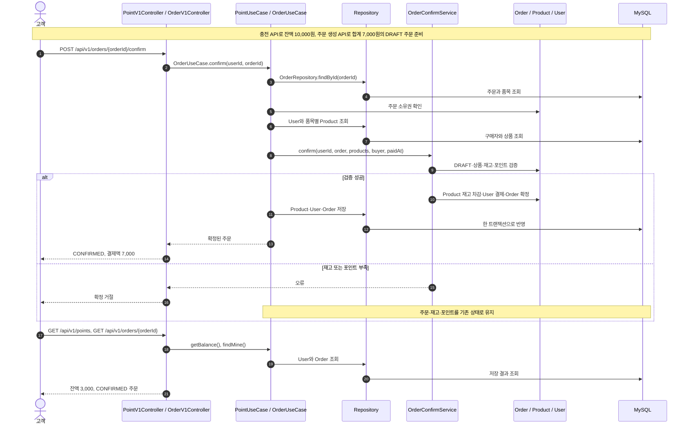

# 2주차 커머스 API 설계

이 문서는 2주차 Implementation Quest의 제출용 대표 설계 문서다. 


이 문서가 담는 것


| 설계         | 상세                                                                                           |
| ---------- | -------------------------------------------------------------------------------------------- |
| 요구사항       | [요구사항 목록](./requirements.md)                                                                 |
| 버드뷰        | [버드뷰](#버드뷰)                                                                                  |
| 구조와 의존     | [아키텍처](#아키텍처)                                                                                |
| 도메인 관계     | [상세 관계도](./domain-relations.md)                                                              |
| 대표 흐름      | [포인트 충전 → 주문 확정](#대표-흐름), [전체 흐름 시퀀스](./representative-flows.md)                             |
| 기본 API 계약  | [API 계약 요약](#api-계약-요약), [API 엔드포인트](./api-endpoints.md), [API 응답 스키마](./api-response-schema.md) |
| 설계 의사결정 내역 | [의사결정 기록](./ADR.md)                                                                          |


## 버드뷰

```
고객   ── /api/v1/**       ──┐
                             ├──▶ API 서버 (commerce-api) ──▶ DB
관리자 ── /api-admin/v1/** ──┘
```


| 요청자 | 경로                 | 요청하는 기능                                                                            |
| --- | ------------------ | ---------------------------------------------------------------------------------- |
| 고객  | `/api/v1/**`       | 브랜드 상세, 상품 목록·상세, 좋아요 등록·취소, 내 좋아요 목록, 내 포인트 충전, 내 잔액 조회, 주문 생성, 주문 확정, 내 주문 목록·상세 |
| 관리자 | `/api-admin/v1/**` | 브랜드 전체 CRUD, 상품 전체 CRUD, 상품 재고 변경, 주문 목록·상세                                        |


## 아키텍처

### 목표

시스템이 지켜야 하는 불변식을 지킨다.

#### 불변식

불변식은 시스템이 언제 보아도 참이어야 하는 조건이다. 어떤 요청을 처리한 뒤에도 깨지지 않는다.

**원칙**

- 불변식은 요구사항에서 도출된다.
- 모든 불변식에는 출처가 되는 요구사항이 있다.

### 각 계층의 역할


| 계층             | 역할                                                                     |
| -------------- | ---------------------------------------------------------------------- |
| domain         | 불변식을 가둔다.                                                              |
| application    | 도메인의 판단을 모아 그 시나리오의 성공·실패와 결과를 내보낸다.                                   |
| interfaces     | 요청자와의 요청·응답 계약을 정의하고 지킨다. 요청을 계약대로 받아 application에 넘기고, 결과를 계약대로 응답한다. |
| infrastructure | 외부 기술과 연결하는 구현을 담는다.                                                   |


### 의존 방향

- 불변식 로직은 외부 기술을 모른다. 그래서 외부 기술을 생각하지 않고 불변식을 다룰 수 있고, 혹여나 외부 기술이 바뀌어도 불변식 로직은 바뀌지 않는다.
- 각 계층의 역할에 따라 의존 방향은 아래와 같다.

```
interfaces ──▶ application ──▶ domain ◀── infrastructure
```


| 계층          | 의존할 수 없는 계층                             |
| ----------- | --------------------------------------- |
| domain      | interfaces, application, infrastructure |
| application | interfaces, infrastructure              |
| interfaces  | infrastructure                          |


## 대표 흐름

과제가 제시한 세 흐름 중 **포인트 충전 → 주문 확정**을 대표 흐름으로 선정했다.


| 단계     | 결과                                                                                          |
| ------ | ------------------------------------------------------------------------------------------- |
| 포인트 충전 | 잔액 0원인 고객이 10,000원을 충전하면 잔액이 10,000원이 된다.                                                   |
| 주문 생성  | 2,000원 상품 A 2개와 3,000원 상품 B 1개를 합계 7,000원의 `DRAFT` 주문으로 저장한다. 이때 재고와 포인트는 차감하지 않는다.         |
| 주문 확정  | 상품 A의 재고는 5개에서 3개, 상품 B는 3개에서 2개, 포인트는 10,000원에서 3,000원으로 줄고 주문은 결제 결과를 가진 `CONFIRMED`가 된다. |
| 결과 조회  | 내 잔액은 3,000원이고, 주문 상세에는 품목·수량·합계·상태·결제액 7,000원이 보인다.                                        |
| 대표 오류  | 재고나 포인트가 부족하면 확정을 거절하고 주문·재고·포인트를 모두 기존 상태로 유지한다.                                           |


### 구현 시퀀스

아래 시퀀스는 실제 구현의 주문 확정 호출과 트랜잭션 경계를 요약한다. 모든 고객 요청은 Controller에 도달하기 전에 `RequesterArgumentResolver`가 `X-USER-ID`로 사용자를 식별한다.



전체 시퀀스는 [전체 흐름 시퀀스](./representative-flows.md)에, 이 대표 흐름의 실제 HTTP 연결 검증은 [ChargeOrderFlowHttpTest](../../apps/commerce-api/src/test/java/com/loopers/interfaces/api/ChargeOrderFlowHttpTest.java)에 정리했다.

## API 계약 요약

- 전체 method·path·입력·성공·대표 오류는 [API 엔드포인트](./api-endpoints.md), 응답 필드와 오류 분류는 [API 응답 스키마](./api-response-schema.md)를 따른다.
