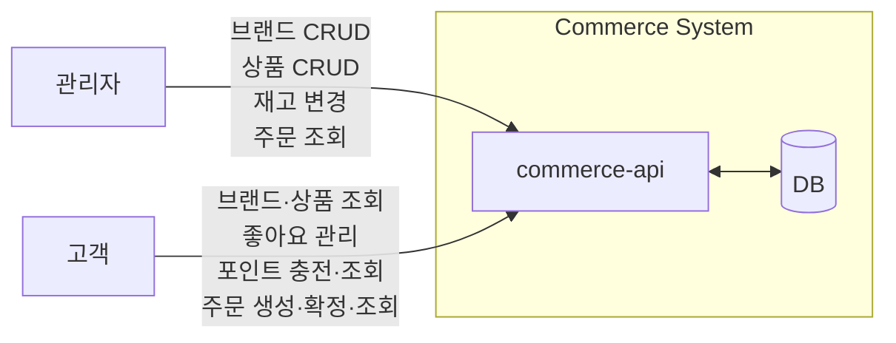
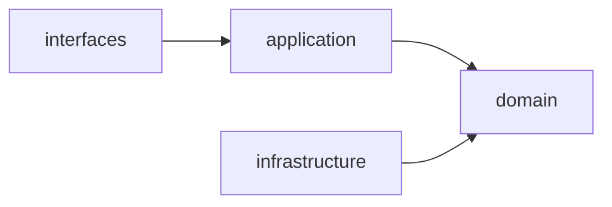
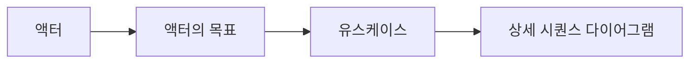
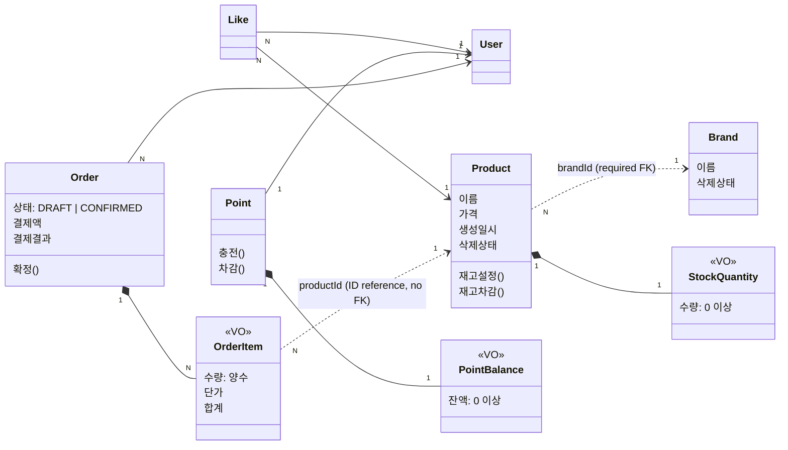
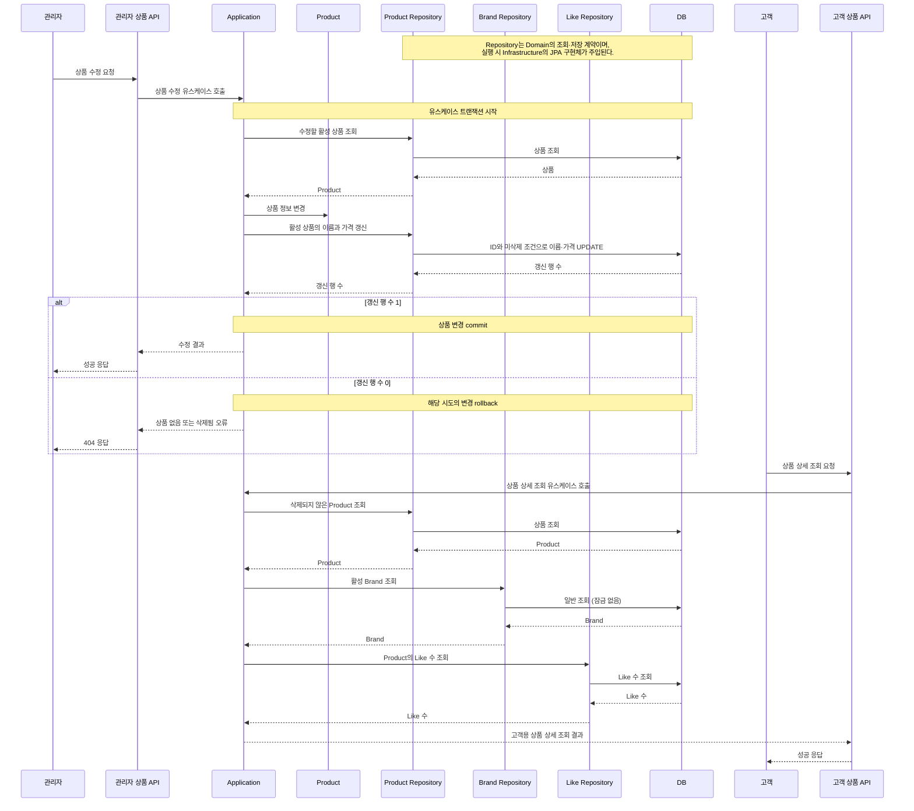

# Commerce API 설계

## 1. HLD

### 1.1 버드뷰

고객과 관리자의 요청은 `commerce-api`에서 처리하며, 조회·변경에 필요한 데이터를 DB와 주고받는다.

```mermaid
flowchart LR
    Admin[관리자]
    Customer[고객]

    subgraph Commerce["Commerce System"]
        API["commerce-api"]
        DB[("DB")]
        API <--> DB
    end

    Admin -->|"브랜드 CRUD<br/>상품 CRUD<br/>재고 변경<br/>주문 조회"| API
    Customer -->|"브랜드·상품 조회<br/>좋아요 관리<br/>포인트 충전·조회<br/>주문 생성·확정·조회"| API
```

### 1.2 구조와 의존

```mermaid
flowchart LR
    interfaces --> application --> domain
    infrastructure --> domain
```

#### 1.2.1 계층의 역할

##### interfaces

- HTTP 요청과 API 요청 DTO를 검증하고 Application 유스케이스를 호출한다.
- Application 결과를 응답 DTO로 변환해 `ApiResponse`로 반환한다.
- Application 계층에만 의존하고, Domain·Infrastructure 계층은 직접 호출하지 않는다.

##### application

- 유스케이스 단위로 요청자를 식별하고 도메인 객체·서비스를 오케스트레이션한다.
- HTTP와 영속성 구현에 의존하지 않고 Domain 계층에만 의존한다.
- 유스케이스 요청·결과 모델을 통해 HTTP DTO와 Domain 모델을 분리한다.

##### domain

- Entity, VO, 도메인 서비스와 비즈니스 규칙·불변식을 관리한다.
- 필요한 조회·저장 기능을 Repository 인터페이스로 정의한다.
- interfaces, application, infrastructure 계층에 의존하지 않는다.

##### infrastructure

- Domain의 Repository 인터페이스를 JPA·DB 기술로 구현한다.
- Commerce의 Brand·Product·Like·Point·Order·User 도메인 모델과 JPA 엔티티를 분리한다. 각 Repository 구현체의 매퍼가 두 모델을 변환하고, Product 도메인은 브랜드 ID만 보유한다. `OrderItem`의 DB 식별자는 Infrastructure에 둔다.
- DB, Redis, Kafka 등 외부 기술과의 연결을 책임진다.
- Domain에 의존해 Repository 계약을 구현하고, 상위 계층에는 의존하지 않는다.

### 1.3 대표 흐름

이 문서의 대표 흐름은 **관리자 상품 수정 → 고객 상품 상세 조회**이다. 관리자가 삭제되지 않은 상품의 이름과 가격을 수정하면, 고객은 상품 상세 조회에서 변경된 상품 정보와 브랜드 정보·좋아요 수를 확인한다.

```mermaid
flowchart LR
    A[액터] --> B[액터의 목표]
    B --> C[유스케이스]
    C --> D[상세 시퀀스 다이어그램]
```

#### 1.3.1 액터

대표 흐름을 기능 목록이 아니라 사용자의 목표에서 출발시키기 위해 먼저 액터를 정리한다.

이 흐름이 도메인 책임을 바로 결정하지는 않지만, 어떤 객체가 어떤 변화에 책임져야 하는지 판단하는 단서가 된다.

| 구분 | 의미 | 예시 |
|----|----|-----|
| 액터 | 시스템 밖에서 목표를 가지고 시스템과 상호작용하는 역할 | 관리자 고객 |
| 목표 | 액터가 얻고 싶은 결과 | 상품을 찾고 구매한다. |
| 유스케이스 | 목표를 이루기 위해 시스템에서 하는 하나의 행동 단위 | 상품을 조회한다. 주문을 생성한다. 주문을 확정한다. |

#### 1.3.2 액터의 목표

##### 관리자

무엇을 관리하기 위해 서비스를 이용하는가?

- 판매할 브랜드와 상품을 운영한다.
- 상품의 재고를 관리하고 고객 주문 현황을 조회한다.

##### 고객

무엇을 위해 서비스를 이용하는가?

- 상품을 찾고 구매한다.
- 좋아요를 통해 추후 구매할 상품을 저장한다.

#### 1.3.3 유스케이스

유스케이스는 API가 아니라, 예를 들어 "고객이 주문을 확정한다"처럼 시스템을 통해 달성하려는 행동이다.

##### 관리자

- 브랜드를 등록•수정•삭제한다.
- 상품을 등록•수정•삭제한다.
- 상품 재고를 변경한다.
- 브랜드를 조회한다.
- 상품을 조회한다.
- 고객 주문을 조회한다.

##### 고객

- 좋아요를 등록하거나 취소한다.
- 포인트를 충전한다.
- 주문을 생성한다.
- 주문을 확정한다.
- 브랜드 정보를 조회한다.
- 상품을 조회한다.
- 내 좋아요 목록을 조회한다.
- 내 포인트 잔액을 조회한다.
- 내 주문 목록•상세를 조회한다.

## 2. LLD

### 2.1 도메인 관계와 업무 규칙 및 설계 판단

```mermaid
classDiagram
    direction LR

    class User
    class Brand {
        이름
        삭제상태
    }
    class Product {
        이름
        가격
        생성일시
        삭제상태
        재고설정()
        재고차감()
    }
    class StockQuantity {
        <<VO>>
        수량: 0 이상
    }
    class Like
    class Point {
        충전()
        차감()
    }
    class PointBalance {
        <<VO>>
        잔액: 0 이상
    }
    class Order {
        상태: DRAFT | CONFIRMED
        결제액
        결제결과
        확정()
    }
    class OrderItem {
        <<VO>>
        수량: 양수
        단가
        합계
    }

    Product "N" ..> "1" Brand : brandId (required FK)
    Product "1" *-- "1" StockQuantity

    Like "N" --> "1" User
    Like "N" --> "1" Product

    Point "1" --> "1" User
    Point "1" *-- "1" PointBalance

    Order "N" --> "1" User
    Order "1" *-- "N" OrderItem
    OrderItem "N" ..> "1" Product : productId (ID reference, no FK)
```

#### 2.1.1 User

- [관계와 경계] User는 독립된 애그리게이트다. 하나의 User에 여러 Order가 연결된다.
- [관계 표현] User는 Order와 Like 컬렉션을 보유하지 않는다.
- [도메인 책임] User는 사용자를 식별하는 ID를 보유한다.

##### 사용자 식별

- User는 fixture로 저장하며, 고객별 API는 `X-USER-ID`로 존재하는 User를 식별한다.
- User CRUD는 이번 범위에 포함하지 않는다.

#### 2.1.2 Brand

- [관계와 경계] Brand는 독립된 애그리게이트다. 하나의 Brand에 여러 Product가 연결된다.
- [관계 표현] Brand는 Product 컬렉션을 보유하지 않는다.
- [도메인 책임] Brand는 자신의 이름과 삭제 상태를 관리하며, `delete()`는 자신의 삭제 상태를 변경한다.
- [도메인 책임] `BrandDeletionPolicy`는 Brand만 담당하며 Product의 Policy를 호출하거나 Repository 조회와 저장을 수행하지 않는다.
- [도메인 규칙] Brand 삭제는 기존 참조를 유지하며 `deletedAt`에 삭제 시각을 기록하는 논리 삭제를 사용한다.
- [불변식] Brand 이름은 공백만으로 구성될 수 없고, 1자 이상 100자 이하여야 한다.
- [불변식] 삭제 여부와 관계없이 Brand 이름은 유일해야 한다.

##### 조회 정책

- 고객 브랜드 상세에서는 삭제된 Brand를 제외한다.
- 관리자 목록과 상세는 삭제된 Brand도 반환한다. 목록은 `status`로 필터링하고 응답에 삭제 상태를 제공한다.

##### 삭제 정책

- Brand 삭제는 연결된 미삭제 Product 전체를 포함한다. 재고 0인 상품도 포함하며, 연결 상품이 없어도 삭제할 수 있다.
- 일괄 삭제는 전체 성공 또는 전체 실패로 처리하며, 실패하면 이번 요청의 변경을 모두 취소한다.
- 이미 삭제된 Product의 삭제 상태와 시각, 다른 Brand와 Product는 변경하지 않는다.
- 재고 수량, 기존 Like 관계, 주문 스냅샷과 결제 정보는 보존한다.
- 삭제 전에 생성했거나 삭제와 겹쳐 생성된 DRAFT 주문도 확정 시 상품 사용 가능 여부를 다시 확인한다. 삭제된 상품이 포함되면 확정을 거절하고 주문 상태, 재고, 포인트와 결제 결과를 유지한다.

#### 2.1.3 Product

- [관계와 경계] Product는 Brand와 별도 애그리게이트이며, StockQuantity VO를 내부에 보유한다.
- [관계 표현] Product는 Brand 객체를 포함하지 않고 `brandId`로 Brand를 참조한다. 재고 수량은 StockQuantity VO로 표현한다.
- [도메인 책임] Product는 자신의 이름, 가격, 재고, 삭제 상태를 관리한다. 재고 설정과 주문 수량 차감을 수행하며, `delete()`는 자신의 삭제 상태를 변경한다.
- [도메인 책임] `ProductDeletionPolicy`는 Product만 담당하며 Brand의 Policy를 호출하거나 Repository 조회와 저장을 수행하지 않는다.
- [도메인 규칙] 상품 등록 시 존재하고 삭제되지 않은 Brand가 필요하다.
- [도메인 규칙] Product 수정 시 기존 Brand는 변경하지 않는다.
- [도메인 규칙] 새 좋아요와 주문 생성은 상품 조회 시 없거나 삭제된 Product를 거절한다. 삭제된 상품은 상품 수정과 재고 변경에 사용할 수 없다.
- [도메인 규칙] 관리자는 Product 재고를 0 이상인 최종 수량으로 설정할 수 있다.
- [도메인 규칙] Product의 재고 차감은 주문 수량이 양수이고 재고가 충분할 때만 허용한다.
- [불변식] Product 이름은 공백만으로 구성될 수 없고, 1자 이상 100자 이하여야 한다.
- [불변식] Product 가격은 1원 이상 100,000,000원 이하여야 한다.

##### 조회 정책

- 고객 상품 상세와 목록에서는 삭제된 Product를 제외한다.
- 관리자 목록과 상세는 삭제된 Product도 반환한다. 목록은 `status`로 필터링하고 응답에 삭제 상태를 제공한다.

##### 삭제 정책

- Product는 기존 참조를 유지하며 `deletedAt`에 삭제 시각을 기록하는 논리 삭제를 사용한다.
- 단독 삭제는 해당 Product만 변경하며 Brand는 유지한다.
- 삭제해도 재고 수량, 기존 Like 관계, 주문 스냅샷과 결제 정보는 보존한다.

##### StockQuantity VO

- [관계와 경계] StockQuantity는 Product 내부에서 재고 수량을 표현하는 VO다. 독립된 도메인 식별자와 생명주기를 갖지 않는다.
- [관계 표현] 재고 수량을 `amount` 값 하나로 표현한다.
- [값 동등성] 재고 수량이 같으면 같은 값으로 판단한다.
- [도메인 책임] StockQuantity는 재고 수량의 검증과 차감 결과 계산을 담당한다.
- [도메인 규칙] StockQuantity는 불변 값으로 다룬다. 차감 시 기존 값을 변경하지 않고, 기존 수량에서 차감 수량을 뺀 새 StockQuantity를 반환한다.
- [도메인 규칙] 차감 수량은 양수여야 하며, 0과 음수는 거절한다.
- [도메인 규칙] 차감 수량이 현재 재고보다 크면 재고 부족으로 거절한다.
- [불변식] 재고 수량은 0 이상이어야 한다.

#### 2.1.4 Like

- [관계와 경계] User 1 : N Like N : 1 Product. Like는 User와 Product에서 독립된 좋아요 관계로 관리한다.
- [관계 표현] Like는 `userId`와 `productId`로 User와 Product를 참조하며 두 객체를 포함하지 않는다. User와 Product는 Like 컬렉션을 보유하지 않는다.
- [도메인 책임] Like는 사용자와 상품 사이의 좋아요 관계를 표현한다. 좋아요 등록은 관계 생성, 취소는 관계 제거로 처리한다.
- [도메인 규칙] 좋아요 등록 시 조회한 Product가 존재하고 삭제되지 않았는지 확인한다.
- [도메인 규칙] 미삭제 Product를 확인한 뒤 삭제와 겹쳐 좋아요를 저장하는 요청은 성공을 허용한다. 저장된 Like 관계는 보존한다.
- [도메인 규칙] User는 삭제된 Product에 남아 있는 자신의 좋아요를 취소할 수 있다. 취소 시 Product의 존재와 활성 여부를 요구하지 않는다.
- [불변식] 같은 `(userId, productId)`의 Like는 중복으로 존재할 수 없다. DB의 유니크 제약으로 중복 저장을 막는다.

##### 조회 규칙

- Product의 좋아요 수는 해당 Product의 Like 관계 수를 집계해 조회한다.
- 내 좋아요 목록에서는 삭제된 Product를 제외한다.

#### 2.1.5 Point

- [관계와 경계] Point는 User와 별도 애그리게이트이며, PointBalance VO를 내부에 보유한다. 하나의 User에 하나의 Point가 연결된다.
- [관계 표현] Point는 `userId`로 User를 참조하며 User 객체를 포함하지 않는다. 잔액은 PointBalance VO로 표현한다.
- [도메인 책임] Point는 사용자별 잔액 상태를 관리하고 충전과 주문 확정의 포인트 차감을 수행한다. 금액 검증과 계산은 PointBalance에 맡기고, 반환된 새 값으로 자신의 잔액을 갱신한다.
- [도메인 규칙] 1포인트는 1원이다.
- [도메인 규칙] 새 Point의 잔액은 0포인트로 시작한다.
- [도메인 규칙] 충전은 기존 잔액에 충전액을 더하고, 주문 확정은 저장된 주문 총액만큼 잔액을 차감한다.
- [도메인 규칙] 충전이나 차감이 거절되면 기존 잔액을 유지한다.
- [불변식] 같은 `userId`를 가진 Point는 중복으로 존재할 수 없다.

##### PointBalance VO

- [관계와 경계] PointBalance는 Point 내부에서 포인트 잔액을 표현하는 VO다. 독립된 도메인 식별자와 생명주기를 갖지 않는다.
- [관계 표현] 포인트 잔액을 `amount` 값 하나로 표현한다.
- [값 동등성] 잔액이 같으면 같은 값으로 판단한다.
- [도메인 책임] PointBalance는 잔액과 변경 금액의 검증, 충전 및 차감 결과 계산을 담당한다.
- [도메인 규칙] PointBalance는 불변 값으로 다룬다. 충전과 차감 시 기존 값을 변경하지 않고, 계산한 새 PointBalance를 반환한다.
- [도메인 규칙] 충전액과 차감액은 양의 정수여야 하며, 0과 음수는 거절한다.
- [도메인 규칙] 충전 후 잔액이 표현 가능한 정수 범위를 넘으면 거절한다.
- [도메인 규칙] 차감액이 현재 잔액보다 크면 잔액 부족으로 거절한다.
- [불변식] 잔액은 0포인트 이상이어야 한다.

#### 2.1.6 Order

- [관계와 경계] Order는 User와 별도 애그리게이트이며, OrderItem VO를 내부에 보유하는 애그리게이트 루트다.
- [관계 표현] Order는 `userId`로 User를 참조하며 User 객체를 포함하지 않는다. OrderItem 컬렉션은 직접 보유한다.
- [도메인 책임] Order는 자신의 소유자 정보, 품목 구성과 총액, DRAFT 상태 검사와 확정 상태 전이, 결제액과 결제 결과를 관리한다.
- [도메인 규칙] Order 생성 시 여러 OrderItem의 수량·단가·합계와 DRAFT 상태를 저장한다.
- [도메인 규칙] Order 생성 시 같은 `productId`의 품목은 수량을 합산해 하나의 OrderItem으로 저장한다.
- [도메인 규칙] Order 생성 시 재고와 포인트는 차감하지 않는다.
- [도메인 규칙] 주문 생성 시 상품 조회에서 존재하고 삭제되지 않은 Product와 양수 수량을 확인한다.
- [도메인 규칙] 미삭제 Product를 확인한 뒤 삭제와 겹쳐 DRAFT를 저장하는 요청은 성공을 허용한다. 확정 시 상품 사용 가능 여부를 다시 검사한다.
- [도메인 규칙] User는 자신의 DRAFT Order만 확정할 수 있다.
- [도메인 규칙] Order는 DRAFT 상태를 확인한 뒤 결제액과 결제 결과를 저장하고 CONFIRMED 상태로 변경한다.
- [도메인 규칙] 주문 확정 시 상품 사용 가능 여부를 다시 검사하고 각 Product의 합산된 총수량으로 재고를 확인한다. 삭제된 상품이 포함되면 확정을 거절한다.
- [도메인 규칙] 주문 확정 시 재고 또는 잔액이 부족하면 확정을 거절한다.
- [불변식] 하나의 Order는 같은 `productId`의 OrderItem을 중복으로 보유하지 않는다.
- [불변식] Order 총액은 각 OrderItem의 품목 금액 합과 일치해야 한다.
- [불변식] 하나의 Order에서 최초 확정은 한 번만 반영한다.
- [불변식] CONFIRMED 상태의 Order에는 결제액과 결제 결과가 저장되어야 한다.

##### OrderItem VO

- [관계와 경계] OrderItem은 Order 내부에서 주문 품목을 표현하는 VO다. 독립된 도메인 식별자와 생명주기를 갖지 않는다.
- [관계 표현] OrderItem은 `productId` 값으로 Product를 참조하며 Product 객체를 포함하지 않는다. 주문 품목의 Product ID는 DB FK로 설정하지 않는다.
- [스냅샷] 주문 생성 시점의 Product ID, 상품명, 단가와 수량을 보존하며, 해당 단가와 수량으로 품목 금액을 계산한다. 주문 내역은 현재 Product를 다시 조회해 과거 상품 정보를 대체하지 않는다. Brand와 Product 삭제 후에도 기존 주문의 품목과 결제 정보는 유지한다.
- [값 동등성] Product ID, 상품명, 단가와 수량이 모두 같으면 같은 품목 값으로 판단한다.
- [도메인 책임] OrderItem은 품목의 상품 정보와 단가, 수량을 보유하고 수량 검증과 품목 금액 계산을 담당한다.
- [도메인 규칙] OrderItem은 불변 값으로 다룬다. 수량 합산이 필요하면 합산 수량의 새 OrderItem을 만들고, Order가 품목을 교체하며 총액을 다시 계산한다.
- [불변식] 수량은 양수여야 한다.
- [불변식] 품목 금액은 저장된 단가와 수량의 곱과 일치해야 한다.

### 2.2 대표 흐름 시퀀스 다이어그램

```mermaid
sequenceDiagram
    participant A as 관리자
    participant AAC as 관리자 상품 API
    participant APP as Application
    participant P as Product
    participant PR as Product Repository
    participant BR as Brand Repository
    participant LR as Like Repository
    participant DB as DB
    participant C as 고객
    participant CAC as 고객 상품 API

    Note over PR,DB: Repository는 Domain의 조회·저장 계약이며,<br/>실행 시 Infrastructure의 JPA 구현체가 주입된다.

    A->>AAC: 상품 수정 요청
    AAC->>APP: 상품 수정 유스케이스 호출
    Note over APP,DB: 유스케이스 트랜잭션 시작
    APP->>PR: 수정할 활성 상품 조회
    PR->>DB: 상품 조회
    DB-->>PR: 상품
    PR-->>APP: Product

    APP->>P: 상품 정보 변경
    APP->>PR: 활성 상품의 이름과 가격 갱신
    PR->>DB: ID와 미삭제 조건으로 이름·가격 UPDATE
    DB-->>PR: 갱신 행 수
    PR-->>APP: 갱신 행 수
    alt 갱신 행 수 1
        Note over APP,DB: 상품 변경 commit
        APP-->>AAC: 수정 결과
        AAC-->>A: 성공 응답
    else 갱신 행 수 0
        Note over APP,DB: 해당 시도의 변경 rollback
        APP-->>AAC: 상품 없음 또는 삭제됨 오류
        AAC-->>A: 404 응답
    end

    C->>CAC: 상품 상세 조회 요청
    CAC->>APP: 상품 상세 조회 유스케이스 호출
    APP->>PR: 삭제되지 않은 Product 조회
    PR->>DB: 상품 조회
    DB-->>PR: Product
    PR-->>APP: Product
    APP->>BR: 활성 Brand 조회
    BR->>DB: 일반 조회 (잠금 없음)
    DB-->>BR: Brand
    BR-->>APP: Brand
    APP->>LR: Product의 Like 수 조회
    LR->>DB: Like 수 조회
    DB-->>LR: Like 수
    LR-->>APP: Like 수
    APP-->>CAC: 고객용 상품 상세 조회 결과
    CAC-->>C: 성공 응답
```

### 2.3 API 계약 — HTTP 요청·응답·오류

#### 2.3.1 관리자 API

공통 Prefix: `/api-admin/v1`

##### 브랜드

| 기능 | Method | Path | 입력      | 성공                | 대표 오류                                    |
|---|---|---|---------|-------------------|------------------------------------------|
| 브랜드 목록 조회 | `GET` | `/brands` | Query: `status` (`ACTIVE`, `DELETED`, `ALL`; 기본 `ALL`) | `200 OK` 삭제 상태를 포함한 브랜드 목록 | `400 Bad Request` 잘못된 `status` 입력 |
| 브랜드 등록 | `POST` | `/brands` | Body: `name`(공백만 불가, 1~100자) | `201 Created` 생성된 브랜드 정보 | `400 Bad Request` 이름 검증 실패 `409 Conflict` 이미 등록된 이름 |
| 브랜드 상세 조회 | `GET` | `/brands/{brandId}` | Path: `brandId` | `200 OK` 삭제 상태를 포함한 브랜드 상세 정보 | `404 Not Found` 없는 Brand             |
| 브랜드 수정 | `PUT` | `/brands/{brandId}` | Path: `brandId` Body: `name`(공백만 불가, 1~100자) | `200 OK` 수정된 브랜드 정보 | `400 Bad Request` 이름 검증 실패 `404 Not Found` 없거나 삭제된 Brand `409 Conflict` 이미 등록된 이름 |
| 브랜드·연결 상품 일괄 삭제 | `DELETE` | `/brands/{brandId}` | Path: `brandId` | `200 OK` Brand와 연결된 활성 Product 논리 삭제 | `404 Not Found` 없거나 삭제된 Brand |

##### 상품·재고

| 기능 | Method | Path | 입력 | 성공 | 대표 오류 |
|---|---|---|---|---|---|
| 상품 목록 조회 | `GET` | `/products` | Query: `status` (`ACTIVE`, `DELETED`, `ALL`; 기본 `ALL`) | `200 OK` 삭제 상태를 포함한 상품 목록 | `400 Bad Request` 잘못된 `status` 입력 |
| 상품 등록 | `POST` | `/products` | Body: `brandId`, 이름(공백만 불가, 1~100자), 가격(1~100,000,000원) | `201 Created` 재고 0으로 생성된 상품 정보 | `400 Bad Request` 상품 이름·가격 검증 실패 `404 Not Found` 없거나 삭제된 Brand |
| 상품 상세 조회 | `GET` | `/products/{productId}` | Path: `productId` | `200 OK` 상품·브랜드·재고·삭제 상태 정보 | `404 Not Found` 없는 Product |
| 상품 수정 | `PUT` | `/products/{productId}` | Path: `productId` Body: 이름(공백만 불가, 1~100자), 가격(1~100,000,000원) | `200 OK` 수정된 상품 정보 | `400 Bad Request` 상품 이름·가격 검증 실패 `404 Not Found` 없거나 삭제된 Product |
| 상품 삭제 | `DELETE` | `/products/{productId}` | Path: `productId` | `200 OK` Product 논리 삭제 재고·기존 Like·주문 정보는 유지 | `404 Not Found` 없거나 이미 삭제된 Product |
| 상품 재고 변경 | `PUT` | `/products/{productId}/stock` | Path: `productId` Body: 최종 재고 수량 | `200 OK` 변경된 재고 수량 | `400 Bad Request` 0 미만 재고 수량 `404 Not Found` 없거나 삭제된 Product |

브랜드 이름, 상품 이름·가격이나 재고를 현재와 같은 값으로 설정해도 `200 OK`로 처리한다.
같은 필드의 수정 요청이 겹치면 마지막으로 반영된 요청의 값이 남는다. 관리자 재고 설정은 입력한 최종 수량을 적용한다.

##### 주문

| 기능 | Method | Path | 입력 | 성공 | 대표 오류 |
|---|---|---|---|---|---|
| 주문 목록 조회 | `GET` | `/orders` | - | `200 OK` 구매자·품목·상태·금액·결제 결과를 포함한 주문 목록 | 기능별 대표 오류 없음 |
| 주문 상세 조회 | `GET` | `/orders/{orderId}` | Path: `orderId` | `200 OK` 구매자·품목·상태·금액·결제 결과 | `404 Not Found` 없는 Order |

#### 2.3.2 고객 API

공통 Prefix: `/api/v1`  
사용자 식별: Header `X-USER-ID`

##### 브랜드·상품

| 기능 | Method | Path | 입력 | 성공 | 대표 오류 |
|---|---|---|---|---|---|
| 브랜드 상세 조회 | `GET` | `/brands/{brandId}` | Path: `brandId` | `200 OK` 브랜드 상세 정보 | `404 Not Found` 없거나 삭제된 Brand |
| 상품 목록 조회 | `GET` | `/products` | Query: `brandId`(선택), 페이지, `sort`(`latest`·`price_asc`·`likes_desc`) | `200 OK` 삭제되지 않은 상품의 브랜드 정보·좋아요 수를 포함한 목록 | `400 Bad Request` Query 입력 오류 |
| 상품 상세 조회 | `GET` | `/products/{productId}` | Path: `productId` | `200 OK` 브랜드 정보·좋아요 수를 포함한 상품 상세 정보 | `404 Not Found` 없거나 삭제된 Product |

##### 상품 목록 정렬 기준

- `latest`: Product의 `createdAt` 내림차순, `productId` 내림차순
- `price_asc`: Product의 가격 오름차순, `productId` 오름차순
- `likes_desc`: Like 관계 수 내림차순, `productId` 내림차순

##### 좋아요

| 기능 | Method | Path | 입력 | 성공 | 대표 오류 |
|---|---|---|---|---|---|
| 좋아요 등록 | `POST` | `/products/{productId}/likes` | Path: `productId` | `200 OK` 좋아요 상태 보장 이후 Brand·Product가 삭제돼도 저장된 Like 관계 보존 | `404 Not Found` 상품 조회 시 없거나 삭제된 Product |
| 좋아요 취소 | `DELETE` | `/products/{productId}/likes` | Path: `productId` | `200 OK` 좋아요 취소 상태 보장 | 기능별 대표 오류 없음 |
| 내 좋아요 목록 조회 | `GET` | `/users/{userId}/likes` | Path: `userId` (`X-USER-ID`와 일치) | `200 OK` 삭제된 Product를 제외한 내 좋아요 상품 목록 | `404 Not Found` 조회할 수 없는 User |

##### 포인트·주문

| 기능 | Method | Path | 입력 | 성공 | 대표 오류 |
|---|---|---|---|---|---|
| 포인트 충전 | `POST` | `/points/charge` | Body: `amount` | `200 OK` 충전 후 잔액 | `400 Bad Request` 누락·잘못된 타입·양의 정수가 아닌 `amount`, 충전 후 잔액 범위 초과 |
| 내 포인트 잔액 조회 | `GET` | `/points` | - | `200 OK` 저장된 포인트 잔액 | 기능별 대표 오류 없음 |
| 주문 생성 | `POST` | `/orders` | Body: 주문 품목 | `201 Created` 중복 품목을 합산해 품목, 수량, 단가와 합계를 저장한 `DRAFT` Order 반환 재고와 포인트 미차감 이후 Brand·Product가 삭제돼도 저장된 DRAFT 보존 | `400 Bad Request` 주문 품목 또는 수량 입력 오류 `404 Not Found` 상품 조회 시 없거나 삭제된 Product |
| 주문 확정 | `POST` | `/orders/{orderId}/confirm` | Path: `orderId` | `200 OK` 재고·포인트 차감, 결제 정보 저장 후 `CONFIRMED` Order | `404 Not Found` 주문이 없거나 타인 소유 `409 Conflict` DRAFT가 아닌 Order, 상품 사용 불가, 재고 부족 또는 잔액 부족 |
| 내 주문 목록 조회 | `GET` | `/orders` | - | `200 OK` 내 주문의 품목·수량·금액·상태·결제액 목록 | 기능별 대표 오류 없음 |
| 내 주문 상세 조회 | `GET` | `/orders/{orderId}` | Path: `orderId` | `200 OK` 내 주문의 품목·수량·금액·상태·결제액 | `404 Not Found` 조회할 수 없는 Order |

### 2.4 기능별 기대값 — 테스트에서 확인할 입력과 결과

#### 2.4.1 포인트 충전

| 규칙 | 주어진 상태와 입력 | 기대값 |
|---|---|---|
| 정상 충전 | 잔액 `100`에 `200` 충전 | `200 OK`, 잔액 `300` |
| 0 충전 거절 | 잔액 `100`에 `0` 충전 | `400 Bad Request`, 잔액 `100` 유지 |
| 음수 충전 거절 | 잔액 `100`에 `-1` 충전 | `400 Bad Request`, 잔액 `100` 유지 |
| 충전 요청 입력 오류 | 잔액 `100`, `amount` 누락, 정수가 아닌 값 또는 처리 가능한 수치 범위 밖 값 | `400 Bad Request`, 잔액 `100` 유지 |
| 잔액 합산 한도 초과 | 시스템이 저장할 수 있는 최대 잔액에 `1`포인트 충전 | `400 Bad Request`, 기존 잔액 유지 |
| 동시 충전 | 잔액 `100`에 서로 다른 요청이 각각 `200`, `300` 충전 | 두 요청 모두 성공, 원자적 증가 결과 잔액 `600` |
| 충전과 차감의 동시 갱신 | 잔액 `10,000`에서 `2,000` 충전과 `7,000` 주문 차감 동시 실행 | 두 요청 모두 성공, 최종 잔액 `5,000` |

#### 2.4.2 브랜드와 연결 상품 일괄 삭제

##### 일괄 삭제의 핵심 검증

보존 대상은 기삭제 Product의 상태와 삭제 시각, 다른 Brand와 Product, 재고, 기존 Like 관계, 주문 스냅샷과 총액 및 포인트 결제 결과다.

| 규칙 | 주어진 상태와 입력 | 기대값 |
|---|---|---|
| 정상 처리와 보존 | 연결 상품 있음(재고 0과 기삭제 상품 포함), 상품 없음, 기삭제 상품만 있음의 각 사례. 다른 Brand와 Product, 기존 Like와 확정 Order도 준비 | `200 OK`, Brand와 연결된 미삭제 Product 전체 삭제, 보존 대상 유지 |
| 없는 대상 | 없거나 이미 삭제된 Brand 삭제 요청 | `404 Not Found`, Brand와 Product 변경 없음 |
| 중간 실패 | 미삭제 Product가 있는 Brand를 준비하고 Product UPDATE 후 Brand 갱신 경계에서 예외 발생, 또는 두 UPDATE 후 commit 전에 예외 발생 | 요청 실패, 이번 요청의 삭제 상태와 수정 시각 전체 롤백, 다른 요청의 commit 보존 |
| 동일 Brand 삭제 경쟁 | 같은 Brand에 두 삭제 요청 실행, 한 요청이 commit | `200` 한 건, 다른 요청은 배타 잠금 대기 후 활성 Brand 조회 결과가 없어 `404`, 기존 삭제 시각 유지 |
| 상품 등록과 삭제 경쟁 | 같은 Brand에서 Product 등록과 브랜드 일괄 삭제를 겹쳐 실행 | 등록이 Brand 공유 잠금을 먼저 얻고 commit하면 삭제가 새 Product까지 삭제. 삭제가 먼저 배타 잠금을 얻고 commit하면 등록은 `404`이며 Product를 만들지 않음 |
| 상품 변경과 삭제 경쟁 | 상품 수정, 재고 설정 또는 단독 삭제와 일괄 삭제가 겹침 | 상품 변경이 먼저 commit되면 변경된 이름, 가격과 재고 또는 기존 삭제 시각을 보존. 일괄 삭제가 해당 Product를 먼저 갱신하고 commit하면 변경은 미삭제 조건부 UPDATE 0행으로 `404` |
| Brand 잠금 경합 | Brand 이름 수정 또는 주문 확정과 일괄 삭제가 겹침 | 변경이 Brand 행의 잠금을 먼저 얻으면 해당 처리가 끝난 뒤 삭제 진행. 삭제가 먼저 배타 잠금을 얻고 commit하면 이름 수정은 `404`, 주문 확정은 `409`로 종료 |

삭제가 rollback되면 대기한 요청은 변경 전 상태에서 각 업무 조건을 다시 판단한다. 수정 요청이 삭제 전에 미삭제 상태를 조회했더라도 UPDATE의 미삭제 조건으로 판정한다. 실패와 경쟁의 최종 상태는 서비스 트랜잭션과 모든 요청이 종료된 뒤 새 DB 조회로 확인한다.

##### 관리자 접근과 연결 API의 동작 확인

| 규칙 | 주어진 상태와 입력 | 기대값 |
|---|---|---|
| 관리자 접근 거절 | 일반 사용자 또는 식별 없는 브랜드 삭제 요청 | 기존 관리자 접근 규칙으로 `403`, Brand와 Product 변경 없음 |
| 삭제 후 고객 조회 | 삭제가 commit된 뒤 고객 상세, 목록과 내 좋아요 조회 | 상세는 `404`, 목록과 내 좋아요에서 삭제 대상 제외 |
| 삭제 후 새 사용 | 삭제 commit 후 시작한 새 좋아요와 주문 생성 요청 | `404`, Like와 Order 추가 없음 |
| 기존 좋아요 취소 | 삭제된 Product에 본인의 기존 Like 존재 | 본인의 취소 허용 |
| DRAFT 확정 거절 | 삭제 전에 생성했거나 삭제와 겹쳐 생성한 DRAFT의 확정 요청 | `409`, DRAFT, 모든 품목 재고, 포인트와 결제 결과 유지 |
| 삭제와 겹친 DRAFT 생성 | 미삭제 Product를 일반 조회로 확인한 뒤 브랜드 삭제가 commit되고 DRAFT 저장 | `201 Created`, DRAFT 저장, 재고와 포인트 미차감. 이후 확정은 `409`, DRAFT와 재고, 포인트 및 결제 결과 유지 |
| 삭제와 겹친 좋아요 등록 | 미삭제 Product를 일반 조회로 확인한 뒤 브랜드 삭제가 commit되고 Like 저장 | `200 OK`, Like 관계 저장. 내 좋아요 목록에서는 제외하며 본인의 취소는 허용 |

#### 2.4.3 상품 단독 삭제

| 규칙 | 주어진 상태·입력 | 기대값 |
|---|---|---|
| 활성 Product 삭제 | 활성 Brand에 연결된 Product 삭제 요청 | 성공, Product만 논리 삭제되고 Brand는 활성 상태 유지 |
| 재고 수량 보존 | 재고가 0 또는 양수인 Product 삭제 요청 | 삭제 성공, 재고 수량은 변경되지 않음 |
| 기존 관계·주문 보존 | Product에 Like 또는 기존 Order·OrderItem이 존재 | 삭제 후에도 Like 관계와 주문 스냅샷을 유지하고, 기존 Like 취소 허용 |
| 이미 삭제된 Product | 삭제된 Product에 삭제 요청 | `404 Not Found`, 기존 삭제 상태와 삭제 시각 유지 |
| 삭제 후 변경 시도 | 삭제된 Product의 수정·재고 변경 요청 | `404 Not Found`, Product 상태와 재고 유지 |
| 동일 Product 삭제 경쟁 | 같은 Product에 두 삭제 요청 실행, 한 요청이 commit | `200` 한 건, 다른 요청은 갱신 행 수 0으로 `404`, 기존 삭제 시각 유지 |
| 수정이나 재고 설정 후 삭제 | 수정 또는 재고 설정이 먼저 commit된 뒤 삭제 UPDATE 실행 | 삭제 성공, 변경된 이름과 가격 또는 재고 보존 |
| 삭제 후 수정이나 재고 설정 | 삭제가 먼저 commit된 뒤 수정 또는 재고 설정 UPDATE 실행 | 미삭제 조건을 만족하지 못해 `404`, 기존 상품 정보와 재고 및 삭제 상태 유지 |

#### 2.4.4 주문 확정

각 사례는 독립적으로 준비한 데이터로 확인한다. 별도 명시가 없으면 요청자 소유의 DRAFT 주문과 사용 가능한 상품을 준비하며, 확정 전 `paymentAmount`와 `paymentResult`는 `null`이다. 거절된 시도의 변경은 모두 취소하고, 다른 요청이 commit한 결과는 보존한다.

| 규칙 | 주어진 상태와 입력 | 기대값 |
|---|---|---|
| 정상 확정 | 단가 `2,000원`, 수량 `2`인 본인 DRAFT 주문, 재고 `5`, 잔액 `10,000원` | `200 OK`, CONFIRMED, 재고 `3`, 잔액 `6,000원`, 결제액 `4,000원`, 결제 결과 SUCCESS |
| 주문 총액만큼 포인트 차감 | 총액 `70원`인 본인 DRAFT 주문, 잔액 `100원`, 상품 재고 충분 | `200 OK`, CONFIRMED, 잔액 `30원`, 결제액 `70원`과 SUCCESS 저장, 주문 품목 수량만큼 재고 차감 |
| 주문 총액보다 잔액 부족 | 총액 `101원`인 본인 DRAFT 주문, 잔액 `100원`, 상품 재고 충분 | `409 Conflict`, DRAFT와 잔액 `100원` 유지, 재고 차감과 결제 정보 저장 없음 |
| 재고와 잔액 경계값 | 주문 수량 `2`, 총액 `4,000원`, 재고 `2`, 잔액 `4,000원` | 확정 성공, 재고와 잔액 모두 `0` |
| 요청자 식별값 누락 | `X-USER-ID` 없이 확정 요청 | `400 Bad Request`, 주문, 재고와 잔액 변경 없음 |
| 조회할 수 없는 주문 | 없는 User나 Order 또는 타인 소유 Order의 확정 요청 | `404 Not Found`, 주문, 재고와 잔액 변경 없음 |
| 이미 확정된 주문 | 정상 확정 사례를 성공시킨 뒤 같은 주문에 다시 확정 요청 | `409 Conflict`, CONFIRMED와 기존 결제 정보 유지, 재고 `3`과 잔액 `6,000원` 유지 |
| 주문 당시 금액 사용 | 단가 `2,000원`, 수량 `2`로 저장한 DRAFT 주문의 현재 상품 가격을 `3,000원`으로 변경, 잔액 `10,000원`과 충분한 재고 | 확정 성공, 저장된 단가와 총액 유지, 결제액 `4,000원`, 잔액 `6,000원` |
| 합산 수량 차감 | 같은 Product의 수량 `2`와 `3`을 합산해 저장한 DRAFT 주문, 저장 단가 `2,000원`, 재고 `5`, 잔액 `10,000원` | 확정 성공, 해당 Product 재고를 총수량 `5`만큼 차감해 `0`, 잔액 `0`, 결제액 `10,000원` |
| 상품 사용 불가 | 확정 시 주문 품목의 Product가 없거나 삭제되어 있음. 삭제와 겹쳐 생성된 DRAFT도 포함 | `409 Conflict`, DRAFT와 확정 전 결제 정보 유지, 해당 시도의 재고와 포인트 차감 없음 |
| 재고 부족 | 주문 수량 `2`, 총액 `4,000원`, 재고 `1`, 잔액 `10,000원` | `409 Conflict`, DRAFT, 재고 `1`과 잔액 `10,000원` 유지, 결제 정보 `null` |
| 잔액 부족 | 주문 수량 `2`, 총액 `4,000원`, 재고 `5`, 잔액 `3,999원` | `409 Conflict`, DRAFT, 재고 `5`와 잔액 `3,999원` 유지, 결제 정보 `null` |
| 여러 품목의 부분 차감 취소 | P1의 실제 차감 SQL 실행 후 P2의 재고 조건을 만족하지 못함 | `409 Conflict`, P1과 P2 재고 및 잔액 복구, DRAFT와 확정 전 결제 정보 유지 |
| 중간 저장 실패 | Order와 상품의 조건부 갱신 및 Point 차감 SQL 실행 후 테스트 구성에서 예외 발생 | `500`, 해당 시도의 재고와 포인트 차감, 확정 상태와 결제 정보 전체 롤백 |
| 같은 주문의 동시 확정 | 정상 확정 사례의 같은 DRAFT를 두 요청이 읽고 확정 | 성공 `1건`, 나머지는 DRAFT 상태 검사 또는 조건부 갱신 실패로 `409`, 재고 `3`, 잔액 `6,000원`, 결제액 `4,000원`과 SUCCESS 한 번 반영 |
| 조건부 주문 상태 전이 경합 | 같은 DRAFT 주문을 두 요청이 동시에 확정 | DRAFT 조건부 갱신 1건만 성공, 나머지는 `409 Conflict`; 재고·포인트 차감과 결제 결과는 한 번만 반영 |
| 같은 재고의 동시 차감 | 재고 `5`, 서로 다른 사용자의 서로 다른 주문 `8건`이 각각 `1개` 구매, 모든 사용자의 포인트 충분 | 성공 `5건`, 재고 부족 `3건`, 최종 재고 `0`, 거절된 주문은 DRAFT와 확정 전 결제 정보 유지 |
| 상품 수정과 재고 차감 | 상품 수정 요청이 재고 `5`를 조회한 뒤 주문 확정이 `2개` 차감하고 commit, 이후 이름과 가격 수정 UPDATE 실행 | 두 요청 성공, 변경된 이름과 가격 및 최종 재고 `3` 유지 |
| 재고 차감 후 최종 수량 설정 | 재고 `5`에서 주문 확정이 `2개` 차감하고 commit, 이후 관리자 재고 `10` 설정 UPDATE 실행 | 두 요청 성공, 최종 재고 `10`, 주문의 수량과 결제 결과 유지 |
| 최종 수량 설정 후 재고 차감 | 관리자의 재고 `10` 설정이 commit된 뒤 주문 확정의 `2개` 차감 UPDATE 실행 | 두 요청 성공, 최종 재고 `8`, 성공한 주문 수량만 차감 |
| 같은 잔액의 차감과 잔액 부족 | 한 사용자의 잔액 `10,000원`, 서로 다른 상품의 `4,000원` DRAFT 주문 `3건`, 각 상품 재고 충분. 세 주문 확정을 동시에 시작 | 조건부 차감 성공 `2건`, 잔액 부족 `1건`, 자동 재시도 없음, 최종 잔액 `2,000원`, 거절된 주문의 재고 차감과 확정 결과 없음 |
| 충전과 주문 확정 경쟁 | 잔액 `10,000원`에서 `2,000원` 충전과 총액 `7,000원` 주문 확정을 함께 실행하고 재고는 충분히 준비 | 두 요청 모두 성공, 최종 잔액 `5,000원`, 기술 오류 없음 |

실패와 동시 요청의 최종 상태는 서비스 트랜잭션 및 모든 요청이 종료된 뒤 새 DB 조회로 확인한다. 주문의 품목과 총액은 유지하며 성공한 주문만 CONFIRMED와 결제 정보를 갖는다. 조건부 갱신 결과의 업무 거절과 기술 오류를 구분한다.

한 사용자의 서로 다른 DRAFT 주문 세 건을 동시에 확정해 같은 Point 잔액 행의 조건부 차감을 검증한다. 주문마다 상품을 다르게 하고 재고를 충분히 준비한다. 각 차감은 실행 순서와 관계없이 잔액 조건을 만족하는 두 건만 성공하고, 남은 한 건은 잔액 부족으로 거절되어야 한다. 충전도 Point 행을 원자적으로 증가시켜 주문 차감과 겹친 변경을 보존한다.

## 3. 설계 판단 — AI와 설계 다듬기

초안을 기준으로 책임 중복과 변경에 취약한 의존을 검토한다. 미정 정책은 먼저 결정한 뒤, 선택한 대안과 이유를 각 설계 판단에 반영한다.

### 3.1 상품 상세 조회 결과 조합 책임에 대한 설계 판단

- [문제] `ProductRepository`가 Brand 정보와 Like 수까지 반환하면, 고객 응답 변경이 Product 영역까지 전파될 수 있다.

- [대안 1] ProductRepository가 Brand 정보와 Like 수까지 함께 조회한다.
  - Application의 조회 호출이 단순하다.
  - 고객 응답을 위한 조회 요구가 Product 도메인 저장소에 쌓인다.
- [대안 2] Application이 Product·Brand·Like Repository의 조회 결과를 조합한다.
  - Product는 상품 상태와 규칙만 책임진다.
  - Brand 상세 정보나 Like 수 응답이 바뀌어도 Application의 조회 결과 모델만 변경한다.
  - 조회를 여러 번 수행하고 조합하는 코드가 Application에 늘어난다.

- [설계 결정] Application이 Product·Brand·Like Repository의 조회 결과를 조합한다.
- [이유] Product는 상품의 상태와 규칙을 책임지고, Brand 상세 정보와 Like 수는 고객 조회를 위한 결과다.
  - Brand 응답이나 Like 수의 형태가 바뀌어도 Product의 상태·규칙이 함께 변경되지 않도록 조회를 조합할 수 있게 책임을 분리한다.
- [결과] 고객 상품 상세 응답의 변경은 Application의 조회 결과 모델과 응답 DTO에 반영한다.
  - Product는 상품 상태와 규칙을, Brand와 Like는 각각의 상태와 관계를 계속 책임진다.
  - 예를 들어 이미 관리 중인 Brand 소개를 응답에 추가하거나 Like 수를 숨기면, Product를 변경하지 않고 조회 결과 모델과 응답 DTO만 변경하면 된다.
  - Brand에 로고라는 새 상태 자체를 추가한다면 Brand도 변경되지만, Product는 변경하지 않는다.

### 3.2 도메인 오류와 HTTP 오류 변환 책임에 대한 설계 판단

- [문제] Domain 객체가 CoreException과 HTTP 상태를 담은 ErrorType을 직접 사용하면, Domain이 HTTP 오류 표현에 의존한다.
  - 이 문제는 Point뿐 아니라 Brand·Product·Like·Order에도 반복될 수 있다.

- [대안 1] 모든 Domain 오류를 CoreException과 ErrorType으로 표현한다.
  - 기존 ApiControllerAdvice를 그대로 재사용할 수 있다.
  - Domain이 HTTP 상태·오류 코드 표현에 계속 의존한다.
- [대안 2] Domain이 DomainException과 도메인 오류 코드를 표현하고, interfaces의 ApiControllerAdvice가 이를 HTTP 상태·ApiResponse로 변환한다.
  - Domain은 업무 오류 의미만 표현하고 HTTP 표현을 알 필요가 없다.
  - 도메인 오류 타입·코드와 HTTP 변환 규칙을 추가로 관리해야 한다.

- [설계 결정] 현재는 Domain 오류를 기존 `CoreException`과 `ErrorType`으로 표현하고, `ApiControllerAdvice`가 `ApiResponse` 오류 응답으로 변환한다.
- [이유] starter에 이미 오류 코드·HTTP 상태·공통 응답 변환이 갖춰져 있어, 이번 기본 기능에서 별도 `DomainException` 체계를 도입하면 모든 도메인과 예외 처리의 변경 범위가 커진다.
  - 현재 계약의 `400`·`404`·`409` 응답을 일관되게 유지하는 비용이 더 작다.
- [결과] Point·Brand·Product·Like·Order는 `CoreException`과 `ErrorType`을 사용한다.
  - 도메인 오류와 HTTP 표현을 더 엄격히 분리해야 하는 요구가 생기면, `DomainException`과 오류 코드 매핑으로 전환한다.

### 3.3 Commerce 도메인 모델과 JPA 매핑 분리

- [문제] Commerce의 `Brand`·`Product`·`Like`·`Point`·`Order`·`OrderItem`·`User`가 JPA 어노테이션 또는 공통 JPA `BaseEntity`에 직접 의존했다. Product는 Brand JPA 관계를 도메인 객체 참조로 보유했다.
- [대안 1] 도메인 객체에 JPA 매핑을 계속 둔다.
  - 엔티티와 저장 모델이 하나라 코드와 매핑이 적다.
  - 영속성 기술과 객체 관계가 도메인 규칙·모델에 함께 묶인다.
- [대안 2] 순수 도메인 객체와 Infrastructure JPA 엔티티를 분리하고 Repository 구현체에서 변환한다.
  - 도메인은 ID·상태·규칙에 집중하고, JPA 연관관계와 테이블 표현은 Infrastructure에 한정된다.
  - 매퍼가 추가되고 도메인 객체가 JPA 관리 대상이 아니므로 Repository를 통해 변경을 명시적으로 반영해야 한다.

- [설계 결정] Commerce의 도메인 모델을 JPA 어노테이션과 공통 JPA `BaseEntity`에서 분리한다. Product는 `brandId`를 보유하고, Infrastructure의 `ProductJpaEntity`가 `BrandJpaEntity`와 외래 키 연관관계를 가진다. 주문 품목의 DB 식별자는 `OrderItemJpaEntity`가 소유한다.
- [이유] 업무 규칙을 JPA 프록시·영속성 컨텍스트의 생명주기와 독립적으로 다루고, 도메인 객체가 영속성 API 없이도 동작하도록 한다. Order는 주문 품목을 Aggregate 내부 모델로 유지하면서 저장 관계를 JPA 엔티티에 한정한다.
- [결과] Brand·Product·Like·Point·Order·User Repository 구현체의 매퍼가 도메인 객체와 저장 엔티티를 변환한다. Application은 Repository의 저장 또는 갱신 계약을 호출해 변경을 명시적으로 반영한다. 주문 확정은 주문 상태, 상품 재고와 포인트 잔액을 조건부 갱신한다. 기존 Commerce 테이블과 컬럼·제약은 유지한다. Example starter 모델은 이번 분리 범위에 포함하지 않는다.
