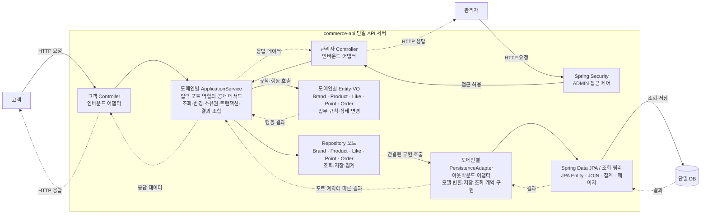
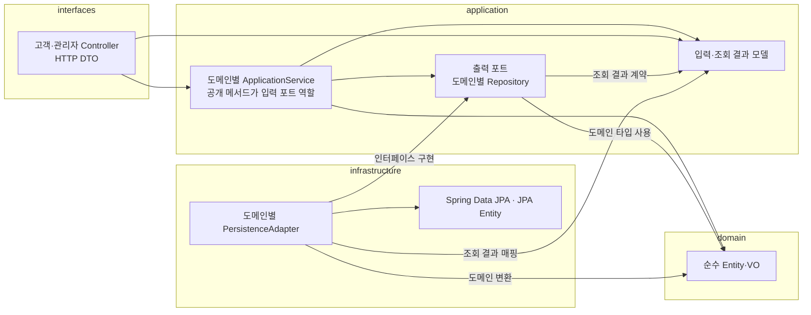
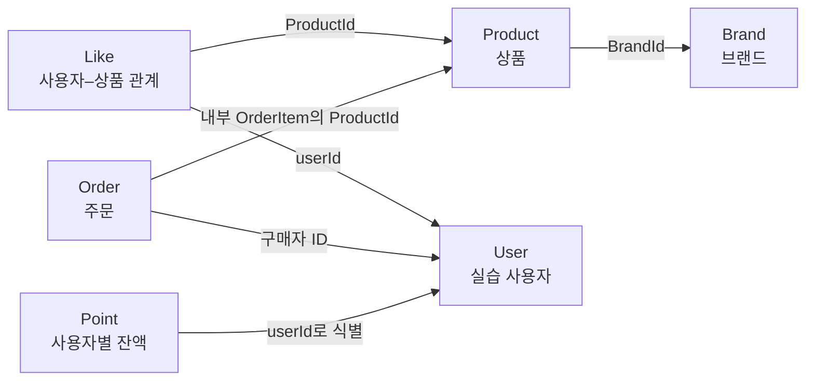
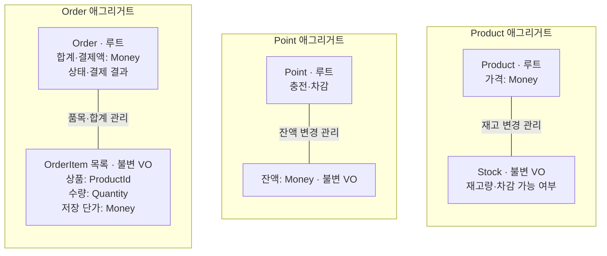

# Week 2 — 커머스 설계

## 1. 버드뷰

고객과 관리자는 하나의 API 서버와 DB를 사용한다. 고객은 상품 조회·좋아요·포인트·주문을 요청하고, 관리자는 브랜드·상품·재고를 관리하고 주문을 조회한다.

실선은 실행 중 요청·호출, 점선은 결과·응답이다. 반환 경로는 일부 축약했다. application이 도메인 행동과 포트 호출을 조율하며, domain은 DB를 직접 호출하지 않는다. 도메인별 Repository와 어댑터가 조회·저장을 함께 처리하며 별도 UseCase·Facade 계층은 두지 않는다.

## 2. 구조와 의존

순수 도메인과 JPA 모델을 분리한 헥사고날 구조를 사용한다. **Controller → ApplicationService → Entity·VO / 출력 포트 → JPA 어댑터**를 기본 구성으로 한다.

| 계층 | 역할 | 허용하는 주요 의존 |
| --- | --- | --- |
| interfaces | 고객·관리자 HTTP 입력·응답, 식별 정보 전달, 오류 매핑 | application |
| application | 도메인별 ApplicationService에서 실행 순서·소유권·트랜잭션 조율, 출력 포트 정의 | domain, Spring 트랜잭션 |
| domain | Entity·VO의 상태와 업무 규칙 | Java, 필요한 도메인 타입 |
| infrastructure | 출력 포트 구현, JPA 저장·조회, 도메인 모델 변환 | application의 포트·결과 모델, domain, JPA |

이 그림은 소스의 의존 방향이다. infrastructure가 application의 출력 포트를 구현한다. application은 infrastructure 구현에, domain은 다른 계층·Spring·JPA·HTTP에 의존하지 않는다. interfaces는 infrastructure를 직접 사용하지 않는다.

### 필요한 구성만 유지

- Controller는 인바운드 어댑터다. 고객·관리자 Controller와 DTO를 구분하되 같은 도메인을 사용한다.
- application은 Brand·Product·Like·Point·Order별 ApplicationService 하나로 시작한다. 공개 메서드가 입력 포트 역할을 하며 별도 UseCase 인터페이스·Facade·Command Handler는 두지 않는다. 입력·반환에 HTTP DTO를 사용하지 않는다.
- Repository는 아웃바운드 포트이고, PersistenceAdapter가 이를 구현해 Spring Data JPA를 사용한다.
- 도메인별 어댑터로 시작한다. ProductPersistenceAdapter처럼 해당 도메인의 Repository를 구현해 조회·저장을 함께 처리한다. 전체 도메인을 통합하거나 메서드마다 어댑터를 나누지 않는다. 단순 모델 변환은 내부 메서드로 처리하고 Mapper 클래스를 일괄 추가하지 않는다.
- 이름·설명까지 모두 VO로 만들거나 단순 규칙을 별도 도메인 서비스로 옮기지 않는다. 기존 경계를 유지하는 내부 리팩터링은 자율적으로 수행하고, 새 계층·입력 인터페이스 도입이나 서비스 책임 경계 변경은 이유와 영향을 설명하고 확인받는다.

| 서비스 | 책임 |
| --- | --- |
| BrandApplicationService | 브랜드 CRUD·조회, 삭제 전 연결 상품 확인 |
| ProductApplicationService | 상품 CRUD·재고 설정·조회 |
| LikeApplicationService | 좋아요 등록·취소·내 목록 |
| PointApplicationService | 충전·잔액 조회 |
| OrderApplicationService | 주문 생성·확정·고객/관리자 조회 |

### 조회·변경 경계

CQRS를 적용하지 않는다. 도메인별 ApplicationService와 Repository가 조회·변경을 함께 처리한다. 별도 조회 전용 포트·서비스를 두지 않는다. 포트는 해당 application 기능의 `port` 패키지에 두며, 도메인 또는 application 타입을 사용한다. JPA Entity·Spring Data `Page`·HTTP DTO는 노출하지 않는다.

고객 상품 목록·상세와 변경 대상은 **ProductRepository**에서 Product로 조회한다. 상품 변경은 Product의 행동을 호출한 뒤 저장한다. 조회 결과 조합은 **ProductApplicationService**에서 수행한다.

1. ProductRepository에서 조건에 맞는 상품 페이지를 조회한다.
2. 페이지의 브랜드 ID 목록으로 BrandRepository에서 브랜드를 일괄 조회한다.
3. 페이지의 상품 ID 목록으로 LikeRepository에서 좋아요 수를 일괄 집계한다.
4. application 결과 DTO로 조합하고 Controller가 HTTP 응답으로 변환한다. 상세 조회도 같은 책임 배치를 따른다.

상품마다 추가 조회하지 않는다. 좋아요 순 정렬은 ProductPersistenceAdapter의 쿼리가 전체 후보에 대해 JOIN·집계·정렬한 뒤 페이지 처리하며 Product 목록을 반환한다. 페이지를 가져온 뒤 application에서 재정렬하지 않는다. SQL의 테이블 참조는 애그리거트 간 객체 연관관계를 뜻하지 않는다.

Product에 응답 조합용 브랜드명·좋아요 수를 추가하지 않고 결과 DTO로 상태를 변경하지 않는다. 브랜드 응답 필드가 바뀌면 브랜드 조회·application 결과 조합·HTTP DTO 등 관련 부분을 수정하며 Product의 재고 규칙은 유지한다. 별도 조회 포트가 줄어드는 대신 결과 조합 코드와 DB 조회 횟수는 늘어날 수 있다.

### 저장과 복원

도메인 객체는 JPA 관리 객체가 아니므로 행동 호출 후 Repository로 명시적으로 저장한다. 복원은 저장된 ID·상태·금액을 되살리는 작업이며 신규 생성·충전·확정 행동을 다시 실행하지 않는다. DRAFT 확정 시 가격 재산정 여부는 복원과 별개로 결정한다.

### AI와 설계 다듬기

- **상황:** 초안의 상품 조회 전용 포트를 바탕으로 AI와 상품 규칙·조회 조합의 책임 중복을 검토하고, 조회 전용 포트와 UseCase·Facade의 필요성을 비교했다.
- **대안:** 역할별 분리는 조회 최적화와 계약 명시에 유리하지만 관리할 구조가 늘고, 통합은 단순하지만 결과 조합 코드와 DB 호출이 증가할 수 있다.
- **선택:** **헥사고날의 경계는 유지하면서 과제에 불필요한 추상화를 줄이기 위해** CQRS와 별도 UseCase·Facade를 두지 않는다. ApplicationService의 공개 메서드는 입력 포트, Repository는 출력 포트로 사용한다. 다섯 도메인과 도메인별 Entity·VO를 유지하고 조회 결과는 application에서 조합한다.
- **재검토:** 실제 조회 성능 문제나 결과 조합의 복잡도가 커지면 전용 조회 구조를 검토한다.

## 3. 도메인 관계

Brand·Product·Like·Point·Order의 도메인과 Entity·VO 역할은 유지한다. Entity·VO는 각 도메인 패키지에 함께 두며 별도의 공통 `entity`·`vo` 패키지로 나누지 않는다.

| 패키지 | 소속 타입 |
| --- | --- |
| domain.brand | Brand, BrandId |
| domain.product | Product, ProductId, Stock |
| domain.like | Like |
| domain.point | Point |
| domain.order | Order, OrderItem, Quantity |

공유 금액 VO는 `domain.common.Money`에 둔다. long의 0 이상 범위를 사용하고 연산 범위 초과를 거절한다.

### 애그리거트 사이의 관계

각 상자는 독립 애그리거트 루트다. User는 실습 사용자 식별 대상이며, 여기서 신규 애그리거트 설계를 추가하지 않는다. 화살표는 호출 순서가 아니라 **ID를 보관하는 쪽 → 참조 대상**이다.

Order와 Product의 연결은 **OrderItem이 상품 ID를 보관한다는 뜻**이며, Order에 Product 객체나 별도 상품 ID 필드를 추가한다는 뜻이 아니다. ID 참조는 JPA 객체 연관관계를 강제하지 않는다.

### 애그리거트 내부의 책임

아래 상자 묶음은 각각 하나의 애그리거트다. 실선은 루트가 관리하는 내부 구성이다. Brand와 Like는 위 관계도에 표시하고, 재고·잔액·주문 품목의 내부 구성만 펼쳤다.

Money는 각 값의 타입이며, 여러 애그리거트가 하나의 잔액 객체를 공유한다는 뜻이 아니다. Point의 최초 생성 시점과 빈 주문 허용 여부는 미정이므로 생성 시점·품목 최소 개수는 도표에서 확정하지 않는다.

| 관계·객체 | 책임과 경계 |
| --- | --- |
| Brand–Product | 독립 애그리거트다. Product는 BrandId로 소속을 표현한다. application이 상품 생성 시 활성 브랜드를 확인하고, 브랜드 삭제 시 미삭제 상품 존재를 확인한다. |
| User–Like–Product | Like는 사용자–상품 관계를 표현한다. DB 유일 제약으로 중복 관계를 막고 좋아요 수는 관계에서 집계한다. |
| Order–OrderItem | Order가 품목·합계·상태·결제 결과를 관리한다. OrderItem은 상품 ID·수량·단가를 담는 불변 VO다. |
| Product–Stock | Product 루트가 재고 변경을 관리한다. Stock VO가 음수 재고와 재고 부족을 거절한다. |
| User–Point | Point는 사용자별 잔액을 관리하며 충전·차감을 수행한다. 잔액은 Money VO로 표현한다. |

Brand·Product·Like·Point·Order는 각각 애그리거트 루트다. 내부 변경은 루트의 행동을 통하며, 다른 애그리거트는 ID로 참조한다. 재고·잔액 연산과 상태 규칙은 Entity·VO가 수행하고 application에 중복 작성하지 않는다. StockRepository·OrderItemRepository는 만들지 않는다.

브랜드·상품은 논리 삭제한다. 미삭제 상품이 연결된 브랜드는 재고가 0이어도 삭제하지 않는다. 상품 수정 시 브랜드를 유지하고, 이미 삭제된 브랜드·상품의 수정과 삭제된 상품의 재고 변경을 거절한다. 기존 주문 품목이 연쇄 삭제되지 않게 한다.

## 4. 대표 흐름

### 좋아요 등록·취소

- 등록: 요청자 확인 → 활성 상품 확인 → 사용자–상품 관계 저장.
- 취소: 요청자 확인 → 자신의 관계 삭제. 삭제된 상품에 남은 좋아요도 취소할 수 있다.
- 내 목록에서는 삭제 상품을 제외한다.

### 포인트 충전 → 주문 확정

1. 요청자의 Point를 조회하고 충전 후 잔액을 저장한다.
2. 상품·수량을 확인하고 품목·단가·합계를 가진 DRAFT 주문을 저장한다. 생성 시 차감하지 않는다.
3. 최초 확정은 본인의 DRAFT 주문에 대해서만 수행하며 상품 사용 가능 여부·재고·잔액을 확인한다. 이미 CONFIRMED인 주문의 재요청 응답은 별도 확정한다.
4. OrderApplicationService가 필요한 Repository를 직접 사용하고 Product·Point·Order의 행동을 호출한다. 변경 저장은 하나의 트랜잭션으로 묶고 실패하면 전체를 롤백한다.
5. 저장된 주문과 잔액을 조회한다. 가격 변경이 없는 경우 10,000원 충전 후 7,000원 결제 시 잔액은 3,000원이다.

트랜잭션의 롤백이 동시 요청의 이중 차감까지 해결하지는 않는다. 동시성 제어 방식은 별도로 확정하며, 이벤트·분산 처리 계층은 추가하지 않는다.

### 관리자 변경 → 고객 조회

1. Controller 진입 전에 Spring Security가 관리자 접근을 확인한다. Controller가 입력을 변환하고 application이 상품을 조회한다.
2. Product의 정보·재고 변경 행동을 호출하고 DB에 저장한다.
3. 고객 조회 시 ProductApplicationService가 ProductRepository·BrandRepository·LikeRepository로 변경된 상품·브랜드·좋아요 수를 조회하고 결과를 조합한다.
4. 고객용 응답으로 반환한다.

## 5. 기본 API 계약

### 공통

- 고객은 `X-USER-ID`로 식별하며 자신의 좋아요·포인트·주문만 다룬다.
- `/api-admin/**`는 ADMIN만 허용하고 일반·미식별 요청은 403으로 거절한다.
- 아래 구현 확정 절을 제외한 신규 API의 상세 DTO·상태 코드·오류 응답 형식은 미정이다.

### 구현 확정: 브랜드 생성·상세

- 관리자 생성은 `POST /api-admin/v1/brands`, 입력은 `{"name":"브랜드"}`이며 설명은 받지 않는다. 이름은 공백이 아닌 1~100자 문자열이다. 성공은 201과 `data.id`, 잘못된 입력은 400이다.
- 고객 상세는 `GET /api/v1/brands/{brandId}`, 성공은 200과 `data.id`, `data.name`이다. 없거나 삭제된 브랜드는 404다.
- 고객은 `X-USER-ID`로 식별한다. 누락·없는 사용자는 401, 숫자로 해석할 수 없는 ID는 400이다. 실습 사용자 테이블에는 테스트 fixture로 사용자를 준비하며 회원가입 API는 추가하지 않는다.
- Controller 응답은 기존 ApiResponse를 사용한다. 오류 코드는 기존 ErrorType의 HTTP reason phrase를 따른다. 관리자 일반·미식별 요청의 403은 과제 Security 설정의 sendError를 사용하며 ApiResponse 본문을 보장하지 않는다.
- BrandApiIntegrationTest에서 실제 DB·MockMvc로 생성→상세, 입력 오류, 고객 식별, 관리자 접근, 없는·삭제된 대상을 검증한다.

### 고객: 브랜드·상품·좋아요

| Method | Path | 입력 | 성공 결과 | 대표 오류 |
| --- | --- | --- | --- | --- |
| GET | `/api/v1/brands/{brandId}` | 브랜드 ID | 활성 브랜드 상세 | 없음·삭제된 브랜드 |
| GET | `/api/v1/products` | 브랜드 필터·페이지·정렬 | 브랜드·좋아요 수 포함 목록 | 잘못된 페이지·정렬·필터 형식 |
| GET | `/api/v1/products/{productId}` | 상품 ID | 브랜드·좋아요 수 포함 상세 | 없음·삭제된 상품 |
| POST | `/api/v1/products/{productId}/likes` | 요청자·상품 ID | 좋아요 관계 등록 | 없음·삭제된 상품; 중복 응답 미정 |
| DELETE | `/api/v1/products/{productId}/likes` | 요청자·상품 ID | 자신의 관계 취소 | 식별 오류; 없는 관계 응답 미정 |
| GET | `/api/v1/users/{userId}/likes` | 요청자·경로 사용자 ID | 자신의 좋아요 목록, 삭제 상품 제외 | 타인 사용자 ID 접근 |

상품 정렬은 `latest`, `price_asc`, `likes_desc`를 지원한다. `latest`의 기준 필드, 동률 보조 정렬, 페이지 기본값·범위는 확정해야 한다.

### 고객: 포인트·주문

| Method | Path | 입력 | 성공 결과 | 대표 오류 |
| --- | --- | --- | --- | --- |
| POST | `/api/v1/points/charge` | 요청자·양의 정수 amount | 충전 후 저장된 잔액 | 누락·타입·0 이하·합산 범위 초과 |
| GET | `/api/v1/points` | 요청자 | 자신의 저장된 잔액 | 식별 오류 |
| POST | `/api/v1/orders` | 상품 ID·수량 목록 | 품목·단가·합계·DRAFT 상태 저장 | 상품 없음·삭제됨, 양수가 아닌 수량 |
| POST | `/api/v1/orders/{orderId}/confirm` | 요청자·주문 ID | CONFIRMED·결제액·결제 결과 저장 | 타인 주문, 상품 사용 불가, 재고·잔액 부족; 재확정 미정 |
| GET | `/api/v1/orders` | 요청자·조회 조건 | 내 주문 목록 | 식별·조회 입력 오류 |
| GET | `/api/v1/orders/{orderId}` | 요청자·주문 ID | 내 주문 품목·금액·상태·결제 결과 | 주문 없음·타인 접근 |

### 관리자

| Method | Path | 입력 | 성공 결과 | 대표 오류 |
| --- | --- | --- | --- | --- |
| GET | `/api-admin/v1/brands` | 조회 조건 | 관리자 브랜드 목록 | 조회 입력 오류 |
| POST | `/api-admin/v1/brands` | 브랜드 정보 | 브랜드 생성 | 유효하지 않은 정보 |
| GET | `/api-admin/v1/brands/{brandId}` | 브랜드 ID | 관리자 브랜드 상세 | 대상 없음 |
| PUT | `/api-admin/v1/brands/{brandId}` | 브랜드 ID·수정 정보 | 브랜드 정보 변경 | 대상 없음·삭제됨·입력 오류 |
| DELETE | `/api-admin/v1/brands/{brandId}` | 브랜드 ID | 브랜드 논리 삭제 | 연결된 미삭제 상품 존재; 반복 삭제 미정 |
| GET | `/api-admin/v1/products` | 조회 조건 | 관리자 상품 목록 | 조회 입력 오류 |
| POST | `/api-admin/v1/products` | 브랜드 ID·상품 정보 | 상품 생성 | 브랜드 없음·삭제됨, 잘못된 상품 정보 |
| GET | `/api-admin/v1/products/{productId}` | 상품 ID | 관리자 상품 상세 | 대상 없음 |
| PUT | `/api-admin/v1/products/{productId}` | 상품 ID·이름·가격 등 허용된 정보 | 브랜드 유지, 상품 정보 변경 | 대상 없음·삭제됨·입력 오류 |
| DELETE | `/api-admin/v1/products/{productId}` | 상품 ID | 상품 논리 삭제 | 대상 없음; 반복 삭제 미정 |
| PUT | `/api-admin/v1/products/{productId}/stock` | 상품 ID·0 이상 최종 수량 | 재고 설정 | 음수·타입 오류, 대상 없음·삭제됨 |
| GET | `/api-admin/v1/orders` | 구매자 등 조회 조건 | 구매자별 품목·상태·금액·결제 결과 목록 | 조회 입력 오류 |
| GET | `/api-admin/v1/orders/{orderId}` | 주문 ID | 관리자 주문 상세·결제 결과 | 주문 없음 |

## 6. 검증 범위와 미정 정책

| 경계 | 확인할 내용 |
| --- | --- |
| domain | 재고 부족, 충전·잔액 범위, 주문 합계·상태; 대표 Stock 규칙에 TDD |
| application | 소유권, 브랜드 삭제 조건, 객체 협력 |
| DB | flush/clear 후 저장·재조회, 좋아요 유일 제약, 전체 롤백 |
| HTTP | 실제 구성 요소를 연결한 정상·대표 오류, 관리자 접근, 고객 소유권 |
| ArchUnit·Checkstyle | 계층 의존과 코드 규칙 |

신규·수정 커머스 테스트는 한글 `@DisplayName`을 사용한다. domain의 모든 경계값을 HTTP에서 반복하지 않는다. 기존 Example은 수정 대상에서 제외한다.

주문 생성 후 가격 변경, 재확정, 중복 품목·좋아요 처리, 0원 결제, 페이지·입력 범위, 관리자 삭제 데이터 조회·반복 삭제, 사용자·Point 초기화, 상세 HTTP 계약과 동시성 전략은 미정이다. 이 설계의 승인을 해당 정책의 승인으로 취급하지 않는다.

### 연속 구현의 임시 정책

사용자 승인에 따라 미정 정책은 필요한 최소 단위로 선택하고 구현·테스트와 함께 기록한다. 상품은 이름 1~100자(공백만 입력 거절), 설명 없음, 가격은 0 이상 long, 재고는 0 이상 int로 정한다. 브랜드·상품 반복 삭제는 성공으로 처리한다.

관리자 브랜드·상품 목록·상세는 삭제 데이터를 포함한다. 목록은 page=0, size=20(1~100)을 기본으로 ID 내림차순 조회한다. 수정·재고 설정·삭제 성공은 200, 생성은 201, 입력 오류 400, 없는 대상 404, 삭제 상태 변경·연결 상품으로 인한 삭제 거절은 409다. 상품 생성과 브랜드 삭제는 브랜드 행 잠금으로 직렬화한다. 상품 변경은 상품 행 잠금을 사용한다.
