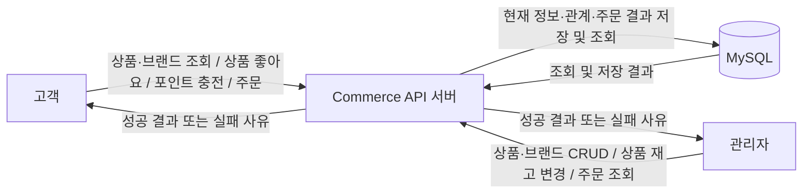
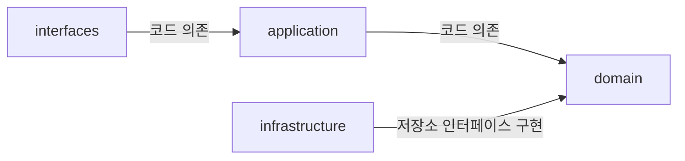
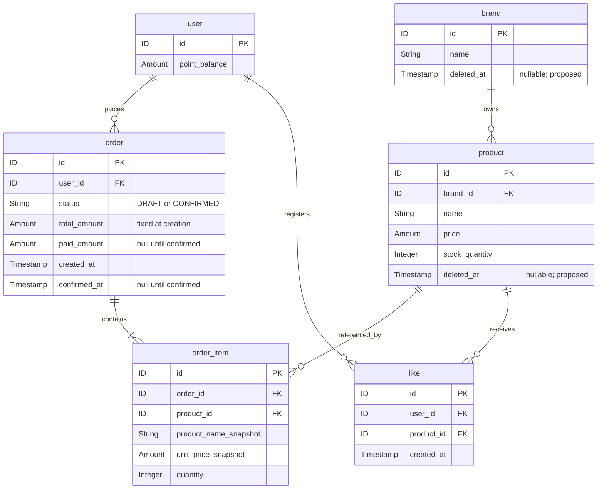
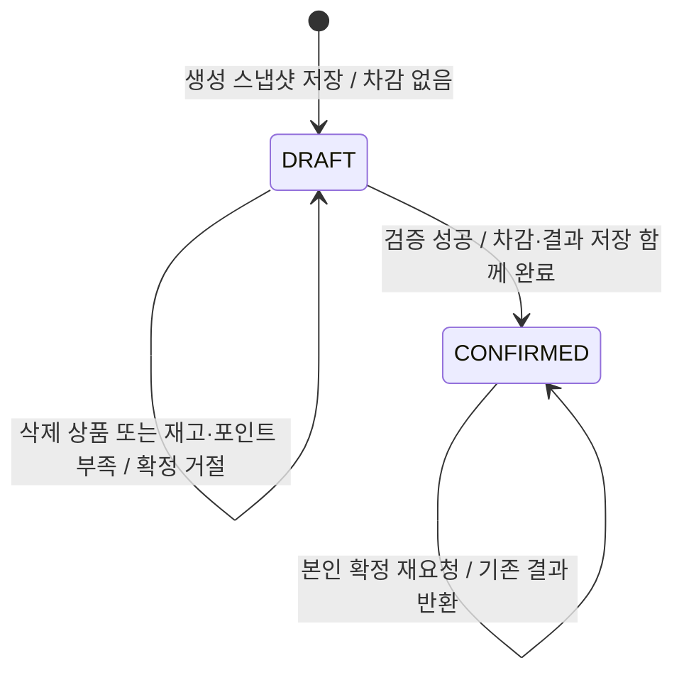

# 커머스 설계 초안

2026-09-17 이벤트 스토밍 대화, 사용자가 전달한 「3. 기본 기능 구현」 과제 명세와 [프로젝트 작업 지침](../../AGENTS.md)을 바탕으로 작성한 설계 초안이다. 이 문서는 버드뷰, 구조와 의존, 도메인 관계와 책임, 세 대표 흐름을 함께 다룬다. API 계약, TDD 계획, 정책 선택과 설계 대안 검토는 별도 문서로 연결한다. 저장 구조는 사용자가 요청한 `user`, `product`, `like`, `brand`, `order`, `order_item`의 6개 테이블을 사용한다.

현재 코드는 예제 기능과 공통 기반을 제공한다. 이 문서의 커머스 엔티티·서비스·API·DDL은 설계안이며 아직 구현되지 않았다. 확정된 업무 규칙, 구현을 위한 설계 제안, 답이 필요한 미정 정책을 구분한다. 아래 계층별 책임과 [API 입력 형태](commerce-api-contract.md)는 설계 제안이다.

## 문서 안내

[API 계약](commerce-api-contract.md), [TDD 계획](commerce-tdd-plan.md), [정책 선택과 설계 검토](commerce-policy-decisions.md)는 각각의 상세 내용을 관리한다. 버드뷰·계층 의존·도메인 관계·세 대표 흐름은 이 문서에 함께 유지한다.

## 확정된 업무 규칙

- 상품은 반드시 하나의 실제 브랜드에 속한다. 재고는 상품별로 관리한다.
- 상품 등록 시 브랜드가 존재하고 삭제되지 않았어야 한다. 삭제된 브랜드에는 새 상품을 등록할 수 없다.
- 상품 수정 시 기존 브랜드를 유지한다. `brand_id`는 변경 가능한 필드에 포함하지 않는다.
- 삭제된 상품·브랜드는 고객 목록에서 제외하고, 상세 조회는 없는 대상 오류로 처리한다. 삭제된 상품·브랜드의 수정과 삭제된 상품의 재고 변경은 거절한다.
- 브랜드에 미삭제 상품이 하나라도 연결되어 있으면 브랜드 삭제를 거절한다. 재고가 0인 미삭제 상품도 포함한다.
- 관리자의 재고 변경은 증감량이 아니라 **0 이상인 최종 수량 설정**이다.
- 주문은 여러 품목과 각 품목의 수량을 가진다.
- 주문 생성 요청의 동일 상품 중복 입력은 **수량 합산 또는 요청 거절**로 처리해야 한다. 두 방식 중 선택은 미정이며, 동일 상품을 여러 주문항목 행으로 저장하는 방식은 허용하지 않는다.
- 생성 시 상품명·단가·수량과 총액을 DRAFT로 저장한다. 재고와 포인트를 차감하지 않는다.
- 삭제 상품이 포함된 새 주문 생성은 거절한다. 이 경우 DRAFT나 주문항목을 저장하지 않는다.
- 고객은 본인의 DRAFT 주문을 확정한다. 이후 상품 가격이 바뀌어도 생성 당시 금액을 사용한다.
- 삭제된 상품이 포함되어 있거나 재고·포인트가 부족하면 확정을 거절하고 DRAFT를 유지한다. 차감은 반영하지 않는다.
- 조건이 충족된 뒤 같은 DRAFT 주문에 다시 확정을 요청할 수 있다. 부족 응답 뒤 API 내부에서 자동 반복하는 의미가 아니다.
- 성공 시 재고·포인트 차감, 결제 결과 저장, CONFIRMED 전환이 함께 반영되어야 한다.
- 본인의 CONFIRMED 주문을 다시 확정 요청하면 저장된 기존 결과를 반환하고 다시 차감하지 않는다. 상품이 이후 삭제되어도 기존 결과를 반환한다.
- 주문이 있어도 상품 삭제를 허용한다. 과거 주문의 상품명과 금액은 보존한다.
- 상품 좋아요는 고객–상품 관계로 저장하고 중복을 방지한다. 자신의 관계만 조회·취소할 수 있다.
- 삭제 상품의 새 좋아요 등록은 거절하고 내 좋아요 목록에서도 제외한다. 남아 있는 본인 관계는 취소할 수 있다.
- 상품별 좋아요 개수를 조회할 수 있어야 한다. 해당 상품에 연결된 `like` 행 수를 조회 결과의 `like_count`로 제공한다.
- 포인트 충전액은 양의 정수이며 **1포인트 = 1원**이다. 누락·타입 오류·표현 범위 초과와 현재 잔액에 더한 결과의 범위 초과를 검사한다. 유효하지 않은 요청은 잔액을 변경하지 않는다.
- 별도 포인트 충전·사용 내역은 현재 범위에 포함하지 않는다. 현재 잔액과 주문의 결제액·결과는 보존한다.
- 상품 목록은 브랜드 필터·페이지 조회와 `latest`, `price_asc`, `likes_desc` 정렬을 지원한다. 상품 목록·상세에는 브랜드 정보와 관계에서 집계한 좋아요 수를 포함한다.
- 고객에게 내 포인트 잔액 조회, 관리자에게 구매자별 주문 목록·상세 조회를 제공한다.
- 사용자 식별은 [1주차 외부 계약](../week1/order-discount-contract.md)의 필수·비어 있지 않은 문자열 `X-USER-ID`를 계승한다. 실습용 사용자는 fixture로 준비할 수 있다. 헤더 문자열과 DB 사용자 행의 연결 방식은 [공통 API 계약](commerce-api-contract.md#공통-입력식별응답)의 설계 제안으로 구분한다.

## 초안에서 제안하거나 미정인 부분

1. **삭제 방식 제안:** 상품과 브랜드에 `deleted_at`을 두어 행을 보존하는 논리 삭제를 제안한다. 기존 `BaseEntity`도 `deletedAt`과 `delete()`를 제공한다. 사용자가 확정한 것은 상품 삭제 허용이라는 업무 정책이며, 저장 방식은 이 초안의 제안이다. 주문항목의 필수 상품 FK는 이 방식을 전제로 한다.
2. **중복 주문 품목 처리 방식 미정:** 과제가 허용하는 합산 또는 거절 중 어떤 방식을 사용할지 정해야 한다. 재고 검증을 상품별 수량으로 수행하는 것과는 별개의 입력 정책이다.

## 시스템 버드뷰

다음 그림의 화살표는 외부 요청과 API 서버의 DB 접근을 나타낸다. 계층 간 코드 의존이나 모든 업무의 실행 순서를 나타내는 그림은 아니다.

| 주체 | 사용하는 기능 | 확인해야 할 경계 |
| --- | --- | --- |
| 고객 | 상품 목록·상세, 브랜드 상세, 상품 좋아요 등록·취소·내 목록, 포인트 충전·잔액 조회, 주문 생성·확정·내 목록·상세 | 본인 API는 `X-USER-ID`로 식별한다. 자신의 주문과 좋아요 관계만 처리하며, DB 사용자 연결·fixture 초기값은 [공통 API 계약](commerce-api-contract.md#공통-입력식별응답)의 제안으로 구분한다. |
| 관리자 | 상품·브랜드 등록·조회·수정·삭제, 상품별 재고 변경, 구매자별 주문 목록·상세 | 관리자 권한을 확인한다. 구체적인 식별 방법은 [공통 API 계약](commerce-api-contract.md#공통-입력식별응답)의 fixture 방식을 제안한다. 재고는 0 이상인 최종 수량으로 설정한다. 브랜드 삭제는 미삭제 상품이 연결되어 있으면 거절한다. |
| API 서버 | 입력과 요청자 확인, 업무 규칙 적용, 저장·조회, 응답 구성 | 금액 산출, 트랜잭션, 중복 처리 및 동시성 제어를 담당한다. |
| DB | 사용자 잔액, 현재 상품·재고, 브랜드, 좋아요 관계, 주문 스냅샷·확정 결과 보존 | 필수 FK와 좋아요 유일 제약을 보장하고 선택한 트랜잭션·갱신 전략을 지원한다. |

브랜드 좋아요와 별도 포인트 이력은 현재 범위에서 제외한다. 제공된 과제 범위에 따라 충전 API로 잔액을 변경하며 외부 결제 시스템을 추가하지 않는다. 고객 브랜드 목록 API는 과제의 필수 목록에 없으므로 [API 계약표](commerce-api-contract.md)에 새 경로를 추가하지 않는다.

## 구조와 코드 의존

현재 예제의 Controller–Facade–Service–Repository 구조를 커머스 기능에 적용하는 제안이다. 아래 표는 프로젝트 내부 계층 사이의 기본 의존 방향이며, 프레임워크·공통 모듈 의존까지 모두 나열한 것은 아니다.

| 계층 | 책임 제안 | 기본 코드 의존 |
| --- | --- | --- |
| `interfaces` | HTTP 요청 해석·형식 검증, 요청자 식별 정보 전달, 성공·실패를 API 응답으로 변환 | `application` |
| `application` | 유스케이스의 처리 순서, 여러 도메인 조율, 트랜잭션 경계, 조회·응답에 필요한 결과 구성 | `domain` |
| `domain` | 엔티티 상태와 업무 규칙, 필요한 도메인 서비스, 저장소 인터페이스 | 다른 세 계층에 의존하지 않음 |
| `infrastructure` | 도메인 저장소 인터페이스 구현, JPA 조회·저장, DB 제약 및 필요한 잠금·조건부 갱신 구현 | `domain`의 인터페이스와 모델 |

화살표는 어떤 계층의 타입을 코드에서 참조하는지를 뜻한다. 실행 시에는 애플리케이션이나 도메인 서비스가 도메인의 저장소 인터페이스를 통해 호출하고, 주입된 `infrastructure` 구현이 JPA와 DB에 접근한다. 이 호출 때문에 `application`이나 `domain`이 구현 클래스에 직접 의존하는 것은 아니다.

현재 [ArchitectureTest](../../apps/commerce-api/src/test/java/com/loopers/architecture/ArchitectureTest.java)는 다음 의존을 금지한다.

- `domain → interfaces / application / infrastructure`
- `application → interfaces / infrastructure`
- `interfaces → infrastructure`

제안한 구조는 이 검사와 일치한다. 다만 현재 검사가 `interfaces → domain`이나 `infrastructure`의 모든 역방향 의존까지 금지하는 것은 아니다. 설계 그림과 실제 검사 범위를 구분하고, 검사 기준을 임의로 강화하거나 완화하지 않는다.

## ERD

`ID`, `Amount` 등은 논리 타입이다. [API 계약](commerce-api-contract.md)은 DB 자원 ID·금액에 `Long`, 수량에 `Integer`를 제안한다. 외부 사용자 식별 문자열은 DB ID와 구분한다. 포인트는 정수이고 1포인트는 1원이며, 금액에 부동소수점은 사용하지 않는다. 곱셈·합산 결과도 표현 범위를 검사한다. 정렬에서 사용하는 상품 생성 시각은 기존 `BaseEntity.createdAt`을 사용하며, 공통 시각 필드는 그림에서 생략했다.

요청한 테이블명은 유지한다. `order`와 `like`는 [MySQL 예약어](https://dev.mysql.com/doc/refman/8.0/en/keywords.html)이므로, 실제 DDL·SQL과 엔티티 매핑에서는 식별자 인용 처리를 적용한다.

`1:N` 관계에서 고객·브랜드·상품 쪽의 연결 건수는 0건일 수 있다. 주문은 하나 이상의 주문항목을 갖는 것으로 제안한다. FK만으로 주문에 항목이 최소 하나 존재한다는 조건이 보장되지는 않으므로 생성 시 검증한다.

`like` 한 행은 반드시 한 사용자와 한 상품을 참조한다.

## 테이블별 역할

| 테이블 | 보존하는 내용과 설계 이유 |
| --- | --- |
| `user` | 현재 포인트 잔액을 고객에 둔다. 별도 포인트 계좌나 이력 테이블을 요구하는 규칙은 현재 없다. 고객 프로필·관리자 권한 구조는 이 ERD에서 확정하지 않는다. |
| `brand` | 상품이 참조하는 브랜드다. 한 브랜드에 여러 상품이 속할 수 있다. 이번 API 입력은 이름만으로 구성하는 안을 제안한다. |
| `product` | 현재 상품명·가격·상품별 재고와 삭제 여부를 관리한다. 상품 수정 시 기존 `brand_id`를 유지한다. 관리자의 재고 변경과 주문 확정은 같은 재고 값을 일관되게 변경해야 한다. |
| `order` | 소유자, 상태, 생성 총액, 확정 결제액과 시각을 보존한다. 현재 범위의 CONFIRMED 주문은 `paid_amount = total_amount`다. |
| `order_item` | 주문별 품목·수량과 생성 당시 상품명·단가를 보존한다. 상품 참조는 현재 판매 가능 여부와 재고 처리에 사용하고, 주문의 이름·가격 표시는 저장한 스냅샷을 사용한다. |
| `like` | 고객–상품의 현재 좋아요 관계다. `user_id`와 `product_id`를 필수로 저장한다. 취소 시 관계 행을 삭제하는 방식을 제안한다. 별도 좋아요 이력은 추가하지 않는다. |

주문에 여러 품목을 담기 위해 주문과 주문항목을 나눈다. 예를 들어 상품 A를 2개, B를 3개 주문하면 주문 1행과 주문항목 2행으로 표현한다. 상품의 현재 이름이나 가격을 바꿔도 해당 주문항목의 스냅샷은 변경하지 않는다.

## 도메인 관계와 책임 배치

다음 책임 배치는 구현을 위한 제안이다. 테이블의 FK 관계가 곧 애그리거트 경계나 모든 엔티티의 직접 객체 참조를 뜻하지는 않는다.

| 도메인 단위 | 엔티티에 둘 책임 제안 | 관계와 조율할 부분 |
| --- | --- | --- |
| `User` | 현재 포인트 잔액과 충전·차감 상태 변경, 양의 정수 충전액 검증, 잔액 합산 범위 초과와 잔액보다 큰 차감 방지 | 주문과 좋아요의 소유자다. 요청의 누락·타입 오류·표현 범위 초과는 `interfaces`에서도 검증한다. 별도 포인트 이력은 추가하지 않는다. |
| `Brand` | 브랜드 자체 정보와 허용된 정보·삭제 상태 변경, 삭제된 브랜드의 정보 수정 방지 | 도메인 서비스가 저장소를 통해 미삭제 상품의 존재를 확인하고, 하나라도 있으면 삭제를 거절한다. 재고 수량으로 삭제 가능 여부를 판단하지 않는다. |
| `Product` | 현재 상품명·가격·삭제 상태, 수정 시 기존 브랜드 유지, 0 이상인 최종 재고 수량 설정, 재고보다 큰 차감과 삭제 상품의 수정·재고 변경 방지 | 등록 시 도메인 서비스가 저장소를 통해 브랜드의 존재와 미삭제 상태를 확인한다. 수정 가능한 필드에서 `brand_id`를 제외한다. 관리자 변경과 주문 확정이 같은 재고를 사용한다. |
| `Like` | 사용자 한 명과 상품 한 개의 좋아요 관계 표현 | 중복 관계는 DB의 `UNIQUE(user_id, product_id)`로도 막는다. 엔티티 한 건의 검사만으로 동시 등록 중복을 보장하지 않는다. |
| `Order`와 `OrderItem` | 주문 소유자·상태·총액, 생성 당시 상품명·단가·수량, 확정 금액·시각 보존과 유효한 상태 전환 | 주문과 항목을 함께 관리하는 경계를 제안한다. 상품 재고와 사용자 잔액은 각 도메인이 관리한다. |

주문 생성의 입력은 상품 ID·수량으로 구성하고, 상품명·단가 조회와 총액 계산은 서버가 수행하는 계약을 제안한다([C09](commerce-api-contract.md#고객-api-계약표)). 요청에 포함된 가격·총액을 결제의 기준으로 신뢰하지 않는다. 조회한 상품 정보로 주문항목 스냅샷을 만들고, 소계와 총액 계산은 주문 도메인에 둔다.

| 책임 주체 | 주문 확정에서 맡을 일 |
| --- | --- |
| `interfaces` | 입력 형식과 요청자 식별 정보를 확인하고 애플리케이션의 확정 기능을 호출한다. 업무 결과를 API 응답으로 변환한다. |
| 애플리케이션 서비스 | 주문 조회와 소유권 검사 연결, 기존 확정 결과 반환 분기, 상품·사용자·주문 도메인의 처리 순서와 하나의 트랜잭션을 조율한다. |
| 주문 엔티티·필요한 도메인 서비스 | 주문 소유자와 상태를 판단하고 생성 스냅샷을 보존한다. 성공 시 확정 금액·시각과 상태를 반영한다. |
| 상품·사용자 엔티티 | 저장된 주문항목의 상품별 수량만큼 재고 차감, 주문 생성 금액의 포인트 차감, 각 상태의 유효성을 지킨다. |
| 저장소 인터페이스와 구현 | 필요한 조회·저장·잠금·조건부 갱신을 제공한다. 선택한 동시성 제어가 적용되도록 모든 관련 변경 경로를 일관되게 구현한다. |

도메인 서비스에는 한 엔티티가 직접 맡기 어려운 업무 판단과 도메인 저장소를 사용하는 처리를 둘 수 있다. 자신의 상태만으로 판단할 수 있는 규칙은 엔티티에 두고, 여러 도메인을 호출하는 순서와 트랜잭션은 애플리케이션 서비스에 두는 방향을 제안한다. 이 배치만으로 미정인 업무 정책을 확정하지 않는다.

## 제약과 계산

- `product.brand_id`는 필수 FK다. 상품 삭제로 주문항목을 연쇄 삭제해서는 안 된다. 이 초안의 논리 삭제 방식에서는 상품 행과 FK가 유지된다.
- 상품 등록은 미삭제 브랜드만 대상으로 하며, 상품 수정 전후의 `brand_id`는 같아야 한다. FK의 존재만으로 브랜드의 미삭제 상태나 수정 시 브랜드 유지가 보장되지는 않으므로 도메인 규칙으로 검증한다.
- `order.user_id`, `order_item.order_id`, `order_item.product_id`, `like.user_id`, `like.product_id`는 필수 FK다. 각 참조 대상은 해당 테이블에 실제로 존재해야 한다.
- `like`에는 상품 좋아요 중복 방지를 위해 `UNIQUE(user_id, product_id)`를 둔다. 각 컬럼이 개별적으로 유일하다는 뜻은 아니다.
- 주문항목의 `quantity > 0`, 재고와 포인트 잔액은 0 이상을 유지한다. 관리자 재고 변경은 요청받은 최종 수량으로 설정하고 음수는 거절한다.
- 충전액은 양의 정수이며 1포인트는 1원이다. 누락·타입 오류·0·음수·소수·표현 범위 초과를 거절하고, 유효한 충전액이라도 `현재 잔액 + 충전액`이 표현 범위를 초과하면 거절한다. 검증 실패 시 잔액을 변경하지 않는다. 자료형은 [API 계약](commerce-api-contract.md)의 `Long`을 제안하며 별도 일일·회당 업무 한도는 추가하지 않는다.
- 가격·주문 단가·총액·결제액은 음수를 허용하지 않는다. 상품 가격은 1원 이상을 제안하며, 0 허용 여부는 [정책 선택표](commerce-policy-decisions.md#구현-전에-확인할-정책-선택)에서 확인한다. 잔액 0과 상품 가격 0의 허용 여부를 혼동하지 않는다.
- 품목 소계는 `unit_price_snapshot * quantity`, 주문의 생성 총액은 해당 소계의 합이다. 품목 소계는 별도 컬럼 없이 계산하는 것을 제안한다.
- 중복 입력 정책은 **합산 또는 거절** 중 선택한다. 합산이면 각 입력 수량을 검증한 뒤 같은 상품의 수량을 더하고 합산 범위를 검사하여 하나의 항목으로 저장한다. 거절이면 동일 상품의 중복 입력이 있는 주문 생성 요청 전체를 거절하고 주문·항목을 저장하지 않는다.
- 어느 입력 정책이든 저장된 주문에는 상품별 항목이 하나만 존재해야 한다. 이를 보장하는 저장 제약으로 `UNIQUE(order_id, product_id)`를 제안한다.
- 재고 검증은 중복 입력 정책과 별개다. **주문 확정 시** 저장된 상품별 주문 수량 전체와 현재 재고를 비교하고 그 수량만큼 차감한다. 합산 방식을 선택해 수량 2와 3을 한 항목의 수량 5로 저장했다면 재고가 5 이상이어야 확정할 수 있다. 생성 시 재고 예약·차감은 하지 않는다.
- DRAFT의 `paid_amount`, `confirmed_at`은 비어 있고, CONFIRMED에서는 확정 값을 갖는다.
- 상품 좋아요 수는 `like`에서 해당 `product_id`의 관계 행을 집계한다. 좋아요 수 캐시 컬럼이나 조회 전용 테이블은 현재 필수로 두지 않는다.
- 상품 상세·내 좋아요 목록·내 주문 목록과 상세는 위 데이터의 조회 결과다. 조회 모델마다 테이블을 하나씩 만들 필요는 없다.

## 좋아요 개수의 표현

`like` 한 행은 한 사용자가 한 상품에 등록한 좋아요 한 건이다. 예를 들어 상품 10에 사용자 세 명의 관계 행이 존재하면 상품 10의 `like_count`는 3이다. 사용자별 관계 행에 상품 전체의 개수를 반복 저장하지 않는다.

| 조회 대상 | 제공하는 값 | 계산 기준 |
| --- | --- | --- |
| 상품 | `like_count` | 해당 `product_id`를 가진 `like` 행 수 |

좋아요가 없으면 0을 제공한다. 등록에 성공해 관계가 하나 추가되면 개수가 1 증가하고, 취소로 관계가 하나 제거되면 1 감소한다. 중복 등록이나 이미 없는 관계의 취소로 개수가 바뀌어서는 안 된다.

이 초안에서는 `like_count`를 집계한 조회 값으로 제공한다. 저장된 개수가 필요한 요구나 성능 근거가 생기면 `product`에 개수 컬럼을 두는 방식을 검토할 수 있다. 그 경우 관계 추가·삭제와 개수 변경의 일관성도 함께 보장해야 한다.

## 대표 흐름

아래 표의 순서는 업무 실행 순서다. 버드뷰의 외부 요청 방향이나 계층의 코드 의존 방향과 구분한다. 외부 입출력은 [API 계약표](commerce-api-contract.md)의 C01~C12, A01~A13을 참조하며, 아직 확정하지 않은 제안은 [정책 선택표](commerce-policy-decisions.md#구현-전에-확인할-정책-선택)에서 관리한다.

### 1. 관리자 변경 → 고객 조회

관리자의 변경 요청과 고객의 조회 요청은 서로 다른 요청이다. 관리자 저장이 성공한 뒤, 고객이 별도로 조회했을 때 현재 정보를 제공하는 흐름이다. 관리자 변경이 고객 조회 API를 자동 호출하는 구조를 전제하지 않는다.

| 순서·주체 | 처리와 책임 제안 | 데이터·성공 결과 | 실패·미정 |
| --- | --- | --- | --- |
| 1. 관리자 변경 요청 | `interfaces`가 A01~A13의 입력을 해석하고 요청자의 관리자 권한 확인을 연결한다. | 아직 데이터 변경 없음 | 식별·권한 구현은 fixture 방식을 제안한다. 권한 오류는 403, 입력 오류는 400을 제안하며 변경을 수행하지 않는다. |
| 2. 상품·브랜드 확인 | `application`과 필요한 도메인 서비스가 대상을 조회한다. 상품 등록 시 브랜드의 존재와 미삭제 상태를 확인하고, 수정·재고 변경 시 삭제 대상을 제외한다. 브랜드 삭제 시에는 연결된 미삭제 상품의 존재를 검사한다. | 변경에 필요한 현재 데이터 확보 | 없는 대상·브랜드는 거절한다. 삭제된 브랜드에 상품 등록, 삭제된 상품·브랜드 수정, 삭제된 상품 재고 변경은 거절한다. 브랜드에 미삭제 상품이 하나라도 연결되어 있으면 재고가 0이어도 삭제를 거절한다. |
| 3. 변경·저장 | 도메인 모델이 허용된 정보를 변경한다. 상품 수정은 기존 `brand_id`를 유지한다. 재고 변경은 요청한 0 이상인 최종 수량으로 설정한다. `application`의 트랜잭션 안에서 저장소가 반영한다. | 상품·브랜드 정보 또는 상품별 재고 갱신, 상품의 기존 브랜드 유지, 성공 결과 응답 | 음수 재고 설정은 거절한다. 미삭제 상품이 없으면 연결 상품에 대한 브랜드 삭제 조건을 통과한다. 삭제 저장 방식은 논리 삭제를 제안한다. 허용되지 않는 변경이나 저장 실패는 부분 반영하지 않는다. |
| 4. 고객의 별도 조회 | `interfaces → application → 저장소`로 조회한다. 상품 목록에서 삭제 대상을 제외하고, 상품·브랜드 상세 조회에서도 미삭제 대상만 조회 모델로 구성한다. | 미삭제 상품·브랜드의 현재 정보, 상품별 집계 `like_count` 제공 | 삭제된 상품·브랜드 상세 조회는 없는 대상 오류로 처리한다. 조회로 재고·잔액·주문 상태를 변경하지 않는다. |

상품 목록·상세와 브랜드 상세는 고객 조회 모델이다. 관리자에는 브랜드 목록도 제공한다. 현재 상품 조회에는 현재 가격을 사용하고, 과거 주문 조회에는 주문항목에 보존한 생성 당시 상품명·단가를 사용한다. 노출 필드는 [응답 데이터 제안](commerce-api-contract.md#응답-데이터와-입력-dto-제안)의 `ProductView`, `BrandView`, `OrderView` 및 관리자 응답 제안을 따른다.

논리 삭제를 선택하더라도 [BaseEntity.delete()](../../modules/jpa/src/main/java/com/loopers/domain/BaseEntity.java)는 삭제 시각만 기록한다. 삭제 데이터의 조회 제외나 `JpaRepository.delete()`의 동작 변경을 자동으로 제공하지 않는다. 상품 등록 대상 브랜드, 고객 상품 목록·상세와 브랜드 상세, 수정 대상, 상품 재고 변경 대상에는 미삭제 조건을 적용해야 한다. 새 주문·좋아요 등록의 대상과 내 좋아요 목록에서도 삭제 상품을 제외한다. 반면 과거 주문 조회는 저장된 스냅샷을 사용하고, 이미 CONFIRMED인 주문의 재요청은 현재 상품 상태를 다시 검증하지 않는다. 남아 있는 본인 좋아요 취소에도 미삭제 상품 조건을 강제하지 않는다.

### 2. 상품 좋아요 등록·취소

| 순서·주체 | 처리와 책임 제안 | 데이터·성공 결과 | 실패·미정 |
| --- | --- | --- | --- |
| 1. 고객 요청 | `interfaces`가 `X-USER-ID`와 경로 productId를 전달한다(C04·C05). 내 목록은 C06의 외부 userId와 요청자를 비교한다. | 아직 데이터 변경 없음 | 누락·잘못된 입력은 400, 다른 사용자의 목록은 404를 제안한다. 타인의 관계를 처리할 수 없다. |
| 2. 대상·관계 확인 | `application`과 도메인 서비스가 등록이면 미삭제 상품의 존재를, 취소이면 본인 관계의 존재를 확인한다. | 등록 가능한 상품 또는 취소할 본인 관계 결정 | 없는 상품·삭제 상품에 새 좋아요를 등록할 수 없다. 취소에는 미삭제 상품 조건을 공통 적용하지 않는다. |
| 3-A. 등록 | 저장소가 본인의 `like` 관계를 생성한다. DB 유일 제약으로 동시 중복도 방지한다. | 관계 한 건 추가, 해당 상품의 집계 개수 1 증가 | 중복 요청은 추가 행이나 추가 개수를 만들지 않는다. 기존 관계를 유지하고 200으로 현재 결과를 반환하는 안을 제안한다. |
| 3-B. 취소 | 상품이 삭제되었어도 남아 있는 본인 관계는 취소한다. 관계 행을 실제로 제거하는 방식을 제안한다. | 관계 한 건 제거, 해당 상품의 집계 개수 1 감소 | 이미 없는 관계를 취소해도 개수는 변하지 않으며 200을 제안한다. 상품 행 자체가 없으면 404다. |
| 4. 결과·목록 조회 | `application`이 결과를 구성하고 저장소는 상품별 관계 수와 내 관계를 조회한다. 내 좋아요 목록에서는 삭제 상품을 제외한다. | 상품별 `like_count`, 미삭제 상품에 대한 본인의 좋아요 목록 제공 | 목록 제외가 관계 삭제를 뜻하지는 않는다. 다른 사용자의 관계를 내 목록이나 취소 대상으로 사용하지 않는다. |

좋아요 수는 관계 행의 집계 결과이며, `like` 한 행에 전체 개수를 저장하지 않는다. 위 취소 제안은 상품의 논리 삭제와 다른 저장 동작이다. 좋아요 취소에 삭제 시각만 기록하는 방식을 적용하려면 재등록과 집계의 제약을 다시 설계해야 한다.

### 3. 포인트 충전 → 주문 생성 → 주문 확정

충전·생성·확정은 각각 별도의 API 요청이다. 기존 잔액이 충분하면 새 충전 요청 없이 주문을 확정할 수 있다. 아래 충전 단계는 잔액을 확보하는 경로를 표현하며, 매 주문 직전에 충전을 강제하지 않는다. 외부 결제 연동과 충전 이력 테이블을 추가하지 않는다.

| 요청·주체 | 처리와 책임 제안 | 상태·데이터와 성공 결과 | 실패·미정 |
| --- | --- | --- | --- |
| 포인트 충전 / 고객 | `interfaces`가 누락·타입·표현 범위를 검사 → 사용자 조회 → 양의 정수 충전액과 잔액 합산 범위 검증 → `User` 잔액 증가 → 저장·응답(C07) | 1포인트 = 1원 기준으로 고객의 현재 `point_balance` 증가. C08로 저장된 잔액 조회 | 입력 오류는 400, 잔액 합산 초과는 409를 제안하며 잔액을 변경하지 않는다. fixture 사용자·초기 잔액과 반복 충전 처리는 [정책 선택표](commerce-policy-decisions.md#구현-전에-확인할-정책-선택)의 제안으로 구분한다. |
| 주문 생성 / 고객 | 상품 ID·수량 전달 → 삭제 상품 여부·수량 검증 및 중복 입력 정책 적용 → 서버가 상품명·단가 조회 → 주문 도메인이 소계·총액 계산 → 주문과 항목 저장 | 상품명·단가·수량·총액을 DRAFT로 저장한다. 재고·포인트 차감은 없다. | 삭제 상품이 포함되면 생성 전체를 거절한다. 중복 입력은 합산 또는 거절 중 선택해야 한다. 서버 산출 입력 계약은 설계 제안이다. 생성에 실패하면 주문·항목을 저장하지 않는다. |
| 주문 확정 / 고객 | 소유권 확인 → 상태 분기 → DRAFT 상품·재고·잔액 검증 → 각 도메인의 상태 변경 → 저장·응답 | 생성 당시 금액으로 포인트 차감, 저장된 상품별 주문 수량만큼 재고 차감, 결제액·확정 시각 저장, CONFIRMED 전환 | 삭제 상품·재고 부족·포인트 부족이면 전체 확정을 거절한다. DRAFT를 유지하고 어떤 차감도 반영하지 않는다. |
| 확정 재요청 / 고객 | 소유권 확인 후 이미 CONFIRMED이면 저장된 결과를 구성한다. | 기존 품목·수량·금액·상태·결제액 반환, 추가 차감 없음 | 타인의 주문은 기존 결과도 반환하지 않는다. 현재 가격·재고·상품 삭제 여부를 다시 검증하지 않는다. |

**확정 요청의 실행 순서**는 다음과 같다.

1. 요청한 고객의 주문인지 확인한다.
2. 이미 CONFIRMED라면 저장된 주문항목과 확정 결과를 반환한다. 현재 상품의 가격·재고·삭제 여부로 다시 검증하지 않는다.
3. DRAFT라면 삭제된 상품 포함 여부와 현재 재고·포인트를 확인한다.
4. 생성 시 저장한 금액으로 재고·포인트 차감과 확정 결과 저장을 함께 처리한다. 실패 시 일부만 반영되는 상태를 남기지 않는다.
5. 부족 또는 삭제로 거절하면 DRAFT를 유지한다. 삭제는 재고 부족과 다른 사유이며, 재고 증가만으로 삭제 상품의 판매가 허용되지는 않는다.

동시에 여러 요청이 들어와도 중복 확정·재고 초과 판매·잔액 초과 사용이 발생하지 않아야 한다. 이는 ERD의 선이나 상태 컬럼만으로 보장되지 않으며 트랜잭션과 동시성 제어를 구현할 때 검증한다. 여러 품목에서 하나라도 조건을 만족하지 않으면 주문 전체 확정을 거절한다.

위 그림은 주문 상태 전이만 나타낸다. 모든 확정 요청은 소유권 확인을 먼저 거친다. DRAFT 유지 후의 재시도는 조건이 달라진 뒤 고객이 같은 주문에 새 요청을 보내는 의미이며, 부족 응답 뒤 API 내부에서 자동 반복하지 않는다.

원자성 경계는 **한 번의 주문 확정 요청 안의 재고·포인트·주문 결과 변경**이다. 이전에 성공한 별도 포인트 충전까지 확정 실패로 취소하지 않는다. 단순히 트랜잭션을 선언하는 것만으로 모든 동시 요청의 중복·초과 사용이 막히는 것은 아니므로, 주문 확정·포인트 충전·관리자 재고 변경·상품 삭제 경로가 함께 지켜야 할 잠금 또는 조건부 갱신 전략을 구현 전에 선택한다.

## 관련 문서와 범위

쿠폰 적용은 별도 [주문 할인 계약](../week1/order-discount-contract.md)에서 다루고 있다. 현재 대화에서 확정한 범위의 ERD에는 쿠폰 테이블을 통합하지 않았으며, 쿠폰을 포함하게 되면 주문 금액 구조와 확정 규칙을 함께 검토한다.
