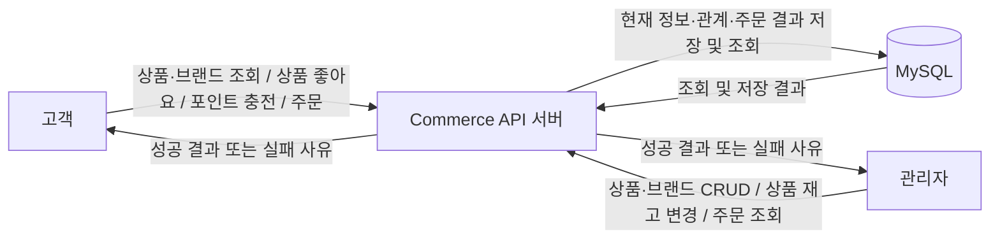
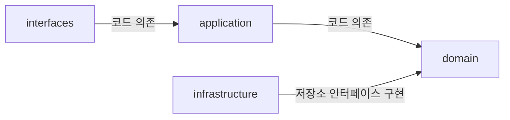
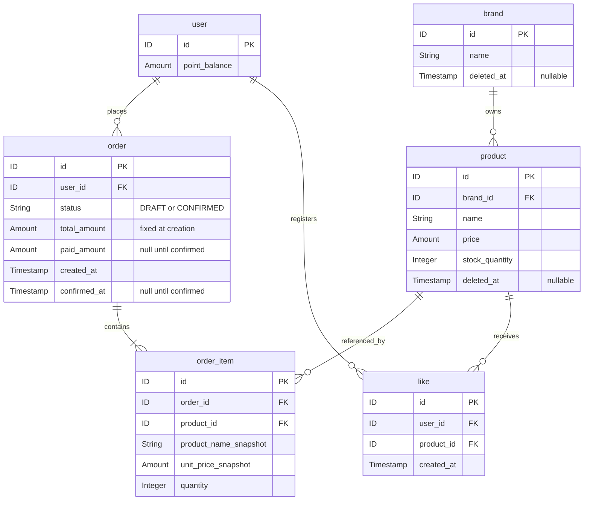
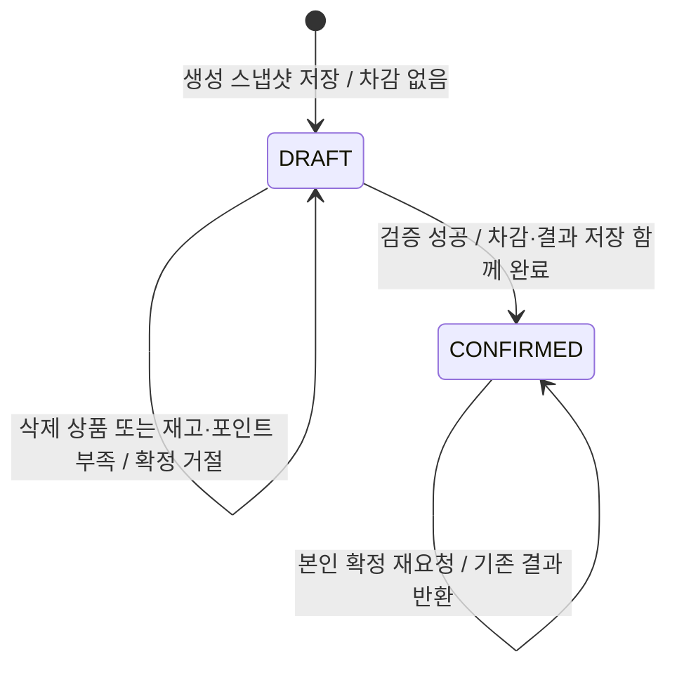

# 커머스 설계 초안

2026-09-17 이벤트 스토밍 대화, 사용자가 전달한 「3. 기본 기능 구현」 과제 명세와 [프로젝트 작업 지침](../../AGENTS.md)을 바탕으로 작성한 설계 초안이다. 이 문서는 버드뷰, 구조와 의존, 도메인 관계와 책임, 세 대표 흐름을 함께 다룬다. API 계약, TDD 계획, 정책 선택과 설계 대안 검토는 별도 문서로 연결한다. 저장 구조는 사용자가 요청한 `user`, `product`, `like`, `brand`, `order`, `order_item`의 6개 테이블을 사용한다.

현재 구현은 고객 12개·관리자 13개의 **25개 API를 JPA/MySQL까지 연결**한다. 기능별 HTTP·도메인·저장·동시성 테스트가 통과했으며, 최종 전체 검사와 운영 스키마의 증거는 [완료 체크리스트](commerce-completion-checklist.md)에 별도로 기록한다. 정책 승인, 개별 테스트 통과, 전체 완료를 구분한다.

| 실제 구현 | 책임과 검증 기록 |
| --- | --- |
| 브랜드 | BrandName·Brand의 이름/삭제 상태, BrandDeletionService의 미삭제 상품 존재 조건, 관리자 CRUD와 공유 브랜드 잠금. [관리자 브랜드 기록](commerce-tdd-admin-brand-http-log.md) |
| 상품 | Product가 ProductStock을 내부 소유하고 이름·가격·삭제 상태를 관리한다. JPA 저장, 관리자 변경, domain 소유 ProductSummary의 집계·정렬·페이지 조회. [상품 기록](commerce-tdd-product-log.md) |
| 사용자·포인트·좋아요 | 단일 fixture 매핑에서 초기 DB 사용자를 준비하고 User가 잔액을 관리한다. 좋아요는 유일 관계·실제 삭제·본인 조회이며 사용자→상품 순서로 잠근다. [포인트·좋아요 기록](commerce-tdd-point-like-log.md) |
| 주문 | OrderQuantities의 합산, Order/OrderItem의 생성 스냅샷·금액·소유권·확정 상태, OrderService의 단일 트랜잭션과 공통 잠금 순서. [주문 기록](commerce-tdd-order-log.md) |
| HTTP 경계 | StrictInput의 형식 검사, AdminBoundaryConfig의 Spring Security·CSRF 검사와 AdminRequester의 역할 변환, CommerceErrors의 업무/프레임워크 오류 변환. 기존 Example 관찰 계약은 유지한다. |
| 저장 경계 | domain 저장소 약속을 infrastructure의 Spring Data JPA·EntityManager 구현이 제공한다. 새 엔티티는 직접 JPA 매핑과 자체 감사 필드를 사용하며 기존 BaseEntity를 개편하지 않는다. |

초기 재고·식별·브랜드·수량의 작은 Red→Green→Refactor 기록은 AGENTS의 문서 목록에 보존한다. 운영 스키마는 기능 구현 후 별도 빈 MySQL에서 수동 SQL을 적용하고 JPA validate로 검사한다. 적용 방법과 완료 범위는 [스키마 안내](commerce-schema-operations.md)를 따른다.

## 문서 안내

[API 계약](commerce-api-contract.md), [TDD 계획](commerce-tdd-plan.md), [정책 선택과 설계 검토](commerce-policy-decisions.md)는 각각의 상세 내용을 관리한다. 버드뷰·계층 의존·도메인 관계·세 대표 흐름은 이 문서에 함께 유지한다.

## 확정된 업무 규칙

- 상품은 반드시 하나의 실제 브랜드에 속한다. 재고는 상품별로 관리한다.
- 상품 등록 시 브랜드가 존재하고 삭제되지 않았어야 한다. 삭제된 브랜드에는 새 상품을 등록할 수 없다.
- 상품 수정 시 기존 브랜드를 유지한다. `brand_id`는 변경 가능한 필드에 포함하지 않는다.
- 삭제된 상품·브랜드는 고객 목록에서 제외하고, 상세 조회는 없는 대상 오류로 처리한다. 삭제된 상품·브랜드의 수정과 삭제된 상품의 재고 변경은 거절한다.
- 브랜드에 미삭제 상품이 하나라도 연결되어 있으면 브랜드 삭제를 거절한다. 재고가 0인 미삭제 상품도 포함한다.
- 관리자의 재고 변경은 증감량이 아니라 **0 이상인 최종 수량 설정**이다.
- 주문은 여러 품목과 각 품목의 수량을 가진다.
- 주문 생성 요청의 동일 상품 중복 입력은 **상품별 수량 합산**으로 처리한다. 각 입력 수량의 양수 조건과 합산 범위를 검사하고 상품별 한 주문항목으로 저장한다.
- 생성 시 상품명·단가·수량과 총액을 DRAFT로 저장한다. 재고와 포인트를 차감하지 않는다.
- 삭제 상품이 포함된 새 주문 생성은 거절한다. 이 경우 DRAFT나 주문항목을 저장하지 않는다.
- 고객은 본인의 DRAFT 주문을 확정한다. 이후 상품 가격이 바뀌어도 생성 당시 금액을 사용한다.
- 삭제된 상품이 포함되어 있거나 재고·포인트가 부족하면 확정을 거절하고 DRAFT를 유지한다. 차감은 반영하지 않는다.
- 조건이 충족된 뒤 같은 DRAFT 주문에 다시 확정을 요청할 수 있다. 부족 응답 뒤 API 내부에서 자동 반복하는 의미가 아니다.
- 성공 시 재고·포인트 차감, 결제 결과 저장, CONFIRMED 전환이 함께 반영되어야 한다.
- 본인의 CONFIRMED 주문을 다시 확정 요청하면 저장된 기존 결과를 반환하고 다시 차감하지 않는다. 상품이 이후 삭제되어도 기존 결과를 반환한다.
- 주문이 있어도 상품 삭제를 허용한다. 과거 주문의 상품명과 금액은 보존한다.
- 상품 좋아요는 고객–상품 관계로 저장하고 중복을 방지한다. 자신의 관계만 조회·취소할 수 있다.
- 삭제 상품의 새 좋아요 등록은 거절하고 내 좋아요 목록에서도 제외한다. 남아 있는 본인 관계는 취소할 수 있다.
- 상품별 좋아요 개수를 조회할 수 있어야 한다. 해당 상품에 연결된 `like` 행 수를 조회 결과의 `like_count`로 제공한다.
- 포인트 충전액은 양의 정수이며 **1포인트 = 1원**이다. 누락·타입 오류·표현 범위 초과와 현재 잔액에 더한 결과의 범위 초과를 검사한다. 유효하지 않은 요청은 잔액을 변경하지 않는다.
- 별도 포인트 충전·사용 내역은 현재 범위에 포함하지 않는다. 현재 잔액과 주문의 결제액·결과는 보존한다.
- 상품 목록은 브랜드 필터·페이지 조회와 `latest`, `price_asc`, `likes_desc` 정렬을 지원한다. 상품 목록·상세에는 브랜드 정보와 관계에서 집계한 좋아요 수를 포함한다.
- 고객에게 내 포인트 잔액 조회, 관리자에게 구매자별 주문 목록·상세 조회를 제공한다.
- 고객 본인 데이터 API의 사용자 식별은 [1주차 외부 계약](../week1/order-discount-contract.md)의 필수·비어 있지 않은 문자열 `X-USER-ID`를 계승한다. 실습 fixture는 한 곳에서 `alice → 1/CUSTOMER`, `bob → 2/CUSTOMER`, `admin → 3/ADMIN`으로 연결한다. 대소문자와 앞뒤 공백을 구분하는 원문 일치로 비교하며 trim·소문자 변환을 하지 않는다. C01·C02·C03은 사용자 헤더 없이 공개 조회하며 전달된 헤더도 무시한다. 세 fixture 사용자의 초기 잔액은 0이고, C06 경로·관리자 주문 필터의 userId는 외부 식별 문자열이다. HTTP 응답은 승인된 [공통 API 계약](commerce-api-contract.md#공통-입력식별응답)을 따른다.

2026-09-18 추가로 확정한 정책은 다음과 같다.

- 상품·브랜드는 `deleted_at`을 남기는 논리 삭제를 사용한다. 좋아요 취소는 사용자–상품 관계 행을 실제로 삭제한다.
- 가격은 1원 이상, 상품명·브랜드명은 앞뒤 공백 제거 후 1~100자다. 브랜드명·상품명 길이는 모두 Unicode 코드 포인트 기준이다.
- 중복 좋아요·없는 관계 취소·이미 삭제된 대상 재삭제는 추가 변경 없이 200을 반환한다.
- 상품 수정은 이름·가격만 변경하며 관리자 조회는 삭제 행도 포함한다.
- page/size 기본값은 0/20, size 범위는 1~100이다. 상품 정렬 동률은 ID 내림차순이며, 없는/삭제 브랜드 필터는 빈 목록을 반환한다.
- 충전·주문 생성의 각 성공 요청은 새 충전·새 주문이다. 주문 확정 재요청의 기존 결과 반환 규칙과 구분한다.
- 자원 ID는 `Long` 범위, 재고·주문 수량은 `Integer` 범위를 사용한다. 금액·포인트는 원 단위 정수 `Long`/`BIGINT`이며 최댓값은 `Long.MAX_VALUE`다. 덧셈·곱셈의 범위 초과를 검출한다.
- 경합하는 변경은 행 잠금 후 검증·변경·저장을 기본 전략으로 한다. 변경 트랜잭션은 READ_COMMITTED이며 필요한 행을 주문 → 사용자 → 브랜드 ID 오름차순 → 상품 ID 오름차순으로 잠근다. 상품 등록·변경과 브랜드 삭제는 브랜드 잠금을 공유하고 좋아요 변경은 상품을 잠근다. 잠금 타임아웃 3초, 서버 자동 재시도 없음, 교착·타임아웃은 409 CONCURRENT_MODIFICATION이다.
- 관리자 API는 권한 확인 후 입력 형식을 검증한다. 권한과 입력 형식이 모두 잘못되면 권한 오류를 우선하며, 승인한 HTTP 상태·코드·메시지로 응답한다.
- 고객 브랜드 상세 C01은 P11, 나머지 API의 입력·응답·목록 정렬과 커머스 405·415·406 프레임워크 오류는 P12로 확정했다. 엄격한 JSON 입력을 적용하고 기존 Example API의 관찰 계약을 유지한다.

## 초안에서 제안하거나 미정인 부분

1. **저장 구현:** JPA를 유지한다. Brand는 직접 JPA 매핑·BaseEntity 미상속으로 저장·조회를 구현했다. User·Product·ProductLike·Order·OrderItem도 직접 JPA 매핑을 사용하며 상품 존재 조회와 P13의 잠금 구현을 연결했다. 비교한 구조 대안은 구현 책임 배치의 참고이며 업무 계약의 미확정을 뜻하지 않는다.
2. **승인과 구현의 구분:** 응답 필드·HTTP 상태·오류 코드·메시지, 금액 표현, 상품명 길이, 초기 잔액, 공개 조회와 잠금 정책은 [정책 선택표](commerce-policy-decisions.md#구현-전에-확인할-정책-선택)의 후속 묶음 승인으로 확정했다. 이 절의 기존 제목은 링크를 유지한다. 추가 운영 수동 DDL도 P14 순서에 따라 기능 구현 후 작성·검증했다. 실제 완료 증거는 [완료 체크리스트](commerce-completion-checklist.md)에 기록한다.

## 시스템 버드뷰

다음 그림의 화살표는 외부 요청과 API 서버의 DB 접근을 나타낸다. 계층 간 코드 의존이나 모든 업무의 실행 순서를 나타내는 그림은 아니다.



| 주체 | 사용하는 기능 | 확인해야 할 경계 |
| --- | --- | --- |
| 고객 | 상품 목록·상세, 브랜드 상세, 상품 좋아요 등록·취소·내 목록, 포인트 충전·잔액 조회, 주문 생성·확정·내 목록·상세 | 본인 API는 `X-USER-ID`로 식별한다. 자신의 주문과 좋아요 관계만 처리한다. DB 사용자 연결은 P03의 확정 fixture와 원문 비교 규칙을 사용하며 초기 잔액은 0이다. |
| 관리자 | 상품·브랜드 등록·조회·수정·삭제, 상품별 재고 변경, 구매자별 주문 목록·상세 | Spring Security 인증 주체의 ADMIN 역할을 확인하며 일반·미식별 요청은 403으로 거절한다. MockMvc 역할과 쓰기 요청의 csrf()로 검증한다. 구체 HTTP 오류 응답은 승인된 [공통 API 계약](commerce-api-contract.md#공통-입력식별응답)을 따른다. 재고는 0 이상인 최종 수량으로 설정한다. 브랜드 삭제는 미삭제 상품이 연결되어 있으면 거절한다. |
| API 서버 | 입력과 요청자 확인, 업무 규칙 적용, 저장·조회, 응답 구성 | 금액 산출, 트랜잭션, 중복 처리 및 동시성 제어를 담당한다. |
| DB | 사용자 잔액, 현재 상품·재고, 브랜드, 좋아요 관계, 주문 스냅샷·확정 결과 보존 | 필수 FK와 좋아요 유일 제약을 보장하고 선택한 트랜잭션·갱신 전략을 지원한다. |

브랜드 좋아요와 별도 포인트 이력은 현재 범위에서 제외한다. 제공된 과제 범위에 따라 충전 API로 잔액을 변경하며 외부 결제 시스템을 추가하지 않는다. 고객 브랜드 목록 API는 과제의 필수 목록에 없으므로 [API 계약표](commerce-api-contract.md)에 새 경로를 추가하지 않는다.

## 구조와 코드 의존

현재 예제의 Controller–Facade–Service–Repository 구조를 커머스 기능에 적용한다. 다음은 레이어드 아키텍처와 DIP를 이 프로젝트에서 해석하는 기준이다. 커머스 기능별 클래스 배치는 설계 제안이며, 예시 코드는 구현 완료를 뜻하지 않는다.

### 패키지·계층·모듈

세 가지는 서로 다른 경계다.

| 구분 | 나누는 기준 | 경계의 효과와 비용 |
| --- | --- | --- |
| 패키지 | 클래스의 이름과 위치 | 폴더를 나누는 것만으로 계층 의존을 차단하지 않는다. 접근 제어와 의존 검사도 함께 고려한다. |
| 계층 | HTTP 처리·유스케이스·업무 규칙·저장 구현의 책임 | 어떤 타입에 의존할 수 있는지 정한다. 역할 이름만 붙여도 책임이 자동으로 분리되지는 않는다. |
| 모듈 | 빌드와 의존 설정 | 컴파일 의존을 더 강하게 제한할 수 있지만 빌드 설정과 모듈 사이 공개 API 관리 비용이 생긴다. |

현재 `apps/commerce-api`는 하나의 애플리케이션 모듈이며, 내부의 네 계층은 패키지로 나뉜다. `modules/jpa` 같은 공통 모듈과 도메인 계층은 서로 다른 구분이다. 기능별로 새 빌드 모듈을 만드는 일은 이번 문서 보완에 포함하지 않는다.

starter의 Layer-first 구조에서는 계층별 패키지 아래에 기능을 배치한다. 아래는 커머스 기능이 추가될 위치의 예시이며 화살표는 소스의 타입 의존을 뜻한다.

```text
interfaces/api/product   → application/product → domain/product
interfaces/api/admin/... → application/...
infrastructure/product   → domain/product
```

### 계층별 책임과 허용 의존

아래 표는 프로젝트 내부 계층 사이의 기본 방향이다. 프레임워크·공통 모듈 의존까지 모두 나열한 것은 아니다.

| 계층 | 책임 | 기본 코드 의존 | 직접 의존하지 않을 것 |
| --- | --- | --- | --- |
| `interfaces` | HTTP 요청 해석·형식 검증, 고객·관리자 식별 정보 전달, 성공·실패의 HTTP 응답 변환 | `application` | `infrastructure` 저장 구현 |
| `application` | 도메인의 행동·저장 약속을 이용한 유스케이스, 여러 도메인 조율, 트랜잭션 경계, 조회 결과 구성 | `domain` | controller DTO, `infrastructure` 구현 |
| `domain` | 엔티티 상태와 업무 규칙, 필요한 도메인 서비스, 저장소 인터페이스 | 다른 세 계층에 의존하지 않음 | `interfaces`, `application`, `infrastructure` |
| `infrastructure` | 도메인 저장소 인터페이스 구현, JPA 조회·저장, DB 제약 및 필요한 잠금·조건부 갱신 구현 | `domain`의 인터페이스와 모델 | HTTP 응답 정책. 업무 규칙의 중복 구현도 피한다. |



상품·브랜드·좋아요 수를 조합하는 조회 application이 있어도 된다. 단순한 조회 결과 조합을 반드시 도메인 서비스로 옮기지 않는다. application은 자신이 소유한 결과 타입을 반환하고, `interfaces`가 이를 HTTP 응답 DTO로 변환한다.

### DIP: 저장 기술과 업무 정책의 의존 분리

**DIP(Dependency Inversion Principle)**는 높은 수준의 업무 정책이 저장 기술의 세부 구현에 끌려가지 않도록, 양쪽이 정책에 필요한 추상화에 의존하게 하는 원칙이다. 이 프로젝트에서는 업무에 필요한 저장 약속을 `domain`에 두고 JPA 구현을 `infrastructure`에 둔다.

```java
// domain/product: 상품 조회에 필요한 저장 약속의 구조 예시
public interface ProductRepository {
    Product find(long productId);
}

// application/product: ProductRepository를 주입받아 사용한다.
// infrastructure/product: JpaProductRepository가 이 약속을 구현한다.
```

위 `Product find(long)`는 구조 설명용 예시다. 실제 [ProductRepository](../../apps/commerce-api/src/main/java/com/loopers/domain/product/ProductRepository.java)는 save/findById/lockById, 잠금 순서를 위한 브랜드 ID 조회, 미삭제 상품 존재 조회를 제공한다. 집계·페이지 조회는 domain의 ProductQueryRepository/ProductSummary로 분리하며 infrastructure가 JPQL로 구현한다. 실제 starter에서는 [ExampleRepository](../../apps/commerce-api/src/main/java/com/loopers/domain/example/ExampleRepository.java)와 [ExampleRepositoryImpl](../../apps/commerce-api/src/main/java/com/loopers/infrastructure/example/ExampleRepositoryImpl.java)이 인터페이스와 저장 구현의 역할을 보여준다.

실행 시에는 애플리케이션이나 도메인 서비스가 저장소 인터페이스를 호출하고, 주입된 `infrastructure` 구현이 JPA와 DB에 접근한다. **런타임 호출 방향과 소스의 타입 의존 방향은 다르다.** 실행 중 JPA 구현이 호출되더라도 `application`이나 `domain`의 소스가 그 구현 클래스 이름을 알 필요는 없다.

테스트에서는 같은 인터페이스를 구현한 **테스트용 저장소(fake)**에 상품을 미리 넣고, 요청한 ID에 맞는 값을 돌려주도록 할 수 있다. 이 방법으로 DB 없이 유스케이스를 검증한다. fake도 합의한 저장소 계약을 따라야 하며, JPA 조회·DB 유일 제약·동시성은 실제 저장 구현의 통합 테스트로 따로 확인한다.

인터페이스가 `domain`에 있어도 입력이나 반환 타입이 controller DTO라면 `domain → interfaces` 의존이 생긴다. 클래스 이름과 폴더뿐 아니라 **메서드의 입력·출력 타입**도 확인한다. `application` 소유 타입을 도메인 저장소 계약에 넣는 것도 역방향 의존이다. 모든 클래스에 인터페이스를 붙이는 것이 DIP의 목적은 아니다. 현재 `ProductStock`처럼 자신의 수량만 다루는 객체에는 저장소 인터페이스가 필요하지 않다.

### JPA annotation과 모델 분리의 비용

starter의 [ExampleModel](../../apps/commerce-api/src/main/java/com/loopers/domain/example/ExampleModel.java)에는 `@Entity`, `@Table` 같은 JPA annotation이 있다. 저장소 인터페이스를 분리하는 선택과 도메인 모델의 모든 JPA 의존을 제거하는 선택은 구분한다.

| 선택 | 얻는 점 | 비용·주의점 |
| --- | --- | --- |
| 도메인 모델에 JPA 매핑 유지 | 모델 간 변환 없이 기존 starter 구조에서 구현 가능 | 도메인 모델이 JPA 매핑과 영속성 제약의 영향을 받음 |
| 별도 persistence 모델로 분리 | 도메인 모델을 JPA 매핑 변경에서 더 분리할 수 있음 | 모델·매핑 코드가 늘고, ID·상태·변환 규칙을 함께 관리하고 검증해야 함 |

Brand와 새 커머스 엔티티에는 직접 JPA 매핑을 선택하고 BaseEntity를 상속하지 않았다. 기존 public delete/restore 경로와 삭제 시각의 중복을 피하면서 Brand의 삭제 행동을 유지한다. infrastructure의 `BrandNameConverter(autoApply = true)`를 통해 변환하므로 domain이 해당 구현 클래스를 참조하지 않는다. 이 선택을 다른 도메인의 매핑 방식이나 BaseEntity 전체 개편으로 확대하지 않는다.

JPA annotation이 있다는 이유만으로 모든 모델을 분리하지 않는다. 정한 패키지 의존을 지키는 일과 프레임워크 의존을 모두 제거하는 일은 다른 선택이다. 별도 모델 분리가 필요한 근거가 생기면 비용을 비교하며, 현재 검사 기준을 곧바로 ‘모든 프레임워크 금지’로 넓히지 않는다.

### Layer-first와 Feature-first

| 구성 | 찾기 쉬운 것 | 함께 고려할 비용 |
| --- | --- | --- |
| Layer-first | `domain/product`, `application/product`처럼 계층별 책임과 같은 종류의 코드 | 한 기능을 고칠 때 여러 계층 폴더를 오감 |
| Feature-first | `product/domain`, `product/application`처럼 한 기능의 관련 코드 | 기능 사이의 공개 경계와 의존을 별도로 정해야 함 |

현재 프로젝트의 Layer-first 구성을 유지한다. 폴더 구성만 바꿔도 실제 의존이 정리되는 것은 아니다. 어느 구성이든 무엇에 의존해도 되는지와 그 이유를 설명할 수 있어야 한다.

### 현재 ArchUnit 검사의 범위

현재 [ArchitectureTest](../../apps/commerce-api/src/test/java/com/loopers/architecture/ArchitectureTest.java)는 다음 의존을 금지한다.

- `domain → interfaces / application / infrastructure`
- `application → interfaces / infrastructure`
- `interfaces → infrastructure`

위 구조는 이 검사와 일치한다. 다만 현재 검사가 `interfaces → domain`이나 `infrastructure`의 모든 역방향 의존까지 금지하는 것은 아니다. JPA annotation을 금지하거나 업무 규칙 중복을 판정하는 검사도 아니다. 설계 그림과 실제 검사 범위를 구분하고, 검사 기준을 임의로 강화하거나 완화하지 않는다.

## ERD

`ID`, `Amount` 등은 논리 타입이다. [API 계약](commerce-api-contract.md)은 자원 ID에 `Long` 범위, 수량에 `Integer` 범위를 확정했다. 금액·포인트는 원 단위 정수 `Long`/`BIGINT`와 `Long.MAX_VALUE` 상한으로 확정했다. 외부 사용자 식별 문자열은 DB ID와 구분한다. 포인트는 정수이고 1포인트는 1원이며, 금액에 부동소수점은 사용하지 않는다. 곱셈·합산 결과도 표현 범위를 검사한다. 정렬에서 사용하는 상품 생성 시각은 `created_at`이며, 공통 시각 필드는 그림에서 생략했다.

요청한 테이블명은 유지한다. `order`와 `like`는 [MySQL 예약어](https://dev.mysql.com/doc/refman/8.0/en/keywords.html)이므로, 실제 DDL·SQL과 엔티티 매핑에서는 식별자 인용 처리를 적용한다.



`1:N` 관계에서 고객·브랜드·상품 쪽의 연결 건수는 0건일 수 있다. 주문은 하나 이상의 주문항목을 가진다. FK만으로 주문에 항목이 최소 하나 존재한다는 조건이 보장되지는 않으므로 생성 시 검증한다.

`like` 한 행은 반드시 한 사용자와 한 상품을 참조한다.

## 테이블별 역할

| 테이블 | 보존하는 내용과 설계 이유 |
| --- | --- |
| `user` | 현재 포인트 잔액을 고객에 둔다. 별도 포인트 계좌나 이력 테이블을 요구하는 규칙은 현재 없다. 고객 프로필·관리자 권한 구조는 이 ERD에서 확정하지 않는다. |
| `brand` | 상품이 참조하는 브랜드다. 한 브랜드에 여러 상품이 속할 수 있다. 등록·수정 API 입력은 이름만 받는다. |
| `product` | 현재 상품명·가격·상품별 재고와 삭제 여부를 관리한다. 상품 수정 시 기존 `brand_id`를 유지한다. 관리자의 재고 변경과 주문 확정은 같은 재고 값을 일관되게 변경해야 한다. |
| `order` | 소유자, 상태, 생성 총액, 확정 결제액과 시각을 보존한다. 현재 범위의 CONFIRMED 주문은 `paid_amount = total_amount`다. |
| `order_item` | 주문별 품목·수량과 생성 당시 상품명·단가를 보존한다. 상품 참조는 현재 판매 가능 여부와 재고 처리에 사용하고, 주문의 이름·가격 표시는 저장한 스냅샷을 사용한다. |
| `like` | 고객–상품의 현재 좋아요 관계다. `user_id`와 `product_id`를 필수로 저장한다. 취소 시 관계 행을 실제로 삭제한다. 별도 좋아요 이력은 추가하지 않는다. |

주문에 여러 품목을 담기 위해 주문과 주문항목을 나눈다. 예를 들어 상품 A를 2개, B를 3개 주문하면 주문 1행과 주문항목 2행으로 표현한다. 상품의 현재 이름이나 가격을 바꿔도 해당 주문항목의 스냅샷은 변경하지 않는다.

## 도메인 관계와 책임 배치

다음 책임 배치는 구현을 위한 제안이다. 테이블의 FK 관계가 곧 애그리거트 경계나 모든 엔티티의 직접 객체 참조를 뜻하지는 않는다.

| 도메인 단위 | 엔티티에 둘 책임 제안 | 관계와 조율할 부분 |
| --- | --- | --- |
| `User` | 현재 포인트 잔액과 충전·차감 상태 변경, 양의 정수 충전액 검증, 잔액 합산 범위 초과와 잔액보다 큰 차감 방지 | 주문과 좋아요의 소유자다. 요청의 누락·타입 오류·표현 범위 초과는 `interfaces`에서도 검증한다. 별도 포인트 이력은 추가하지 않는다. |
| `Brand` | 브랜드 자체 정보와 허용된 정보·삭제 상태 변경, 삭제된 브랜드의 정보 수정 방지 | 도메인 서비스가 저장소를 통해 미삭제 상품의 존재를 확인하고, 하나라도 있으면 삭제를 거절한다. 재고 수량으로 삭제 가능 여부를 판단하지 않는다. |
| `Product` | 현재 상품명·가격·삭제 상태, 수정 시 기존 브랜드 유지, 0 이상인 최종 재고 수량 설정, 재고보다 큰 차감과 삭제 상품의 수정·재고 변경 방지 | 등록 application이 저장소 약속으로 브랜드를 잠그고 존재·미삭제 상태를 확인한 뒤 Product를 생성한다. 수정 가능한 필드에서 `brand_id`를 제외한다. 관리자 변경과 주문 확정이 같은 재고를 사용한다. |
| `Like` | 사용자 한 명과 상품 한 개의 좋아요 관계 표현 | 중복 관계는 DB의 `UNIQUE(user_id, product_id)`로도 막는다. 엔티티 한 건의 검사만으로 동시 등록 중복을 보장하지 않는다. |
| `Order`와 `OrderItem` | 주문 소유자·상태·총액, 생성 당시 상품명·단가·수량, 확정 금액·시각 보존과 유효한 상태 전환 | 주문과 항목을 함께 관리하는 경계를 제안한다. 상품 재고와 사용자 잔액은 각 도메인이 관리한다. |

주문 생성의 입력은 상품 ID·수량으로 구성하고, 상품명·단가 조회와 총액 계산은 서버가 수행한다([C09](commerce-api-contract.md#고객-api-계약표)). 요청에 포함된 가격·총액을 결제의 기준으로 신뢰하지 않는다. 조회한 상품 정보로 주문항목 스냅샷을 만들고, 소계와 총액 계산은 주문 도메인에 둔다.

| 책임 주체 | 주문 확정에서 맡을 일 |
| --- | --- |
| `interfaces` | 입력 형식과 요청자 식별 정보를 확인하고 애플리케이션의 확정 기능을 호출한다. 업무 결과를 API 응답으로 변환한다. |
| 애플리케이션 서비스 | 주문 조회와 소유권 검사 연결, 기존 확정 결과 반환 분기, 상품·사용자·주문 도메인의 처리 순서와 하나의 트랜잭션을 조율한다. |
| 주문 엔티티·필요한 도메인 서비스 | 주문 소유자와 상태를 판단하고 생성 스냅샷을 보존한다. 성공 시 확정 금액·시각과 상태를 반영한다. |
| 상품·사용자 엔티티 | 저장된 주문항목의 상품별 수량만큼 재고 차감, 주문 생성 금액의 포인트 차감, 각 상태의 유효성을 지킨다. |
| 저장소 인터페이스와 구현 | 검증 전에 필요한 행 잠금과 조회를 제공하고 도메인이 변경한 상태를 저장한다. 같은 재고에 감소량 SQL을 추가 실행하지 않는다. 관련 변경 경로가 같은 잠금 규칙을 따르도록 구현하며 구체 잠금 대상·순서는 P13의 승인 계약을 따른다. |

도메인 서비스에는 한 엔티티가 직접 맡기 어려운 업무 판단과 도메인 저장소를 사용하는 처리를 둘 수 있다. 자신의 상태만으로 판단할 수 있는 규칙은 엔티티에 두고, 여러 도메인을 호출하는 순서와 트랜잭션은 애플리케이션 서비스에 두는 방향을 제안한다. 이 배치만으로 미정인 업무 정책을 확정하지 않는다.

## 제약과 계산

- `product.brand_id`는 필수 FK다. 상품 삭제로 주문항목을 연쇄 삭제해서는 안 된다. 확정한 논리 삭제 방식에서는 상품 행과 FK가 유지된다.
- 상품 등록은 미삭제 브랜드만 대상으로 하며, 상품 수정 전후의 `brand_id`는 같아야 한다. FK의 존재만으로 브랜드의 미삭제 상태나 수정 시 브랜드 유지가 보장되지는 않으므로 도메인 규칙으로 검증한다.
- `order.user_id`, `order_item.order_id`, `order_item.product_id`, `like.user_id`, `like.product_id`는 필수 FK다. 각 참조 대상은 해당 테이블에 실제로 존재해야 한다.
- `like`에는 상품 좋아요 중복 방지를 위해 `UNIQUE(user_id, product_id)`를 둔다. 각 컬럼이 개별적으로 유일하다는 뜻은 아니다.
- 주문항목의 `quantity > 0`, 재고와 포인트 잔액은 0 이상을 유지한다. 관리자 재고 변경은 요청받은 최종 수량으로 설정하고 음수는 거절한다.
- 충전액은 양의 정수이며 1포인트는 1원이다. 누락·타입 오류·0·음수·소수·표현 범위 초과를 거절하고, 유효한 충전액이라도 `현재 잔액 + 충전액`이 표현 범위를 초과하면 거절한다. 검증 실패 시 잔액을 변경하지 않는다. 자료형·저장 범위는 [비교 후 승인한 Long/BIGINT](commerce-policy-decisions.md#금액-자료형의-공식-자료-확인과-비용-비교)를 사용하며 별도 일일·회당 업무 한도는 추가하지 않는다.
- 가격·주문 단가·총액·결제액은 음수를 허용하지 않는다. 상품 가격은 1원 이상으로 확정했다. 잔액 0과 상품 가격 0의 허용 여부를 혼동하지 않는다.
- 품목 소계는 `unit_price_snapshot * quantity`, 주문의 생성 총액은 해당 소계의 합이다. 품목 소계는 별도 컬럼 없이 OrderItem에서 계산한다.
- 중복 입력은 **상품별 합산**한다. 각 입력 수량을 검증한 뒤 같은 상품의 수량을 더하고 합산 범위를 검사하여 하나의 항목으로 저장한다.
- 수량 검증·합산은 `OrderQuantities`로 구현하고, 실제 상품별 주문항목 1행 저장과 합산 수량 차감을 [주문 TDD](commerce-tdd-order-log.md)에서 검증했다. 개별 수량이 유효하더라도 합계가 Integer 최댓값을 넘으면 도메인 사유로 거절한다. 입력·합산 수량 범위 초과는 승인된 400 INVALID_REQUEST로 매핑한다.
- 저장된 주문에는 상품별 항목이 하나만 존재해야 한다. 이를 보장하도록 JPA 매핑과 수동 DDL에 `UNIQUE(order_id, product_id)`를 적용했다.
- 재고 검증은 중복 입력 정책과 별개다. **주문 확정 시** 저장된 상품별 주문 수량 전체와 현재 재고를 비교하고 그 수량만큼 차감한다. 수량 2와 3을 합산하여 한 항목의 수량 5로 저장했다면 재고가 5 이상이어야 확정할 수 있다. 생성 시 재고 예약·차감은 하지 않는다.
- DRAFT의 `paid_amount`, `confirmed_at`은 비어 있고, CONFIRMED에서는 확정 값을 갖는다.
- 상품 좋아요 수는 `like`에서 해당 `product_id`의 관계 행을 집계한다. 좋아요 수 캐시 컬럼이나 조회 전용 테이블은 현재 필수로 두지 않는다.
- 상품 상세·내 좋아요 목록·내 주문 목록과 상세는 위 데이터의 조회 결과다. 조회 모델마다 테이블을 하나씩 만들 필요는 없다.

## 좋아요 개수의 표현

`like` 한 행은 한 사용자가 한 상품에 등록한 좋아요 한 건이다. 예를 들어 상품 10에 사용자 세 명의 관계 행이 존재하면 상품 10의 `like_count`는 3이다. 사용자별 관계 행에 상품 전체의 개수를 반복 저장하지 않는다.

| 조회 대상 | 제공하는 값 | 계산 기준 |
| --- | --- | --- |
| 상품 | `like_count` | 해당 `product_id`를 가진 `like` 행 수 |

좋아요가 없으면 0을 제공한다. 등록에 성공해 관계가 하나 추가되면 개수가 1 증가하고, 취소로 관계가 하나 제거되면 1 감소한다. 중복 등록이나 이미 없는 관계의 취소로 개수가 바뀌어서는 안 된다.

이 초안에서는 `like_count`를 집계한 조회 값으로 제공한다. 저장된 개수가 필요한 요구나 성능 근거가 생기면 `product`에 개수 컬럼을 두는 방식을 검토할 수 있다. 그 경우 관계 추가·삭제와 개수 변경의 일관성도 함께 보장해야 한다.

## 대표 흐름

아래 표의 순서는 업무 실행 순서다. 버드뷰의 외부 요청 방향이나 계층의 코드 의존 방향과 구분한다. 외부 입출력은 [API 계약표](commerce-api-contract.md)의 C01~C12, A01~A13을 참조하며, 후속 묶음 승인 범위는 [정책 선택표](commerce-policy-decisions.md#구현-전에-확인할-정책-선택)에 기록했다. 변경 흐름은 같은 트랜잭션 안에서 경합하는 상태의 검증 전에 필요한 행을 잠그고, 잠근 최신 상태로 검증·변경·저장한다. 업무 실행 순서와 잠금 순서는 구분한다. 잠금 획득은 P13의 주문→사용자→브랜드 ID 오름차순→상품 ID 오름차순을 따르고, 해당 경로에 필요한 행만 잠근다.

### 1. 관리자 변경 → 고객 조회

관리자의 변경 요청과 고객의 조회 요청은 서로 다른 요청이다. 관리자 저장이 성공한 뒤, 고객이 별도로 조회했을 때 현재 정보를 제공하는 흐름이다. 관리자 변경이 고객 조회 API를 자동 호출하는 구조를 전제하지 않는다.

| 순서·주체 | 처리와 책임 제안 | 데이터·성공 결과 | 실패·보존할 상태 |
| --- | --- | --- | --- |
| 1. 관리자 변경 요청 | 관리 경로 진입 단계에서 요청자·관리자 권한 확인을 연결한 뒤 A01~A13의 입력 형식을 검증한다. | 아직 데이터 변경 없음 | 인증은 P15의 Spring Security ADMIN 역할을 사용한다. 일반·미식별 요청과 CSRF 실패는 403이다. 권한 오류는 403, 입력 오류는 400이며 변경을 수행하지 않는다. |
| 2. 상품·브랜드 확인 | `application`과 필요한 도메인 서비스가 대상을 조회한다. 상품 등록 시 브랜드의 존재와 미삭제 상태를 확인하고, 수정·재고 변경 시 삭제 대상을 제외한다. 브랜드 삭제 시에는 연결된 미삭제 상품의 존재를 검사한다. | 변경에 필요한 현재 데이터 확보 | 없는 대상·브랜드는 거절한다. 삭제된 브랜드에 상품 등록, 삭제된 상품·브랜드 수정, 삭제된 상품 재고 변경은 거절한다. 브랜드에 미삭제 상품이 하나라도 연결되어 있으면 재고가 0이어도 삭제를 거절한다. |
| 3. 변경·저장 | 도메인 모델이 허용된 정보를 변경한다. 상품 수정은 기존 `brand_id`를 유지한다. 재고 변경은 요청한 0 이상인 최종 수량으로 설정한다. `application`의 트랜잭션 안에서 저장소가 반영한다. | 상품·브랜드 정보 또는 상품별 재고 갱신, 상품의 기존 브랜드 유지, 성공 결과 응답 | 음수 재고 설정은 거절한다. 미삭제 상품이 없으면 연결 상품에 대한 브랜드 삭제 조건을 통과한다. 삭제 저장 방식은 논리 삭제로 확정했다. 허용되지 않는 변경이나 저장 실패는 부분 반영하지 않는다. |
| 4. 고객의 별도 조회 | `interfaces → application → 저장소`로 조회한다. 상품 목록에서 삭제 대상을 제외하고, 상품·브랜드 상세 조회에서도 미삭제 대상만 조회 모델로 구성한다. | 미삭제 상품·브랜드의 현재 정보, 상품별 집계 `like_count` 제공 | 삭제된 상품·브랜드 상세 조회는 없는 대상 오류로 처리한다. 조회로 재고·잔액·주문 상태를 변경하지 않는다. |

상품 목록·상세와 브랜드 상세는 고객 조회 모델이다. 관리자에는 브랜드 목록도 제공한다. 현재 상품 조회에는 현재 가격을 사용하고, 과거 주문 조회에는 주문항목에 보존한 생성 당시 상품명·단가를 사용한다. 노출 필드는 [응답 데이터 계약](commerce-api-contract.md#응답-데이터와-입력-dto-제안)의 `ProductView`, `BrandView`, `OrderView` 및 승인된 관리자 응답 계약을 따른다.

논리 삭제를 사용하더라도 [BaseEntity.delete()](../../modules/jpa/src/main/java/com/loopers/domain/BaseEntity.java)는 삭제 시각만 기록한다. 삭제 데이터의 조회 제외나 `JpaRepository.delete()`의 동작 변경을 자동으로 제공하지 않는다. 상품 등록 대상 브랜드, 고객 상품 목록·상세와 브랜드 상세, 수정 대상, 상품 재고 변경 대상에는 미삭제 조건을 적용해야 한다. 새 주문·좋아요 등록의 대상과 내 좋아요 목록에서도 삭제 상품을 제외한다. 반면 과거 주문 조회는 저장된 스냅샷을 사용하고, 이미 CONFIRMED인 주문의 재요청은 현재 상품 상태를 다시 검증하지 않는다. 남아 있는 본인 좋아요 취소에도 미삭제 상품 조건을 강제하지 않는다.

### 2. 상품 좋아요 등록·취소

| 순서·주체 | 처리와 책임 제안 | 데이터·성공 결과 | 실패·보존할 상태 |
| --- | --- | --- | --- |
| 1. 고객 요청 | `interfaces`가 `X-USER-ID`와 경로 productId를 전달한다(C04·C05). 내 목록은 C06의 외부 userId와 요청자를 비교한다. | 아직 데이터 변경 없음 | 누락·잘못된 입력은 400, 다른 사용자의 목록은 404다. 타인의 관계를 처리할 수 없다. |
| 2. 대상·관계 확인 | `application`과 도메인 서비스가 등록이면 미삭제 상품의 존재를, 취소이면 본인 관계의 존재를 확인한다. | 등록 가능한 상품 또는 취소할 본인 관계 결정 | 없는 상품·삭제 상품에 새 좋아요를 등록할 수 없다. 취소에는 미삭제 상품 조건을 공통 적용하지 않는다. |
| 3-A. 등록 | 저장소가 본인의 `like` 관계를 생성한다. DB 유일 제약으로 동시 중복도 방지한다. | 관계 한 건 추가, 해당 상품의 집계 개수 1 증가 | 중복 요청은 추가 행이나 추가 개수를 만들지 않는다. 기존 관계를 유지하고 추가 변경 없이 200을 반환한다. 구체 응답 필드는 승인된 API 계약을 따른다. |
| 3-B. 취소 | 상품이 삭제되었어도 남아 있는 본인 관계는 취소한다. 관계 행을 실제로 제거한다. | 관계 한 건 제거, 해당 상품의 집계 개수 1 감소 | 이미 없는 관계를 취소해도 개수는 변하지 않으며 200을 반환한다. 상품 행 자체가 없으면 404다. |
| 4. 결과·목록 조회 | `application`이 결과를 구성하고 저장소는 상품별 관계 수와 내 관계를 조회한다. 내 좋아요 목록에서는 삭제 상품을 제외한다. | 상품별 `like_count`, 미삭제 상품에 대한 본인의 좋아요 목록 제공 | 목록 제외가 관계 삭제를 뜻하지는 않는다. 다른 사용자의 관계를 내 목록이나 취소 대상으로 사용하지 않는다. |

좋아요 수는 관계 행의 집계 결과이며, `like` 한 행에 전체 개수를 저장하지 않는다. 확정한 좋아요 취소는 상품의 논리 삭제와 다른 저장 동작이다. 현재 관계 행만 집계하며, 삭제 시각을 남기는 방식으로 임의 변경하지 않는다.

### 3. 포인트 충전 → 주문 생성 → 주문 확정

충전·생성·확정은 각각 별도의 API 요청이다. 기존 잔액이 충분하면 새 충전 요청 없이 주문을 확정할 수 있다. 아래 충전 단계는 잔액을 확보하는 경로를 표현하며, 매 주문 직전에 충전을 강제하지 않는다. 외부 결제 연동과 충전 이력 테이블을 추가하지 않는다.

| 요청·주체 | 처리와 책임 제안 | 상태·데이터와 성공 결과 | 실패·보존할 상태 |
| --- | --- | --- | --- |
| 포인트 충전 / 고객 | `interfaces`가 누락·타입·표현 범위를 검사 → 사용자 조회 → 양의 정수 충전액과 잔액 합산 범위 검증 → `User` 잔액 증가 → 저장·응답(C07) | 1포인트 = 1원 기준으로 고객의 현재 `point_balance` 증가. C08로 저장된 잔액 조회 | 입력 오류는 400, 잔액 합산 초과는 409이며 잔액을 변경하지 않는다. 사용자 연결은 P03의 확정 fixture·원문 비교를 사용하며 초기 잔액은 0이다. 반복 충전의 각 성공 요청은 새 충전으로 처리한다. |
| 주문 생성 / 고객 | 상품 ID·수량 전달 → 삭제 상품 여부·수량 검증 및 중복 입력 정책 적용 → 서버가 상품명·단가 조회 → 주문 도메인이 소계·총액 계산 → 주문과 항목 저장 | 상품명·단가·수량·총액을 DRAFT로 저장한다. 재고·포인트 차감은 없다. | 삭제 상품이 포함되면 생성 전체를 거절한다. 중복 입력은 상품별 수량 합산으로 확정했다. 상품명·단가·총액의 서버 산출은 승인된 입력 계약이다. 생성에 실패하면 주문·항목을 저장하지 않는다. |
| 주문 확정 / 고객 | 소유권 확인 → 상태 분기 → DRAFT 상품·재고·잔액 검증 → 각 도메인의 상태 변경 → 저장·응답 | 생성 당시 금액으로 포인트 차감, 저장된 상품별 주문 수량만큼 재고 차감, 결제액·확정 시각 저장, CONFIRMED 전환 | 삭제 상품·재고 부족·포인트 부족이면 전체 확정을 거절한다. DRAFT를 유지하고 어떤 차감도 반영하지 않는다. |
| 확정 재요청 / 고객 | 소유권 확인 후 이미 CONFIRMED이면 저장된 결과를 구성한다. | 기존 품목·수량·금액·상태·결제액 반환, 추가 차감 없음 | 타인의 주문은 기존 결과도 반환하지 않는다. 현재 가격·재고·상품 삭제 여부를 다시 검증하지 않는다. |

**확정 요청의 실행 순서**는 다음과 같다.

1. 요청한 고객의 주문인지 확인한다.
2. 이미 CONFIRMED라면 저장된 주문항목과 확정 결과를 반환한다. 현재 상품의 가격·재고·삭제 여부로 다시 검증하지 않는다.
3. DRAFT라면 삭제된 상품 포함 여부와 현재 재고·포인트를 확인한다.
4. 생성 시 저장한 금액으로 재고·포인트 차감과 확정 결과 저장을 함께 처리한다. 실패 시 일부만 반영되는 상태를 남기지 않는다.
5. 부족 또는 삭제로 거절하면 DRAFT를 유지한다. 삭제는 재고 부족과 다른 사유이며, 재고 증가만으로 삭제 상품의 판매가 허용되지는 않는다.

동시에 여러 요청이 들어와도 중복 확정·재고 초과 판매·잔액 초과 사용이 발생하지 않아야 한다. 이는 ERD의 선이나 상태 컬럼만으로 보장되지 않으며 트랜잭션과 동시성 제어를 구현할 때 검증한다. 여러 품목에서 하나라도 조건을 만족하지 않으면 주문 전체 확정을 거절한다.



위 그림은 주문 상태 전이만 나타낸다. 모든 확정 요청은 소유권 확인을 먼저 거친다. DRAFT 유지 후의 재시도는 조건이 달라진 뒤 고객이 같은 주문에 새 요청을 보내는 의미이며, 부족 응답 뒤 API 내부에서 자동 반복하지 않는다.

원자성 경계는 **한 번의 주문 확정 요청 안의 재고·포인트·주문 결과 변경**이다. 이전에 성공한 별도 포인트 충전까지 확정 실패로 취소하지 않는다. 단순히 트랜잭션을 선언하는 것만으로 모든 동시 요청의 중복·초과 사용이 막히는 것은 아니므로, 주문 확정·포인트 충전·관리자 재고 변경·상품 삭제 경로가 확정한 행 잠금 전략을 함께 따라야 한다. 브랜드 삭제·상품 등록부터 P13의 공유 브랜드 잠금과 전체 획득 순서를 적용한다. READ_COMMITTED·3초 잠금 타임아웃·서버 자동 재시도 없음·409 CONCURRENT_MODIFICATION을 실제 DB 경합으로 검증한다.

## 관련 문서와 범위

쿠폰 적용은 별도 [주문 할인 계약](../week1/order-discount-contract.md)에서 다루고 있다. 현재 대화에서 확정한 범위의 ERD에는 쿠폰 테이블을 통합하지 않았으며, 쿠폰을 포함하게 되면 주문 금액 구조와 확정 규칙을 함께 검토한다.
