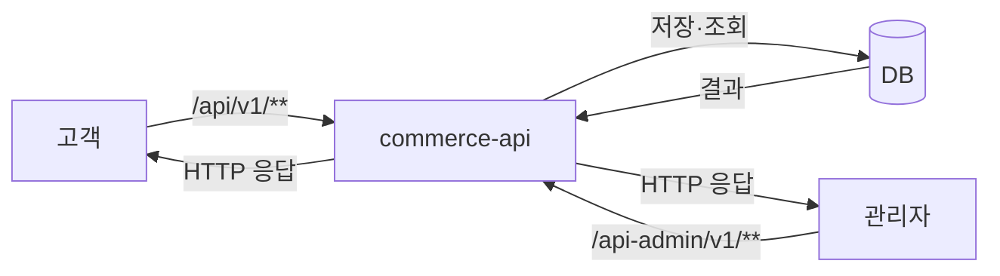
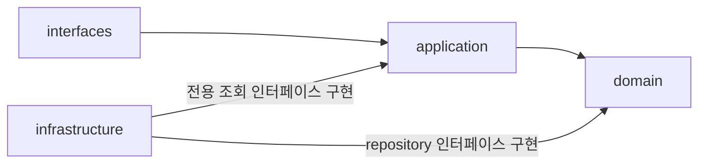
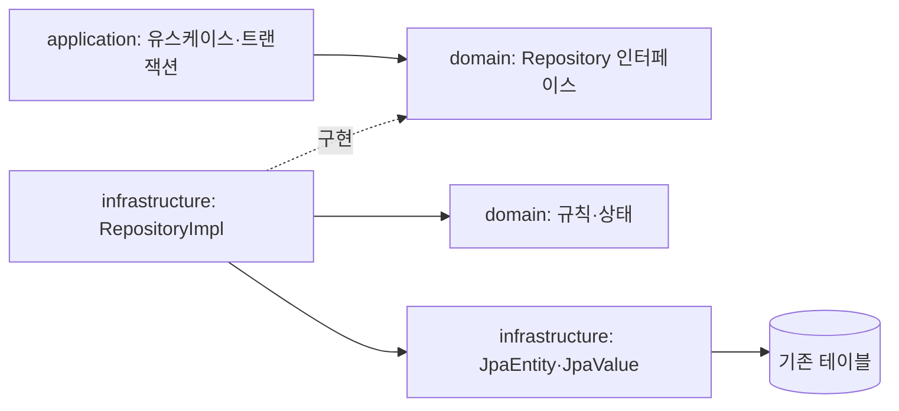
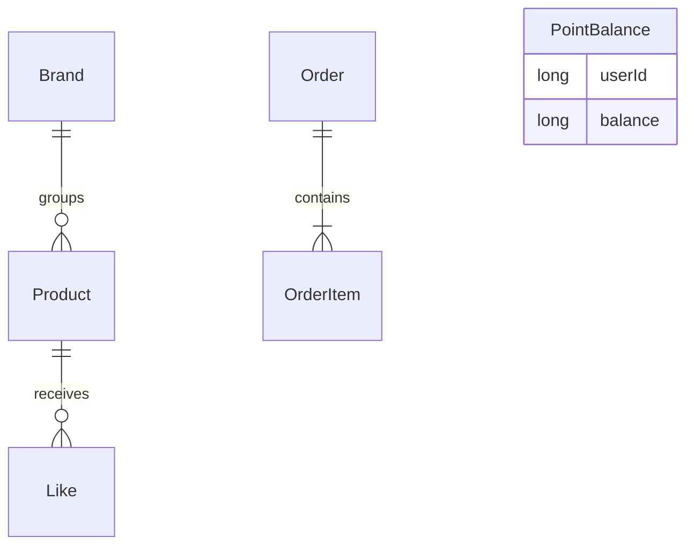
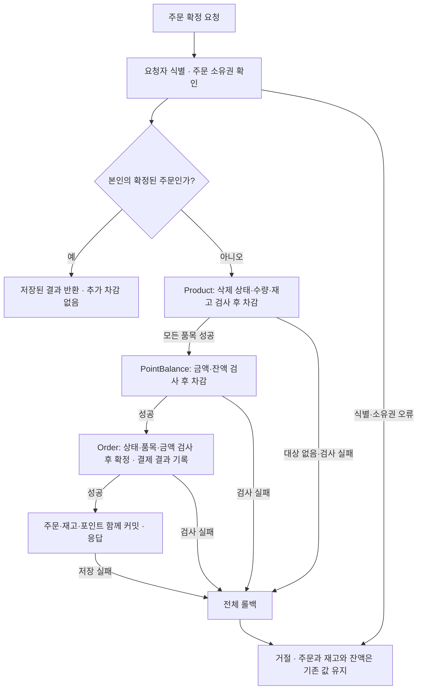

# 2주차 설계

2주차 구현을 초기화하고 이 문서를 기준으로 다시 시작한다. 이번 설계의 구현 대상은 이벤트스토밍의 브랜드·상품·좋아요·포인트·주문이다. 도메인과 영속성 엔티티는 분리하고, 테스트는 각 도메인의 핵심 규칙과 실제 저장·조회 흐름에 집중한다.

## 1. 기본 API 계약

### 공통 입력과 응답

- 금액: 쿠폰 대신 포인트 충전·결제를 사용하며 1포인트는 1원이다.
- 고객: 브랜드·상품 조회는 식별 없이 공개한다. 좋아요·포인트·주문은 로컬 실습용 `X-USER-ID`로 식별한다. 식별 헤더의 누락·형식 오류와 없는 사용자를 거절하고, 본인의 좋아요·포인트·주문만 다룬다.
- 관리자: 과제의 관리자 접근 설정을 사용한다. 일반 사용자·미식별 요청은 `403`으로 거절한다.
- 응답 구조: 기존 [ApiResponse](../../apps/commerce-api/src/main/java/com/loopers/interfaces/api/ApiResponse.java)를 사용한다. 성공은 `meta.result=SUCCESS`와 `data`, 업무 오류는 `meta.result=FAIL`, `meta.errorCode`, `meta.message`로 표현한다. starter의 Jackson 설정대로 null 필드는 응답에서 생략한다. 보안 필터의 접근 거절도 같은 형식으로 변환한다.
- **HTTP 상태:** 입력·업무 오류는 공통 `400`으로 반환하고 `errorCode`로 이유를 구분한다. 오류 코드별 HTTP 매핑은 두지 않는다. starter에 있는 요청 오류 처리와 응답 코드는 유지한다. 과제에서 지정한 관리자 접근 거절은 `403`, 예상하지 못한 서버·DB 장애는 `500`이다. 성공 상태는 아래 API 표를 따른다.
- 입력·성공 열은 아래 「요청·응답 필드」와 함께 읽는다. 자료형, 페이지 기본값과 삭제 정책은 7절의 선택을 따른다.

### 오류 응답과 변환 책임

[1주차 계약](../week1/order-discount-contract.md)의 공통 도메인 예외·업무 코드 방식을 유지한다. domain에는 HttpStatus·ResponseEntity·HTTP DTO를 넣지 않고 API 계층에서 업무 예외를 공통 400과 ApiResponse로 변환한다. 업무 코드에는 HTTP 상태를 넣지 않는다. 입력 파싱·요청자 식별·접근 거절은 각 경계에서 처리한다.

| 상황 | 업무 코드 / HTTP | 메시지·처리 방향 |
| --- | --- | --- |
| 요청 DTO의 필수 값·허용 범위 위반 | INVALID_REQUEST / 400 | 잘못된 요청입니다. |
| JSON 파싱·경로 및 쿼리 파라미터 변환 오류 | starter의 Bad Request / 400 | 기존 ApiControllerAdvice의 필드·타입 오류 설명을 유지한다. |
| 고객 식별 헤더 누락·양수 범위 위반 / 형식 오류 | INVALID_REQUEST / 400 또는 starter의 Bad Request / 400 | 실습의 식별 입력이 올바르지 않음을 알린다. 실제 인증 체계를 새로 도입하는 의미는 아니다. |
| 식별한 사용자가 없음 | USER_NOT_FOUND / 400 | 사용자를 찾을 수 없습니다. |
| 타인의 좋아요 목록 접근 | ACCESS_DENIED / 400 | 접근 권한이 없습니다. |
| 관리자 권한 없음 | ACCESS_DENIED / 403 | 접근 권한이 없습니다. 과제에서 지정한 상태를 유지한다. |
| 없는 주문·타인의 주문 | ORDER_NOT_FOUND / 400 | 주문을 찾을 수 없습니다. 두 경우의 코드·상태·메시지·data 필드 생략을 같게 유지한다. |
| 없는 브랜드·상품 또는 고객이 조회할 수 없는 삭제 대상 | BRAND_NOT_FOUND / PRODUCT_NOT_FOUND / 400 | 브랜드를 찾을 수 없습니다. / 상품을 찾을 수 없습니다. 관리자 조회와 기존 좋아요 취소에는 고객 조회의 삭제 조건을 적용하지 않는다. |
| 재고·잔액 부족 | INSUFFICIENT_STOCK / INSUFFICIENT_POINTS / 400 | 상품 재고가 부족합니다. / 포인트 잔액이 부족합니다. 확정 전체 변경을 롤백한다. |
| 미삭제 상품이 연결된 브랜드 삭제 | BRAND_HAS_ACTIVE_PRODUCTS / 400 | 삭제되지 않은 상품이 있어 브랜드를 삭제할 수 없습니다. |
| 주문 금액 계산 범위 초과 | ORDER_AMOUNT_OVERFLOW / 400 | 주문 금액이 허용 범위를 초과했습니다. 생성을 거절하고 주문·품목을 저장하지 않는다. |
| 그 밖의 예상하지 못한 장애 | starter의 Internal Server Error / 500 | 내부 원인은 로그에 남기고 외부에는 일반 메시지를 반환한다. 서버 장애를 입력·업무 오류로 바꾸지 않는다. |

없는 주문과 타인의 주문은 코드·상태·메시지와 data 필드 생략까지 같게 반환하며, 확정 재요청도 소유권을 먼저 확인한다. 보안 필터의 접근 거절은 entry point / access denied handler에서 같은 ApiResponse로 변환한다. 관리자 미식별 요청도 과제의 403을 유지한다.

오류 클래스와 오류 코드에는 HTTP 상태·응답 타입을 넣지 않는다. 업무 오류의 코드·메시지를 담고, 웹 계층의 예외 처리기가 이를 HTTP 상태와 ApiResponse로 변환한다. 기존 starter의 ErrorType에 있던 HttpStatus는 포인트 구현 단계에서 제거하고 웹 계층으로 매핑을 옮겼다. 기존 Example의 외부 응답 계약은 유지한다.

### 고객 API

| 기능 | Method | Path | 입력 | 성공 | 대표 오류 |
| --- | --- | --- | --- | --- | --- |
| 브랜드 상세 | GET | `/api/v1/brands/{brandId}` | 브랜드 ID | 200: 삭제되지 않은 브랜드 상세 | 400: 없거나 삭제된 브랜드 |
| 상품 목록 | GET | `/api/v1/products` | 브랜드 필터·페이지·정렬 | 200: 상품 목록, 브랜드 정보·좋아요 수·페이지 정보 | 400: 잘못된 조회 조건 |
| 상품 상세 | GET | `/api/v1/products/{productId}` | 상품 ID | 200: 상품 상세, 브랜드 정보·좋아요 수 | 400: 없거나 삭제된 상품 |
| 좋아요 등록 | POST | `/api/v1/products/{productId}/likes` | 상품 ID, 요청 고객 | 200: 본인의 좋아요 관계 등록. 유효한 상품에 이미 등록한 관계여도 성공 | 400: 없거나 삭제된 상품 |
| 좋아요 취소 | DELETE | `/api/v1/products/{productId}/likes` | 상품 ID, 요청 고객 | 200: 본인의 좋아요 관계 제거. 관계가 없어도 성공 | 공통 고객 식별 오류 |
| 내 좋아요 목록 | GET | `/api/v1/users/{userId}/likes` | 사용자 ID, 요청 고객 | 200: 본인 관계의 상품 목록, 삭제된 상품 제외 | 400 / ACCESS_DENIED: 다른 사용자의 목록 접근 |
| 포인트 충전 | POST | `/api/v1/points/charge` | `amount`, 요청 고객 | 200: 저장된 충전 후 잔액 | 400: 누락·잘못된 타입·0 이하·표현 범위 초과·합산 범위 초과 |
| 내 잔액 | GET | `/api/v1/points` | 요청 고객 | 200: 본인의 저장된 잔액 | 공통 고객 식별 오류 |
| 주문 생성 | POST | `/api/v1/orders` | 상품 ID·수량의 품목 목록, 최소 한 개. 같은 상품은 수량 합산 | 201: 주문 ID·품목·수량·생성 당시 단가·합계·DRAFT 상태 | 400: 빈 주문·잘못된 수량·수량 합산 또는 금액 계산 범위 초과. 400: 없거나 삭제된 상품 |
| 주문 확정 | POST | `/api/v1/orders/{orderId}/confirm` | 주문 ID, 요청 고객 | 200: CONFIRMED 주문·결제액·결과. 확정 재요청은 기존 결과 반환 | 400 / ORDER_NOT_FOUND: 없는 주문·타인의 주문. 최초 확정 시 400 상품 없음·삭제, 400 잘못된 수량, 400 재고·잔액 부족 |
| 내 주문 목록 | GET | `/api/v1/orders` | 요청 고객 | 200: 본인 주문 목록 | 공통 고객 식별 오류 |
| 내 주문 상세 | GET | `/api/v1/orders/{orderId}` | 주문 ID, 요청 고객 | 200: 본인 주문의 품목·수량·금액·상태·결제액 | 400 / ORDER_NOT_FOUND: 없는 주문·타인의 주문. 메시지도 동일 |

상품 목록은 `latest`, `price_asc`, `likes_desc` 정렬을 지원한다. 기본값은 `page=0`, `size=20`, `latest`이며 동률이면 ID 내림차순으로 정렬한다. 최신순의 첫 기준은 생성 시각이다. 좋아요 수는 고객–상품 관계에서 조회하며 같은 관계를 중복 저장하지 않는다. 삭제된 상품에 새 좋아요를 등록할 수 없지만, 남아 있는 자신의 관계는 취소할 수 있다.

### 관리자 API

모든 요청에 관리자 접근 확인을 적용한다. 관리자는 삭제된 브랜드·상품도 목록·상세에서 조회할 수 있고, 응답에 삭제 상태를 표시한다. 조회할 수 있어도 삭제된 대상을 수정하거나 재고를 변경할 수는 없다. 삭제 상태는 `deleted: boolean`으로 표시한다. 목록은 `page=0`, `size=20`을 기본으로 최대 100개까지 조회하고, `createdAt DESC, id DESC`로 정렬한다. 잘못된 조건은 `400`으로 거절한다.

| 기능 | Method | Path | 입력 | 성공 | 대표 오류 |
| --- | --- | --- | --- | --- | --- |
| 브랜드 목록 | GET | `/api-admin/v1/brands` | page, size | 200: 삭제된 대상도 조회 가능, 삭제 상태를 포함한 브랜드 목록 | 400: 잘못된 목록 조건. 공통 관리자 접근 오류 |
| 브랜드 상세 | GET | `/api-admin/v1/brands/{brandId}` | 브랜드 ID | 200: 삭제 상태를 포함한 브랜드 상세. 삭제된 대상도 조회 가능 | 400: 없는 브랜드 |
| 브랜드 등록 | POST | `/api-admin/v1/brands` | 브랜드 이름: 앞뒤 공백 제거 후 1~50자 | 201: 생성한 브랜드 | 400: 유효하지 않은 브랜드 정보 |
| 브랜드 수정 | PUT | `/api-admin/v1/brands/{brandId}` | 브랜드 ID·변경 정보 | 200: 수정한 브랜드 | 400: 입력 오류. 400: 없거나 삭제된 브랜드 |
| 브랜드 삭제 | DELETE | `/api-admin/v1/brands/{brandId}` | 브랜드 ID | 200: 삭제 처리 완료. 이미 삭제된 대상도 성공, data 필드 생략 | 400: 없는 브랜드. 400: 삭제되지 않은 연결 상품 존재 |
| 상품 목록 | GET | `/api-admin/v1/products` | page, size | 200: 삭제된 대상도 조회 가능, 삭제 상태를 포함한 상품 목록 | 400: 잘못된 목록 조건. 공통 관리자 접근 오류 |
| 상품 상세 | GET | `/api-admin/v1/products/{productId}` | 상품 ID | 200: 삭제 상태를 포함한 상품 상세. 삭제된 대상도 조회 가능 | 400: 없는 상품 |
| 상품 등록 | POST | `/api-admin/v1/products` | 브랜드 ID·상품 이름(공백 제거 후 1~100자)·가격(1원 이상 정수). 초기 재고는 0개 | 201: 생성한 상품 | 400: 입력 오류. 400: 없거나 삭제된 브랜드 |
| 상품 수정 | PUT | `/api-admin/v1/products/{productId}` | 상품 ID, 이름·가격 모두 필수. 브랜드 유지, 재고는 별도 API로 설정 | 200: 수정한 상품 | 400 / INVALID_REQUEST: 이름·가격 누락·null·범위 위반. 400: 없거나 삭제된 상품 |
| 상품 삭제 | DELETE | `/api-admin/v1/products/{productId}` | 상품 ID | 200: 삭제 처리 완료. 이미 삭제된 대상도 성공, data 필드 생략 | 400: 없는 상품 |
| 재고 설정 | PUT | `/api-admin/v1/products/{productId}/stock` | 상품 ID·0~2,147,483,647의 최종 수량 | 200: 변경 후 재고 수량 | 400: 유효하지 않은 수량. 400: 없거나 삭제된 상품 |
| 주문 목록 | GET | `/api-admin/v1/orders` | page, size, 선택적 userId 구매자 필터 | 200: 구매자들의 주문 목록 | 400: 잘못된 목록 조건. 공통 관리자 접근 오류 |
| 주문 상세 | GET | `/api-admin/v1/orders/{orderId}` | 주문 ID | 200: 구매자·품목·수량·상태·금액·결제 결과 | 400: 없는 주문 |

고객 상품 목록과 관리자 목록의 페이지 응답은 `items`, `page`, `size`, `totalElements`, `totalPages`로 구성한다. 유효한 관리자 구매자 필터에 결과가 없으면 빈 목록을 반환한다.

관리자의 브랜드·상품 변경은 고객 조회에 반영한다. 삭제되지 않은 상품이 연결된 브랜드는 재고가 0이어도 삭제할 수 없다. 브랜드·상품은 소프트 삭제하며, 삭제된 대상은 고객 조회·새 주문에서 제외하고 수정·재고 변경 대상으로 사용하지 않는다. 기존 참조와 저장된 주문 정보는 보존한다. 두 삭제 방식의 비교와 선택 이유는 7절에 적었다.

### 요청·응답 필드

필드 이름은 camelCase를 사용한다. 아래 구성은 이미 정한 입력과 결과를 JSON으로 표현한 것이다. 별도 요청 키나 새로운 API는 추가하지 않는다. 고객 식별은 X-USER-ID를 사용하고, 요청 본문으로 주문자나 잔액 소유자를 지정하지 않는다.

| 요청 | 본문·조회 조건 |
| --- | --- |
| 브랜드 등록·수정 | 본문: name. 이름은 필수이며 기존 공백 제거·길이 규칙을 적용한다. |
| 상품 등록 | 본문: brandId, name, price. 모두 필수. 초기 재고는 0이다. |
| 상품 수정 | 본문: name, price. 모두 필수이며 누락·null을 거절한다. |
| 재고 설정 | 본문: stock. 증감량이 아닌 최종 수량이다. |
| 포인트 충전 | 본문: amount. 양의 정수 금액이다. |
| 주문 생성 | 본문: items 배열. 각 항목은 productId, quantity를 가진다. 단가·합계는 서버에서 결정한다. |
| 상품 목록 | 쿼리: brandId, page, size, sort. sort는 latest, price_asc, likes_desc 중 하나다. |
| 관리자 브랜드·상품 목록 | 쿼리: page, size. |
| 관리자 주문 목록 | 쿼리: page, size, 선택적 userId. |
| 상세 조회·내 잔액·내 주문 목록·내 좋아요 목록 | 앞의 API 표에 있는 경로 변수와 요청자 식별을 사용한다. 별도 본문은 없다. |
| 좋아요 등록·취소, 브랜드·상품 삭제, 주문 확정 | 경로의 대상 ID와 요청자 식별을 사용한다. 별도 본문은 없다. |

금액 필드 price, amount, unitPrice, lineAmount, totalAmount, paidAmount, balance는 원 단위 long으로 다룬다. quantity와 stock은 int다. 요청의 숫자 필드는 누락·null을 확인할 수 있는 형태로 받고 기존 유효성 규칙을 적용한다.

아래 표는 ApiResponse의 data에 담는 값이다. 성공 시 meta에는 result=SUCCESS를 담고, null인 errorCode와 message는 생략한다. 업무 오류는 이 절의 오류 표와 data 필드 생략을 사용한다.

| 응답 대상 | data 구성 |
| --- | --- |
| 고객 브랜드 상세 | brandId, name |
| 고객 상품 목록의 항목·상품 상세·내 좋아요 목록의 항목 | productId, name, price, brand: { brandId, name }, likeCount |
| 관리자 브랜드 등록·수정·상세·목록의 항목 | brandId, name, deleted |
| 관리자 상품 등록·수정·상세·목록의 항목 | productId, brandId, name, price, stock, deleted |
| 재고 설정 | productId, stock |
| 포인트 충전·내 잔액 | balance |
| 주문 생성·확정·고객 주문 상세·고객 주문 목록의 항목 | orderId, status, items, totalAmount, paidAmount, paymentResult |
| 주문의 items 항목 | productId, quantity, unitPrice, lineAmount. unitPrice는 생성 당시 단가다. |
| 관리자 주문 상세·목록의 항목 | 고객 주문 결과 필드에 구매자를 나타내는 userId를 추가한다. |
| 좋아요 등록·취소, 브랜드·상품 삭제 | data 필드를 생략한다. 성공 여부는 meta.result로 표현한다. |

주문 status는 DRAFT 또는 CONFIRMED다. 아직 결제하지 않은 DRAFT의 paidAmount와 paymentResult는 null이므로 응답에서 생략한다. CONFIRMED는 저장한 결제액과 paymentResult=SUCCESS를 반환한다. 주문 확정 실패 시에는 오류 응답과 기존 DRAFT를 유지하므로 별도의 실패 결제 상태를 만들지 않는다. 기존 확정 결과를 반환할 때도 저장된 값을 사용한다.

고객 상품 목록과 관리자 목록은 data를 `{ items, page, size, totalElements, totalPages }`로 감싼다. 내 좋아요 목록과 내 주문 목록은 현재 API 표에 페이지 조건을 두지 않았으므로 `{ items }`로 반환한다. 결과가 없으면 items는 빈 배열이다. 기존 주문 품목 응답은 저장한 값으로 만들며, 현재 Product를 조회해서 단가를 덮어쓰지 않는다.

## 2. 주요 규칙과 기대값

아래는 구현과 테스트의 기대 결과다. 충전·주문·상품·좋아요·삭제 규칙은 실습 §3, 요청자 구분과 거절 후 저장 상태는 §4를 기준으로 했다. 생성 당시 단가·빈 주문 거절·중복 품목 합산과 목록·좋아요 처리 기준은 대화에서 선택했다. 확정 재요청은 1주차의 결과 재사용 조건을 이번 주문 확정에 적용한다.

| 입력·상황 | 기대 결과 |
| --- | --- |
| 잔액 0원에서 10,000원 충전 | 저장 후 재조회한 잔액 10,000원 |
| 잔액 10,000원에서 0원·음수·잘못된 타입으로 충전 | 거절, 기존 잔액 10,000원 유지 |
| 충전액 또는 충전 후 잔액이 저장 타입의 범위를 초과 | 거절, 기존 잔액 유지 |
| 존재하는 사용자의 잔액 행이 없는 상태에서 조회 | 0원 반환, 조회만으로 행을 저장하지 않음 |
| 유효한 정보로 상품 등록 | 초기 재고 0개. 이후 재고 설정 API로 변경 가능 |
| 재고 5개에서 2개 차감 | 재고 3개 |
| 재고 5개에서 6개 또는 0 이하 수량 차감 | 거절, 재고 5개 유지 |
| 관리자 재고 설정: 5개 → 0개 | 재고 0개로 저장 |
| 관리자 재고 설정: 5개 → -1개 | 거절, 재고 5개 유지 |
| 여러 품목 합계 7,000원의 주문 생성 | DRAFT와 품목·수량·단가·합계 저장. 재고·포인트 차감 없음 |
| 품목 목록이 비어 있는 주문 생성 | 거절, 주문을 저장하지 않음. 재고·포인트 변경 없음 |
| 생성할 주문의 단가×수량 또는 품목 합계가 long 범위를 초과 | 400 / ORDER_AMOUNT_OVERFLOW로 생성 거절. 주문·품목을 일부만 저장하지 않고 재고·포인트도 변경하지 않음 |
| 한 주문 요청에 같은 상품 A 2개와 A 3개 포함 | A 5개인 한 품목으로 저장. 재고 확인도 총 5개 기준 |
| 같은 상품의 수량 3개와 -1개를 한 주문으로 요청 | 합산 전에 음수 수량을 거절. 2개로 합쳐 유효한 요청으로 바꾸지 않음 |
| 잔액 10,000원, 충분한 재고로 위 주문 확정(생성 후 가격 변경 없음) | 결제액 7,000원, 잔액 3,000원, 주문 수량만큼 재고 차감, CONFIRMED와 결제 결과 저장 |
| 단가 2,000원으로 2개 주문한 뒤 현재 상품 가격이 3,000원으로 변경 | 상품이 유효하고 재고·잔액이 충분하면 저장한 단가로 4,000원 결제. 현재 가격으로 다시 계산하지 않음 |
| 확정한 본인 주문의 확정 재요청 | 기존 확정 결과 반환, 잔액·재고 추가 차감 없음 |
| DRAFT 생성 뒤 상품이 삭제되어 최초 확정 요청 | 거절, 주문·재고·포인트는 요청 전 상태 유지 |
| 최초 확정 시 재고 또는 포인트 부족 | 각각 400 / INSUFFICIENT_STOCK 또는 INSUFFICIENT_POINTS. DRAFT 유지, 재고·포인트 차감 없음 |
| 다른 사용자의 주문 상세·확정 요청 | 없는 주문과 동일한 400 / ORDER_NOT_FOUND 및 메시지로 거절. 해당 주문·재고·포인트 변경 없음 |
| 유효한 상품의 이미 있는 고객–상품 조합에 좋아요 등록 | 200 성공, 관계는 하나만 유지 |
| 본인의 좋아요 관계가 없는데 취소 요청 | 200 성공, 저장 상태 변경 없음 |
| 상품 목록 조건 없음 / 음수 페이지·범위 밖 크기·알 수 없는 정렬 | 첫 페이지 20개를 최신순 조회 / 400 거절 |
| 삭제된 상품에 새 좋아요 등록 / 기존 본인 좋아요 취소 | 새 등록 거절 / 남아 있는 본인 관계는 취소 가능 |
| 재고 0인 미삭제 상품이 연결된 브랜드 삭제 | 삭제 거절 |
| 삭제된 브랜드·상품을 관리자가 목록·상세에서 조회 | 조회 가능, 응답에 삭제 상태 표시. 고객 조회에서는 제외 |
| 삭제된 브랜드·상품 수정 또는 삭제된 상품의 재고 변경 | 관리자여도 거절, 저장 상태 유지 |
| 유효한 상품의 이름·가격을 모두 보내 수정 | 200. 두 값을 반영하고 브랜드·재고는 유지 |
| 상품 수정 시 이름·가격 중 하나라도 누락·null 또는 유효하지 않음 | 400 / INVALID_REQUEST. 유효한 필드만 일부 반영하지 않고 기존 상품 정보 유지 |
| 일반 사용자·미식별 요청의 관리자 API 접근 | 403 거절. 변경 요청 거절 시 저장 상태 유지 |
| 없는 상품·삭제된 상품을 포함해 주문 생성 | 400 / PRODUCT_NOT_FOUND. 주문·품목을 저장하지 않고 재고·포인트 변경 없음 |
| 없거나 삭제된 브랜드로 상품 등록 | 400 / BRAND_NOT_FOUND. 상품을 저장하지 않음 |
| 관리자 브랜드 이름·상품 이름 또는 가격 변경 후 고객 조회 | 저장한 변경 내용이 브랜드 상세·상품 목록·상세의 해당 필드에 반영됨. 상품의 브랜드는 유지 |
| 유효한 상품에 좋아요 등록 후 반복 등록·취소 | 관계를 처음 만들 때만 좋아요 수가 1 증가. 반복 등록은 그대로, 기존 관계 취소 시 1 감소 |
| 상품 목록의 브랜드 필터·세 가지 정렬과 동률 | 해당 브랜드의 미삭제 상품만 조회. latest·price_asc·likes_desc와 ID 내림차순 보조 기준 적용 후 페이지 구성 |
| 삭제된 상품이 있는 내 좋아요 목록 조회 | 삭제된 상품은 제외. 저장된 본인 관계의 취소는 계속 허용 |
| 주문 수량 2,147,483,648 또는 중복 품목 합산이 int 범위를 초과 | 400 / INVALID_REQUEST. 주문·품목을 저장하지 않음 |
| 관리자 재고 설정이 2,147,483,647 / 2,147,483,648 | 유효한 상품이면 상한값은 저장 가능 / 범위 초과는 400으로 거절하고 기존 재고 유지 |
| 이미 소프트 삭제된 브랜드·상품의 삭제 재요청 / 없는 ID 삭제 | 관리자 확인 후 200, 상태 변경 없음 / 400 |
| 조건 없이 관리자 목록 조회 | 첫 페이지 최대 20개, 생성 시각·ID 내림차순. 브랜드·상품은 삭제 대상과 deleted 상태 포함 |
| 관리자 목록의 음수 page·size 0·size 101 / 유효한 구매자 필터에 결과 없음 | 400 / INVALID_REQUEST로 거절 / 200과 빈 목록 |
| 고객 식별 헤더 누락·양수 범위 위반 / 형식 오류 | 400 / INVALID_REQUEST 또는 starter의 Bad Request. 변경 요청이면 저장 상태 유지 |
| 타인의 좋아요 목록 조회 | 400 / ACCESS_DENIED |

## 3. 버드뷰

고객과 관리자는 하나의 commerce-api와 DB를 사용한다. 요청 경로와 접근 범위를 구분한다.

- 고객: 브랜드·상품 조회, 자신의 좋아요·포인트·주문 관리.
- 관리자: 브랜드·상품 CRUD, 재고 변경, 구매자들의 주문 조회.
- 실행: JDK 21과 기존 Gradle·Spring Boot를 사용한다. 로컬 실행은 `server.address=127.0.0.1`로 제한하고 실제 비밀정보·개인정보와 공개 배포를 사용하지 않는다.
- 관리자 검증: 과제의 Spring Security 지원 설정과 MockMvc를 사용한다. 관리자 허용과 일반·미식별 요청 거절을 확인하며, 변경 요청 테스트에는 유효한 CSRF 입력을 포함한다.

## 4. 구조와 의존

기존 `com.loopers`의 계층 우선 패키지 구조를 유지한다.

| 계층 | 책임 | 직접 의존하지 않을 계층 |
| --- | --- | --- |
| interfaces | HTTP 입력·응답 변환, 고객·관리자 API 구분, 업무 예외의 공통 400 처리 | infrastructure |
| application | 요청자와 대상의 관계 확인, 도메인 조회·행동·트랜잭션 조율, 전용 조회 인터페이스·결과 타입 | interfaces, infrastructure |
| domain | 상태·업무 규칙, 필요한 repository 인터페이스 | interfaces, application, infrastructure |
| infrastructure | domain의 repository와 application의 전용 조회 인터페이스를 JPA 등으로 구현 | HTTP 응답 정책과 중복된 업무 판단을 배치하지 않음 |

화살표는 소스의 타입 의존이다. 실행 시 domain의 repository 인터페이스 호출은 주입된 infrastructure 구현체가 처리한다. 기본 협력 경로는 위와 같고, 현재 [ArchitectureTest](../../apps/commerce-api/src/test/java/com/loopers/architecture/ArchitectureTest.java)는 interfaces에서 domain을 직접 참조하는 것까지 금지하지는 않는다. 2주차 domain에는 JPA 애너테이션과 BaseEntity 상속을 두지 않는다. ArchUnit으로 이 의존도 검사한다. 1주차 Example 예제는 기존 학습 기록으로 유지하며 이번 분리 대상에서 제외한다.

전용 조회 인터페이스와 결과 타입은 application에 둔다. infrastructure가 그 인터페이스를 구현하는 방향은 현재 ArchitectureTest에서 금지하지 않으므로 검사 완화가 필요하지 않다. domain은 application의 조회 타입을 참조하지 않는다. 구현 시 이 방향뿐 아니라 domain에서 HTTP 타입을 직접·간접 참조하지 않는지도 별도로 확인한다. 현재 계층 검사만으로 모든 HTTP 의존이 잡히는 것은 아니다.

기능별로 코드를 모으면 주문이나 상품 코드를 한곳에서 찾기 편할 것 같습니다. 다만 이번에는 기존 Example과 구조 검사를 참고하면서 각 계층이 맡는 일부터 구분해보려고 합니다. 한 기능을 수정할 때 여러 폴더를 봐야 하는 불편은 있겠지만, 우선 기존 구조 안에서 구현해볼 생각입니다.

컨트롤러와 Facade는 `ChargePointController`, `CreateBrandFacade`처럼 동작이 드러나는 이름을 쓴다. 등록·수정·삭제는 유스케이스별로 나누고, 같은 대상의 단건·목록 조회는 하나의 Get 컨트롤러와 Facade에서 처리한다. 고객 조회와 관리자 조회는 접근 범위가 다르므로 구분한다.

### 도메인 객체와 JPA 엔티티 분리

도메인 객체는 업무 상태와 규칙을 표현하고, JPA 엔티티는 테이블·컬럼·식별자 생성·저장 시각을 관리한다. application은 도메인과 repository 인터페이스만 사용한다. infrastructure의 repository 구현이 두 객체 사이를 변환한다.

| 도메인 타입 | 저장 타입 | 변환에서 보존할 값 |
| --- | --- | --- |
| Brand | BrandJpaEntity | ID, 이름, 삭제 상태 |
| Product | ProductJpaEntity | ID, 브랜드 ID, 이름, 가격, 재고, 삭제 상태 |
| PointBalance | PointBalanceJpaEntity | ID, 사용자 ID, 현재 잔액 |
| Order | OrderJpaEntity | ID, 사용자 ID, 품목, 상태, 총액, 결제액·결과 |
| OrderItem | OrderItemJpaValue | 상품 ID, 수량, 주문 당시 단가, 품목 금액 |
| ProductLike | ProductLikeJpaEntity | 사용자–상품 관계 |

- 도메인에는 JPA의 기본 생성자·연관관계·지연 로딩을 노출하지 않는다. ID와 삭제 상태처럼 업무에서 필요한 값은 직접 갖는다. 공통 영속성 기반 클래스인 BaseEntity는 JPA 엔티티만 상속한다.
- repository 조회는 JPA 엔티티를 그대로 반환하지 않고 별도의 도메인 객체로 변환한다. 저장된 주문을 복원할 때 신규 주문 생성이나 확정 행동을 다시 실행하지 않는다. `restore(...)`는 저장된 상태를 복원하기 위한 경로다.
- application은 도메인의 행동을 호출한 뒤 `repository.save(...)`를 명시한다. 도메인 객체를 바꾸기만 해서는 DB가 바뀌지 않는다. 저장 구현은 신규 객체이면 엔티티를 생성하고, 기존 객체이면 해당 ID의 엔티티에 변경 상태를 반영한다.
- 수정·삭제 후 응답도 repository가 반환한 저장 결과를 사용한다. 주문 품목과 생성 당시 금액은 확정 시 다시 계산하거나 현재 상품 가격으로 덮어쓰지 않는다.
- repository 구현의 조회 트랜잭션 안에서 주문 품목까지 도메인 값으로 변환한다. application이나 HTTP 응답에 지연 로딩 객체를 넘기지 않는다.
- 기존 테이블·컬럼·유일 제약은 유지한다. 사용자–상품 좋아요 조합의 유일 제약은 ProductLikeJpaEntity에 둔다.
- 관리자 목록의 기존 Page/Pageable 인터페이스는 유지한다. 이번 변경은 JPA 모델 분리이며, 페이지 타입의 프레임워크 의존을 없애는 개편까지 포함하지 않는다.

| 대안 | 이점 | 비용과 선택 |
| --- | --- | --- |
| 업무 객체에 JPA 매핑을 함께 둠 | 클래스와 변환 코드가 적다. | 도메인 변경과 영속성 변경이 같은 객체에 모이고, 저장이 변경 감지에 의존한다. |
| 도메인과 JPA 엔티티를 분리함 | 업무 규칙을 저장 기술 없이 테스트하고, 매핑 변경을 infrastructure 안에서 처리할 수 있다. | 변환 코드와 명시적 저장이 필요하다. 이번에는 이 방식을 선택하고 재조회·롤백 테스트로 변환 누락과 저장 누락을 확인한다. |

### 변경을 저장하는 책임

포인트 충전은 `조회 → charge → 잔액 저장`, 상품 수정·재고 설정은 `조회 → 도메인 행동 → 상품 저장`, 브랜드 수정·삭제는 `조회 → 도메인 행동 → 브랜드 저장` 순서다. 조회만 하는 유스케이스는 저장을 호출하지 않는다.

주문 확정은 하나의 application 트랜잭션 안에서 상품별 재고 차감·저장, 잔액 차감·저장, 주문 확정·저장을 수행한다. 저장 도중 제약 위반이 발생하거나 뒤의 도메인 행동이 거절되면 앞서 실행한 SQL도 모두 롤백한다. 각 저장 호출이 별도 트랜잭션으로 먼저 커밋되어서는 안 된다.

## 5. 도메인 관계와 책임

참고: [이벤트스토밍 — 신지우](https://drive.google.com/file/d/1-Z4HYjyo9UWqpgIWYhY1U97MqPibHZRv/view?usp=sharing)

다음 그림은 업무에서 어떤 대상끼리 연결되는지 보여준다. 주문 품목 최소 한 개는 이번 선택을 반영했다. 선으로 연결됐다고 전부 한 객체 안에 넣는 것은 아니다. 예를 들어 상품은 브랜드에 속하지만, 상품의 수정과 재고 관리는 Product가 맡는다.

주문 품목에는 상품 식별자·수량·생성 당시 단가를 남긴다. 확정할 때도 이 단가를 사용한다. 이후 상품의 수정·삭제 때문에 기존 주문 정보가 바뀌거나 사라지면 안 된다. 재고는 상품별로 관리한다.

### 애그리게이트 후보와 관리 단위

현재 보드에서는 다음 다섯 후보를 사용한다. 각 후보를 별도 서버나 바운디드 컨텍스트로 확정한 것은 아니다. 우선 하나의 API 서버 안에서 책임을 구분하고 구현하면서 검토한다.

| 후보 루트 | 관리하는 한 단위와 상태 | 행동과 책임 |
| --- | --- | --- |
| Order | 주문 한 건과 최소 한 개의 OrderItem. 주문자·품목·합계·상태·결제액·결과 | 빈 주문과 각 입력의 잘못된 수량을 거절한 뒤 같은 상품의 수량을 합산하고 int 범위를 확인한다. OrderItem의 생성 당시 단가×수량을 합산하고 범위 초과를 거절하며 DRAFT로 생성한다. 최초 확정은 DRAFT에서 수행하며 결제 결과를 기록한다. |
| Brand | 브랜드 한 개의 정보와 삭제 상태 | 등록·수정·삭제 시 유효성을 지킨다. 삭제 시 application이 조회한 미삭제 상품 존재 여부를 받아, 연결 상품이 있으면 거절한다. DB를 직접 조회하지 않는다. |
| Product | 상품 한 개의 브랜드 ID·이름·가격·재고·삭제 상태 | 정보 변경, 최종 재고 설정, 주문 시 재고 차감을 맡는다. 수정 시 브랜드를 유지하고 재고 부족과 삭제된 상품의 변경을 거절한다. |
| PointBalance | 사용자 한 명의 현재 포인트 잔액 | 충전과 차감을 모두 맡는다. 양의 정수 충전, 합산 범위, 잔액 부족을 검사하고 잔액을 음수로 만들지 않는다. |
| Like | 사용자 한 명–상품 한 개 사이의 관계 | 해당 관계의 등록·취소를 표현한다. 동일 사용자–상품 조합의 중복 저장을 막는 책임을 등록·저장 절차와 함께 구현한다. |

`X-USER-ID`는 포인트·좋아요·주문의 소유자를 구분하는 양수 식별자다. 회원가입 API나 별도 User 도메인 객체는 추가하지 않는다. 실습용 users 테이블에 준비한 식별자인지만 조회한다. 각 도메인에 userId를 저장하고 요청자의 식별자와 비교해 소유권을 확인한다.

`OrderItem`은 주문에 저장한 구매 내용을 나타내는 VO로 다룬다. 상품 식별자·수량·생성 당시 단가를 보관하며, 같은 상품이라도 다른 주문의 품목은 각 주문에 속한다. 현재 요구에는 품목 자체의 식별자로 개별 변경 이력을 추적하는 기능이 없으므로 값의 조합으로 표현한다. 생성 후 구매 내용을 임의로 변경하는 setter는 두지 않는다. 상품 ID는 구매한 상품을 가리키는 값이며 OrderItem 자체의 식별자는 아니다.

VO라고 규칙이 없는 것은 아니다. OrderItem은 자신의 수량이 양수인지, 단가가 1원 이상인지 확인하고 단가×수량의 long 범위 초과를 거절한다. Order 생성 로직은 합산 전 각 요청 수량 검사와 같은 상품의 수량 합산을 맡고, OrderItem은 합산된 품목 값의 유효성과 품목 금액을 책임진다. Order는 최소 한 품목 조건과 품목 금액의 총합을 관리한다. 품목 하나의 계산과 주문 전체의 합산을 각자 맡으므로 같은 금액 계산을 두 곳에서 반복하지 않는다.

규칙이 없어서 VO를 선택하는 것이 아니라, 주문에 보관할 구매 내용을 값으로 다루기 위해 선택합니다. 품목별 식별과 변경 추적이 필요해지면 Entity로 다루는 대안도 검토할 수 있습니다. 도메인의 Order가 VO 목록을 소유합니다. 저장 시 OrderJpaEntity의 OrderItemJpaValue 컬렉션으로 변환해 주문과 품목을 별도 테이블에 보관합니다.

`PointBalance`는 숫자 하나가 아니라 **사용자별 잔액을 관리하는 객체**를 뜻한다. 잔액이 변해도 같은 사용자의 계정이다. 포인트 금액이나 재고 수량 자체를 VO로 표현할 수도 있다. 다만 이번 재고는 별도 Stock VO 없이 Product의 `int stock` 필드로 관리한다.

### 주문과 주문 품목의 저장

도메인의 Order는 `List<OrderItem>`을 가진다. 두 타입에는 JPA 애너테이션을 두지 않는다. infrastructure의 OrderJpaEntity가 `List<OrderItemJpaValue>`를 갖고, OrderItemJpaValue에 `@Embeddable`, 저장 엔티티의 품목 목록에 `@ElementCollection`과 `@CollectionTable`을 사용한다. 품목 저장용 repository는 따로 두지 않고 OrderRepository가 전체를 변환·저장한다.

| 테이블 | 저장할 정보 | 연결 |
| --- | --- | --- |
| orders | 주문 ID, 사용자 ID, 상태, 총금액, 결제액·결과 | 주문 한 건을 저장한다. |
| order_items | 상품 ID, 수량, 주문 당시 단가, 품목 금액 | order_id로 orders의 주문 ID를 참조한다. |

테이블이 둘이어도 객체 모델에서는 하나의 Order 애그리게이트다. Order를 저장할 때 품목도 함께 저장하며, 전체 저장을 하나의 트랜잭션으로 처리한다. 여러 SQL이 실행될 수 있지만 하나라도 실패하면 주문과 품목의 저장을 모두 롤백한다. 상품 정보가 바뀌더라도 이미 저장한 단가는 유지한다.

지금은 품목을 따로 수정하거나 상태를 추적하는 기능이 없어서, 주문의 구매 내용을 VO 컬렉션으로 저장하려고 합니다. 자식 Entity로 매핑하면 품목별 식별·변경을 다루기 쉽지만 식별자와 연관관계 관리가 추가됩니다. 현재는 VO 컬렉션을 사용하고, 품목별 변경이 필요해지면 실제 조회·변경 비용을 보고 다시 비교하겠습니다.

JPA는 기본 값이나 Embeddable의 컬렉션을 별도 컬렉션 테이블로 매핑하는 방식을 지원한다. 참고: [Jakarta Persistence ElementCollection](https://jakarta.ee/specifications/persistence/3.1/apidocs/jakarta.persistence/jakarta/persistence/elementcollection).

### 경계를 나눈 이유와 비교한 대안

처음에는 상품이 브랜드에 속하니까 브랜드 안에, 좋아요도 상품에 달리니까 상품 안에 넣으면 되지 않을까 싶었습니다. 그런데 이 기준으로 보면 주문할 때 쓰는 포인트도 주문 안에 들어가야 할 것 같아서 헷갈렸습니다. 관계가 있다는 것만으로는 어디까지 묶을지 정하기 어려웠습니다.

지금은 **어떤 상태를 관리하는지, 그 상태가 특정 객체에 속하는지, 변경할 때 어떤 규칙을 함께 지켜야 하는지**를 먼저 보려고 합니다. 아래는 그 기준으로 좋아요와 포인트를 나눠본 이유입니다.

**좋아요를 따로 둔 생각**

상품이 좋아요 목록을 가지고, 상품을 통해 등록하거나 취소하게 만들 수도 있을 것 같습니다. 다만 지금 필요한 동작은 ‘이 사용자가 이 상품에 남긴 좋아요’를 등록하거나 취소하는 것입니다. 같은 상품을 좋아하는 다른 사용자들의 관계까지 함께 바꿀 필요는 없고요.

그래서 이번에는 사용자 한 명과 상품 한 개의 관계를 Like로 따로 관리하려고 합니다. 중복을 막아야 하는 대상도 이 조합이므로, 무엇을 확인해야 하는지 더 잘 드러날 것 같습니다. 물론 Like라는 객체를 만든다고 중복이 저절로 막히지는 않으니 저장할 때도 같은 조합이 생기지 않도록 보장해야 합니다.

**포인트를 따로 둔 생각**

포인트는 주문을 확정할 때 차감되니까 주문이 관리해도 되지 않을까 싶었습니다. 하지만 주문이 없어도 충전할 수 있고, 주문 A와 B 모두 같은 사용자의 잔액을 씁니다. 그러면 이 잔액을 어느 한 주문의 일부로 두기는 어렵겠다는 생각이 들었습니다.

예를 들어 10,000원에서 주문 A에 7,000원을 쓰면 현재 잔액은 3,000원입니다. 이후에 충전하더라도 A에서 7,000원을 썼다는 기록은 그대로여야 합니다. **지금 얼마가 남았는지와 그 주문에서 얼마를 썼는지는 따로 관리할 정보**인 셈입니다.

현재 잔액은 PointBalance가 가지고, 같은 잔액을 바꾸는 충전과 차감도 모두 여기서 맡도록 하려고 합니다. Order에는 해당 주문에서 사용한 금액과 결제 결과를 남기고요. 주문 확정 흐름에서는 두 객체에 필요한 일을 요청하도록 연결하면 될 것 같습니다.

이렇게 보니 ‘함께 바뀌는 상태면 합친다’만으로 판단하기는 어렵습니다. 주문 확정 때 잔액과 주문 상태가 함께 바뀌더라도, 그 잔액은 다른 주문에서도 계속 사용하는 사용자 잔액이니까요.

| 비교한 대안 | 현재 선택과 이유 | 분리 후에도 필요한 협력 |
| --- | --- | --- |
| Brand 내부에서 모든 Product를 관리 / Brand와 Product를 분리 | 별도 후보로 둔다. 브랜드 소속과 상품 수정·재고 차감의 관리 단위는 다르다. 상품 한 개를 변경할 때 브랜드 전체 상품을 관리하는 책임까지 요구하지 않는다. | 상품 등록 시 브랜드 유효성 확인, 브랜드 삭제 시 미삭제 상품 존재 확인이 필요하다. 분리만으로 삭제 조건이 해결되지는 않는다. |
| Product 내부에서 좋아요 관계 관리 / Like를 분리 | Like를 별도 후보로 둔다. 등록·취소 대상은 특정 사용자–상품 관계이고, 현재 요구에는 상품의 모든 좋아요를 함께 변경해야 하는 규칙이 없다. 상품 내부의 컬렉션으로 관리할 수도 있지만, 이번에는 각 관계를 직접 등록·취소하는 쪽으로 구성한다. | 등록 시 상품이 존재하며 삭제되지 않았는지 확인한다. 동일 조합의 중복 저장은 별도 보장해야 한다. 좋아요 수와 목록은 관계에서 조회한다. |
| Order 내부에서 잔액 관리 / PointBalance를 분리 | PointBalance를 별도 후보로 둔다. 주문 없이도 충전할 수 있고 여러 주문이 같은 사용자 잔액을 사용한다. 특정 주문이 사용자의 현재 잔액을 소유하는 구조는 이 흐름을 표현하기 어렵다. | 주문 확정 처리가 차감을 요청한다. 현재 잔액·충전·차감은 PointBalance가, 해당 주문에서 사용한 금액과 결제 결과는 Order가 관리한다. |

좋아요를 분리해도 삭제된 상품에 남아 있는 본인 관계의 취소는 허용해야 한다. 신규 등록 때의 상품 유효성 검사를 취소에도 그대로 적용하면 과제의 요구와 달라진다.

### 규칙을 지키는 곳과 협력하는 곳

요청 DTO의 누락·타입·형식·단순 범위는 웹 계층에서 검증한 뒤 application을 호출한다. application은 요청자 확인·객체 조회·트랜잭션을 조율한다. 잔액·재고·삭제 제한·주문 금액과 상태 같은 비즈니스 규칙은 도메인 내부에서 검사한다. 도메인은 웹 외의 호출에서도 유효한 상태를 유지하도록 자체 불변조건을 지킨다.

다음은 실습 §3·§4의 규칙을 현재 후보에 배치한 설계다. 하나의 객체가 모든 조건을 직접 조회하고 판단하도록 만들지는 않는다.

| 규칙 | 책임 배치 |
| --- | --- |
| 포인트 충전액은 양의 정수, 합산은 저장 범위 이내, 차감 후 잔액은 0 이상 | interfaces는 누락·타입 입력을 처리하고 PointBalance는 충전·차감 시 잔액 규칙을 지킨다. 잘못된 입력으로 저장 상태를 바꾸지 않는다. |
| 재고 설정은 0 이상의 최종 수량, 주문 차감은 필요한 수량만큼이며 부족하면 거절 | Product의 재고 행동이 맡는다. 최종 수량 설정과 차감 행동을 구분한다. |
| 주문 생성은 DRAFT이며 재고·포인트를 차감하지 않음 | Order는 주문의 상태와 품목을 관리하고, 생성 절차에서는 재고·포인트 차감을 호출하지 않는다. |
| 본인 주문만 확정, 상품 유효성·양수 수량·재고·잔액 확인 | application이 요청자·주문과 상품·포인트를 연결한다. Order는 상태·품목 규칙, Product는 상품·재고 규칙, PointBalance는 잔액 규칙을 지킨다. |
| 삭제되지 않은 상품이 있으면 브랜드 삭제 거절. 재고 0인 상품도 포함 | application이 상품 존재 여부를 조회해 Brand의 삭제 행동에 전달한다. Brand가 삭제 규칙을 검사하고 상태를 변경한다. 조회·삭제 사이의 동시 변경 처리 방법은 별도로 검토한다. |
| 같은 사용자–상품 좋아요 관계 중복 금지 | Like의 관계 식별과 등록·저장 절차에서 보장한다. 별도 객체로 분리하는 것만으로 중복이 방지되지는 않는다. |
| 고객은 자신의 데이터만, 관리자는 관리자 기능에 접근 | 고객 식별·소유권 확인과 관리자 접근 경계에서 처리한다. 관리자 경계는 실습의 지원 설정을 사용한다. |

상품 목록·상세의 브랜드 정보와 좋아요 수는 조회 결과에 필요한 정보다. 조회 응답을 함께 구성한다는 이유로 Brand·Product·Like를 하나의 애그리게이트로 합치지 않는다.

### 책임과 의존을 검토한 뒤 선택한 설계

객체를 나눈 뒤에도 검사나 조회를 어디서 해야 할지는 남아 있었습니다. 특히 주문 확정 흐름과 각 객체가 같은 검사를 반복하게 되지는 않을지 살펴봤습니다. 아래 세 가지를 비교해보고, 주문 확정 검사는 A, 상품 조회와 목적별 조회는 B로 진행하려고 합니다.

| 검토한 부분 | 대안 A와 비용 | 대안 B와 비용 | 선택과 이유 |
| --- | --- | --- | --- |
| 주문 확정의 검사 | 각 객체가 자신의 변경 행동 안에서 검사한다. 흐름이 짧지만 뒤쪽 작업이 실패하면 앞선 변경까지 되돌려야 한다. | 각 객체의 검사 메서드를 먼저 호출한 뒤 변경한다. 전체 조건을 미리 확인하기 쉽지만 단계가 늘고, 검사와 변경 사이의 상태 변화도 처리해야 한다. | A. 재고를 차감하는 곳에서 재고 부족도 확인하면, 호출자가 검사를 따로 챙길 필요가 없다. application에는 같은 재고·잔액 검사식을 다시 두지 않는다. |
| 상품 조회 정보 조합 | application에서 상품·브랜드·좋아요 정보를 묶어서 조회하고 조합한다. 기존 조회를 활용하기 쉽지만 여러 조회와 조합 코드가 필요하다. | 상품 목록·상세에 필요한 정보를 전용 조회로 가져온다. 목록 정렬과 페이지 처리를 한곳에서 다루기 쉽지만 조회 모델·쿼리·테스트가 추가된다. | B. 좋아요 수가 정렬 기준이므로 전체 조회 대상의 필터·정렬·페이지 처리를 전용 조회에 모은다. A도 Product에 조회 책임을 넣지 않고 구현할 수 있으며, 페이지를 나누기 전에 정렬 기준을 반영하면 된다. |
| 삭제 상태와 조회 목적 | 일반 조회로 가져온 뒤 호출자가 삭제 여부를 판단한다. 유연하지만 조건이 중복되거나 빠질 수 있다. | 고객 상품 조회·관리자 조회·좋아요 취소처럼 목적에 맞게 조회를 구분한다. 호출 의도가 명확하지만 조회 메서드가 늘어난다. | B. 고객에게는 삭제된 상품을 숨기고, 관리자는 삭제 상태와 함께 조회한다. 좋아요 취소는 상품의 판매 가능 여부 대신 본인의 관계를 조회한다. |

**주문 확정에서 객체가 맡는 일**

Product는 재고 차감을 요청받으면 자신의 삭제 상태·차감 수량·재고를 검사하고 변경한다. PointBalance는 차감 요청에서 금액과 잔액을 검사하고 변경한다. Order는 확정 행동에서 자신의 상태·품목·금액 규칙을 지키고 결제 결과를 기록한다. application은 요청자 확인, 필요한 객체 조회, 행동 호출과 저장을 연결한다. 객체가 스스로 검사한다는 뜻이 다른 객체나 DB까지 직접 찾아가야 한다는 뜻은 아니다.

예를 들어 재고 차감 후 포인트가 부족한 것으로 확인될 수 있다. 이 경우 재고 차감까지 되돌려 최종 저장 상태는 요청 전과 같아야 한다. 현재의 단일 DB 구조에서는 주문 확정 전체를 하나의 트랜잭션으로 묶는다. 각 차감이 별도로 먼저 커밋되지 않게 하고, 중간 실패를 무시한 채 나머지만 저장하지 않는다.

**상품 조회의 의존 방향**

전용 조회는 상품 정보·브랜드 정보·좋아요 수를 담은 읽기용 결과를 반환한다. 조회 인터페이스와 결과 타입은 `application.product.query` 같은 별도 영역에 두고, infrastructure가 쿼리를 구현한다. 결과에는 필요한 ID·이름·가격·좋아요 수 등을 담으며 Product·Brand·Like 엔티티나 HTTP DTO를 넣지 않는다. interfaces가 이를 실제 HTTP 응답으로 변환한다. 패키지·타입 이름은 예시다.

조회 결과에 필드가 추가될 때 Product의 재고 규칙까지 건드리고 싶지는 않습니다. 그래서 읽기용 타입을 domain에 두었던 초안을 바꿔, 조회를 요청하는 application 쪽에서 관리하려고 합니다. 주문 생성·확정처럼 상태를 바꾸는 application은 계속 도메인 객체를 사용합니다. 조회 모델을 분리하는 것과 application 전체에서 domain 의존을 없애는 것은 다른 얘기입니다.

상품 목록은 삭제 상태와 브랜드 조건으로 대상을 고르고, 좋아요 수 등 선택한 기준과 동률 기준으로 정렬한 뒤 페이지를 자른다. 한 페이지를 먼저 조회한 다음 그 안에서만 좋아요순으로 재정렬하지 않는다. 브랜드 응답에 필요한 정보가 바뀌어도 조회 모델·쿼리·응답을 조정하면 되고, Product의 재고 행동까지 바꾸지 않도록 한다. 전용 조회를 선택했다고 모든 목록을 반드시 SQL 한 번으로 처리해야 하는 것은 아니다.

**목적별 조회 범위**

| 사용 흐름 | 조회 대상과 조건 |
| --- | --- |
| 고객 브랜드·상품 조회 | 삭제되지 않은 대상만 조회한다. |
| 관리자 브랜드·상품 조회 | 삭제된 대상도 조회할 수 있고 삭제 상태를 함께 반환한다. |
| 신규 좋아요 등록 | 상품이 존재하며 삭제되지 않았는지 확인하고 사용자–상품 관계를 등록한다. |
| 좋아요 취소 | 요청자의 사용자 ID와 상품 ID로 본인의 관계를 찾는다. 상품의 삭제 여부 때문에 취소를 막지 않는다. 관계가 없으면 기존에 정한 대로 성공 처리한다. |
| 내 좋아요 목록 | 본인의 관계를 기준으로 조회하되 삭제된 상품은 결과에서 제외한다. |

조회 범위와 변경 허용 범위는 구분한다. 관리자가 삭제된 상품을 조회할 수 있어도 수정·재고 변경은 허용하지 않는다. 공통으로 ‘삭제되지 않은 상품 가져오기’를 호출하도록 만들어 좋아요 취소나 관리자 조회까지 막지 않는다.

재고는 Product의 `int stock` 필드로 관리한다. **재고 규칙이 없어서가 아니라, 상품의 삭제 상태와 해당 상품의 재고를 Product가 함께 관리하면 현재 규칙을 한곳에서 지킬 수 있어서** 이 방식을 선택한다. 재고 설정·차감은 Product의 행동을 통해 수행한다. Product는 삭제된 상품의 변경을 거절하고, 재고 0 이상·양수 차감·재고 부족 거절 규칙을 지킨다. application에는 같은 검사·계산을 다시 작성하지 않는다.

| 대안 | 장점 | 비용과 선택 |
| --- | --- | --- |
| Product의 int stock | 상품의 삭제 상태와 재고 설정·차감 규칙을 Product에서 함께 다룬다. 별도 값 객체와 저장 매핑이 필요 없다. | 이번 선택. 재고 규칙도 Product의 테스트로 검증한다. |
| Product 내부의 Stock VO | 수량 검사·계산을 별도 값 객체에 모아 독립적으로 테스트할 수 있다. | 값 객체와 저장 매핑이 추가된다. 이 방식도 가능하지만 현재는 Product 안에서 규칙을 관리한다. |

### 금액 계산과 브랜드 삭제 책임의 선택

공식 자료와 과제의 객체 책임 설명을 비교한 뒤, 아래 두 항목은 A로 진행하기로 했습니다. 조회 인터페이스·결과 타입도 앞서 정리한 대로 application에 둡니다. 객체의 책임은 이 기준을 따르고, 외부 응답은 1절의 계약을 적용합니다. 동시 요청 처리는 후속 검토로 미룹니다.

| 대상 | 대안 A와 비용 | 대안 B와 비용 | 선택과 이유 |
| --- | --- | --- | --- |
| 주문 금액 계산 | OrderItem이 저장할 단가×수량을 계산하고 Order가 품목 합계를 계산한다. 계산과 품목의 일관성을 주문 안에서 지킬 수 있지만 주문 모델에 계산 테스트가 필요하다. | 별도 도메인 계산기가 품목을 받아 계산한다. 복잡한 가격 정책을 분리하기 좋지만 계산 결과와 Order 품목이 어긋나지 않게 전달·검증하는 구조가 추가된다. | A. 현재는 생성 당시 단가의 곱셈과 합산이므로 Order 내부에서 계산한다. application과 PointBalance에서 같은 합계를 다시 계산하지 않는다. |
| 브랜드 삭제 판단 | application이 미삭제 상품 존재 여부를 조회해 Brand의 삭제 행동에 전달한다. Brand가 그 사실로 삭제를 허용하거나 거절한다. 간단하고 DB 없는 규칙 테스트가 가능하지만 사실을 정확히 조회·전달해야 한다. 동시 변경에 대한 보호는 별도 검토가 필요하다. | 별도 BrandDeletionPolicy 도메인 서비스가 연결 상품 조건과 Brand를 함께 판단한다. 조건이 여러 객체에 걸쳐 복잡해지면 유리하지만 현재 조건 하나에는 서비스·입력·테스트가 추가된다. | A. application은 사실 조회와 트랜잭션, Brand는 삭제 규칙과 상태 변경을 맡긴다. Brand가 ProductRepository를 직접 사용하지 않게 한다. |

**주문 금액:** application은 유효한 상품에서 ID·생성 당시 단가를 가져와 수량과 함께 전달하고, 주문 쪽에서 품목 금액과 합계를 만든다. 클라이언트가 전달한 단가·합계를 신뢰하거나 application이 계산한 총액을 별도로 주입하지 않는다. 각 입력 수량의 양수 검사는 중복 합산 전에 수행해야 한다. `multiplyExact`·`addExact` 등으로 계산 범위 초과를 확인하고, 실패하면 주문을 저장하지 않는다. 할인·배송비처럼 계산 규칙이 늘어나면 별도 계산기를 다시 검토할 수 있다. Order가 품목 추가·유효성·합계 계산을 맡는 예시는 [Microsoft 도메인 모델 설명](https://learn.microsoft.com/en-us/dotnet/architecture/microservices/microservice-ddd-cqrs-patterns/microservice-domain-model)을 참고했다.

**중복 품목 합산:** Order 생성 로직에서 각 입력 수량을 검사한 뒤 같은 상품의 수량을 합친다. 합산이 int 범위를 넘으면 거절하고, 합쳐진 품목으로 OrderItem을 만든다. application은 상품 조회와 생성 당시 단가 전달을 맡으며 수량 합산을 중복 구현하지 않는다. 원래 입력의 3개와 -1개를 먼저 합쳐 2개로 전달하지 않는다.

| 대상 | 대안 A와 비용 | 대안 B와 비용 | 선택과 이유 |
| --- | --- | --- | --- |
| 중복 품목 합산 | application에서 각 수량 검사·합산 후 Order에 전달한다. 상품 조회 전에 요청을 정리하기 쉽지만 다른 생성 경로에서도 같은 절차를 지켜야 한다. | Order 생성 로직에서 각 수량 검사·합산을 맡는다. 주문 생성 경로가 달라도 같은 규칙을 적용할 수 있지만 생성 로직에 그룹화와 합산 범위 검사가 들어간다. | B. 빈 주문·양수 수량·중복 합산을 Order 생성 과정에 모으고 application은 상품 조회와 저장을 연결한다. |

**브랜드 삭제:** 처음에는 application에서 상품이 있는지 확인하고 삭제를 거절하면 충분하겠다고 봤습니다. 다시 나눠보면 ‘상품이 있는지 가져오기’와 ‘상품이 있으면 삭제할 수 없다’는 서로 다른 일입니다. 전자는 application이 조회를 연결하고, 후자는 Brand의 삭제 행동에서 지키면 제가 원했던 ‘자신의 변경 규칙은 자신이 책임진다’는 방향에 더 맞겠습니다.

예시 호출은 `brand.delete(hasActiveProducts)`다. 인자는 요청 body의 값이 아니라 서버가 조회한 사실이어야 한다. 지금의 단순한 판단은 Brand에 두고, 여러 객체의 규칙이 복잡하게 얽히면 도메인 서비스를 고려한다. [Microsoft의 엔티티·도메인 서비스·application 역할 설명](https://learn.microsoft.com/en-us/azure/architecture/microservices/model/tactical-domain-driven-design)은 이 구분의 참고자료다. 책임 배치는 확정했고, 메서드 이름은 구현 시 다듬을 수 있다.

전용 조회가 여러 테이블을 조합하면서 변경용 도메인 모델과 별도로 결과를 만드는 방식은 [Microsoft 조회 설계 설명](https://learn.microsoft.com/en-us/dotnet/architecture/microservices/microservice-ddd-cqrs-patterns/cqrs-microservice-reads)을 참고했다. 이번에는 기존 DB와 서버를 사용하며, 이 이유만으로 별도 조회 DB나 이벤트 기반 동기화를 추가하지 않는다.

## 6. 대표 흐름: 포인트 충전 → 주문 생성·확정

1. **충전:** interfaces가 고객과 충전액을 전달한다. application은 잔액을 조회하고 PointBalance에 충전을 요청한 뒤 저장된 잔액을 반환한다.
2. **주문 생성:** 고객이 상품과 수량을 요청한다. application은 상품의 존재·삭제 여부를 확인하고 유효한 상품의 ID·생성 당시 단가와 합산 전 요청 수량을 Order 생성 로직에 전달한다. Order 생성 로직은 품목이 최소 한 개인지와 각 수량이 양수인지 검사한 뒤 같은 상품의 수량을 합산하고 int 범위를 확인한다. 합쳐진 OrderItem이 단가×수량을 계산하고 Order가 품목 금액을 합산해 DRAFT로 생성한다. application은 주문을 저장하며 수량 합산과 금액 계산을 중복 구현하지 않는다. 범위 초과 시 저장하지 않으며, 생성에서는 재고·포인트를 차감하지 않는다.
3. **확정 요청:** 고객이 주문 확정을 요청한다. application은 주문 소유권을 확인한다. 이미 확정됐으면 기존 결과를 반환한다.
4. **최초 확정:** application이 상품별 총수량으로 Product에 재고 차감을 요청하고, 주문에 저장한 생성 당시 단가 기준 결제액으로 PointBalance에 차감을 요청한다. 각 객체는 자신의 행동 안에서 유효성을 검사하고 변경한다. Order도 확정 행동에서 자신의 규칙을 확인하고 상태·결제 결과를 기록한다. 이 변경들은 하나의 트랜잭션에서 처리하며, 하나라도 실패하면 전체를 롤백한다.
5. **조회:** 내 주문 API와 잔액 API에서 저장된 결과를 확인한다. 10,000원 충전 후 7,000원 결제라면 잔액은 3,000원이다.

충전·주문 생성·확정은 각각 고객이 요청하는 API다. 아래 그림은 **여러 애그리게이트가 참여하는 유스케이스**이며 Order의 내부 구성도가 아니다. application이 처리를 조율하고, 각 객체가 자신의 상태를 변경한다.

그림은 재고 차감·저장 → 포인트 차감·저장 → 주문 확정·저장 순서로 풀어 쓴 것이다. application에 전체 조건 검사 단계를 따로 만들지 않고 각 객체의 행동이 규칙을 지킨다. 객체 조회부터 커밋까지 주문 확정의 트랜잭션 안에서 처리한다. 포인트 충전과 이 흐름의 차감은 동일한 사용자 잔액을 변경하며, 별도의 사용자 직접 차감 API를 추가하는 의미는 아니다.

중간 실패나 저장 실패가 나면 앞선 변경도 모두 롤백한다. 롤백된 요청의 메모리 객체를 성공 결과로 반환하거나 다음 요청에 재사용하지 않는다. 이미 확정된 본인 주문에는 저장한 결과를 반환하고 재고·잔액을 다시 차감하지 않는다. 동시 요청 제어는 7절의 후속 검토 범위다.

### 저장 결과를 확인할 사례

실습 §4의 10,000원 충전 → 7,000원 결제 → 3,000원 잔액 사례를 여러 품목으로 풀어 썼다. 아래 상품 가격과 재고는 설명용 예시이며 기본값이 아니다. 생성과 확정 사이에 가격이 바뀌지 않은 상황이다.

| 단계 | 확인할 결과 |
| --- | --- |
| 사용자 잔액 0원에 10,000원 충전 | 저장 후 잔액 조회에서 10,000원 |
| 상품 A: 2,000원·재고 5개, B: 3,000원·재고 5개로 준비 | 관리자 상품 상세에서 가격·재고 확인 |
| A 2개와 B 1개로 주문 생성 | 합계 7,000원·DRAFT. 재고는 각각 5개, 잔액은 10,000원 유지 |
| 본인 주문 확정 | A 재고 3개, B 재고 4개, 잔액 3,000원. CONFIRMED와 결제액 7,000원·결제 결과 저장 |
| 내 주문·잔액 및 관리자 주문 조회 | 저장한 품목·수량·금액·상태·결제 결과와 요청자의 조회 범위 확인 |
| 재고를 차감한 뒤 포인트 차감에서 잔액 부족 | 주문은 DRAFT, 모든 상품 재고와 포인트 잔액은 요청 전 값. 트랜잭션 종료 후 DB를 다시 조회해 확인 |
| A 재고 차감 뒤 B 재고 부족 또는 후속 저장 실패 | A를 포함한 모든 재고·포인트·주문 변경이 함께 롤백됨 |
| 좋아요순 상품 목록 조회 | 동일한 데이터 기준으로 전체 대상을 정렬한 뒤 페이지를 나눔. 좋아요 수가 더 많은 상품이 먼저 나온다. 조회 사이의 데이터 변경까지 목록을 고정하는 것은 아님 |
| 삭제된 상품에 남은 본인 좋아요 취소 / 관리자 상세 조회 | 취소 성공 / 삭제 상태와 함께 조회 성공. 고객 상세 조회는 계속 없는 대상으로 처리 |

테스트 범위는 이벤트스토밍에서 정한 다섯 도메인으로 제한한다. 각 테스트는 하나의 규칙이나 유스케이스를 검증한다. 같은 조건을 단위·repository·HTTP 테스트에서 반복하거나, 모든 입력 형태와 숫자 경계값의 조합을 별도 테스트군으로 확장하지 않는다.

| 도메인 | 단위 테스트 | 통합 테스트 |
| --- | --- | --- |
| 브랜드 | 미삭제 상품이 연결된 브랜드의 삭제 거절, 소프트 삭제 | 등록·수정·조회와 연결 상품이 있을 때 삭제 거절 |
| 상품 | 브랜드 유지, 재고 설정·차감, 재고 부족과 삭제 상태 | 유효한 브랜드로 등록, 관리자 변경의 고객 조회 반영, 목록 조건과 삭제 대상 제외 |
| 좋아요 | 상태를 가진 fake 저장소를 사용하는 application 테스트로 반복 등록·취소와 요청자 범위를 검증한다. | 사용자–상품 관계 등록·중복 방지·취소, 본인 목록과 삭제 상품 처리 |
| 포인트 | 충전·차감, 합산 범위와 잔액 부족, 실패 시 잔액 유지 | 충전 후 DB 잔액 조회, 대표 입력 거절과 기존 잔액 유지 |
| 주문 | 품목 합계·중복 품목 합산, DRAFT 생성과 확정 상태 | 생성 시 차감 없음, 확정 시 주문·재고·포인트 저장, 재고·잔액 부족 시 전체 상태 유지 |

통합 테스트는 실제 application·repository·테스트 DB를 연결한다. 과제에서 요구한 고객·관리자 API의 정상 결과와 대표 오류는 해당 도메인의 통합 테스트에서 확인한다. 저장 결과는 flush/clear 또는 새 트랜잭션에서 재조회한다. 관리자·일반 사용자·미식별 요청의 구분도 대표 관리자 API에서 확인하며, 모든 관리자 API마다 같은 권한 조합을 반복하지 않는다. 충전 10,000원 → 여러 품목 7,000원 결제 → 잔액 3,000원 흐름은 주문 통합 테스트에서 확인한다.

TestFixture, TestFixtureConfiguration, 공통 테스트 부모 클래스와 범용 API 호출 래퍼는 도입하지 않는다. 준비·요청·검증을 숨기는 보조 메서드도 두지 않는다. 하나의 테스트는 하나의 행동을 중심으로 작성하고, 그 결과의 여러 필드나 실패 시 전체 상태 보존은 함께 검증한다. 충전부터 결제까지의 연결 자체를 검증하는 E2E는 하나의 시나리오로 유지한다. 데이터 준비·요청·검증을 테스트 본문에서 읽을 수 있게 작성하고, 필요한 의존성만 직접 주입한다. 기존 starter의 Testcontainers 설정과 DB 정리 도구는 사용한다. 테스트 데이터 준비·저장 결과 조회·정리는 JPA로 처리하고 JdbcTemplate이나 직접 SQL을 사용하지 않는다. 준비 데이터만 별도 트랜잭션으로 저장하며 HTTP 테스트 전체에 트랜잭션을 걸지 않는다.

각 도메인의 핵심 규칙부터 Red → Green → Refactor로 구현한다. 도메인별 구현·단위/통합 테스트·[체크리스트](test-checklist.md)의 완료 표시를 같은 커밋에 담는다. Checkstyle·과제의 계층 의존 ArchUnit 검사는 개발 규칙으로 유지한다. 초기화한 구현에 해당하는 체크리스트는 미완료로 시작하며 실제 검증 후 체크한다.

## 7. 선택한 정책과 이유

과제에서 직접 정한 규칙은 API와 기대값에 반영했다. 아래는 과제가 선택을 맡겼거나 대화에서 구체화한 기준이다. 객체의 책임과 구조에 대한 대안은 4·5절에 정리했다.

| 항목 | 선택한 기준 | 다른 선택과 이유 |
| --- | --- | --- |
| 결제 단가 | 주문 생성 당시 단가를 보관하고 확정할 때도 사용한다. | 주문을 만들 때 확인한 금액과 결제할 금액이 같으면 좋겠다. 중간에 상품 가격이 바뀌더라도 이 주문에는 생성 당시 단가를 사용한다. |
| 빈 주문 | 품목은 최소 한 개. 빈 품목 목록은 거절한다. | 구매할 상품이 하나도 없다면 주문을 만들 필요가 있을까? 이번에는 최소 한 개의 품목이 있어야 주문으로 다루고, 관계도에도 같은 기준을 적용한다. |
| 확정 재요청 | 본인의 이미 확정된 주문이면 기존 결과를 반환한다. 추가 차감은 없다. | 1주차 실습의 결과 재사용 조건과 설명의 INV-005를 참고했다. 쿠폰 적용에 주어진 조건을 이번 주문 확정에도 적용한다. 2주차 원문에 확정 재요청의 응답이 직접 명시된 것은 아니다. |
| 같은 주문 안의 중복 상품 | 같은 상품의 수량을 합쳐 한 품목으로 저장한다. 각 입력 수량이 양수인지 먼저 검사하고 합산 범위도 확인한다. | A 2개와 A 3개를 받으면 A 5개로 다룬다. 합계 계산과 재고 확인이 단순해진다. 중복을 거절하는 방식도 가능하지만 요청자가 먼저 합쳐야 한다. |
| 브랜드 정보 | 필수 정보는 이름으로 시작한다. 앞뒤 공백을 제거한 뒤 1~50자를 허용하고, 이름 수정이 가능하게 한다. | 공백뿐인 이름을 막으면서 필요한 정보만 받는다. 이름 중복 금지는 별도 요구가 없으므로 추가하지 않는다. |
| 상품 이름·가격 | 이름은 앞뒤 공백 제거 후 1~100자. 가격은 1원 이상의 정수로 받고 금액 타입의 범위 안에서 저장한다. | 이번에는 유료 상품만 다룬다. 무료 상품까지 허용하려면 0원 주문의 확정과 포인트 차감을 어떻게 처리할지도 정해야 한다. |
| 상품 수정 입력 | 이름·가격을 모두 필수로 받는다. 누락·null·기존 이름 및 가격 범위 위반은 400 / INVALID_REQUEST로 거절하고 기존 값을 유지한다. 브랜드는 유지하며 재고는 별도 API로 설정한다. | 보낸 필드만 수정하는 대안도 있지만 생략과 null의 의미를 구분해야 한다. 이번에는 입력·검사를 단순하게 두고, 한 값만 바꾸더라도 두 값을 함께 받는다. |
| 상품 목록 기본값 | 첫 페이지는 `page=0`, `size=20`, 기본 정렬은 `latest`. `size`는 1~100으로 제한한다. | 요청에 조건이 없어도 일정한 크기로 조회할 수 있다. 음수 페이지·허용 범위 밖 크기·알 수 없는 정렬은 400으로 거절한다. |
| 정렬 동률 | 최신순은 `createdAt DESC, id DESC`, 가격순은 `price ASC, id DESC`, 좋아요순은 `likeCount DESC, id DESC`. | 같은 값이면 ID로 순서를 정한다. 다만 조회 사이에 가격·좋아요 수가 바뀌는 상황까지 고정된 목록을 보장하는 것은 아니다. |
| 브랜드 필터 | 브랜드 ID의 형식이 잘못됐거나 0 이하이면 400. 유효한 형식이지만 해당하는 상품이 없으면 빈 목록을 반환한다. | 없는 브랜드·삭제된 브랜드 필터도 빈 목록으로 처리한다. 브랜드 상세 조회의 400와는 역할을 구분한다. |
| 좋아요 반복 요청 | 유효한 상품에 이미 등록한 좋아요를 다시 등록하면 200으로 성공 처리하고 관계는 하나만 둔다. 없는 본인 관계의 취소도 200으로 처리한다. | 요청한 최종 상태가 이미 만들어졌다고 본다. 반복 요청을 오류로 처리하는 대안보다 재시도하기 쉽다. 요청자 확인은 그대로 적용한다. |
| 브랜드·상품 삭제 | 삭제 상태를 남기는 소프트 삭제를 사용한다. | 기존 상품 참조·주문 정보와 삭제된 상품에 남은 좋아요 관계를 보존하기 쉽다. 하드 삭제도 가능하지만 참조 보존 방법을 별도로 설계해야 한다. |
| 삭제된 대상의 관리자 조회 | 관리자는 삭제된 브랜드·상품을 목록·상세에서 조회할 수 있고 삭제 상태도 확인할 수 있다. | 고객 화면에서는 숨기더라도 관리자는 삭제 여부를 확인할 수 있도록 한다. 다만 조회할 수 있다는 이유로 수정이나 재고 변경까지 허용하지는 않는다. |
| 금액 표현 | 상품 단가·주문 금액·포인트는 원 단위 `long`, DB는 `BIGINT`를 사용한다. 입력 누락 확인이 필요한 요청 필드는 `Long`으로 받는다. | 이번에는 1포인트가 1원이고 소수 금액을 다루지 않으므로 정수로 계산할 수 있다. 소수 금액이 필요해지면 `BigDecimal` 같은 표현을 다시 검토한다. |
| 상품 초기 재고 | 0개로 등록하고 별도 재고 설정 API로 변경한다. | 상품 정보 등록과 재고 수량 설정을 구분한다. 등록 시 재고를 받으면 요청 한 번으로 준비할 수 있지만 입력 규칙이 추가된다. |
| 금액 계산 범위 초과 | 충전 합산, 단가×수량, 품목 합산이 long 범위를 넘으면 거절한다. 주문 생성 실패 시 주문·품목을 저장하지 않고 재고·포인트도 변경하지 않는다. | 충전 범위 초과 거절은 과제 요구다. 주문 금액 계산에도 범위 초과 시 저장하지 않는 기준을 적용하기로 했다. |
| 최초 잔액 | 존재하는 사용자의 잔액 행이 없으면 0원을 조회하고 첫 유효한 충전에서 저장한다. 충전 전 양수 결제는 잔액 부족으로 거절한다. | 조회는 저장하지 않는다. 앱 시작 seed 없이 테스트별 사용자 fixture를 준비하고 필요한 잔액만 저장한다. |
| 수량·재고 타입과 상한 | Java int / DB INT. 주문 수량 1~2,147,483,647, 재고 0~2,147,483,647. 입력 및 중복 수량 합산이 범위를 넘으면 거절하고 저장하지 않는다. 금액 곱셈은 long으로 수행한다. | 별도 업무 상한을 두면 더 작은 수량에서 거절할 수 있지만 과제에 그 상한은 없다. long 수량도 가능하지만 이번 실습에서 필요한 근거는 없다. int 상한은 업계 표준 수량이 아니라 이번에 선택한 표현 범위다. |
| 브랜드·상품 반복 삭제 | 이미 삭제된 대상도 200으로 성공 처리하고 상태를 다시 바꾸지 않는다. 처음부터 없는 ID는 400. 관리자 권한 확인은 항상 먼저 한다. | 반복 삭제를 400로 거절할 수도 있다. 200으로 통일하면 삭제 응답을 받지 못한 뒤 재요청하기 편하다. 좋아요 취소와 별개로 브랜드·상품의 반복 삭제에도 이 기준을 선택했다. |
| 관리자 목록 | page=0, size=20, 최대 100. createdAt DESC, id DESC로 정렬. 브랜드·상품은 삭제된 대상도 기본 포함. 관리자 주문 목록은 선택적 userId로 구매자를 필터링한다. 잘못된 목록 입력은 400, 유효한 필터에 결과가 없으면 빈 목록. | 처음부터 전체 목록을 반환하면 단순하지만 데이터가 늘 때 응답이 커진다. 고객 상품 목록에서 이미 정한 값과 맞췄다. 관리자 목록의 정렬 종류는 우선 추가하지 않는다. |
| 삭제 상태 응답 | 관리자 브랜드·상품 결과에 deleted: boolean을 포함한다. 고객 결과에는 삭제된 대상 자체를 제외한다. | deletedAt을 반환하면 삭제 시각까지 보여줄 수 있지만 현재 요구는 삭제 상태 확인이다. 내부 저장 컬럼을 무엇으로 정할지와 응답 필드 선택은 별개다. |
| 성공 상태와 본문 | 생성 POST는 201, 그 밖의 성공은 기존 표의 200. 좋아요 등록은 이미 정한 200 유지. 삭제는 ApiResponse의 SUCCESS와 data 필드 생략. 고객 상품 목록과 관리자 목록은 items, page, size, totalElements, totalPages 구성. | 삭제 204도 가능하지만 공통 성공 본문을 유지할 수 없다. totalElements를 제공하면 전체 건수 조회 비용이 생긴다. count 없는 Slice 응답도 대안이다. |

수량 합산은 int 범위에서 addExact를 사용하고, 금액 곱셈·합산은 long 피연산자로 multiplyExact·addExact를 사용해 범위 초과를 감지한다. int끼리 먼저 곱한 뒤 long으로 변환하지 않는다. [Java 21 Math](https://docs.oracle.com/en/java/javase/21/docs/api/java.base/java/lang/Math.html)

확정 재요청의 기존 결과 반환은 1주차의 같은 주문·쿠폰 결과 재사용 조건을 참고해 이번 주문에도 적용한 선택이다. 2주차 원문에 같은 응답 방식이 직접 명시된 것은 아니다.

### 삭제 방식의 트레이드오프와 선택 이유

2주차 실습 §3의 「기본 삭제 조건」에는 다음 요구가 있다.

> 기존 참조가 깨지거나 저장된 주문 정보가 함께 지워지지 않도록 물리 삭제·논리 삭제 중 알맞은 방식을 선택하고 설계에 이유를 적습니다.

| 비교 | 하드 삭제 | 소프트 삭제 |
| --- | --- | --- |
| 저장 방식 | 브랜드·상품 행을 실제로 지운다. | 행은 남기고 삭제 상태를 표시한다. |
| 장점 | 삭제된 행이 쌓이지 않고 조회 시 삭제 상태 필터가 필요 없다. | 기존 참조를 유지하기 쉽고, 삭제된 상품에 남은 좋아요 관계도 그대로 취소할 수 있다. |
| 비용 | 외래 키와 연쇄 삭제를 확인하고, 상품 행이 사라져도 주문·좋아요 관계가 보존되도록 설계해야 한다. | 행이 계속 남는다. 고객 조회·새 주문·신규 좋아요·수정·재고 변경에서 삭제 여부 검사를 빠뜨리면 안 된다. |
| 주문 정보 | 주문에 당시 단가·수량 등 필요한 정보를 별도로 남겨야 한다. | 상품 행이 남아 있어도 주문의 당시 단가·수량은 별도로 남겨야 한다. |

삭제라면 실제 데이터를 지우는 하드 삭제도 괜찮지 않을까 싶었습니다. 다만 상품을 지운 뒤에도 기존 주문은 남아 있어야 하고, 사용자가 그 상품에 남긴 좋아요도 취소할 수 있어야 합니다. 상품 행을 없애려면 이 참조들을 어떻게 유지할지 따로 풀어야 합니다.

이번에는 **브랜드·상품에 삭제 상태를 남기는 쪽**으로 가려고 합니다. 기존 관계를 유지하기는 편하지만, 고객 조회나 신규 주문에서 삭제된 상품이 섞이지 않도록 계속 신경 써야 합니다. 특히 좋아요 취소와 관리자 조회는 삭제된 상품도 다뤄야 하니, 모든 조회에 똑같은 삭제 조건을 붙이면 안 되겠다고 생각했습니다.

소프트 삭제만 적용하면 모든 규칙이 해결되는 것은 아니다. 브랜드 삭제 시에는 재고가 0이어도 삭제되지 않은 상품이 남아 있는지 확인한다. 상품이 삭제되더라도 기존 주문 품목이나 좋아요 관계를 함께 지우지 않는다. 이 선택은 브랜드·상품에 대한 것이며 좋아요 취소 등 모든 삭제 동작을 소프트 삭제로 정한 것은 아니다.

### 이번 구현 범위

- 동시 요청의 잠금·충돌 처리와 동시성 테스트는 후속 검토로 미룬다. 한 요청의 트랜잭션·롤백과 좋아요 관계의 DB 유일 제약은 유지한다.
- 충전·주문 생성에는 별도 요청 키·자동 재시도를 도입하지 않는다. 응답이 유실된 뒤 재요청하면 충전이나 주문 생성이 다시 실행될 수 있으며, 이를 막는 기능은 이번 범위에 포함하지 않는다.
