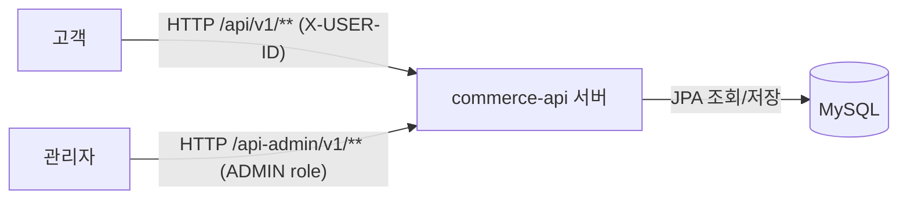
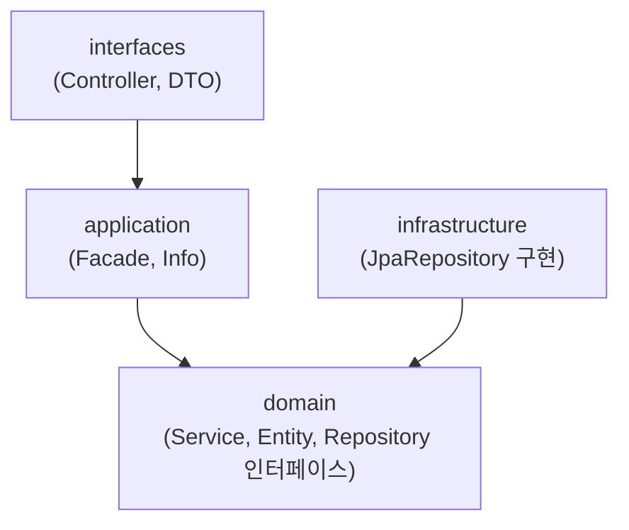
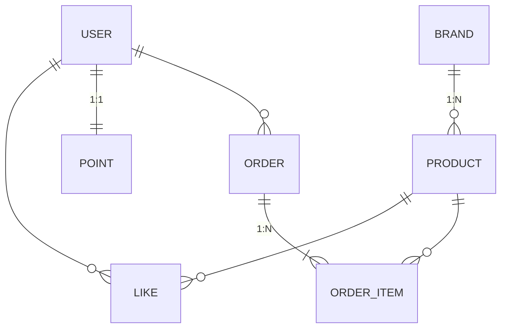
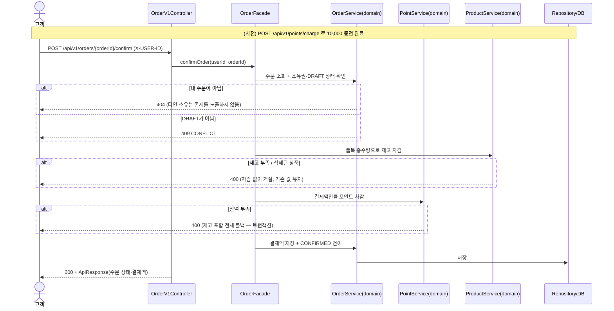

# 커머스 기본 기능 설계 — Week 2

브랜드·상품·좋아요·포인트·주문의 기본 기능을 설계한다.
도메인은 Week 1(쿠폰 할인 계약)과 별개지만, 다음 두 가지는 이어받는다.

- **기반 규약**: 응답 봉투(`ApiResponse<T>`), 오류 규약(400/404/409),
  사용자 식별(`X-USER-ID` 헤더) — Week 1에서 관찰·확정한 것
- **정리 방식**: 규칙에 기대값·반례를 붙이고, 결정에 버린 대안을 남기는 방법

쿠폰·할인은 이번 주 범위에 없다. Week 1의 INV-001..006은 쿠폰 도메인 전용
번호이므로 여기서 재사용하지 않는다 (같은 원칙이 필요한 곳엔 원칙만 가져온다).

## 1. 버드뷰

- 요청은 항상 바깥(고객·관리자)에서 서버로 들어오고, 서버만 DB와 대화한다.
- 고객과 관리자는 **경로 접두사(`/api` vs `/api-admin`)와 인증 방식**으로 구분한다.

## 2. 구조와 의존

| 계층 | 역할 | 허용 의존 |
|---|---|---|
| interfaces | HTTP 수신, 요청/응답 DTO 변환 | → application |
| application | 유스케이스 조립, 도메인 협력 조율, Info 모델 반환 | → domain |
| domain | 비즈니스 규칙·상태 변경, Repository **인터페이스** 정의 | (없음 — 아무 계층도 의존하지 않음) |
| infrastructure | domain의 Repository 인터페이스를 JPA로 구현 | → domain (의존성 역전) |

이 표의 규칙은 `ArchitectureTest`가 검사한다. 그림과 코드가 어긋나면 빌드가 실패한다.

## 3. 도메인 관계

### 책임 배치

| 데이터 | 두는 곳 | 변경 책임 | 이유 |
|---|---|---|---|
| 재고(stock) | `Product` 필드 | `Product.deductStock(quantity)` — 부족하면 도메인 예외 | 이번 주 범위에서 가장 단순. 동시성·이력 요구가 생기면 분리 재검토 (→ 7장 대안 비교) |
| 포인트 잔액 | 별도 `Point` 엔티티 (User와 1:1) | `Point.charge(amount)` / `Point.use(amount)` | User의 신원 책임과 돈 책임 분리. 이력 확장 대비 |
| 좋아요 수 | 저장하지 않음 — `Like` 관계에서 COUNT 조회 | — | 과제 지정("좋아요 수는 관계에서 조회"). 비정규화는 필요해질 때 |
| 주문 금액 | `Order`가 품목 합계·결제액을 **확정 시점에 저장** | `Order.confirm()` | 확정 후 상품 가격이 바뀌어도 결제액 불변 — Week 1의 "확정 결과 보존" 원칙과 같은 패턴(스냅샷) |
| 삭제 여부 | `deletedAt` 컬럼 (**논리 삭제**) | 관리자 삭제 API | 물리 삭제는 기존 주문의 상품 참조를 깨뜨림. 과제의 "저장된 주문 정보가 함께 지워지지 않도록" 조건 충족 |
| 삭제 판정 | Repository 조회 계약 — 고객용 조회는 삭제 제외가 기본(`findActive*`) | — | 판정 로직을 7곳에 복제하지 않기 위해 조회 계약으로 통일 (→ 7-3). 좋아요 취소만 삭제 포함 조회를 쓰는 명시적 예외 |
| 품목 단가 | `OrderItem.unitPrice` — DRAFT 생성 시점 스냅샷 | 주문 생성 | 확정 결제액은 이 단가 기준. 생성 후 상품 가격 변경의 영향을 받지 않음 (→ 7-4) |

### 상태

- `Order.status`: `DRAFT`(생성, 차감 없음) → `CONFIRMED`(확정, 재고·포인트 차감 완료). 전이는 이 한 방향만 허용.

## 4. 대표 흐름 — 포인트 충전 → 주문 확정

- 확정의 전 과정은 **하나의 트랜잭션** — 중간 실패 시 재고·포인트·주문 모두 원상태.
- 검증 순서(소유권 → 상태 → 재고 → 포인트)는 파사드가 숨기고, 외부에는 요청 1회만 노출한다.

## 5. API 계약

공통: 성공은 `ApiResponse.data`, 실패는 400(입력·규칙 위반) / 404(없음·소유 아님) /
409(상태 충돌) / 403(관리자 경계). 고객 API는 `X-USER-ID` 필수 — 누락·미존재 사용자는 거절.

### 고객

| 기능 | method/path | 입력 | 성공 | 대표 오류 |
|---|---|---|---|---|
| 브랜드 상세 | `GET /api/v1/brands/{brandId}` | brandId | 브랜드 정보 | 404 없거나 삭제됨 |
| 상품 목록 | `GET /api/v1/products` | `brandId?`, `sort?`(latest·price_asc·likes_desc), `page?`, `size?` | 상품 목록(브랜드명·좋아요 수 포함) | 400 잘못된 sort 값 |
| 상품 상세 | `GET /api/v1/products/{productId}` | productId | 상품+브랜드명+좋아요 수 | 404 없거나 삭제됨 |
| 좋아요 등록 | `POST /api/v1/products/{productId}/likes` | 헤더 사용자 | 200 (이미 있으면 그대로 200 — 멱등) | 404 삭제된 상품 |
| 좋아요 취소 | `DELETE /api/v1/products/{productId}/likes` | 헤더 사용자 | 200 (없으면 그대로 200 — 멱등) | — |
| 내 좋아요 목록 | `GET /api/v1/users/{userId}/likes` | userId = 본인 | 내 좋아요 상품 목록(삭제 상품 제외) | 404 타인 목록 요청 |
| 포인트 충전 | `POST /api/v1/points/charge` | `amount`(양의 정수) | 충전 후 잔액 | 400 음수·0·타입 오류·상한 초과 (기존 잔액 유지) |
| 잔액 조회 | `GET /api/v1/points` | 헤더 사용자 | 저장된 잔액 (0 허용) | 400 식별 누락 |
| 주문 생성 | `POST /api/v1/orders` | 품목 목록(productId, quantity) | DRAFT 주문 (중복 상품은 **합산**, 차감 없음) | 400 수량 0 이하·삭제 상품 |
| 주문 확정 | `POST /api/v1/orders/{orderId}/confirm` | orderId | CONFIRMED + 결제액 | 4장 흐름의 404/409/400 |
| 내 주문 목록·상세 | `GET /api/v1/orders`, `GET /api/v1/orders/{orderId}` | 헤더 사용자 | 품목·수량·금액·상태·결제액 | 404 타인 주문 (비노출) |

- 정렬 동률의 보조 기준: **`id desc`** (같은 가격·같은 좋아요 수면 최신 등록 우선). 모든 정렬에 일관 적용해 페이지 사이 중복·누락을 막는다.

### 관리자 (`/api-admin/**`, ADMIN role — 일반 사용자·미식별은 403)

| 기능 | method/path | 핵심 조건 |
|---|---|---|
| 브랜드 CRUD | `GET/POST /api-admin/v1/brands`, `GET/PUT/DELETE /api-admin/v1/brands/{brandId}` | 삭제되지 않은 상품이 연결된 브랜드는 삭제 거절(400) — 재고 0인 상품도 포함 |
| 상품 CRUD | `GET/POST /api-admin/v1/products`, `GET/PUT/DELETE /api-admin/v1/products/{productId}` | 존재·미삭제 브랜드만 참조, 이름 1~100자·가격 양의 정수, 수정 시 브랜드 변경 불가 |
| 재고 변경 | `PUT /api-admin/v1/products/{productId}/stock` | 0 이상의 **최종 수량**으로 설정(증감 아님). 삭제된 상품은 대상 아님(404) |
| 주문 목록·상세 | `GET /api-admin/v1/orders`, `GET /api-admin/v1/orders/{orderId}` | 구매자별 품목·상태·금액·결제 결과. 관리자 응답에는 구매자 식별 포함(고객 응답과 필드 구분) |

## 6. 주요 규칙 기대값

| ID | 규칙 | 기대값 예시 |
|---|---|---|
| R1 (재고) | 재고보다 큰 차감은 거절, 차감 없음 | 재고 5에서 6 차감 → 400, 재고 5 유지 / 2 차감 → 재고 3 |
| R2 (포인트) | 잔액 부족 결제 거절, 1P=1원, 0원 잔액 허용 | 잔액 0 + 10,000 충전 + 7,000 결제 → 잔액 3,000 |
| R3 (확정 보존) | CONFIRMED 주문의 결제액은 이후 불변 | 확정 후 상품 가격 변경 → 저장된 결제액 그대로 |
| R4 (소유권) | 내 주문·좋아요·포인트만 조회·변경 | 타인 X-USER-ID로 내 주문 확정 → 404 |
| R5 (좋아요 멱등) | 같은 사용자·상품 재요청은 효과 없음 | 좋아요 2번 → 관계 1개, 좋아요 수 1 |
| R6 (삭제 경계) | 삭제된 대상은 고객 조회·새 주문·수정에서 제외 | 삭제 상품 좋아요 → 404, 기존 내 좋아요는 취소 가능 |
| R7 (금액 상한) | 1회 충전 최대 1,000,000P, 잔액 최대 10,000,000P — **실습용 임시값** | 잔액 9,500,000에서 600,000 충전 → 400, 잔액 유지 |
| R8 (단가 스냅샷) | 확정 결제액은 DRAFT 저장 단가 기준 | DRAFT 후 가격 10,000→12,000 변경 → 확정 결제액은 10,000 기준 |

## 7. 설계 대안 비교 — 책임 중복·취약한 의존

설계 초안에서 책임이 겹치거나 변경에 취약한 지점을 점검하고,
대안의 비용을 비교해 선택한 기록.

### 7-1. 상품 조회 응답(상품+브랜드명+좋아요 수)의 조립 위치

| | 대안 A: Product 엔티티가 직접 제공 | 대안 B: application에서 조합 (선택) |
|---|---|---|
| 방식 | Product가 Brand 연관·Like 카운트를 로딩해 응답 형태까지 완성 | 파사드가 Product·Brand·Like 수를 각각 조회해 `ProductInfo`로 조립 |
| 비용 | 조회 코드는 짧지만 Product가 **응답 모양에 결합** | 조립 코드가 늘고 파사드가 커짐 |
| 반례 대입 | "브랜드 응답이 바뀌면 어떤 객체까지 바뀌는가?" → **Product 엔티티와 DTO까지 연쇄 수정** | → `ProductInfo` 조립부만 수정, domain 무변경 |

**선택: B.** 조회 결과의 조합은 유스케이스의 관심사이므로 application에 둔다.
Product에는 상품 자신의 규칙(가격·재고·삭제 여부)만 남긴다.

### 7-2. 재고의 위치 — Product 필드 vs 별도 Stock 엔티티

| | 대안 A: Product.stock 필드 (선택) | 대안 B: 별도 Stock 엔티티 |
|---|---|---|
| 비용 | 클래스 하나로 단순. 재고 이력·동시성 제어는 어려움 | 책임 분리는 깔끔하나 이번 주 요구엔 과설계 |
| 반례 대입 | "동시에 두 주문이 마지막 재고를 차감하면?" → 이번 주는 단일 트랜잭션 격리로 대응, 동시성 요구가 커지면 분리 재검토 | 지금 분리해도 사용처가 재고 변경 API 하나뿐 |

**선택: A.** 요구가 "최종 수량 설정 + 확정 시 차감"뿐이므로 단순하게 시작한다.
분리 조건(동시성·이력)이 오면 이 문서에서 재검토한다.

### 7-3. 삭제 판정 책임의 분산 — Repository 조회 계약 vs 서비스별 검증

R6(삭제 제외)을 지켜야 하는 유스케이스가 7곳(상품 목록·상세, 좋아요 등록,
내 좋아요 목록, 주문 생성·확정, 관리자 수정·재고)에 흩어져 있다.

| | 대안 A: Repository 조회 계약 (선택) | 대안 B: 서비스별 엔티티 검증 |
|---|---|---|
| 방식 | 고객용 조회는 삭제 제외가 기본(`findActive*`), 삭제 포함은 명시적 별도 메서드 | 사용처마다 `ensureVisible()` 호출 |
| 비용 | 메서드 수 증가, 이름 규약 필요 | 판정 코드 7회 복제 + 호출 누락 위험 |
| 반례 대입 | "새 조회 API가 추가되면?" → findActive만 쓰면 자동 안전 | → 검증 호출을 기억해야 안전 |

**선택: A.** 예외 1건을 계약에 명시한다 — 좋아요 취소는 삭제된 상품의 관계도
대상이므로(과제 조건) 삭제 포함 조회를 사용한다.

### 7-4. 가격의 이중 진실 — DRAFT 단가 vs 확정 시점 현재가

DRAFT 생성 후 관리자가 가격을 바꾸면 어느 가격으로 결제하는가가 미정이었다.

| | DRAFT 단가 그대로 (선택) | 확정 시 현재가 재계산 | 변경 감지 시 409 거절 |
|---|---|---|---|
| 비용 | 스냅샷 저장만으로 끝. 가격 인상 전 DRAFT 선점 악용 가능(실습 범위에선 수용) | 사용자가 본 가격 ≠ 결제 가격 | 비교 로직 + 재주문 마찰 |

**선택: DRAFT 단가 그대로 (사용자 확인, 2026-09-17).** 사용자가 본 가격이
결제 가격이라는 예측 가능성을 우선했다. → R8

### 7-5. 사용자 확인을 받은 미정 정책

| 정책 | 결정 | 이유 |
|---|---|---|
| 대표 흐름 선택 (09-17) | 포인트 충전→주문 확정 | 규칙(R1~R4)이 가장 많이 지나가는 경로, 최종 검증 시나리오와 일치 |
| 주문의 중복 상품 품목 (09-17) | **합산** | 클라이언트 실수에 관대, 총수량 재고 확인과 자연스럽게 연결 |
| 포인트 모델링 (09-17) | **별도 Point 엔티티** | 신원과 돈의 책임 분리, 이력 확장 대비 |
| 확정 시 가격 기준 (09-17) | **DRAFT 단가 스냅샷** | → 7-4, R8 |
| 금액 상한 (09-17) | **명시적 비즈니스 상한** (충전 100만·잔액 1,000만 — 실습용 임시값) | 표현 범위만 믿으면 오입력(0 하나 더)이 그대로 통과. 숫자의 근거는 없으므로 임시값으로 표시, 실제 서비스라면 정책 담당자 확인 필요 → R7 |
