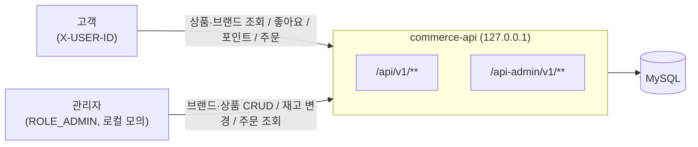
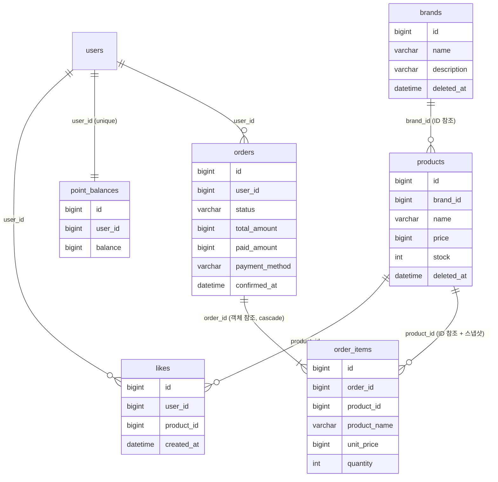
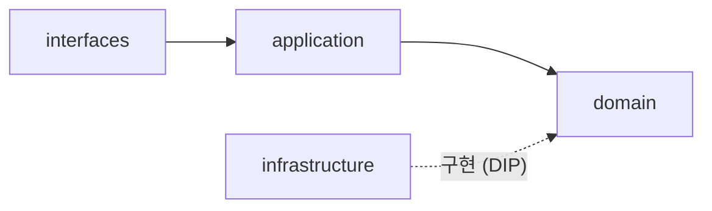
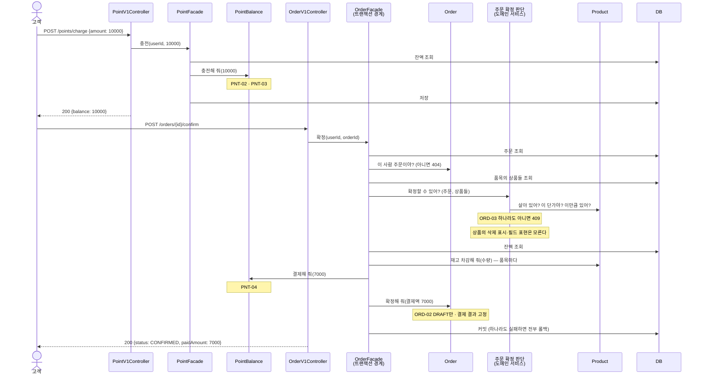

# 커머스 기본 기능 설계 (W2)

> **이 문서의 목표** — 고객·관리자의 요청이 HTTP → application → domain → repository·DB → 응답까지 어떻게 이어지는지, 그리고 **각 규칙에 누가 답하는지**를 구현 전에 합의한다.
>
> **작성 규칙** — 코드는 넣지 않는다. 규칙 ID·기대값·계약·결정과 그 이유만 남긴다. 구현하며 바뀐 판단은 [13. 변경 이력](#13-변경-이력)에 남기고 본문을 고친다.
>
> **1주차에서 이어받는 것** — 오류 구분 기준(10-1: 입력 오류 400 / 대상 없음 404 / 상태 충돌 409), 확정값 snapshot(10-2), 남의 자원은 존재를 숨기고 404(INV-001), 요청자 식별 `X-USER-ID`, AI 제안은 출처를 따져 채택·보류(3-4).
>
> **모델링 방법** — 참고 자료 「도메인 모델링 예시 (영화 예매)」의 순서를 따른다. 요구사항을 **"누가 이 질문에 답할 수 있는가"**로 바꿔 읽고(3장), **누가 누구를 알고 무엇을 주고받는지**를 먼저 정한 뒤(5장) 규칙과 API로 내려간다.

**결정 상태 표기** — ✅ 합의 (학습자 결정) · 🔧 기본값 (AI 제안, 이의 없으면 유지) · 🤔 결정 필요

| 상태 | 날짜 | 비고 |
|---|---|---|
| v0 초안 | 2026-09-15 | 정책 4개 합의 반영 |
| v0.1 | 2026-09-15 | 🤔-1(금액 규칙의 주인)·🤔-2(확정 재검증 위치) 결정 반영. AI 설계 리뷰 전 |

---

## 1. 버드뷰

- 서버 하나와 DB 하나로 모든 요구를 설명할 수 있으므로 이 구조에서 시작한다. 캐시(Redis)·메시징(Kafka)은 이번 요구에 필요한 이유가 없어 쓰지 않는다 (ADR-09).
- 고객과 관리자는 **같은 저장 데이터**를 다루지만 **입력·권한·응답 필드가 다른 계약**이다. 경로(`/api` vs `/api-admin`)와 controller·DTO를 나누고, application·domain은 함께 쓴다.

## 2. 정책 결정 목록

| # | 정책 | 결정 | 상태 |
|---|---|---|---|
| P-01 | 같은 상품이 주문 요청에 여러 번 오면 | **합산**해 한 품목으로 저장, 총수량으로 재고 확인 | ✅ |
| P-02 | 주문서(DRAFT) 후 확정 전에 가격이 바뀌면 | **확정 거절 409**, 고객은 새 주문 생성 (ADR-06) | ✅ |
| P-03 | 식별 누락·없는 사용자 | **401 UNAUTHORIZED 추가**. 남의 자원은 404 (ADR-07) | ✅ |
| P-04 | 좋아요 중복 등록·없는 좋아요 취소 | **둘 다 200 (멱등)**, 좋아요 수 불변 (ADR-08) | ✅ |
| P-05 | 브랜드·상품 삭제 방식 | 논리 삭제 (ADR-03) | 🔧 |
| P-06 | 상품 이름·가격 범위 | 이름 1–100자, 가격 1–100,000,000원 | 🔧 |
| P-07 | 브랜드 이름·설명 | 이름 1–50자 필수, 설명 0–200자 선택 | 🔧 |
| P-08 | 목록 페이지 | `page` ≥ 0 (기본 0), `size` 1–100 (기본 20), 범위 밖 400 | 🔧 |
| P-09 | 정렬 동률의 보조 기준 | 모든 정렬에서 `id desc` (나중에 등록된 상품 먼저) | 🔧 |
| P-10 | 삭제된 브랜드·상품의 관리자 조회 | 고객과 같이 404로 제외 | 🔧 |
| P-11 | 고객에게 재고 수량 노출 | 노출하지 않음 | 🔧 |
| P-12 | 브랜드 이름 중복 | 제한하지 않음 | 🔧 |

> 🔧 기본값은 "과제가 정하라고 했지만 답에 따라 설계 구조가 달라지지 않는 것"이다. 바꾸려면 이 표와 해당 규칙의 기대값만 고친다.

## 3. 요구사항이 던지는 질문 — 누가 답할 수 있는가

> **모든 규칙은 DB에서 불러온 뒤 판단한다.** 그래서 "조회가 필요한가"는 책임을 가르는 기준이 아니다.
> 기준은 **불러온 뒤 한 객체가 자기 필드만으로 답할 수 있는가**다. 답할 수 없으면 여러 행을 아는 **저장소**나, 여러 객체를 함께 보는 **조율자**가 답한다.

| 요구 | 질문 | 답할 수 있는 것 |
|---|---|---|
| 재고 차감·변경 | "재고가 충분한가, 차감하면 몇 개 남는가?" | 재고를 가진 것 → **Product** |
| 상품 등록·수정 | "이 이름·가격이 유효한가?" | 이름·가격을 가진 것 → **Product** |
| 확정 시 가격 확인 | "주문서의 단가가 지금 가격과 같은가?" | 현재 가격을 가진 것 → **Product** (묻는 쪽은 주문 확정 조율자) |
| 금액 | "이 금액이 유효한가, 더하거나 곱하면 얼마인가?" | 금액이라는 값 자체 → **Money** |
| 충전·결제 | "충전하면 얼마가 되는가, 이만큼 낼 수 있는가?" | 잔액을 가진 것 → **PointBalance** |
| 주문 합계·상태 | "합계가 얼마인가, 확정할 수 있는 상태인가?" | 품목과 상태를 가진 것 → **Order** |
| 품목 금액 | "이 품목은 얼마인가?" | 단가·수량을 가진 것 → **OrderItem** |
| 주문 소유 | "이 요청자가 이 주문의 주인인가?" | 주문자를 가진 것 → **Order** |
| 브랜드 삭제 조건 | "이 브랜드에 살아 있는 상품이 있는가?" | 상품들의 집합 → **Product 저장소**. Brand는 자기 상품을 모른다 |
| 좋아요 중복 | "이 사용자가 이 상품을 이미 좋아했는가?" | 관계들의 집합 → **Like 저장소 + DB unique 제약**. Like 한 건은 다른 행을 모른다 |
| 좋아요 수 | "이 상품의 좋아요는 몇 개인가?" | 관계들의 집합 → **Like 저장소 (COUNT)**. Product는 답하지 않는다 |
| 식별 | "이 요청자는 존재하는 사용자인가?" | 사용자들의 집합 → **User 저장소** |

## 4. 도메인 관계

| 타입 | 종류 | 책임 |
|---|---|---|
| User | Entity | 실습용 고객. 식별의 대상일 뿐 규칙이 없다 (fixture) |
| Brand | Entity | 이름·설명의 유효성 |
| Product | Entity | 이름·가격의 유효성, 재고의 유효성과 차감·최종값 설정. 브랜드는 식별자만 안다 |
| Like | Entity | 사용자–상품 관계 한 건. 식별자만 안다 |
| PointBalance | Entity | 잔액(Money)을 가지고, 충전·결제라는 **행동의 입력 조건과 업무 의미**를 책임진다 |
| Order | Entity | 품목 목록·합계·상태·결제 결과. 주문자는 식별자만 안다 |
| OrderItem | Entity (Order에 속함) | 주문 당시 상품명·단가(snapshot)와 수량, 품목 금액 |
| Money | Value Object | 원 단위 정수 금액이라는 **값의 유효성**(음수 불가)과 **안전한 연산**(넘침·음수 결과 거절) |
| 주문 확정 판단 | Domain Service | 자기 상태 없이, 주문 품목과 상품들을 함께 보고 확정 가능 여부를 답한다 (ADR-05) |

- **Entity·VO·도메인 서비스를 가르는 기준** — 식별자가 있고 상태가 바뀌면 Entity, 값을 가지며 값으로 비교하고 불변이면 VO, **가진 상태 없이** 한 엔티티에 속하지 않는 판단만 하면 도메인 서비스다. 판단 로직만 있고 값이 없는 객체는 VO가 아니다.

- 선은 **업무 관계**다. 객체 참조로 구현하는 것은 **함께 생성되고 함께 바뀌는** Order–OrderItem 하나다 (ADR-01).
- `order`는 MySQL 예약어이므로 테이블명은 `orders`.
- 로컬·테스트는 `ddl-auto: create`로 엔티티에서 스키마를 만든다. unique 제약(`likes(user_id, product_id)`, `point_balances(user_id)`)은 엔티티 매핑에 선언해야 DB에 생긴다.
- 재고는 영화 예매 예시의 `Screening.remainingSeats`처럼 Product 안의 필드와 행동으로 둔다. 별도 `Stock` 타입은 재고 규칙이 Product 밖에서 재사용될 때 분리한다 🔧.

## 5. 누가 누구를 아는가 — 화살표와 메시지

### 5-1. 객체 사이

> 읽어야 할 것은 **없는 화살표**다. 오른쪽 열(보내는 쪽이 모르는 것)이 많을수록 그 화살표는 덜 부러진다.

| 누가 → 누구를 | 보내는 메시지 | 보내는 쪽이 모르는 것 |
|---|---|---|
| 주문 확정 조율자 → Order | 소유 확인, 확정 요청 (결제액 전달) | 상태 전이 규칙, 합계 계산 방식 |
| 주문 확정 조율자 → 주문 확정 판단 | "이 주문을 이 상품들로 확정할 수 있는가?" | 무엇을 어떤 순서로 확인하는지 |
| 주문 확정 판단 → Product | "살아 있는가?", "이 단가로 팔고 있는가?", "이 수량만큼 있는가?" | 삭제 표시 방식, 가격·재고를 어떤 필드로 들고 있는지 |
| 주문 확정 조율자 → Product | 재고 차감 요청 (수량 전달) | 재고를 어떻게 세는지, 검증 순서 |
| 주문 확정 조율자 → PointBalance | 결제 요청 (금액 전달) | 잔액 부족을 어떻게 판단하는지 |
| Order → OrderItem | 품목 금액 요청 | 단가×수량 계산 방식 |
| 포인트 충전 조율자 → PointBalance | 충전 요청 (금액 전달) | 충전액 조건과 합산 범위 확인 방식 |
| 브랜드 삭제 조율자 → Product 저장소 | 살아 있는 상품 존재 여부 | 논리 삭제 컬럼 |
| 상품 조회 조율자 → Brand·Like 저장소 | 브랜드 정보, 좋아요 수 | 집계 쿼리 |
| PointBalance → Money | "잔액보다 큰가?", 더하기·빼기 | 넘침을 어떻게 감지하는지 |
| Product · Order · OrderItem → Money | 유효한 금액 생성, 더하기·곱하기, 같은 금액인가 | 금액의 내부 표현 |

**없는 화살표 (의도적으로 모르게 한 것)**

- **Order ↛ PointBalance** — 주문은 잔액을 모른다. "상품이 사용자 잔액까지 직접 변경하지 않는다"(발제)와 같은 이유로, 조율자가 둘을 각각 부른다.
- **Order ↛ Product** — 주문은 상품 객체가 아니라 `productId`와 주문 당시 상품명·단가를 가진다. 상품 가격이 바뀌어도 저장된 주문은 바뀌지 않는다. 둘을 함께 봐야 하는 확정 재검증은 **주문 확정 판단(도메인 서비스)**이 양쪽을 알고, Order와 Product는 서로 모른다 (ADR-05).
- **Product ↛ Brand, Product ↛ Like** — 상품은 `brandId`만 알고, 좋아요 수는 모른다. 브랜드 응답이 바뀌어도 Product는 바뀌지 않는다 (ADR-01·02).
- **Like ↛ User·Product 객체** — 식별자만 안다.
- **PointBalance ↛ 누구도** — Money만 안다. Order도 User도 모른다.
- **Money ↛ 아무도** — 모두가 Money를 알지만 Money는 도메인의 무엇도 모른다.

### 5-2. 계층 사이

| 계층 | 패키지 | 맡는 일 | 직접 의존하지 않을 것 |
|---|---|---|---|
| interfaces | `interfaces.api.{기능}`, `interfaces.api.admin.{기능}` | HTTP 입력 파싱, 요청자 식별값 전달, 응답 DTO 변환, 오류의 HTTP 매핑 | infrastructure |
| application | `application.{기능}` (`*Facade`, `*Info`) | 유스케이스 순서 조율, **여러 도메인에 걸친 트랜잭션 경계**, 조회 결과 조합 (= 5-1의 "조율자") | interfaces, infrastructure |
| domain | `domain.{기능}` (`*Model`, `*Service`, `*Repository`, `Money`) | 상태와 규칙, 한 도메인 안의 저장 약속(Repository 인터페이스) | interfaces, application, infrastructure |
| infrastructure | `infrastructure.{기능}` (`*JpaRepository`, `*RepositoryImpl`) | Repository 약속의 JPA·QueryDSL 구현 | HTTP 응답 정책, 업무 규칙 중복 |

- **domain은 아무도 모른다** — 예시의 Money·Screening처럼. ArchUnit의 `domain → interfaces·application·infrastructure 금지`가 이 문장을 기계로 확인한다.
- **infrastructure → domain 화살표는 실행 방향과 반대다** — 실행 중에는 application이 JPA 구현을 호출하지만, 소스에서는 구현이 domain의 Repository 약속을 안다. 이것이 DIP다.
- 스타터의 `ExampleService`가 `domain`에 있으므로 관례를 따른다. **domain의 `*Service` = 한 도메인의 저장소 사용 + 엔티티 행동 호출**, **application의 `*Facade` = 여러 도메인 조율과 응답 조합**.
- 엔티티에 JPA 애노테이션을 두는 것은 허용한다 🔧. JPA 모델과 도메인 모델을 분리하면 매핑 코드가 두 배가 되는데, 이번 범위에는 그 비용을 정당화할 저장 기술 교체 요구가 없다.

| 검사 규칙 | 수단 |
|---|---|
| domain → interfaces·application·infrastructure 금지 | ArchUnit `ArchitectureTest` |
| application → interfaces·infrastructure 금지 | ArchUnit `ArchitectureTest` |
| interfaces → infrastructure 금지 | ArchUnit `ArchitectureTest` |
| 와일드카드 import·미사용 import 금지 | Checkstyle |

## 6. 규칙과 기대값

> 규칙 ID는 테스트 `@DisplayName`에 그대로 쓴다. 의미를 바꿔 재사용하지 않는다.
> **거절 예의 기대 결과에는 항상 "기존 값 유지"를 함께 확인한다** — "예외가 발생한다"만 보면 값을 바꾼 뒤 던지는 구현도 통과한다 (예시 자료의 좌석 테스트).

### 6-1. 사용자 식별

| ID | 규칙 | 정상 예 | 거절 예 → 기대 결과 | 답하는 것 |
|---|---|---|---|---|
| USR-01 | 고객 API는 `X-USER-ID`로 존재하는 사용자를 식별한다 | `X-USER-ID: 1`(존재) → 처리 | 헤더 누락 / `abc` / 존재하지 않는 `999` → `401`, 저장 데이터 변화 없음 | interfaces(헤더) + User 저장소(존재) |

### 6-2. 브랜드

| ID | 규칙 | 정상 예 | 거절 예 → 기대 결과 | 답하는 것 |
|---|---|---|---|---|
| BRD-01 | 이름은 앞뒤 공백 제거 후 1–50자, 설명은 0–200자 | `"나이키"` | `"   "`, 51자 → `400` | Brand |
| BRD-02 | 삭제되지 않은 상품이 연결된 브랜드는 삭제할 수 없다 (재고 0 상품 포함) | 연결 상품이 모두 삭제됨 → 삭제 성공 | 재고 0인 살아 있는 상품 1개 → `409`, 브랜드 유지 | Product 저장소 + 조율자 |
| BRD-03 | 삭제된 브랜드는 조회·수정·상품 등록의 대상이 아니다 | — | 삭제된 브랜드 상세 → `404` | Brand 저장소 |

### 6-3. 상품

| ID | 규칙 | 정상 예 | 거절 예 → 기대 결과 | 답하는 것 |
|---|---|---|---|---|
| PRD-01 | 이름 1–100자, 가격 1–100,000,000원, 초기 재고 ≥ 0 | 가격 1, 재고 0 | 가격 0 / 100,000,001 / 재고 -1 → `400` | Product |
| PRD-02 | 등록 시 존재하며 삭제되지 않은 브랜드를 참조한다 | — | 삭제된 브랜드 ID → `404` | Brand 저장소 + 조율자 |
| PRD-03 | 수정은 이름·가격만 바꾸고 브랜드는 유지한다 | 가격 1,000 → 2,000 | 수정 요청에 `brandId`를 보내도 반영되지 않음 | Product |
| PRD-04 | 관리자 재고 변경은 0 이상의 **최종 수량**으로 설정한다 | 5 → 0 설정 | -1 → `400`, 기존 재고 유지 | Product |
| PRD-05 | 재고 차감은 양수 수량만, 보유량 이하만 허용한다 | 5에서 2 차감 → 3 / 5에서 5 차감 → 0 | 5에서 6 차감 → 거절, **재고 5 유지** / 0 이하 수량 → 거절 | Product |
| PRD-06 | 삭제된 상품은 고객 조회·수정·재고 변경·새 좋아요·새 주문의 대상이 아니다 | — | 삭제된 상품 상세 → `404` | Product |

### 6-4. 좋아요

| ID | 규칙 | 정상 예 | 거절·경계 예 → 기대 결과 | 답하는 것 |
|---|---|---|---|---|
| LIK-01 | 한 사용자–상품 관계는 하나만 저장한다 | — | 같은 등록이 동시에 두 번 와도 행은 1개 | DB unique 제약 |
| LIK-02 | 등록·취소는 멱등이다 | 이미 좋아요한 상품 재등록 → `200`, 좋아요 수 불변 / 관계 없는 취소 → `200` | — | Like 저장소 + 조율자 |
| LIK-03 | 삭제된 상품에는 새 좋아요를 할 수 없지만, 남은 내 관계는 취소할 수 있다 | 삭제된 상품의 기존 좋아요 취소 → `200` | 삭제된 상품에 등록 → `404` | Product + 조율자 |
| LIK-04 | 좋아요 수는 관계의 개수다 | 사용자 3명이 좋아요 → `likeCount = 3` | — | Like 저장소 |
| LIK-05 | 내 좋아요 목록은 본인만 조회하며 삭제된 상품은 제외한다 | — | 경로 `userId` ≠ 요청자 → `404` | 조율자 |

### 6-5. 포인트

| ID | 규칙 | 정상 예 | 거절 예 → 기대 결과 | 답하는 것 |
|---|---|---|---|---|
| PNT-01 | 잔액은 0 이상이다. **0원은 유효한 잔액**이다 | 새 사용자 잔액 0 조회 → `200`, `0` | — | **Money** (0 허용·음수 거절) |
| PNT-02 | 충전액은 **양의 정수**다. 0원은 충전이 아니다 | 0에서 10,000 충전 → 10,000 | `0` / `-1` / 누락 / `"abc"` / `1.5` / long 범위 초과 → `400`, **기존 잔액 유지** | **PointBalance** 충전의 입력 조건 (형식 오류는 interfaces) |
| PNT-03 | 충전 후 잔액이 저장 범위를 넘으면 거절한다 | — | 잔액 `Long.MAX - 1`에 2 충전 → `409`, 기존 잔액 유지 | 넘침 감지는 **Money**, "충전 거절"로 해석은 **PointBalance** |
| PNT-04 | 결제액이 잔액보다 크면 거절한다 | 10,000에서 7,000 결제 → 3,000 / 7,000에서 7,000 결제 → 0 | 3,000에서 7,000 결제 → 거절, 잔액 3,000 유지 | "잔액 부족" 판단은 **PointBalance**, 음수 결과 방어는 **Money** |

- PNT-02와 PNT-03의 HTTP 오류가 다른 이유 — 충전액 `0`은 **요청 값 자체**가 틀렸고(400), 합산 초과는 요청은 정상이지만 **현재 잔액과 충돌**한다(409). 1주차 10-1 기준.
- 누락·`"abc"`·범위 초과는 JSON을 읽는 단계(interfaces)에서 걸린다. `0`·`-1`은 읽기에는 성공하므로 도메인이 거절해야 한다.

### 6-6. 주문

| ID | 규칙 | 정상 예 | 거절 예 → 기대 결과 | 답하는 것 |
|---|---|---|---|---|
| ORD-01 | 생성: 품목 ≥ 1, 수량 > 0, 상품이 존재하며 삭제되지 않음. 같은 상품은 합산. 상품명·단가를 복사(snapshot)하고 합계를 계산해 **DRAFT로 저장. 재고·포인트는 차감하지 않는다** | `[{p1,2},{p1,3},{p2,1}]` → 품목 2개(p1×5, p2×1), 합계 = 단가×수량의 합 | 빈 품목 / 수량 0 → `400`, 없는·삭제된 상품 → `404`, 주문 저장 안 됨 | Order·OrderItem (+ 상품 존재는 조율자) |
| ORD-02 | 확정은 **본인의 DRAFT 주문**만 가능하다 | — | 남의 주문 → `404` / 이미 CONFIRMED → `409` | Order |
| ORD-03 | 확정 시 재검증: 모든 품목의 상품이 존재·미삭제, **현재 가격 = 품목 단가**, 재고 ≥ 품목 수량 | — | 확정 전에 상품 삭제 / 가격 변경 / 재고 부족 → `409` | **주문 확정 판단** (도메인 서비스)이 Product에 묻는다 |
| ORD-04 | 확정 시 잔액 ≥ 주문 합계 | — | 잔액 부족 → `409` | PointBalance (PNT-04) |
| ORD-05 | 확정은 **재고 차감 + 포인트 차감 + 결제 결과 저장 + CONFIRMED 변경이 한꺼번에** 일어나거나 아무것도 일어나지 않는다 | 잔액 10,000, 합계 7,000 → 주문 `CONFIRMED`, `paidAmount 7,000`, `paymentMethod POINT`, 잔액 3,000, 재고 감소 | ORD-02~04 중 하나라도 실패 → 재고·잔액·주문 상태 모두 요청 전과 동일 | 조율자의 트랜잭션 |
| ORD-06 | 고객은 본인 주문만, 관리자는 모든 구매자의 주문을 조회한다 | — | 고객이 남의 주문 상세 → `404` | Order + 조율자 |

- 생성에서 "없는 상품"은 `404`인데 확정에서 "삭제된 상품"은 `409`인 이유 — 생성 요청은 **상품 자체를 가리키므로** 대상이 없는 것이다. 확정 요청은 **주문을 가리키고 그 주문은 존재하므로**, 상품이 사라진 것은 주문의 현재 상태와의 충돌이다.

## 7. API 계약

> 공통 응답 형식: `ApiResponse{meta{result, errorCode, message}, data}`. 오류 코드: `400 Bad Request` · `401 Unauthorized`(추가) · `404 Not Found` · `409 Conflict`.

### 7-1. 고객 API (🔑 = `X-USER-ID` 필요)

| 기능 | method · path | 입력 | 성공 `data` | 대표 오류 |
|---|---|---|---|---|
| 브랜드 상세 | `GET /api/v1/brands/{brandId}` | — | `id, name, description` | 없음·삭제 404 |
| 상품 목록 | `GET /api/v1/products` | `brandId?`, `sort = latest(기본)·price_asc·likes_desc`, `page`, `size` | `content[{id, name, price, brand{id, name}, likeCount}]`, `page, size, totalElements` | 알 수 없는 `sort`·범위 밖 `page/size` 400. 없는 `brandId`는 빈 목록 |
| 상품 상세 | `GET /api/v1/products/{productId}` | — | `id, name, price, brand{id, name}, likeCount` | 없음·삭제 404 |
| 좋아요 등록 🔑 | `POST /api/v1/products/{productId}/likes` | — | `productId, liked=true` | 401, 없음·삭제 상품 404. 중복은 200 |
| 좋아요 취소 🔑 | `DELETE /api/v1/products/{productId}/likes` | — | `productId, liked=false` | 401. 관계 없음·삭제 상품도 200 |
| 내 좋아요 목록 🔑 | `GET /api/v1/users/{userId}/likes` | — | `[{productId, name, price, brand{id, name}, likedAt}]` 좋아요 최신순 | 401, 경로 userId ≠ 요청자 404 |
| 포인트 충전 🔑 | `POST /api/v1/points/charge` | `{amount}` | `balance` (충전 후) | 401, PNT-02 400, PNT-03 409 |
| 잔액 조회 🔑 | `GET /api/v1/points` | — | `balance` | 401 |
| 주문 생성 🔑 | `POST /api/v1/orders` | `{items[{productId, quantity}]}` | `id, status=DRAFT, items[{productId, productName, unitPrice, quantity, amount}], totalAmount` | 401, 400, 404 |
| 주문 확정 🔑 | `POST /api/v1/orders/{orderId}/confirm` | — | `id, status=CONFIRMED, totalAmount, paidAmount, paymentMethod, confirmedAt` | 401, 404(남의·없는 주문), 409(ORD-02~04) |
| 내 주문 목록 🔑 | `GET /api/v1/orders` | `page`, `size` | `content[{id, status, totalAmount, paidAmount?, createdAt}]` 최신순 | 401 |
| 내 주문 상세 🔑 | `GET /api/v1/orders/{orderId}` | — | `id, status, items[...], totalAmount, paidAmount?, paymentMethod?, confirmedAt?` | 401, 404 |

### 7-2. 관리자 API (ROLE_ADMIN)

| 기능 | method · path | 입력 | 성공 `data` | 대표 오류 |
|---|---|---|---|---|
| 브랜드 목록·등록 | `GET`·`POST /api-admin/v1/brands` | 목록 `page, size` / 등록 `{name, description?}` | `id, name, description, createdAt, updatedAt` | 400 |
| 브랜드 상세·수정·삭제 | `GET`·`PUT`·`DELETE /api-admin/v1/brands/{brandId}` | 수정 `{name, description?}` | 상세·수정은 위와 같음, 삭제는 `null` | 404, 400, BRD-02 409 |
| 상품 목록·등록 | `GET`·`POST /api-admin/v1/products` | 목록 `brandId?, page, size` / 등록 `{brandId, name, price, stock}` | `id, brandId, name, price, stock, createdAt, updatedAt` | 400, PRD-02 404 |
| 상품 상세·수정·삭제 | `GET`·`PUT`·`DELETE /api-admin/v1/products/{productId}` | 수정 `{name, price}` | 위와 같음, 삭제는 `null` | 404, 400 |
| 재고 변경 | `PUT /api-admin/v1/products/{productId}/stock` | `{stock}` | 위와 같음 | 404, PRD-04 400 |
| 주문 목록 | `GET /api-admin/v1/orders` | `userId?, page, size` | `content[{id, userId, status, totalAmount, paidAmount?, createdAt}]` | 400 |
| 주문 상세 | `GET /api-admin/v1/orders/{orderId}` | — | 고객 상세 + `userId` | 404 |

- **고객·관리자 응답 필드의 차이** — 고객은 구매 판단에 필요한 `brand{name}`·`likeCount`를 보고, 재고 수량·생성/수정 시각은 보지 않는다. 관리자는 운영에 필요한 `stock`·`brandId`·시각·구매자 `userId`를 본다.
- **관리자 접근 거절** — 일반 사용자·식별 없는 요청은 과제 제공 Security 설정에서 `403`으로 거절된다. 필터에서 끊기므로 이 응답은 `ApiResponse` 형식이 **아니다** (Spring 기본 오류 응답). 로컬 모의 관리자 경계라는 전제에서 수용한다.

## 8. 대표 흐름 — 포인트 충전 → 주문 확정

> 선택 이유: 네 도메인(User·Product·PointBalance·Order)이 한 트랜잭션에서 협력하고, 과제의 연결 흐름(잔액 0 → 10,000 충전 → 7,000 결제 → 3,000)이 그대로 검증 시나리오가 된다.

- **순서의 의도** — 발제의 "전체 입력과 필요한 재고·잔액을 확인한 뒤 변경 행동을 호출"을 따라 재검증을 먼저 끝내고 변경을 호출한다. 변경 도중 실패해도 트랜잭션 롤백이 최종 안전장치다.
- **호출자가 모르는 것** — 컨트롤러는 조회·검증·차감 순서를 모른다. Product는 잔액을, PointBalance는 주문을 모른다.

## 9. 설계 결정 (ADR)

> 형식: 상황 / 선택 / 버린 대안과 비용 / 다시 검토할 조건

### ADR-01. 도메인 사이는 ID로 참조하고, Order–OrderItem만 객체로 묶는다 🔧

- **상황** — Product는 Brand를, Like·Order는 User·Product를 알아야 한다. JPA는 `@ManyToOne` 객체 참조를 쉽게 만들어 준다.
- **선택** — `Product.brandId`, `Like.userId/productId`, `Order.userId`, `OrderItem.productId`는 ID만 보관한다. Order–OrderItem은 **함께 생성되고 따로 바뀌지 않으므로** 객체 참조(cascade)로 묶는다.
- **기준** — 객체 참조는 "같은 트랜잭션에서 함께 생성·변경되는가"로 정한다. "화면에 같이 보여 주는가"는 기준이 아니다 — 그건 조회 조합(ADR-02)의 문제다.
- **버린 대안** — `Product → @ManyToOne Brand`.
  - 반례 "**브랜드 응답이 바뀌면 어떤 객체까지 바뀌는가?**"를 대입하면, 객체 참조는 브랜드 로딩(지연 로딩·N+1)을 Product 엔티티가 떠안고 브랜드 변경의 영향이 상품 모델까지 번진다. ID 참조면 **Product는 바뀌지 않고** 조합하는 application만 바뀐다.
- **감수하는 비용** — 브랜드 정보를 붙이려면 application이 브랜드를 따로(IN 조회로 한 번에) 가져와 조합해야 한다.
- **재검토 조건** — 상품과 브랜드를 항상 함께 수정하는 요구가 생길 때.

### ADR-02. 상품 조회 결과의 조합은 application이, 좋아요순 정렬은 infrastructure 쿼리가 맡는다 🔧

- **상황** — 상품 목록·상세는 상품 + 브랜드 + 좋아요 수를 보여 줘야 하고, `likes_desc`는 좋아요 수로 정렬해야 한다.
- **선택** — `ProductFacade`가 상품·브랜드·좋아요 수를 조회해 `*Info`로 조합한다. `likes_desc`는 페이지 단위로 DB에서 정렬해야 하므로 infrastructure에서 `likes`를 집계하는 QueryDSL 쿼리로 구현하고, domain에는 "조건에 맞는 상품 페이지를 달라"는 약속만 둔다.
- **버린 대안** — Product(또는 domain `ProductService`)가 브랜드·좋아요 조회와 응답 조합까지 맡기.
  - 비용: 상품 규칙(가격·재고)과 조회 화면 요구(브랜드명·좋아요 수)라는 **서로 다른 변경 이유**가 한 클래스에 모인다(SRP). "재고는 음수가 되지 않는다(상태의 규칙)"와 "목록에 브랜드명을 보여 준다(조회 결과의 구성)"는 다른 종류의 요구다.
- **감수하는 비용** — Facade에 조회를 조율하는 코드가 생긴다.
- **재검토 조건** — 좋아요 수 집계가 느려져 별도 카운터가 필요해질 때 (그때 관계–카운터 정합성 책임이 새로 생긴다).

### ADR-03. Brand·Product는 논리 삭제, Like는 물리 삭제, Order는 삭제하지 않는다 🔧

- **상황** — 주문 품목과 좋아요가 `productId`를 참조한다. 과제는 "기존 참조가 깨지거나 저장된 주문 정보가 함께 지워지지 않도록" 요구한다.
- **선택**
  - Brand·Product: `BaseEntity.deletedAt`으로 논리 삭제. 행이 남으므로 과거 주문의 `productId`가 가리키는 대상이 사라지지 않는다. 대신 **"행이 있다 ≠ 사용 가능하다"**이므로 고객 조회·새 주문·수정 경로에서 삭제 여부를 확인한다 (PRD-06, BRD-03).
  - Like: 물리 삭제. 이력 요구가 없는 관계이고, 논리 삭제로 두면 `unique(user_id, product_id)`와 재등록이 충돌해 "삭제된 행 복원" 규칙이 추가로 필요하다.
  - Order: 삭제 API가 없다.
- **버린 대안** — 전부 물리 삭제. 상품을 지우면 주문 품목의 참조가 끊기거나 연쇄 삭제로 주문 정보가 사라진다.
- **부수 효과** — BRD-02 덕분에 **"삭제된 브랜드에 속한 살아 있는 상품"은 생길 수 없다.** 그래서 고객 상품 조회는 상품의 삭제 여부만 봐도 된다.
- **재검토 조건** — 복원(restore) API나 개인정보 파기 요구가 생길 때.

### ADR-04. 포인트 잔액은 별도 `PointBalance` 엔티티로 둔다 🔧

- **상황** — 잔액은 충전·결제로 자주 바뀌고, 사용자 정보는 거의 바뀌지 않는다.
- **선택** — `point_balances(user_id unique, balance)`. 실습용 사용자 fixture를 만들 때 **잔액 0으로 함께 생성**해, "행이 없으면 만든다"는 분기와 그 동시 생성 경쟁을 없앤다.
- **버린 대안**
  - `User.balance` 컬럼: 변경 이유가 다른 두 상태(프로필 vs 금액)가 한 엔티티에 모이고, 잔액 규칙이 User의 책임이 된다.
  - 포인트 원장(적립·사용 이력 + 적립 건별 그룹 차감, 참고 코드 temp-test 방식): 부분 취소·만료를 추적할 수 있지만 이번 요구(충전·조회·결제)에 없는 기능을 위해 테이블 2개와 합산 규칙이 늘어난다.
- **재검토 조건** — 포인트 만료·부분 환불·이력 조회 요구가 생길 때 (ADR-09).

### ADR-05. 주문 확정 재검증(ORD-03)은 domain의 도메인 서비스가 판단한다 ✅

- **상황** — 확정 시 "모든 품목의 상품이 살아 있고, 가격이 같고, 재고가 충분한가"를 판단해야 한다. 이 판단은 주문 품목과 상품 여러 개를 **함께** 봐야 해서 어느 한 엔티티에 자연스럽게 속하지 않는다.
- **선택** — domain에 **주문 확정 판단**(상태 없는 도메인 서비스)을 둔다. 주문과 상품들을 받아 Product에 "살아 있는가·이 단가인가·이만큼 있는가"를 묻고, 하나라도 아니면 거절한다. `OrderFacade`는 조회·호출 순서·트랜잭션만 맡는다.
- **버린 대안**
  - (A) Facade가 직접 확인: 클래스는 늘지 않지만 업무 규칙이 application에 흩어지고, 같은 판단이 다른 경로(배치 등)에서 반복되며, Spring 없이 테스트하기 어렵다.
  - (C) Order 엔티티가 판단: 주문 규칙이 한곳에 모이지만 **Order가 Product를 알게 되어** 5-1의 "Order ↛ Product"가 깨지고, 가격 비교를 위해 Product 내부를 묻기 쉽다.
- **B와 C의 차이는 화살표다** — C는 Order → Product 화살표가 생긴다. B는 판단 객체가 양쪽을 알고, Order와 Product는 서로 모른다.
- **감수하는 비용** — 클래스 하나가 늘어난다. 판단 대상이 세 가지(삭제·가격·재고)라 이름을 붙일 만한 크기로 판단했다.
- **재검토 조건** — 구현해 보니 판단이 한두 줄로 줄어 클래스가 설명보다 무거우면 (A)로 합치고 [13. 변경 이력](#13-변경-이력)에 남긴다.

### ADR-06. 확정 전에 가격이 바뀌었으면 확정을 거절한다 ✅

- **상황** — 주문서(DRAFT)를 만든 뒤 결제하기 전에 관리자가 가격을 바꿀 수 있다.
- **선택** — 확정 시 품목 단가 ≠ 현재 가격이면 `409`. 재고·잔액은 바뀌지 않고 고객은 새 주문을 만든다.
- **버린 대안**
  - DRAFT 금액 유지: 가장 단순하지만 가격이 오르면 판매자가 손해를 본다.
  - 확정 시 재계산: 고객이 본 금액과 실제 결제액이 **조용히** 달라진다.
- **근거** — 일반 쇼핑몰은 결제 직전에 가격·재고를 재검증하고, 바뀌었으면 결제를 막고 주문서를 다시 보여 준다. 확정 시 어차피 상품 존재·삭제·재고를 재검증하므로(ORD-03) 같은 자리에 비교 하나가 늘어나는 비용이다.
- **재검토 조건** — "가격 인하는 허용" 같은 비대칭 정책이나 가격 보장 기간 요구가 생길 때.

### ADR-07. 식별 실패는 `401`을 추가해 표현한다 ✅

- **상황** — 1주차 C-2는 오류를 기존 `ErrorType` 4종으로 제한했고 확장은 먼저 논의하기로 했다. 식별 누락·없는 사용자를 `400`/`404`로 표현하면 클라이언트가 "내가 식별되지 않음"과 "상품이 없음"을 구분할 수 없다.
- **선택** — `UNAUTHORIZED(401)` 추가. 남의 주문·좋아요 목록은 1주차 INV-001 기준으로 `404`(존재를 드러내지 않음).
- **버린 대안** — `403`까지 추가해 남의 자원을 `403`으로: 남의 주문이 존재한다는 사실을 드러낸다.
- **함께 고칠 것** — 스타터 `ApiControllerAdvice`에 헤더 누락 예외 처리가 없어 현재는 `500`이 된다. 식별 처리에서 `401`로 매핑한다.

### ADR-08. 좋아요 등록·취소는 멱등이다 ✅

- **상황** — 따닥 클릭·네트워크 재시도로 같은 요청이 여러 번 온다.
- **선택** — 최종 상태가 요청과 같으면 `200`. 등록 중복은 unique 제약이 최종 보장하고, 제약 위반은 "이미 좋아요함"으로 해석한다.
- **버린 대안** — 중복 등록 `409`·없는 취소 `404`: 상태를 정확히 알려 주지만, 재시도한 클라이언트가 실제로는 원하는 상태인데 실패를 받는다. 1주차 A-3("같은 요청은 결과 재사용")과 같은 기준.

### ADR-09. 보류한 결정 — 지금 하지 않고 도입 조건만 남긴다 ✅

| 항목 | 지금 하지 않는 이유 | 도입 조건 |
|---|---|---|
| Transactional outbox | 커밋 후 외부(Kafka 등)로 전달할 이벤트가 이번 요구에 없다. 발제: "하나의 서버와 DB로 설명할 수 있다면 그 구조에서 시작" | 주문 확정 후 알림·집계처럼 **유실되면 안 되는 외부 전달**이 생길 때 |
| 동시성 제어 (락·조건부 UPDATE·`@Version`) | 이번 체크리스트에 동시 요청 요구가 없다. 단, **동시 확정 시 재고 초과 판매·잔액 갱신 유실 위험이 있음**을 알고 둔다 | 동시 요청 요구·테스트가 생길 때. 후보: 재고는 조건부 UPDATE 또는 비관적 락, 잔액은 비관적 락 또는 `@Version` |
| 포인트 원장 | ADR-04 | 만료·부분 환불·이력 요구 |
| 좋아요 카운터 컬럼 | 과제가 "좋아요 수는 관계에서 조회" 요구 | 집계 쿼리 성능 문제가 측정될 때 |

## 10. 결정 기록 🤔

### 🤔-1. 금액 규칙은 Money와 PointBalance 중 누가 답하는가 ✅

> 예시 자료 원칙 5: **값의 유효성과 값 사이의 관계는 다른 규칙이다.**

- **관계** — Money는 VO, PointBalance는 Entity다. PointBalance가 잔액으로 Money를 **가진다** (예시의 `Movie`가 `fee: Money`를 가지는 것과 같다).

| 규칙 | 학습자 첫 판단 | 결정 | 이유 |
|---|---|---|---|
| PNT-01 잔액 0 허용 | Money | **Money** | Money가 0을 허용하고 음수만 거절하므로 잔액 0은 자동으로 유효하다 |
| PNT-02 충전액 0 거절 | PointBalance | **PointBalance** | Money가 0을 거절하면 잔액 0원 자체를 만들 수 없다. "양수"는 값의 규칙이 아니라 **충전이라는 행동의 입력 조건**이다 |
| PNT-03 합산 범위 초과 | PointBalance | **감지는 Money, 해석은 PointBalance** | 반례: 주문 합계도 Money의 더하기·곱하기를 쓴다. 넘침 검사가 PointBalance에만 있으면 주문 합계 넘침은 막을 곳이 없고, long이 음수로 뒤집혀 "금액은 음수일 수 없습니다"라는 엉뚱한 오류가 난다. 연산 안전은 모든 사용처를 위해 Money가, "충전 거절(409)"이라는 의미는 PointBalance가 맡는다 |
| PNT-04 잔액 부족 | 둘 다 | **판단은 PointBalance, 방어는 Money** | 예시의 `AmountDiscountPolicy`가 `minus` 전에 `isLessThan`으로 먼저 묻듯, PointBalance가 "잔액보다 큰가?"를 먼저 물어 **잔액 부족**이라는 업무 의미로 거절한다. Money의 `minus`는 음수 결과를 만들 수 없다는 값 차원의 최후 방어선으로 남는다 |

### 🤔-2. 주문 확정 재검증(ORD-03)의 위치 ✅

- **결정** — (B) domain의 도메인 서비스. 선택지 비교와 이유는 ADR-05.
- **정정한 이해** — 학습자는 처음에 판단 객체를 VO로 보았다. 판단만 하고 **가진 값이 없으므로** VO가 아니라 도메인 서비스다. 또 "엔티티 밑에 메서드로 두기"는 (C)이며, (B)와의 차이는 Order → Product 화살표가 생기느냐다 (4장 종류 구분 기준).

## 11. 테스트 경계

| 경계 | 확인할 것 | 방식 | 예 |
|---|---|---|---|
| domain 단위 | 규칙의 기대값, **거절 후 기존 값 유지** | Spring·DB 없음. **대표 규칙은 TDD** | PNT-01~04, PRD-05, ORD-01·02 |
| application | 객체 협력, 요청자 구분, 삭제 조건 | 실제 Spring 빈 + 테스트 DB (스타터 `*IntegrationTest` 관례) | BRD-02, ORD-05 롤백, LIK-05 |
| repository·DB | 저장 후 재조회한 값과 관계 | `flush()` → `clear()` 후 재조회 | 주문–품목 cascade 저장, 논리 삭제 필터, 좋아요 unique, `likes_desc` 정렬·동률 |
| HTTP | 실제 응답과 저장 동작, 입력·접근 거절 시 기존 값 유지 | `@SpringBootTest` + MockMvc / TestRestTemplate | USR-01 401, PNT-02 타입 오류 400, 관리자·일반·미식별 요청 |
| 연결 흐름 | 충전 → 여러 품목 주문 생성 → 확정 → 내 주문·잔액 조회 | HTTP E2E | 0 → 10,000 충전 → 7,000 확정 → 잔액 3,000, 주문 CONFIRMED·paidAmount 7,000 |

- **대표 TDD 규칙: 포인트 금액 규칙 (PNT-01~04)** 🔧 — 경계가 네 개라 "전부 거절하는 구현"이나 "전부 허용하는 구현"이 Red에서 드러난다. 🤔-1 결정대로 Money와 PointBalance의 테스트가 나뉜다. Red → Green → Refactor를 각각 커밋해 PR에서 변화를 보여 준다. **테스트 기대값 목록은 TDD 시작 전에 학습자가 확정한다.**
- **모든 경계값을 HTTP에서 반복하지 않는다** — 값 경계는 domain 단위 테스트에서, HTTP는 대표 오류 하나와 "거절 시 저장값 유지"만 확인한다.

## 12. AI 제안 처리 기록과 열린 질문

### 12-1. AI 제안 처리

| # | 제안 | 판정 | 사유 |
|---|---|---|---|
| 1 | DRAFT 후 가격 변경 시 "DRAFT 금액 유지" 추천 | **수정 → 확정 거절** | 학습자가 "DRAFT가 뭔지, 실제 쇼핑몰은 어떻게 하는지" 되물었다. 결제 직전 재검증이라는 일반 관행을 대입하니 원래 추천은 판매자 손해를 숨기고 있었다 (ADR-06) |
| 2 | (학습자 제안) transactional outbox 도입 | **보류** | 외부로 전달할 이벤트가 요구에 없음. 참고 코드 두 곳에도 구현이 없어 따를 근거가 없음 (ADR-09) |
| 3 | 참고 코드(temp-test)의 포인트 원장 구조 | **보류** | 요구보다 크다. 참고 코드는 불변식이 엔티티에 없고(`@Setter`) 락 키가 어긋나 있어 구조만 참고 대상 (ADR-04) |
| 4 | 식별 실패 `401` 추가 | **채택** | 1주차 C-2의 "확장은 논의 후" 조건을 충족. 대상 없음과 식별 실패를 구분 (ADR-07) |
| 5 | 좋아요 멱등 | **채택** | 1주차 A-3과 같은 기준 (ADR-08) |
| 6 | 중복 품목 합산 | **채택** | 요청 의미가 모호하지 않고 "한 주문에 상품당 품목 하나" 불변식을 Order가 지킬 수 있음 (ORD-01) |
| 7 | 참고 코드(artium-payment)의 주문 흐름 | **부분 채택** | 품목 가격 snapshot·2단계 확정은 채택. 트랜잭션 없는 확정·락 없는 재고 차감·정수 금액 필드는 반면교사 (ORD-05) |

### 12-2. 열린 질문

| 질문 | 지금 기본값 | 답이 달라지면 바뀌는 것 |
|---|---|---|
| 브랜드 이름이 중복되어도 되는가? | 허용 | unique 제약과 409 응답 추가, 논리 삭제된 이름 재사용 규칙 |
| 고객이 품절 여부를 알아야 하는가? | 재고 비노출 | 고객 상품 응답에 `soldOut` 등 필드 추가 |
| 409 여러 종류(재고 부족·잔액 부족·가격 변경)를 클라이언트가 코드로 구분해야 하는가? | `Conflict` 하나 + `message`로 구분 | `ErrorType` 세분화 (1주차 NFR-4와 연결) |
| JSON 숫자 `1.5`를 충전액으로 보내면? | 400이어야 함 (PNT-02) | Jackson 기본 설정은 실수를 정수로 변환할 수 있어 **HTTP 테스트로 먼저 확인**하고, 변환된다면 입력 처리 방식을 결정 |

## 13. 변경 이력

| 날짜 | 변경 | 이유 |
|---|---|---|
| 2026-09-15 | v0 작성 | 정책 P-01~04 합의 반영, 참고 자료(영화 예매 모델링)의 "누가 답하는가"·"화살표와 메시지" 방식으로 구성 |
| 2026-09-15 | v0.1 | 🤔-1: PNT-03을 PointBalance 단독 → "Money 감지 + PointBalance 해석"으로 수정 (주문 합계 넘침 반례). 🤔-2: 확정 재검증을 도메인 서비스로 결정, 4장에 Entity·VO·도메인 서비스 구분 추가 |
