# 커머스 API 설계

명세서가 **"무엇을"** 이면 이 문서는 **"왜 이 모양인가"** 다.
결정마다 **근거**와 **뒤집을 조건**을 함께 적는다 — "지금은 괜찮다" 로 끝내면
나중에 그 판단이 여전히 유효한지 알 방법이 없다.

| | |
|---|---|
| **범위** | 브랜드 · 상품/재고 · 좋아요 · 포인트 · 주문 · 관리자 조회 |
| **판단 기준** | 규칙이 어디 사는가 · 무엇이 표현 불가능한가 · 바뀔 때 어디가 바뀌는가 |
| **함께 읽을 것** | `requirements.md`(규칙 ID 와 출처) · `../week1/order-discount-contract.md`(실패 표현 계층) |

| 장 | 무엇이 있나 |
|---|---|
| **1** | 무엇을 만드는가 — 용어 · 핵심 · 경계 · API 계약 |
| **2** | 층과 경계 — 의존 방향, 패키지, 무엇이 그것을 강제하는가 |
| **3** | 도메인 모델 — 애그리거트 경계와 규칙이 사는 자리 |
| **4** | 삭제를 어떻게 다루는가 |
| **5** | 도메인과 저장의 분리 |
| **6** | 트랜잭션과 동시성 |
| **7** | 읽기 경로 — N+1 · 읽기 모델 · 페이징 |
| **8** | 규칙이 애그리거트를 걸칠 때 |
| **9** | 흐름으로 읽기 |
| **10** | SOLID 로 다시 읽기 |
| **11** | 경계 밖 — 두지 않은 것, 제약, 남은 한계 |

---

## 1. 무엇을 만드는가

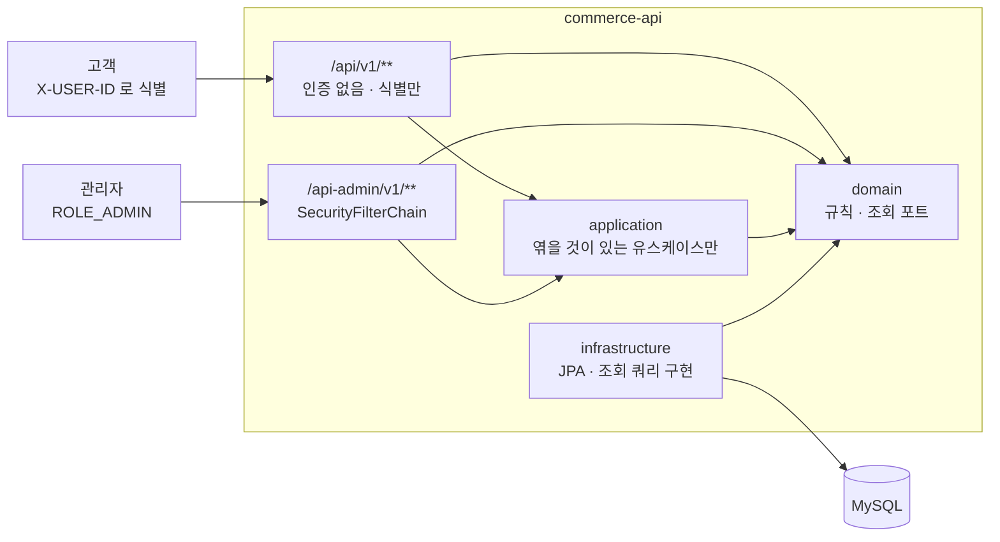

**입구에서 도메인으로 가는 화살표가 있는 것이 의도다.** application 은 통과 지점이 아니라
**트랜잭션 경계를 여는** 층이다(6.1) — 쓰기는 전부 이 층을 지나고,
상품 목록처럼 경계가 필요 없는 조회는 컨트롤러가 도메인으로 곧장 간다.
`app --> inf` 화살표가 없는 것도 의도다 — 구현은 인프라가 도메인의 포트를 **거꾸로** 구현한다.

**두 입구가 같은 데이터를 다르게 본다.** 이 문서에서 되풀이되는 구도다 —
삭제 여부(브랜드), 재고 수량(상품), 소유자(주문)가 입구에 따라 보이고 안 보인다.

### 1.1 말을 먼저 맞춘다

**의도.** 이 표의 왼쪽 칸은 사람이 쓰는 말이고 가운데 칸은 코드가 쓰는 이름이다.
**둘이 같아야 한다** — 문서에서 "확정" 이라 부르고 코드가 `complete` 라 부르기 시작하면,
그때부터 두 사람이 같은 회의에서 다른 것을 이야기하게 된다.
오른쪽 칸을 둔 이유도 같다. 쓰지 않기로 한 말을 적어 두지 않으면 **왜 안 쓰는지가 사라지고**, 다음 사람이 되살린다.

| 말 | 코드 | 뜻 | 쓰지 않는 말 |
|---|---|---|---|
| **접수** | `place` · `Order.draft` · `DRAFT` | 살 것을 정해 주문을 만든다. **재고도 포인트도 건드리지 않는다**(`ORDER-007`) | 주문하기 · `submit` · `create` |
| **확정** | `confirm` · `CONFIRMED` | 재고를 차감하고 포인트를 쓰고 결제액을 굳힌다. 한 번만 된다 | 결제 · 체크아웃 · `complete` |
| **품목** | `OrderItem` | 주문 안의 한 줄. 상품 ID · 이름 · 단가를 **접수 시점 값으로 복사**해 든다(`ORDER-005` · `022`) | 장바구니 · `cart` |
| **합계 / 결제액** | `totalAmount` / `paidAmount` | 합계는 접수 시 계산해 굳고, 결제액은 확정 시 합계를 복사한다. 둘을 나눈 이유는 3.8 | 가격 · 금액 |
| **차감** | `deduct` | 재고를 줄인다. 모자라면 `INSUFFICIENT_STOCK` | 감소 · 소진 · 재고 빼기 |
| **충전 / 사용** | `charge` / `use` | 포인트를 늘린다 / 줄인다. 둘 다 **원장 한 줄을 남긴다** | 적립 · 결제 · 환불 |
| **잔액 / 원장** | `balance` / `PointTransaction` | 잔액은 원장의 합이다. 이 등식이 포인트 애그리거트의 불변식이다 | 포인트 · 이력 |
| **품절** | `soldOut` | 재고가 0인 **상태가 아니라 계산 결과**다. 저장하지 않고 읽을 때마다 센다(9.4) | 매진 · 상태값 |
| **살아 있다** | `alive` | 논리 삭제되지 않았다. 저장소의 기본값이라 이름에 다시 쓰지 않는다(4.3) | `active` · `enabled` · 유효 |
| **논리 삭제** | `delete` · `deletedAt` | 행을 지우지 않고 지워진 것으로 표시한다 | 비활성화 · 숨김 |

**살아 있는 것을 가져오는 이름이 셋인데, 셋은 다른 질문에 답한다.** 겹쳐 보이므로 여기서 가른다.

| 이름 | 묻는 것 | 돌려주는 것 |
|---|---|---|
| `ProductService.get` | 이 상품을 달라 | `Product`, 없으면 404 |
| `ProductRepository.findById` | 살아 있는 이 행이 있는가 | `Optional` — 판단은 서비스가 한다(4.3) |
| `ProductAvailability.requireAvailable` | **참조해도 되는가** | 아무것도. 통과하거나 예외다(8.1) |

세 번째만 객체를 내주지 않는 것이 핵심이다. 묻는 쪽이 필요한 것은 허가 하나이고,
상품을 통째로 받으면 그 쪽이 상품 내부를 들여다보게 된다.

**`BRAND_NOT_FOUND` 와 `BRAND_NOT_AVAILABLE` 도 같은 말이 아니다.** 앞은 404, 뒤는 400이다 —
**경로가 가리키는 대상이 없으면 404, 요청 본문이 가리키는 참조가 유효하지 않으면 400**(8.1).

**이 표를 어기고 싶어질 때가 이 표를 고칠 때다.** 새 이름이 더 맞으면 표를 먼저 고치고 코드를 따라 고친다.
반대로 하면 표는 하루 만에 거짓말이 된다.

### 1.2 무엇이 핵심인가

**의도.** 다섯 영역을 평평하게 두면 "왜 여기만 이렇게 공을 들였나" 에 매번 따로 답해야 한다.
무엇이 핵심인지 한 번 정하면 6장의 결정들이 **하나의 이유로 묶인다.**

| 영역 | 성격 | 어디서 다루나 |
|---|---|---|
| **확정 — 재고 차감과 포인트 원장이 함께 맞는 것** | **핵심** | 6장 전체 · 3.3 · 8.1 · 9.5 |
| 상품/재고 · 포인트 | 핵심을 떠받친다 | 3장 · 6.3 |
| 브랜드 · 좋아요 | 일반 — 얇게 유지한다 | 4.1 · 9.3 |
| 페이징 · 정렬 · 관리자 조회 | 일반 — 값 집합만 정한다 | 7장 |

그래서 **비관적 잠금이 주문 · 상품 · 포인트에만 있고 브랜드에는 없다.**
좋아요 수를 별도 컬럼으로 빼지 않은 것도(9.3), 목록에서 총 개수를 세지 않는 것도(7.3) 같은 잣대다 —
**핵심이 아닌 곳에 정교함을 쓰면 정작 핵심에 쓸 것이 남지 않는다.**

**뒤집을 조건**: 좋아요 수가 랭킹의 입력이 되면 좋아요가 핵심으로 올라온다.
그때는 9.3 이 미뤄 둔 비정규화와 배치 보정이 **미루는 결정이 아니라 해야 하는 결정**이 된다.

### 1.3 경계는 지금 하나다

다섯 애그리거트가 **한 모델 · 한 언어 · 한 스키마**를 쓴다. 나눌 이유가 아직 없다 —
용어가 영역마다 다른 뜻을 갖는 자리가 없고, 팀도 저장소도 하나다.

**나눌 자리를 미리 봐 두면 네 덩이다.** 가르는 축은 읽기/쓰기 비율이 아니라
**경합과 일관성 요구**다 — 그 둘이 다르면 지켜야 하는 방법이 달라지고, 방법이 다르면 결국 모델이 갈린다.

| | 쓰기 | 경합 | 틀렸을 때 |
|---|---|---|---|
| **Catalog** — 상품 · 브랜드 | 드물다 (관리자) | 없다 | 가격이 틀리면 **돈 문제** |
| **Like** — 좋아요 | **잦다** (사용자마다) | 거의 없다 — `(userId, productId)` 가 전부 다른 행 | 수가 잠깐 틀려도 **괜찮다** |
| **Inventory** — 재고 | 잦다 | **심하다** — 같은 행을 두고 싸운다 | 초과 판매 = **사고** |
| **Wallet** — 잔액 · 원장 | 보통 | 사용자당 한 행 | 원장이 안 맞으면 **사고** |

지금 좁은 계약 셋이 이미 그 금을 따라간다 — `ProductAvailability` 는 Catalog 쪽,
`StockDeduction` 은 Inventory 쪽, `PointUsage` 는 Wallet 쪽 질문이다.
하나로 뭉쳐 두었다면 가르는 날 그 뭉치를 다시 쪼개야 한다.

**첫 금은 주문 ↔ 카탈로그다.** 거기가 가장 얇다 —
주문은 상품을 **ID 와 복사본으로만** 안다(3.2 · `ORDER-005` · `022`).
카탈로그가 떨어져 나가도 주문 모델은 모양이 바뀌지 않는다.

**다만 그 인터페이스가 그대로 계약이 되지는 않는다.** 호출이 원격이 되고,
저쪽 모델의 변화가 주문으로 새지 않도록 **부패 방지 계층이 그 자리에 들어선다.**
지금 얇게 만들어 둔 값은 "가를 때 고칠 곳이 좁다" 까지다.

**뒤집을 조건**은 조직과 모델 둘이다. 카탈로그를 **다른 팀이 갖거나 다른 저장소로 옮길 때**가 하나고,
더 중요한 것은 **같은 단어가 두 뜻을 갖기 시작할 때**다 — 카탈로그의 "상품"이 전시 단위이고
재고의 "상품"이 SKU 한 칸이고 주문의 "상품"이 구매 시점 스냅샷이 되면, 그때는 한 클래스로 버틸 수 없다.
그 전에 나누면 **트랜잭션 하나로 끝나던 확정이 분산 문제가 된다** — 차감은 성공했는데 결제가 실패하면
되돌리는 것이 보상 호출이 되고, 그 호출이 실패할 때를 또 다뤄야 한다.
6.4 가 PG 를 두고 말한 것과 같은 값이다.

### 1.4 API 계약

실패 코드는 `meta.errorCode` 로 나간다. 문구는 클라이언트가 만든다(9.1).

**고객** — 전부 `X-USER-ID` 헤더로 식별한다(브랜드 조회만 예외: 누가 봐도 같은 결과다).

| Method · Path | 입력 | 성공 | 대표 실패 |
|---|---|---|---|
| `GET /api/v1/brands/{id}` | — | 200 · 브랜드 | 404 `BRAND_NOT_FOUND`(삭제 포함) |
| `GET /api/v1/products` | `brandId` `sort`(latest·price_asc·likes_desc) `page` `size` | 200 · 목록 + `hasNext` | 400(모르는 정렬 · size>100) |
| `GET /api/v1/products/{id}` | — | 200 · 브랜드명 · 좋아요 수 · `liked` · `soldOut` | 404 `PRODUCT_NOT_FOUND` |
| `POST /api/v1/products/{id}/likes` | — | **200** · 바뀐 좋아요 수 (멱등) | 404 `PRODUCT_NOT_FOUND`(삭제된 상품) |
| `DELETE /api/v1/products/{id}/likes` | — | 200 · 바뀐 좋아요 수 (멱등) | — (없어도 성공) |
| `GET /api/v1/users/{userId}/likes` | `page` `size` | 200 · 상품 목록 | 404 `LIKE_LIST_NOT_FOUND`(남의 목록) |
| `POST /api/v1/points/charge` | `amount` | 200 · 충전 후 잔액 | 400(0 이하·타입) · 409 `POINT_BALANCE_EXCEEDED` |
| `GET /api/v1/points` | — | 200 · 잔액 | 400(헤더 누락) |
| `POST /api/v1/orders` | `lines[{productId, quantity}]` | **201** · DRAFT 주문 | 400(빈 품목·수량 0) · 404 `PRODUCT_NOT_FOUND` |
| `POST /api/v1/orders/{id}/confirm` | — | 200 · CONFIRMED · 결제액 | 409 `ORDER_NOT_DRAFT` · `INSUFFICIENT_STOCK` · `INSUFFICIENT_POINT` · 404(남의 주문) |
| `GET /api/v1/orders` · `/{id}` | — | 200 · 내 주문 | 404 `ORDER_NOT_FOUND` |

**관리자** — `/api-admin/**` 은 `ROLE_ADMIN` 이 없으면 **403**(자격이 없어도, 틀려도 403).
자격은 **HTTP Basic** 으로 싣는다. 계정은 `application.yml` 의 `local`·`test` 전용 인메모리 사용자이고,
비밀번호(`local-only-not-a-secret`)는 저장소에 그대로 들어가도 되는 값이다 — **운영 인증 수단이 아니다**.
루프백 밖에 노출되는 순간 이 계정은 제거 대상이다.

| Method · Path | 입력 | 성공 | 대표 실패 |
|---|---|---|---|
| `GET /api-admin/v1/brands` | `page` `size` | 200 | — |
| `POST /api-admin/v1/brands` | `name` `description` | **201** | 400(이름 1~50자 위반) |
| `GET·PUT·DELETE /api-admin/v1/brands/{id}` | `name` `description` | 200 · **204**(삭제) | 404(삭제된 브랜드) · 409 `BRAND_HAS_PRODUCTS` |
| `GET /api-admin/v1/products` | `brandId` `sort`(latest·price_asc·price_desc·**stock_asc**) `page` `size` | 200 · **수량 포함** | 400(모르는 정렬) |
| `POST /api-admin/v1/products` | `brandId` `name` `price` | **201** | 400 `BRAND_NOT_AVAILABLE`(없거나 삭제된 브랜드) · 400(이름·가격 범위) |
| `GET·PUT·DELETE /api-admin/v1/products/{id}` | `name` `price` | 200 · 204 | 404 `PRODUCT_NOT_FOUND` |
| `PUT /api-admin/v1/products/{id}/stock` | `quantity`(최종 수량) | 200 · 수량 | 400(음수) · 404(삭제된 상품) |
| `GET /api-admin/v1/orders` · `/{id}` | `userId` `status` `page` `size` | 200 · **구매자 포함** | 400(모르는 상태) |

**상태 코드가 멱등성을 말한다.** 브랜드·상품·주문 등록은 201(반복하면 하나 더 생긴다),
좋아요는 200(반복해도 하나다), 주문 확정은 200(새 리소스가 아니라 상태 전이이고, 바뀐 결제액을 돌려준다).

---

## 2. 층과 경계

### 2.1 의존 방향

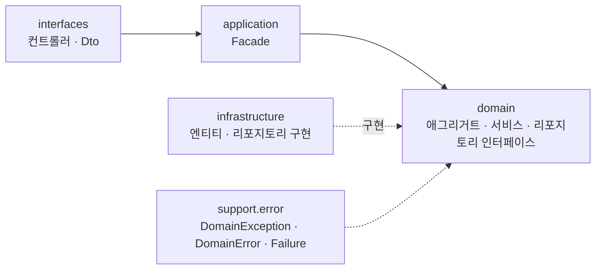

화살표는 **컴파일 의존**이다. `ArchitectureTest` 가 세 방향을 막는다 —
`domain` 은 바깥 셋을 못 보고, `application` 은 `interfaces`·`infrastructure` 를 못 보고,
`interfaces` 는 `infrastructure` 를 못 본다. `application → domain` 은 막지 않는다.
Facade 가 도메인 서비스를 조합하는 것이 그 층의 존재 이유라 막으면 할 일이 없어진다.

**원시값이 도메인 타입으로 바뀌는 지점은 요청·응답 DTO 다.**
들어올 때 `PointV1Dto.ChargeRequest` 가 `long` 을 `ChargeAmount` 로 감싸고,
나갈 때 `BalanceResponse` 가 `Money` 를 `long` 으로 푼다.
경계를 넘는 값의 모양은 **응답이 정하므로** 그 변환은 응답을 든 쪽에 있다(2.2).

그래서 `interfaces` 는 도메인 타입을 import 한다. 응용 계층이 전부 감싸 주면 이 층이 도메인을
모르는 채로 있을 수 있지만, 그 대가로 **변환만 하는 통과 지점**이 한 겹 생긴다.
**통과만 하는 층은 감춰 주지 않는다 — 한 겹 더 쓸 뿐이다.**

**뒤집을 조건**: `interfaces` 가 도메인 타입을 감싸는 데 그치지 않고 **규칙을 판단하기** 시작할 때.
그때는 감출 것이 생긴 것이므로 응용 계층이 다시 필요하다.

---

### 2.2 층 안에서는 개념으로 나누고 종류로 나누지 않는다

**의도.** 최상위는 `domain` · `application` · `infrastructure` · `interfaces` 로 **층**이 가른다 —
그 축은 2.1 의 의존 방향이 정한 것이라 바꾸지 않는다.
이 절이 말하는 것은 **그 안쪽**이다: `infrastructure/point/` 안에 `entity/` · `repository/` 하위 폴더를 두지 않고,
`domain/point/` 도 애그리거트 · VO · 예외 · 서비스 · 리포지토리 인터페이스가 평평하게 있다.
`common.vo` 를 만들지 않은 것도 같은 판단이다.

| | |
|---|---|
| **기준** | 패키지 이름은 **"무엇"(개념)** 이어야 한다. `entity` · `repository` · `vo` · `service` 는 **"어떤 종류"** 라 기술 분류다. 기능 하나를 고치려면 종류별 폴더를 돌아다녀야 한다 |
| **결정적인 이유 — 인프라** | `UserPointEntity` · `UserPointJpaRepository` · `PointTransactionEntity` · `PointTransactionJpaRepository` 가 **package-private** 이라 Facade 나 도메인 서비스가 JPA 리포지토리를 주입받는 코드는 **컴파일되지 않는다.** 쪼개면 `.repository` 의 `Impl` 이 `.entity` 를 못 보므로 전부 `public` 이 된다 |
| **도메인에는 같은 장치가 없다** | 한때 실패마다 클래스를 두고 생성자를 package-private 으로 막았지만, 지금은 실패가 `DomainError` 상수라 그 경계가 없다(3.10). 그래서 이 절의 근거는 **인프라 한 축**으로 선다 — 엔티티와 JPA 리포지토리의 가시성이다 |
| **커지면** | 한 패키지가 감당 못 할 만큼 커지면 그때도 종류가 아니라 **개념**으로 나눈다 (예: `point` 안이 커지면 `wallet` 과 `ledger`). 그 경우에도 package-private 경계를 함께 옮길 수 있는지를 먼저 본다 |

**한 군데는 생각한 만큼 닫혀 있지 않다.** `PointTransaction` 은 `public record` 이고,
**자바에서 record 의 표준 생성자는 레코드 자신보다 좁을 수 없다** — 즉 `new PointTransaction(USE, ...)` 을
아무 데서나 부를 수 있다. package-private 정적 팩토리는 *이름* 만 가린 것이다.

실제로 지켜지는 것은 더 좁다 — **저장되는 원장 줄은 `UserPoint` 를 거쳐야만 생긴다.**
저장소는 `pullNewTransactions()` 로 꺼낸 것만 저장하고, 그 목록은 `charge`/`use` 만이 채운다.
객체를 만드는 것은 막지 못하지만 **만들어 봐야 저장되지 않는다.**
더 닫으려면 record 를 package-private 으로 내려야 하는데, 그러면 다른 패키지의 통합 테스트가
원장을 검증할 수 없다. **뒤집을 조건**: 원장을 만드는 두 번째 경로가 생길 때.

**DTO 는 자원 × 대상으로 가른다.** 고객 계약과 관리자 계약이 다른 파일에 있다(`*V1Dto` · `*AdminV1Dto`).
이유는 정리가 아니라 규칙이다: 담기는 것이 다르고(Q-2 의 재고 수량),
한 파일에 나란히 있으면 잘못 집기 쉽다. 컨테이너가 다르면 **잘못 집으려면 import 를 바꿔야** 한다.

다만 `BrandV1Dto.BrandResponse` 는 관리자 API 도 **일부러 함께 쓴다.** 브랜드에는 관리자만 볼 값이
없어서, 같은 모양을 두 벌 두면 한쪽만 고쳐지는 날이 온다.
**가르는 기준은 파일이 아니라 "담기는 것이 다른가" 다.**

**이름은 `XxxV1Dto.XxxResponse` 로 둔다.** `XxxDto.V1.Response` 가 낫다 —
`Product` 가 두 번 나오지 않고, V2 가 생기면 `XxxDto.V2` 로 나란히 붙어 관계가 구조로 드러난다.
지금 바꾸지 않은 이유는 **V2 가 없어서 얻는 것이 이름뿐**이기 때문이다.
바꾸려면 record 전부가 중첩 클래스 안으로 한 단계 들어가고(들여쓰기 규칙이 함께 걸린다),
컨트롤러 여덟과 테스트의 타입 참조가 따라온다. **뒤집을 조건**: V2 가 실제로 생길 때.

**관리자 경계는 패키지에 없다.** 경계가 세 군데에 그어져 있는데 패키지만 따라가지 않았다:

| 어디 | 갈려 있나 |
|---|---|
| URL (`/api-admin/**`) | ✓ |
| 시큐리티 (`securityMatcher`) | ✓ |
| 테스트 (`interfaces/api/admin/`) | ✓ |
| **본 코드** (`ProductAdminV1Controller` 가 `interfaces/api/product/` 안에) | **✗** |

고객 응답과 관리자 응답이 담는 것이 다르다는 것은 규칙이다(Q-2 · `ORDER-021`) —
재고 수량과 구매자 정보는 고객에게 가면 안 된다. 그 규칙이 **파일 위치로는 드러나지 않는다.**
지금은 DTO 컨테이너가 갈려 있어(`ProductV1Dto` / `ProductAdminV1Dto`) 잘못 집으려면 import 를 바꿔야 하고,
그것이 유일한 방어다. **뒤집을 조건**: 관리자 API 가 더 늘어나면 `interfaces/api/admin/` 으로 옮긴다.

---

## 3. 도메인 모델

### 3.1 클래스 다이어그램

#### 포인트

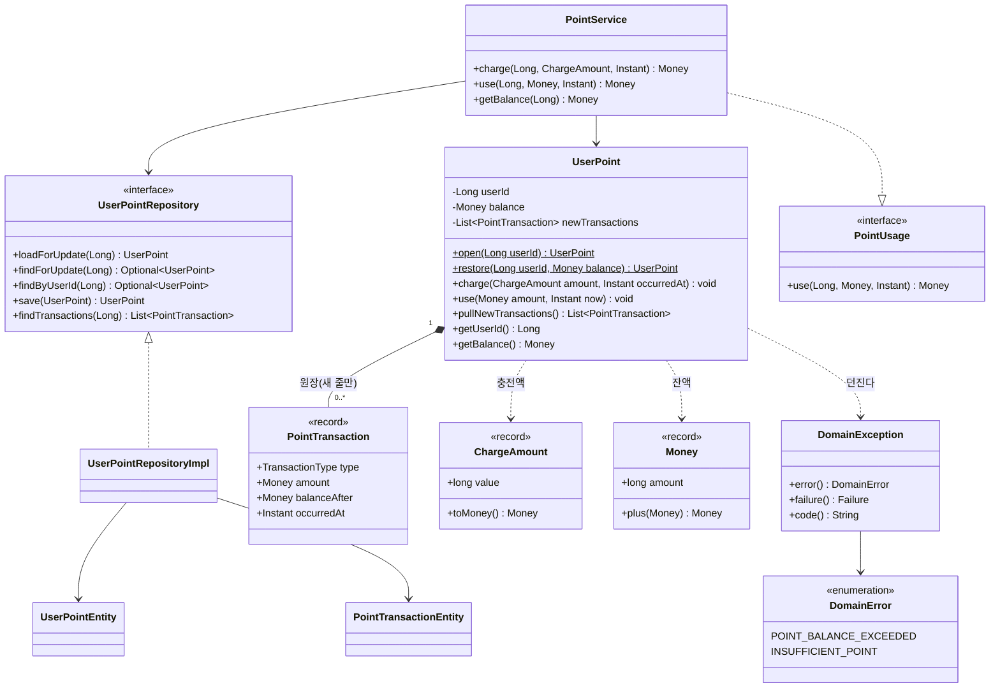

#### 브랜드

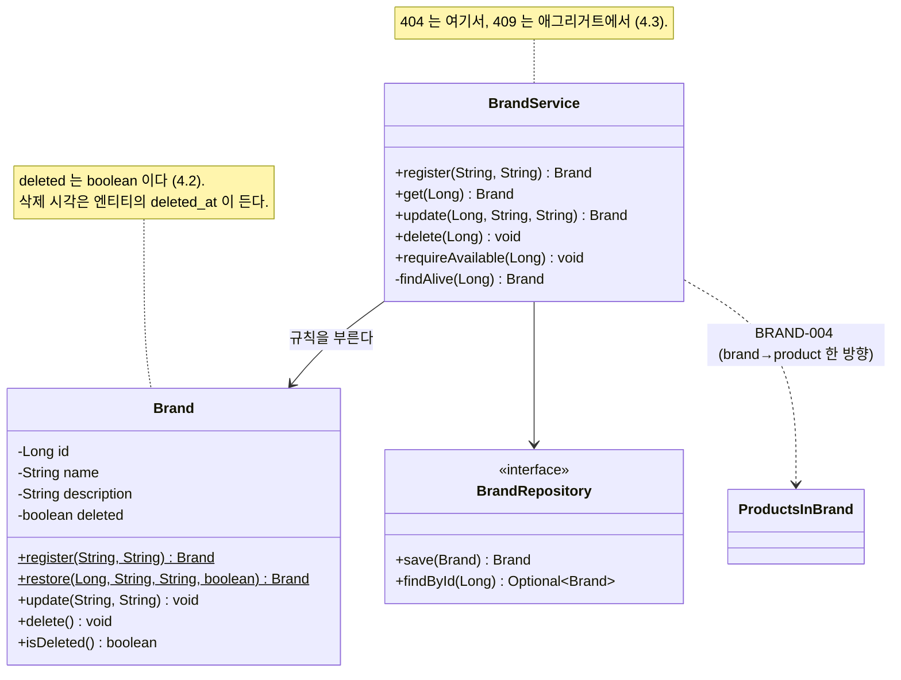

#### 상품과 재고

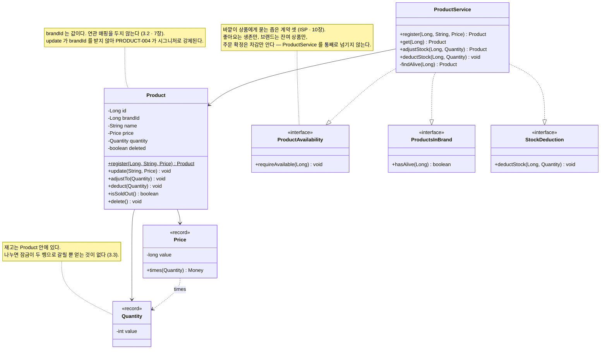

#### 좋아요

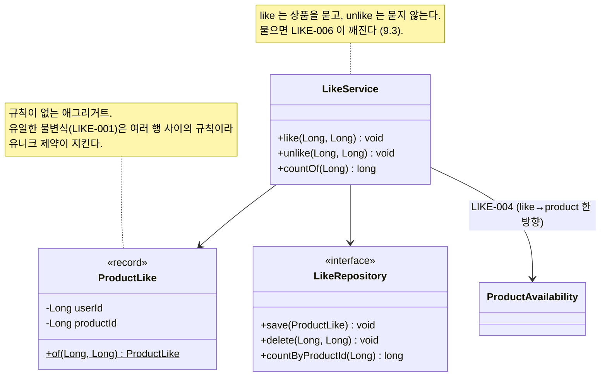

---

#### 주문

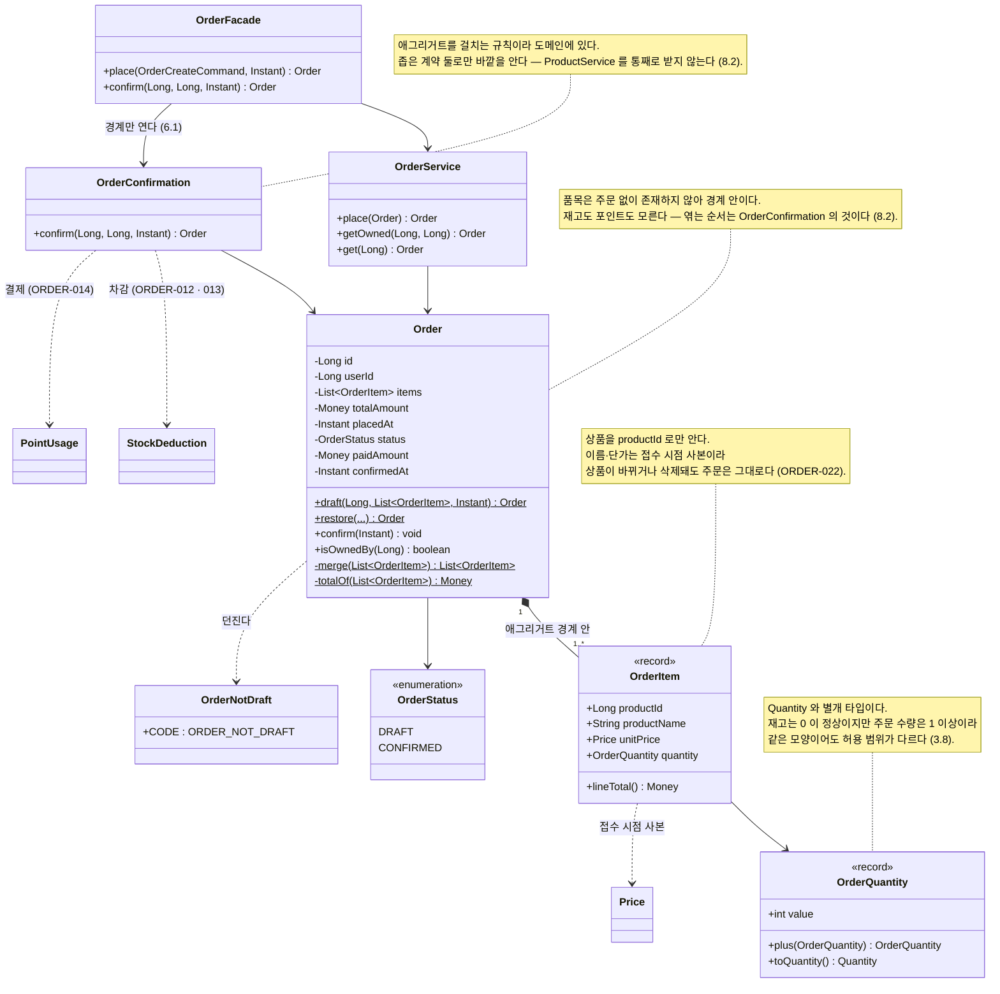

### 3.2 애그리거트는 서로를 ID 로만 안다

`PointTransaction` 은 주문을 모른다 — **가리키는 필드조차 없다.** 원장 한 줄은 종류·금액·잔액·시각뿐이다.
`Order` 는 `Product` 객체가 아니라 `productId` 와 **접수 시점의 단가 사본**을 든다.

| | |
|---|---|
| **왜** | 객체로 참조하면 하나를 읽을 때 연쇄로 끌려오고, 하나를 잠글 때 다른 것도 잠긴다. 그리고 상품 가격이 바뀌면 저장된 주문 금액이 따라 바뀌어 버린다 |
| **경계를 넘는 일은 누가** | 애그리거트를 걸치는 **도메인 서비스**다. 주문 확정이 재고·포인트·주문을 엮는 순서를 아는 것은 어느 한 애그리거트가 아니다(8.2) |
| **JPA 에서 지키는 법** | 애그리거트를 넘는 `@ManyToOne` 을 걸지 않는다. `PointTransactionEntity` 는 `user_id` 컬럼만 든다 |

**원장이 주문을 모르는 대가는 추적이다.** "이 사용 내역이 어느 주문이었나" 를 지금은 답할 수 없다 —
같은 시각의 주문과 맞춰 보는 수밖에 없다. 넣지 않은 이유는 `ORDER-014` 가 요구하지 않아서이고,
넣더라도 **객체가 아니라 `orderId` 숫자**여야 이 절의 규칙이 유지된다.
**뒤집을 조건**: 부분 환불이나 사용 취소가 생길 때. 되돌릴 대상을 지목해야 하므로 그 순간 필수가 된다.

**그래서 도메인이 `id` 를 드는 조건도 여기서 나온다 — 바깥이 그것으로 가리킬 때만.**
`Brand` · `Product` 는 든다(상품이 `brandId` 로, 좋아요·주문이 `productId` 로 가리킨다).
`UserPoint`(`userId`) · `ProductLike`(`(userId, productId)`) 는 들지 않는다 —
이미 가리키는 수단이 있다. `UserPoint` 에서 `getId()` 를 지운 것이 이 규칙의 첫 적용이었다.
`id` 는 참조용 값이지 규칙이 아니다(어떤 `guard` 도 id 를 읽지 않는다). **규칙이 id 를 읽기 시작하면**
저장 전 `null` 인 창이 문제가 되므로 그때는 도메인이 식별자를 스스로 만들어야 한다.

### 3.3 재고는 상품 안에 있다

`Product` 가 `quantity` 를 든다. 별도 애그리거트로 나누는 쪽이 흔한 선택이고
근거도 그럴듯하게 들리는데(**"경합 성격이 다르다"**), 잠금을 따져 보면 셋 다 성립하지 않는다.

| 나누면 얻는다고 말하는 것 | 실제 |
|---|---|
| "차감 잠금이 상품 조회를 막지 않는다" | InnoDB 의 일반 SELECT 는 **스냅샷 읽기**라 잠긴 행도 읽는다. 합쳐도 조회는 안 막힌다 |
| "쓰기끼리 분리된다 — 확정끼리 안 막힌다" | 같은 상품의 확정끼리는 **재고 행에서 어차피 직렬화**된다(PRODUCT-023). 나눠도 같다 |
| "관리자 수정과 확정이 안 부딪힌다" | 수정은 `product` 배타, 확정은 `product` 공유 — **나눠도 서로 막는다** |

남는 근거는 잠금이 아니라 **저장 수준** 둘이다: 자주 갱신되는 행이 좁다는 것,
재고 조정과 상품 수정이 다른 행이라는 것. 이 규모에서는 둘 다 작다.

합쳐 두어 얻는 것은 분명하다 — 확정이 잠그는 행이 **하나**다(`ORDER-012` 의 삭제 여부와
`ORDER-013` 의 재고를 같은 행에서 본다). 락 순서가 짧고, 조회 쿼리에 조인이 없다.
애그리거트 하나, 테이블 하나, 잠금 하나.

**뒤집을 조건**: 판매가 잦아져 넓은 `product` 행을 매 건 갱신하는 비용이 보일 때.
그때 나눈다 — 근거는 잠금이 아니라 **갱신 비용**이어야 한다.

#### 중간 선택지 — 테이블은 하나로 두고 도메인만 나눈다

"합친다" 와 "나눈다" 사이에 하나가 더 있다. 도메인과 엔티티를 나눠 두었으므로(5.1)
**행은 하나인 채로 도메인만** `Product` + `Stock` VO 로 나눌 수 있다. 엔티티는 `quantity` 컬럼 그대로 두고
`toDomain()` 에서 감싸면 된다. 루트는 여전히 `Product` 이고 저장소도 잠그는 행도 하나이므로,
**위 표의 잠금 논거가 하나도 건드려지지 않는다.**

지금 하지 않는 이유는 **새로 지킬 불변식이 없기** 때문이다. 음수 금지는 `Quantity` 가,
차감 한도는 `Product.deduct` 가 이미 든다. `Stock` 은 그 둘을 한 번 더 감싸기만 한다.

**뒤집을 조건**: 재고가 **자기 필드를 갖기 시작할 때** — 예약 수량 · 안전 재고 · 창고별 수량 중 하나라도
생기면 `Product` 가 숫자 셋을 드는 것보다 `Stock` 하나를 드는 쪽이 낫다.

(별도 애그리거트로 나누면서 **테이블만 공유하는** 길은 두지 않는다. 저장소 둘이 같은 행에 쓰게 되어
갱신 유실이 생기고, 트랜잭션 경계가 어디인지 말할 수 없어진다 — 테이블을 공유하는 두 애그리거트는
경계가 없는 것과 같다.)

따라오는 결과가 하나 있다. 재고가 상품의 일부이므로 **삭제된 상품은 재고 조회도 함께 닫힌다** —
`ProductService.getStock` 은 살아 있는 상품만 본다(`PRODUCT-006`). 나눠 두면 재고 행에 삭제 표시가 없어
삭제 후에도 수량이 읽히는데, **없는 상품의 재고는 업무적으로 답이 없는 질문**이다.

그래서 "삭제된 상품은 차감되지 않는다" 를 검증할 때는 저장소도 서비스도 답을 주지 않는다 —
통합 테스트가 DB 를 직접 읽어 수량이 그대로인지 본다.

**잠금 이야기는 넓게 말하기 쉽다.** 위 표의 셋은 전부 "막힌다 / 안 막힌다" 를 실제보다 크게 잡은 것이다.
**어느 행에 어떤 잠금이 걸리는지 적어 놓고 따져야** 한다.

### 3.4 애그리거트 하나가 테이블 둘에 걸쳐도 된다

`UserPointRepositoryImpl` 은 `JpaRepository` 둘을 감싼다. 잔액은 UPDATE, 원장은 INSERT 다.
**리포지토리는 테이블 단위가 아니라 애그리거트 단위**라서 그렇다.
`PointTransactionRepository` 를 도메인에 두지 않는 것도 같은 이유다 — 원장은 `UserPoint` 를 통해서만 생긴다.

### 3.5 규칙은 애그리거트가 들고, 서비스는 조립만 한다

`PointService.charge` 에는 `if` 가 없다. 꺼내고, 애그리거트 메서드를 부르고, 저장한다.
잔액 부족·범위 초과 판정은 전부 `UserPoint` 안에 있다.

| | |
|---|---|
| **왜** | 규칙이 서비스로 새면 같은 규칙을 부르는 경로가 늘 때마다 다시 구현하게 되고, 하나만 놓쳐도 구멍이 난다. 애그리거트에 두면 우회할 길이 없다 |
| **대가** | 서비스가 얇아 "이 클래스 필요한가" 싶어진다. 템플릿이 `domain/XxxService` 를 두는 구조라 따랐고, 애그리거트 둘을 엮게 되면 그때 Facade 로 올라간다 |
| **어떻게 지키나** | 서비스에 `getBalance() < amount` 같은 판단이 생기면 그 규칙은 애그리거트로 내려야 한다는 신호다 |

### 3.6 만드는 문을 나눈다

```java
UserPoint.open(userId)              // 새로 만든다. 초기 상태를 여기서 정한다
UserPoint.restore(userId, balance)  // 저장소가 읽은 값을 되살린다. 검증하지 않는다
Brand.register(name, description)   // 검증하고 만든다
```

생성자는 `private` 이고 필드만 채운다. 검증과 초기 상태 결정은 팩토리에 있다.

| | |
|---|---|
| **왜 둘인가** | `restore` 가 없으면 인프라가 `open` 을 불러야 하는데, 그러면 DB 에서 읽은 잔액이 0으로 초기화되고 초기 상태 로직이 두 번 돈다 |
| **왜 이름을 다르게** | `create` 하나로는 "지금 만드는 것" 과 "되살리는 것" 이 구분되지 않는다. `draft`·`register`·`open` 처럼 도메인 동사를 쓰면 무엇이 일어나는지가 이름에 남는다 |
| **`restore` 가 public 인 불편** | 인프라가 다른 패키지라 어쩔 수 없다. Kotlin 이라면 `internal` 로 막았을 자리다. 이름으로 의도를 드러내고 리뷰로 지킨다 |

### 3.7 값을 감추고 결과는 내준다

`Brand.getName()` 은 있고 `Coupon.getOwnerId()` 같은 것은 두지 않는다 — 판단이 필요한 값은
`isOwnedBy(userId)` 처럼 **예/아니오로 답하게** 한다. 소유자가 같다는 뜻은 가족 공유·양도로 바뀔 수 있어서,
값을 꺼내 밖에서 비교하면 그 뜻이 비교하는 쪽마다 흩어진다.

반대로 `UserPoint.getBalance()` 는 노출한다. 잔액은 판단의 재료가 아니라 **이 기능의 결과물**이다.
"충전 후 잔액 반환" 이 요구사항이므로 애그리거트 밖으로 나가야 한다.

> `UserPoint` 에는 `getId()` 도 `id` 필드도 없다. 이 애그리거트의 식별자는 `userId` 이고,
> 테이블 PK 는 **인프라 사정**이라 도메인이 알 이유가 없다.

### 3.8 위반을 표현 불가능하게 만든다

**의도.** `Money` 옆에 `ChargeAmount` · `Price` 가, `Quantity` 옆에 `OrderQuantity` 가 있다.
반대로 `userId` · `productId` · `brandId` 는 전부 `Long` 이다. 기준을 적어 둔다.

> **원칙 — 위반을 검사하지 않고 표현 불가능하게 만든다.**
> "충전액은 양의 정수" 를 `UserPoint.charge` 안의 `if` 로 두지 않고 `ChargeAmount` 타입에 넣었다.
> 그래서 `charge` 에는 선행 조건 검사가 한 줄도 없다.
> 검사는 호출 경로마다 반복되고 빠뜨릴 수 있지만, 타입은 **존재 자체를 막는다.**
> `Money` 와 나눈 것도 같은 이유다 — 잔액은 0원이 정상이라 `Money` 는 0을 허용해야 하고, 충전액은 0이 될 수 없다.
> 같은 "금액" 이지만 허용 범위가 달라 타입이 둘이다.
>
> `ChargeRequest` 의 검사와 중복이 아니다. Dto 의 검사는 **잘못된 요청을 400 으로 만들기 위한 것**이고,
> `ChargeAmount` 의 검사는 **도메인에 0 이하가 존재할 수 없게** 하는 것이다.
> Dto 쪽을 빼면 `ChargeAmount.of` 가 Facade 에서 터져 500 이 된다.

업계에서 이 문제는 **Primitive Obsession** 이라 불리고, 해법은
**Parse, don't validate** 로 요약된다 — <b>경계에서 한 번 검증하고 그 결과를 더 좁은 타입으로 만든다.
그 뒤로는 아무도 다시 검사하지 않는다.</b> 검사를 통과했다는 사실이 타입에 기록되는 것이다.
HTTP Dto 에서 끝내지 않는 이유는 Dto 가 `interfaces` 층이라 도메인이 쓸 수 없기 때문이다.

| 물음 | 무게 |
|---|---|
| 불변식이 있는가 (0 불가, 상·하한) | 필요조건 |
| **혼동 가능한 동형 타입이 있는가** | **가장 무겁다** |
| 여러 층을 지나는가 | 보조 |
| 도메인 용어인가 | 보조 |

두 번째가 `OrderQuantity` 를 강하게 만든다 — `Quantity`(0 허용, 재고용)가 같은 모양으로 존재하므로,
타입이 갈리지 않으면 **재고 수량을 주문 줄에 넣는 실수가 컴파일된다.**
`ChargeAmount` 에는 그런 경쟁자가 없어 값이 약하다(사는 것은 검사 한 줄이다). 그래도 남긴 이유는

> **문맥 타입은 입력값에 만들고, 계산 결과에는 만들지 않는다.**

`charge(ChargeAmount)` 와 `use(Money)` 의 비대칭이 그 규칙을 드러낸다 —
앞은 사용자가 넣은 값, 뒤는 주문 합계다. 합계 · 잔액 · 결제액 · 줄 금액에 타입을 만들지 않은 것도 같은 이유다.
만들면 `TotalAmount` · `PaidAmount` · `LineTotal` 이 줄줄이 생기는데 셋 다 규칙이 같고 변환만 는다.

#### 만들지 않은 자리 — ID

기준을 정직하게 대면 **가장 위험한 자리는 ID 다.**

```java
OrderItem.of(productId, name, price, quantity)
likeService.like(userId, productId)
```

전부 `Long` 이라 **바꿔 넣어도 컴파일되고**, 테스트에서 둘 다 작은 숫자면 통과할 수도 있다.
정석은 `UserId` · `ProductId` 같은 타입이고, 그것이 `ChargeAmount` 보다 훨씬 값한다.

그런데도 만들지 않았다. 비용이 이번 규모에서 더 크다 —
JPA 매핑마다 `AttributeConverter`, 경로변수마다 변환기, 모든 시그니처 변경.
**"그래서 안 만든다" 와 "생각해 보지 않았다" 는 다르므로 여기 적어 둔다.**

**그래서 위험은 지금 있다.** 둘이면 충분하다 — 인접한 같은 타입 인자는 바꿔 넣어도 컴파일된다.
실제로 막고 있는 것은 타입이 아니라 **테스트 픽스처의 관례**다:

> **종류마다 자릿수를 다르게 둔다.** `userId = 1`, `productId = 10`, `brandId = 100`.
> 인자를 바꿔 넣으면 값이 달라져 테스트가 깨진다.

`OrderTest` 가 그렇게 쓴다 — `userId = 1`, `productId = 10` · `20`.
**일관되지는 않다.** `ProductTest` 는 `brandId = 1` 을 쓴다.
약한 방어이고, 약한 줄 알고 쓰는 것과 방어가 있다고 믿는 것은 다르다.

**뒤집을 조건:** 순서를 바꿔 넣은 버그가 실제로 한 번 나거나,
이 API 가 모듈 경계를 넘어 다른 호출자에게 열릴 때 — 호출부가 멀어지면 테스트 관례는 따라가지 않는다.

#### Command 는 그 중간이다 — 그래서 주문에만 둔다

`XxxCommand` 로 인자를 묶는 절충이 있다. 다만 **위험을 없애는 것이 아니라 한 곳으로 모은다** —
`like(LikeCommand)` 는 잘못 부를 수 없지만 `new LikeCommand(productId, userId)` 는 여전히 컴파일된다.
record 의 생성자도 위치 인자이기 때문이다(정적 팩토리·빌더도 같다).

| | 호출부 | 생성 지점 | 비용 |
|---|---|---|---|
| 원시값 (지금) | ✗ | ✗ | 0 |
| Command | ✓ | ✗ | 클래스 하나 |
| ID 타입 | ✓ | ✓ | JPA 컨버터 · 경로변수 변환기 · 모든 시그니처 |

생성 지점은 보통 컨트롤러 하나이고 거기서는 `request.userId()` 처럼 이름 있는 값을 꺼내 넣으므로
실수가 눈에 띈다. 그래서 **인자 둘짜리에는 Command 를 두지 않는다** — 막는 것은 절반인데 클래스는 온전히 하나 는다.

**주문은 다르다.** 품목 리스트는 애초에 파라미터로 풀 수 없다 —
`create(Long userId, List<Long> productIds, List<Integer> quantities)` 는
**두 리스트의 길이가 어긋날 수 있는 표현**이라 3.8 을 정면으로 어긴다.
`OrderCreateCommand(userId, List<Line>)` 는 그 어긋남 자체를 표현 불가능하게 만든다.
Command 를 여기에만 두는 이유는 편의가 아니라 이것이다.

---

### 3.9 시각은 주입받지 않고 인자로 받는다

`Clock` 빈을 두지 않는다. 컨트롤러가 `Instant.now()` 를 한 번 읽어 Facade → 서비스 → 애그리거트로 내려보낸다.
**W1 「도구 제안 처리」 에서 `Clock` 포트를 거절한 그 결정이다** — 근거(안쪽이 `now()` 를 부를 방법 자체가 없어
규칙이 구조로 강제된다)는 거기 적혀 있다.

이번에 확인한 것은 **근거가 더 약한 자리에도 같은 잣대가 선다**는 점이다.
W1 에서는 `INV-006`(만료 판정 시각 하나)이라는 규칙이 시각을 요구했지만, 포인트에는 시각 규칙이 아예 없다.
원장의 `occurredAt` 은 판정에 쓰이지 않는 기록일 뿐이다. 그런데도 포트를 두지 않은 이유는 같다 —
**뒤집힐 질문이 없으면 추상화의 근거가 없다.** 테스트는 고정 시각을 인자로 넘기면 되고, 그건 구현 편의다.

### 3.10 실패는 타입이 아니라 상수로 든다

```
DomainException (class)          code · failure · message
  ├ DomainError  (enum)          실패 상수 12개. code 는 상수 이름과 같다
  └ Failure      (enum)          RULE_VIOLATION · UNIDENTIFIED · INVALID_REFERENCE
```

```java
throw new DomainException(DomainError.INSUFFICIENT_STOCK);
```

도메인은 "이 실패는 규칙 위반이다" 까지 알고 **"409다" 는 모른다.** `HttpStatus` 는 Advice 가 붙인다.

| | |
|---|---|
| **성질 이름이 HTTP 가 아닌 이유** | `CONFLICT` · `NOT_FOUND` 로 두면 409 · 404 를 다른 철자로 쓴 것이 된다. `RULE_VIOLATION`(상태가 허락하지 않는다) · `UNIDENTIFIED`(대상을 특정할 수 없다) · `INVALID_REFERENCE`(가리키는 것이 유효하지 않다)는 **업무의 말**이고, 숫자로 바꾸는 일은 Advice 한 곳에만 있다 |
| **`code` 가 상수 이름인 이유** | `DomainError.INSUFFICIENT_STOCK.code()` 는 `name()` 이다. 코드 문자열을 따로 적으면 상수와 어긋날 수 있고, 어긋나도 컴파일은 통과한다 |
| **누가 던지나** | 선행 조건 판정(소유권·존재 여부)은 순서를 아는 서비스가 묻고 던진다. **애그리거트가 상태를 바꾸는 도중에만 알 수 있는 위반은 애그리거트가 던진다** — `Product.deduct` 의 `INSUFFICIENT_STOCK` 이 그렇다. boolean 으로 돌려주면 호출자가 검사를 빠뜨릴 수 있고, 그 결과가 깨진 재고다 |
| **성질이 늘면 컴파일이 막는다** | `statusOf` 는 `default` 없는 `switch` 다. `Failure` 에 상수를 더하면 그 자리가 컴파일 오류가 된다 — 런타임에 조용히 500 이 되지 않는다 |

#### 클래스를 실패마다 두지 않는 이유

실패마다 클래스를 두고 성질을 상속으로 드는 방식(`InsufficientStock extends StateConflict extends DomainException`)이
더 흔하다. 그러면 클래스가 15개가 되고 상속 깊이가 5 가 되는데, 그중 셋은 JDK 의 것이라
줄일 수 있는 것은 둘뿐이다.

| | 클래스로 들 때 | 상수로 들 때 |
|---|---|---|
| 클래스 수 | 15 | **1 + enum 2** |
| 상속 깊이 | 5 | **3** |
| 코드·메시지 | 클래스마다 흩어진다 | **한 파일에 모인다** |
| 누가 던질 수 있나 | 생성자가 package-private 이라 **그 패키지만** | **아무나** |

**잃는 것은 마지막 줄 하나다.** 클래스로 들면 생성자를 package-private 으로 막을 수 있어
재고 부족은 `domain.product` 만 던진다. 상수에는 그 경계가 없다.

그래도 상수를 고른 이유는, **그 보장이 어차피 온전히 서지 못하기 때문**이다.
읽기 경로는 응용 계층을 지나지 않으므로(6.1) 404 를 낼 도메인 서비스가 사이에 없고,
컨트롤러가 직접 던져야 한다 — `PRODUCT_NOT_FOUND` 와 `LIKE_LIST_NOT_FOUND` 가 그렇다.
클래스로 들었다면 이 둘만 `public` 이 되어 **9개는 막히고 2개는 열린 상태**가 된다.
부분적으로만 서는 경계와, 코드·메시지가 한 곳에 모이는 것을 맞바꿨다.

**뒤집을 조건**: 실패를 던지면 안 되는 자리에서 던진 사고가 실제로 나면, 그때는 상수가 아니라
**패키지별 팩토리**(`ProductErrors.insufficientStock()`)로 다시 좁힌다. 클래스 15개로 돌아가지는 않는다.

**타입을 아예 없애지 못하는 이유는 명세다.** 요구사항이 `INSUFFICIENT_STOCK` ·
`BRAND_NOT_AVAILABLE` 같은 **업무 코드 여섯에 이름을 붙였고**, 그 코드를 응답에 싣는 것이
계약이다(`ContractClassificationTest`). 표준 예외에는 그 코드를 실을 자리가 없어 최소 한 타입은 있어야 한다.

### 3.11 도메인 설계가 됐는지는 "JPA 없이 테스트가 도는가" 로 확인한다

**의도.** 이건 결정이라기보다 **앞의 결정들이 지켜졌는지 확인하는 잣대**다.
도메인 규칙을 담은 테스트가 스프링 컨텍스트 · DB · JPA 없이 **순수 JUnit 으로 돌고 통과**해야 한다.
`UserPointTest` · `BrandTest` · `ProductTest` · `ProductStockRuleTest` · `OrderTest` — **74개가
`@SpringBootTest` 도 `@DataJpaTest` 도 없이 `new` 와 정적 팩토리만 쓴다.** 테스트 더블도 없다.

| | |
|---|---|
| **왜 잣대가 되는가** | 도메인 테스트가 DB 를 필요로 한다면, 그 규칙은 도메인이 아니라 **DB 가 들고 있다**는 뜻이다. 유니크 제약 · 트리거 · `@PrePersist` 에 규칙이 새어 나가 있으면 순수 테스트로는 검증할 수 없다 |
| **어떤 결정을 검증하는가** | 3.5(규칙은 애그리거트 안) · 3.8(위반을 표현 불가능하게) · 5.1(도메인 / 엔티티 분리) · 3.9(시각을 인자로). 넷 중 하나라도 깨지면 이 테스트가 먼저 못 돈다 — 시각을 `Instant.now()` 로 읽으면 시간 의존이 들어오고, 도메인이 엔티티였다면 `EntityManager` 없이는 상태가 성립하지 않는다 |
| **역도 성립하지 않는다** | 순수 테스트가 통과한다고 **저장이 맞다는 뜻은 아니다.** 잠금 · 유니크 제약 · 원장 정합성은 순수 테스트로 검증할 수 없다. 그래서 층이 둘이다 — 규칙은 순수 테스트, 저장·동시성은 `UserPointRepositoryIntegrationTest`(실제 DB · 20 스레드) |
| **실패하는 모습** | 도메인 테스트를 쓰다가 "DB 에 넣어야 확인되는데" 가 나오면, 테스트를 무겁게 만들 게 아니라 **규칙이 도메인 밖으로 샌 신호**로 읽는다. 그때 고칠 것은 테스트가 아니라 설계다 |
| **더블이 하나도 없는 것이 핵심이다** | 74개 중 어느 것도 가짜 저장소를 세우지 않는다. **더블을 세워야 도는 테스트는 규칙이 애그리거트 밖에 있다는 신호**로 읽는다 — 고칠 것은 테스트가 아니라 규칙의 위치다(8.3) |
| **인터페이스가 JPA 를 가정하지 않는다는 증거** | 인메모리 구현을 하나 더 세워 보이는 방법도 있지만, 그것은 **예시**다. 지금은 **빌드가 막는다** — `ArchitectureTest` 가 `domain` 과 `application` 에서 `org.springframework.data..` 의존을 금지한다. 예시보다 강제가 강하고, 유지할 코드도 늘지 않는다 (DIP · 10장) |

**규칙 테스트는 DB 없이 먼저 쓴다.** DB 가 필요해진 순간, 그것이 진짜 저장·동시성 문제인지
규칙이 도메인 밖으로 샌 것인지를 구분한 뒤에 통합 테스트로 내린다.

---

## 4. 삭제를 어떻게 다루는가

### 4.1 기준은 "지워도 되는가" 가 아니라 "누가 가리키고 있는가" 다

**의도.** 브랜드·상품은 논리 삭제, 좋아요 관계는 실제 삭제다. 한 프로젝트에서 둘을 섞는 것이므로
기준을 분명히 해 둔다 — 기준은 **그 행을 가리키는 기록이 있는가**다.

| | 브랜드 · 상품 | 좋아요 관계 |
|---|---|---|
| **가리키는 것** | 저장된 주문의 품목, 좋아요 관계가 `productId` 로 가리킨다 | 아무도 가리키지 않는다. 관계 자체가 말단이다 |
| **지우면** | 주문 이력의 참조가 깨지거나, CASCADE 로 주문이 함께 사라진다 | 잃는 것이 없다 |
| **그래서** | 논리 삭제. `deleted_at` 을 채우고 고객 조회에서 거른다 | 실제 삭제. 행을 지운다 |
| **남는 대가** | 모든 고객 조회에 `deleted_at IS NULL` 이 붙는다. 빠뜨리면 삭제된 상품이 목록에 뜬다 | 취소 이력이 남지 않는다 |

#### 테이블마다 정한다 — 기본값은 "논리 삭제 아님"

논리 삭제는 **가리키는 기록이 있는 테이블에만** 건다. 전부에 걸면 모든 조회에 조건이 하나씩 붙고,
쓰이지 않는 `deleted_at` 컬럼이 "언젠가 삭제될 수 있다" 는 거짓 신호를 남긴다.

| 테이블 | 삭제 | 근거 |
|---|---|---|
| `brand` · `product` | **논리** | 주문 품목·좋아요가 가리킨다 (COMMON-007) |
| `product_like` | **실제** | 말단이다. 논리 삭제면 유니크 제약 때문에 재등록이 막힌다 (COMMON-009) |
| `user_point` | **해당 없음** | 잔액은 0이 될 뿐 사라지지 않는다 |
| `point_transaction` · `order` · `order_item` | **해당 없음** | 기록이다. 정정은 반대 방향 기록으로 한다 |

**상속할 상위 클래스도 같이 결정된다.** 감사 컬럼(`created_at` · `updated_at`)은 어느 테이블에나 쓸모가 있고,
문제는 `deleted_at` 과 public `delete()` · `restore()` 뿐이다. 그래서 "상속하지 않는다" 가 아니라
**상위 클래스를 둘로 나눴다** — `AuditEntity`(식별자 + 감사) ← `BaseEntity`(+ 논리 삭제).
`point_transaction` 과 `product_like` 는 `AuditEntity` 를 상속해 감사 컬럼은 받고 삭제만 받지 않는다.
근거는 5.2 에 적었다.

**복구는 삭제의 역연산이 아니다 — 그래서 만들지 않는다.**
`BaseEntity` 가 public `restore()` 를 주지만 도메인 `Brand` 에는 `restore()` 를 두지 않고,
`BrandEntity` 는 `infrastructure.brand` 의 package-private 클래스라 그 패키지 밖에서는 타입을 잡을 수조차 없다.
**권한을 문서로 정하는 대신 컴파일러가 지키게 한다.**

되돌리는 것이 왜 단순하지 않은지는 상품에서 드러난다. 상품을 지운 뒤 그 브랜드를 지우면
(`BRAND-004` 는 살아 있는 상품이 없으므로 통과한다) 나중에 상품만 복구했을 때
**삭제된 브랜드를 참조하는 살아 있는 상품**이 생겨 `PRODUCT-003` 이 깨진다.
복구에는 "브랜드가 여전히 살아 있는가" 라는 **자기 규칙**이 필요하지, 삭제 규칙의 반대가 아니다.
요구사항에 복구가 없으므로 그 규칙을 지금 정하지 않는다.

좋아요를 논리 삭제로 하면 **재등록이 막힌다.** `(user_id, product_id)` 유니크 제약 때문에
취소했다 다시 누를 때 soft-deleted 행과 충돌한다. 제약을 `deleted_at` 까지 포함하도록 넓히거나
취소 시 행을 재활용하는 방법이 있지만, 둘 다 "관계가 있다/없다" 라는 단순한 사실을
복잡한 상태로 바꾼다. **취소 이력이 필요해지면 관계 테이블을 늘리는 대신 별도 기록으로 남긴다** —
관계는 현재 상태이고 이력은 다른 관심사다. 포인트에서 잔액과 원장을 나눈 것과 같은 판단이다.

### 4.2 도메인은 `boolean` 으로, 엔티티는 `deletedAt` 으로 든다

**의도.** `Brand` · `Product` 의 도메인 필드는 `boolean deleted` 이고, `delete()` 는 시각을 받지 않는다.
저장 쪽 `BaseEntity` 는 `deletedAt` 타임스탬프를 그대로 유지한다. **한쪽을 버린 게 아니라 층마다 다르게 든다.**

먼저 반대 논거부터. `deletedAt` 하나면 "삭제됐는가" 와 "언제 삭제됐는가" 를 한 필드가 답하고,
`boolean` 은 **"언제" 를 버린다.** 필드 둘(`deleted` + `deletedAt`)을 함께 두는 것이 최악인 것도 분명하다 —
진실이 둘이 되어 어긋날 수 있다. 그래서 선택지는 실질적으로 *도메인도 `deletedAt`* 이냐 *도메인은 `boolean`* 이냐다.

| | |
|---|---|
| **정보는 버려지지 않는다** | `deletedAt` 은 **엔티티가 계속 들고 있다.** 도메인 → 엔티티는 `entity.delete()`(BaseEntity 가 시각을 찍는다), 엔티티 → 도메인은 `deletedAt != null` 로 매핑된다. 도메인이 시각을 *모르는* 것이지 시스템이 *잃는* 것이 아니다 |
| **도메인은 판정에 쓰는 것만 든다** | 지금 삭제 시각을 읽는 규칙이 하나도 없다. `BRAND-004` · `PRODUCT-005` · `PRODUCT-006` 은 전부 "삭제됐는가" 만 묻는다. 쓰지 않는 값을 애그리거트에 들이면 **`delete(Instant now)` 가 되어 시각이 도메인 시그니처를 타고 번진다** — 3.9 에서 `Clock` 포트를 거절한 것과 같은 잣대다 |
| **멱등이 공짜로 나온다** | `deleted = true` 를 두 번 하면 그대로다. `deletedAt` 이면 "두 번째 삭제가 시각을 갱신하는가" 를 **결정하고 지켜야 한다.** 갱신하면 멱등이 깨지고(감사 기록이 바뀐다), 갱신하지 않으려면 `if (deletedAt == null)` 검사가 붙는다 |
| **타입이 덜 말하게 한다** | `Instant` 는 비교·정렬·연산이 되는 타입이라, 도메인에 있으면 언젠가 누가 `deletedAt.isBefore(...)` 를 쓴다. `boolean` 은 그럴 여지가 없다 — 3.7(값을 꺼내 주지 않고 예/아니오로 답한다)의 연장이다 |
| **삭제일이 필요해지면** | 관리자 화면의 "삭제일" 은 **읽기 모델**이 엔티티에서 바로 꺼내면 된다. 애그리거트를 거칠 이유가 없다 |

**언제 뒤집는가.** *규칙이 시각을 요구하는 순간*이다 — "삭제 후 30일이 지나면 물리 삭제한다",
"삭제일 기준으로 복구 가능 기간을 판정한다" 같은 규칙이 하나라도 생기면 그때 도메인이 `deletedAt` 을 든다.
그 전에 미리 들고 있는 것은 **쓰지 않는 데이터를 불변식 안에 넣어 두는 것**이라 비용만 남는다.

### 4.3 저장소는 살아 있는 것만 돌려주고, 404 는 서비스가 낸다

**의도.** 요구사항 `BRAND-005`("삭제된 브랜드는 수정·삭제의 대상이 아니다")의 기대는 **404**인데
애그리거트의 `Brand.update` 는 `BrandAlreadyDeleted`(**409**)를 던진다. 둘 다 남겨 두었다. 층이 다르다.

| 층 | 무엇을 지키는가 | 실패 |
|---|---|---|
| `BrandService.findAlive` | **API 계약** — 삭제된 대상은 없는 것처럼 보여야 한다 (COMMON-006) | `BRAND_NOT_FOUND` · 404 |
| `Brand.update` | **불변식** — 삭제된 객체는 상태가 바뀌지 않는다 | `BrandAlreadyDeleted` · 409 |

서비스를 지나온 이상 409 는 **도달하지 않는 최후 방어선**이다. 그래도 지우지 않는 이유는,
애그리거트가 "누가 부르든 나는 이 규칙을 지킨다" 고 말할 수 있어야 하기 때문이다 —
호출자를 믿는 순간 그 규칙은 애그리거트의 것이 아니라 서비스의 것이 된다(3.5).
도달 불가능한 방어를 남기는 비용은 코드 몇 줄이고, 없앴을 때의 비용은 **규칙이 어디 있는지 모르게 되는 것**이다.

#### 멱등성이 두 층에서 다르다

`Brand.delete()` 는 멱등이고, `BrandService.delete()` 는 멱등이 아니다(이미 삭제된 브랜드는 404). 모순이 아니라 **다른 질문에 답한다.**

- 애그리거트: "같은 객체에 두 번 불러도 상태가 같은가" → 같다
- 서비스: "그 대상이 지금 조작 대상인가" → 아니다

#### 저장소는 살아 있는 것만 돌려준다

`BrandRepository.findById` 도 `findByIdForUpdate` 도 조건에 `deleted_at IS NULL` 을 들고 있다.
삭제된 행을 보는 메서드는 **없다.**

**기본이 안전한 쪽이어야 한다.** 저장소가 삭제된 행을 주고 호출부가 거르는 설계라면
같은 `.filter(...)` 가 상품·브랜드 합쳐 다섯 군데에 생기고, 그중 하나를 빠뜨리면
**삭제된 상품이 살아 있는 것처럼 취급**된다. 조건이 질의에 있으면 잊을 수 있는 자리 자체가 없다.

**거르는 것과 404 를 내는 것은 별개다.** 저장소가 하는 일은
**"없음" 과 "삭제됨" 을 하나로 합쳐 주는 것**뿐이고, 그 빈손을 `PRODUCT_NOT_FOUND` 로 바꾸는 것은
서비스다 — 같은 "없음" 을 API 계약의 어느 코드로 내보낼지는 도메인의 판단이기 때문이다.

**삭제된 것을 보는 경로는 아예 없다**(Q-1). 저장소에 "삭제된 것까지" 메서드를 두지 않는 것은
**운영이 쓰지 않는 계약은 계약이 아니기** 때문이고, 관리자 목록에 그런 파라미터를 두지 않는 것은
원문에 없는 기능이기 때문이다. 논리 삭제가 행을 남긴다는 사실(Q-4 의 전제)은
통합 테스트가 DB 를 직접 세어 확인한다.

**뒤집을 조건**: 복구 API 가 생길 때. 그때는 "삭제된 것도 보이는 경로" 가 필요해지는데,
일상 목록에 섞는 파라미터가 아니라 **복구 대상 전용 목록**으로 만든다.

### 4.4 Hibernate 의 `@SoftDelete` 를 쓰지 않는 이유

Hibernate 6.4 부터 `@SoftDelete` 가 있다(이 프로젝트는 Spring Boot 3.6.4 → Hibernate 6.6).
엔티티에 붙이면 DELETE 가 UPDATE 로 바뀌고, **모든 쿼리에 삭제 제외 조건이 자동으로 붙는다.**
매번 `WHERE deleted_at IS NULL` 을 적다가 한 번 빠뜨리는 사고를 원천에서 막아 주는 것은 분명한 이점이다.
그런데도 쓰지 않는다.

| | |
|---|---|
| **네이티브 질의가 그물을 빠져나간다** | 엔티티 제약은 HQL·criteria·엔티티 로드에만 걸리고 **네이티브 SQL 에는 안 걸린다.** 읽기 모델 둘이 네이티브라(7.1), 절반은 애너테이션이 몰래 거르고 절반은 손으로 조건을 쓰는 상태가 된다. **거르는 방식이 둘인 것이 하나도 없는 것보다 나쁘다** |
| **조건이 안 보인다** | 애너테이션 한 줄로 숨으면 질의를 읽어도 왜 행이 안 나오는지 알 수 없다. 지금은 `findByIdAndDeletedAtIsNull` 이라 호출부에서 읽힌다. 2.2 와 같은 줄 — **숨기는 것은 해결이 아니다** |
| **규칙이 매핑 어노테이션으로 샌다** | `BRAND-004`(살아 있는 상품이 있으면 삭제 거절)는 **도메인 규칙**이다. 자동 필터에 기대면 그 판정의 근거가 매핑에 들어가고, 3.11 의 잣대 — 규칙 테스트는 JPA 없이 돌아야 한다 — 가 깨진다 |
| **컬럼 타입이 안 맞는다** | `@SoftDelete` 는 **불리언 성격의 표시 컬럼**을 요구하는데 템플릿의 `BaseEntity` 는 `ZonedDateTime deletedAt` 이다. 맞추려면 공통 클래스를 고쳐 전 도메인에 영향이 가고, **삭제 시각을 잃는다**. `BaseEntity.restore()` 도 닿을 수 없게 된다 |
| **삭제 경로가 다르다** | `@SoftDelete` 는 `em.remove()` 를 가로채는데, 우리는 그것을 부르지 않는다 — 도메인이 `delete()` 로 판단하고 저장소가 `apply` 로 옮긴다. 붙여도 그 경로를 안 타서 **메커니즘이 둘**이 된다 |
| **엔티티마다 다르다** | 좋아요 취소는 **실제 삭제**여야 한다(COMMON-009 — 논리 삭제면 유니크 제약 때문에 재등록이 막힌다). 어노테이션을 붙이고 안 붙이고로 갈 수는 있지만, 삭제 정책이 클래스 선언에 흩어지는 것보다 서비스에 모여 있는 편이 읽기 쉽다 |

**대신 지는 위험**은 "목록 쿼리에서 삭제 제외를 빠뜨리는 것" 이다. 이건 저장소 메서드 이름에
`Alive` 를 넣어 드러내고(`findAliveById` 가 아니라 서비스의 `findAlive` 로 모으는 것은 4.3 참고),
통합 테스트에서 **삭제된 행이 섞인 픽스처로 목록을 검증**해 막는다. 자동화 대신 명시를 고른 것이고,
그 대가로 "삭제된 것도 보이는 경로" 를 언제든 열 수 있다.

---

## 5. 도메인과 저장의 분리

### 5.1 도메인 모델과 JPA 엔티티를 나눈다

`UserPoint` 에는 `@Entity` 가 없다. `UserPointEntity` 가 테이블을 지고 `from`/`toDomain` 으로 오간다.

| | |
|---|---|
| **왜** | `@Entity`·`@Column` 은 도메인 언어가 아니다. 섞이면 "이 줄은 규칙인가 매핑인가" 를 매번 구분해야 하고, 기본 생성자와 세터가 열려 불변식이 샌다 |
| **대가** | 애그리거트마다 매핑 코드가 한 벌 는다. 규칙이 없는 `ProductLike` 에서 가장 남는 것이 없어 보이는데, 예외를 두면 **어느 것이 어느 방식인지** 를 매번 확인해야 해서 일관성 쪽을 골랐다 |
| **부딪힌 것** | 템플릿 `BaseEntity` 의 `id` 가 `private final` 이라 밖에서 채울 수 없다. `from(domain)` 으로 새 엔티티를 만들면 UPDATE 가 아니라 INSERT 가 된다. 그래서 영속 엔티티를 찾아 `changeBalance()` 로 잔액만 반영하고 더티 체킹에 맡긴다 |
| **감사 컬럼은 기본으로 상속한다** | `BaseEntity` 가 `id`·`created_at`·`updated_at`·`deleted_at` 과 멱등한 `delete()`/`restore()` 를 준다. 논리 삭제가 요구사항(`COMMON-007`)인 브랜드·상품에는 정확히 필요한 것이다. **상속이 기본, 안 하는 쪽이 이유를 대야 한다** |
| **누가 어느 쪽인가** | `BaseEntity` — `brand` · `product` · `user_point`. `AuditEntity` — `orders` · `order_item` · `product_like` · `point_transaction` |
| **`user_point` 은 예외다** | 논리 삭제를 하지 않는데 `BaseEntity` 를 상속한 채로 둔다. 바꿀 이유가 요구사항에 없고, **도는 것을 건드리지 않는** 쪽이 5.2 의 OCP 판단과 같은 잣대다. 대가는 쓰지 않는 `deleted_at` 컬럼 하나. **뒤집을 조건**: 포인트 계정을 실제로 닫는 요구가 생기거나, 스키마를 한 번 정리할 일이 겹칠 때 |
| **`AuditEntity` 쪽이 있는 이유** | 컬럼 때문이 아니다 — append-only 를 지키는 것은 수정 메서드가 없다는 것과 모든 컬럼이 `updatable = false` 라는 것이지 `updated_at` 의 유무가 아니다. 진짜 이유는 **상속하면 public `delete()`·`restore()` 가 딸려온다**는 것이다. 원장 한 줄에 삭제가 열려 있는 것은 리포지토리가 `JpaRepository` 를 상속하면 안 되는 이유(10장 ISP)와 같은 모양이다 |
| **`occurred_at` 과 `created_at`** | 원장의 `occurred_at` 은 진입점에서 읽어 내려보낸 **도메인 시각**이고 `created_at` 은 **행이 쓰인 시각**이다. 둘은 다를 수 있고 둘 다 뜻이 있어, 상속하면 닮은 컬럼이 나란히 앉는다 |

**뒤집을 조건**: 애그리거트 대부분이 규칙 없는 자료 묶음으로 굳을 때.
그러면 매핑 한 벌은 **지키는 것 없이 값만 옮기는 코드**가 되어 대가만 남는다.
지금은 규칙을 지는 애그리거트가 넷(`Order` · `Product` · `UserPoint` · `Brand`)이라 값이 있다.

### 5.2 `BaseEntity` 를 쪼갠다

**의도.** 템플릿의 `BaseEntity` 는 **식별자 · 감사 컬럼 · 논리 삭제**를 한 덩어리로 준다.
감사 컬럼은 어느 테이블에나 쓸모가 있는데 논리 삭제는 아니라서, 상속하면 `point_transaction` 처럼
**append-only 인 테이블이 `deleted_at` 과 public `delete()` 를 얻는다.** 쓰지 않는 컬럼과 부를 수 있는 메서드다.

"그런 테이블은 상속하지 않는다" 로 풀면 감사 컬럼을 테이블마다 다시 선언하게 된다.
**문제는 상속이 아니라 상위 클래스가 두 관심사를 묶어 강요한 것**이다 — 전형적인 ISP 위반이다.

```
AuditEntity   id · created_at · updated_at · guard() · @PrePersist/@PreUpdate
   ▲
BaseEntity    + deleted_at · delete() · restore()
```

| | |
|---|---|
| **왜 이 방향인가 (OCP)** | `deleted_at` 을 **빼는** 리팩터링이었다면 기존 사용처가 전부 깨진다. 아래에 층을 하나 **더하는** 방향이라 `UserPointEntity` · `BrandEntity` · `ProductEntity` 는 그대로 `BaseEntity` 를 상속하고 동작도 같다 — **확장에 열리고 변경에 닫혔다** |
| **LSP 도 지켜진다** | `BaseEntity` 는 여전히 `AuditEntity` 이면서 삭제를 더한 것이다. 상위 타입의 계약을 좁히지 않는다 |
| **제네릭은 답이 아니다** | 타입을 파라미터화하는 도구지 **상위 클래스의 멤버 집합을 덜어내는** 도구가 아니다. 여기서 걸린 것은 "타입이 하나로 고정됐다" 가 아니라 "쓰지 않는 멤버가 딸려 온다" 이므로 ISP 로 푸는 것이 맞다 |
| **`@MappedSuperclass` 를 두 단계로** | JPA 는 매핑된 상위 클래스의 중첩을 지원한다. 컬럼은 자식 테이블에 그대로 펼쳐지므로 스키마는 바뀌지 않는다 |
| **"템플릿은 건드리지 않는다" 가 기준이 아니다** | 지켜야 할 것은 **기존 사용처의 동작**이지 파일 자체가 아니다. 동작이 그대로라면 템플릿이 준 클래스도 쪼갠다 |

**남는 위험.** `AuditEntity` 를 상속한 테이블도 리포지토리 구현이 마음먹으면 행을 지울 수 있다(`deleteById`).
그건 상속 계층이 아니라 **엔티티와 JPA 리포지토리를 package-private 로 가두는 것**(2.2)이 막는다.
두 장치가 같은 방향으로 서 있다.

### 5.3 영속 상태로 사는 것은 엔티티뿐이다

나눈 대가로 **JPA 의 편의 장치 절반이 꺼진다.** 무엇이 꺼지고 무엇이 남는지 모르면
"왜 UPDATE 가 안 나가지" 또는 "왜 INSERT 가 되지" 로 시간을 쓴다.

```
findByUserIdForUpdate(userId)
  └ UserPointEntity  ← 영속(managed). 영속성 컨텍스트가 붙들고 있다
      └ toDomain()
          └ UserPoint ← 그냥 자바 객체다. 영속성 컨텍스트는 이 객체를 모른다
```

**도메인 객체를 아무리 바꿔도 UPDATE 는 나가지 않는다.** 더티 체킹은 엔티티만 본다.
그래서 `UserPointRepositoryImpl.save` 가 하는 일은 "저장" 이 아니라 **도메인의 결과를 영속 엔티티에 옮겨 적는 것**이다.

```java
UserPointEntity entity = userPointJpaRepository.findByUserId(userId)   // 같은 트랜잭션이면 1차 캐시에서 나온다 (쿼리 없음)
    .orElseGet(() -> userPointJpaRepository.save(UserPointEntity.open(userId)));
entity.changeBalance(userPoint.getBalance().amount());                  // 더티 체킹 대상이 되는 유일한 지점
```

`findByUserIdForUpdate` 로 이미 읽어 온 트랜잭션이라면 이 `findByUserId` 는 **쿼리를 다시 날리지 않는다.**
1차 캐시가 같은 식별자의 엔티티를 돌려준다. 한 트랜잭션 안에서 같은 행은 항상 같은 인스턴스다(동일성 보장).

#### `from(domain)` 으로 새 엔티티를 만들면 UPDATE 가 아니라 INSERT 가 된다

`BaseEntity` 의 `id` 가 `private final` 이라 밖에서 채울 수 없다. 그래서 `UserPointEntity.from(userPoint)` 같은
팩토리로 새 인스턴스를 만들면 **식별자가 비어 있는 새 엔티티**가 되고, `save` 는 `persist` 로 간다.
갱신 경로에서 `from` 을 쓰지 않는 이유다 — 이것이 분리 구조에서 가장 먼저 밟는 지뢰다.

> 자식이 있는 애그리거트에서는 더 커진다. `Order` 를 `from(domain)` 으로 새로 만들어 `save` 하면
> `orphanRemoval` 이 기존 `order_item` 을 **전부 지우고 다시 넣는다.** 품목은 불변인데 매번 재삽입된다.
> 그래서 확정 같은 상태 전이는 `UPDATE ... WHERE status = 'DRAFT'` 같은 **좁은 갱신**으로 한다 (6.1 의 조건부 갱신과 같은 도구다).

### 5.4 프록시를 만들지 않는다

지연 로딩 프록시는 **엔티티 사이에 연관관계가 있을 때** 생긴다. 우리 엔티티는 애그리거트를 넘는
`@ManyToOne` · `@OneToMany` 를 걸지 않고 `user_id` · `product_id` 같은 **식별자 컬럼만** 든다(3.2).
그 결과 이 구조에서는 다음이 **일어나지 않는다.**

| 흔한 문제 | 왜 없는가 |
|---|---|
| `LazyInitializationException` | 트랜잭션 밖으로 나가는 것은 도메인 객체이고, 도메인 객체에는 프록시가 없다 |
| 컬렉션 지연 로딩 N+1 | 애그리거트를 넘는 컬렉션 자체가 없다. `UserPoint` 는 원장 전체를 들지 않고 **이번에 생긴 줄만** 든다 |
| `equals`/`hashCode` 와 프록시의 불일치 | 프록시를 밖으로 내보내지 않는다. 도메인 `record` 들은 값으로 비교된다 |
| 직렬화 중 프록시 초기화 | 컨트롤러가 보는 것은 도메인 객체와 `Dto` 뿐이라 엔티티가 Jackson 을 만나지 않는다 |

### 5.5 그래도 남는 함정 셋

`BaseEntity`(와 `AuditEntity`)의 식별자는 `private final Long id = 0L` 이다. **null 이 아니다.**
Spring Data 의 `isNew()` 는 id 가 null 인지로 판단하므로 **언제나 false** 가 되고,
`save()` 는 `persist` 가 아니라 `merge` 를 부른다. 결과가 둘이다.

| | |
|---|---|
| **INSERT 가 커밋 시점으로 밀린다** | `persist` 였다면 IDENTITY 전략이라 즉시 INSERT 된다. `merge` 는 플러시까지 미루므로, **유니크 제약 위반이 저장소의 try-catch 밖에서 터진다** — 잡을 수가 없다 |
| 새 행마다 SELECT 가 한 번 더 나간다 | `merge` 가 id=0 으로 조회하고, 없으면 INSERT 한다 |

그래서 "유니크 제약 위반을 저장소가 잡아 성공으로 바꾼다" 는 방식은 **성립하지 않는다.**
`saveAndFlush` 로 당겨도 제약 위반 뒤에는 세션이 rollback-only 가 되어 커밋에서 다시 터진다.
좋아요 등록이 **경합 자체가 생기지 않는 한 문장**(`INSERT ... IGNORE`)인 이유가 이것이다.

#### 스프링 프록시 — 자기 호출은 트랜잭션이 걸리지 않는다

`@Transactional` 은 스프링이 만든 프록시가 가로채서 동작한다. **같은 클래스 안에서 메서드를 직접 부르면
프록시를 거치지 않아 트랜잭션이 열리지 않는다.**

```java
public void a() { b(); }                 // b 의 @Transactional 이 무시된다
@Transactional public void b() { ... }
```

지금 코드에는 그런 자기 호출이 없다. 경계가 늘 **다른 빈을 거쳐** 넘어가기 때문이다
(컨트롤러 → Facade → 도메인 서비스). 이 구조를 유지하는 것이 곧 이 함정을 피하는 방법이다.
같은 이유로 `private` 메서드에 `@Transactional` 을 붙여도 걸리지 않는다.

#### 플러시 시점에 기대지 않는다

`@Transactional(readOnly = true)` 는 플러시를 막는다. 조회 경로에서 실수로 엔티티를 바꿔도 UPDATE 가 나가지 않는다.
반대로 쓰기 경로에서는 **커밋 시점에 몰아서 나가므로**, 중간에 SQL 이 나갔을 것이라 기대하고 짜면 안 된다.
조건부 UPDATE(`@Modifying`)는 그와 달리 즉시 나가고 **1차 캐시를 갱신하지 않는다** —
같은 트랜잭션에서 그 행을 다시 읽으면 옛 값이 보일 수 있다. 재고 차감처럼 조건부 갱신을 쓰는 자리에서는
갱신 후 그 엔티티를 다시 읽어 판단하지 않는다.

---

## 6. 트랜잭션과 동시성

"어디에 `@Transactional` 을 붙이는가" 와 "무엇을 어떤 잠금으로 붙드는가" 를
관례가 아니라 규칙으로 정해 둔다.

### 6.1 바깥 경계는 응용 계층이 연다

`@Transactional` 이 코드에 나타나는 자리는 **`application` 하나뿐**이다.
도메인 서비스에도, 컨트롤러에도, 저장소 구현에도 없다. ArchUnit 이 둘로 지킨다 —
애너테이션의 위치를 보는 규칙과, `domain` 이 `org.springframework.transaction..` 에
**의존하지 않는지**를 보는 규칙이다.

| 어디 | 경계 | 왜 |
|---|---|---|
| **응용 계층** (`OrderFacade` · `PointFacade` · `BrandFacade` · `ProductFacade` · `LikeFacade`) | **여기서 연다** | 원자성의 범위는 **유스케이스**가 정하는 것이다. "재고 차감이 실패하면 포인트도 되돌린다"(`ORDER-015`)는 업무 결정이지 영속성의 결정이 아니다 |
| 도메인 서비스 | 없다 | 걸면 도메인이 `spring-tx` 를 알아야 한다. 도메인을 별도 모듈로 떼면 그 모듈 빌드 파일에 스프링이 적히는데, 그 순간 "가장 순수한 영역" 이 아니다 |
| 저장소 | **이미 있다** (Spring Data) | 없애지 않는다. 바깥 경계가 열려 있으면 `REQUIRED` 로 합류한다 |
| 컨트롤러 | 없다 | 경계가 HTTP 요청과 같아져, 한 요청이 여러 유스케이스를 부를 때 통째로 묶인다 |

**"엮을 것이 없으면 Facade 를 만들지 않는다"(8.4) 와 부딪힌다.** `PointFacade.charge` 도
`OrderFacade.confirm` 도 도메인을 한 번 부르는 한두 줄이고 조립하는 것이 없다. 그래도 존재한다 —
**경계를 소유하는 것이 그 일**이기 때문이다. 8.4 의 규칙은 "쓸데없는 간접층을 만들지 마라" 였지
"경계도 만들지 마라" 가 아니었다. 그래서 응용 계층은 **조합을 위한 층이 아니라 경계를 위한 층**이다.

그 대신 **조회는 이 층을 지나지 않는다.** 컨트롤러가 도메인 서비스나 읽기 모델 포트를 직접 부른다 —
경계가 필요 없는 곳에 통과 메서드를 만들면 응용 계층이 왜 있는지가 다시 흐려진다.
**경계를 여는 것만 응용 계층을 지난다**가 한 줄로 쓴 규칙이다.

#### 왜 저장소가 아닌가

"인프라는 어차피 JPA 를 아니까 경계를 저장소에 두면 되지 않나" 는 자연스러운 갈래인데,
**이미 그렇게 되어 있고 그것으로 모자란다.** Spring Data 의 `SimpleJpaRepository` 에는
`@Transactional` 이 붙어 있다. 그런데도 `PointService.charge` 를 바깥 경계 없이 부르면 깨진다:

```java
UserPoint userPoint = userPointRepository.loadForUpdate(userId);  // ← 트랜잭션 1
userPoint.charge(amount, requestedAt);
return userPointRepository.save(userPoint).getBalance();          // ← 트랜잭션 2
```

`FOR UPDATE` 로 잡은 잠금이 **첫 줄 끝에서 풀린다.** 두 번째 줄이 시작될 때는 남이 값을 바꿨을 수 있고,
그것이 6.5 에서 물렸던 그 창이다. 경계의 존재 이유가 **여러 연산을 하나로 묶는 것**인데
저장소는 연산 하나짜리 단위라 그것을 표현할 자리가 없다. 확정 한 번은 저장소 넷을 걸치는데,
그중 어느 저장소도 "이 넷이 한 단위다" 라고 말할 위치에 있지 않다.

#### 전파는 둘만 쓴다

| 전파 | 어디에 | 고르는 기준 |
|---|---|---|
| `REQUIRED` (기본) | 응용 계층의 쓰기 유스케이스 전부 | **경계를 여는 쪽.** 이미 열려 있으면 합류한다. 확정 안에서 포인트가 따로 커밋되면 안 되므로 여기를 벗어나지 않는다 |
| `readOnly = true` | 질의가 둘 이상인 조회 (`OrderFacade` 의 목록·상세) | **한 응답의 조각들이 같은 시점을 보게 한다** |

`REQUIRES_NEW` 는 쓰지 않는다. 바깥 커넥션을 쥔 채 새 커넥션을 받으므로 그 요청은 커넥션을 둘 쓰고,
흔한 경로에 두면 동시 요청이 풀의 절반을 넘는 순간 전부가 서로의 두 번째 커넥션을 기다린다(6.5 의 ②).
포인트 행을 여는 일이 유일한 후보였는데, 배타 잠금으로 시작하는 upsert 를 쓰면 그 필요 자체가 없다(6.5).

#### 도메인 서비스는 트랜잭션을 모른다

`@Transactional` 도, 전파도, `spring-tx` 임포트도 도메인에는 없다.
그래서 `OrderConfirmation.confirm` · `PointService.use` · `ProductService.deductStock` 처럼
**혼자 커밋되면 안 되는 연산**은 스스로를 지키지 못한다 —
경계 밖에서 부르면 주문만 `CONFIRMED` 가 되거나 재고만 빠진다.
**그것을 지키는 것은 응용 계층이고, 그래서 이 셋의 호출자는 하나뿐이다.**

**뒤집을 조건**: 이 셋 중 하나에 두 번째 호출자가 생길 때.
그때는 "호출자가 하나" 라는 방어가 사라지므로 강제할 수단을 도메인에 되돌리고,
그 대가로 `spring-tx` 의존을 받아들인다.

### 6.2 ACID 를 어디서 지키는가

| 글자 | 어디서 지키나 | 이 코드에서 |
|---|---|---|
| **A** 원자성 | 트랜잭션 경계 (위 표) | 확정의 재고·포인트·주문 전이가 하나의 경계 안에 있다 |
| **C** 일관성 | **애그리거트의 불변식** + DB 제약 | `UserPoint` 가 잔액 ≥ 0 을, `Brand` 가 삭제 후 수정 불가를 지킨다. `user_point.user_id` UNIQUE 가 마지막 방어선이다 |
| **I** 격리성 | 저장소의 잠금 전략 | `findByUserIdForUpdate` → `SELECT ... FOR UPDATE`. 재고도 같다(`PESSIMISTIC_WRITE`) — 조건부 UPDATE(`WHERE stock >= ?`)는 거절했다. 몇 행이 바뀌었나로 실패를 판정하게 되어 `INSUFFICIENT_STOCK` 을 던지는 주체가 애그리거트에서 저장소로 옮겨간다 |
| **D** 지속성 | DB | 커밋 뒤 응답한다. 외부 호출(PG)을 트랜잭션 안에 두지 않는 이유이기도 하다 |

**`readOnly = true` 를 붙이는 이유의 순서.** 보통은 "플러시를 막아 의도치 않은 UPDATE 를 차단한다" 를
먼저 든다. **우리 구조에서는 그 이유가 약하다** — 엔티티가 `infrastructure` 밖으로 나가지 않으므로(5.1)
서비스가 받는 것은 `toDomain()` 으로 만든 도메인 객체이고, 그것을 아무리 만져도 DB 에 닿지 않는다.
엔티티를 그대로 도메인으로 쓰는 설계에서는 이것이 제일 큰 이유지만 우리는 아니다.

**실제로 일하는 것은 읽기 일관성이다.** 한 응답이 질의 둘 이상으로 만들어지는 자리가 있다:

| 자리 | 질의 | 트랜잭션이 없으면 |
|---|---|---|
| `OrderFacade` 의 목록·상세 | 주문 · 품목(배치로 한 번 더) | 그 사이 확정되면 상태와 품목이 어긋난다 |
| 그 밖의 목록 · 상세 | **하나** | 어긋날 것이 없다 — 총 개수를 세지 않고(7.3), 재고가 상품 안에 있다(3.3) |

### 6.3 잠금 전략

| 자원 | 누가 | 잠금 |
|---|---|---|
| `brand` | 상품 등록 | **공유** — 브랜드가 안 바뀌기만 하면 된다. 등록끼리는 병렬 |
| `brand` | 브랜드 삭제 | **배타** — 행을 바꾼다. 등록들이 끝나길 기다린다 |
| `product` | 수정 · 삭제 · 재고 조정 · **주문 확정의 차감** | **배타** — 전부 상품 행을 바꾼다 |
| `user_point` | 충전 · 차감 | **배타** |

**상품에 공유 잠금이 없는 것이 의도다.** 확정이 그 행을 <b>바꾸므로</b> 배타여야 한다.

공유 잠금은 "읽는 값이 안 바뀌기만 바랄 때" 쓴다 — 브랜드가 그렇다.
상품 등록은 브랜드를 바꾸지 않고 <b>삭제되지 않기만</b> 바라므로 공유로 충분하고, 등록끼리는 병렬이다.

**데드락은 생기지 않는다.** 상품·포인트 모두 배타만 잡고 <b>승격이 없으며</b> 순서가 고정돼 있다.
브랜드만 공유(상품 등록)와 배타(브랜드 삭제)를 함께 쓰는데, 한 트랜잭션이 둘을 차례로 잡는 경로가 없다.

#### 락 순서를 고정한다

주문 확정은 여러 행을 잠근다. 순서가 요청마다 다르면 데드락이 난다.

> **주문 → 상품(`productId` 오름차순) → 포인트**

**잠금은 "내가 읽은 값이 사는 행" 에 건다.** 확정이 읽는 값은 둘이다 —
삭제됐는가(`ORDER-012`)와 재고가 충분한가(`ORDER-013`). 둘이 **같은 행**에 있으므로(3.3)
상품을 한 번 잠그면 둘 다 붙든다.

재고를 따로 두었다면 행이 둘로 갈려 순서를 하나 더 고정해야 했을 것이고,
**재고만 잠그면 삭제된 상품이 팔린다** — 삭제는 `product` 행을 바꾸므로 두 트랜잭션이
서로 다른 행을 잡고 아무도 기다리지 않는다.

#### 접수는 왜 아무것도 잠그지 않는가

`ORDER-007` 은 "접수는 재고도 포인트도 차감하지 않는다" 만 말하고 이유를 말하지 않는다.
접수는 상품 행을 **읽기만** 하고(존재·삭제 여부와 이름·가격) 잠그지 않는다.

**검사를 추가해도 확정의 검사를 하나도 줄이지 못하기 때문이다.** 잠그지 않은 검사는
검사와 차감 사이에 남이 사 가면 그대로 거짓이 된다. "그때는 있었다" 는 말이라
확정에서 어차피 다시 봐야 한다.

진짜로 보장하려면 검사가 아니라 **잠금이거나 예약**이어야 하는데, 그러면 DRAFT 를 만들 때마다
상품 행을 잠그게 된다. `Q-6`("DRAFT 를 정리하지 않는다")의 뒤집을 조건이 정확히 그것이다 —
접수가 재고를 예약하는 순간 쌓인 DRAFT 는 남의 재고를 묶고, 만료 프로세스가 따라온다.

**보여주는 것과 막는 것은 다르다.** 목록·상세의 `soldOut` 은 조회 시점 계산이라 이미 나가고 있고,
화면이 그것으로 담기 버튼을 막는 것은 이 규칙과 충돌하지 않는다.
접수 API 자체에 사전 검사를 넣는다면 **보증이 아니라 힌트**라고 적어야 한다 —
잠그지 않은 검사는 통과해도 확정에서 뒤집히고, 막혀도 확정 때는 재고가 돌아와 있을 수 있다.
**보증하지 못하는 검사를 경계에 두면 읽는 사람이 그것을 보증으로 오해한다.**

**뒤집을 조건**: 확정 단계의 `INSUFFICIENT_STOCK` 비율이 눈에 띄게 높아질 때.
그때는 접수에 힌트성 검사를 넣되 확정의 검사는 그대로 둔다.

#### `SKIP LOCKED` 는 왜 재고에 맞지 않는가

잠금 대기를 없애는 도구로 `SKIP LOCKED` 가 먼저 떠오르지만, 재고 차감에는 쓰지 않는다.
**`SKIP LOCKED` 는 "이 행이 아니어도 된다" 가 참일 때만 성립한다.**

| | 큐 · 아웃박스 · 만료 배치 | **재고 차감** |
|---|---|---|
| 목표 | "일감 **하나**를 처리한다" | "**7번 상품**을 1 깎는다" |
| 잠긴 행을 건너뛰면 | 다음 행을 집는다. 건너뛴 것은 잠근 쪽이 처리하므로 누락이 없다 | 읽힌 행이 **0개**가 된다 |
| 대체물 | 있다 | **없다** |

건너뛴 뒤에 할 수 있는 것이 셋인데 전부 나쁘다 — 차감 없이 확정하면 초과 판매고,
실패로 처리하면 재고가 남아 있는데도 품절이고(거짓 품절), 재시도하면 그것은
**기본 잠금 대기를 손으로 다시 구현한 것**이다.

조건부 `UPDATE`(`SET quantity = quantity - :n WHERE quantity >= :n`)도 데드락의 답이 아니다.
그 `UPDATE` 가 잡는 배타 잠금 역시 커밋까지 쥐고 있어, 순서가 다르면 똑같이 물린다.
**갱신 유실을 푸는 도구지 데드락을 푸는 도구가 아니다.**

그래서 순서 고정이 가장 싸고 가장 확실하다. 실질적 대안은 하나 —
`WHERE id IN (:ids) ORDER BY id FOR UPDATE` 로 **한 문장에 잠그는 것**이다.
왕복이 N 에서 1 로 줄고 잠금 창도 짧아지지만, 잠금 순서의 보장이
애플리케이션에서 **InnoDB 의 접근 순서로 내려간다** — 스펙이 아니라 관행이 된다.
품목 수가 한 자리인 지금은 얻는 것이 작다.

**뒤집을 조건**: 품목 수가 늘어 왕복 비용이 눈에 띄거나 확정 지연이 문제가 될 때.
그리고 `SKIP LOCKED` 가 맞는 자리는 따로 있다 — 6.4 의 예약이 생기면 **만료 배치**가 그 자리다.
재고를 `product` 행 하나가 아니라 **재고 단위 N 행**(시리얼 · 쿠폰 코드 · 좌석)으로 모델링하게 되면
"아무 행이나 하나" 가 참이 되어 재고 차감에도 맞는 도구가 된다.

#### 잠금 의도가 포트 이름에 드러난다

`findByIdForShare` · `findByIdForUpdate` · `loadForUpdate` 처럼 **잠금이라는 저장 개념이 도메인 포트의
이름에 올라와 있다.** 숨겨야 할 누수인지 드러내야 할 계약인지를 멘토링에서 물었고,
**드러나도 된다**는 답을 받았다.

그렇게 보면 앞뒤가 맞는다 — 잠금은 "어떻게 저장하는가" 가 아니라 **"이 값이 언제까지 유효해야 하는가"** 이고,
그것은 업무가 정하는 것이다. 주문 확정이 상품을 공유 잠금으로 붙드는 이유는 MySQL 사정이 아니라
"확정하는 동안 이 상품이 사라지면 안 된다"(ORDER-012)라는 규칙이다.
포트가 그 의도를 말하지 않으면 **구현이 마음대로 정하게 되고, 도메인은 자기 규칙이 지켜지는지 알 수 없다.**

**숨겨야 하는 것과는 다르다.** `openIfAbsent` · `existsByUserId` 같은 메서드는 포트에 두지 않는다 —
갭 락을 피하려는 단어일 뿐 업무가 요구한 것이 아니고, 두면 서비스가 같은 애그리거트를 세 번 묻게 된다(6.5).
**가르는 선은 "저장 기술의 단어인가" 가 아니라 "업무가 그것을 요구하는가" 다.**

#### 낙관적 락을 쓰지 않은 이유 — 그리고 그래서 남은 구멍

쓰기 경합이 실제로 있는 자리(재고 · 포인트)는 **경합 확률이 높고 실패 비용이 크다.**
낙관적이면 재시도가 잦고, 사용자가 보는 것은 "결제를 눌렀는데 실패했다" 이다. 기다리는 편이 낫다.
브랜드 삭제 ↔ 상품 등록은 낙관적으로는 **애초에 못 막는다** — 서로 <b>다른 행</b>을 건드리는 경합이라
버전 비교에 걸리지 않는다(그래서 브랜드 행을 잠근다).

**다만 비관적 락은 트랜잭션 안에서만 유효하다.** 이것이 남은 구멍이다:

```
관리자 A: 브랜드 수정 화면을 연다 (이름 "무신사")
관리자 B: 같은 브랜드를 "무신사 스탠다드" 로 수정하고 저장   ✓
관리자 A: 아까 화면에서 설명만 고치고 저장                  ✓  ← 이름이 되돌아간다
```

둘 다 성공하고 **B 의 변경이 조용히 사라진다.**

**"동시" 가 핵심이 아니다.** 진짜 동시에 들어와도 같은 일이 벌어진다 —
뒤에 잠금을 얻은 쪽은 최신 상태를 <b>제대로 읽고도</b> 앞 변경을 덮는다.
보내온 본문이 **화면을 열 때 읽은 값**으로 만들어졌고, `update(name, price)` 는
부분 갱신이 아니라 통째로 덮어쓰기이기 때문이다.

그러니까 잠금은 **행이 깨지는 것**은 막지만 **잃어버리는 것**은 막지 못한다.
원인은 경합의 타이밍이 아니라 **읽기와 쓰기가 다른 트랜잭션에 있다**는 것이다.
화면을 연 순간의 읽기는 저장 트랜잭션 밖이고, 그 사이가 5분이든 5밀리초든 같은 문제다 —
길수록 확률만 올라간다. 잠금은 트랜잭션 <b>안</b>만 덮으므로 구조적으로 닿지 않는다.

이것이 **화면 단위 lost update** 이고, 낙관적 락이 정확히 이것을 위해 있다 —
**읽은 시점을 버전으로 들고 다니게** 해서 쓰기 시점에 "네가 본 것이 아직 그대로냐" 를 묻는다.
`PUT /api-admin/v1/brands/{id}` · `/products/{id}` · **특히 `/products/{id}/stock`** 이 그렇다 —
`PRODUCT-021` 이 "증감이 아니라 최종 수량" 이라, 둘이 각자 본 수량으로 조정하면 나중 것이 이긴다.

**엔티티에 `@Version` 만 붙이는 것으로는 안 된다.** 그러면 같은 트랜잭션 안의 경합만 잡힌다.
화면 단위를 막으려면 **버전이 응답에 실려 나가고 수정 요청에 되돌아와야 한다**(`If-Match` 또는 요청 본문).
즉 **API 계약이 바뀐다.** 도메인과 엔티티를 나눴으므로(5.1) 버전도 도메인을 통과해 오가야 한다 —
분리의 대가가 여기서도 한 번 더 나온다.

**뒤집을 조건**: 관리자가 둘 이상 동시에 쓰는 순간. 지금은 실습 범위라 관리자가 하나다.
그 전제가 깨지면 위 계약 변경을 함께 한다.

**기록해 두는 이유**: 이 결정은 문서에 한 줄도 없었다. 없으면 읽는 사람이 "모르고 안 한 것" 으로 읽는다.
안 한 것과 **보고 안 한 것**은 다르다.
공유를 쥔 둘이 동시에 배타로 올라가려 할 때가 교착의 전형인데, 그 패턴을 피했다.

한 가지 근거는 과했음을 적어 둔다 — "차감 잠금이 상품 조회를 막는다" 고 썼지만,
InnoDB 의 일반 SELECT 는 **MVCC 스냅샷 읽기라 잠긴 행도 읽는다.** 조회는 원래 막히지 않았다.
분리가 실제로 사는 것은 <b>쓰기끼리의 분리</b>다 — 관리자의 가격 수정과 주문의 재고 차감이
서로 다른 행이라 부딪히지 않는다.

#### 이 경합들의 이름

두 사건 모두 스냅샷 격리로는 막히지 않는다.

- **브랜드 삭제 ↔ 상품 등록**: 같은 조건(`brand_id = ? AND deleted_at IS NULL`)의 행 집합이
  달라지므로 **팬텀**이다
- **상품 삭제 ↔ 주문 확정**: 행 개수가 아니라 같은 행의 값이 바뀌므로 **읽은 값이 낡는** 쪽이다

공통점은 **write skew** 다 — 각자 읽고, 각자 자기 조건을 만족한다고 판단하고, **서로 다른 행에 쓴다.**
개별 트랜잭션은 모두 정상인데 합치면 불변식이 깨진다. 충돌하는 행이 없으니 MVCC 로는 원리적으로 막히지 않는다.
격리 수준을 `SERIALIZABLE` 로 올리면 막히지만 **모든 쿼리가 비용을 낸다** — 그래서 필요한 행만 명시적으로 잠갔다.
**"읽고 → 판단하고 → 쓴다" 는 패턴이면 그 읽기는 잠금 읽기여야 한다.**

`Order.draft()` 가 중복 품목을 합산할 때 `TreeMap` 으로 정렬해 두면 품목이 이미 정렬되어 있어 추가 비용이 없다.

### 6.4 트랜잭션 안에서 하지 않는 것

- **외부 호출.** PG 를 트랜잭션 안에서 부르면 응답을 기다리는 동안 재고 행 락을 붙들고 있다. 그래서 확정이 tx1 → PG → tx2 로 갈라진다.
- **긴 작업.** 락 보유 시간이 곧 다른 요청의 대기 시간이다.
- **커밋 여부에 기대는 부수효과.** 알림·적립은 `@TransactionalEventListener(AFTER_COMMIT)` 로 뺀다.

### 6.5 잠금이 지키지 못하는 것 — 갭 락 · 커넥션 · 영속성 컨텍스트

**의도.** `PointService.charge` 가 애그리거트를 **한 번만** 꺼내는 이유를 적는다.
"있는지 보고 · 없으면 열고 · 잠그고 읽는다" 로 풀면 자연스러워 보이는데,
그 사이사이가 전부 값을 잃는 자리다. 5.3 의 "트랜잭션 경계(스프링 AOP)와
영속성 컨텍스트(JPA)는 다른 것" 이 여기서 실제 손해로 나타난다.

#### ① 없는 행에 `FOR UPDATE` 는 "빈손" 이 아니다

```java
UserPoint userPoint = userPointRepository.findByUserIdForUpdate(userId)
    .orElseGet(() -> UserPoint.open(userId));   // 메모리에서만 연다. INSERT 는 save 까지 미뤄진다
```

InnoDB 는 조건에 맞는 행이 없으면 유니크 인덱스의 **빈 구간에 갭 락**을 건다.
갭 락끼리는 **호환**되므로 둘 다 통과한 뒤, 각자의 INSERT 가 그 갭의 insert-intention 락을 요구하며
서로를 기다린다 — 데드락이다.

```
T1: SELECT ... FOR UPDATE  → 행 없음. 갭 락 획득
T2: SELECT ... FOR UPDATE  → 행 없음. 같은 갭에 락 획득 (호환)
T1: INSERT → T2 의 갭 락을 기다림
T2: INSERT → T1 의 갭 락을 기다림
```

→ **행을 먼저 열고 잠근다.** 여는 것과 잠그는 것이 한 연산이어야 그 사이가 없다.

#### ② 별도 트랜잭션으로 빼면 커넥션을 둘 쓴다

행을 여는 일을 `REQUIRES_NEW` 로 빼는 길이 있다. S → X 승격을 없앤다는 점에서는 맞지만,
`REQUIRES_NEW` 는 바깥 트랜잭션을 중단시키되 **커넥션은 쥔 채로** 새 커넥션을 받는다 —
충전 한 건이 커넥션 둘을 쓴다.

```
풀 크기 10 · 동시 20건 → 20개가 각자 하나씩 쥐고 두 번째를 기다린다 → 전부 타임아웃
```

**행 잠금 데드락은 DB 가 하나만 죽이고 끝나지만, 풀 고갈은 전부를 죽인다.**

→ **승격을 다른 방법으로 없앤다.** `INSERT ... ON DUPLICATE KEY UPDATE` 는 중복을 만났을 때
**배타(X)** 락을 잡는다(`INSERT IGNORE` 는 공유(S)라 뒤따르는 `FOR UPDATE` 가 승격한다).
배타로 시작하면 승격이 없고, 트랜잭션을 나눌 이유도 사라진다.

#### ③ 잠그기 전에 엔티티를 적재하면 잠금이 무의미해진다

```java
if (userPointRepository.findByUserId(userId).isEmpty()) { ... }   // ← 엔티티가 적재된다
UserPoint userPoint = userPointRepository.findByUserIdForUpdate(userId).orElseThrow(...);
```

이 모양은 **실패도 예외도 없이** 값을 잃는다. 가드가 엔티티를 **영속성 컨텍스트에 적재**하고,
뒤따르는 `FOR UPDATE` 는 DB 에서 최신 잔액을 제대로 읽어 오지만, 하이버네이트는 같은 식별자가
이미 컨텍스트에 있으면 **캐시된 인스턴스를 돌려주고 방금 읽은 컬럼 값을 버린다.**

```
잠그기 전에 읽은 값 = 100
잠금 획득 → DB 는 1,900 이라고 알려줌
하이버네이트: "이미 갖고 있음" → 100 을 쓴다
100 + 100 = 200 으로 UPDATE      ← 1,800 이 사라진다
```

**잠금은 걸렸는데 값이 잠금보다 먼저 정해졌다.** 비관적 잠금이 보호하는 것은 "읽고-고치고-쓰는" 구간인데,
읽기가 그 구간 밖에서 이미 일어나면 잠금은 아무것도 보호하지 않는다.

→ **잠금 전에 그 행을 읽지 않는다.** 확인이 필요하면 스칼라로만 묻는다(`exists`) — 적재되지 않는다.

#### 그래서 저장소가 한 연산으로 준다

```java
UserPoint loadForUpdate(Long userId);   // 없으면 0원으로 열어서 잠그고 준다
```

`lockOrOpen`(ODKU 한 문장) → `findByUserIdForUpdate` 로 끝난다.
**여는 것과 잠그는 것이 저장소 안에서 한 연산**이므로 도메인 서비스에는 그 사이가 없다.
갭 락도 upsert 도 도메인이 알 단어가 아니다.

#### 남는 규칙

| | |
|---|---|
| **없는 행을 잠그지 않는다** | 갭 락은 "없음" 을 잠그는 것이라 INSERT 끼리 부딪힌다. 열고 나서 잠근다 |
| **잠금 전에 그 행의 엔티티를 적재하지 않는다** | 적재하면 값이 잠금보다 먼저 정해진다. 확인이 필요하면 스칼라로(`exists`) |
| **잠금 뒤의 읽기는 잠금 읽기로** | 평범한 읽기는 REPEATABLE READ 스냅샷을 쓴다. 스냅샷 고정 이후에 커밋된 행은 보이지 않는다 |
| **승격을 만들지 않는다** | 공유로 잡고 배타로 올리면 데드락 창이 생긴다. 처음부터 배타로 |
| **`REQUIRES_NEW` 는 커넥션 예산을 두 배로 쓴다** | 흔한 경로에 두지 않는다 |

**뒤집을 조건**: 격리 수준을 `READ COMMITTED` 로 내리면 갭 락이 거의 사라져 ①의 근거가 약해진다.
다만 그러면 6.1 에서 `REPEATABLE READ` 를 전제로 적어 둔 다른 판단들을 전부 다시 봐야 한다.

**이 절의 요지.** 잠금은 **DB 의 행**을 지키지, 애플리케이션이 그 행의 값을 언제 어디서 집어 들었는지는
모른다. 그 사이를 메우는 것이 영속성 컨텍스트이고, 그래서 둘을 따로 볼 줄 알아야 한다.

---

### 6.6 남아 있는 구멍

| 구멍 | 왜 | 지금의 태도 |
|---|---|---|
| 화면 수준 갱신 유실 — 관리자가 재고를 보고 조정하는 사이의 판매 | 읽기와 쓰기가 **다른 트랜잭션**이라 비관적 잠금으로는 구조적으로 못 막는다 | 막지 않는다. 막으려면 화면이 읽은 버전을 함께 보내야 한다(낙관적 잠금). `StockAdjustmentLostUpdateTest` 가 **지금 동작을 고정**해 둔다 |
| 순수 도메인 테스트는 **격리성을 흉내 내지 않는다** | 잠금을 흉내 내면 테스트만 초록이 된다 | 동시성은 통합 테스트가 **진짜 DB 로만** 검증한다. 흉내 내는 대역을 두지 않는 이유이기도 하다(3.11) |

### 6.7 제약 위반은 Advice 가 아니라 의미를 아는 곳에서 잡는다

`DataIntegrityViolationException` 을 `ApiControllerAdvice` 에서 한 번에 처리하고 싶어지지만, **두지 않는다.**

이 예외는 **원인이 여럿**이다 — 유니크 위반, NOT NULL 위반, 길이 초과, FK 위반.
한 상태 코드로 매핑하면 그중 하나에는 반드시 거짓말이 된다.

| 원인 | 무엇인가 | 옳은 응답 |
|---|---|---|
| 유니크 위반 (같은 좋아요 동시 INSERT) | **예상된 경합** | 성공. 원하던 상태가 이미 됐다 |
| 유니크 위반 (동시 첫 충전) | 예상된 경합 | 재시도 후 성공 |
| NOT NULL · 길이 초과 | **버그.** 도메인 검증을 통과했는데 DB 가 거절했다는 뜻이다 | 500 |

일괄 핸들러를 두면 **세 번째 줄이 409 로 포장되어 조용해진다.** 이름 100자 제한이 도메인과 컬럼에서
어긋나 있어도 "충돌입니다" 로 나가고, 로그에도 설계된 실패처럼 보인다. 그래서 원칙은 이렇다 —

> **제약 위반이 Advice 까지 올라왔다는 것은, 우리가 설계하지 않은 실패라는 뜻이다. 그러면 500 이 맞다.**

경합이 예상되는 자리에서는 **그 의미를 아는 곳**이 잡는다. `LikeRepositoryImpl.save` 가 유니크 위반을
성공으로 받는 것은, 거기서만 "이 제약 위반 = 이미 좋아요됨" 이라고 말할 수 있기 때문이다.
Advice 는 그 문맥을 모른다.

**남은 자리 하나.** 동시 첫 충전(`user_point` 유니크 위반)은 아직 500 으로 나간다.
위 표의 두 번째 줄인데 잡는 곳이 없다 — 명세서 Q-5 가 그것이고, 닫는 방법은 둘이다:
`UserPointRepositoryImpl` 에서 제약 위반을 잡아 한 번 재시도하거나, 사용자 생성 시 포인트 행을 함께 만들어
경합 자체를 없애거나. **후자가 낫다** — 재시도는 정확하지만, 애초에 존재하지 않을 수 있는 행을 다루는
분기(`orElseGet(open)`)가 사라지면 코드가 같이 줄어든다.

---

## 7. 읽기 경로

프록시가 없어 지연 로딩 N+1 은 생기지 않는다(5.4). **대신 N+1 이 다른 모양으로 돌아온다.**
상품 목록에 좋아요 수를 얹을 때, 상품 20개를 읽고 각각 `countByProductId` 를 부르면 1+20 이다.
이건 연관관계가 아니라 **쿼리 설계**의 문제라 매핑으로는 못 고치고, 읽기 경로를 따로 두어 푼다.

먼저 못 쓰는 길 하나. `product.like_count` 역정규화는 읽기가 제일 싸지만 **요구사항이 막는다** —
`PRODUCT-013` 은 "좋아요 수는 저장된 값이 아니라 관계를 세어 얻는다" 다.
(막지 않았더라도 좋아요가 몰리는 상품에서 그 컬럼이 갱신 핫스팟이 된다.)

| 방법 | 쿼리 수 | 쓸 수 있는가 |
|---|---|---|
| 상품 N건 → 건별 count | 1 + N | **아니다.** 이게 피하려는 그 모양이다 |
| 상품 N건 → `product_id IN (...)` 로 한 번에 집계 | 1 + 1 | 목록·상세에는 쓸 수 있다. 다만 **`likes_desc` 정렬은 못 한다** — 상위 N을 고르는 기준이 집계라 상품을 먼저 뽑을 수 없다 |
| 조인 + `GROUP BY` 한 방 | 1 | **이걸 쓴다.** `likes_desc` 를 포함해 모든 정렬이 한 쿼리로 끝난다 |

그래서 목록은 **애그리거트를 거치지 않는 조회 전용 경로**로 간다 — 도메인 리포지토리가 `Product` 를
돌려주는 것과 달리, 목록 쿼리는 `상품 + 브랜드이름 + 좋아요수` 가 한 줄인 **읽기 모델**을 돌려준다.
쓰기는 애그리거트, 읽기는 전용 쿼리다. 둘을 한 타입으로 만들려는 순간 N+1 이나 역정규화 중 하나로 끌려간다.

정렬에는 `PRODUCT-012` 가 따라온다 — 어떤 정렬이든 마지막 기준은 `id` 내림차순이다.
집계 정렬은 동률이 많아서(좋아요 0인 상품들) 보조 기준이 없으면 페이지 사이에 중복·누락이 생긴다.


### 7.1 읽기 모델은 어느 층에 두는가

조회 포트 둘(`ProductViewQuery` · `ProductAdminQuery`)은 **`domain/product` 에 있다.**
읽기 모델(`View`)·조건(`Criteria`)·정렬(`Sort`)은 그 포트 안에 중첩한다 —
그 셋은 포트 밖에서 아무 의미가 없고, 밖에 두면 `Product*` 로 시작하는 평평한 타입이 일곱 개가 된다.

| 물음 | 답 |
|---|---|
| **애그리거트 규칙을 어기지 않나** | 어기지 않는다. `View` 한 줄에 상품·브랜드·좋아요가 함께 있지만 **읽기 모델은 애그리거트가 아니다** — 불변식을 지키는 객체가 아니라 읽고 버리는 줄이라, 3.2 의 "한 트랜잭션에 애그리거트 하나" 가 적용될 대상 자체가 없다. 쓰기는 여전히 `ProductService` 로만 간다 |
| **왜 application 이 아닌가** | 무엇을 조회할 수 있는지는 **상품이 정하는 일**이다. "Facade 가 쓰니까 application" 으로 정하면, 지금처럼 Facade 를 지우는 순간 위치의 근거가 사라진다. 실제로 이 포트를 부르는 것은 컨트롤러이지 Facade 가 아니다. **계약은 쓰는 쪽이 아니라 주제를 따라 놓는다** |
| **도메인 계약이 응답 모양에 묶이지 않나** | 묶인다. 목록에 필드가 늘면 이 인터페이스가 바뀐다. 그 대가를 치르는 대신 얻는 것은 **층 하나가 사라진 것**이다 — 읽기 모델을 application 에 두면 도메인을 모르는 조회 계약이 생기는 대신, 그것을 쓰려고 지나가는 통과 코드가 따라 생긴다 |

`PageNumber` · `PageSize` · `PageWindow` 도 `domain/common` 으로 따라 내려간다.
선택이 아니라 **강제**다 — 조회 포트가 `PageWindow<View>` 를 돌려주는데 그것이 `application` 에 있으면
`domain → application` 의존이 되어 ArchUnit 의 층 규칙이 막는다.
남은 `application` 은 경계를 여는 Facade 다섯과 `OrderCreateCommand` 뿐이다.

**뒤집을 조건**: 목록 한 줄이 상품과 무관한 것들의 조합이 될 때
(상품 + 배송 예상일 + 프로모션처럼). 그때는 어느 도메인의 계약도 아니므로
`infrastructure/readmodel` 에 읽기 전용 모델을 따로 세운다 — 11.4 의 QueryDSL 전환과 같은 지점이다.

### 7.2 정렬 enum 이 둘인 이유 — 기준은 도메인이 아니라 값 집합이다

`ProductViewQuery.Sort` 와 `ProductAdminQuery.Sort` 는 별개의 타입이다.
가르는 기준은 "상품 도메인이니까 하나" 가 아니라 **쓸 수 있는 값이 같은가** 다.
정렬 값의 집합은 도메인 개념이 아니라 **그 쿼리가 실제로 지원하는 ORDER BY 목록**이기 때문이다.

| 값 | 왜 그 쪽에만 있나 |
|---|---|
| `LIKES_DESC` (고객) | 고객 쿼리에 좋아요 조인 + `GROUP BY` 가 있어서 존재한다. 관리자 쿼리에는 그 조인이 없으므로, 넣는 것은 "관리자에게도 허용" 이 아니라 **"관리자 쿼리를 다시 짜라"** 다 |
| `STOCK_ASC` (관리자) | 관리자 `View` 에 `quantity` 가 있어서 존재한다. 고객 `View` 에는 수량을 일부러 두지 않았는데(Q-2), 고객 쪽에 이 정렬이 생기면 **필드를 지워서 막은 것이 정렬로 새어 나간다** |

합쳤을 때 잃는 것 둘은 전부 **변환·컴파일 단계의 방어**다.

1. 스프링 변환기가 `?sort=` 를 enum 으로 바꾸므로 집합 밖의 값은 **컨트롤러가 돌기 전에** 400 이다.
   합치면 `?sort=likes_desc` 가 관리자 엔드포인트에서 변환에 성공하고, 그때부터 손으로 쓴 거절이 필요하다 —
   `PageSize` 에서 없앤 그 `if` 가 정렬로 돌아오고, 새 엔드포인트마다 다시 써야 한다.
2. 각 구현의 `switch` 가 **망라적**이다. 합치면 자바가 관리자 구현에도 모든 값을 처리하라고 요구하므로
   `case LIKES_DESC -> throw ...` 같은 **"여기선 못 한다" 가지**를 코드로 써야 한다. 나누면 그 가지가 없다.

치르는 값은 `LATEST`·`PRICE_ASC` 라는 **상수 이름이 두 번 나오는 것**뿐이다.
ORDER BY 문자열은 중복되지 않는다 — 그것은 별칭을 아는 각 구현 안에 있고, 이름이 같아도 쿼리가 다르면 다른 SQL 이다.

정렬 파라미터가 있는 것은 상품뿐이다. 브랜드·주문 목록은 순서가 고정이라 `Sort` 타입이 아예 없다 —
**도메인마다 하나씩 만든 것이 아니라 필요한 곳에만 있다.**

**뒤집을 조건** 둘. 정렬이 조합형이 되면(필드 여럿 + 방향을 사용자가 고르는) enum 자체가 틀린 모양이라
양쪽 다 화이트리스트를 든 `SortSpec` 으로 간다. 그리고 세 번째 화면이 기존 것과 **집합이 정확히 같게** 나오면
그때는 공유한다.

### 7.3 목록은 총 개수를 세지 않는다

오프셋 페이징이 "전체 47개 중 1–20" 을 말하려면 목록 한 번과 `COUNT` 한 번, 질의가 **둘**이다.
스프링 데이터의 `Page<T>` 도 같다. 두 질의가 한 트랜잭션에 묶이지 않으면
**`items` 10개에 `totalCount` 9** 가 나갈 수 있다.
낡은 것이 아니라 **거짓**이다 — 그 조합은 어느 시점에도 존재한 적이 없다.

그런데 **총 개수는 아무 요구사항도 아니었다.** `COMMON-008`(페이징)의 출처가 `정함` 이고,
넣은 이유는 무한정 응답을 막으려는 것이었다. 그 목적에 필요한 것은 `size` 상한이지 총 개수가 아니다.
번호 페이징 화면이 있다는 전제도 우리가 세운 것이고, 원문에 그런 화면은 없다.

→ **`size + 1` 개를 읽어 "뒤에 더 있는지" 만 준다.** 질의가 하나로 줄고, 어긋날 두 숫자가 사라진다.
판단은 `PageWindow` 한 곳에 모았다 — 넷이 각자 `rows.size() > size` 를 쓰면 그중 하나가 틀리는 날이 온다.
넘치는 한 줄은 버린다. 그것은 다음 페이지의 첫 줄이고, 내보내면 페이지가 겹친다.

**가장 크게 사는 것은 좋아요순 정렬이다.** `COUNT` 도 같은 `GROUP BY` 조인을 반복하고 있었으므로,
7장에 "여기부터 느려진다" 고 적어 둔 질의가 **두 번 돌던 것이 한 번**이 됐다.

**뒤집을 조건**: 총 개수나 페이지 번호를 찍는 화면이 실제로 필요해질 때.
그때는 `COUNT` 가 계약에 다시 들어오고, `readOnly` 가 두 질의를 한 스냅샷으로 묶는 일이 다시 중요해진다.

**`readOnly` 가 막아주지 않는 것**: 6.5 의 잔액 유실은 쓰기 경로였고,
영속성 컨텍스트가 잠금 전 값을 붙드는 것과 `readOnly` 는 무관하다.

**일관성(C)을 DB 제약에만 맡기지 않는다.** 제약 위반은 예외로 올라오지만 그때는 이미
"왜 안 되는지" 를 업무 언어로 말할 수 없다. 규칙은 애그리거트가 먼저 판정하고, 제약은 그것을 **놓쳤을 때의 그물**이다.

### 7.4 좋아요 여부를 얹어도 쿼리는 하나다

`PRODUCT-008` 은 원문에 없고 우리가 더한 것이다. **없어도 기능은 깨지지 않는다** —
좋아요 등록·취소가 멱등이라(`LIKE-002` · `LIKE-003`) 클라이언트가 현재 상태를 몰라도 요청은 안전하다.
못 하는 것은 **화면에 하트를 채워 보여주는 것**뿐이고, 그래서 이 규칙은 언제든 뺄 수 있다.

넣기로 한 이유는 **비용이 0에 가깝기** 때문이다. 집계 조인 옆에 사용자 조인을 하나 더 붙이면 된다.

```sql
SELECT p.id, p.name, p.price, b.name AS brand_name,
       COUNT(DISTINCT l.id)                        AS like_count,   -- PRODUCT-013
       MAX(CASE WHEN ml.id IS NULL THEN 0 ELSE 1 END) AS liked       -- PRODUCT-008
  FROM product p
  JOIN brand b ON b.id = p.brand_id
  LEFT JOIN product_like l  ON l.product_id = p.id
  LEFT JOIN product_like ml ON ml.product_id = p.id AND ml.user_id = :userId
 WHERE p.deleted_at IS NULL
 GROUP BY p.id, p.name, p.price, b.name
 ORDER BY like_count DESC, p.id DESC                               -- PRODUCT-011 · 012
```

**행이 불어나지 않는 이유**가 중요하다. `ml` 은 `(user_id, product_id)` 유니크 제약 때문에
상품당 최대 한 행이라 곱해지지 않는다. 그래도 `COUNT` 에는 `DISTINCT` 를 둔다 —
조인이 둘이 되는 순간 집계가 조용히 부풀 수 있고, 그 사고는 테스트로만 잡힌다.

비로그인 사용자는 고민할 필요가 없다. `X-USER-ID` 는 모든 요청의 필수 헤더라(`COMMON-001`)
`:userId` 가 없는 경우 자체가 없다.

### 7.5 성능이 걸리는 곳은 이 API 하나다

**`GET /api/v1/products?sort=likes_desc`** 뿐이다. 다른 목록은 규모가 작거나(브랜드),
집계가 없거나(관리자 상품 목록 — 좋아요 조인이 없어 `GROUP BY` 도 없다),
필터가 있다(주문 · 내 좋아요).

여기만 **전체 상품 × 전체 좋아요**를 조인하고 집계로 정렬한다.
`like_count` 가 행에 없는 계산값이라 인덱스로 미리 정렬해 둘 수 없고, 조건에 맞는 상품을 전부 모아
세고 정렬한 뒤 20개를 자른다. `OFFSET` 페이징이라 뒤 페이지일수록 읽고 버리는 행도 는다.

**고칠 순서** (위에서부터 싸다)

1. **`product.like_count` 컬럼 + `(deleted_at, like_count DESC, id DESC)` 인덱스.**
   필터·정렬·페이징이 인덱스 하나로 풀리고, 집계값이 행에 들어오므로 **커서 페이징도 그때 열린다.**
   다만 `PRODUCT-013`("저장된 값이 아니라 관계를 세어 얻는다")과 부딪힌다 —
   진실의 출처는 관계로 두고 컬럼을 캐시로 취급하면(주기적 재계산) 어긋나지 않지만,
   요구사항 해석을 바꾸는 일이라 혼자 정하지 않는다
2. 정렬별로 쿼리를 가른다 — `likes_desc` 만 집계가 필요하다
3. Redis ZSET. **필터와 조합되지 않는다**(브랜드로 거르면 페이지가 안 채워진다)는 한계가 있어
   "필터 없는 인기 상품" 화면이 따로 생길 때나 쓴다

**언제.** 추측으로 앞당기지 않는다. `EXPLAIN` 에 `Using temporary; Using filesort` 가 뜨고
목록 응답 p99 가 눈에 띄게 늘 때 1번부터.

**페이징.** `page` · `size` 는 원문이 아니라 우리가 정한 것이다(`COMMON-008`, 출처 '정함').
커서로 바꿀 자유는 있지만 `likes_desc` 가 커서로 못 가므로 — 정렬마다 페이징이 갈리면 더 나쁘다 —
**1번이 선행 조건**이다. `PRODUCT-012`(보조 정렬 `id` 내림차순) 덕에 정렬은 이미 전순서라 옮길 준비는 되어 있고,
그 전까지는 `PageNumber` 상한(500)으로 깊은 `OFFSET` 자체를 막는다.

---

## 8. 규칙이 애그리거트를 걸칠 때

### 8.1 방향을 하나로 고정한다

**의도.** `PRODUCT-003`(상품은 살아 있는 브랜드를 참조한다)과 `BRAND-004`(살아 있는 상품이 있으면
브랜드를 삭제할 수 없다)는 **서로 반대 방향**이다. 각 서비스가 상대를 알게 두면
`domain.brand` ↔ `domain.product` 가 **순환**한다. 순환은 모듈 분리를 영영 막고,
"어디부터 읽어야 하는가" 라는 질문에 답이 없게 만든다.

| 규칙 | 어디가 지는가 | 의존 방향 |
|---|---|---|
| `BRAND-004` | `BrandService` 가 `ProductsInBrand.hasAlive` 를 묻는다 | brand → product |
| `PRODUCT-003` · `BRAND-006` | **Facade** 가 `brandService.requireAvailable(brandId)` → `productService.register(...)` 로 조립한다 | 없음 — `domain.product` 는 브랜드를 모른다 |

한쪽만 도메인 서비스에 두고 다른 쪽을 Facade 로 올린 것이 비대칭으로 보이지만, 둘은 성격이 다르다.

- `BRAND-004` 는 **브랜드 삭제의 불변식**이다. 삭제를 어떤 경로로 하든 지켜져야 하므로 도메인 서비스가 진다
- `PRODUCT-003` 은 **등록 유스케이스의 선행 조건**이다. "브랜드를 확인하고 상품을 만든다" 는 순서 자체가 조립이고, 그건 8.4 가 Facade 의 일로 정한 것이다

**그 비대칭에는 대가가 있다.** 도메인 서비스 안의 규칙(`BRAND-004`)은 **어느 경로로 불러도 지켜지지만**,
Facade 에 둔 규칙(`PRODUCT-003`)은 **`productService.register` 를 직접 부르면 건너뛴다.**
즉 "이 도메인 서비스는 애플리케이션 안에서만 쓰인다" 는 전제가 필요하다.

실제로 그 전제를 어길 수 있는 것은 테스트뿐이고 프로덕션 경로는 전부 Facade 를 지난다.
**그래서 이 규칙의 경합 테스트는 반드시 Facade 경로로 짠다.** 도메인 서비스로 직접 부르면
브랜드를 보지도 잠그지도 않아 동시 요청이 **둘 다 성공**하고, 잠금이 안 듣는 것처럼 보인다.
**규칙이 어느 층에 사는지를 모르면 테스트가 엉뚱한 것을 검증한다.**

#### 묻는 쪽은 답만 받는다

`requireAvailable` 은 `Brand` 를 돌려주지 않는다. 상품 등록에 필요한 것은 "참조해도 되는가" 하나이고,
브랜드 객체를 넘기면 상품 쪽이 브랜드 내부를 들여다보게 된다(3.7). 실패의 의미도 브랜드가 정한다 —
`Money` 가 범위 초과의 의미를 정하지 않고 `UserPoint` 가 정했던 것과 같은 갈래다.

#### 왜 포트는 `hasAlive` 인데 저장소는 `existsByBrandId` 인가

같은 질문이 이름을 둘 갖는다. `BrandService` → `ProductsInBrand.hasAlive`
→ `ProductRepository.existsByBrandId` 로 한 줄에 이어지는데, 이름에서 "살아 있는" 이 도중에 사라진다.
**갈래는 누가 읽는가다.**

`hasAlive` 는 **경계를 넘는 계약**이다. 브랜드 쪽은 상품 저장소의 기본값을 모르므로,
이름이 무엇을 묻는지 말해 주지 않으면 알 길이 없다.
`existsByBrandId` 는 **상품 패키지 안의 메서드**다. 거기서는 저장소가 살아 있는 것만 돌려주는 것이
기본이고(4.3) 예외가 하나도 없으므로, 이름마다 다시 말하면 **모든 메서드에 같은 말이 붙는다.**
이름에 조건이 붙는 쪽은 기본을 벗어날 때인데, 그런 메서드는 지금 없다.

**경계를 넘는 이름은 맥락을 담고, 안쪽 이름은 기본을 믿는다**(1.1).

#### 없는 브랜드로 등록하면 400 이다

**400 이고, 없는 브랜드와 삭제된 브랜드를 구분하지 않는다** (`BRAND_NOT_AVAILABLE`).
세 번째 실패 성질 `INVALID_REFERENCE` 를 들인 이유는 404 와 가르는 선이 분명해서다 —
**경로가 가리키는 대상이 없으면 404, 요청 본문이 가리키는 참조가 유효하지 않으면 400.**
`POST /products` 에서 리소스(상품 컬렉션)는 존재하고, 틀린 것은 보낸 값이다.

### 8.2 확정은 조립이 아니라 주문의 절차다

**의도.** 8.1 이 `PRODUCT-003` 을 Facade 에 두면서 그 대가를 함께 적었다 —
**Facade 에 둔 규칙은 도메인 서비스를 직접 부르면 건너뛴다.** 확정에는 그 대가를 치를 수 없다.

"주문은 `CONFIRMED` 인데 재고는 그대로" 인 상태는 **어떤 업무에서도 정상이 아니다.**
이건 유스케이스의 사정이 아니라 **주문이라는 개념의 불변식**이다.
그래서 확정의 절차는 응용 계층이 아니라 `domain/order/OrderConfirmation` 에 있다.

| | **접수** (`OrderFacade.place`) | **확정** (`OrderConfirmation.confirm`) |
|---|---|---|
| 무엇인가 | 주문을 만들 **재료를 모으는 일** | 주문의 **상태 전이와 거기 딸린 결과** |
| 재료는 어디 있나 | 상품에서 이름·가격을 복사해 온다 | 이미 주문 안에 있다 |
| 건너뛰면 무엇이 깨지나 | 재료가 빈 주문 — **`Order.draft` 가 막는다** | 재고·포인트가 어긋난 확정 — **아무도 못 막는다** |
| 그래서 어디에 | 응용 계층 | 도메인 |

**비대칭이 아니라 같은 기준이다.** 접수에서 규칙다운 규칙(합산 · 합계 · 복사)은 이미 `Order.draft` 안에 있고,
Facade 가 하는 일은 재료를 긁어오는 것뿐이다. 확정은 반대로 **규칙 자체가 절차의 모양**을 하고 있다.

#### 왜 확정만 클래스를 갖는가

**"확정만 특별대우" 가 아니라 "확정만 틀린 층에 있었다" 가 맞다.**
기준은 둘을 함께 묻는다 — **규칙이 애그리거트를 걸치는가**, 그리고 **건너뛰면 누가 막는가.**

| 연산 | 걸치나 | 건너뛰면 | 어디 있(었)나 |
|---|---|---|---|
| 상품 등록·수정·삭제 · 재고 조정 · 포인트 충전 | ✗ | **애그리거트가 막는다** (`Product.update` · `UserPoint.charge`) | 도메인 서비스 — 맞는 자리 |
| 좋아요 (상품 생존 확인 + 저장) | ✓ | — | `LikeService` — **이미 도메인** |
| 브랜드 삭제 (`BRAND-004`) | ✓ | — | `BrandService` — **이미 도메인** |
| **확정** | ✓ | **아무도 못 막는다** | `OrderFacade` — **여기만 틀렸다** |

애그리거트를 걸치는 규칙은 셋인데 둘은 이미 도메인 서비스에 있었고 **확정 하나만 응용에 있었다.**
그래서 **옮긴 것이지 새로 쪼갠 것이 아니다.** 나머지를 빼지 않는 이유도 같다 — **뺄 규칙이 없다.**
`Product.update` 는 이미 애그리거트 안에 있고 서비스는 불러오고 저장할 뿐이라, 클래스를 만들어도 담을 것이 없다(8.3).

**그럼 왜 `OrderService` 에 그냥 두지 않았나.** `OrderService` 는 조회 경로(`getOwned` · `findPage`)도 들고 있다.
거기에 확정을 넣으면 **주문 목록 한 번 읽는 요청이 `StockDeduction` · `PointUsage` 를 생성자에 들고 다닌다** —
8.5 가 "쪼개는 신호 ②" 로 적어 둔 바로 그 증상이고, 변경 이유도 둘이 된다.
이름도 그렇다. **서비스는 활동으로 이름 짓는다** — `OrderConfirmation` 은 활동이고 `OrderService` 는 아니다.

**트랜잭션 경계는 움직이지 않는다.** `@Transactional` 은 `OrderFacade.confirm` 에 있고
`OrderConfirmation` 에는 없다(6.1). 스프링 트랜잭션은 스레드에 묶이므로 안쪽이 몇 단계든 같은 경계에 합류한다 —
SQL 도 잠금 순서도 롤백 범위도 그대로다. 한 줄만 남은 Facade 가 어색해 보이지만,
**경계를 소유하는 것이 이 층의 일**이라는 6.1 의 정의 그대로다.

**한 자리는 도메인이 저장소 사정을 안다.** `confirm` 은 품목을 `productId` 오름차순으로 돈다.
이유는 업무가 아니라 **데드락 회피**다(6.3). 숨길 수도 있었다 —
`Order` 가 품목을 애초에 그 순서로 보관하게 하면 정렬 코드는 사라진다.
그러면 **잠금 순서라는 진짜 이유가 "정규 순서" 라는 그럴듯한 이름 뒤로 숨는다.**
보이는 자리에 두고 이유를 적는 쪽을 골랐다.
**뒤집을 조건**: 재고 차감이 행 잠금을 쓰지 않게 되면(조건부 `UPDATE` · 예약 · 재고 단위를 N 행으로) 정렬은 근거를 잃고 사라진다.

### 8.3 왜 도메인 서비스 층을 두는가

**의도.** `ProductService.deductStock` 은 세 줄이다 — 불러오고, 애그리거트 메서드를 부르고, 저장한다.
**규칙이 하나도 없다.** 규칙은 이미 `Product.deduct` 안에 있고, 이 메서드가 하는 일은 조립뿐이다.
그렇다면 응용 서비스가 저장소를 직접 써도 똑같고, 클래스 하나가 줄어든다.

그런데 `ArchitectureTest` 의 8.1 규칙이 그것을 막는다. 즉 이 층은 도메인이 요구해서 생긴 것이 아니라
**규칙이 만든 층**이다. 그러면 왜 두는가 — 이유를 적어 두지 않으면 다음 사람은 관성으로 유지한다.

| | |
|---|---|
| **얻는 것 ①** | 응용 계층이 저장 기술을 모른다. `Repository` 라는 **이름조차 import 하지 않는다** |
| **얻는 것 ②** | **"살아 있는 것만" 과 404 가 한 곳에서 짝을 이룬다.** 저장소가 거르고 서비스가 404 를 낸다(4.3). 응용이 저장소를 직접 쓰면 이 짝이 유스케이스마다 복제되고, 한 군데서만 빠지는 날이 온다 |
| **얻는 것 ③** | 도메인을 별도 모듈로 뗄 때 규칙이 **함께 간다**. 응용에 흩어져 있으면 못 뗀다(3.11) |
| **잃는 것** | 도메인 서비스 다섯 중 셋이 대부분 위임이다. 유스케이스 하나가 늘면 두 층을 고친다 |

**규칙을 이고 있는 도메인 서비스는 셋이다** — `OrderConfirmation`(8.2),
`LikeService.like`(상품 생존 확인 + 저장), `BrandService.delete`(`BRAND-004`). 셋 다 애그리거트를 걸친다.
나머지는 위임이고, **위임이라는 것을 알고 둔다.** 모르고 두는 것과 다르다.

**뒤집을 조건**: 위임만 하는 메서드가 지금보다 늘고 그중 어느 것도 규칙을 얻지 못하면,
8.1 규칙을 "응용은 **애그리거트를 걸치는** 규칙을 직접 짜지 않는다" 로 좁히고
단일 애그리거트 연산은 응용이 저장소를 직접 쓰게 한다.
지금 뒤집지 않는 이유는 위 ② 다 — 거르기와 404 의 짝이 복제되는 비용이 위임 셋보다 크다.

### 8.4 Facade 를 언제 유스케이스로 쪼개는가

**의도.** 지금 Facade 는 **경계를 여는 곳마다** 있다(6.1). 그중 실제로 무언가를 엮는 것은
브랜드 확인을 앞세우는 `ProductFacade.register` 하나뿐이고 나머지는 경계만 연다.
클린 아키텍처처럼 유스케이스마다
클래스를 두지(`ConfirmOrderUseCase`) 않는다. 다만 **언제 그렇게 바꿀지를 미리 정해 둔다** —
기준이 없으면 Facade 는 소리 없이 커지고, 커진 뒤에는 쪼갤 엄두가 안 난다.

| | |
|---|---|
| **지금 Facade 인 이유** | `ProductFacade` 는 메서드 하나에 두 줄이다. 유스케이스 클래스로 쪼개면 다섯 줄짜리 클래스와 각자의 Command·Result 가 생기는데, **클래스가 느는 만큼 얻는 것이 없다** |
| **쪼개는 신호 ①** | Facade 가 **두 가지 이상의 이유로** 바뀌기 시작할 때. 확정 로직을 고치러 들어갔다가 목록 조회 코드를 지나치게 되면 이미 늦은 것이다 |
| **쪼개는 신호 ②** | 생성자가 **조회 경로에 필요 없는 의존**을 들기 시작할 때. `OrderFacade` 하나에 접수·확정·목록이 모이면 생성자는 그 합집합이 되어, 목록만 읽는 요청이 확정에만 필요한 것들을 들고 다닌다 |
| **어디서 먼저 일어날까** | 주문 확정이다. 조율 자체는 이미 `OrderConfirmation` 으로 내려갔지만(8.2), PG 가 붙어 트랜잭션이 둘로 갈라지면 **그 둘을 잇는 일**은 도메인의 것이 아니다. 유스케이스 클래스는 그때 응용 쪽에 생긴다. 목록 조회는 Facade 에 남겨도 된다 |
| **인바운드 포트는 만들지 않는다** | `ChargePointUseCase` 를 인터페이스로 두고 컨트롤러가 그것에 의존하는 방식(헥사고날)은 구현체가 하나뿐이라 근거가 없다. `Clock` 포트·`PaymentProcessor` 를 만들지 않은 것과 같은 잣대다 |
| **좁히기 위한 인터페이스는 다르다** | `ProductAvailability` · `ProductsInBrand` · `StockDeduction` · `PointUsage` 는 구현이 하나여도 둔다. **갈아끼우려는 것이 아니라 호출자가 보는 면을 줄이려는 것**이기 때문이다(10장 ISP). 기준은 "구현이 몇 개인가" 가 아니라 **"호출자가 얼마나 보게 되는가"** 다 |

### 8.5 의존이 커질 때 — 무엇부터 의심하는가

**의도.** 생성자가 길어지는 것은 **증상이지 병이 아니다.** 같은 증상이 세 가지 다른 원인에서 나오고
치료가 각각 달라서, 개수를 줄이는 것이 아니라 원인을 먼저 가른다.

| 원인 | 치료 |
|---|---|
| 여러 유스케이스가 한 클래스에 모였다 | 유스케이스로 쪼갠다 (8.4). 생성자는 합집합이었을 뿐이다 |
| 한 유스케이스가 진짜로 많은 것을 조율한다 | **트랜잭션 안에 꼭 있어야 하는 것만 남기고 나머지를 이벤트로 뺀다.** 적립·알림·통계는 실패했다고 주문이 롤백될 이유가 없다 |
| 협력자가 잘못된 층에 있다 | 도메인 서비스를 건너뛰고 리포지토리를 직접 주입하고 있지 않은지 본다. 개수가 아니라 층의 문제다 |

**묶어서 줄일 때의 기준은 개수가 아니라 응집도다.** "같이 바뀌는가" 로 판단한다.
재고 예약·확정·해제 셋은 원래 하나의 관심사라 묶어도 이름이 지어지지만, 상품 조회와 포인트 차감은 이름을 지을 수 없다.
**이름이 지어지지 않으면 묶으면 안 된다** — `OrderHelper` · `OrderManager` 는 간접층만 늘리고 이름이 거짓말을 한다.

**숨기는 것은 해결이 아니다.** `ApplicationContext` · `ObjectProvider` 를 주입해 안에서 꺼내 쓰면
의존은 그대로인데 생성자에서만 사라진다. 컴파일러와 테스트가 못 보게 되므로 가장 나쁘다. 필드 주입도 같다.

**우리는 `@RequiredArgsConstructor` 를 쓰므로 생성자가 눈에 보이지 않는다.** 증상을 늦게 알아챌 위험이 있어
가끔 필드 수를 센다. 3~4 는 정상, 5~6 이면 왜 많은지 한 문장으로 설명할 수 있어야 하고, 7 이상이면 위 셋 중 하나가 진행 중이다.
숫자는 규칙이 아니라 신호다.

> **지금 상태.** 주문 확정은 PG 없이 `OrderRepository`·`StockDeduction`·`PointUsage` 셋, PG 가 붙어도 넷이다.
> 배송·적립·알림이 들어오면 여섯을 넘기는데 **그 셋은 전부 이벤트로 빠질 것들**이라 동기 의존은 넷에서 늘지 않는다.
> 그 순서가 되도록 지금 조율을 `OrderConfirmation` 한 클래스에 모아 둔다.

---

## 9. 흐름으로 읽기

### 9.1 API 가 화면에 무엇을 약속하는가

화면을 그리지 않더라도 **화면이 무엇을 보여줄 수 있어야 하는지**가 응답 계약을 정한다.
빠뜨리면 클라이언트가 추가 요청으로 메우거나, 없는 정보를 추측해 그린다.

| 화면이 해야 하는 것 | 응답이 주는 것 | 규칙 |
|---|---|---|
| 하트를 채울지 비울지 | `liked` (요청자 기준) | `PRODUCT-008` |
| 좋아요 수 표시 | `likeCount` — 관계를 센 값 | `PRODUCT-013` |
| 품절 배지 | **질문 Q-2** — 수량인가 품절 여부인가 | `PRODUCT-022` |
| "브랜드 어쩌고" 링크 | 브랜드 `id` · `name` (이름만. 설명은 상세에서) | `PRODUCT-007` |
| 목록 페이지 이동 | `page` · `size` · `hasNext` | `COMMON-008` |
| 실패를 사람 말로 보여주기 | `meta.errorCode` (문구가 아니다) | `COMMON-005` |

**문구는 내려보내지 않는다.** 서버는 `POINT_BALANCE_EXCEEDED` 같은 **코드**를 주고,
"잔액이 너무 큽니다" 는 클라이언트가 만든다. 다국어·브랜딩·A/B 가 전부 화면의 일이고,
서버가 문구를 쥐면 문구를 고치는 데 배포가 필요해진다. `message` 는 디버깅용이지 계약이 아니다.

**화면에서 드러난 설계 구멍 하나.** `LIKE-005`(삭제된 상품은 내 좋아요 목록에서 제외)와
`LIKE-006`(삭제된 상품의 기존 관계도 취소 가능)을 함께 지키면
**목록에 보이지 않는 것을 취소해야 하는 상태**가 된다. 화면에 그릴 방법이 없으므로 셋 중 하나다 —
목록에 "판매 종료" 로 흐리게 표시하거나, 취소를 API 로만 열어두거나, 상품 삭제 시 관계를 정리하거나.
**질문 Q-4** 가 그것이고, 답이 정해지기 전까지 API 는 `LIKE-006` 을 허용만 해 둔다.

또 하나. 이미 좋아요한 상품이 삭제된 뒤 사용자가 다시 누르면?
`LIKE-004` 는 "**새** 좋아요를 등록할 수 없다" 이므로 **기존 관계가 있으면 200, 없으면 404** 다.
`LIKE-006` 이 취소를 허용하는 것과 대칭이다.

### 9.2 삭제된 대상은 어디서 걸러지는가

목록에서 빠지는 것과 상세가 404 인 것은 **서로 다른 자리에서** 일어난다.
목록은 쿼리가 거르고(`WHERE deleted_at IS NULL`), 상세는 서비스가 거른다(`findAlive`).
둘을 한 그림에 놓고 보면 "URL 을 직접 치면 어떻게 되는가" 가 분명해진다.

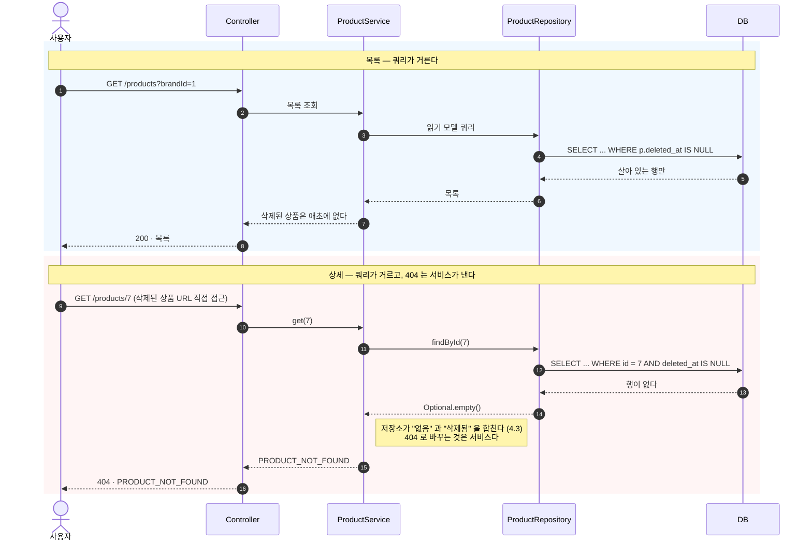

**거르는 것과 404 를 내는 것은 다른 일이다.** 조건은 쿼리에 있어서 호출부가 잊을 수 없고(4.3),
그 빈손을 `PRODUCT_NOT_FOUND` 로 바꾸는 것은 서비스다 — 같은 "없음" 을 API 계약의 어느 코드로
내보낼지는 도메인의 판단이기 때문이다.

**"없음" 과 "삭제됨" 을 구분하지 않는다**(`COMMON-006`). 404 를 두 종류로 나누면
`PRODUCT_NOT_FOUND` 와 `PRODUCT_DELETED` 의 차이로 **삭제된 상품이 존재했다는 사실**이 새어 나간다.

### 9.3 좋아요 — 삭제된 대상에는 더 쌓지 않되, 치울 수는 있다

`LIKE-004`(삭제된 상품에 등록 불가)와 멱등(`LIKE-002`)이 부딪히는 것처럼 보인다 —
"이미 좋아요한 상품이 삭제된 뒤 다시 누르면 아무 일도 안 일어나니 200 아닌가".
**예외를 두지 않는다.** 브랜드 수정·삭제, 상품 수정, 재고 변경·차감에서 일관되게
**"삭제된 대상은 조작 대상이 아니다"** 를 지켜 왔는데, 좋아요 등록만 예외를 두면 그 줄이 끊긴다.
멱등성은 *상태가 바뀌지 않음*을 보장하는 것이지 *없어진 대상에 요청해도 됨*을 뜻하지 않는다.

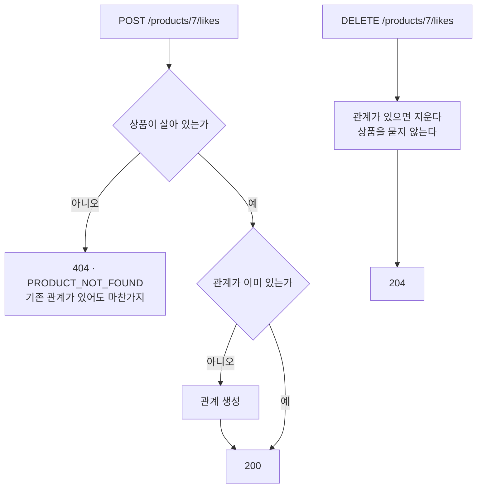

**등록과 취소가 비대칭인 것이 의도다.** 등록은 없어진 상품에 대한 **새 행위**라 막고,
취소는 사용자가 **자기 데이터를 치우는 것**이라 허용한다(`LIKE-006`) — 9장의 파기 관점과도 맞는다.
한 문장으로는 **"삭제된 대상에는 더 쌓지 않되, 치울 수는 있다."**

취소 경로에는 분기가 없다. 상품을 **묻지 않는** 것이 `LIKE-006` 의 성립 조건이라,
테스트도 결과가 아니라 **"묻지 않았다" 는 상호작용**을 검증한다 —
나중에 누가 `unlike` 에 `requireAvailable` 을 넣으면 결과는 그대로여도(관계가 없어 멱등) 그 테스트가 잡는다.

### 9.4 상품의 생애 — 품절은 상태가 아니다

`PRODUCT-022`("재고가 0이어도 상품은 살아 있다")가 무엇을 뜻하는지는 상태도로 보면 분명하다.
**품절은 상품의 상태가 아니라 재고 애그리거트의 값**이라, 상태가 아니라 옆에 붙어 있다.

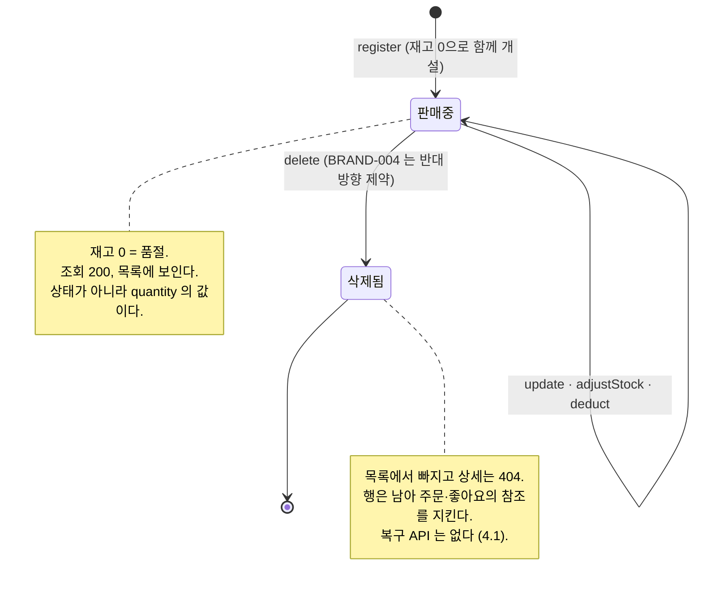

### 9.5 대표 흐름 — 충전 → 접수 → 확정

네 애그리거트가 만나는 유일한 자리다. **잠금 순서와 롤백 범위**가 여기서 정해진다.

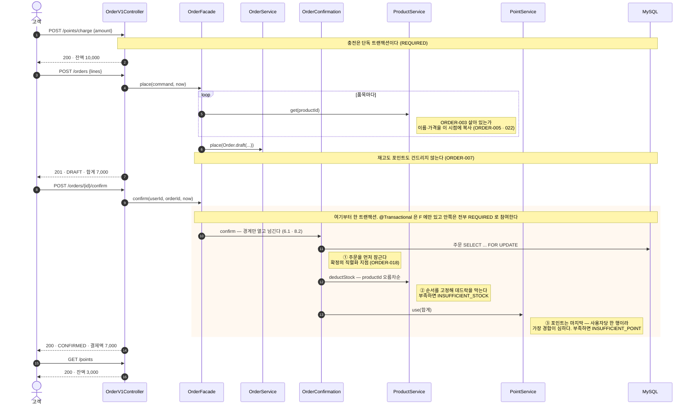

**실패하면 ③에서 던진 예외가 트랜잭션 밖으로 나가 ①②까지 함께 롤백된다**(ORDER-015).
여기서 `try-catch` 로 부분 성공을 만들지 않는 것이 그 규칙을 지키는 방법이고,
사실상 강제이기도 하다 — 참여한 메서드에서 예외가 나면 트랜잭션이 `rollback-only` 로 찍혀
바깥에서 삼켜도 커밋되지 않는다.

**②③이 혼자 커밋되면 안 되는 이유**도 이 그림에 있다. 누가 `deductStock` 이나 `use` 를
경계 밖에서 직접 부르면 **재고만, 또는 잔액만 줄어든 상태**가 남는다.
그 상태는 어떤 업무에서도 정상이 아니다. 도메인 서비스는 트랜잭션을 모르므로(6.1)
그것을 막는 것은 **호출자가 하나뿐이라는 사실**이다 —
`deductStock` 과 `use` 를 부르는 곳은 `OrderConfirmation` 뿐이고, 그것을 부르는 곳은 `OrderFacade` 뿐이다(8.2).
---

---

## 10. SOLID 로 다시 읽기

원칙을 먼저 놓고 코드를 맞춘 것이 아니라, 내린 결정을 원칙으로 다시 읽은 것이다.
**지키지 않기로 한 자리도 함께 적는다** — 원칙은 언제 적용하지 않을지까지 말해야 쓸모가 있다.

### SRP · 변경 이유가 하나인가

"클래스는 한 가지 일만 한다" 가 아니라 **"바뀔 이유가 하나인가"** 로 읽는다.

| 클래스 | 바뀌는 이유 |
|---|---|
| `UserPoint` | 포인트 업무 규칙이 바뀔 때 |
| `UserPointEntity` | 테이블·매핑이 바뀔 때 |
| `PointV1Dto` | API 계약이 바뀔 때 |
| `ApiControllerAdvice` | 실패의 **성질**이 늘 때 |

도메인과 엔티티를 나눈 것이 이 원칙의 적용이다. 한 클래스에 `@Entity` 와 잔액 규칙이 같이 있으면
스키마 변경과 업무 규칙 변경이 같은 파일을 건드린다. 나누면 매핑 코드가 늘지만 **변경이 번지지 않는다.**

`ChargeRequest` 와 `ChargeAmount` 가 같은 "양수" 규칙을 각자 검사하는 것도 여기서 설명된다.
전자는 전송 규약이 바뀔 때, 후자는 업무 규칙이 바뀔 때 바뀐다. 이유가 다르므로 중복이 아니다.

### OCP · 확장에 열리고 변경에 닫혀 있는가

저장소를 인메모리에서 JPA 로 바꿀 때 **도메인·서비스·Facade·컨트롤러·도메인 테스트가 한 줄도 바뀌지 않았다.**
바뀐 것은 `UserPointRepository` 를 구현하는 클래스 하나뿐이다. 확장점을 인터페이스로 열어 둔 결과다.

닫히지 **않은** 자리도 있고 그것이 의도다. 실패의 성질이 새로 생기면 Advice 를 고쳐야 한다.
`statusOf` 가 `default` 없는 `switch` 라서 `Failure` 에 상수를 더하면 **컴파일이 막는다.**
무한히 열어 두고 런타임에 조용히 500 이 되는 것보다, 닫아 두고 확장할 때 강제로 마주치게 하는 쪽을 골랐다.

같은 성질의 새 실패를 더하는 것은 **`DomainError` 에 상수 한 줄**로 끝난다. 거기는 열려 있다.

### LSP · 대체해도 계약이 지켜지는가

상속이 실제로 있는 자리는 둘이고, 둘 다 **상위의 계약을 좁히지 않는다.**

**`BaseEntity extends AuditEntity`**(5.2). `AuditEntity` 가 약속한 것 — 식별자, 감사 컬럼,
`guard()` 가 불리는 시점 — 을 하나도 덜어내지 않고 논리 삭제만 더한다.
그래서 `AuditEntity` 자리에 `BaseEntity` 를 넣어도 달라지는 것이 없다.
방향을 반대로 잡았다면, 즉 `BaseEntity` 에서 `deleted_at` 을 **빼는** 리팩터링이었다면
기존 사용처의 계약이 좁아져 그 순간 LSP 가 깨진다. 5.2 가 "더하는 방향" 을 고른 이유가 이것이다.

**상속이 하나로 줄었다는 것도 LSP 의 결과다**(3.10). 실패의 성질을 상속으로 들면
`ApiControllerAdvice` 가 하위 타입을 `instanceof` 로 되물어야 하는데, 그것은
"상위 타입으로 받았지만 실제로 무엇인지 알아야 한다" 는 뜻이라 대체가 온전하지 않다는 신호다.
성질을 필드로 내리면 Advice 는 `DomainException` 하나만 알고 `failure()` 만 묻는다.

**대체가 일어나지 않는 곳에는 LSP 문제도 없다.** 저장소 포트는 구현이 하나씩뿐이다.
두 번째가 설 수 **없다**는 뜻이 아니라 **세우지 않았다**는 뜻인데, 그 차이를 증명하는 것은
예시가 아니라 `ArchitectureTest` 다 — 도메인 포트는 `org.springframework.data..` 를 의존할 수 없다(3.11).

### ISP · 쓰지 않는 연산을 강요받지 않는가

`UserPointRepository` 가 `JpaRepository` 를 **상속하지 않는** 이유다.

```java
public interface UserPointRepository {        // 도메인이 실제로 부르는 것만
    UserPoint loadForUpdate(Long userId);
    Optional<UserPoint> findForUpdate(Long userId);
    Optional<UserPoint> findByUserId(Long userId);
    UserPoint save(UserPoint userPoint);
    List<PointTransaction> findTransactions(Long userId);
}
```

상속했다면 `deleteAll()` · `findAll()` · `saveAll()` 이 도메인 인터페이스에 딸려 온다.
특히 원장은 append-only 인데 `delete` 가 열려 버린다 — **인터페이스가 넓으면 지키려던 규칙이 샌다.**
`PointTransactionRepository` 를 도메인에 두지 않는 것도 같은 맥락이다. 원장은 `UserPoint` 를 통해서만 생겨야 한다.

**애그리거트를 걸치는 계약도 같은 잣대로 좁힌다.** `OrderConfirmation` 은 `ProductService` 나 `PointService` 를
통째로 받지 않고 `StockDeduction`(`deductStock` 하나) · `PointUsage`(`use` 하나)만 안다(8.2).
통째로 받으면 **주문 확정이 상품을 등록하고 삭제할 수 있는 모양**이 된다.
`ProductAvailability` · `ProductsInBrand` 와 같은 갈래이고, 그래서 이 좁은 계약들은
쓰는 쪽이 아니라 **주제를 가진 쪽**(`domain/product` · `domain/point`)에 산다.

도메인 객체가 `isOwnedBy(userId)` 로 답하고 `getOwnerId()` 를 열지 않는 것도 같은 결이다(묻지 말고 시켜라).
다만 `getBalance()` 처럼 **결과물**인 값은 내준다 — 감추는 것이 목적이 아니라 판단이 흩어지지 않게 하는 것이 목적이다.

### DIP · 정책이 세부사항에 의존하지 않는가

리포지토리 **인터페이스를 도메인이 소유**하고 인프라가 구현한다. 그래서 화살표가 `infrastructure → domain` 으로
뒤집혀 있고, `ArchitectureTest` 가 그 방향을 지킨다. 도메인은 JPA 도 웹도 모르고, 스프링은 거의 모른다 —
`domain` 아래에서 `org.springframework` 을 import 하는 것은 **빈으로 등록되기 위한 `@Service` 하나뿐**이고,
`spring-tx` 는 ArchUnit 이 아예 막는다(6.1).

**적용하지 않기로 한 자리도 있다.**

| 안 만든 추상화 | 왜 |
|---|---|
| `Clock` 포트 (**W1 에서 거절**) | 진입점에서 시각을 한 번 읽어 내려보내면 안쪽이 `now()` 를 부를 방법 자체가 없다. 구조가 이미 규칙을 강제하는데 인터페이스를 더하면 갈아끼울 일 없는 층만 늘어난다 |
| `PaymentProcessor` 같은 전략 | 구현체가 하나뿐이다. 두 번째가 생길 때 **둘을 보고** 뽑아야 시그니처가 맞는다. 하나만 보고 상상으로 만든 인터페이스는 대개 다시 고친다 |

DIP 는 "모든 것을 인터페이스로" 가 아니라 **"정책이 세부사항에 끌려다니지 않게"** 다.
저장 기술은 실제로 바뀌었으므로(인메모리 → JPA) 인터페이스가 값을 했고, 시각 읽기는 바뀔 질문이 없어 값이 없다.

---

---

## 11. 경계 밖

### 11.1 연관관계와 cascade 를 두지 않는다

**애그리거트를 넘는 연관 매핑이 하나도 없다.** `Product` 는 브랜드를 `brand_id` 값으로 든다.
cascade 는 **한 애그리거트 안**에서만 의미가 있고, 이 프로젝트에서 그 자리는
`order` → `order_item` 하나뿐이다. **거기서도 쓰지 않는다.**

| `@OneToMany(cascade, orphanRemoval)` 로 바꾸면 | |
|---|---|
| **얻는 것** | 저장이 저장소 하나로 끝난다. 실질적으로 이것뿐이다 |
| **목록이 N+1 이 된다** | 지금은 주문 N건 + 품목 **배치 한 번**(`findByOrderIdIn`)이다. `LAZY` 컬렉션이면 주문마다 한 번씩 나가고, 막으려면 `join fetch` 나 `@BatchSize` 로 **지금 손으로 하는 그 배치를 되돌려 놓아야** 한다 |
| **확정이 DELETE + INSERT 를 만든다** | `orphanRemoval` 과 상태 전이가 겹치면 품목을 전부 지우고 다시 넣는다(5.3). 품목은 접수 후 불변인데 확정마다 재삽입된다 |
| **프록시가 생긴다** | 5.4 의 "프록시를 만들지 않는다" 에 예외가 하나 생긴다. `LazyInitializationException` · `equals` 불일치가 그 한 곳에서만 살아난다 |

그래서 `OrderItemEntity` 는 `order_id` 를 **값으로** 들고, 저장소 구현이 저장과 배치 조회를 직접 한다.
애그리거트 안이라 cascade 가 **허용되는** 자리인 것과, 여기서 **이득인** 것은 다른 말이다.

**뒤집을 조건**: 품목이 주문 뒤에도 바뀌게 될 때(부분 취소·수량 변경). 그때는 컬렉션의 변경을
저장소가 손으로 맞추는 비용이 커지므로 `orphanRemoval` 이 값을 하기 시작한다.

**DB 외래키도 두지 않는다.** 컬럼만 두고 인덱스를 건다.

| | |
|---|---|
| **cascade 가 발동할 일이 없다** | 브랜드·상품은 **논리 삭제**다. 물리 DELETE 가 일어나지 않으므로 `ON DELETE CASCADE` 는 영원히 잠들어 있는 설정이다. 유일한 물리 삭제인 좋아요 취소는 **말단**이라 따라 지울 것이 없다 |
| **FK 가 지켜 줄 수 있는 것이 우리 규칙보다 약하다** | FK 는 "그 brand_id 행이 존재하는가" 까지만 본다. 우리 규칙(`PRODUCT-003`)은 **"존재하고 삭제되지 않았는가"** 라 더 강하고, `requireAvailable` 이 이미 그걸 본다. FK 를 켜도 삭제된 브랜드를 참조하는 상품은 못 막는다 |
| **애그리거트 독립성** | 애그리거트는 다른 애그리거트를 ID 로만 안다(3.2). FK 는 그 경계를 스키마에 못으로 박아, 나중에 테이블을 다른 DB 로 떼어낼 여지를 없앤다 |
| **테스트는 이유가 아니다** | `DatabaseCleanUp` 은 truncate 전에 `SET FOREIGN_KEY_CHECKS = 0` 을 하므로 FK 가 있어도 깨지지 않는다. 편의 때문에 안 두는 것이 아님을 적어 둔다 |

**대신 잃는 것.** 코드를 우회한 수동 INSERT·데이터 마이그레이션이 고아 행을 만들 수 있다.
FK 가 있으면 DB 가 막아 줄 그것을 우리는 **서비스와 통합 테스트로** 막는다.
운영 규모가 커져 데이터 보정 작업이 잦아지면 다시 볼 결정이다.

---

### 11.2 환경이 강제한 결정

원해서 고른 것이 아니라 **빌드·의존성 구성이 길을 좁혀서** 이렇게 된 자리들이다.
제약이 풀리면 되돌릴 것이므로 그 조건을 함께 적는다.

| 제약 | 그래서 어떻게 했나 |
|---|---|
| 서브프로젝트가 **Java 17** 로 빌드된다. 루트 `java { toolchain { 21 } }` 이 `subprojects {}` 밖에 있다 | 봉인 타입 패턴 매칭은 못 쓴다. 성질을 `Failure` **enum** 으로 들어 `switch` 로 분기하므로(3.10) 이 제약에 걸리지 않는다 — 전수 검사도 그대로 받는다. **되돌릴 조건**: 툴체인을 `subprojects` 안으로 옮기면 record 패턴 같은 것도 열린다 |
| `spring-boot-starter-validation` 이 **`runtimeOnly`** 라 `@Valid`·`@NotNull` 을 컴파일에서 못 쓴다 | 요청 record 의 생성자에서 검증한다. Jackson 이 감싼 예외를 기존 `HttpMessageNotReadableException` 핸들러가 400 으로 만든다 — **새 의존성도 새 핸들러도 없다.** §3.8 의 "문맥 타입은 입력값에" 와 같은 줄이다 |
| `X-USER-ID` 누락은 스프링 기본 동작이 **500** 이다 | `MissingRequestHeaderException` 핸들러를 더해 400 으로 만든다. **식별자의 부재는 인증 실패가 아니다** |
| Basic 인증은 요청마다 호출자가 자격을 싣는다 — 브라우저가 자동으로 붙여 주는 것이 없다 | CSRF 를 끄고 세션을 만들지 않는다(`STATELESS`). 토큰을 요구해도 막는 것은 없고 비브라우저 클라이언트만 못 쓰게 된다. **뒤집을 조건**: 쿠키·세션으로 로그인 상태를 유지하게 되면 CSRF 는 즉시 돌아온다 |

**관리자 경계 테스트는 자격을 실제로 보낸다.** `.with(user("admin").roles("ADMIN"))` 는 인증 주체를
`SecurityContext` 에 직접 꽂으므로 **인가는 검사하지만 인증 장치가 있는지는 검사하지 않는다** —
`httpBasic` 이 아예 없어도 초록이다. 그래서 `httpBasic(...)` 으로 자격을 보내는 테스트를 함께 둔다.

---

### 11.3 운영·법적으로 미리 봐 둔 것

법률 자문이 아니라, **설계가 나중에 법적 요구와 부딪힐 자리를 미리 표시해 둔 것**이다.
이번 구현 범위에서 실제로 조치한 것과, 범위 밖이라 표시만 한 것을 나눈다.

| 자리 | 무엇이 걸리는가 | 지금 |
|---|---|---|
| **인증이 없다** | `X-USER-ID` 헤더를 바꾸면 다른 사람이 된다. 남의 포인트 잔액·좋아요 목록이 그대로 열린다 | `COMMON-002` 에 "식별자이지 자격 증명이 아니다" 라고 **명시**했다. `LIKE-007` 은 남의 것을 404 로 숨긴다. **프로덕션이라면 인증이 선행 조건**이고, 그 전까지 이 API 는 공개망에 두면 안 된다 |
| **좋아요는 취향 정보다** | 개인정보에 해당할 수 있고, 파기 요구가 오면 지워야 한다 | 좋아요는 **실제 삭제**라(`COMMON-009`) 파기가 단순하다. 논리 삭제였다면 "지웠는데 행이 남아 있다" 가 된다 |
| **충전식 포인트** | 현금 충전·환급이 있으면 선불전자지급수단 논의로 간다(전자금융거래법). 이용자 자금 보호·기록 보존 의무가 따라온다 | 이번 범위는 **충전과 사용뿐이고 환급·현금 결제가 없다**. 다만 원장이 append-only 이고 `balanceAfter` 로 정합성을 검증하는 구조라, 감사 추적 요구가 와도 뼈대는 맞다 |
| **주문·결제 기록 보존** | 전자상거래 기록은 일정 기간 보존 의무가 있다 | 주문은 **삭제 연산 자체를 두지 않았다**(4.1 표). 정정은 반대 기록으로 한다 |
| **가격 표시** | 부가세 포함 여부·통화 단위를 화면이 명확히 해야 한다 | `COMMON-003` 은 원 단위 정수라고만 정했다. **세금 표시는 범위 밖**이고, 값 자체는 세전/세후 어느 쪽으로도 해석될 수 있어 화면 문구가 책임진다 |
| **재고 수량 노출** | 법이 아니라 영업 판단이다. 경쟁사도 같은 화면을 본다 | **질문 Q-2** 로 열어 두었다 |
| **미성년자·결제 능력** | 결제 수단이 붙으면 따라온다 | 회원·인증이 범위 밖이므로 이번엔 해당 없음 |

#### 인가를 둘 자리가 없다 — 지금 코드가 그 흔적이다

`LIKE-007`(남의 좋아요 목록은 404)은 컨트롤러가, `ORDER-011`(남의 주문은 404)은 도메인 서비스가 본다.
일관성이 없어 보이지만 **층 설계의 결과가 아니라 빠진 층의 흔적**이다 —
인증이 없으니 `@PreAuthorize` 도 시큐리티 컨텍스트도 `principal` 도 없고,
"요청자 == 대상자" 를 볼 수 있는 곳이 **요청자를 아는 곳**뿐이다.

주문이 도메인 서비스에 있는 것은 그나마 근거가 있다 — 주문을 꺼내야 주인을 알 수 있어
소유자 확인이 조회의 일부다. 좋아요는 데이터에 닿기 전에 끝나므로 진입점에 남았다.

**확장 지점.** 인증이 붙으면 이 비교들은 인가 계층으로 옮겨간다
(`@PreAuthorize("#userId == principal.id")` 또는 필터). 그때 Facade 와 도메인 서비스는 바뀌지 않는다 —
지금 Facade 로 올려 두지 않은 이유이기도 하다. 올렸다면 `application` 이
"요청 어디에 그 값이 실려 왔는가" 까지 알게 되고, 옮길 때 다시 걷어내야 한다.

**설계 판단으로 바꾼 것은 하나뿐이다** — 좋아요를 실제 삭제로 둔 것이 파기 요구와 맞아떨어진다.
나머지는 "지금 안 하지만 어디서 부딪히는지" 를 적어 둔 것이고,
그중 **인증 부재**만은 과제 범위와 무관하게 가장 먼저 메워야 할 구멍이다.

### 11.4 남은 한계와 다음 단계

| | 지금 | 다음 |
|---|---|---|
| **읽기 모델이 네이티브 SQL 이다** | 상품 목록은 `product` · `brand` · `product_like` 세 패키지를 조인하는데, 엔티티가 전부 package-private 이라 QueryDSL 이 볼 수 없다(2.2). 컬럼 이름이 바뀌면 컴파일이 아니라 **런타임에** 깨지고, 지금은 통합 테스트가 그것을 잡는다. **반례가 하나 있다** — 주문 목록(`OrderQueryRepository`)은 이미 QueryDSL 이다. 한 패키지 안만 보므로 생성된 `Q` 클래스가 package-private 엔티티에 닿는다. 그래서 이 한계는 **도구가 없어서가 아니라 경계를 넘기 때문**이다 | `infrastructure/readmodel` 에 읽기 전용 엔티티를 따로 두고 QueryDSL 이 그것만 보게 한다. 쓰기 엔티티의 package-private 경계는 그대로 둔다 |
| **화면 수준 갱신 유실** | 관리자가 재고를 보고 조정하는 사이의 판매가 덮인다. 읽기와 쓰기가 다른 트랜잭션이라 비관적 잠금으로는 구조적으로 못 막는다(6.3) | 화면이 읽은 버전을 함께 보내는 낙관적 잠금. 요구사항에 없어 지금은 `StockAdjustmentLostUpdateTest` 가 **현재 동작을 고정**해 둔다 |
| **인기순 정렬의 비용** | 전체 상품 × 전체 좋아요를 조인하고 집계로 정렬한다(7.5) | `product.like_count` 캐시 컬럼 + 커서 페이징. `PRODUCT-013` 해석을 바꾸는 일이라 혼자 정하지 않는다 |
| **멱등키** | 충전은 멱등이 아니라 같은 요청이 두 번 오면 두 번 충전된다 | `Idempotency-Key`. 요구사항 범위 밖이라 두지 않았다 |
