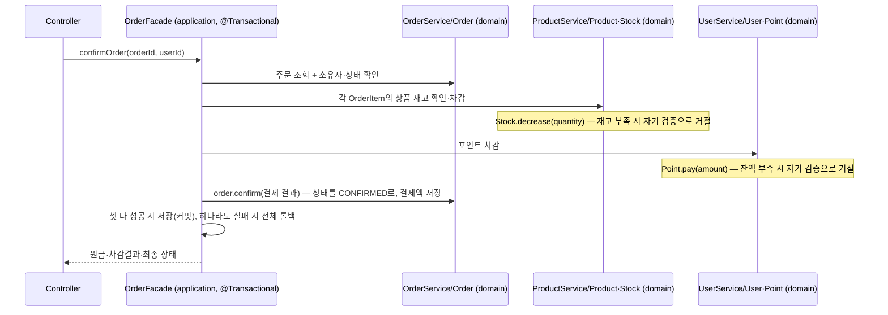

# 2주차 설계 문서

## 1. 버드뷰

```
고객   ──(브랜드 조회, 상품 목록/조회, 좋아요 등록·취소, 내 좋아요 목록,
           포인트 충전, 잔액 조회, 주문 생성, 주문 확정, 내 주문 목록/상세)
        ──→ /api/v1 ─┐
                      ├─→ commerce-api ─→ DB
관리자 ──(브랜드 CRUD, 상품 CRUD, 상품 재고 변경, 주문 목록/상세)
        ──→ /api-admin/v1 ─┘
```

- 모놀리식 구조: `commerce-api` 서버 하나가 모든 요청을 처리하고 DB 하나를 사용한다. (`commerce-batch`, `commerce-streamer`는 이번 라운드 범위 밖)
- 고객과 관리자는 같은 서버로 향하지만, 요구하는 권한이 다르므로 URL 경로로 진입점을 분리한다: 고객은 `/api/v1/**`, 관리자는 `/api-admin/v1/**`.
- 진입점 분리는 단순 경로 정리가 아니라 권한 검사의 기준점이다 (`AdminBoundaryConfig`의 `securityMatcher("/api-admin/**")`가 요청이 컨트롤러에 닿기 전에 ADMIN 권한을 확인).

**interfaces 계층의 진입점 분리가 application 계층(Facade)까지 그대로 내려가진 않는다.** 처음엔 "고객용 Facade·관리자용 Facade로 나눌까"를 검토했지만, 기준을 "이게 바뀌면 뭘 고쳐야 하나"로 바꿔보면 실제 경계는 고객/관리자가 아니라 **조회(query)냐 변경(command)이냐**다:
- 브랜드·상품 **조회**는 고객이 하든 관리자가 하든 같은 이유(정렬·필터·페이지네이션 등 표시 방식)로 바뀐다 — 같은 `Facade`(예: `BrandFacade`)가 담당한다.
- 브랜드·상품 **변경**(생성·수정·삭제)은 업무 규칙(예: "미삭제 상품이 남은 브랜드는 삭제 불가") 때문에 바뀐다 — 별도 `Facade`(예: `BrandAdminFacade`)로 분리한다.
- 이번 라운드는 Brand·Product의 변경 API를 관리자만 호출해서 "관리자=변경, 고객=조회"처럼 보이지만, 이건 이 두 도메인에 우연히 해당하는 결과다. `Order`는 고객도 변경(생성·확정)을 하므로 이 결론을 그대로 재사용할 수 없고, Order 쪽 Facade 경계는 따로 판단한다.
- domain 계층(`BrandModel`/`BrandRepository`/`BrandService`)은 고객·관리자 구분과 무관하게 그대로 공유한다 — 애초에 관리자 전용 aggregate가 따로 있는 게 아니라 같은 `Brand` aggregate를 다루는 것뿐이다.

## 2. 구조와 의존

| 계층 | 책임 (뭐가 바뀌면 이 계층을 고치는가) | 의존 가능 | 의존 불가 |
|---|---|---|---|
| `interfaces` | HTTP 요청/응답 변환 | `application` | `domain`, `infrastructure` |
| `application` | 들어온 요청 처리 순서 조율 | `domain` | `interfaces`, `infrastructure` |
| `domain` | 업무 규칙 그 자체 (배달 방식과 무관하게 항상 지켜야 하는 것) | 없음 | `interfaces`, `application`, `infrastructure` |
| `infrastructure` | DB 등 외부 기술 연동 | `domain` | (제한 없음, 단 `interfaces`/`application`으로부터 의존받으면 안 됨) |

- `domain`은 어떤 계층도 의존하지 않는다 — 반대로 `application`과 `infrastructure`가 `domain`을 의존한다. 방향이 다른 별개의 규칙이다.
- `infrastructure`가 `domain`의 `Repository` 인터페이스를 구현한다(DIP) — `domain`은 실제 구현체(JPA 등)의 존재 자체를 모른다.

## 3. 도메인 관계

### Brand ── Product

- `Brand`와 `Product`는 서로 다른 aggregate. `Product`는 `Brand`를 객체로 참조하지 않고 `brandId`(식별자)만 갖는다.
- 이유: 객체 참조(`@ManyToOne`)로 연결하면 aggregate 경계가 흐려지고(다른 aggregate 내부에 함부로 접근하기 쉬워짐), JPA 연관관계 로딩 문제(N+1)에도 노출된다.
- 상품 응답에 브랜드 정보를 포함해야 할 때는 `application`이 `ProductRepository`와 `BrandRepository`를 각각 조회해서 조합한다. 목록 조회처럼 N개를 처리할 땐 `brandId`를 모아 `findAllById`로 일괄 조회해 N+1을 피한다. ([N+1/일괄조회 정리](../glossary.md))

### User ── Like ── Product

- `Like`는 `Product`와 다른 독립 aggregate. `userId`, `productId`를 ID로만 참조한다.
- 좋아요 등록·취소는 `Product`의 어떤 필드도 변경하지 않는다 — 좋아요 수는 `Like` 테이블에서 그때그때 센다(저장된 카운터 없음). 그래서 `Like`가 `Product`와 같은 트랜잭션/aggregate에 묶일 이유가 없다.
- 중복 방지(같은 유저-상품 조합은 하나만): **애플리케이션 체크(존재 확인 후 등록) + DB 유니크 제약(userId+productId), 둘 다 필요.** 애플리케이션 체크만으로는 두 요청이 거의 동시에 도착하면 둘 다 "없음"으로 판단해 중복 등록이 뚫리는 타이밍 문제가 있고, DB 유니크 제약이 그 상황에서도 원자적으로 막아주는 최종 방어선이다. 애플리케이션 체크는 사용자에게 줄 명확한 에러 메시지를 위한 것이고, DB 제약은 동시성 정합성을 위한 것 — 역할이 다르다.

**등록(409) vs 취소(멱등 200) — 같은 "이미 그 상태" 상황인데 왜 다르게 응답하는가**

| | 등록에 중복 요청 | 취소에 관계 없음 |
|---|---|---|
| 요청의 의미 | "새로 만들어라" | "없애라" |
| 이미 그 상태일 때 | 요청한 대로 되지 않음(새로 안 만들어짐) — 리소스 상태가 요청과 충돌 | 요청한 대로 됨(이미 없음) — 목표 상태에 이미 도달 |
| 판단 | 409 (리소스 상태를 먼저 바꿔야 해결됨 — 여기선 "먼저 취소"해야) | 200 (재시도·중복 호출에 안전해야 하는 삭제형 명령의 멱등성) |

- 대안으로 고려했다가 버린 것: 취소도 404로 거절 — "취소할 대상이 없다"는 게 사실이긴 하지만, DELETE를 여러 번 눌러도(네트워크 재시도 등) 결과가 항상 같아야 한다는 요구가 더 크다고 판단해 채택하지 않음. 등록엔 이 멱등성 요구가 없다(두 번째 등록 요청은 "새로 좋아요를 만들라"는 의미가 이미 있는 관계와 충돌하므로 그대로 거절하는 게 맞음).
- 이 판단 기준(요청이 상태 변경을 요구하는가 vs 상태 도달을 요구하는가)은 `CLAUDE.md`의 400/409 판단 기준("입력을 바꾸면 해결되는가")과 같은 계열의 기준을 삭제형 명령에 맞게 확장한 것이다.

**사용자 식별 — `X-USER-ID` 헤더**

- 이 라운드엔 아직 로그인/세션 등 실제 인증 메커니즘도, `User` 도메인 자체도 없다. 고객 API(`/api/v1/**`)는 요청자를 `X-USER-ID` 헤더 값으로 식별하는 잠정 규약을 쓴다 (관리자 쪽은 이미 `AdminBoundaryConfig`로 실제 `hasRole("ADMIN")` 검사를 쓰고 있어 이와는 별개).
- `GET /users/{userId}/likes`에서 "요청자 ≠ userId → 404"는 이 헤더 값과 경로의 `userId`를 비교해서 판단한다. `User` 존재 자체를 검증하지 않는다(존재를 확인할 `User` 도메인이 아직 없음) — 헤더로 자칭한 값을 그대로 신뢰하는 잠정 상태라는 뜻이다.
- 이 규약은 Like에 한정되지 않고 Round 2의 다른 고객 API(주문 등)에도 같은 방식으로 적용되어야 일관된다 — `User` 도메인 담당 세션에서 실제 인증으로 대체하기 전까지 임시 계약으로 취급한다.

### Order ── OrderItem, 재고·포인트 책임

- `OrderItem`은 `Order`와 같은 aggregate에 속하는 VO다. `Order` 없이는 존재 의미가 없고(생성 시점에 함께 만들어짐), 한번 만들어지면 `productId`·수량·단가가 바뀌지 않는 스냅샷이라 자기 identity가 중요하지 않다 — 상태가 바뀌는 건 `OrderItem`이 아니라 `Order`(DRAFT→CONFIRMED 등).
  - **단가 스냅샷은 DRAFT 생성 시점에 찍는다** (확정 시점이 아니다). 이유: 고객이 주문을 만들 때 본 가격이, 그 뒤 관리자가 `Product.price`를 바꾸더라도 흔들리면 안 된다 — 확정 시점에 찍으면 생성 시 보여준 금액과 확정 시 실제 청구액이 달라질 수 있다. ([스냅샷 정리](../glossary.md)) 이렇게 하면 `OrderItem`은 생성 시 한 번 값이 정해지고 그 뒤로 정말 안 바뀌는 채로 유지된다 — "만들어지면 안 바뀌는 스냅샷"이라는 앞 문장과도 어긋나지 않는다.
  - 반대로 재고·포인트가 "충분한지"는 스냅샷 대상이 아니다 — 이건 확정 시점에 그때그때 검사한다(§5). 가격은 고정, 가용성은 확정 시점 기준이라는 뜻 — 서로 다른 종류의 값이라 시점이 달라도 된다.
  - 단가를 스냅샷으로 저장하는 이유 자체는: `Product`의 가격이 나중에 바뀌어도 이미 만든 주문의 금액은 그대로여야 한다 (Week1 INV-004 "확정 결과 보존"과 같은 원리).
- `Stock`(재고)은 `Product`와 같은 aggregate의 VO다. 근거: 재고 변경 API가 `PUT /api-admin/v1/products/{productId}/stock`로, 독립된 식별자 없이 `Product`에 종속된 하위 자원 모양이다. `Product` 안에서 `decrease(quantity)` 같은 자기 검증 로직을 가진 캡슐화된 객체로 둔다.
- `Point`(포인트 잔액)는 `User`와 같은 aggregate의 VO다. 근거: 포인트 API(`GET /api/v1/points`, `POST /api/v1/points/charge`)에 별도 `pointId`가 없다 — "이 유저의" 잔액이라는 뜻.

### Order 필드과 책임 경계

- `Order` 필드: `status`(DRAFT/CONFIRMED), `userId`(소유자), `items`(`OrderItem` 목록), `paidAmount`(결제액), `confirmedAt`(확정 시각). `paidAmount`는 `OrderItem`들의 단가×수량 합으로 항상 재계산 가능하지만, "확정 시점에 확정된 값을 그대로 보존한다"(Week1 INV-004와 같은 원리)는 원칙에 맞춰 별도 필드로 저장한다 — 나중에 재계산 로직이 바뀌어도 이미 확정된 주문의 결제액은 흔들리면 안 되기 때문.
- **Facade 경계**: 1번 섹션의 "조회=공유, 변경=분리" 기준을 적용하면, `Order`는 Brand/Product와 달리 고객도 변경(생성·확정)을 한다. 그래서 `OrderFacade`(고객: 생성·확정·내 목록/상세)와 `OrderAdminFacade`(관리자: 전체 목록/상세 — 조회만)로 나눈다.
- **품목 0개인 생성 요청은 400으로 거절한다.**
- **확정 시 여러 상품 락 순서**: `OrderItem`마다 `Product`를 잠그는데(5번 섹션의 비관적 락), 요청마다 잠그는 순서가 다르면 데드락 위험이 있다 — `productId` 오름차순으로 잠가서 모든 트랜잭션이 항상 같은 순서로 락을 획득하게 한다.
- **확정 시에도 상품 삭제 여부를 다시 확인한다.** 생성 시점엔 있던 상품이 확정 전에 관리자에 의해 삭제될 수 있다 — 확정 시 재고를 잠가서 조회할 때도 `deletedAt`을 같이 확인해서, 삭제된 상품이면 404로 거절한다(생성 시점 검증과 같은 기준을 재적용하는 것뿐, 새로운 규칙이 아니다).

### User — 회원가입은 범위 밖, 존재 확인은 범위 안

- 이번 라운드에 회원가입/사용자 생성 API가 없다 — `User`는 미리 시드돼 있다고 가정한다. 그래서 `User`는 지금 시점엔 `id`와 `Point`만 있으면 된다(그 외 필드를 요구하는 API가 없음).
- 그렇다고 "존재하지 않는 `userId`를 신경 안 써도 된다"는 뜻은 아니다 — `X-USER-ID` 헤더값은 (Like의 소유권 비교처럼) 그대로 신뢰하지만, `Point`는 실제 DB row가 있어야 잔액을 읽고 쓸 수 있다. 시드된 적 없는 `userId`로 `GET /points`/`POST /points/charge`를 호출하면, `Brand`/`Product`와 동일한 패턴으로 `UserRepository.find()`가 빈 값을 반환 → `NOT_FOUND`(404)로 자연스럽게 거절된다. 별도의 "존재 확인" 로직을 얹는 게 아니라 일반 조회 실패가 곧 이 결과다.
- **`Point.pay()`는 지금 범위에서 뺀다.** `pay()`는 `Order` 확정에서만 쓰이는데 `Order` 자체가 아직 설계 전이라, 지금 만들면 `Order` 설계 시점에 다시 열어야 할 가능성이 크다. "지금 필요하지 않은 걸 미리 만들지 않는다"는 원칙(6번 섹션과 동일)을 적용해 `Order` 설계 때 같이 만든다. 이번 라운드에서 `Point`는 `charge()`와 잔액 조회만 구현한다.

## 4. 대표 흐름 — 포인트 충전 → 주문 생성 → 주문 확정

### 생성과 확정을 분리하는 이유

- 실제로는 결제(PG)가 끝난 뒤에야 주문이 확정된다. 이 과제는 PG 대신 포인트로 결제하지만, "만들기"와 "확정(결제 성공)"이 별개 사건이라는 구조는 같다.
- 더 중요한 이유: **생성 시점에 재고·포인트를 먼저 차감해버리면, 확정되지 않을 수도 있는 주문 때문에 자원이 묶인다.** 예를 들어 재고 1개 남은 상품을 누군가 DRAFT로 주문해놓고 확정을 안 하면, 실제로 사려는 다른 사용자가 재고가 남아있는데도 주문을 못 하게 된다. 그래서 "생성 시 차감 없음, 확정 시에만 차감"이다.

### 세 개의 aggregate가 함께 바뀌는 문제

주문 확정 한 번에 `Order`(DRAFT→CONFIRMED), `Product`(재고 차감), `User`(포인트 차감) — 서로 다른 aggregate 셋이 같이 바뀌어야 한다.

- **원자성이 필요하다**: 셋 중 하나라도 실패하면 전부 롤백돼야 한다 (재고만 깎이고 포인트는 안 깎이는 상태가 생기면 안 됨).
- **같은 DB, 같은 트랜잭션으로 처리한다**: 이 시스템은 모놀리식 · 단일 DB이므로(1번 버드뷰), 서로 다른 aggregate라도 하나의 로컬 DB 트랜잭션으로 묶는 데 기술적 제약이 없다. (다른 서비스/DB로 쪼개져 있었다면 분산 트랜잭션·보상 트랜잭션 같은 걸 고민해야 했겠지만, 지금은 해당 없음.)
- **조율은 `application`이 한다**: `OrderService`(domain)가 `Product`나 `User`를 직접 건드리지 않는다. 2번(구조와 의존)에서 정한 대로, "여러 aggregate를 순서대로 불러 조율하는 일"은 `application`의 책임이다. 각 aggregate는 자기 상태만 자기 메서드로 바꾼다.


```mermaid
sequenceDiagram
    participant C as Controller
    participant F as OrderFacade (application, @Transactional)
    participant O as OrderService/Order (domain)
    participant P as ProductService/Product·Stock (domain)
    participant U as UserService/User·Point (domain)

    C->>F: confirmOrder(orderId, userId)
    F->>O: 주문 조회 + 소유자·상태 확인
    F->>P: 각 OrderItem의 상품 재고 확인·차감
    Note over P: Stock.decrease(quantity) — 재고 부족 시 자기 검증으로 거절
    F->>U: 포인트 차감
    Note over U: Point.pay(amount) — 잔액 부족 시 자기 검증으로 거절
    F->>O: order.confirm(결제 결과) — 상태를 CONFIRMED로, 결제액 저장
    F->>F: 셋 다 성공 시 저장(커밋), 하나라도 실패 시 전체 롤백
    F-->>C: 원금·차감결과·최종 상태
```

- `Product`(재고)와 `User`(포인트)의 검증은 각자 캡슐화된 메서드(`decrease`, `pay`) 안에서 일어난다 — `application`은 순서만 조율하고 검증 로직 자체는 모른다 (Week1부터 이어지는 원칙).
- 확정 이후 `OrderItem`에 저장된 단가·수량은 이후 `Product` 가격 변경과 무관하게 그대로 유지된다.

## 5. 불변식

400/409 기준은 Week1과 동일: **입력을 바꾸면 해결되는가 → 400, 리소스 상태를 먼저 바꿔야 하면 → 409.**

**동시성 제어 — 차감(`decrease`/`pay`)과 증가(`charge`)를 다르게 다룬다**

`Stock.decrease()`/`Point.pay()`는 "읽고→메모리에서 검증·차감→저장" 방식이라, 재고 1개짜리 상품에 동시에 두 주문이 확정을 시도하면 둘 다 "재고 충분"으로 통과할 수 있는 경합(race condition)이 있다 — 멘토링(Devin)에서 지적받음. 세 대안(`docs/glossary.md` 참고) 중 어느 걸 쓸지는 "검증이 현재 상태(현재 재고·잔액)에 의존하는가, 아니면 입력값만으로 판단되는가"에 따라 갈린다.

**차감(`Stock.decrease()`/`Point.pay()`) → 비관적 락**
- 검증("차감 후 0 이상")이 현재 값에 의존한다 — 그래서 원자적 UPDATE를 쓰면 이 조건이 SQL `WHERE`로 흩어져 "도메인 객체가 불변식을 캡슐화한다"는 원칙(CLAUDE.md)이 깨진다.
- 낙관적 락은 충돌 시 재시도 로직을 `application`(Facade)이 따로 구현해야 하는데, 그러면 "Facade는 순서만 조율하고 검증 로직은 모른다"는 계층 경계에 재시도라는 새 책임이 끼어든다.
- **비관적 락**은 읽는 시점(조회 쿼리)에 락만 걸고, `decrease()`/`pay()`의 "읽고→검증→저장" 흐름은 도메인 코드 그대로 재사용할 수 있다.
- 받아들이는 트레이드오프: 경합이 잦아지면 대기 때문에 느려진다. 이 프로젝트는 로컬 실습·실제 트래픽 없음이라(6번 섹션·`docs/blog-notes.md`의 "좋아요 비동기 처리 보류" 판단과 같은 논리) 지금 이 비용은 문제가 되지 않는다.
- 구현 결론: `Order` 확정 흐름(4번 섹션)에서 `Product`/`User`를 조회할 때, 일반 `find()`가 아니라 락을 거는 조회(`findForUpdate` 류, JPA `@Lock(LockModeType.PESSIMISTIC_WRITE)`)를 써야 한다 — `ProductRepository`/`UserRepository`에 이 조회 메서드가 추가로 필요하다는 뜻. (`pay()` 자체는 `Order` 설계 시점으로 미룸 — 8번 섹션 참고)

**`Order` 자신의 DRAFT→CONFIRMED 전이도 같은 방식(비관적 락)으로 보호한다.** 처음엔 빠졌던 부분 — `Product`/`User`만 락을 걸면, **같은 주문**에 확정 요청이 두 번 겹칠 때(더블클릭, 클라이언트 재시도) 막을 방법이 없다: 둘 다 `Order`를 락 없이 읽어 DRAFT임을 확인하고 통과한 뒤, 재고·포인트를 각자 차감해버려 실제로 두 번 반영되는 버그가 생긴다.
- "이미 CONFIRMED인가"는 계산 없는 단순 값 비교라 원자적 UPDATE(`WHERE status='DRAFT'`)로도 캡슐화가 깨지지 않는다는 점에서 `charge()`와 더 비슷하지만, 확정 흐름이 어차피 `Order`를 읽어서 `items`(재고 차감 대상, 총액 계산용)를 써야 하므로 그 조회 자체를 `findForUpdate`로 바꾸는 게 더 단순하다 — Product/User와 동일한 메커니즘을 재사용해 트랜잭션 안에 서로 다른 동시성 전략을 세 가지로 늘리지 않는다는 실용적 이유로 비관적 락을 택함.
- 락 순서: `Order` → `Product`(productId 오름차순) → `User`. `Order`를 항상 제일 먼저 잠그므로 기존 데드락 방지 순서 규칙과 충돌하지 않는다.

**증가(`Point.charge()`) → 원자적 UPDATE**
- `charge()`의 유일한 규칙("충전 금액은 양수")은 입력값만으로 판단되고 현재 잔액과 무관하다 — 덧셈은 뺄셈과 달리 하한을 깨뜨릴 위험이 없고, 상한도 정하지 않았다.
- 그래서 도메인에서 `amount > 0`만 검증한 뒤, 리포지토리는 `UPDATE user SET point_balance = point_balance + :amount WHERE id = :id` 같은 원자적 UPDATE로 반영해도 검증이 SQL로 새어나가지 않는다 — 차감 때 원자적 UPDATE를 버렸던 이유가 여기선 적용되지 않는다.
- 락도 재시도도 필요 없다 — 동시 충전 두 건이 각자 원자적으로 더해지므로 lost-update 자체가 생기지 않는다.

| 규칙 | 책임 위치 | 위반 시 |
|---|---|---|
| 재고 차감 요청 수량은 양수, 차감 후 수량은 0 이상 | `Stock.decrease()` | 400 — 수량을 줄여서 재요청하면 해결됨 |
| 포인트 충전 요청 금액은 양수 | `Point.charge()` | 400 |
| 포인트 차감 후 잔액은 0 이상 | `Point.pay()` | 400 — 결제액을 줄이거나 먼저 충전하면 해결됨 |
| 이미 `CONFIRMED`인 주문은 재확정 불가 | `Order.confirm()` | 409 — 어떤 입력을 보내도 안 되고, 이 주문 자체를 재확정할 수 없음 (다른 흐름으로) |
| 주문 소유자와 요청자가 다름 | `Order` (소유권 검증) | 404 — Week1 INV-001과 동일하게, 주문 존재 여부 노출 방지 |
| 같은 사용자-상품 좋아요는 하나만 저장 | `Like` (앱 체크 + DB 유니크 제약) | 409 — 이미 있는 관계라 입력을 바꿔도 소용없음 |
| 삭제된 상품에는 새 좋아요 등록 불가 | `Like` 등록 시 `Product` 삭제여부 확인 | 404 |
| 삭제되지 않은 상품이 남아있는 브랜드는 삭제 불가 (재고 0인 상품 포함) | `Brand` 삭제 시 `Product` 존재여부 확인 | 409 — 상품을 먼저 정리해야 풀림 |
| 삭제된 브랜드·상품은 고객 조회·신규 주문·수정·재고변경 대상에서 제외 | 각 조회/변경 로직 | 404 |
| 주문 생성 시 상품 존재·미삭제, 수량 양수를 확인 | `Order` 생성 검증 | 400(수량) / 404(상품) |
| 품목이 하나도 없는 주문은 생성 불가 | `Order` 생성 검증 | 400 |
| 한 주문 안에 같은 상품이 여러 품목으로 들어오면 수량을 합쳐 하나로 만든다. 재고 확인은 합산된 총수량 기준 | `Order` 생성 로직 | — (거절이 아니라 병합) |
| 확정 시 여러 상품을 잠글 때 `productId` 오름차순으로 잠근다 | `Order` 확정 조율(`application`) | — (데드락 방지, 거절 아님) |
| 상품 수정 시 브랜드는 변경되지 않는다 (수정 API 입력에 브랜드 변경 항목 없음) | `Product` 수정 로직 | — |
| 상품 이름은 비어있지 않고 255자 이하 | `Product` 생성자/수정 | 400 |
| 상품 가격은 0 이상(음수 불가), 상한 없음 | `Product` 생성자/수정 | 400 |
| 브랜드 이름·카테고리는 비어있지 않고 255자 이하 | `Brand` 생성자 | 400 |
| 브랜드 설명은 비어있지 않고 500자 이하 | `Brand` 생성자 | 400 |

이름·가격 검증 범위를 최소로 잡은 이유: 상품 등록·수정은 관리자 전용 API라 일반 사용자의 악의적 입력 리스크가 낮고, XSS 같은 문제는 입력 차단보다 출력(렌더링) 단계에서 막는 게 정석이라 특수문자 제한의 실효성이 낮다. 글자수 상한(255)만 DB 컬럼 제약 때문에 둔다.

브랜드 필드 길이 상한의 근거는 두 가지로 나뉜다.
- `name`·`category`: Product name과 동일하게, `@Column` 길이 미지정 시 Hibernate가 기본으로 잡는 `VARCHAR(255)`에 맞춘 것 — DB 컬럼 제약이 근거다. 다만 이번엔 암묵적 기본값에 맡기지 않고 `@Column(length = 255)`로 명시했다: 지정 없이 두면 나중에 코드를 보는 사람이 "실수로 빠뜨린 건지, 255로 의도한 건지" 구분할 수 없기 때문이다.
- `description`: 자유 서술형이라 name·category와 같은 논리(기본값에 맞춘다)를 적용할 수 없다 — 애초에 DB 기본값(255)보다 길게 담고 싶어서 생긴 질문이었다. `@Lob`을 시험 삼아 붙여 실제 생성되는 DDL을 관찰해보니 MySQL에서 `LONGTEXT`(최대 4GB)로 매핑됐는데, 브랜드 소개문 하나가 그 정도로 커질 이유가 없어 과도하다고 판단했다. 500자는 "이 정도면 넉넉하다"는 감각적 판단이며, DB 제약에서 역산한 값이 아니다 — 대기업 커머스에서도 상세 콘텐츠(이미지 포함 HTML 등)는 별도 테이블·CDN으로 분리하고 메인 테이블엔 짧은 값만 두는 경우가 흔하다는 점도 참고했다. 다만 이 프로젝트는 실습 규모(브랜드 소수, 로컬 환경)라 그 수준의 분리는 과설계로 보고 채택하지 않았다.
- 세 필드 모두 DB 컬럼 크기와 애플리케이션 검증(생성자)의 상한을 반드시 동일한 값으로 맞춘다 — DB 컬럼 크기만 정해두고 생성자에서 확인하지 않으면, 상한을 초과한 입력이 도메인 예외(400) 없이 DB 트렁케이션 에러나 SQL 예외로 새어나갈 수 있기 때문이다.

## 6. 삭제 방식

`Brand`, `Product` 둘 다 **soft delete**(`BaseEntity`의 `deletedAt`)를 쓴다. (`Order`는 삭제 API 자체가 없어서 해당 없음.)

- `Brand`: `BaseEntity`가 이미 전역적으로 soft delete를 지원하고, 재사용성을 위해 다른 동작을 추가하지 않는다는 원칙(`BaseEntity` 주석)이 있어 굳이 다른 방식을 쓸 이유가 없다.
- `Product`: **hard delete는 못 쓴다.** `OrderItem`은 `productId`만 갖고 상품 이름은 저장하지 않는다(스냅샷은 수량·단가까지만). `Product`를 물리적으로 지우면 과거 주문 상세에서 상품명을 조회할 방법이 없어져 주문 내역 자체가 깨진다. soft delete로 행을 남겨두면, "삭제된 상품은 신규 주문·조회 대상에서 제외"하는 규칙은 조회 로직에서 `deletedAt`을 걸러내는 것으로 처리하고, 과거 `OrderItem`의 상품명 조회는 계속 가능하다.

**관리자 조회도 삭제된 행은 제외한다** — `GET /api-admin/v1/brands`(목록)·`GET /api-admin/v1/brands/{brandId}`(상세) 모두 고객 조회와 동일하게 `deletedAt`을 걸러낸다. 처음엔 "관리자는 삭제된 것도 복구·이력 확인이 필요하지 않을까"를 검토했지만:
- 이번 주차 API 계약 어디에도 복구(un-delete) 엔드포인트가 없다. `BaseEntity`에 `restore()`가 이미 있긴 하지만(스타터부터 재사용 목적으로 딸려온 범용 메서드), 그걸 호출할 API가 없으면 "목록에 보인다"와 "복구 가능하다"는 별개다.
- 삭제 이력 확인 요구도 과제 어디에도 없다.
- soft delete라 데이터는 사라지지 않는다 — 지금 안 보여줘도 나중에 필요해지면 그때 조회 API를 열면 된다. 필요하지 않은 걸 미리 만들지 않는다는 원칙(좋아요 비동기 처리 보류 때와 같은 논리)을 여기에도 적용한다.

**브랜드 삭제 시 상품 존재 확인은 `application`(`BrandAdminFacade`)에서 조율한다.** "삭제되지 않은 상품이 남아있는 브랜드는 삭제 불가(재고 0 포함)"는 `Brand`·`Product` 두 aggregate에 걸친 규칙이라 어느 한쪽의 domain Service가 단독으로 지킬 수 없다 — `ProductAdminFacade`가 상품 생성 시 `BrandService.getBrand()`로 브랜드 존재를 확인하는 것과 같은 원칙(4번 섹션 "조율은 application이 한다")을 반대 방향에도 그대로 적용한다: `BrandAdminFacade.deleteBrand()`가 `ProductService.hasActiveProduct(brandId)`를 먼저 확인하고, 있으면 409로 거절, 없으면 그제서야 `BrandService.deleteBrand()`를 호출한다. `ProductService`는 브랜드 삭제라는 개념 자체를 모른다 — "이 브랜드를 참조하는 미삭제 상품이 있는가"라는 자기 aggregate 범위의 질문에만 답한다.

## 7. 고객·관리자 응답 필드 구분

상품/브랜드 응답은 고객·관리자 모두 같은 필드를 본다(id, name, price, 재고, brand 정보, 좋아요 수 — 재고를 숨길 뚜렷한 이유가 없음). 관리용 메타데이터(`deletedAt`, `createdAt`, `updatedAt`)만 관리자 응답에 추가로 노출한다. (단, 위 결정에 따라 관리자 조회도 삭제된 행은 애초에 대상에서 빠지므로, 응답에 보이는 `deletedAt`은 사실상 항상 `null`이다 — 나중에 삭제 이력 조회가 필요해질 때를 대비한 필드로 남겨둔다.)

**채택했다가 버린 대안: `Info`를 고객용·관리자용으로 따로 만들기.** 처음엔 `BrandInfo`(고객, 최소 필드)와 `BrandAdminInfo`(관리자, 메타데이터 포함)를 별도 클래스로 만들었다. 그런데 이렇게 하니 두 가지 문제가 실제로 드러났다:
- 관리자용 조회(`GET /api-admin/v1/brands`, `GET /api-admin/v1/products`)를 구현하면서, "조회는 공유 Facade가 담당한다"는 1번 섹션의 원칙과 충돌했다 — `BrandAdminInfo`를 쓰려면 조회 로직도 관리자 쪽(`BrandAdminFacade`)에 있어야 했는데, 그러면 조회·변경이 다시 한 Facade에 섞인다.
- 실제로 `ProductAdminFacade`에 조회(`getProduct`/`getProducts`)와 변경(`createProduct`/`updateProduct`/...)이 섞인 채로 구현됐던 걸 나중에 발견했다 — Brand는 Facade를 제대로 나눴지만 관리자용 GET 엔드포인트 자체를 빠뜨렸다.

그래서 `BrandInfo`/`ProductInfo` 하나로 합치고(메타데이터 필드까지 전부 포함), 필드를 숨기는 책임은 **interfaces 계층의 응답 DTO**로 옮겼다 — `BrandV1Dto.BrandResponse`(고객, 최소 필드만 매핑)와 `BrandAdminV1Dto.BrandResponse`(관리자, 전체 필드 매핑)가 같은 `BrandInfo`에서 각자 필요한 것만 뽑아 쓴다. 이러면 조회 로직(`BrandFacade`/`ProductFacade`)은 고객·관리자 구분 없이 완전히 하나로 공유되고, "누구에게 뭘 보여줄지"는 순전히 DTO 매핑 코드만의 책임이 된다 — 1번 섹션 원칙과 다시 일치한다.

## 8. API 계약표

### 고객 (`/api/v1`)

| method·path | 입력 | 성공 | 대표 오류 |
|---|---|---|---|
| `GET /brands/{brandId}` | - | 200, 브랜드 상세 | 404 (없음/삭제됨) |
| `GET /products` | `brandId?`, `sort`(latest/price_asc/likes_desc), 페이지 | 200, 목록+브랜드정보+좋아요수 | 400 (잘못된 sort 값) |
| `GET /products/{productId}` | - | 200, 상세 | 404 |
| `POST /products/{productId}/likes` | - | 200 | 404(상품없음/삭제됨), 409(이미 좋아요) |
| `DELETE /products/{productId}/likes` | - | 200 | 404(상품없음), 관계 없어도 200(멱등 처리) |
| `GET /users/{userId}/likes` | - | 200, 내 좋아요 목록 | 404 (요청자≠userId, 존재 비노출) |
| `POST /points/charge` | `amount`(양수) | 200, 충전 후 잔액 | 400 (0 이하/타입 오류) |
| `GET /points` | - | 200, 잔액 | - |
| `POST /orders` | 품목 목록(productId, 수량) | 201, DRAFT 주문 | 400(수량), 404(상품없음/삭제됨) |
| `POST /orders/{orderId}/confirm` | - | 200, CONFIRMED 주문(결제액 포함) | 404(소유자 아님), 409(이미 확정됨), 400(재고·포인트 부족) |
| `GET /orders` | - | 200, 내 주문 목록 | - |
| `GET /orders/{orderId}` | - | 200, 내 주문 상세 | 404(소유자 아님) |

### 관리자 (`/api-admin/v1`, 전부 ADMIN 권한 필요 → 아니면 403)

| method·path | 입력 | 성공 | 대표 오류 |
|---|---|---|---|
| `GET /brands` | - | 200, 목록 | - |
| `POST /brands` | name, description, category | 201 | 400(유효성) |
| `GET /brands/{brandId}` | - | 200 | 404 |
| `PUT /brands/{brandId}` | name, description, category | 200 | 400, 404 |
| `DELETE /brands/{brandId}` | - | 200 | 409(미삭제 상품 존재), 404 |
| `GET /products` | - | 200, 목록 | - |
| `POST /products` | name, price, brandId, 초기재고 | 201 | 400(유효성), 404(브랜드없음/삭제됨) |
| `GET /products/{productId}` | - | 200 | 404 |
| `PUT /products/{productId}` | name, price (brandId 변경 불가) | 200 | 400, 404 |
| `DELETE /products/{productId}` | - | 200 | 404 |
| `PUT /products/{productId}/stock` | 최종 수량(0 이상) | 200 | 400(음수), 404 |
| `GET /orders` | - | 200, 전체 주문 목록 | - |
| `GET /orders/{orderId}` | - | 200, 주문 상세 | 404 |

**확정**: 좋아요 취소는 관계가 없어도 항상 200(멱등)으로 응답한다. 등록의 중복(409)과 다르게 응답하는 이유와 대안 비교는 3번 섹션("등록 vs 취소") 참고.

**범위를 좁힌 것**: `GET /users/{userId}/likes`는 지금은 `productId` 목록만 반환한다. 상품 상세(가격·브랜드정보 등)까지 합친 응답은 `Product` API 모양이 다른 세션에서 아직 안정화되는 중이라 지금 합치면 남의 파일(Product 쪽 domain/interfaces)까지 손대야 하고, 나중에 바뀔 수 있는 걸 미리 붙잡는 셈이 된다. 안정화되면 `Brand`─`Product`와 같은 배치조회 패턴(3번 섹션, `findAllById`)으로 합치는 걸 후속 작업으로 남겨둔다 — 지금 필요하지 않은 걸 미리 만들지 않는다는 원칙(6번 섹션과 같은 논리)을 여기에도 적용.
