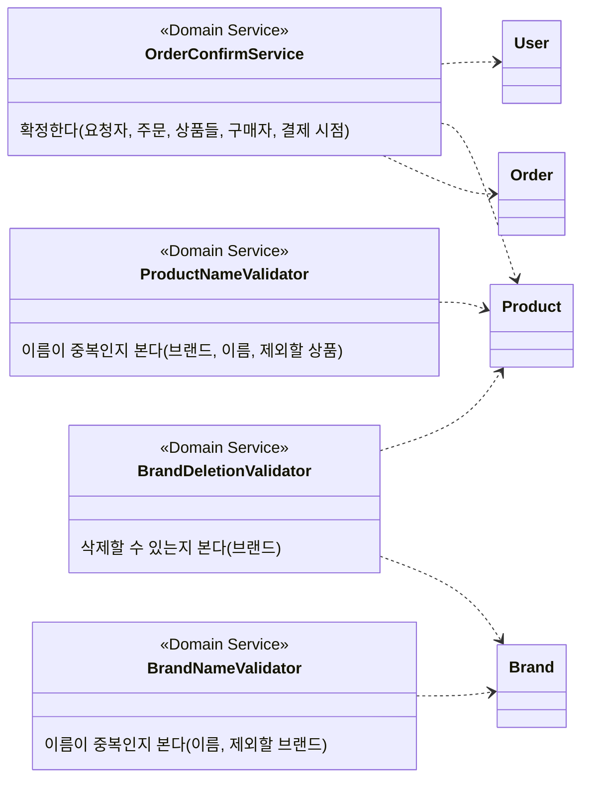

# commerce-api 도메인 관계

이 문서는 **모델 구조만** 갖는다. 무엇이 존재하고 누가 누구를 아는지를 그린다.

지켜야 하는 조건은 [`domain-rules.yaml`](./domain-rules.yaml)에, 요구사항 문장은 [요구사항 문서](./requirements.md)에 있다. 여기에는 규칙 문장을 적지 않는다.

## 클래스 다이어그램

`0..1 PaymentResult`는 주문에 결제 결과가 없거나 하나만 존재한다는 뜻이다. `DRAFT` 주문에는 없고, `CONFIRMED` 주문에는 하나가 존재한다.

## 관계

| 관계 | 누가 누구를 아는가 |
| --- | --- |
| Brand 1 ── N Product | Product가 자신이 속한 Brand를 안다. Brand는 Product를 모른다. |
| User 1 ── N Like N ── 1 Product | Like가 User와 Product를 안다. Product는 Like를 모른다. |
| Order 1 ── 1..N OrderItem | Order가 자신의 OrderItem을 가진다. |
| OrderItem N ── 1 Product | OrderItem이 주문한 Product를 가리킨다. |
| User 1 ── N Order | Order가 구매자인 User를 안다. |
| Order 1 ── 0..1 PaymentResult | Order가 자신의 결제 결과를 가진다. |

Like는 고객과 상품 사이에 따로 존재하는 관계라서 Entity로 둔다. 고객 쪽(내 좋아요 목록)과 상품 쪽(좋아요 수)에서 모두 묻고, 상품이 삭제되어도 남는다. (R-LIKE-03, R-LIKE-05, R-LIKE-08)

## 애그리거트와 책임

| 애그리거트 | 루트 | 묶인 값 | 소유하는 것 |
| --- | --- | --- | --- |
| 상품 | Product | Stock | 이름·가격·소속 브랜드·재고·삭제 여부 |
| 사용자 | User | Point | 잔액 |
| 주문 | Order | OrderItem, PaymentResult | 구매자·품목·합계·상태·결제 결과 |

애그리거트는 **규칙을 지키는 경계**다. 각 애그리거트가 무엇을 지키는지는 [`domain-rules.yaml`](./domain-rules.yaml)의 같은 이름 그룹에 있다.

## 도메인 서비스

**도메인 규칙인데 한 애그리거트 안에서 답할 수 없는 것**을 맡는다. 판단에 다른 애그리거트나 같은 종류의 다른 인스턴스 전부가 필요해서 어느 루트에도 넣을 수 없다.

| 도메인 서비스 | 애그리거트 안에 둘 수 없는 이유 |
| --- | --- |
| `OrderConfirmService` | 주문·상품·사용자 세 애그리거트의 상태를 함께 바꿔야 확정이 끝난다 |
| `BrandDeletionValidator` | `Brand`가 자기 `Product`를 모르므로 `Brand.delete()`가 스스로 답할 수 없다 |
| `BrandNameValidator` | 한 `Brand`는 다른 `Brand` 전부를 볼 수 없다 |
| `ProductNameValidator` | 한 `Product`는 같은 브랜드의 다른 `Product`를 볼 수 없다 |

상태를 바꾸는 것은 `OrderConfirmService` 하나뿐이지만, 나머지 셋도 도메인 서비스다. 기준은 상태 변경이 아니라 **규칙이 어느 객체에도 속하지 않는 것**이다.

확정은 **검사를 모두 마친 뒤에 상태를 바꾼다.** 한 상품이라도 재고가 모자라거나 잔액이 모자라면 어느 것도 바뀌지 않는다.
