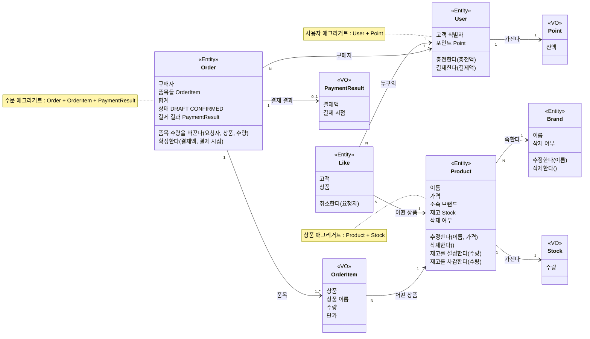

# commerce-api 도메인 관계

이 문서는 [요구사항 문서](./requirements.md)를 기반으로 작성했으며, 모든 규칙은 요구사항 ID와 연결된다.

## 클래스 다이어그램

`0..1 PaymentResult`는 주문에 결제 결과가 없거나 하나만 존재한다는 뜻이다. `DRAFT` 주문에는 없고, `CONFIRMED` 주문에는 하나가 존재한다.

## 관계

| 관계                              | 누가 누구를 아는가                                      | 규칙              |
| ------------------------------- | ----------------------------------------------- | --------------- |
| Brand 1 ── N Product            | Product가 자신이 속한 Brand를 안다. Brand는 Product를 모른다. | REL-01 ~ REL-04 |
| User 1 ── N Like N ── 1 Product | Like가 User와 Product를 안다. Product는 Like를 모른다.    | REL-05 ~ REL-08 |
| Order 1 ── 1..N OrderItem       | Order가 자신의 OrderItem을 가진다.                      | REL-09 ~ REL-11 |
| OrderItem N ── 1 Product        | OrderItem이 주문한 Product를 가리킨다.                   | REL-12 ~ REL-14 |
| User 1 ── N Order               | Order가 구매자인 User를 안다.                           | REL-15          |
| Order 1 ── 0..1 PaymentResult   | Order가 자신의 결제 결과를 가진다.                          | REL-16          |

### 관계에 걸린 규칙

규칙 ID는 `REL-순번` 형식이다. 새 규칙은 다음 순번을 받는다.

| ID     | 관계                  | 규칙                                              | 요구사항·정책 ID                         |
| ------ | ------------------- | ----------------------------------------------- | ---------------------------------- |
| REL-01 | Brand–Product       | 상품의 브랜드는 바뀌지 않는다. 바꾸려 하면 요청 전체를 거절한다.           | R-ADMIN-07, P-ADMIN-04             |
| REL-02 | Brand–Product       | 존재하며 삭제되지 않은 브랜드에만 상품을 만들 수 있다.                 | R-ADMIN-05                         |
| REL-03 | Brand–Product       | 삭제되지 않은 상품이 연결된 브랜드는 삭제할 수 없다. 재고가 0인 상품도 포함한다. | R-ADMIN-02, R-ADMIN-03             |
| REL-04 | Brand–Product       | 브랜드를 삭제해도 상품의 브랜드 참조는 남는다.                      | R-ADMIN-14                         |
| REL-05 | User–Like–Product   | 한 고객은 한 상품에 좋아요를 하나만 가진다.                       | R-LIKE-02                          |
| REL-06 | User–Like–Product   | 삭제되지 않은 상품에만 좋아요를 등록할 수 있다.                     | R-LIKE-01, R-LIKE-07               |
| REL-07 | User–Like–Product   | 상품의 좋아요 수는 Like를 세어 얻는다.                        | R-LIKE-05                          |
| REL-08 | User–Like–Product   | 상품이 삭제되어도 Like는 남고, 고객은 자신의 Like를 취소할 수 있다.     | R-LIKE-08                          |
| REL-09 | Order–OrderItem     | 품목은 하나 이상이다.                                    | R-ORDER-01, P-ORDER-01             |
| REL-10 | Order–OrderItem     | 한 주문에 상품마다 품목이 하나다. 같은 상품은 수량을 합산한다.            | R-ORDER-15, P-ORDER-02             |
| REL-11 | Order–OrderItem     | 합계는 품목 금액의 합이다.                                 | R-ORDER-02                         |
| REL-12 | OrderItem–Product   | 존재하며 삭제되지 않은 상품만 품목이 될 수 있다.                    | R-ORDER-05                         |
| REL-13 | OrderItem–Product   | 품목은 주문을 생성할 때의 상품 이름과 단가를 기록한다.                 | R-ORDER-02, P-ORDER-03, P-ORDER-07 |
| REL-14 | OrderItem–Product   | 상품이 바뀌거나 삭제되어도 품목은 그대로다.                        | R-ADMIN-14, P-ORDER-07             |
| REL-15 | User–Order          | 고객은 자신의 주문만 다룬다.                                | R-ACCESS-03, R-ORDER-13            |
| REL-16 | Order–PaymentResult | 확정된 주문만 결제 결과를 가진다.                             | R-ORDER-12                         |

Like는 고객과 상품 사이에 따로 존재하는 관계라서 Entity로 둔다. 고객 쪽(내 좋아요 목록)과 상품 쪽(좋아요 수)에서 모두 묻고, 상품이 삭제되어도 남는다. (R-LIKE-03, R-LIKE-05, R-LIKE-08)

## 애그리거트와 책임

| 애그리거트 | 루트      | 묶인 값                     | 책임                                    |
| ----- | ------- | ------------------------ | ------------------------------------- |
| 상품    | Product | Stock                    | 재고 설정과 차감을 수행하고 재고가 음수가 되지 않게 한다.     |
| 사용자   | User    | Point                    | 포인트 충전과 결제를 수행하고 잔액이 음수가 되지 않게 한다.    |
| 주문    | Order   | OrderItem, PaymentResult | 품목과 합계를 관리하고 주문 상태와 결제 결과를 일관되게 유지한다. |
