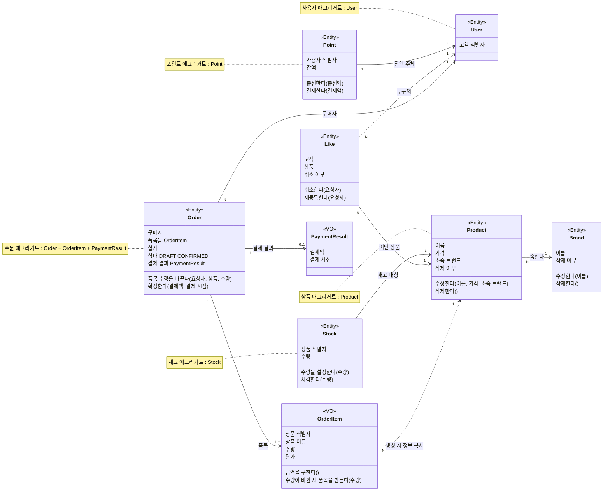
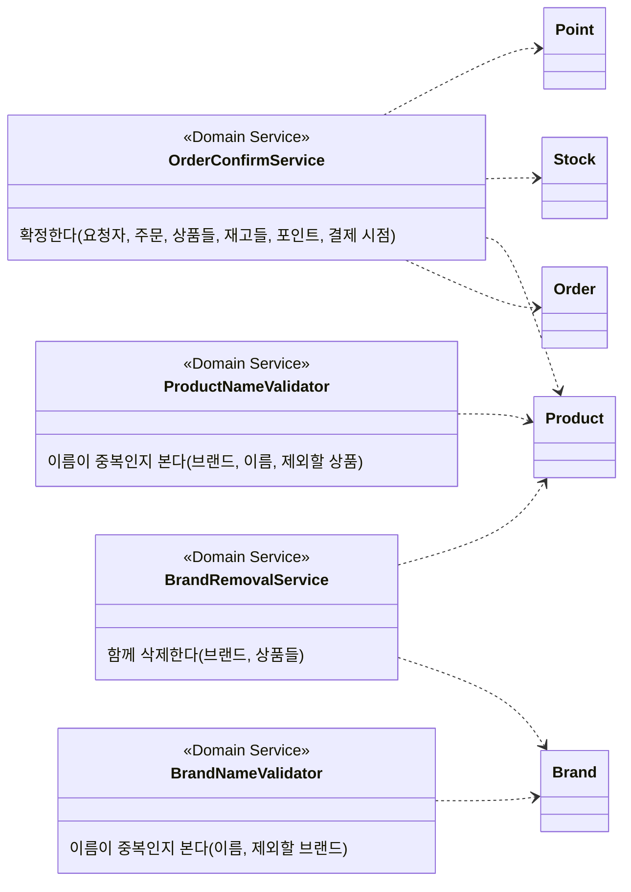

# commerce-api 도메인 관계

> 변경일: 2026-10-07
>
> Point·Stock을 독립 저장 단위로 분리하는 설계안이다. 기존 ADR과 `decisions.md`는 당시 VO 선택의 기록으로 보존한다.

이 문서는 **모델 구조만** 갖는다. 무엇이 존재하고 누가 누구를 아는지를 그린다.

지켜야 하는 조건은 [`domain-rules.yaml`](./domain-rules.yaml)에, 요구사항 문장은 [요구사항 문서](./requirements.md)에 있다. 여기에는 규칙 문장을 적지 않는다.

## 클래스 다이어그램

```mermaid
classDiagram
    direction LR

    class User {
        <<Entity>>
        고객 식별자
    }
    class Point {
        <<Entity>>
        사용자 식별자
        잔액
        충전한다(충전액)
        결제한다(결제액)
    }
    class Brand {
        <<Entity>>
        이름
        삭제 여부
        수정한다(이름)
        삭제한다()
    }
    class Product {
        <<Entity>>
        이름
        가격
        소속 브랜드
        삭제 여부
        수정한다(이름, 가격, 소속 브랜드)
        삭제한다()
    }
    class Stock {
        <<Entity>>
        상품 식별자
        수량
        수량을 설정한다(수량)
        차감한다(수량)
    }
    class Like {
        <<Entity>>
        고객
        상품
        취소 여부
        취소한다(요청자)
        재등록한다(요청자)
    }
    class Order {
        <<Entity>>
        구매자
        품목들 OrderItem
        합계
        상태 DRAFT CONFIRMED
        결제 결과 PaymentResult
        품목 수량을 바꾼다(요청자, 상품, 수량)
        확정한다(결제액, 결제 시점)
    }
    class OrderItem {
        <<VO>>
        상품 식별자
        상품 이름
        수량
        단가
        금액을 구한다()
        수량이 바뀐 새 품목을 만든다(수량)
    }
    class PaymentResult {
        <<VO>>
        결제액
        결제 시점
    }

    Point "1" --> "1" User : 잔액 주체
    Product "N" --> "1" Brand : 속한다
    Stock "1" --> "1" Product : 재고 대상
    Like "N" --> "1" User : 누구의
    Like "N" --> "1" Product : 어떤 상품
    Order "N" --> "1" User : 구매자
    Order "1" --> "1..*" OrderItem : 품목
    Order "1" --> "0..1" PaymentResult : 결제 결과
    OrderItem "N" ..> "1" Product : 생성 시 정보 복사

    note for User "사용자 애그리거트 : User"
    note for Point "포인트 애그리거트 : Point"
    note for Product "상품 애그리거트 : Product"
    note for Stock "재고 애그리거트 : Stock"
    note for Order "주문 애그리거트 : Order + OrderItem + PaymentResult"
```

`0..1 PaymentResult`는 주문에 결제 결과가 없거나 하나만 존재한다는 뜻이다. `DRAFT` 주문에는 없고, `CONFIRMED` 주문에는 하나가 존재한다.

## 관계

| 관계 | 누가 누구를 아는가 |
| --- | --- |
| Brand 1 ── N Product | Product가 자신이 속한 Brand를 안다. Brand는 Product를 모른다. |
| User 1 ── 1 Point | Point가 잔액의 사용자 식별자를 가진다. User는 Point 상태를 소유하지 않는다. |
| Product 1 ── 1 Stock | Stock이 재고 대상 상품 식별자를 가진다. Product는 Stock 상태를 소유하지 않는다. |
| User 1 ── N Like N ── 1 Product | Like가 User와 Product를 안다. Product는 Like를 모른다. |
| Order 1 ── 1..N OrderItem | Order가 자신의 OrderItem을 가진다. |
| OrderItem → Product | OrderItem은 상품 엔티티를 참조하지 않고 생성 시점의 상품 식별자·이름·단가를 저장한다. |
| User 1 ── N Order | Order가 구매자인 User를 안다. |
| Order 1 ── 0..1 PaymentResult | Order가 자신의 결제 결과를 가진다. |

Like는 고객과 상품 사이에 따로 존재하는 관계라서 Entity로 둔다. 고객 쪽(내 좋아요 목록)과 상품 쪽(좋아요 수)에서 모두 묻고, 상품이 삭제되어도 남는다. (R-LIKE-03, R-LIKE-05, R-LIKE-08)

한 고객과 한 상품 사이의 좋아요는 하나다. 그래서 등록은 새로 만들거나 취소된 것을 되살린다. (INV-LIKE-24)

## 애그리거트와 책임

| 애그리거트 | 루트 | 묶인 값 | 소유하는 것 |
| --- | --- | --- | --- |
| 상품 | Product | 없음 | 이름·가격·소속 브랜드·삭제 여부 |
| 재고 | Stock | 없음 | 상품별 수량·재고 변경 규칙 |
| 사용자 | User | 없음 | 고객 식별자 |
| 포인트 | Point | 없음 | 사용자별 잔액·충전·결제 규칙 |
| 주문 | Order | OrderItem, PaymentResult | 구매자·품목·합계·상태·결제 결과 |

애그리거트는 **규칙을 지키는 경계**다. 각 애그리거트가 무엇을 지키는지는 [`domain-rules.yaml`](./domain-rules.yaml)의 같은 이름 그룹에 있다.

## 도메인 서비스

**도메인 규칙인데 어느 루트도 혼자 답할 수 없는 것**을 맡는다. 둘 중 하나다.

- 판단에 같은 종류의 다른 인스턴스 전부가 필요하다
- 여러 애그리거트의 상태를 함께 바꿔야 한다

하나의 참조가 가리키는 대상이 존재하고 유효한지는 여기에 속하지 않는다. 그 확인은 대상을 불러오는 일과 같고, 불러온 객체는 이어지는 동작이 그대로 쓴다. (INV-PRODUCT-09, INV-LIKE-23)

```mermaid
classDiagram
    direction LR

    class OrderConfirmService {
        <<Domain Service>>
        확정한다(요청자, 주문, 상품들, 재고들, 포인트, 결제 시점)
    }
    class BrandRemovalService {
        <<Domain Service>>
        함께 삭제한다(브랜드, 상품들)
    }
    class BrandNameValidator {
        <<Domain Service>>
        이름이 중복인지 본다(이름, 제외할 브랜드)
    }
    class ProductNameValidator {
        <<Domain Service>>
        이름이 중복인지 본다(브랜드, 이름, 제외할 상품)
    }

    OrderConfirmService ..> Order
    OrderConfirmService ..> Product
    OrderConfirmService ..> Stock
    OrderConfirmService ..> Point
    BrandRemovalService ..> Brand
    BrandRemovalService ..> Product
    BrandNameValidator ..> Brand
    ProductNameValidator ..> Product
```

| 도메인 서비스 | 애그리거트 안에 둘 수 없는 이유 |
| --- | --- |
| `OrderConfirmService` | 주문·상품·재고·포인트 네 애그리거트의 상태를 함께 바꿔야 확정이 끝난다 |
| `BrandRemovalService` | `Brand`가 연결 상품을 모르므로 브랜드와 미삭제 상품의 상태를 함께 맞춘다 |
| `BrandNameValidator` | 한 `Brand`는 다른 `Brand` 전부를 볼 수 없다 |
| `ProductNameValidator` | 한 `Product`는 같은 브랜드의 다른 `Product`를 볼 수 없다 |

상태를 바꾸는 것은 `OrderConfirmService`와 `BrandRemovalService`다. 이름 검사기도 도메인 서비스다. 기준은 상태 변경 여부가 아니라 **위 둘 중 하나에 해당하는 것**이다.

확정은 **검사를 모두 마친 뒤에 상태를 바꾼다.** 한 상품이라도 재고가 모자라거나 포인트 잔액이 모자라면 어느 것도 바뀌지 않는다. 애플리케이션은 주문·상품·재고·포인트 변경을 하나의 DB 트랜잭션으로 묶고, 잠금 순서는 별도 동시성 설계에서 정한다.

## 상품 수정·주문 확정 유즈케이스 매핑

| 불변식 | 요구사항·정책 출처 | 검증 결과 |
| --- | --- | --- |
| `INV-ORDERITEM-40` | `R-ORDER-02`, `P-ORDER-03`, `P-ORDER-07` | 기존 주문 품목은 `Air·1,000원`을 유지한다. |
| `INV-ORDER-43` | `R-ORDER-09`, `R-ORDER-11`, `R-ORDER-12`, `P-ORDER-03` | 상품 가격이 바뀌어도 결제액은 `1,000원`이다. |
| `INV-STOCK-15`, `INV-ORDER-36` | `R-ORDER-08`, `R-ORDER-11` | 재고는 `5→4`, 포인트는 `1,000→0`으로 한 번만 차감된다. |
| `INV-ORDER-44` | `R-ORDER-12` | 주문 상태는 `CONFIRMED`다. |
| `INV-PRODUCT-06`, `INV-PRODUCT-08` | `R-ADMIN-06` | 상품 수정 결과는 `Updated Air·1,100원`이다. |

상품 수정 선행과 주문 확정 선행을 구분해 검증하지 않는다. 어느 요청이 먼저 처리되어도 위 최종 상태가 보존되는지가 이 유즈케이스의 기대 결과다.
