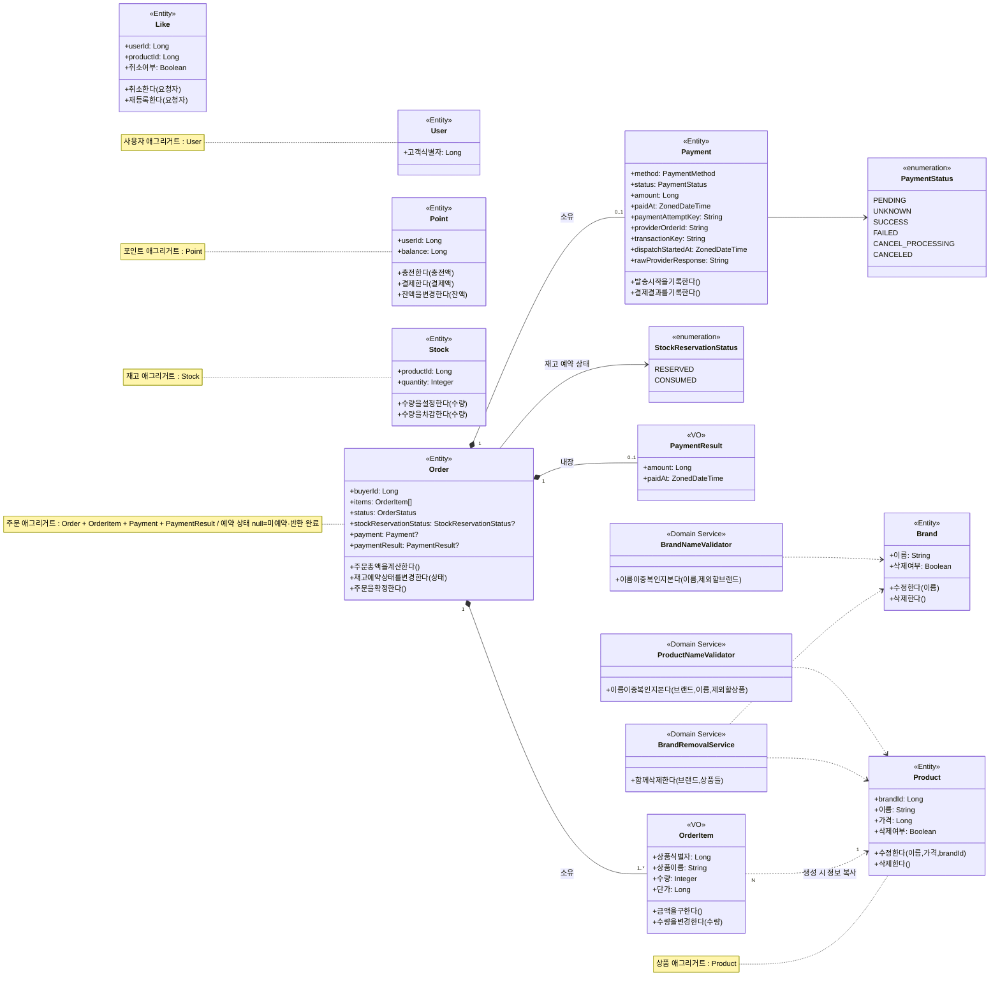

```mermaid
classDiagram
    direction LR

    class User {
        <<Entity>>
        +고객식별자: Long
    }
    class Point {
        <<Entity>>
        +userId: Long
        +balance: Long
        +충전한다(충전액)
        +결제한다(결제액)
        +잔액을변경한다(잔액)
    }
    class Brand {
        <<Entity>>
        +이름: String
        +삭제여부: Boolean
        +수정한다(이름)
        +삭제한다()
    }
    class Product {
        <<Entity>>
        +brandId: Long
        +이름: String
        +가격: Long
        +삭제여부: Boolean
        +수정한다(이름,가격,brandId)
        +삭제한다()
    }
    class Stock {
        <<Entity>>
        +productId: Long
        +quantity: Integer
        +수량을설정한다(수량)
        +수량을차감한다(수량)
    }
    class Like {
        <<Entity>>
        +userId: Long
        +productId: Long
        +취소여부: Boolean
        +취소한다(요청자)
        +재등록한다(요청자)
    }
    class Order {
        <<Entity>>
        +buyerId: Long
        +items: OrderItem[]
        +status: OrderStatus
        +stockReservationStatus: StockReservationStatus?
        +payment: Payment?
        +paymentResult: PaymentResult?
        +주문총액을계산한다()
        +재고예약상태를변경한다(상태)
        +주문을확정한다()
    }
    class OrderItem {
        <<VO>>
        +상품식별자: Long
        +상품이름: String
        +수량: Integer
        +단가: Long
        +금액을구한다()
        +수량을변경한다(수량)
    }
    class StockReservationStatus {
        <<enumeration>>
        RESERVED
        CONSUMED
    }
    class PaymentResult {
        <<VO>>
        +amount: Long
        +paidAt: ZonedDateTime
    }
    class Payment {
        <<Entity>>
        +method: PaymentMethod
        +status: PaymentStatus
        +amount: Long
        +paidAt: ZonedDateTime
        +paymentAttemptKey: String
        +providerOrderId: String
        +transactionKey: String
        +dispatchStartedAt: ZonedDateTime
        +rawProviderResponse: String
        +발송시작을기록한다()
        +결제결과를기록한다()
    }
    class PaymentStatus {
        <<enumeration>>
        PENDING
        UNKNOWN
        SUCCESS
        FAILED
        CANCEL_PROCESSING
        CANCELED
    }
    Payment --> PaymentStatus

    Order "1" *-- "1..*" OrderItem : 소유
    Order "1" *-- "0..1" Payment : 소유
    Order "1" *-- "0..1" PaymentResult : 내장
    Order --> StockReservationStatus : 재고 예약 상태
    OrderItem "N" ..> "1" Product : 생성 시 정보 복사

    note for User "사용자 애그리거트 : User"
    note for Point "포인트 애그리거트 : Point"
    note for Product "상품 애그리거트 : Product"
    note for Stock "재고 애그리거트 : Stock"
    note for Order "주문 애그리거트 : Order + OrderItem + Payment + PaymentResult / 예약 상태 null=미예약·반환 완료"

    class BrandRemovalService {
        <<Domain Service>>
        +함께삭제한다(브랜드,상품들)
    }
    class BrandNameValidator {
        <<Domain Service>>
        +이름이중복인지본다(이름,제외할브랜드)
    }
    class ProductNameValidator {
        <<Domain Service>>
        +이름이중복인지본다(브랜드,이름,제외할상품)
    }

    BrandRemovalService ..> Brand
    BrandRemovalService ..> Product
    BrandNameValidator ..> Brand
    ProductNameValidator ..> Product
```
