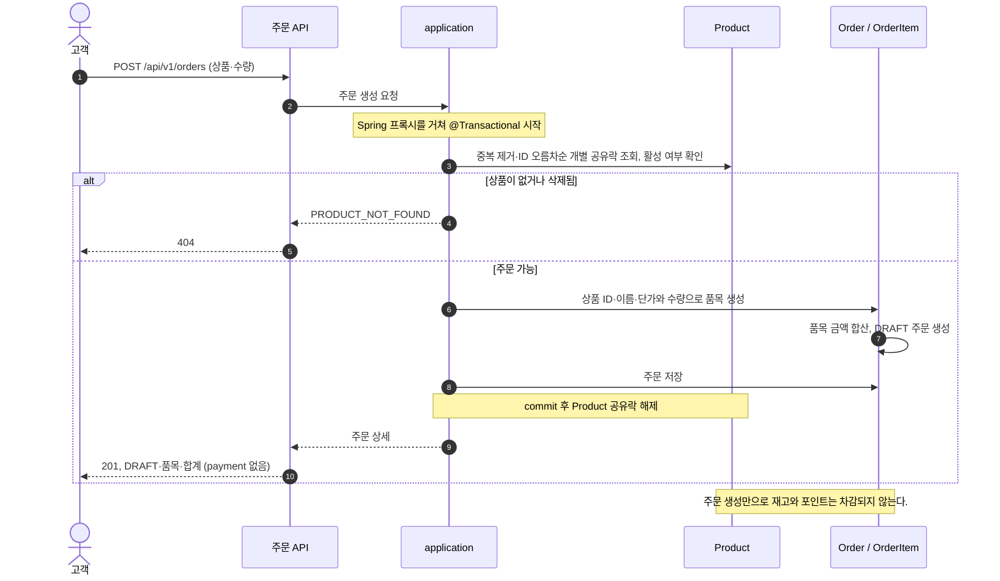
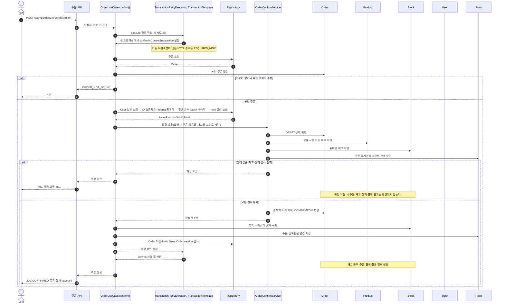

# 주문 생성·확정 시퀀스

> 변경일: 2026-10-09
>
> 현재 주문 생성의 공유락과 주문 확정의 트랜잭션·재시도 경계를 반영했다.

[요구사항](./requirements.md), [도메인 규칙](./domain-rules.yaml), [도메인 관계](./domain-relations.md), [API 계약](./api-contract.md)을 기준으로 주문의 상태 변화를 그린다. 잠금 대상과 선택 근거는 [3주차 ADR](../week3/ADR.md)에 정리했다.

## 주문 생성

## 주문 확정

`DRAFT` 주문만 확정할 수 있다. 이미 `CONFIRMED`인 주문의 재확정은 `ORDER_ALREADY_CONFIRMED`로 거절한다.

`OrderV1Controller` → Spring bean `OrderUseCase.confirm()` → `TransactionRetryExecutor.execute(..., 2)` → `TransactionTemplate` → `confirmInCurrentTransaction()` → repository 순서로 실행한다. `confirm()` 자체에는 `@Transactional`이 없으며, private 메서드의 자기 호출로 트랜잭션을 시작하는 것도 아니다. 트랜잭션은 실행기가 콜백을 실행하기 전에 시작한다.

- HTTP 요청처럼 기존 트랜잭션이 없으면 `REQUIRES_NEW`로 실행한다. 낙관적 충돌은 실패한 트랜잭션을 rollback한 뒤 새 트랜잭션에서 재조회·재검증하며 최대 2회 재시도한다(최초 포함 3회). 대기 시간은 `concurrency.transaction-retry.backoff-ms`로 설정하며 기본값은 0ms다.
- 이미 트랜잭션이 있는 호출에서는 기존 트랜잭션에 참여하고 실행기 내부에서 재시도하지 않는다. 이 경우 최종 commit은 외부 호출자의 책임이다.
- Product는 중복 제거한 ID를 정렬한 뒤 개별 조회로 공유락을 획득한다. Stock도 같은 순서로 배타락을 획득한다. 잠금은 commit·rollback까지 유지한다.
- Point·Order는 `@Version`으로 충돌을 검사한다. 충전도 Point 버전을 사용하되 자동 재시도하지 않는다.
- 업무 검증 오류나 저장 오류가 발생하면 주문·재고·잔액·결제 결과 전체를 rollback한다. 재고·잔액 부족 등 업무 예외는 낙관적 충돌 재시도 대상이 아니다.
- 재시도를 소진한 충돌에서 Spring 예외의 엔티티 이름, JPA 예외의 엔티티 또는 Hibernate 원인의 엔티티 이름으로 Point를 확인하면 `409 POINT_CONFLICT`로 안내한다. 그 외 충돌은 실패 트랜잭션 종료 후 새 조회 트랜잭션에서 본인 주문의 상태를 확인하고 실제 `CONFIRMED`일 때만 `ORDER_ALREADY_CONFIRMED`로 응답한다. 아직 DRAFT이거나 충돌 대상을 확인할 수 없으면 원래 예외를 전달해 기존 `500 INTERNAL_ERROR` 계약으로 처리하며, 재고·잔액 부족으로 바꾸지 않는다. 외부 트랜잭션에 참여하는 경우에는 실패한 경계에서 주문을 다시 조회하지 않는다.

정상 HTTP 경로에서는 commit이 끝난 뒤 성공 응답을 보낸다. 여러 repository의 `save()`는 독립 commit을 수행하지 않으며, 최종 `flush()`도 commit과 구분된다.
