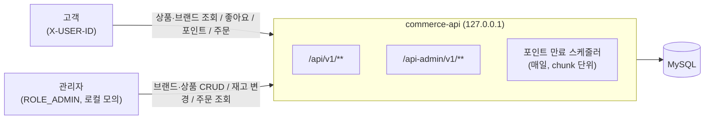
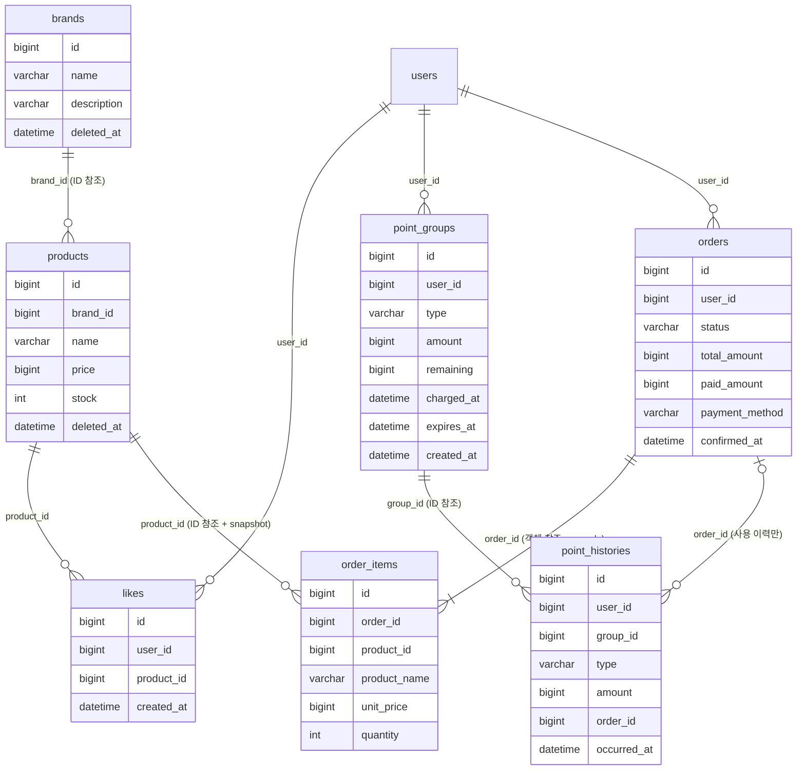
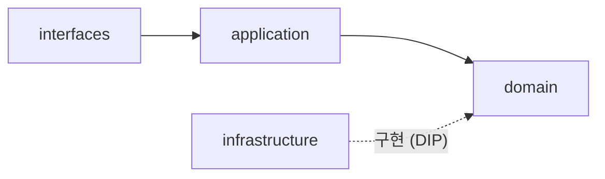
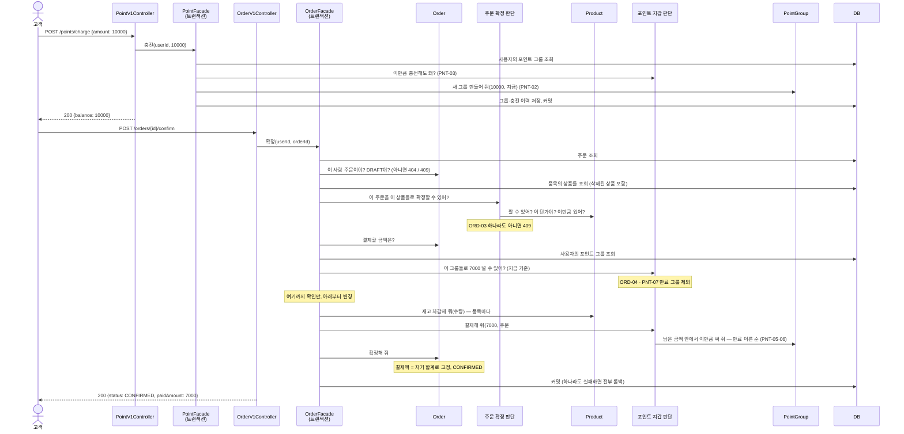

# 커머스 기본 기능 설계 (W2)

> **이 문서의 자리** — W2의 **Plan·Design 산출물**이다. 1주차 `docs/week1/order-discount-contract.md`가 Plan 산출물이었던 것과 이어진다.
>
> **이 문서의 목표** — 고객·관리자의 요청이 HTTP → application → domain → repository·DB → 응답까지 어떻게 이어지는지, 그리고 **각 규칙에 누가 답하는지**를 구현 전에 합의한다.
>
> **작성 규칙** — 코드는 넣지 않는다. 규칙 ID·기대값·계약·결정과 그 이유만 남긴다. 구현하며 바뀐 판단은 [14. 변경 이력](#14-변경-이력)에 남기고 본문을 고친다.
>
> **1주차에서 이어받는 것** — 오류 구분 기준(10-1: 입력 오류 400 / 대상 없음 404 / 상태 충돌 409), 확정값 snapshot(10-2), 남의 자원은 존재를 숨기고 404(INV-001), 요청자 식별 `X-USER-ID`, AI 제안은 출처를 따져 채택·보류(3-4).
>
> **모델링 방법** — 참고 자료 「도메인 모델링 예시 (영화 예매)」의 순서를 따른다. 요구사항을 **"누가 이 질문에 답할 수 있는가"**로 바꿔 읽고(3장), **누가 누구를 알고 무엇을 주고받는지**를 먼저 정한 뒤(5장) 규칙과 API로 내려간다.

**결정 상태 표기** — ✅ 합의 (학습자 결정) · 🔧 기본값 (AI 제안, 이의 없으면 유지) · 🤔 결정 필요

| 상태 | 날짜 | 비고 |
|---|---|---|
| v0 초안 | 2026-09-15 | 정책 4개 합의 반영 |
| v0.1 | 2026-09-15 | 🤔-1(금액 규칙의 주인)·🤔-2(확정 재검증 위치) 결정 |
| v0.2 | 2026-09-15 | AI 설계 리뷰 판정 반영, **포인트를 "그룹(충전 건) + 이력" 모델로 변경**, 트랜잭션 경계·오류의 HTTP 매핑·만료 배치·좋아요 동시 중복 처리 결정 |
| v0.3 | 2026-09-16 | 구현 반영 (브랜드·상품·좋아요·포인트 충전·주문 생성·관리자 조회). 클래스 이름, 구현 리뷰에서 바뀐 판단(🔧 표시)을 본문에 반영. 주문 확정은 W-5·W-6 이후 |
| v0.4 | 2026-09-16 | 문서 이름을 `plan.md`로 변경. 아키텍처 이름과 열린 질문 3개 추가 |
| v0.5 | 2026-09-16 | 포인트 TDD 기대값 확정 (🤔-6 만료 결제 오류, 0원 결제 400, W-8 정상 짝), QueryDSL 배치 기준 |

---

## 1. 버드뷰

- 서버 하나와 DB 하나로 모든 요구를 설명할 수 있으므로 이 구조에서 시작한다. 캐시(Redis)·메시징(Kafka)은 이번 요구에 필요한 이유가 없어 쓰지 않는다 (ADR-09).
- 고객과 관리자는 **같은 저장 데이터**를 다루지만 **입력·권한·응답 필드가 다른 계약**이다. 경로(`/api` vs `/api-admin`)와 controller·DTO를 나누고, application·domain은 함께 쓴다.
- 포인트 만료 스케줄러도 **같은 commerce-api 안에서** 돌아 도메인 규칙을 그대로 재사용한다 (ADR-10).

## 2. 정책 결정 목록

| # | 정책 | 결정 | 상태 |
|---|---|---|---|
| P-01 | 같은 상품이 주문 요청에 여러 번 오면 | **합산**해 한 품목으로 저장, **확정 시** 총수량으로 재고 확인 | ✅ |
| P-02 | 주문서(DRAFT) 후 확정 전에 가격이 바뀌면 | **확정 거절 409**, 고객은 새 주문 생성 (ADR-06) | ✅ |
| P-03 | 식별 누락·없는 사용자 | **401 UNAUTHORIZED 추가**. 남의 자원은 404 (ADR-07) | ✅ |
| P-04 | 좋아요 중복 등록·없는 좋아요 취소 | **둘 다 200 (멱등)**, 좋아요 수 불변 (ADR-08) | ✅ |
| P-05 | 브랜드·상품 삭제 방식 | 논리 삭제 (ADR-03) | 🔧 |
| P-06 | 상품 이름·가격 범위 | 이름 1–100자, 가격 1–100,000,000원 | 🔧 |
| P-07 | 브랜드 이름·설명 | 이름 1–50자 필수, 설명 0–200자 선택 | 🔧 |
| P-08 | 목록 페이지 | `page` ≥ 0 (기본 0), `size` 1–100 (기본 20), 범위 밖 400 | 🔧 |
| P-09 | 정렬 동률의 보조 기준 | 모든 정렬에서 `id desc` (나중에 등록된 상품 먼저) | 🔧 |
| P-10 | 삭제된 브랜드·상품의 관리자 조회 | 고객과 같이 404로 제외 | 🔧 |
| P-11 | 고객에게 재고 수량 노출 | 노출하지 않음 | 🔧 |
| P-12 | 브랜드 이름 중복 | 제한하지 않음 | 🔧 |
| P-13 | 충전 포인트의 유효기간 | **있다.** 충전 시각부터 설정값(기본 5년) 뒤 만료 | ✅ 기간 둠 · 🔧 기간 값 |
| P-14 | 포인트 사용 순서 | 만료 시각이 이른 그룹 먼저, 같으면 먼저 충전한 그룹 먼저 | 🔧 |
| P-15 | 만료 시각이 지난 포인트 | **만료 처리 배치가 돌기 전이라도** 잔액·결제에서 제외 | ✅ |
| P-16 | 만료 기록 방식 | commerce-api 스케줄러가 매일 chunk 단위로 만료 처리 (ADR-10) | ✅ |
| P-17 | 이미 확정된 주문을 다시 확정 요청 | **409** — 확정은 "결제를 수행하라"는 행동 요청이므로 | ✅ |
| P-18 | 같은 상품의 합산 수량이 저장 범위(int)를 넘으면 | 400 | ✅ |
| P-19 | 가격 변경으로 확정이 거절된 주문 | **DRAFT로 남는다** | ✅ |
| P-20 | 만료 시각 정각의 포인트 | **정각부터 만료** — "지금 < 만료 시각"일 때만 사용 가능 | ✅ |
| P-21 | 0원 사용·결제 요청 | **400으로 거절** — 잔액이 얼마든 틀린 값이므로 상태 충돌(409)이 아니라 입력 오류다. 정상 흐름(가격 ≥ 1, 수량 ≥ 1)에서 올 수 없어 HTTP로는 도달하지 않는 방어 규칙 | ✅ |

> 🔧 기본값은 "과제가 정하라고 했지만 답에 따라 설계 구조가 달라지지 않는 것"이다. 바꾸려면 이 표와 해당 규칙의 기대값만 고친다.

## 3. 요구사항이 던지는 질문 — 누가 답할 수 있는가

> **모든 규칙은 DB에서 불러온 뒤 판단한다.** 그래서 "조회가 필요한가"는 책임을 가르는 기준이 아니다.
> 기준은 **불러온 뒤 한 객체가 자기 필드만으로 답할 수 있는가**다. 답할 수 없으면 여러 행을 아는 **저장소**나, 여러 객체를 함께 보는 **도메인 서비스·조율자**가 답한다.

| 요구 | 질문 | 답할 수 있는 것 |
|---|---|---|
| 재고 차감·변경 | "재고가 충분한가, 차감하면 몇 개 남는가?" | 재고를 가진 것 → **Product** |
| 상품 등록·수정 | "이 이름·가격이 유효한가?" | 이름·가격을 가진 것 → **Product** |
| 조회·좋아요·주문 대상 | "이 상품을 지금 팔 수 있는가?" | 삭제 상태를 가진 것 → **Product** (404로 답할지 409로 답할지는 호출한 경로가 정한다) |
| 주문 snapshot | "주문에 복사할 상품명·판매 단가는?" | 이름·가격을 가진 것 → **Product** (생성과 확정이 같은 값을 쓴다) |
| 확정 시 가격 확인 | "주문서의 단가가 지금 판매 단가와 같은가?" | **주문 확정 판단**(도메인 서비스)이 Product에 묻는다 |
| 금액 | "이 금액이 유효한가, 더하거나 곱하면 넘치지 않는가?" | 금액이라는 값 자체 → **Money** |
| 충전 건 | "이 충전 건에서 이만큼 쓸 수 있는가, 만료됐는가?" | 남은 금액·만료 시각을 가진 것 → **PointGroup** |
| 포인트 잔액·결제 | "지금 쓸 수 있는 포인트는 얼마이고, 어느 그룹부터 빼는가?" | 여러 그룹을 함께 보는 것 → **포인트 지갑 판단**(도메인 서비스) |
| 만료 대상 | "만료 시각이 지났는데 남은 금액이 있는 그룹은?" | 그룹들의 집합 → **PointGroup 저장소** |
| 주문 합계·상태 | "합계가 얼마인가, 확정할 수 있는 상태인가, 결제할 금액은?" | 품목과 상태를 가진 것 → **Order** |
| 품목 금액 | "이 품목은 얼마인가?" | 단가·수량을 가진 것 → **OrderItem** |
| 주문 소유 | "이 요청자가 이 주문의 주인인가?" | 주문자를 가진 것 → **Order** |
| 브랜드 삭제 조건 | "이 브랜드에 살아 있는 상품이 있는가?" | 상품들의 집합 → **Product 저장소**. Brand는 자기 상품을 모른다 |
| 좋아요 중복 | "이 사용자가 이 상품을 이미 좋아했는가?" | 관계들의 집합 → **Like 저장소 + DB unique 제약**. Like 한 건은 다른 행을 모른다 |
| 좋아요 수 | "이 상품의 좋아요는 몇 개인가?" | 관계들의 집합 → **상품 조회 저장소**가 상품과 함께 답한다. Product는 답하지 않는다 |
| 식별 | "이 요청자는 존재하는 사용자인가?" | 사용자들의 집합 → **User 저장소** |

## 4. 도메인 관계

| 타입 | 클래스 | 종류 | 책임 |
|---|---|---|---|
| User | `UserModel` | Entity | 실습용 고객. 식별의 대상일 뿐 규칙이 없다 (fixture) |
| Brand | `BrandModel` | Entity | 이름·설명의 유효성 |
| Product | `ProductModel` | Entity | 이름·가격의 유효성, 재고의 유효성과 차감·최종값 설정, **"지금 팔 수 있는가"**, 주문에 복사할 이름·판매 단가. 브랜드는 식별자만 안다 |
| Like | `LikeModel` | Entity | 사용자–상품 관계 한 건. 식별자만 안다 |
| PointGroup | `PointGroup` | Entity | **충전 한 건이 만든 포인트 묶음.** 충전액·남은 금액·만료 시각을 가지고 "지금 쓸 수 있나", "남은 금액 안에서 이만큼 써 줘", "만료 처리해 줘"에 답한다 |
| PointHistory | `PointHistory` | Entity (추가만) | 어느 그룹에서 얼마가 **충전·사용·만료**됐는지 한 줄. 만든 뒤 바뀌지 않는다 |
| Order | `OrderModel` | Entity | 품목 목록·합계·상태·결제 결과. **결제할 금액을 자기 합계로 답하고, 확정 시 결제액을 스스로 고정한다.** 주문자는 식별자만 안다 |
| OrderItem | `OrderItemModel` | Entity (Order에 속함) | 주문 당시 상품명·단가(snapshot)와 수량, 품목 금액 |
| Money | `Money` | Value Object | 원 단위 정수 금액이라는 **값의 유효성**(음수 불가)과 **안전한 연산**(넘침·음수 결과 거절), 크기 비교 |
| 주문 요청 품목 | `OrderLines` | Value Object | 같은 상품 합산, 품목 1개 이상·수량 1 이상·합산 수량 범위 검증. 상품 조회 전에 입력 오류를 가린다 🔧 |
| 주문 스냅샷 | `ProductSnapshot` | Value Object | Product가 주는 "주문에 복사할 상품명·판매 단가". 생성과 확정 재검증이 같은 값을 쓴다 🔧 |
| 주문 확정 판단 | `OrderConfirmPolicy` | Domain Service | 자기 상태 없이, 주문 품목과 상품들을 함께 보고 확정 가능 여부를 답한다 (ADR-05) |
| 포인트 지갑 판단 | `PointWalletPolicy` | Domain Service | 자기 상태 없이, **한 사용자의 포인트 그룹들(= 지갑)**을 함께 보고 잔액 계산·충전 가능 여부·결제 가능 여부·사용 순서와 배분을 답한다 (ADR-04) |

- **클래스 이름** 🔧 — 엔티티는 스타터 관례대로 `Model` 접미사. 도메인 서비스는 스타터의 domain `*Service`(저장소 사용)와 구분하려고 `Policy` 접미사로 통일했다(영화 예매 예시의 `DiscountPolicy`처럼 규칙을 판단하는 객체).

- **Entity·VO·도메인 서비스를 가르는 기준** — "내용이 같은 두 개면 같은 것인가?" 같지 않고(식별자) 상태가 바뀌면 Entity, 같고 불변이면 VO, **가진 상태 없이** 한 엔티티에 속하지 않는 판단만 하면 도메인 서비스다. 판단 로직만 있고 값이 없는 객체는 VO가 아니다.
- **PointGroup이 VO가 아닌 이유** — 1/1에 충전한 10,000원 건과 2/1에 충전한 10,000원 건은 금액이 같아도 다른 충전 건이고, 남은 금액이 계속 바뀐다. 그 **충전액·남은 금액 값이 Money(VO)**다.
- 선은 **업무 관계**다. 객체 참조로 구현하는 것은 **함께 생성되고 함께 바뀌는** Order–OrderItem 하나다 (ADR-01).
- `order`는 MySQL 예약어이므로 테이블명은 `orders`.
- 재고는 영화 예매 예시의 `Screening.remainingSeats`처럼 Product 안의 필드와 행동으로 둔다. 별도 `Stock` 타입은 재고 규칙이 Product 밖에서 재사용될 때 분리한다 🔧.

### 4-1. 포인트 모델 예시

> 뼈대 ✅ — **충전 건(그룹)마다 만료 시각을 두고, 사용한 금액을 어느 그룹에서 뺐는지 기록한다.** 그룹의 남은 금액은 그룹의 칸으로 저장한다 (ADR-04).

상황: 1/1에 10,000원 충전(그룹 A), 2/1에 5,000원 충전(그룹 B), 3/1에 12,000원 결제(주문 #7).

| 그룹 | 충전액 | 남은 금액 | 만료 시각 |
|---|---|---|---|
| A | 10,000 | **0** | 5년 뒤 1/1 |
| B | 5,000 | **3,000** | 5년 뒤 2/1 |

| 이력 | 그룹 | 종류 | 금액 | 주문 |
|---|---|---|---|---|
| 1 | A | 충전 | +10,000 | — |
| 2 | B | 충전 | +5,000 | — |
| 3 | A | 사용 | −10,000 | #7 |
| 4 | B | 사용 | −2,000 | #7 |

- **잔액** = 지금 만료되지 않은 그룹의 남은 금액 합 = 3,000. 잔액을 따로 저장하지 않으므로 **만료 배치가 돌기 전에도 만료된 금액이 잔액에 섞이지 않는다** (P-15).
- **사용 순서** = 만료 시각이 이른 A부터 (P-14). 사용 순서 규칙은 포인트 지갑 판단 한곳에 있어, "이벤트 포인트 먼저" 같은 정책이 생기면 그곳만 바뀐다.
- **정합성 규칙** — 한 그룹의 이력 합계 = 그 그룹의 남은 금액 (A: +10,000 − 10,000 = 0, B: +5,000 − 2,000 = 3,000). 저장소 테스트로 확인한다.

## 5. 누가 누구를 아는가 — 화살표와 메시지

### 5-1. 객체 사이

> 읽어야 할 것은 **없는 화살표**다. 오른쪽 열(보내는 쪽이 모르는 것)이 많을수록 그 화살표는 덜 부러진다.

| 누가 → 누구를 | 보내는 메시지 | 보내는 쪽이 모르는 것 |
|---|---|---|
| 주문 확정 조율자 → Order | "이 사람 주문이야?", "결제할 금액은?", "확정해 줘" | 상태 전이 규칙, 합계 계산 방식, 결제액 고정 방식 |
| 주문 확정 조율자 → 주문 확정 판단 | "이 주문을 이 상품들로 확정할 수 있어?" | 무엇을 어떤 순서로 확인하는지 |
| 주문 확정 판단 → Product | "팔 수 있어?", "이 단가로 팔고 있어?", "이만큼 있어?" | 삭제 표시 방식, 가격·재고를 어떤 필드로 들고 있는지 |
| 주문 확정 조율자 → Product | "재고 차감해 줘(수량)" | 재고를 어떻게 세는지 |
| 주문 확정 조율자 → 포인트 지갑 판단 | "이 그룹들로 이 금액을 낼 수 있어?", "결제해 줘" | 사용 순서, 그룹별 배분 방식 |
| 포인트 충전 조율자 → 포인트 지갑 판단 | "이만큼 충전해도 돼?" (합산 범위) | 잔액 계산 방식 |
| 포인트 지갑 판단 → PointGroup | "지금 쓸 수 있어?", "남은 금액 안에서 이만큼 써 줘" | 남은 금액·만료 시각을 어떻게 들고 있는지 |
| 만료 조율자 → PointGroup | "이 시각 기준으로 만료 처리해 줘" | 만료를 어떻게 판단하는지 |
| 주문 생성 조율자 → Product | "팔 수 있어?", "주문에 복사할 이름·단가 줘" | 판매 단가를 어떻게 정하는지 |
| Order → OrderItem | "품목 금액은?" | 단가×수량 계산 방식 |
| 브랜드 삭제 조율자 → Product 저장소 | "살아 있는 상품 있어?" | 논리 삭제 컬럼 |
| 상품 조회 조율자 → 상품 조회 저장소 | "조건에 맞는 상품을 좋아요 수와 함께 줘" | 집계 쿼리 |
| PointGroup · Order · OrderItem · Product → Money | 유효한 금액 생성, 더하기·빼기·곱하기, 비교 | 금액의 내부 표현, 넘침 감지 방식 |

**없는 화살표 (의도적으로 모르게 한 것)**

- **Order ↛ 포인트** — 주문은 포인트 그룹을 모른다. 조율자가 Order에 "결제할 금액"을 묻고, 그 금액을 포인트 지갑 판단에 전달한다.
- **Order ↛ Product** — 주문은 상품 객체가 아니라 `productId`와 주문 당시 상품명·단가를 가진다. 상품 가격이 바뀌어도 저장된 주문은 바뀌지 않는다. 둘을 함께 봐야 하는 확정 재검증은 **주문 확정 판단**이 양쪽을 알고, Order와 Product는 서로 모른다 (ADR-05).
- **PointGroup ↛ 다른 PointGroup, PointGroup ↛ Order** — 그룹은 자기 남은 금액만 안다. 여러 그룹의 순서·배분은 포인트 지갑 판단이, 어떤 주문에 쓰였는지는 이력의 `orderId`가 안다.
- **Product ↛ Brand, Product ↛ Like** — 상품은 `brandId`만 알고, 좋아요 수는 모른다. 브랜드 응답이 바뀌어도 Product는 바뀌지 않는다 (ADR-01·02).
- **Like ↛ User·Product 객체** — 식별자만 안다.
- **Money ↛ 아무도** — 모두가 Money를 알지만 Money는 도메인의 무엇도, HTTP도 모른다.

### 5-2. 계층 사이

| DDD 계층 | 패키지 | 대표 클래스 | 맡는 일 | 직접 의존하지 않을 것 |
|---|---|---|---|---|
| 사용자 인터페이스(표현) | `interfaces.api.{기능}`, `interfaces.api.admin.{기능}` | Controller, `ApiControllerAdvice` | HTTP 입력 파싱, 요청자 식별, 응답 DTO 변환, **오류 종류 → HTTP 상태 매핑** | infrastructure |
| 응용(Application) | `application.{기능}` | `*Facade`(= 응용 서비스), `*Info` | **유스케이스 하나 = Facade 메서드 하나 = 트랜잭션 하나**. 조회 순서 조율, 조회 결과 조합 (= 5-1의 "조율자") | interfaces, infrastructure |
| 도메인 | `domain.{기능}` | Entity, VO, 도메인 서비스, `*Repository` 인터페이스 | 상태와 규칙, 저장 약속 | interfaces, application, infrastructure, **HTTP** |
| 인프라 | `infrastructure.{기능}` | `*JpaRepository`, `*RepositoryImpl` | Repository 약속의 JPA·QueryDSL 구현 | HTTP 응답 정책, 업무 규칙 중복 |

- **이 구조의 이름** — **layer-first 패키지 + 계층 단방향 의존(strict layered)**이다. 패키지를 기능이 아니라 계층으로 먼저 나누고, 의존은 interfaces → application → domain 한 방향으로만 흐른다. 예외는 infrastructure 하나로, DIP 때문에 방향이 뒤집혀 domain에 의존한다.
- **Controller와 Facade의 차이** — Controller는 HTTP를 알고, Facade는 HTTP를 모른다. 같은 "주문 확정"을 Kafka 메시지나 스케줄러로 시작하면 Controller는 필요 없어지지만 Facade는 그대로 재사용된다. "Facade"는 DDD 용어가 아니라 GoF 패턴 이름이며, 스타터가 **응용 서비스**를 그 이름으로 부른다.
- **domain은 아무도 모른다** — 예시의 Money·Screening처럼. ArchUnit이 이 문장을 기계로 확인한다.
- **infrastructure → domain 화살표는 실행 방향과 반대다** — 실행 중에는 application이 JPA 구현을 호출하지만, 소스에서는 구현이 domain의 Repository 약속을 안다. 이것이 DIP다.
- 스타터 관례에 따라 domain에도 `*Service`가 있을 수 있다. 이 프로젝트에서 domain의 `*Service`는 **한 도메인의 저장소 사용 + 엔티티 행동 호출**만 하며 트랜잭션을 열지 않는다(Facade의 트랜잭션에 참여). 여러 엔티티를 함께 보는 판단은 이름으로 구분되는 **도메인 서비스**(주문 확정 판단, 포인트 지갑 판단)가 맡는다.
- 엔티티에 JPA 애노테이션을 두는 것은 허용한다 🔧. JPA 모델과 도메인 모델을 분리하면 매핑 코드가 두 배가 되는데, 이번 범위에는 그 비용을 정당화할 저장 기술 교체 요구가 없다.

| 검사 규칙 | 수단 |
|---|---|
| domain → interfaces·application·infrastructure 금지 | ArchUnit `ArchitectureTest` |
| application → interfaces·infrastructure 금지 | ArchUnit `ArchitectureTest` |
| interfaces → infrastructure 금지 | ArchUnit `ArchitectureTest` |
| **domain·support.error → `org.springframework.http` 금지** (ADR-12) | ArchUnit `ArchitectureTest` — ArchUnit은 직접 참조만 보므로 `ErrorType`이 있는 `support.error`도 함께 막는다 |
| 와일드카드 import·미사용 import 금지 | Checkstyle (전체 모듈) |

## 6. 규칙과 기대값

> 규칙 ID는 테스트 `@DisplayName`에 그대로 쓴다. 의미를 바꿔 재사용하지 않는다.
> **거절 예의 기대 결과에는 항상 "기존 값 유지"를 함께 확인한다** — "예외가 발생한다"만 보면 값을 바꾼 뒤 던지는 구현도 통과한다 (예시 자료의 좌석 테스트).

### 6-1. 사용자 식별

| ID | 규칙 | 정상 예 | 거절 예 → 기대 결과 | 답하는 것 |
|---|---|---|---|---|
| USR-01 | 고객 API는 `X-USER-ID`로 존재하는 사용자를 식별한다. 헤더는 **문자열로 받아 한 곳에서** 형식·존재를 판정한다 | `X-USER-ID: 1`(존재) → 처리 | 헤더 누락 / `abc` / 존재하지 않는 `999` → `401`, 저장 데이터 변화 없음 | interfaces의 요청자 식별 처리 + User 저장소 |

- 헤더를 숫자 타입으로 바로 받으면 `abc`는 스타터 핸들러에서 `400`이, 누락은 처리기가 없어 `500`이 된다. 🔑 엔드포인트마다 같은 확인을 반복하지 않도록 식별 처리를 한곳에 둔다.

### 6-2. 브랜드

| ID | 규칙 | 정상 예 | 거절 예 → 기대 결과 | 답하는 것 |
|---|---|---|---|---|
| BRD-01 | 이름은 앞뒤 공백 제거 후 1–50자, 설명은 0–200자 | `"나이키"` | `"   "`, 51자 → `400` | Brand |
| BRD-02 | 삭제되지 않은 상품이 연결된 브랜드는 삭제할 수 없다 (재고 0 상품 포함) | 연결 상품이 모두 삭제됨 → 삭제 성공 | 재고 0인 살아 있는 상품 1개 → `409`, 브랜드 유지 | Product 저장소 + 조율자 |
| BRD-03 | 삭제된 브랜드는 조회·수정·상품 등록의 대상이 아니다 | — | 삭제된 브랜드 상세 → `404` | Brand |

### 6-3. 상품

| ID | 규칙 | 정상 예 | 거절 예 → 기대 결과 | 답하는 것 |
|---|---|---|---|---|
| PRD-01 | 이름 1–100자, 가격 1–100,000,000원, 초기 재고 ≥ 0 | 가격 1, 재고 0 | 가격 0 / 100,000,001 / 재고 -1 → `400` | Product |
| PRD-02 | 등록 시 존재하며 삭제되지 않은 브랜드를 참조한다 | — | 삭제된 브랜드 ID → `404` | Brand + 조율자 |
| PRD-03 | 수정은 이름·가격만 바꾸고 브랜드는 유지한다 | 가격 1,000 → 2,000 / 수정 요청에 다른 `brandId`를 보내도 `200`이고 브랜드는 그대로 (요청 필드로 받지 않음) | 유효하지 않은 이름·가격 → `400`, 이름·가격 유지 | Product |
| PRD-04 | 관리자 재고 변경은 0 이상의 **최종 수량**으로 설정한다 | 5 → 0 설정 | -1 → `400`, 기존 재고 유지 | Product |
| PRD-05 | 재고 차감은 양수 수량만, 보유량 이하만 허용한다. "이만큼 있나?" 질문과 차감은 **같은 규칙**을 쓴다 | 5에서 2 차감 → 3 / 5에서 5 차감 → 0 | 5에서 6 차감 → 거절, **재고 5 유지** / 0 이하 수량 → 거절 | Product |
| PRD-06 | 삭제된 상품은 **팔 수 없는 상품**이다. 고객 조회·수정·재고 변경·새 좋아요·새 주문의 대상이 아니다 | — | 삭제된 상품 상세 → `404` | Product ("팔 수 있는가") |

### 6-4. 좋아요

| ID | 규칙 | 정상 예 | 거절·경계 예 → 기대 결과 | 답하는 것 |
|---|---|---|---|---|
| LIK-01 | 한 사용자–상품 관계는 하나만 저장한다 | — | 같은 사용자가 같은 등록을 동시에 10번 보내도 행은 1개 | DB unique 제약 |
| LIK-02 | 등록·취소는 **동시에 와도** 멱등이다 | 이미 좋아요한 상품 재등록 → `200`, 좋아요 수 불변 / 관계 없는 취소 → `200` / 같은 등록 동시 10번 → 모두 `200` | — | Like 저장소의 원자적 멱등 등록·조건 삭제 (ADR-13) |
| LIK-03 | 팔 수 없는(삭제된) 상품에는 새 좋아요를 할 수 없지만, 남은 내 관계는 취소할 수 있다 | 삭제된 상품의 기존 좋아요 취소 → `200` | 삭제된 상품에 등록 → `404` | Product + 조율자 |
| LIK-04 | 좋아요 수는 관계의 개수다. **정렬에 쓴 값과 보여 주는 값은 같은 조회에서 나온다** | 사용자 3명이 좋아요 → `likeCount = 3` | `likes_desc` 페이지에서 표시값이 정렬 순서와 어긋나지 않음 | 상품 조회 저장소 |
| LIK-05 | 내 좋아요 목록은 본인만 조회하며 삭제된 상품은 제외한다 | — | 경로 `userId` ≠ 요청자 → `404` | 조율자 |

### 6-5. 포인트

| ID | 규칙 | 정상 예 | 거절 예 → 기대 결과 | 답하는 것 |
|---|---|---|---|---|
| PNT-01 | 잔액은 **만료되지 않은 그룹의 남은 금액 합**이다. 0원은 유효한 잔액이다 | 충전한 적 없는 사용자 → `200`, `0` | — | 포인트 지갑 판단 (합), Money (0 허용·음수 거절) |
| PNT-02 | 충전액은 **양의 정수**다. 충전 한 번이 그룹 하나를 만들고, 만료 시각 = 충전 시각 + 유효기간(P-13) | 0에서 10,000 충전 → 그룹 1개(남은 금액 10,000), 잔액 10,000, 충전 이력 +10,000 | `0` / `-1` / 누락 / `"abc"` / `1.5` / long 범위 초과 → `400`, **그룹·이력 생기지 않음** | PointGroup 생성 조건 (형식 오류는 interfaces) |
| PNT-03 | 충전 후 잔액이 저장 범위를 넘으면 거절한다 | — | 잔액 `Long.MAX - 1`에 2 충전 → `409`, 그룹·이력 생기지 않음 | 넘침 감지는 **Money**, "충전 거절"로 해석은 **포인트 지갑 판단** |
| PNT-04 | 결제액이 잔액보다 크면 거절한다 | 10,000에서 7,000 결제 → 잔액 3,000 / 7,000에서 7,000 결제 → 0 | 3,000에서 7,000 결제 → `409`, **모든 그룹의 남은 금액 유지**, 사용 이력 없음 | "잔액 부족" 판단은 **포인트 지갑 판단**, 음수 결과 방어는 **Money** |
| PNT-05 | 결제는 **만료 시각이 이른 그룹부터**(같으면 먼저 충전한 그룹부터) 차감하고, 그룹마다 사용 이력을 남긴다 | A(10,000, 먼저 만료)·B(5,000)에서 12,000 결제 → A 0, B 3,000, 이력 A −10,000·B −2,000 (주문 번호 포함) | — | 순서·배분은 **포인트 지갑 판단**, 한 그룹의 차감은 **PointGroup** |
| PNT-06 | 한 그룹에서는 **남은 금액 이하만** 쓸 수 있다 | 남은 3,000에서 3,000 사용 → 0 | 남은 3,000에서 3,001 사용 → 거절, 남은 금액 3,000 유지 | PointGroup |
| PNT-07 | **만료 시각이 된 그룹**(정각 포함, P-20)은 만료 처리 전이라도 잔액·결제에서 제외한다 | A가 만료 시각을 지난 뒤 잔액 조회 → B의 남은 금액만 | 만료된 A밖에 없을 때 결제 → `409` (잔액 부족) | PointGroup ("지금 쓸 수 있나", 기준 시각은 호출자가 전달) |
| PNT-08 | 만료 처리: 만료 시각이 지났고 남은 금액이 있는 그룹은 남은 금액을 0으로 만들고 **만료 이력(−남은 금액)**을 남긴다. 다시 실행해도 결과가 같다 | A(남은 4,000, 만료됨) 처리 → A 0, 이력 A −4,000 / 같은 날 재실행 → 변화 없음 | 만료 전 그룹 처리 요청 → 거절, 남은 금액 유지 | PointGroup ("만료 처리해 줘") + 만료 조율자 (ADR-10) |

- PNT-02와 PNT-03의 HTTP 오류가 다른 이유 — 충전액 `0`은 **요청 값 자체**가 틀렸고(400), 합산 초과는 요청은 정상이지만 **현재 잔액과 충돌**한다(409). 1주차 10-1 기준.
- 누락·`"abc"`·범위 초과는 JSON을 읽는 단계(interfaces)에서, `0`·`-1`은 도메인이 거절한다. 단 스타터 Jackson 설정에서 실제로 어떻게 읽히는지는 [13-2. 열린 질문](#13-2-열린-질문)에 따라 HTTP 테스트로 먼저 확인한다.
- **연결 흐름 기대값은 모델이 바뀌어도 같다** — 잔액 0 → 10,000 충전(그룹 A) → 7,000 결제(A에서 −7,000) → 잔액 3,000.

### 6-6. 주문

| ID | 규칙 | 정상 예 | 거절 예 → 기대 결과 | 답하는 것 |
|---|---|---|---|---|
| ORD-01 | 생성: 품목 ≥ 1, 수량 > 0, 상품이 **팔 수 있는 상품**. 같은 상품은 합산. Product가 주는 상품명·판매 단가를 복사(snapshot)하고 합계를 계산해 **DRAFT로 저장. 재고·포인트는 차감하지 않는다** | `[{p1,2},{p1,3},{p2,1}]` → 품목 2개(p1×5, p2×1), 합계 = 단가×수량의 합 | 빈 품목 / 수량 0 / 합산 수량 int 초과 → `400`, 없는·삭제된 상품 → `404`, 주문 저장 안 됨 | Order·OrderItem (+ 상품은 조율자가 Product에 묻는다) |
| ORD-02 | 확정은 **본인의 DRAFT 주문**만 가능하다. 소유·상태 확인이 **가장 먼저** 일어난다 | — | 남의 주문 → `404` / 이미 CONFIRMED → `409` (P-17) | Order |
| ORD-03 | 확정 시 재검증: 모든 품목의 상품이 팔 수 있는 상품, **현재 판매 단가 = 품목 단가**, 재고 ≥ 품목 수량 | — | 확정 전에 상품 삭제 / 가격 변경 / 재고 부족 → `409`, 주문은 DRAFT 유지(P-19) | **주문 확정 판단** (도메인 서비스)이 Product에 묻는다 |
| ORD-04 | 확정 시 잔액 ≥ 결제할 금액 | — | 잔액 부족 → `409` | 포인트 지갑 판단 (PNT-04) |
| ORD-05 | 확정은 **재고 차감 + 포인트 차감(그룹별 사용 이력) + 결제 결과 저장 + CONFIRMED 변경이 한꺼번에** 일어나거나 아무것도 일어나지 않는다. 결제액은 **Order가 자기 합계로 고정**한다 | 잔액 10,000, 합계 7,000 → 주문 `CONFIRMED`, `paidAmount 7,000`, `paymentMethod POINT`, 잔액 3,000, 재고 감소, 사용 이력 −7,000 | ORD-02~04 중 하나라도 실패 → 재고·그룹 남은 금액·이력·주문 상태 모두 요청 전과 동일 | Facade의 트랜잭션 (ADR-11) |
| ORD-06 | 고객은 본인 주문만, 관리자는 모든 구매자의 주문을 조회한다 | — | 고객이 남의 주문 상세 → `404` | Order + 조율자 |

- 주문 생성의 오류 순서 🔧 — 입력 오류(품목 없음·수량 0·합산 초과, `400`)를 상품 조회보다 먼저 가리고, 그다음 없는·삭제된 상품(`404`)을 확인한다. 상품 등록도 같은 방식이 아니라 브랜드 확인(`404`)이 가격 검증(`400`)보다 먼저라, `{brandId: 999, price: 0}`은 `404`다 — 오류 순서가 경로마다 다르다는 점을 알고 둔다.
- 생성에서 "없는 상품"은 `404`인데 확정에서 "삭제된 상품"은 `409`인 이유 — 생성 요청은 **상품 자체를 가리키므로** 대상이 없는 것이다. 확정 요청은 **주문을 가리키고 그 주문은 존재하므로**, 상품이 사라진 것은 주문의 현재 상태와의 충돌이다. 같은 "팔 수 있는가" 질문에 경로가 다른 오류로 답한다.
- 재확정이 좋아요와 달리 멱등이 아닌 이유 — 좋아요 등록은 "**이 상태로 만들어 줘**"라서 반복해도 결과가 같다. 확정은 "**결제를 수행해 줘**"라는 행동 요청이라, 이미 결제한 주문에는 수행할 수 없다.

## 7. API 계약

> 공통 응답 형식: `ApiResponse{meta{result, errorCode, message}, data}`. 오류 코드: `400 Bad Request` · `401 Unauthorized`(추가) · `404 Not Found` · `409 Conflict`. `errorCode` 문자열은 기존과 같다 (ADR-12).
>
> **null 필드는 응답에서 생략된다** (공용 Jackson `NON_NULL` 설정) — 오류 응답과 삭제 성공 응답에는 `data` 키가 없고, 비어 있는 `description`·확정 전 주문의 `paidAmount` 등도 키가 빠진다. 테스트는 "`data`가 없다"로 확인한다.
>
> **요청 본문의 정수 필드는 형식을 추측하지 않는다** 🔧 — 실수(`1.9`)·문자열 숫자(`"1000"`)는 정수로 바꾸지 않고 `400`이다 (commerce-api 전용 `StrictNumberInputConfig`, 13-2 해소).

### 7-1. 고객 API (🔑 = `X-USER-ID` 필요)

| 기능 | method · path | 입력 | 성공 `data` | 대표 오류 |
|---|---|---|---|---|
| 브랜드 상세 | `GET /api/v1/brands/{brandId}` | — | `id, name, description` | 없음·삭제 404 |
| 상품 목록 | `GET /api/v1/products` | `brandId?`, `sort = latest(기본)·price_asc·likes_desc`, `page`, `size` | `content[{id, name, price, brand{id, name}, likeCount}]`, `page, size, totalElements` | 알 수 없는 `sort`·범위 밖 `page/size` 400. 없는 `brandId`는 빈 목록 |
| 상품 상세 | `GET /api/v1/products/{productId}` | — | `id, name, price, brand{id, name}, likeCount` | 없음·삭제 404 |
| 좋아요 등록 🔑 | `POST /api/v1/products/{productId}/likes` | — | `productId, liked=true` | 401, 없음·삭제 상품 404. 중복은 200 |
| 좋아요 취소 🔑 | `DELETE /api/v1/products/{productId}/likes` | — | `productId, liked=false` | 401. 관계 없음·삭제 상품도 200 |
| 내 좋아요 목록 🔑 | `GET /api/v1/users/{userId}/likes` | — | `[{productId, name, price, brand{id, name}, likedAt}]` 좋아요 최신순 | 401, 경로 userId ≠ 요청자 404 |
| 포인트 충전 🔑 | `POST /api/v1/points/charge` | `{amount}` | `balance` (충전 후 사용 가능 잔액) | 401, PNT-02 400, PNT-03 409 |
| 잔액 조회 🔑 | `GET /api/v1/points` | — | `balance` (지금 사용 가능 잔액) | 401 |
| 주문 생성 🔑 | `POST /api/v1/orders` | `{items[{productId, quantity}]}` | `id, status=DRAFT, items[{productId, productName, unitPrice, quantity, amount}], totalAmount` | 401, 400, 404 |
| 주문 확정 🔑 | `POST /api/v1/orders/{orderId}/confirm` | — | `id, status=CONFIRMED, totalAmount, paidAmount, paymentMethod, confirmedAt` | 401, 404(남의·없는 주문), 409(ORD-02~04) |
| 내 주문 목록 🔑 | `GET /api/v1/orders` | `page`, `size` | `content[{id, status, totalAmount, paidAmount?, createdAt}]` 최신순 | 401 |
| 내 주문 상세 🔑 | `GET /api/v1/orders/{orderId}` | — | `id, status, items[...], totalAmount, paidAmount?, paymentMethod?, confirmedAt?` | 401, 404 |

- 포인트 그룹·이력 조회 API는 과제 범위 밖이라 두지 않는다. 모델은 이력을 남기므로 필요해지면 조회만 추가한다.

### 7-2. 관리자 API (ROLE_ADMIN)

| 기능 | method · path | 입력 | 성공 `data` | 대표 오류 |
|---|---|---|---|---|
| 브랜드 목록·등록 | `GET`·`POST /api-admin/v1/brands` | 목록 `page, size` / 등록 `{name, description?}` | `id, name, description, createdAt, updatedAt` | 400 |
| 브랜드 상세·수정·삭제 | `GET`·`PUT`·`DELETE /api-admin/v1/brands/{brandId}` | 수정 `{name, description?}` | 상세·수정은 위와 같음, 삭제는 `null` | 404, 400, BRD-02 409 |
| 상품 목록·등록 | `GET`·`POST /api-admin/v1/products` | 목록 `brandId?, page, size` / 등록 `{brandId, name, price, stock}` | `id, brandId, name, price, stock, createdAt, updatedAt` | 400, PRD-02 404 |
| 상품 상세·수정·삭제 | `GET`·`PUT`·`DELETE /api-admin/v1/products/{productId}` | 수정 `{name, price}` | 위와 같음, 삭제는 `null` | 404, 400 |
| 재고 변경 | `PUT /api-admin/v1/products/{productId}/stock` | `{stock}` | 위와 같음 | 404, PRD-04 400 |
| 주문 목록 | `GET /api-admin/v1/orders` | `userId?, page, size` | `content[{id, userId, status, totalAmount, paidAmount?, createdAt}]` | 400 |
| 주문 상세 | `GET /api-admin/v1/orders/{orderId}` | — | 고객 상세 + `userId` | 404 |

- **PUT은 전체 교체다** 🔧 — 브랜드 수정에서 `description`을 생략하면 비워진다. 일부 필드만 바꾸는 요청(PATCH)은 두지 않는다.
- **고객·관리자 응답 필드의 차이** — 고객은 구매 판단에 필요한 `brand{name}`·`likeCount`를 보고, 재고 수량·생성/수정 시각은 보지 않는다. 관리자는 운영에 필요한 `stock`·`brandId`·시각·구매자 `userId`를 본다.
- **관리자 접근 거절** — 일반 사용자·식별 없는 요청은 과제 제공 Security 설정에서 `403`으로 거절된다. 필터에서 끊기므로 이 응답은 `ApiResponse` 형식이 **아니다** (Spring 기본 오류 응답). 로컬 모의 관리자 경계라는 전제에서 수용한다.
- **고객 API는 Security 필터 대상이 아니다** — 과제 설정이 `/api-admin/**` 전용 필터 체인을 직접 정의하므로 Spring Boot 기본 체인은 만들어지지 않는다. Security 의존성과 설정은 **함께** 추가하고, 고객 API의 POST가 CSRF로 막히지 않는지 HTTP 테스트로 확인한다.

## 8. 대표 흐름 — 포인트 충전 → 주문 확정

> 선택 이유: 여러 도메인(Order·Product·포인트)이 한 트랜잭션에서 협력하고, 과제의 연결 흐름(잔액 0 → 10,000 충전 → 7,000 결제 → 3,000)이 그대로 검증 시나리오가 된다.

- **순서의 의도** — 발제의 "전체 입력과 필요한 재고·잔액을 **확인한 뒤** 변경 행동을 호출"을 따른다. 소유·상태 → 상품 재검증 → 잔액 확인을 끝낸 뒤에만 변경을 호출하므로, 실패 사유가 확인 순서대로 정해진다. 변경 도중 실패해도 트랜잭션 롤백이 최종 안전장치다.
- **호출자가 모르는 것** — 컨트롤러는 조회·검증·차감 순서를 모른다. Product는 포인트를, PointGroup은 주문과 다른 그룹을 모른다.

### 8-1. 포인트 만료 처리 (배치)

1. 스케줄러가 매일 정해진 시각에 만료 Facade를 부른다 (기준 시각 = 실행 시각).
2. Facade는 **"만료 시각이 지났고 남은 금액이 있는 그룹"을 1,000개씩** 조회한다.
3. 각 그룹에 "이 시각 기준으로 만료 처리해 줘"를 보내고 만료 이력을 만든다 (PNT-08).
4. 1,000개마다 커밋하고, 대상이 없을 때까지 2~3을 반복한다. 중간에 실패해도 이미 커밋된 묶음은 남고, 다음 실행이 나머지를 처리한다 (재실행해도 결과가 같다).

## 9. 설계 결정 (ADR)

> 형식: 상황 / 선택 / 버린 대안과 비용 / 다시 검토할 조건

### ADR-01. 도메인 사이는 ID로 참조하고, Order–OrderItem만 객체로 묶는다 🔧

- **상황** — Product는 Brand를, Like·Order·포인트는 User·Product·Order를 알아야 한다. JPA는 `@ManyToOne` 객체 참조를 쉽게 만들어 준다.
- **선택** — `Product.brandId`, `Like.userId/productId`, `Order.userId`, `OrderItem.productId`, `PointGroup.userId`, `PointHistory.groupId/orderId`는 ID만 보관한다. Order–OrderItem은 **함께 생성되고 따로 바뀌지 않으므로** 객체 참조(cascade)로 묶는다.
- **기준** — 객체 참조는 "같은 트랜잭션에서 함께 생성·변경되는가"로 정한다. "화면에 같이 보여 주는가"는 기준이 아니다 — 그건 조회 조합(ADR-02)의 문제다.
- **버린 대안** — `Product → @ManyToOne Brand`.
  - 반례 "**브랜드 응답이 바뀌면 어떤 객체까지 바뀌는가?**"를 대입하면, 객체 참조는 브랜드 로딩(지연 로딩·N+1)을 Product 엔티티가 떠안고 브랜드 변경의 영향이 상품 모델까지 번진다. ID 참조면 **Product는 바뀌지 않고** 조합하는 application만 바뀐다.
- **감수하는 비용** — 브랜드 정보를 붙이려면 application이 브랜드를 따로(IN 조회로 한 번에) 가져와 조합해야 한다.
- **재검토 조건** — 상품과 브랜드를 항상 함께 수정하는 요구가 생길 때.

### ADR-02. 상품 조회 결과의 조합은 application이, 좋아요 수는 상품 조회 저장소 하나가 맡는다 🔧

- **상황** — 상품 목록·상세는 상품 + 브랜드 + 좋아요 수를 보여 줘야 하고, `likes_desc`는 좋아요 수로 정렬해야 한다.
- **선택** — 좋아요 수는 **상품 조회 전용 저장소 하나**가 상품과 함께 돌려주고, 목록 정렬과 표시·상세에 같은 조회를 쓴다(LIK-04). `ProductFacade`는 그 결과에 브랜드 정보를 붙여 `*Info`로 조합한다. 이 저장소는 상품의 상태를 바꾸는 `ProductRepository`와 분리한다.
- **버린 대안**
  - Product(또는 domain `ProductService`)가 브랜드·좋아요 조회와 응답 조합까지 맡기: 상품 규칙(가격·재고)과 조회 화면 요구(브랜드명·좋아요 수)라는 **서로 다른 변경 이유**가 한 클래스에 모인다(SRP).
  - 정렬용 집계 쿼리와 표시용 COUNT를 따로 두기 (AI 리뷰 1-4): "탈퇴 사용자의 좋아요는 세지 않는다" 같은 변경에서 한쪽만 고치면 정렬 순서와 표시값이 어긋난다.
- **감수하는 비용** — 조회 전용 저장소 인터페이스가 하나 늘고, 조회 모델에서는 "Product ↛ Like"가 풀린다(상태 모델에서는 유지).
- **재검토 조건** — 좋아요 수 집계가 느려져 별도 카운터가 필요해질 때 (그때 관계–카운터 정합성 책임이 새로 생긴다).

### ADR-03. Brand·Product는 논리 삭제, Like는 물리 삭제, Order는 삭제하지 않는다 🔧

- **상황** — 주문 품목과 좋아요가 `productId`를 참조한다. 과제는 "기존 참조가 깨지거나 저장된 주문 정보가 함께 지워지지 않도록" 요구한다.
- **선택**
  - Brand·Product: `BaseEntity.deletedAt`으로 논리 삭제. 행이 남으므로 과거 주문의 `productId`가 가리키는 대상이 사라지지 않는다. 대신 **"행이 있다 ≠ 팔 수 있다"**이므로 Product가 "팔 수 있는가"에 답한다 (PRD-06).
  - Like: 물리 삭제. 이력 요구가 없는 관계이고, 논리 삭제로 두면 `unique(user_id, product_id)`와 재등록이 충돌해 "삭제된 행 복원" 규칙이 추가로 필요하다.
  - Order: 삭제 API가 없다.
- **버린 대안** — 전부 물리 삭제. 상품을 지우면 주문 품목의 참조가 끊기거나 연쇄 삭제로 주문 정보가 사라진다.
- **부수 효과와 한계** — BRD-02 덕분에 순차 요청에서는 "삭제된 브랜드에 속한 살아 있는 상품"이 생기지 않는다. 단 **브랜드 삭제와 상품 등록이 동시에 오면 깨질 수 있다** (AI 리뷰 3-5 → ADR-09 위험 목록).
- **재검토 조건** — 복원(restore) API나 개인정보 파기 요구가 생길 때.

### ADR-04. 포인트는 "그룹(충전 건) + 이력"으로 두고, 그룹의 남은 금액은 칸으로 저장한다 ✅

- **상황** — 과제 요구는 충전·잔액·결제지만, 학습자는 만료기간과 그룹 단위 사용까지 설계하기로 했다(P-13~16). 참고 코드 temp-test는 적립 건별 그룹과 +/− 이력으로 이를 구현했다.
- **선택**
  - 충전 한 번 = `PointGroup` 하나(충전액·**남은 금액**·만료 시각). 사용·만료는 그룹의 남은 금액을 줄이고 `PointHistory`(그룹·종류·금액·주문)를 한 줄씩 남긴다.
  - 잔액은 저장하지 않고 **만료되지 않은 그룹의 남은 금액 합**으로 계산한다.
  - 여러 그룹을 함께 보는 판단(잔액·충전 가능·결제 가능·사용 순서·배분)은 **포인트 지갑 판단**(도메인 서비스)이 맡는다. 주문 확정 판단(ADR-05)과 같은 모양이다.
- **버린 대안**
  - (v0.1) `PointBalance` 잔액 한 칸: 가장 단순하지만 어느 충전분이 언제 만료되는지, 어느 충전분에서 결제했는지 추적할 수 없다.
  - temp-test식 +/− 이력만 쌓고 그룹의 남은 금액을 `SUM ... GROUP BY`로 계산: 행을 고치지 않아 감사 추적이 강하지만, "남은 금액 ≥ 0" 같은 규칙이 **엔티티가 아니라 합계 쿼리**에 살아 DB 없이 테스트하기 어렵다. 또 temp-test는 사용 순서 정렬이 없고 만료 그룹도 사용될 수 있었다.
  - 잔액 칸을 따로 캐시: 만료 배치가 돌기 전까지 만료된 금액이 잔액에 섞여 P-15와 충돌한다.
- **감수하는 비용** — 테이블이 2개 늘고, 결제 한 번에 여러 그룹 행이 바뀐다. 한 그룹의 이력 합 = 남은 금액이라는 정합성을 테스트로 지켜야 한다.
- **재검토 조건** — 무상 적립(이벤트) 포인트가 생기면 그룹에 종류별 우선순위를 더한다. 부분 환불이 생기면 사용 이력의 그룹으로 되돌린다.

### ADR-05. 주문 확정 재검증(ORD-03)은 domain의 도메인 서비스가 판단한다 ✅

- **상황** — 확정 시 "모든 품목의 상품이 팔 수 있고, 가격이 같고, 재고가 충분한가"를 판단해야 한다. 이 판단은 주문 품목과 상품 여러 개를 **함께** 봐야 해서 어느 한 엔티티에 자연스럽게 속하지 않는다.
- **선택** — domain에 **주문 확정 판단**(상태 없는 도메인 서비스)을 둔다. Facade는 조회·호출 순서·트랜잭션만 맡는다. 재고는 **변경 전에 확인**하되(발제: "필요한 재고·잔액을 확인한 뒤 변경"), 확인과 차감은 Product 안의 같은 규칙을 쓴다(PRD-05).
- **버린 대안**
  - (A) Facade가 직접 확인: 클래스는 늘지 않지만 업무 규칙이 application에 흩어지고, 규칙을 Spring 없이 테스트하기 어렵다.
  - (C) Order 엔티티가 판단: 주문 규칙이 한곳에 모이지만 **Order가 Product를 알게 되어** "Order ↛ Product"가 깨지고, 가격 비교를 위해 Product 내부를 묻기 쉽다.
  - (AI 리뷰 1-2) 재고는 확인하지 말고 차감 거절과 롤백에 맡기기: 판단 대상은 줄지만 발제의 "확인한 뒤 변경"과 어긋나고 실패 사유가 변경 순서에 좌우된다.
- **B와 C의 차이는 화살표다** — C는 Order → Product 화살표가 생긴다. B는 판단 객체가 양쪽을 알고, Order와 Product는 서로 모른다.
- **정정 (v0.2)** — v0.1은 (A)를 버린 이유로 "배치 등 다른 경로에서 규칙이 반복된다"를 들었으나, `commerce-batch`·`commerce-streamer`는 `commerce-api`에 의존하지 않아 성립하지 않는 근거였다 (AI 리뷰 3-6, 빌드 파일로 확인). 1주차 C-5도 같은 오해였다.
- **재검토 조건** — 구현해 보니 판단이 한두 줄로 줄어 클래스가 설명보다 무거우면 (A)로 합치고 변경 이력에 남긴다.

### ADR-06. 확정 전에 가격이 바뀌었으면 확정을 거절한다 ✅

- **상황** — 주문서(DRAFT)를 만든 뒤 결제하기 전에 관리자가 가격을 바꿀 수 있다.
- **선택** — 확정 시 품목 단가 ≠ 현재 판매 단가이면 `409`. 재고·포인트는 바뀌지 않고, **주문은 DRAFT로 남으며**(P-19) 고객은 새 주문을 만든다. 생성과 확정은 Product가 주는 같은 판매 단가로 비교한다.
- **버린 대안**
  - DRAFT 금액 유지: 가장 단순하지만 가격이 오르면 판매자가 손해를 본다.
  - 확정 시 재계산: 고객이 본 금액과 실제 결제액이 **조용히** 달라진다.
- **근거** — 일반 쇼핑몰은 결제 직전에 가격·재고를 재검증하고, 바뀌었으면 결제를 막고 주문서를 다시 보여 준다. 확정 시 어차피 상품을 재검증하므로(ORD-03) 같은 자리에 비교 하나가 늘어나는 비용이다.
- **재검토 조건** — "가격 인하는 허용" 같은 비대칭 정책이나 가격 보장 기간 요구가 생길 때.

### ADR-07. 식별 실패는 `401`을 추가해 표현하고, 한 곳에서 판정한다 ✅

- **상황** — 1주차 C-2는 오류를 기존 `ErrorType` 4종으로 제한했고 확장은 먼저 논의하기로 했다. 식별 누락·없는 사용자를 `400`/`404`로 표현하면 클라이언트가 "내가 식별되지 않음"과 "상품이 없음"을 구분할 수 없다.
- **선택** — `UNAUTHORIZED` 추가. `X-USER-ID`는 **문자열로 받아 interfaces의 요청자 식별 처리 한 곳**에서 누락·형식·존재를 판정한다(USR-01). 남의 주문·좋아요 목록은 1주차 INV-001 기준으로 `404`.
- **버린 대안**
  - `403`까지 추가해 남의 자원을 `403`으로: 남의 주문이 존재한다는 사실을 드러낸다.
  - 헤더를 숫자로 받고 Facade마다 존재 확인: `abc`가 400이 되고, 🔑 엔드포인트마다 같은 확인이 반복된다 (AI 리뷰 3-2).

### ADR-08. 좋아요 등록·취소는 멱등이다 ✅

- **상황** — 따닥 클릭·네트워크 재시도로 같은 요청이 여러 번 온다.
- **선택** — 최종 상태가 요청과 같으면 `200`. 행이 하나뿐이라는 최종 보장은 unique 제약이 하고, 동시에 온 중복도 200이 되도록 등록을 원자적으로 처리한다 (ADR-13).
- **버린 대안** — 중복 등록 `409`·없는 취소 `404`: 상태를 정확히 알려 주지만, 재시도한 클라이언트가 실제로는 원하는 상태인데 실패를 받는다. 1주차 A-3("같은 요청은 결과 재사용")과 같은 기준.

### ADR-09. 보류한 결정 — 지금 하지 않고 도입 조건만 남긴다 ✅

| 항목 | 지금 하지 않는 이유 | 도입 조건 |
|---|---|---|
| Transactional outbox | 커밋 후 외부(Kafka 등)로 전달할 이벤트가 이번 요구에 없다. 발제: "하나의 서버와 DB로 설명할 수 있다면 그 구조에서 시작" | 주문 확정 후 알림·집계처럼 **유실되면 안 되는 외부 전달**이 생길 때 |
| 동시성 제어 (락·조건부 UPDATE·`@Version`) | 이번 체크리스트에 동시 요청 요구가 없다. 알고 두는 위험은 아래와 같다 | 동시 요청 요구·테스트가 생길 때 |
| ↳ 동시 주문 확정 | 재고 초과 판매, 같은 포인트 그룹의 남은 금액 갱신 유실 | 재고는 조건부 UPDATE 또는 비관적 락, 포인트 그룹은 비관적 락 또는 `@Version` |
| ↳ 브랜드 삭제 vs 상품 등록 | 삭제된 브랜드에 살아 있는 상품이 생길 수 있다 | 브랜드 행 잠금 후 확인 |
| ↳ 같은 행을 바꾸는 요청끼리 (구현 리뷰에서 발견) | 엔티티 UPDATE가 전체 컬럼을 쓰므로, 상품 수정과 재고 변경(또는 주문 확정의 재고 차감)이 동시에 오면 나중에 커밋한 쪽이 먼저 바꾼 값을 덮어쓴다 (예: 재고 0 설정이 5로 되돌아감) | 동시 요청 요구가 생길 때 버전 비교(`@Version`) 또는 바뀐 컬럼만 쓰는 UPDATE와 함께 검토 |
| ↳ 만료 배치 중복 실행 | 서버가 하나라 발생하지 않는다. 여러 대가 되면 같은 그룹을 두 번 처리하려 할 수 있다 | 분산 락 또는 Spring Batch 이전 (ADR-10) |
| 좋아요 카운터 컬럼 | 과제가 "좋아요 수는 관계에서 조회" 요구. 카운터를 두면 **동시 +1의 갱신 유실**이 새로 생긴다 (ADR-13) | 집계 쿼리 성능 문제가 측정될 때. 도입 시 `좋아요 수 = 좋아요 수 + 1` 원자적 UPDATE를 관계 추가와 같은 트랜잭션에서 실행 |
| 결제·환불 도메인(`Payment`·`PaymentHistory`·`Refund`) | **이번 과제 범위가 아니다** — 결제 수단은 포인트 하나뿐이고 취소·환불 API가 없다. 결제 결과는 Order의 `paidAmount`·`paymentMethod`로 남는다 | 결제 수단이 둘 이상이 되거나 주문 취소·환불 요구가 생길 때 |

### ADR-10. 포인트 만료는 commerce-api 안의 스케줄러가 chunk 단위로 처리한다 ✅

- **상황** — 만료 시각이 지난 그룹의 남은 금액을 정리하고 만료 이력을 남겨야 한다(PNT-08). 저장소에는 `commerce-batch`(Spring Batch) 앱이 있지만 `commerce-api`의 도메인 코드에 의존하지 않는다.
- **선택** — `commerce-api` 안의 스케줄러가 매일 만료 Facade를 부르고, Facade가 대상 그룹을 1,000개씩 읽어 처리·커밋을 반복한다(8-1). 만료 규칙은 PointGroup 하나에만 있다. **배치가 돌기 전 공백**은 PNT-07("만료 시각이 지난 그룹은 쓰지 않는다")이 막으므로, 배치는 기록을 정리할 뿐 정합성을 책임지지 않는다.
- **버린 대안**
  - `commerce-batch`의 Spring Batch Job: 재시작·실행 이력 같은 배치 기능을 얻지만, 도메인 코드를 볼 수 없어 만료 규칙을 SQL로 한 번 더 써야 한다(규칙 두 벌).
  - 충전·결제·조회 요청 때마다 만료 정리: 배치가 필요 없지만, 요청이 없는 사용자의 만료 기록이 늦게 생긴다.
- **감수하는 비용** — 재시작 지점·실행 이력 관리가 없다. 실패하면 다음 실행이 남은 대상을 다시 처리한다(재실행해도 결과가 같다).
- **재검토 조건** — 서버가 여러 대가 되거나, 배치 실행 이력·재시작이 필요해지거나, 도메인을 공용 모듈로 분리할 때 Spring Batch로 옮긴다.
- **구현 순서** — 만료 배치는 체크리스트 항목이 아니므로 **체크리스트 기능을 먼저 끝낸 뒤** 구현한다. PNT-07(만료 그룹 제외)은 결제 규칙이므로 포인트 기능과 함께 구현한다.

### ADR-11. 트랜잭션은 Facade 메서드마다 연다 ✅

- **상황** — 스타터는 domain `ExampleService`에 트랜잭션을 두고 `ExampleFacade`에는 두지 않았으며, `open-in-view: false`다. OSIV가 꺼져 있으면 트랜잭션이 끝난 뒤 지연 로딩을 할 수 없다.
- **선택** — **유스케이스 하나 = Facade 메서드 하나 = 트랜잭션 하나.** 변경 유스케이스는 일반 트랜잭션, 조회 유스케이스는 `readOnly` 트랜잭션. `*Info` 변환도 트랜잭션 안에서 끝낸다. domain의 `*Service`는 트랜잭션을 열지 않고 참여한다.
- **버린 대안** — 스타터처럼 domain Service에 트랜잭션을 두고 여러 도메인에 걸칠 때만 Facade에 둔다.
  - 반례 1: 내 주문 상세 — Service 트랜잭션이 끝난 뒤 Facade가 품목을 읽으면 `LazyInitializationException`.
  - 반례 2: 포인트 충전 — 그룹 조회와 저장이 서로 다른 트랜잭션이 된다.
  - 규칙이 "언제는 Service, 언제는 Facade"로 둘이 되어, 어기면 실행해 봐야 드러난다.
- **OSIV를 켜지 않는 이유** — 요청 하나가 JSON 변환까지 DB 연결을 붙잡아 트래픽이 몰리면 커넥션 풀이 바닥나고, 쿼리가 어디서 나가는지 숨겨진다.
- **감수하는 비용** — 스타터 예시와 다르다. 조회 Facade에도 트랜잭션 애노테이션이 붙는다.

### ADR-12. 오류 종류는 HTTP를 모르고, HTTP 상태는 interfaces가 정한다 ✅

- **상황** — 스타터 `ErrorType`은 `HttpStatus`를 품고 있어, 도메인이 `CoreException(ErrorType.NOT_FOUND)`를 던지면 간접적으로 "404"를 안다. 또 Money가 넘침을 감지했을 때 충전 중인지 주문 합계 계산 중인지 몰라 400/409를 정할 수 없다.
- **선택**
  - `ErrorType`에서 `HttpStatus`를 뺀다. 오류 종류와 기존 `errorCode` 문자열·메시지만 남긴다.
  - `ApiControllerAdvice`(interfaces)가 **오류 종류 → HTTP 상태 대응표**를 가진다. 모든 오류 종류를 다루는 `switch`로 두어, 새 종류를 추가하고 HTTP 상태를 정하지 않으면 컴파일이 실패한다.
  - Money는 순수한 예외(`IllegalArgumentException`)를 던지고, 의미를 아는 객체(포인트 지갑 판단·Order 등)가 `CoreException(ErrorType)`으로 해석한다 (🤔-1의 "감지는 Money, 해석은 포인트 도메인").
  - ArchUnit에 "domain·support.error → `org.springframework.http` 금지"를 추가한다.
- **버린 대안**
  - 스타터 관례 유지: 변경은 없지만 상태 코드를 다시 분류할 때마다 도메인이 흔들린다.
  - 도메인 전용 오류 코드 체계 신설: 1주차 NFR-4(안정된 오류 코드)까지 해결하지만 이번 범위보다 크다.
- **영향 범위** — `HttpStatus`를 쓰는 곳은 `ErrorType`과 `ApiControllerAdvice` 두 파일뿐이다. 기존 테스트는 실제 HTTP 응답을 검사하므로 기대값이 바뀌지 않는다.

### ADR-13. 좋아요 등록은 원자적 멱등 INSERT로, 취소는 조건 DELETE로 처리한다 ✅

- **상황** — 참고 글(좋아요 기능 설계 — 동시성 제어)은 `likeCount` 카운터 컬럼에 +1을 하다가 동시 요청에서 갱신 유실(100건 중 12건만 반영)을 겪고, 락 방식들과 원자적 UPDATE를 비교했다. 우리 모델에 같은 상황을 대입했다.

| 동시 상황 | 우리 모델(관계 행 + COUNT)에서 |
|---|---|
| 서로 다른 사용자 100명이 동시에 좋아요 | **문제없음** — 각자 다른 행을 추가하므로 덮어쓸 값이 없고 COUNT는 항상 100. 글의 문제는 카운터 컬럼이 없어 구조적으로 생기지 않는다 |
| 같은 사용자가 동시에 두 번 좋아요 | unique 제약으로 행은 1개지만, "확인 후 저장"이면 두 요청이 모두 "없음"을 보고 저장을 시도하고, 두 번째는 제약 위반 → 트랜잭션 롤백 전용 → `500`이 된다 (LIK-02 위반) |
| 같은 사용자의 등록과 취소가 동시에 | 마지막으로 커밋된 쪽이 최종 상태, 둘 다 `200`. "상태 지정" 요청이라 수용 |
| 좋아요 도중 상품 삭제 | 삭제된 상품에 관계가 남을 수 있다. 목록에서 제외되고 취소 가능하므로 수용 |

- **선택**
  - 등록: "없으면 넣고, 있으면 아무것도 하지 않는다"를 **쿼리 한 번**으로 처리한다 — MySQL `INSERT … ON DUPLICATE KEY UPDATE`(아무 값도 바꾸지 않는 UPDATE). **KEY는 PRIMARY KEY 또는 UNIQUE 인덱스**이며, `likes`에서 실제로 걸리는 것은 `unique(user_id, product_id)`다.
  - 취소: `user_id`·`product_id` 조건 DELETE. 지울 행이 없어도 성공이므로 원래 멱등이다.
  - 예외가 나지 않으므로 트랜잭션 규칙(ADR-11)과 충돌하지 않는다. 글의 최종 선택과 같은 발상 — **DB가 한 문장을 원자적으로 처리하게 한다.**
- **버린 대안**
  - 상품 행 비관적 락 후 확인·저장: 확실하지만 한 상품의 모든 좋아요가 줄을 서고(인기 상품 병목), 관리자 상품 수정도 대기한다.
  - 낙관적 락·재시도: 관계 행 추가에는 버전을 올릴 공유 행이 없어 맞지 않는다.
  - 네임드·분산 락, `synchronized`: 글의 비교대로 락 획득·해제 관리가 복잡하거나(네임드), 서버가 여러 대면 무효이고 트랜잭션과 충돌한다(`synchronized`).
  - 트랜잭션 밖에서 제약 위반을 잡아 성공으로 해석: 예외로 흐름을 제어하고, Facade마다 트랜잭션을 연다는 ADR-11과 어긋난다.
  - 보류: 따닥 요청의 두 번째가 `500`이 될 수 있다.
- **감수하는 비용**
  - MySQL 전용 SQL을 infrastructure에 둔다.
  - 이 문법은 테이블의 **모든** UNIQUE 인덱스에 반응한다 — `likes`에 다른 UNIQUE 인덱스를 추가하면 그 중복도 조용히 무시되므로, 추가 시 이 ADR을 다시 본다.
  - 동시 INSERT에서 잠금 대기·데드락이 생기는지는 **동시성 테스트로 확인**한다. 생기면 이 결정을 다시 연다.
- **검증** — `ExecutorService` + `CountDownLatch`로 동시에 시작시킨다. ① 같은 사용자 10번 동시 등록 → 행 1개, 응답 모두 성공. ② 서로 다른 사용자 100명 동시 등록 → 좋아요 수 100.

## 10. 결정 기록 🤔

### 🤔-1. 금액 규칙은 누가 답하는가 ✅

> 예시 자료 원칙 5: **값의 유효성과 값 사이의 관계는 다른 규칙이다.**

| 규칙 | 학습자 첫 판단 | 결정 (v0.1) | v0.2 포인트 모델에서의 주인 | 이유 |
|---|---|---|---|---|
| 잔액 0 허용 | Money | Money | Money (0 허용) | Money가 0을 허용하고 음수만 거절하므로 잔액 0은 자동으로 유효하다 |
| 충전액 0 거절 | PointBalance | PointBalance | **PointGroup 생성 조건** | Money가 0을 거절하면 잔액 0원 자체를 만들 수 없다. "양수"는 값의 규칙이 아니라 **충전이라는 행동의 입력 조건**이다 |
| 합산 범위 초과 | PointBalance | 감지 Money, 해석 PointBalance | 감지 **Money**, 해석 **포인트 지갑 판단** | 반례: 주문 합계도 Money의 더하기·곱하기를 쓴다. 넘침 검사가 포인트 쪽에만 있으면 주문 합계 넘침은 막을 곳이 없고, long이 음수로 뒤집혀 엉뚱한 오류가 난다 |
| 잔액 부족 | 둘 다 | 판단 PointBalance, 방어 Money | 판단 **포인트 지갑 판단**, 그룹 단위 방어 **PointGroup**, 값 방어 **Money** | 예시의 `AmountDiscountPolicy`가 `minus` 전에 `isLessThan`으로 먼저 묻듯, 먼저 물어 **잔액 부족**이라는 업무 의미로 거절한다 |

- **원칙은 그대로, 주인만 옮겨졌다** — v0.2에서 잔액 한 칸(PointBalance)이 그룹 여러 개로 바뀌면서 "여러 값을 함께 보는 판단"이 도메인 서비스로 이동했다. "값의 유효성은 Money, 행동의 조건과 업무 의미는 포인트 도메인"이라는 원칙은 유지된다.

### 🤔-2. 주문 확정 재검증(ORD-03)의 위치 ✅

- **결정** — (B) domain의 도메인 서비스. 선택지 비교와 이유는 ADR-05.
- **정정한 이해** — 학습자는 처음에 판단 객체를 VO로 보았다. 판단만 하고 **가진 값이 없으므로** VO가 아니라 도메인 서비스다. 또 "엔티티 밑에 메서드로 두기"는 (C)이며, (B)와의 차이는 Order → Product 화살표가 생기느냐다.

### 🤔-3. 트랜잭션은 어디서 여는가 ✅

- **결정** — Facade 메서드마다 (ADR-11).
- **정정한 이해** — "read 트랜잭션을 준다"가 아니라 "유스케이스마다 트랜잭션을 열고, 조회 유스케이스는 readOnly로 연다". `LazyInitializationException`은 OSIV가 꺼져 있어서 생긴다는 학습자 이해가 맞았다.
- **함께 정리한 개념** — application 계층(위치) 안에 Facade(응용 서비스라는 역할)가 산다. Controller는 HTTP를 알고 Facade는 모른다.

### 🤔-4. 도메인이 HTTP 상태를 알아도 되는가 ✅

- **결정** — 학습자 판단 "HTTP 상태는 Controller 쪽에서"를 채택해, 오류 종류와 HTTP 상태의 대응을 interfaces(`ApiControllerAdvice`)로 옮긴다 (ADR-12).
- **정정한 이해** — "진입점에는 HttpStatus가 필요하지 않나?" — 필요하다. HttpStatus를 없애는 것이 아니라 **두는 위치를 도메인이 던지는 오류 종류에서 interfaces의 대응표로 옮기는 것**이다. DDD는 Controller를 정의하지 않으며, DDD 계층 중 사용자 인터페이스(표현) 계층이 이 일을 맡는다.

### 🤔-5. 이미 확정된 주문의 재확정 ✅

- **결정** — 409 (P-17). 좋아요는 "상태 지정" 요청이라 멱등, 확정은 "결제 수행" 요청이라 이미 결제한 주문에는 수행할 수 없다.

### 🤔-P1~P3. 포인트 설계 방향 ✅

| 질문 | 결정 | 버린 대안 |
|---|---|---|
| P1. 충전 포인트에 만료가 있는가? | 있다. 긴 유효기간(설정값) | 유상·무상 구분 도입 / 만료 없음 |
| P2. 그룹의 남은 금액을 어떻게 저장하나? | 그룹의 남은 금액 칸 + 사용 이력 (ADR-04) | temp-test식 +/− 이력 합산 |
| P3. 만료는 언제 처리하나? | commerce-api 스케줄러 + chunk 루프 (ADR-10). 결제 시에는 만료 그룹 제외(PNT-07) | Spring Batch Job / 요청 시 정리 |

- **학습자가 확인한 사실** — temp-test는 그룹별 남은 금액을 저장하지 않았다. `point_activities.points`는 활동 한 건의 금액이고, 그룹의 남은 금액은 `SUM(point) GROUP BY group_id`로 매번 계산했다.
- **스케줄러와 배치의 구분** — 스케줄러는 "언제 실행하나", 배치는 "많은 데이터를 어떻게 나눠 처리하나"에 답한다. 둘을 함께 쓴다.

### 🤔-6. 만료된 포인트로 결제하면 어떤 오류인가 ✅

- **결정** — **잔액 부족과 같은 오류**로 돌려준다 (409, "포인트 잔액이 부족합니다."). 만료를 따로 알리는 메시지를 두지 않는다.
- **이유** — 만료된 그룹은 PNT-07에 따라 잔액 계산에서 이미 빠져 있다. 사용자가 보는 잔액이 0인데 "만료돼서 못 쓴다"고 답하면 **잔액 조회와 결제 거절이 서로 다른 말을 한다**. 만료된 그룹의 남은 금액은 곧 만료 배치(ADR-10)가 0으로 정리하므로, 지갑이 "왜 부족한지"까지 구분할 이유가 없다.
- **테스트에 미치는 영향** — 그래서 W-7의 기대값은 "거절"만이 아니라 **A의 남은 금액이 그대로 4,000인지**까지 본다. 오류 종류로는 W-5와 구별되지 않으므로, 구별되는 지점은 저장값뿐이다.

## 11. JPA 구현 메모

> AI 리뷰 4장과 스타터 코드 확인에서 나온, 구현하다 설계를 흔들 수 있는 지점이다.

| 지점 | 할 일 | 이유 |
|---|---|---|
| 테이블 이름 | 모든 엔티티에 `@Table(name = ...)` | 테스트 fixture `DatabaseCleanUp`이 `@Table.name()`으로 TRUNCATE 대상을 모은다. 없으면 NPE로 Spring 테스트 전체가 실패한다 (코드로 확인) |
| Order–OrderItem | 단방향 `@OneToMany`에 `@JoinColumn(name = "order_id", nullable = false)`, cascade 전체 | `@JoinColumn`이 없으면 조인 테이블이 생겨 ER과 달라지고 TRUNCATE 대상에서도 빠진다 |
| `save()` 결과 | 저장 후에는 **반환값**을 쓴다 | `BaseEntity.id`가 `0L`로 초기화되어 Spring Data가 새 엔티티로 보지 않고 merge할 수 있다. 확인 테스트로 먼저 검증한다 |
| Like | `BaseEntity`를 상속하지 않는다. unique 제약은 `@Table(uniqueConstraints)`에 이름을 붙여 선언한다 | 상속하면 공개 `delete()`로 논리 삭제가 가능해져 ADR-03이 피한 unique·재등록 충돌이 생긴다. `ddl-auto: create`는 엔티티에 선언된 제약만 만든다 |
| 좋아요 등록 쿼리 | 원자적 멱등 INSERT는 네이티브 쿼리로 infrastructure에 둔다. `created_at`은 쿼리에서 채운다 | JPA `save()`를 거치지 않으므로 엔티티 콜백이 실행되지 않는다 (ADR-13) |
| 삭제 필터 | 전역 필터(`@SQLRestriction` 등)를 쓰지 않는다 | 확정 시 삭제된 상품도 조회돼야 "팔 수 없음 → 409"를 답할 수 있다 |
| 인덱스 | `likes(product_id)`, `point_groups(user_id, expires_at)`, `point_groups(expires_at)` | unique `(user_id, product_id)`는 선두 컬럼이 user라 상품별 집계에 못 쓴다. 포인트는 사용 순서 조회와 만료 대상 조회에 쓴다 |
| Money 매핑 ✅ 구현 | `AttributeConverter`로 bigint 한 컬럼에 저장하고, Money가 `Comparable`을 구현한다 🔧 | 예측대로 Converter만으로는 QueryDSL이 가격 필드를 정렬 불가능한 `SimplePath`로 만들었다. `Comparable`을 구현하자 `ComparablePath`가 되어 `price_asc`가 동작한다 (저장소 테스트로 확인). 필드마다 컬럼 이름을 정할 수 있어 `@AttributeOverride`가 필요 없다 |
| 저장과 시각 ✅ 구현 | 저장소의 `save`는 `saveAndFlush`로 구현하고, 수정 후에도 `save` 반환값으로 응답을 만든다 | `@PreUpdate`(수정 시각)가 커밋 시점 flush에서 실행돼, 그 전에 만든 응답의 `updatedAt`이 이전 값이었다 (구현 리뷰에서 발견, E2E로 확인) |
| `likes_desc` 페이지 | 개수 조회는 집계 없이 상품만 따로 센다 | GROUP BY 쿼리에 개수를 붙이면 `totalElements`가 틀린다 |
| 시각 | 만료 판단은 기준 시각을 **인자로 받는다** | "지금"을 객체 안에서 읽으면 만료 경계를 단위 테스트할 수 없다 |
| QueryDSL 위치 🔧 | 조건이 붙는 조회는 **`*RepositoryImpl` 안에서** `JPAQueryFactory`로 쓴다. `*JpaRepository`에는 저장·식별자 조회만 남긴다 | 메서드 이름으로 조건을 적는 파생 쿼리는 "brandId가 null이면 조건을 뺀다" 같은 선택 조회를 못 해 메서드가 갈라졌다. Spring Data의 `*RepositoryCustom` 조각(temp-test 방식)은 쓰지 않는다 — temp-test는 도메인 포트가 없어 JpaRepository에 합치는 이득이 있지만, 우리는 도메인 `*Repository`가 이미 포트라 인터페이스만 하나 더 늘어난다 |
| 조회 전용 클래스 🔧 | **조회 결과가 엔티티가 아닐 때만** `*QueryRepositoryImpl`로 나눈다 | `ProductQueryRepositoryImpl`은 좋아요 수를 붙인 `ProductWithLikes`를 돌려주므로 엔티티 저장소와 성격이 다르다. 엔티티를 그대로 돌려주는 조회까지 나누면 파일만 는다 |

## 12. 테스트 경계

| 경계 | 확인할 것 | 방식 | 예 |
|---|---|---|---|
| domain 단위 | 규칙의 기대값, **거절 후 기존 값 유지** | Spring·DB 없음. 기준 시각은 인자로 전달. **대표 규칙은 TDD** | PNT-01~08, PRD-05, ORD-01·02, 주문 확정 판단 |
| application | 객체 협력, 요청자 구분, 삭제 조건, 롤백 | 실제 Spring 빈 + 테스트 DB | BRD-02, ORD-05 롤백(그룹 남은 금액·이력까지), LIK-05, 만료 Facade 직접 호출(스케줄러 시각을 기다리지 않음) |
| repository·DB | 저장 후 재조회한 값과 관계 | `flush()` → `clear()` 후 재조회 | 주문–품목 cascade, 논리 삭제, 좋아요 unique, `likes_desc` 정렬·동률·표시값 일치, **그룹의 이력 합 = 남은 금액**, 사용 순서 조회 |
| HTTP | 실제 응답과 저장 동작, 입력·접근 거절 시 기존 값 유지 | `@SpringBootTest` + MockMvc / TestRestTemplate | USR-01 401, PNT-02 타입 오류 400, 관리자·일반·미식별 요청, 고객 POST가 Security에 막히지 않음 |
| 연결 흐름 | 충전 → 여러 품목 주문 생성 → 확정 → 내 주문·잔액 조회 | HTTP E2E | 0 → 10,000 충전 → 7,000 확정 → 잔액 3,000, 주문 CONFIRMED·paidAmount 7,000 |
| 동시성 | 동시에 온 요청에서도 규칙이 지켜지는가 | 테스트 DB + `ExecutorService`·`CountDownLatch`로 동시 시작 | LIK-01·02: 같은 사용자 10번 동시 등록 → 행 1개·모두 성공 / 100명 동시 등록 → 좋아요 수 100 (ADR-13) |

### 12-1. 포인트 규칙 TDD 기대값 목록 ✅

> 학습자가 확정한 목록이다. 이 목록에 없는 기대값을 추가하려면 먼저 합의한다. 기준 시각 예: 2026-01-01 00:00 충전, 유효기간 5년.

| # | 입력 | 기대 결과 | 잡는 잘못된 구현 |
|---|---|---|---|
| M-1 | Money 0원 생성 | 성공 (PNT-01) | 0 이하를 모두 거절 |
| M-2 | Money -1원 생성 | 거절 | 음수 허용 |
| M-3 | 3,000 + 7,000 | 10,000 | 연산 오류 |
| M-4 | (Long 최댓값 − 1) + 2 | 거절 (PNT-03 감지) | long이 음수로 뒤집힘 |
| M-5 | 10,000 − 7,000 / 7,000 − 7,000 | 3,000 / 0 | 경계 착오 |
| M-6 | 3,000 − 7,000 | 거절 | 음수 결과 허용 |
| G-1 | 10,000원 충전 | 남은 금액 10,000, 만료 시각 2031-01-01 00:00 | 만료 시각 계산 누락 |
| G-2 | 0원 충전 | 거절 (PNT-02) | 0원 그룹 생성 |
| G-3 | 남은 3,000에서 3,000 사용 | 남은 0 | 전부 거절 |
| G-4 | 남은 3,000에서 3,001 사용 | 거절, 남은 3,000 유지 (PNT-06) | 먼저 빼고 예외 |
| G-5 | 만료 1초 전에 사용 | 성공 | 만료 판단이 이름 |
| G-6 | 만료 시각 정각에 사용 | 거절, 남은 금액 유지 (PNT-07, P-20) | 정각을 유효로 봄 |
| G-7 | 만료된 그룹(남은 4,000) 만료 처리 | 남은 0, 만료된 금액 4,000 (PNT-08) | 남은 금액을 안 비움 |
| G-8 | 만료 전 그룹 만료 처리 | 거절, 남은 금액 유지 | 아무 때나 만료 |
| G-9 | 이미 0인 그룹 만료 처리 재실행 | 변화 없음, 만료된 금액 0 | 두 번 만료 |
| W-1 | 그룹 없음 → 잔액 | 0 | null·예외 |
| W-2 | A 남은 3,000 + B 남은 5,000 → 잔액 | 8,000 | 한 그룹만 봄 |
| W-3 | A(만료됨, 4,000) + B(5,000) → 잔액 | 5,000 (PNT-07) | 만료 그룹 포함 |
| W-4 | A 10,000에서 7,000 결제 | A 남은 3,000, 사용 내역 [A −7,000] | 차감 누락 |
| **W-5** | A 3,000에서 7,000 결제 | 거절, A 3,000 유지, 사용 내역 없음 (PNT-04) | 가능한 만큼 먼저 빼고 실패 |
| W-5b | A 7,000에서 7,000 결제 | **성공** — A 0, 내역 [A −7,000] (PNT-04) | 잔액과 같은 금액도 거절(경계를 `>=`로 씀) |
| **W-6** | A(10,000, 만료 2030)·B(5,000, 만료 2029) 순서로 넣고 12,000 결제 | B 먼저: B 0, A 3,000, 내역 [B −5,000, A −7,000] (PNT-05) | 넣은 순서대로 차감 |
| W-7 | 만료된 A(남은 4,000)만 있을 때 1,000 결제 | **잔액 부족과 같은 거절**(409), A 남은 4,000 유지, 사용 내역 없음 (PNT-07) | 만료 그룹 사용 / 먼저 빼고 예외 |
| **W-7b** | A(만료됨, 4,000)·B(유효, 5,000)에서 1,000 결제 | **성공** — B 남은 4,000, A 4,000 그대로, 내역 [B −1,000] (PNT-07) | 만료 그룹을 거르지 않고 차감하려다 거절 |
| W-8 | 남은 (Long 최댓값 − 1) 그룹이 있을 때 2원 / 1원 충전 가능 여부 | 거절 (PNT-03 해석) / 가능 | 넘침 무시, 또는 넘치지 않는데도 거절 |
| W-9 | 0원 결제 | 거절 — 400 (P-21) | 0원 결제 허용 |
| W-10 | A(남은 0, 만료 더 빠름)·B(5,000)에서 1,000 결제 | 성공 — 내역 [B −1,000], **A의 0원 내역 없음** (P-21) | 남은 0원 그룹에서 0원 사용 내역을 만듦 |

- **대표 TDD 사례: W-5(잔액 부족 거절) + W-6(만료 이른 순 차감)** ✅ — Red(`test:`) → Green(`feat:`) → Refactor(`refactor:`)를 각각 커밋해 PR에서 변화를 보여 준다. 나머지 사례도 테스트를 먼저 쓰되 묶음 단위로 커밋한다.
- **모든 경계값을 HTTP에서 반복하지 않는다** — 값 경계는 domain 단위 테스트에서, HTTP는 대표 오류 하나와 "거절 시 저장값 유지"만 확인한다.

## 13. AI 제안 처리 기록과 열린 질문

### 13-1. AI 제안 처리

| # | 제안 | 판정 | 사유 |
|---|---|---|---|
| 1 | DRAFT 후 가격 변경 시 "DRAFT 금액 유지" 추천 | **수정 → 확정 거절** | 학습자가 "DRAFT가 뭔지, 실제 쇼핑몰은 어떻게 하는지" 되물었다. 결제 직전 재검증이라는 일반 관행을 대입하니 원래 추천은 판매자 손해를 숨기고 있었다 (ADR-06) |
| 2 | (학습자 제안) transactional outbox 도입 | **보류** | 외부로 전달할 이벤트가 요구에 없음. 참고 코드 두 곳에도 구현이 없어 따를 근거가 없음 (ADR-09) |
| 3 | 참고 코드(temp-test)의 포인트 원장 구조 | **v0.1 보류 → v0.2 뼈대 채택, 방식 수정** | 학습자가 만료·그룹 사용 설계에 공들이기로 했다. 코드를 직접 읽어 확인한 결과 그룹별 남은 금액을 합계 쿼리로 계산하고, 사용 순서 정렬이 없고, 만료 실행 경로가 저장소에 없었다. 뼈대(그룹·이력)만 채택하고 남은 금액은 칸으로, 순서·만료 제외는 도메인 규칙으로 바꿨다 (ADR-04) |
| 4 | 식별 실패 `401` 추가 | **채택** | 1주차 C-2의 "확장은 논의 후" 조건을 충족 (ADR-07) |
| 5 | 좋아요 멱등 | **채택** | 1주차 A-3과 같은 기준 (ADR-08) |
| 6 | 중복 품목 합산 | **채택** | 요청 의미가 모호하지 않고 "한 주문에 상품당 품목 하나" 불변식을 Order가 지킬 수 있음 (ORD-01) |
| 7 | 참고 코드(artium-payment)의 주문 흐름 | **부분 채택** | 품목 가격 snapshot·2단계 확정은 채택. 트랜잭션 없는 확정·락 없는 재고 차감·정수 금액 필드는 반면교사 (ORD-05) |
| 8 | **AI 설계 리뷰** — 과제 프롬프트 "책임이 겹치는 부분과 변경에 취약한 의존을 찾아줘. 대안 두 가지의 비용을 비교하고, 결정되지 않은 정책은 먼저 질문해줘"로 v0.1 검토 | 아래 9~13 | 지적마다 코드·빌드 파일로 사실을 확인한 뒤 학습자가 판정했다 |
| 9 | ↳ 설계 실수 3건: ADR-05의 틀린 근거(3-6), 흐름에서 DRAFT 확인이 차감 뒤(3-4), 브랜드 삭제·상품 등록 동시성(3-5) | **정정** | 빌드 파일로 모듈 의존을 확인. 흐름 순서를 "확인 → 변경"으로 고치고 동시성 위험을 ADR-09에 추가 |
| 10 | ↳ 채택 8건: 결제액은 Order가 고정(1-3), "팔 수 있는가"를 Product 한 곳(1-1), snapshot 값도 Product 한 곳(2-3), 좋아요 수 조회 하나(1-4), 식별 한 곳(3-2), JPA 구현 메모(4장), 합산 수량 넘침 400(Q4), 거절된 DRAFT 유지(Q2) | **채택** | 모두 "같은 질문에 답하는 곳이 둘 이상"이거나 스타터 코드와의 구체적 충돌이었다 |
| 11 | ↳ 재고는 미리 확인하지 말고 차감 거절에 맡겨라(1-2) | **수정 채택** | 발제가 "재고·잔액을 확인한 뒤 변경"을 명시. 반대로 잔액도 먼저 확인해 대칭을 맞추고, 확인·차감이 Product의 같은 규칙을 쓰게 했다 |
| 12 | ↳ Security 의존성만 추가하면 고객 API까지 막힌다(3-1) | **부분 기각** | 과제 설정이 전용 필터 체인을 정의하면 기본 체인은 만들어지지 않는다. 의존성·설정을 함께 넣고 테스트로 확인하는 부분만 채택 |
| 13 | ↳ 관리자 식별 방식(Q5)·생성 시 재고 확인(Q3) | **기각** | 과제가 이미 정했다 (Security 설정 / "확정 시 재고 부족 거절") |
| 14 | ↳ 트랜잭션 경계와 OSIV·unique 위반 충돌(2-1), 도메인의 HTTP 의존(2-2), 재확정 멱등(Q1) | **학습자 결정으로 해소** | ADR-11, ADR-12, P-17 |
| 15 | (학습자 제공 참고 글) 좋아요 카운터의 동시성 제어 — 원자적 UPDATE 선택 | **발상 채택, 대상 수정** | 글의 문제(카운터 갱신 유실)는 관계 COUNT 모델에서 생기지 않음을 대입으로 확인. 대신 남은 문제인 "같은 사용자 동시 중복"에 같은 발상(DB 한 문장의 원자성)을 적용했다. 카운터 도입 시의 방식은 ADR-09에 남겼다 (ADR-13) |
| 16 | **구현 리뷰 — 포인트 도메인** (domain·test 리뷰어): 충전 -1 입력이 해석하는 객체 없이 500이 될 경로, W-8에 짝이 되는 정상 사례 없음, W-6·W-5 Red가 표의 잘못된 구현으로 실패하지 않을 구현, `@DisplayName`에 PNT ID 없음 | **채택** (W-8 정상 사례는 충전 E2E로 대신) | 코드로 확인. 결제 1차 구현을 바꾸고, 충전 유스케이스가 음수 입력을 400으로 해석. 그룹 단위 거절의 오류 종류(409)·W-7 결제액은 학습자 확인 대기 |
| 17 | **구현 리뷰 — 브랜드·상품** (persistence·api-contract 리뷰어): 수정 응답 `updatedAt` 이전 값, 실수·문자열 숫자가 정수로 바뀌어 200 저장, 계약 테스트 누락 | **채택** | 각각 E2E로 먼저 실패를 확인한 뒤 수정 (d27b295) |
| 18 | ↳ GROUP BY로 상품 전체 컬럼 조회가 다른 DB에서 깨질 위험 | **기각** | MySQL 8.0(ONLY_FULL_GROUP_BY 켜짐)에서 PK 함수 종속으로 유효, 과제 DB 범위 밖의 위험 |

### 13-2. 열린 질문

| 질문 | 지금 기본값 | 답이 달라지면 바뀌는 것 |
|---|---|---|
| 브랜드 이름이 중복되어도 되는가? | 허용 | unique 제약과 409 응답 추가, 논리 삭제된 이름 재사용 규칙 |
| 고객이 품절 여부를 알아야 하는가? | 재고 비노출 | 고객 상품 응답에 `soldOut` 등 필드 추가 |
| "삭제"와 별개로 "판매 중지" 상태가 필요한가? | 삭제(`deletedAt`)만 있다 | 상품·브랜드에 상태 컬럼과 고객 조회 조건이 추가된다 |
| 409 여러 종류(재고 부족·잔액 부족·가격 변경)를 클라이언트가 코드로 구분해야 하는가? | `Conflict` 하나 + `message`로 구분 | 오류 종류 세분화 — ADR-12로 대응표가 interfaces에 모였으므로 비용이 줄었다 |
| ~~스타터 Jackson 설정에서 잘못된 입력이 어떻게 읽히는가?~~ **해소** | HTTP 테스트로 `1.9`→1, `"1000"`→1000이 200으로 저장되는 실패를 먼저 확인한 뒤, commerce-api 전용 설정으로 400이 되게 했다. 누락은 DTO에서 필수 확인(400) | 공용 `supports/jackson`은 batch·streamer도 쓰므로 바꾸지 않았다 🔧 |
| Content-Type이 없는 요청(415)·지원하지 않는 method(405)는? | 스타터 `ApiControllerAdvice`의 `Throwable` 처리로 500이 된다 (구현 리뷰에서 발견, 이번 기능 범위 밖) | 핸들러를 추가하면 `ErrorType`에 종류가 늘어난다 |
| 한 번에 충전할 수 있는 금액에 상한이 있는가? | 저장 범위(long)까지 | 상한을 400 규칙으로 추가한다 |
| 1인이 보유할 수 있는 최대 잔액을 정책으로 둘 것인가? | 저장 타입(long) 범위까지 | PNT-03의 기대값과 오류 메시지가 바뀐다. 상한을 두면 long 넘침은 사실상 도달하지 않는다 |
| 무상(이벤트) 포인트가 생기면 사용 순서는? | 해당 없음 (충전만 존재) | 그룹에 종류 추가, 포인트 지갑 판단의 사용 순서만 변경 |
| 환불이 생기면 만료된 포인트는 어떻게 되는가? | 환불 기능 자체가 범위 밖 (ADR-09) | 만료분 복구 여부와 재지급 그룹의 유효기간 — 복구 안 함 / 회사 귀책이면 유효기간을 새로 줘 재지급 / 항상 새 그룹으로 재지급 |

## 14. 변경 이력

| 날짜 | 변경 | 이유 |
|---|---|---|
| 2026-09-15 | v0 작성 | 정책 P-01~04 합의 반영, 참고 자료(영화 예매 모델링)의 "누가 답하는가"·"화살표와 메시지" 방식으로 구성 |
| 2026-09-15 | v0.1 | 🤔-1: PNT-03을 "Money 감지 + 포인트 도메인 해석"으로 수정 (주문 합계 넘침 반례). 🤔-2: 확정 재검증을 도메인 서비스로 결정 |
| 2026-09-15 | v0.2 — **설계에서 바뀐 판단** | ① 포인트: 잔액 한 칸(PointBalance) → 그룹(충전 건) + 이력 + 포인트 지갑 판단 (만료·그룹 사용 설계 결정). ② 흐름: 소유·DRAFT 확인을 맨 앞으로, 잔액도 변경 전에 확인. ③ ADR-05 근거 정정(batch 모듈은 commerce-api에 의존하지 않음). ④ 결제액은 Order가 스스로 고정. ⑤ "팔 수 있는가"·snapshot 값·좋아요 수의 답을 각각 한 곳으로. ⑥ 트랜잭션은 Facade마다(ADR-11). ⑦ HTTP 상태 매핑을 interfaces로(ADR-12). ⑧ 만료는 commerce-api 스케줄러(ADR-10). ⑨ JPA 구현 메모 추가. ⑩ 좋아요 동시 중복: 보류 → 원자적 멱등 INSERT로 해결(ADR-13) |
| 2026-09-15 | v0.2 보완 | 만료 경계 정각부터 만료(P-20), 0원 사용·결제 거절(P-21), 포인트 TDD 기대값 목록 확정과 대표 사례 W-5·W-6 (12-1) |
| 2026-09-16 | v0.3 — **구현하며 바뀐 판단** | ① Money에 `Comparable` 추가(QueryDSL 가격 정렬). ② 저장 시 즉시 flush해 수정 응답의 `updatedAt` 반영. ③ 정수 입력의 실수·문자열 강제 변환을 400으로(commerce-api 전용 설정). ④ 주문 요청 품목을 값 객체 `OrderLines`로 분리해 상품 조회 전에 입력 오류를 가림. ⑤ 주문 스냅샷을 `ProductSnapshot`으로 Product가 제공. ⑥ 충전 음수 입력은 충전 유스케이스가 400으로 해석(도메인 리뷰). ⑦ 유효기간 설정값 0·음수는 기동 시 거절. ⑧ 포인트 결제 1차 구현을 "넣은 순서대로 가능한 만큼 차감"으로 바꿔 W-5·W-6 Red가 표의 잘못된 구현으로 실패하게 함(테스트 리뷰). ⑨ 동시 수정 시 한쪽 변경 유실 위험을 ADR-09에 추가. ⑩ null 필드 생략·PUT 전체 교체를 7장에 명시 |
| 2026-09-16 | v0.4 — 문서 이름 변경과 범위 정리 | `design.md` → `plan.md`로 이름을 바꿔 1주차부터 이어지는 PDCA의 Plan 산출물임을 드러냈다. 5-2에 아키텍처 이름(layer-first 패키지 + strict layered) 추가, ADR-09에 결제·환불 도메인이 범위 밖임을 명시, 13-2에 열린 질문 3개(환불과 만료 포인트, 판매 중지 상태, 1인 보유 잔액 상한) 추가 |
| 2026-09-16 | v0.5 — 포인트 TDD 기대값 확정 | ① 만료 포인트로 결제 시 오류를 **잔액 부족과 같게** 결정(🤔-6). W-7 기대값에 "A 남은 4,000 유지·사용 내역 없음" 추가. ② 0원 결제는 **400**(P-21) — 잔액과 무관한 입력 오류. ③ W-8에 정상 짝(1원 충전 가능) 추가해 "무조건 거절" 구현을 잡는다. ④ 11장에 QueryDSL을 두는 자리와 조회 전용 클래스를 나누는 기준 추가 🔧 |
