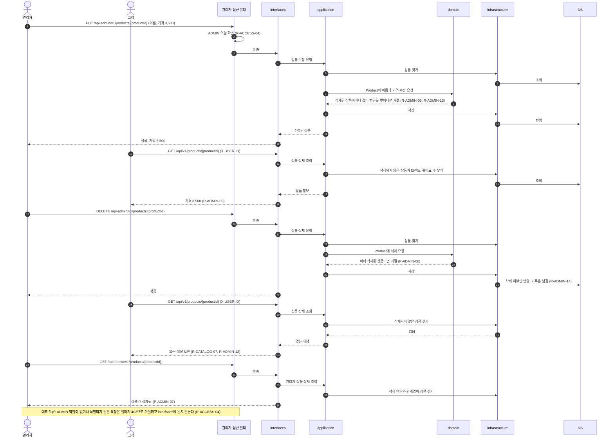
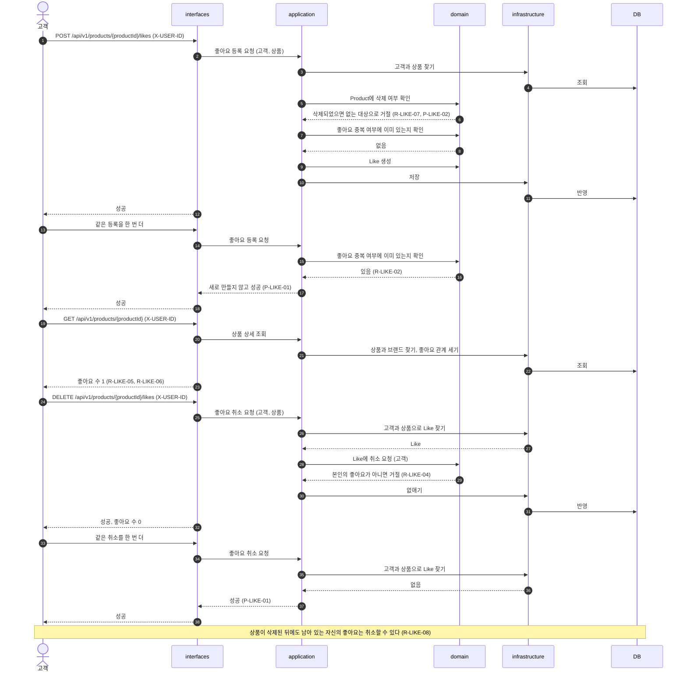
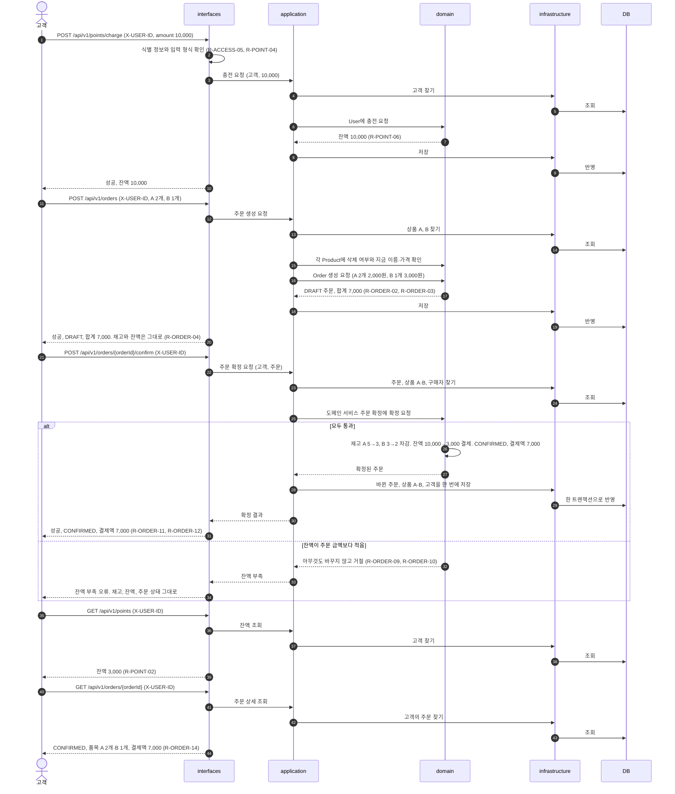

# commerce-api 대표 흐름

과제가 제시한 세 흐름을 요청자부터 DB까지 계층을 따라 그린 것이다. 흐름마다 기대값과 대표 오류를 함께 적는다. 근거는 [요구사항 문서](./requirements.md)의 요구사항 ID와 정책 ID를 가리키고, 계층의 역할은 [설계 문서](./commerce-api-design.md)의 아키텍처를, 도메인 객체는 [도메인 관계](./domain-relations.md)를 따른다.

## 1. 관리자 변경 → 고객 조회

| 단계     | 요청                                                  | 기대값                                     |
| ------ | --------------------------------------------------- | --------------------------------------- |
| 준비     | —                                                   | 상품 P는 가격 3,000원이고 삭제되지 않았다.             |
| 관리자 수정 | `PUT /api-admin/v1/products/{productId}` (가격 3,500) | 가격이 3,500원으로 바뀐다.                       |
| 고객 조회  | `GET /api/v1/products/{productId}`                  | 가격 3,500원이 보인다. (R-ADMIN-09)            |
| 관리자 삭제 | `DELETE /api-admin/v1/products/{productId}`         | 삭제 여부만 바뀌고 기록은 남는다. (R-ADMIN-14)        |
| 고객 조회  | `GET /api/v1/products/{productId}`                  | 없는 대상 오류 (R-CATALOG-07, R-ADMIN-12)     |
| 관리자 조회 | `GET /api-admin/v1/products/{productId}`            | 삭제 여부와 함께 보인다. (P-ADMIN-07)             |
| 대표 오류  | `ADMIN` 역할이 없거나 식별되지 않은 관리자 요청                      | 필터가 403으로 거절하고, 상품은 그대로다. (R-ACCESS-04) |

## 2. 좋아요 등록·취소

| 단계       | 요청                                          | 기대값                                               |
| -------- | ------------------------------------------- | ------------------------------------------------- |
| 준비       | —                                           | 상품 P의 좋아요 수는 0이다.                                 |
| 등록       | `POST /api/v1/products/{productId}/likes`   | 성공. 좋아요 수 0 → 1                                   |
| 같은 등록 반복 | `POST /api/v1/products/{productId}/likes`   | 성공. 새로 만들지 않아 좋아요 수는 1 그대로 (R-LIKE-02, P-LIKE-01) |
| 상품 조회    | `GET /api/v1/products/{productId}`          | 좋아요 수 1 (R-LIKE-05, R-LIKE-06)                    |
| 취소       | `DELETE /api/v1/products/{productId}/likes` | 성공. 좋아요 수 1 → 0                                   |
| 같은 취소 반복 | `DELETE /api/v1/products/{productId}/likes` | 성공. 좋아요 수 0 그대로 (P-LIKE-01)                       |
| 대표 오류    | 삭제된 상품에 등록                                  | 없는 대상 오류. 좋아요 수 그대로 (R-LIKE-07, P-LIKE-02)        |

## 3. 포인트 충전 → 주문 확정

| 단계    | 요청                                           | 기대값                                                                                     |
| ----- | -------------------------------------------- | --------------------------------------------------------------------------------------- |
| 준비    | —                                            | 고객 잔액 0원. 상품 A는 2,000원·재고 5, 상품 B는 3,000원·재고 3                                          |
| 충전    | `POST /api/v1/points/charge` (amount 10,000) | 잔액 0 → 10,000 (R-POINT-06)                                                              |
| 주문 생성 | `POST /api/v1/orders` (A 2개, B 1개)           | `DRAFT`, 합계 7,000. 재고와 잔액은 그대로 (R-ORDER-03, R-ORDER-04)                                 |
| 주문 확정 | `POST /api/v1/orders/{orderId}/confirm`      | `CONFIRMED`, 결제액 7,000. 재고 A 5 → 3, B 3 → 2. 잔액 10,000 → 3,000 (R-ORDER-11, R-ORDER-12) |
| 잔액 조회 | `GET /api/v1/points`                         | 3,000 (R-POINT-02)                                                                      |
| 주문 조회 | `GET /api/v1/orders/{orderId}`               | `CONFIRMED`, 품목 A 2개·B 1개, 합계와 결제액 7,000 (R-ORDER-14)                                   |
| 대표 오류 | 잔액이 주문 금액보다 적을 때 확정                          | 잔액 부족으로 거절. 재고, 잔액, 주문 상태 모두 그대로 (R-ORDER-09, R-ORDER-10)                               |

