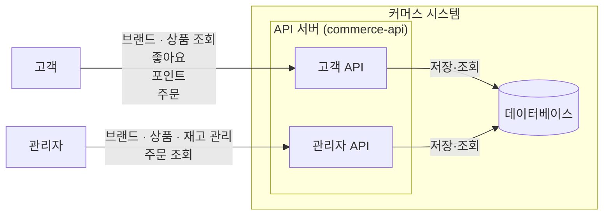
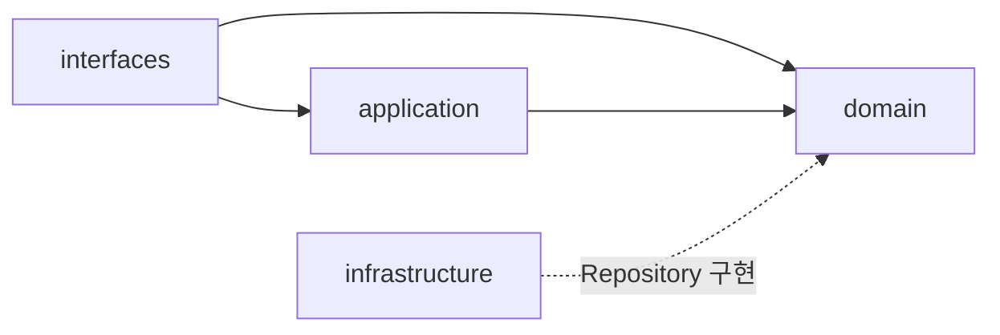
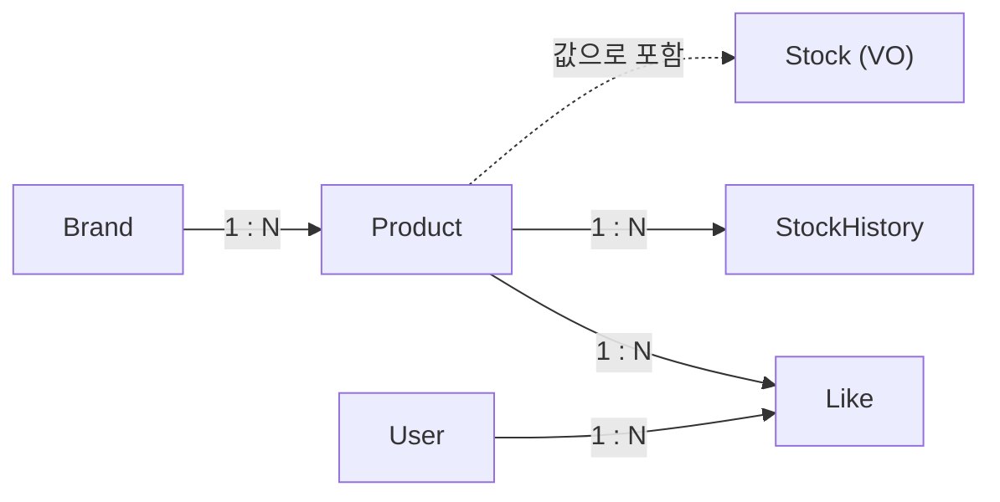
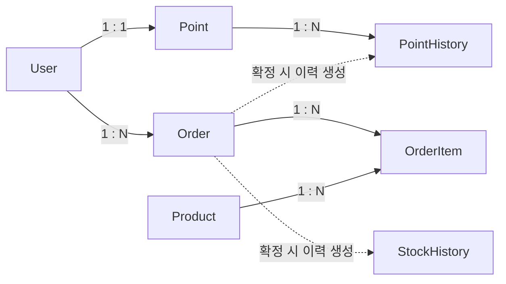
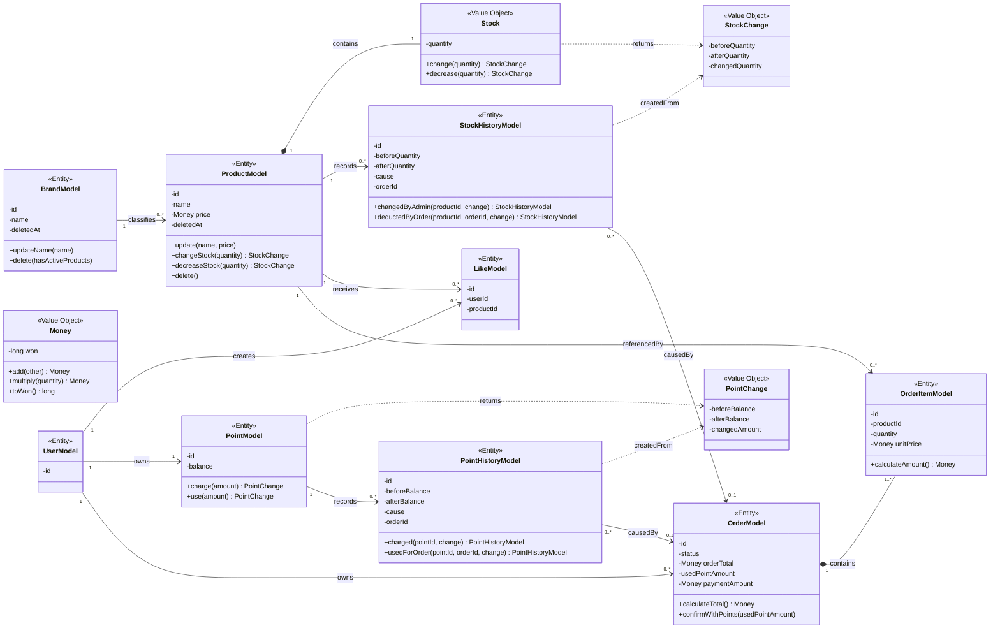
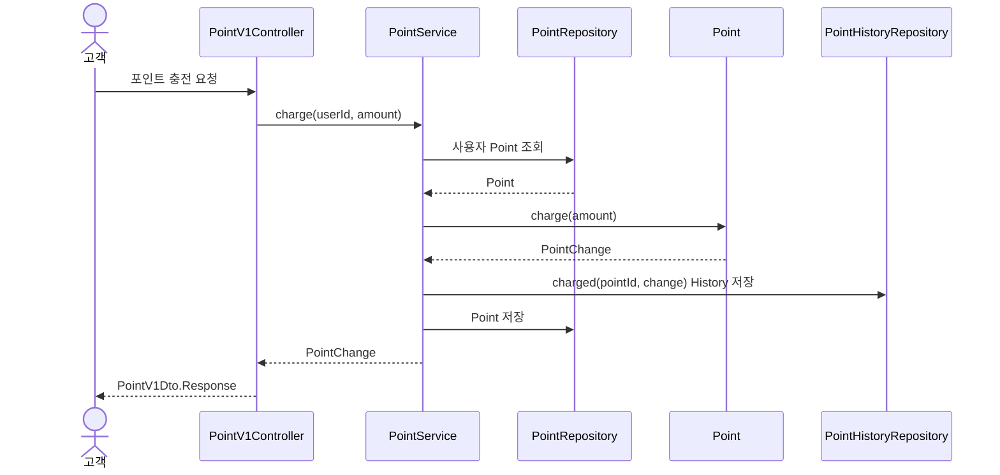
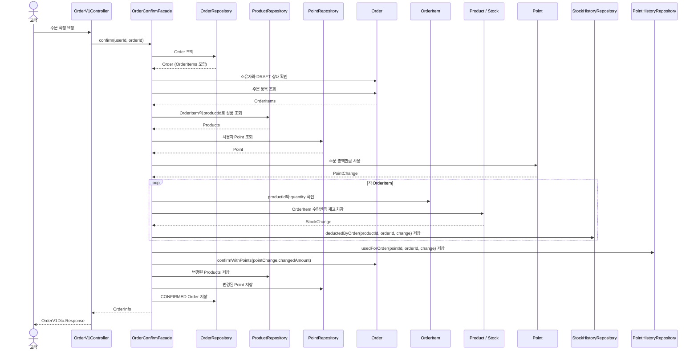

# 시스템 설계

이 문서는 `commerce-api` 구현의 기준이 되는 API 계약과 설계 원칙을 정의한다. 구현은 이 문서에 명시된 계약과 도메인 규칙을 따르며, 외부 동작에 영향을 주지 않는 세부사항은 구조와 의존성 원칙 안에서 결정한다. 문서에 없는 기능은 추가하지 않고, 구현에 필요한 외부 정책이 정해지지 않았으며 적용할 잠정 기준도 없다면 확인 후 반영한다. `[잠정]` 정책은 기획 결정에 따라 변경될 수 있지만, 결정 전까지는 문서에 적힌 현재 값을 구현과 테스트의 기준으로 사용한다.

## 1. 버드뷰

### 1.1 시스템 개요

이 시스템은 고객이 브랜드와 상품을 탐색하고, 관심 있는 상품에 좋아요를 표시하며, 포인트를 충전하고 상품을 주문할 수 있는 커머스 시스템이다.

관리자는 고객에게 노출되는 브랜드와 상품을 관리하고, 상품 재고를 변경하며 주문 현황을 조회한다.

고객과 관리자의 요청은 API 서버(`commerce-api`)가 처리하고, 데이터는 데이터베이스에 저장한다.

### 1.2 시스템 구성과 기능 범위



*그림 1. 고객·관리자와 커머스 시스템의 경계 및 요청 방향*

API 서버(`commerce-api`)는 고객용 API와 관리자용 API를 구분한다. 두 사용자는 브랜드와 상품처럼 같은 데이터를 다루기도 하지만, 허용하는 기능과 접근 가능한 데이터의 범위는 서로 다르다. 관리자가 변경한 브랜드·상품·재고 정보는 고객의 조회와 주문 처리에 사용된다.

각 역할이 실제로 수행하는 기능은 다음과 같다.

#### 고객

- 브랜드 상세 정보와 상품 목록·상세 정보를 조회한다.
- 상품에 좋아요를 등록·취소하고 자신의 좋아요 목록을 조회한다.
- 포인트를 충전하고 현재 잔액을 조회한다.
- 주문을 생성·확정하고 자신의 주문 목록과 상세 정보를 조회한다.

#### 관리자

- 브랜드를 등록·조회·수정·삭제한다.
- 상품을 등록·조회·수정·삭제한다.
- 상품 재고를 변경한다.
- 전체 주문 목록과 주문 상세 정보를 조회한다.

외부 결제·배송·알림과 같은 외부 서비스 연동은 이번 설계 범위에서 다루지 않는다.

개별 API 계약, 상세 도메인 관계, 처리 순서, 계층별 책임은 뒤의 설계에서 구체화한다.

## 2. 구조와 의존

### 2.1 적용 범위와 패키지 구조

`commerce-api`는 계층 우선(layer-first) 구조를 따른다. 최상위를 계층(`interfaces`, `application`, `domain`, `infrastructure`)으로 나누고, 각 계층 아래에 기능별 패키지를 구성한다.

```text
com.loopers
├── interfaces/api/{feature}
│   ├── {Feature}V1Controller
│   └── {Feature}AdminV1Controller  (관리자 API가 있는 경우)
├── application/{feature}
├── domain/{feature}
├── domain/common  (기능 간 공유 Value Object)
├── infrastructure/{feature}
└── support
```

고객용 API와 관리자용 API는 같은 기능 패키지에 배치하되, Controller와 요청·응답 모델을 분리한다.
상품과 주문에서 함께 사용하는 `Money`는 독립 기능이 아니라 공유 Value Object이므로 `domain/common`에 둔다.

layer-first는 HTTP 요청 처리, 유스케이스 조율, 도메인 규칙과 저장 구현을 책임의 종류에 따라 구분하고, 계층 간 의존 방향을 패키지 구조에 명확히 드러낼 수 있다.

feature-first는 한 기능과 관련된 코드를 가까운 위치에 모을 수 있다는 장점이 있다. 그러나 현재는 `Like`와 `Stock`을 독립 기능으로 볼지 다른 기능에 포함할지 등 기능 경계가 확정되지 않았으며, 주문 확정처럼 여러 기능 영역이 협력하는 유스케이스가 존재한다.

현재 시스템의 기능 경계와 프로젝트 규모를 고려해, 기능별 격리보다 계층별 책임과 의존 방향을 명확히 드러내는 layer-first 구조를 선택한다. 이 선택으로 하나의 기능을 변경할 때 여러 계층의 패키지를 오가야 하는 비용이 발생한다.

### 2.2 레이어별 역할과 주요 구성 요소

각 레이어의 책임과 해당 레이어에 배치하는 주요 구성 요소는 다음과 같다. 여러 비즈니스 애그리게잇의 변경을 조율하는 Application Service는 이 프로젝트에서 `{UseCase}Facade`로 명명한다.

|계층|역할|주요 구성 요소|
|---|---|---|
|interfaces|고객·관리자의 요청을 입력으로 변환하고, 처리 결과와 예외를 HTTP 응답으로 변환한다.|고객·관리자 Controller, 요청·응답 DTO, API 명세, 예외 응답 처리|
|application|여러 비즈니스 애그리게잇의 상태 변경을 하나의 유스케이스에서 함께 조율하고 전체 트랜잭션 경계를 관리한다. Facade는 필요한 객체를 조회해 Entity 또는 Domain Service의 행동을 호출하며, 업무 규칙을 직접 구현하지 않는다.|Facade, 입력·결과 모델|
|domain|Entity와 Value Object는 상태와 업무 규칙을 표현하고 스스로 유효성을 지킨다. Domain Service는 하나의 주된 애그리게잇을 변경하는 유스케이스와 해당 트랜잭션 경계를 담당한다. 명령에 필요한 다른 애그리게잇의 상태를 읽을 수 있지만 변경하지 않으며, 하나의 QueryRepository가 완성된 읽기 전용 결과를 반환하는 조회도 담당할 수 있다. 필요한 Repository 인터페이스와 조회 결과 계약도 domain에 선언한다.|Entity, Value Object, Domain Service, Repository·QueryRepository 인터페이스, QueryResult|
|infrastructure|domain이 선언한 저장소 인터페이스를 JPA 등 구체적인 저장 기술로 구현한다.|Repository 구현체, Spring Data JPA Repository|
|support|공통 오류 처리 등 애플리케이션 전반에서 사용하는 지원 코드를 제공한다.|공통 예외, 오류 타입|

이 문서의 Domain Service는 순수 규칙 객체에 한정되지 않는다. 여러 도메인 객체의 정보가 필요한 업무 판단은 우선 Entity·Value Object에 둘 수 있는지 확인하고, 어느 하나가 책임지기 어려울 때 Domain Service에 둔다. 다른 객체를 참조한다는 이유만으로 규칙을 Service로 옮기지는 않는다.

비즈니스 Domain Entity와 JPA Entity는 기본적으로 `{Domain}Model` 하나로 사용하며 `commerce-api`의 `domain/{feature}`에 배치한다. 두 모델을 분리할 필요가 생기면 해당 모델만 `{Domain}JpaEntity`로 분리해 infrastructure에 둔다. `modules/jpa`에는 비즈니스 Entity를 두지 않고 `BaseEntity`와 공통 JPA 설정만 둔다. 분리 판단 사례와 선택에 따른 비용은 부록 A.6에서 비교한다.

읽기 전용 조회와 하나의 주된 애그리게잇만 변경하는 명령은 Controller가 Domain Service를 직접 호출한다. Domain Service는 상품 등록을 위한 Brand 확인, 좋아요 등록을 위한 Product 확인, Brand 삭제를 위한 활성 Product 존재 여부처럼 명령에 필요한 다른 애그리게잇의 상태를 읽을 수 있지만 해당 애그리게잇을 변경하지 않는다. 여러 비즈니스 애그리게잇의 상태를 하나의 트랜잭션에서 함께 변경해야 할 때 Facade를 사용한다.

```text
Controller
    → Domain Service @Transactional
        ├→ 다른 애그리게잇 Repository 읽기
        └→ 주된 애그리게잇 Repository 조회·저장
```

브랜드명·좋아요 수·현재 재고 수량을 포함한 상품 목록·상세처럼 여러 값을 조합하더라도, 하나의 조회 포트가 완성된 읽기 전용 결과를 반환하고 도메인 행동을 조율하지 않는다면 다음과 같이 처리한다.

```text
Controller
    → Domain Service @Transactional(readOnly = true)
        → QueryRepository
            → QueryResult
```

`ProductService`는 `ProductQueryRepository`가 반환한 `ProductQueryResult`를 그대로 조회 계약으로 사용한다. `BrandService`는 Product 존재 여부를 읽고 Brand만 변경하며, `OrderService`는 Product 정보로 Order를 생성하되 Product를 변경하지 않는다. 반면 주문 확정은 Order·Point·Product의 상태를 함께 변경하므로 `OrderConfirmFacade`가 조율한다.

여러 비즈니스 애그리게잇을 함께 변경하는 유스케이스는 Facade가 전체 처리 순서를 조율한다. Facade는 Domain Service를 반드시 거치지 않고 Repository 인터페이스로 객체를 조회·저장한 뒤 Entity 또는 Domain Service의 행동을 호출할 수 있다.

```text
Controller
    → Facade @Transactional
        ├→ Repository 인터페이스로 객체 조회·저장
        ├→ Entity 행동 호출
        └→ Domain Service @Transactional 호출
```

Facade가 여러 비즈니스 애그리게잇의 변경을 조율하는 경우 Facade가 전체 트랜잭션을 시작한다. Facade 안에서 호출된 Domain Service의 `@Transactional`은 기본 전파 속성인 `REQUIRED`에 따라 Facade가 시작한 트랜잭션에 참여하므로 별도의 트랜잭션으로 분리되거나 충돌하지 않는다. Domain Service가 Controller에서 직접 호출되는 경우에는 Domain Service가 해당 유스케이스의 트랜잭션을 시작한다.

PointHistory와 StockHistory는 각각 Point와 Stock의 상태 변경에 부속된 감사 기록으로 보며, History를 함께 저장한다는 이유만으로 Facade를 사용하지 않는다. Facade 판단 기준은 History를 제외한 여러 비즈니스 애그리게잇의 상태를 함께 변경하는지 여부다.

이 설명은 `@Transactional`의 기본 전파 속성인 `REQUIRED`를 기준으로 한다. 이후 `REQUIRES_NEW`처럼 별도 트랜잭션을 생성하는 전파 속성을 사용하면 트랜잭션 경계를 다시 검토한다.

Facade와 Domain Service가 같은 Repository 인터페이스를 사용하는 것은 순환 의존이 아니지만, 동일한 조회·저장 책임이 두 곳에 중복되지 않도록 호출 목적을 구분한다. Facade는 도메인의 상태를 직접 변경하거나 업무 규칙을 중복해서 구현하지 않는다. Facade가 서로 다른 책임을 함께 가지게 되면 유스케이스를 기준으로 분리한다.

Domain Service는 Entity·Value Object·Change 또는 QueryResult처럼 domain에 선언된 타입을 반환한다. 여러 애그리게잇의 결과를 조합하는 Facade는 application의 `{Domain}Info`를 반환한다. Controller는 어느 경우에도 전달받은 객체를 HTTP 응답으로 직접 직렬화하지 않고 API 응답 DTO로 변환한다. Facade는 트랜잭션이 끝나기 전에 필요한 값을 Info로 구성하며, Domain Service가 Entity를 반환할 때도 Controller가 지연 로딩에 의존하지 않도록 필요한 상태를 미리 복원하거나 QueryResult를 사용한다. 반환 모델 경계의 대안과 비용은 부록 A.12에서 비교한다.

호출 경계와 트랜잭션 위치의 대안 및 현재 구조를 선택한 이유는 부록 A.7에서 비교한다. 읽기 전용 조합 조회의 경계는 부록 A.11에서 별도로 비교한다.

### 2.3 허용하는 의존 방향



*그림 2. `commerce-api`의 계층 간 허용 의존 방향*

- **domain**은 interfaces·application·infrastructure에 의존하지 않는다.
- **application**은 domain에 의존하며 interfaces·infrastructure는 참조하지 않는다.
- **interfaces**는 application·domain에 의존할 수 있으나 infrastructure는 직접 참조하지 않는다.
- **infrastructure**는 domain이 선언한 인터페이스를 구현하기 위해 domain에 의존한다. application·interfaces에는 의존하지 않는다.
- **support**는 주요 계층과 별도로 공통 지원 코드를 제공한다. 하위 패키지의 역할에 따라 참조 범위를 정하며, 모든 계층이 자유롭게 참조할 수 있는 독립 계층으로 간주하지 않는다.

### 2.4 Repository 추상화 위치

domain이 필요한 저장 행동을 인터페이스로 선언하고, infrastructure가 이를 구현한다(DIP). Facade와 Domain Service는 Spring Data JPA Repository나 QueryDSL 구현체를 직접 참조하지 않고 domain의 Repository 인터페이스를 사용한다.

- Entity의 조회·저장처럼 애그리게잇 상태를 다루는 인터페이스는 `domain/{기능}`에 `{기능}Repository`로 선언한다.
- 목록·상세 화면에 필요한 조인·집계 결과를 한 번에 반환하는 읽기 전용 인터페이스는 `domain/{기능}`에 `{기능}QueryRepository`로 선언하고 `{기능}QueryResult`를 반환한다.
- 구현체는 `infrastructure/{기능}`에 `{기능}RepositoryImpl`(도메인 인터페이스 구현)과 `{기능}JpaRepository`(Spring Data JPA)로 둔다. 단순 조회·저장은 JpaRepository에 위임하고, 동적 조건이나 복잡한 조회가 필요하면 RepositoryImpl에서 QueryDSL을 사용할 수 있다.

```java
// domain/product
public interface ProductRepository {
    Optional<ProductModel> find(long productId);
}

public interface ProductQueryRepository {
    Optional<ProductQueryResult> findDetail(long productId);
}

// infrastructure/product
// ProductRepositoryImpl이 ProductRepository를 구현하고, 내부에서 ProductJpaRepository(Spring Data JPA)에 위임한다.
// ProductQueryRepositoryImpl은 필요한 경우 JPAQueryFactory로 Product·Brand를 조인하고 Like를 집계한다.
// Facade 또는 Domain Service는 목적에 맞는 Repository 인터페이스를 주입받아 사용한다.
```

`ProductQueryResult`의 `brandName`과 `likeCount`는 조회 시 계산·조합되는 스칼라 값이며 ProductModel의 영속 상태가 아니다. `stockQuantity`는 Product가 소유한 Stock의 현재 수량을 읽은 값이다. QueryRepository는 읽기 모델을 위한 포트이므로 애그리게잇 변경에 사용하지 않는다.

찾는 대상이 없을 때의 처리(예: NOT_FOUND)는 Repository가 아니라 호출자인 Facade 또는 Domain Service가 판단한다.

이 추상화로 Facade와 Domain Service는 구체적인 저장·조회 구현에 직접 의존하지 않으며, Repository 인터페이스가 유지되는 범위에서는 구현 변경의 영향을 infrastructure에 제한할 수 있다. 테스트에서는 fake 구현을 연결해 업무 로직을 검증할 수 있지만, JPA의 영속성 동작은 실제 데이터베이스를 사용하는 테스트로 확인해야 한다. Domain Entity와 JPA Entity를 통합하고 JPA의 관리 Entity와 변경 감지 기능을 활용하는 선택도 유지하므로, 다른 저장 기술로 교체할 때 domain이나 Service의 수정이 없다고 보장하지는 않는다. 대신 필요한 저장 행동을 domain의 Repository 인터페이스에 명시하고 infrastructure에 위임 코드를 작성해야 하는 비용을 받아들인다.

### 2.5 ArchUnit 검증 규칙

`ArchitectureTest.java`는 다음 계층 간 금지 의존을 검사하며, 위반하면 테스트가 실패한다.

|검사 대상|금지하는 의존|
|---|---|
|domain|interfaces·application·infrastructure|
|application|interfaces·infrastructure|
|interfaces|infrastructure|
|infrastructure|application·interfaces|

support는 독립된 계층으로 취급하지 않으므로 계층 간 의존 규칙의 검증 대상에 포함하지 않는다.

이 테스트는 컴파일된 클래스의 패키지·타입 의존을 검사한다. 각 클래스가 업무적으로 적절한 책임을 가졌는지와 런타임 동작의 정확성까지 보장하지는 않는다.

### 2.6 클래스와 파일 명명 규칙

Java의 public 클래스와 파일 이름은 동일하게 사용한다. 문서 본문과 관계 개요도에서는 `Order`, `Product`처럼 도메인 개념명을 사용하고, 실제 구현 클래스와 3.3의 클래스 다이어그램에는 다음 접미사 규칙을 적용한다.

|역할|명명 규칙|예시|
|---|---|---|
|Domain/JPA 통합 Entity|`{Domain}Model`|`OrderModel`|
|분리한 JPA Entity|`{Domain}JpaEntity`|`OrderJpaEntity`|
|Domain↔JPA 변환기|`{Domain}JpaMapper`|`OrderJpaMapper`|
|Value Object|도메인 용어|`Stock`, `Money`|
|Domain Service|`{Domain}Service`|`PointService`|
|다중 애그리게잇 변경 Application Service|`{UseCase}Facade`|`OrderConfirmFacade`|
|Facade 결과 모델|`{Domain}Info`|`OrderInfo`|
|Repository 인터페이스|`{Domain}Repository`|`OrderRepository`|
|읽기 전용 조회 인터페이스|`{Domain}QueryRepository`|`ProductQueryRepository`|
|읽기 전용 조회 결과|`{Domain}QueryResult`|`ProductQueryResult`|
|Repository 구현체|`{Domain}RepositoryImpl`|`OrderRepositoryImpl`|
|읽기 전용 조회 구현체|`{Domain}QueryRepositoryImpl`|`ProductQueryRepositoryImpl`|
|Spring Data JPA Repository|`{Domain}JpaRepository`|`OrderJpaRepository`|
|고객 API 명세·Controller·DTO|`{Domain}V1ApiSpec`, `{Domain}V1Controller`, `{Domain}V1Dto`|`OrderV1Controller`|
|관리자 API 명세·Controller·DTO|`{Domain}AdminV1ApiSpec`, `{Domain}AdminV1Controller`, `{Domain}AdminV1Dto`|`ProductAdminV1Controller`|

통합한 모델은 `{Domain}Model` 하나가 Domain Entity와 JPA Entity의 역할을 함께 담당하므로 별도의 `{Domain}JpaEntity`와 Mapper를 만들지 않는다. 선택적으로 분리한 경우에는 `{Domain}Model`을 domain에 유지하고, `{Domain}JpaEntity`와 `{Domain}JpaMapper`를 `infrastructure/{feature}`에 둔다. RepositoryImpl은 Mapper를 사용해 두 모델을 변환하며, application과 domain에 JpaEntity를 노출하지 않는다.

`{Domain}Info`는 Facade가 여러 domain 결과를 조합해 Controller에 전달할 때만 사용한다. Domain Service는 application의 Info를 참조하지 않으며, Controller는 Info나 domain 타입을 `{Domain}V1Dto.Response`로 변환한다. Info는 application 모델이므로 3.3의 도메인 클래스 다이어그램에는 포함하지 않는다.

## 3. 도메인 관계

### 3.1 도메인 구성과 주요 모델

시스템의 주요 도메인과 각 도메인에 포함되는 모델은 다음과 같다. 주요 모델에는 Entity뿐 아니라 요구사항에서 독립된 책임이 드러나는 Value Object도 포함하며, 구현 과정에서 생길 수 있는 모든 Value Object를 나열하지는 않는다.

|도메인 영역|주요 모델|담당 영역|
|---|---|---|
|브랜드|`BrandModel`|브랜드 정보와 생명주기|
|상품|`ProductModel`, `Stock`·`StockChange` (VO), `StockHistoryModel`, `LikeModel`|상품 정보, 현재 재고와 변경 이력, 사용자 좋아요 관계|
|사용자|`UserModel`|사용자 식별과 소유 관계의 기준|
|주문|`OrderModel`, `OrderItemModel`|주문 상태, 주문 품목과 결제 정보|
|포인트|`PointModel`, `PointChange` (VO), `PointHistoryModel`|사용자별 포인트 잔액과 변경 이력|

`Money`는 상품 가격과 주문 당시 단가·품목 금액·주문 총액·결제액에 공통으로 사용하는 Value Object다. 별도 식별자 없이 `long` 타입의 원 단위 값을 감싸며, 금액 계산과 표현 범위 검사를 맡는다. 포인트 잔액과 포인트 사용액은 원화 금액과 구분해 `Money`로 표현하지 않는다. 기본형 숫자나 `BigDecimal`을 사용하는 대안과 선택 비용은 부록 A.15에서 비교한다.

Stock은 Product와 독립된 식별자와 생명주기가 필요하지 않으므로 Product가 소유하는 Value Object로 둔다. 독립 Entity나 단순 수량 필드로 표현하는 대안과 선택에 따른 비용은 부록 A.5에서 비교한다. `Money`, `PointChange`, `StockChange`는 생성 후 값이 바뀌지 않는 불변 객체로 두고, 현재 수량을 보유한 `Stock`은 소유자인 Product의 행동을 통해서만 변경한다. 계산값과 변경 결과는 변경되지 않게 유지하면서 재고 변경 규칙은 Stock에 모으기 위한 선택이다. Point와 Stock은 각각 현재 잔액과 재고의 기준이며, PointHistory와 StockHistory는 상태를 계산하기 위한 원장이 아니라 변경 원인과 결과를 남기는 기록으로 사용한다.

현재 이력 조회 API는 없지만, 포인트 충전·사용과 관리자 재고 변경·주문 차감의 원인과 결과를 추적하기 위한 내부 기록으로 PointHistory와 StockHistory를 둔다. 현재 상태만 저장하는 대안과 선택에 따른 비용은 부록 A.1에서 비교한다.

Point와 Stock은 상태 변경 전후 값과 변경량을 각각 `PointChange`, `StockChange`로 반환한다. History는 이 변경 결과와 유스케이스의 원인을 받는 이름 있는 팩토리 메서드로 생성한다. 이 책임 배치의 대안과 비용은 부록 A.10에서 비교한다.

### 3.2 모델 간 관계와 책임



*그림 3. 상품·좋아요·재고 모델 간 관계*



*그림 4. 주문·포인트·이력 모델 간 관계*

두 그림에 반복 등장하는 User·Product·StockHistory는 각각 동일한 모델이며, 관계별 책임과 규칙은 아래 표에 함께 정리한다. Product는 Stock을 값으로 포함하고, Order는 OrderItem의 생명주기를 소유한다. History는 Product 또는 Point에 속한다. Order와 History 사이의 점선은 소유 관계가 아니라 주문 확정에 따른 변경 원인 관계다. 주문 확정으로 생성된 History는 원인이 된 Order 식별자를 선택적으로 기록한다. 나머지 선은 모델 간 업무 관계를 나타내며, 구체적인 단방향·양방향 참조와 JPA 연관관계 매핑 방식은 구현 단계에서 결정한다.

|관계|책임과 핵심 규칙|
|---|---|
|Brand–Product|Product는 하나의 Brand에 속한다. BrandService가 삭제되지 않은 Product의 존재 여부를 조회해 전달하면, Brand가 `delete(hasActiveProducts)`에서 삭제 가능 여부를 판단하고 자신의 삭제 상태를 변경한다.|
|Product–Stock|Product는 Stock Value Object를 소유한다. Stock은 현재 수량을 관리하고 음수 재고를 허용하지 않으며, 관리자 변경과 주문 확정에 필요한 수량 변경 행동을 제공한 뒤 `StockChange`를 반환한다.|
|Product–StockHistory|StockHistory는 `StockChange`와 변경 원인을 받는 이름 있는 팩토리 메서드로 관리자 재고 변경과 주문 확정의 결과를 기록한다.|
|User–Like–Product|Like는 User와 Product 사이의 관계를 나타낸다. 같은 사용자가 같은 상품에 만든 Like 관계는 중복될 수 없다.|
|User–Point|이번 설계에서는 User 생성 API를 다루지 않는다. 테스트는 fixture 코드로 User와 잔액 0인 Point를 테스트 DB에 함께 저장한다. 따라서 정상적으로 준비된 User는 하나의 Point를 가진다. Point는 현재 잔액과 충전·사용 행동을 관리하고 `PointChange`를 반환하며, 잔액은 0을 허용하지만 음수가 될 수 없다.|
|Point–PointHistory|PointHistory는 소유자인 Point의 식별자와 `PointChange`, 변경 원인을 받는 이름 있는 팩토리 메서드로 포인트 충전과 주문 사용의 결과를 기록한다.|
|User–Order|Order는 소유자인 User를 식별한다. 고객은 자신의 주문만 조회하고 확정할 수 있다.|
|Order–OrderItem|Order는 하나 이상의 OrderItem을 소유한다. OrderItem은 주문 당시 상품, 수량과 단가를 보관하고, Order는 품목 금액의 합으로 주문 총액을 관리한다.|
|Product–OrderItem|OrderItem은 주문한 Product를 참조한다. 상품 정보가 변경되더라도 이미 저장된 주문 품목의 수량과 단가는 변경되지 않는다.|
|Order–StockHistory·PointHistory|주문 확정으로 생성된 StockHistory와 PointHistory는 원인이 된 주문 식별자를 기록한다. 관리자 재고 변경과 포인트 충전으로 생성된 History에는 주문 참조가 없다.|

Order는 `DRAFT`와 `CONFIRMED` 상태를 가진다. 주문 생성 시 `DRAFT`가 되며, 소유자의 주문 확정 과정에서 재고와 포인트 차감이 모두 성공하면 `CONFIRMED`로 전이한다. 이미 `CONFIRMED`인 주문은 다시 확정할 수 없다.

Order는 주문 총액, 포인트 사용액과 결제액을 구분해 기록한다. 각 금액의 정의와 계산 규칙은 5.1을 따르며, 구분해 저장하는 이유와 비용은 부록 A.4에서 비교한다.

재고·포인트의 유효성이나 주문 상태 전이처럼 모델 자신의 상태로 판단할 수 있는 규칙은 해당 모델이 지킨다. BrandService는 활성 Product 존재 여부를 읽어 Brand에 전달하지만 Product를 변경하지 않으며, 삭제 가능 여부와 상태 변경은 Brand가 담당한다. OrderConfirmFacade는 Order·Point·Product처럼 여러 비즈니스 애그리게잇의 상태 변경을 조율하되 업무 규칙은 각 모델에 맡긴다. Brand 삭제 책임을 이렇게 배치한 근거는 부록 A.9에서 비교한다.

상품 목록·상세 조회는 `ProductService`가 `ProductQueryRepository`를 호출해 `ProductQueryResult`를 반환한다. 이 결과에는 Product가 소유한 Stock의 현재 수량도 포함한다. Product·Brand 조인과 Like 집계는 한 번의 읽기 전용 쿼리로 처리하며, `brandName`과 `likeCount`는 조회 결과의 스칼라 값이지 ProductModel의 상태가 아니다. 여러 테이블을 조회하더라도 모델의 행동이나 상태 변경을 조율하지 않으므로, 별도의 Application Service(Facade)를 두지 않는다. 이 경계의 대안과 비용은 부록 A.11에서 비교한다.

### 3.3 도메인 클래스 설계

다음 다이어그램은 3.1에서 정의한 주요 모델의 대표 상태와 행동을 표현한다. 구현할 모든 필드와 메서드를 나열하지 않으며, 명시하지 않은 필드의 타입과 JPA 애너테이션·연관관계 매핑은 구현 단계에서 결정한다.



*그림 5. 주요 도메인 모델의 상태·행동과 클래스 관계*

BrandModel은 BrandService가 조회한 활성 Product 존재 여부를 받아 삭제 가능 조건을 직접 판단한다. ProductModel은 Stock의 행동을 통해 재고 규칙을 지키며, 외부 객체가 수량을 직접 변경하지 못하게 한다. Stock은 수량 변경 전에 유효성을 검사하고 자신의 상태를 바꾼 뒤 불변인 StockChange를 반환한다. PointModel도 잔액 변경 전후 상태를 불변인 PointChange로 반환한다. Money는 원 단위 금액의 덧셈과 수량 곱셈을 담당하고 결과가 `long` 범위를 넘는지 검사하며, 연산 결과를 새 Money로 반환한다. OrderItemModel은 Money로 품목 금액을 계산하고, OrderModel은 이를 합산해 주문 총액을 관리한다. OrderModel은 포인트 사용액의 원화 환산 값이 주문 총액과 같은지 검증한 뒤 결제액과 상태를 변경한다. `DRAFT` 상태에서는 포인트 사용액과 결제액이 없으며, `CONFIRMED`로 전이할 때 기록한다.

LikeModel은 UserModel과 ProductModel의 중복될 수 없는 관계를 표현한다. StockHistoryModel과 PointHistoryModel은 변경 결과를 받는 이름 있는 팩토리 메서드로 생성되어 필드 구성 규칙을 한곳에 모은다. 호출자는 관리자 변경·충전·주문 사용과 같은 유스케이스의 원인을 선택하고 생성된 History를 저장한다. 두 History의 `orderId`는 주문 확정으로 생성된 경우에만 존재하며, 관리자 재고 변경과 포인트 충전으로 생성된 이력에는 존재하지 않는다.

### 3.4 삭제 정책

**선택한 정책**

Brand와 Product는 삭제 시각을 기록하는 Soft Delete 방식을 사용한다. 기존 주문·좋아요·이력과의 관계를 보존하면서, 삭제된 데이터를 고객 조회와 신규 주문에서 제외하기 위해서다. 삭제되지 않은 Product가 남아 있는 Brand는 삭제할 수 없다.

Like는 Hard Delete한다. Like는 그 자체로 보존해야 할 거래·이력 자원이 아니라 사용자–상품 사이의 현재 관계이며, 같은 사용자–상품 Like가 하나만 존재한다는 제약을 유니크 제약(`uk_like_user_product`)으로 지키기 때문이다. 현재 유니크 제약을 그대로 둔 채 Soft Delete를 적용하면 취소한 관계가 행으로 남아 재등록 시 충돌하고, 좋아요 수 집계와 내 좋아요 목록 조회에 `deleted_at IS NULL` 조건을 추가로 관리해야 한다. 취소 이력이 필요해지면 Like 자체를 Soft Delete로 바꾸기보다 별도의 이력 테이블을 검토한다.

구체적인 JPA 구현 방식은 여기서 확정하지 않는다. 관리자 조회에서 삭제된 데이터를 포함할지와 이미 삭제된 대상에 대한 요청 처리는 5장의 API 계약과 주요 규칙에서 정한다.

Brand·Product의 삭제 방식에 대한 대안과 선택에 따른 비용은 부록 A.2에서 비교한다.

## 4. 대표 흐름

### 4.1 포인트 충전 후 주문 확정

포인트 충전 후 주문 확정을 대표 흐름으로 선택한다. 이 흐름은 하나의 주된 애그리게잇을 변경하는 Domain Service와 여러 비즈니스 애그리게잇의 변경을 조율하는 Facade의 역할, 주문 확정 시 함께 변경되어야 하는 상태와 트랜잭션 경계를 보여 준다.

주문 생성은 이 흐름보다 먼저 완료되어 있으며, 고객이 소유한 `DRAFT` 주문이 존재한다고 가정한다. 포인트 충전과 주문 확정은 서로 다른 API 요청이자 별도의 트랜잭션이다. 따라서 주문 확정이 실패하더라도 앞서 완료된 포인트 충전 결과는 유지된다.

주문 확정은 5.1의 전액 포인트 결제 규칙을 따른다. 주문 총액 전부를 포인트로 결제하며, 주문 확정 요청에서 사용할 포인트를 별도로 입력하지 않는다. 따라서 포인트 사용액과 결제액은 주문 총액과 같으며, 고객의 포인트 잔액이 주문 총액보다 적으면 확정을 거절한다.

### 4.2 포인트 충전

포인트 충전은 Point만 주된 상태로 변경하는 유스케이스이므로 `PointService`가 트랜잭션을 관리한다. PointHistory는 이 변경에 부속된 감사 기록으로 함께 저장한다.

공통 요청자 식별 단계에서 테스트 DB에 준비된 User의 존재를 확인한 뒤, PointService는 해당 User와 함께 fixture로 준비된 Point를 조회한다. 존재하는 User에게 Point가 없는 경우에는 최초 충전으로 간주해 새로 생성하지 않고 비정상적인 데이터 상태로 처리한다. 구체적인 오류 응답은 5장의 API 계약에서 정한다.



*그림 6. 포인트 충전 객체 협력 흐름*

Point는 충전 금액이 양수인지 확인하고 잔액을 증가시킨 뒤 변경 전후 잔액과 충전액을 담은 PointChange를 반환한다. PointService는 `PointHistoryModel.charged(pointId, change)`로 충전 이력을 생성해 저장하고 domain 타입인 PointChange를 Controller에 반환한다. Controller는 충전 후 잔액을 `PointV1Dto.Response`로 변환한다. fixture에서 Point에 설정한 초기 잔액 0은 충전이나 사용에 따른 변경이 아니므로 PointHistory를 생성하지 않는다. Point 변경과 History 저장은 같은 트랜잭션에서 처리하며, 입력이나 저장에 실패하면 잔액과 History는 모두 변경되지 않는다.

### 4.3 주문 확정

주문 생성은 Product의 상태를 읽어 Order와 OrderItem만 생성하므로 `OrderService`가 담당한다. 주문 확정은 Order, Product·Stock, Point라는 여러 비즈니스 애그리게잇이 함께 변경되는 유스케이스이므로 `OrderConfirmFacade`가 전체 처리 순서와 트랜잭션을 관리한다. API가 분리되어 있다는 사실이 아니라 실제로 함께 변경하는 비즈니스 애그리게잇의 수를 기준으로 호출 경계를 구분한다.



*그림 7. 주문 확정 객체 협력 흐름*

OrderRepository는 Order와 Order가 소유한 OrderItem을 함께 복원한다. 구체적인 JPA 로딩 방식은 구현 단계에서 결정한다. 재고 차감에 사용하는 상품과 수량은 확정 요청에서 다시 받지 않고, 저장된 OrderItem의 `productId`와 `quantity`를 기준으로 한다.

Order는 요청자가 주문 소유자인지와 현재 상태가 `DRAFT`인지 확인한다. Point는 잔액이 주문 총액 이상인지 확인한 뒤 주문 총액을 먼저 차감하고 PointChange를 반환한다. 이후 각 OrderItem에 대응하는 Product와 Stock이 상품의 주문 가능 여부와 재고를 확인하고 수량을 차감한 뒤 StockChange를 반환한다. OrderConfirmFacade는 각 변경 결과에 주문 식별자를 더해 `PointHistoryModel.usedForOrder(pointId, orderId, change)`와 `StockHistoryModel.deductedByOrder(productId, orderId, change)`로 이력을 생성하고 저장한다. Order는 PointChange의 포인트 사용액이 주문 총액과 같은지 확인하고, 같은 금전적 가치를 결제액으로 기록한 뒤 `CONFIRMED`로 전이한다. OrderConfirmFacade는 트랜잭션 안에서 확정된 주문·품목·결제 정보를 `OrderInfo`로 구성해 반환하고, Controller는 이를 `OrderV1Dto.Response`로 변환한다. 이 상태 전이가 주문 확정과 결제의 성공 결과를 나타낸다. Point와 Stock의 처리 순서를 선택한 근거와 비용은 부록 A.3에서 비교한다.

주문이 없거나 요청자가 소유자가 아닌 경우, 주문이 이미 확정된 경우, 상품이 없거나 삭제된 경우, 재고 또는 포인트가 부족한 경우에는 확정을 거절한다. 주문 확정 중 하나의 검증이나 저장이라도 실패하면 재고·포인트·History·주문 상태 변경을 모두 롤백한다. 앞서 별도 트랜잭션으로 완료된 포인트 충전은 이 롤백에 포함되지 않는다.

이번 구현은 단일 요청 안에서의 트랜잭션 정합성까지만 보장한다. 동일 주문의 동시 확정이나 동일 상품 재고의 동시 차감처럼 여러 요청이 동시에 실행되는 상황의 정합성 제어는 현재 범위에 포함하지 않으며, 관련 위험과 향후 대안은 부록 A.3에서 다룬다.

## 5. API 계약과 주요 규칙

이 장은 구현할 API의 입력, 성공 결과와 대표 오류를 정의한다. 모든 조합을 테스트 사례로 나열하기보다 도메인 규칙과 HTTP 계약을 연결하고, 구현 단계에서는 이 계약으로부터 정상 경로와 경계값·실패 테스트를 도출한다.

### 5.1 공통 계약과 입력 정책

#### 요청자 식별과 접근 범위

- 고객 API는 `X-USER-ID` 헤더에 테스트 DB에 준비된 `UserModel`의 숫자 ID(`Long`)를 전달해 요청자를 식별한다. 이 값은 `jop0522` 같은 로그인 아이디가 아니다. `X-USER-ID`는 로컬 환경에서 요청자를 식별하기 위한 값이며, 로그인·인증 기능을 의미하지 않는다. interfaces 계층의 공통 요청자 식별 처리는 모든 고객 요청에서 헤더의 존재·숫자 형식과 User 존재 여부를 확인하고, 검증한 `userId`를 Controller에 전달한다. 헤더가 누락되거나 숫자로 변환할 수 없으면 `400 INVALID_REQUEST`, 숫자 ID에 해당하는 User가 없으면 `404 USER_NOT_FOUND`로 응답한다. 존재 여부 조회는 domain의 UserService에 맡기며 각 기능의 Service에서 같은 검증을 반복하지 않는다.
- 고객은 자신의 좋아요·포인트·주문만 조회하거나 변경할 수 있다. 다른 사용자의 소유 자원은 존재 여부를 노출하지 않고 해당 자원의 `NOT_FOUND` 오류로 처리한다.
- 관리자 API는 `/api-admin/**` 경로에 적용한 Spring Security 설정으로 구분한다. `ADMIN` 역할이 없는 일반 사용자와 식별되지 않은 요청은 모두 `403 Forbidden`으로 거절한다. 이 설정은 로컬 환경과 MockMvc 검증을 위한 접근 경계이며 운영용 로그인·토큰 발급·계정 관리 방식을 의미하지 않는다.
- 이 경계는 `com.loopers.config.AdminBoundaryConfig`의 `SecurityFilterChain` 하나로 구현한다. `securityMatcher("/api-admin/**")`로 관리자 경로에만 적용하고 `hasRole("ADMIN")`을 요구하며, 인증되지 않은 요청도 `401`이 아닌 `403`으로 응답하도록 `authenticationEntryPoint`에서 `sendError(403)`을 사용한다. 관리자용 SecurityFilterChain은 고객 API 요청에 적용되지 않으므로 기존 `X-USER-ID` 식별 규칙을 그대로 유지한다. CSRF 보호는 기본값 그대로 두며, 관리자 변경 요청(POST·PUT·DELETE) 테스트는 `SecurityMockMvcRequestPostProcessors.csrf()`로 유효한 CSRF 입력을 함께 보낸다. 역할 거절 테스트에도 유효한 CSRF 입력을 사용해, 거절 사유가 CSRF가 아니라 요청자 구분임을 확인한다.
- 이 설정은 관리자 경로에 접근 경계를 적용할 뿐 네트워크용 관리자 로그인을 제공하지 않는다. 관리자 API의 실행 검증은 MockMvc로 수행한다. 로컬 실행에는 `local`·`test` 프로파일에 `server.address: 127.0.0.1`을 적용해 외부에 노출하지 않는다.
- 경로 변수, 쿼리 파라미터와 `X-USER-ID` 헤더로 전달하는 모든 식별자는 숫자 형식이어야 한다. 숫자로 변환할 수 없으면 모두 `400`으로 거절하며, 안정적인 오류 코드는 검증 위치에 따라 다르다. `X-USER-ID` 헤더는 interfaces의 공통 요청자 식별 처리가 직접 검증하므로 `400 INVALID_REQUEST`로 응답한다. 경로 변수와 쿼리 파라미터의 숫자 변환 실패는 Spring이 Controller 진입 전에 발생시키는 `MethodArgumentTypeMismatchException`을 기존 `ApiControllerAdvice`가 처리하므로 `ErrorType.BAD_REQUEST`의 코드(`Bad Request`)를 유지한다. 숫자로 변환된 이후 대상이 존재하는지는 각 API의 조회 규칙에 따라 판단한다.

#### 공통 응답과 상태 코드

응답 본문이 있는 성공과 업무 오류는 기존 `ApiResponse<T>` 형식을 사용한다.

```json
{
  "meta": {
    "result": "SUCCESS",
    "errorCode": null,
    "message": null
  },
  "data": {}
}
```

모든 목록 API의 페이지 정보는 다음 `PageResponse<T>` 구조로 `ApiResponse.data`에 담는다. `page`와 `size`, `totalPages`는 32비트 정수, `totalElements`는 64비트 정수로 표현한다. `totalElements`는 목록의 기준 자원 수이며, 주문 목록에서는 Order 수를 뜻한다. 주문 목록은 Order 단위로 페이지를 조회한 뒤 각 주문에 속한 모든 OrderItem을 응답에 포함한다. API별 응답은 5장에 명시된 정보만 포함하고, Entity를 직접 직렬화하거나 생성·수정 시각과 같은 내부 필드를 계약 없이 추가하지 않는다.

```json
{
  "items": [],
  "page": 0,
  "size": 20,
  "totalElements": 0,
  "totalPages": 0
}
```

실패 응답은 `meta.result`를 `FAIL`로 설정하고 안정적인 업무 오류 코드와 메시지를 제공하며, `data`는 `null`로 반환한다.

```json
{
  "meta": {
    "result": "FAIL",
    "errorCode": "POINT_NOT_INITIALIZED",
    "message": "포인트 정보가 초기화되지 않았습니다."
  },
  "data": null
}
```

- 조회와 상태 변경은 `200 OK`, 새 Brand·Product·Like·Order 생성은 `201 Created`로 응답한다.
- 삭제는 `200 OK`와 `data: null`로 응답해 공통 응답 형식을 유지한다.
- 요청 형식과 값이 잘못된 경우 `400`, 대상이 없거나 접근할 수 없는 경우 `404`, 현재 상태나 중복 관계 때문에 수행할 수 없는 경우 `409`를 사용한다.
- 경로 변수로 대상을 지정하는 수정·변경 요청에서 본문 값 검증과 대상 조회가 모두 필요하면 대상 존재 여부를 먼저 판단한다. 존재하지 않거나 삭제된 대상에 잘못된 본문을 보낸 요청은 `400`이 아니라 `404`로 응답한다. Controller는 본문의 값 규칙을 직접 판단하지 않고 값을 그대로 도메인에 전달하며, 값 규칙 위반은 대상을 특정한 뒤에 드러난다. 상품 수정·재고 변경과 브랜드 수정이 여기에 해당한다.
- 생성 요청은 만들려는 대상이 아직 없으므로 이 순서를 적용하지 않고 각 API가 정한 순서를 따른다. 상품 등록은 본문의 `brandId`로 참조할 Brand를 먼저 조회하며, `brandId` 자체가 빠져 조회할 대상을 정할 수 없으면 `400 INVALID_REQUEST`로 거절한다. 주문 생성의 검증 순서는 5.2의 주문 규칙에서 정한다.
- 요청과 무관하게 서버 내부 데이터의 불변식이 깨진 경우에는 `500`을 사용한다. 예를 들어 존재하는 User에게 Point가 없으면 `500 POINT_NOT_INITIALIZED`로 응답한다.
- 같은 HTTP 상태 안에서도 클라이언트가 실패 원인을 구분할 수 있도록 `PRODUCT_NOT_FOUND`, `LIKE_ALREADY_EXISTS`, `INSUFFICIENT_STOCK`과 같은 안정적인 업무 오류 코드를 사용한다. 기존 `ErrorType`을 유지하면서 각 업무 오류의 `HttpStatus`, 안정적인 코드와 기본 메시지를 추가한다. Domain은 발생한 업무 오류를 `CoreException`으로 표현하고, interfaces의 `ApiControllerAdvice`가 `ErrorType`의 정보를 사용해 실제 HTTP 응답을 생성한다.
- Soft Delete된 Brand·Product는 활성 자원을 대상으로 하는 API에서 존재하지 않는 것으로 처리한다. 이미 삭제된 대상을 다시 삭제하는 요청도 각각 `404 BRAND_NOT_FOUND`, `404 PRODUCT_NOT_FOUND`로 응답한다.
- 오류가 발생하면 해당 요청에서 변경하려던 Entity와 History는 저장하지 않는다.

공통 식별·입력 형식 오류는 모든 API에 적용하며, API별 표의 대표 오류에서는 반복해 적지 않는다.

Spring Security 필터에서 거절되는 관리자 요청은 `403` 상태만 계약으로 보장하며, `ApiResponse` 본문 검증 대상에서는 제외한다.

`ErrorType`이 `HttpStatus`를 포함하므로 domain이 support를 통해 HTTP 개념에 간접 의존하는 비용을 받아들인다. 같은 업무 오류를 HTTP 외의 인터페이스에서 재사용하거나 인터페이스별로 서로 다른 상태 매핑이 필요해지면 업무 오류 코드와 HTTP 상태를 분리하고 interfaces에 별도 매퍼를 두는 방안을 다시 검토한다.

#### 잠정 입력 정책

기능 구현과 경계값 테스트를 시작할 수 있도록 다음 값을 잠정 기준으로 사용한다. 기획 결정 전까지 구현을 보류하지 않고 이 값을 적용하며, 관련 테스트도 현재 값을 기준으로 작성한다.

|항목|잠정 기준|잘못된 입력|
|---|---|---|
|브랜드명|앞뒤 공백 제거 후 1~100자|`400 INVALID_BRAND_NAME`|
|상품명|앞뒤 공백 제거 후 1~100자|`400 INVALID_PRODUCT_NAME`|
|상품 가격|1~100,000,000원인 정수|`400 INVALID_PRODUCT_PRICE`|
|주문 수량|품목별 1 이상의 정수|`400 INVALID_ORDER_QUANTITY`|
|재고 수량|0 이상의 정수|`400 INVALID_STOCK_QUANTITY`|
|포인트 충전액|1 이상의 정수|`400 INVALID_POINT_AMOUNT`|
|모든 목록 페이지|`page=0`, `size=20`, 최대 `size=100`|`page < 0`, `size < 1` 또는 `size > 100`이면 `400 INVALID_PAGE_REQUEST`|

수량 합산, 품목 금액, 주문 총액, 포인트 잔액 계산이 저장 타입의 표현 범위를 넘으면 `400 NUMERIC_OVERFLOW`로 거절한다. 브랜드명·상품명·가격 범위, 페이지 기본값·최대 크기, 상품의 초기 재고 0과 브랜드 필터 결과 처리는 요구사항에 명시되지 않은 구현용 가이드이므로 **기획 확인이 필요하다**. 모든 목록의 페이지·정렬 통일 역시 상품 목록 외에는 추가로 선택한 잠정 API 정책이다. 값이나 처리 방식이 변경되면 API 계약과 관련 테스트를 함께 수정한다.

모든 목록은 선택적 `page`, `size`, `sort`를 받으며 기본 정렬은 `latest`로 한다. 상품 목록의 정렬별 기준과 동률의 보조 정렬은 다음과 같다.

|정렬 값|주 정렬|동률의 보조 정렬|
|---|---|---|
|`latest`|생성 시각 내림차순|상품 ID 내림차순|
|`price_asc`|가격 오름차순|상품 ID 오름차순|
|`likes_desc`|좋아요 수 내림차순|상품 ID 내림차순|

상품 목록을 제외한 내 좋아요·내 주문·관리자 브랜드·상품·주문 목록은 `latest`와 `oldest`만 지원한다. 정렬 기준 모델은 내 좋아요 목록은 Like, 내 주문과 관리자 주문 목록은 Order, 관리자 브랜드 목록은 Brand, 관리자 상품 목록은 Product다. `latest`는 각 모델의 생성 시각 내림차순과 ID 내림차순, `oldest`는 생성 시각 오름차순과 ID 오름차순으로 정렬한다. `sort`를 생략하면 `latest`를 사용하고, 해당 목록에서 지원하지 않는 값은 `400 INVALID_SORT`로 거절한다. 이 기본값과 보조 정렬 기준도 **기획 확인이 필요한 잠정 정책**이며, 모든 목록으로 페이지 조회를 확대한 이유와 비용은 부록 A.14에서 비교한다.

#### 주문 금액 규칙

- 상품 가격, 주문 당시 단가, 품목 금액, 주문 총액과 결제액은 도메인 내부에서 `Money(long 원)`로 표현한다. Money는 0을 허용하지만 음수 금액은 허용하지 않으며, 덧셈·수량 곱셈에서 `long` 범위를 넘으면 `400 NUMERIC_OVERFLOW`로 거절한다. 상품 가격이 허용 범위를 벗어나면 기존 계약대로 `400 INVALID_PRODUCT_PRICE`로 응답해야 하며, Money의 음수 거절 규칙이 이 오류 코드를 대체하지 않는다. 주문 수량의 양수 조건은 주문 입력·모델의 규칙으로 검증한다.
- 포인트 잔액과 포인트 사용액은 Money로 표현하지 않는다. 현재 정책에서는 차감한 포인트 수치가 결제한 원화 금액의 수치와 같으며, 주문 확정 시 Order가 이를 비교한다.
- 주문 생성 요청은 상품 식별자와 수량만 받는다. 단가는 요청값을 신뢰하지 않고 주문 생성 시점의 Product 가격을 OrderItem에 저장한다.
- 주문 총액은 각 OrderItem의 `수량 × 주문 당시 단가`로 계산한 품목 금액의 합이다.
- 주문 생성 시에는 포인트와 재고를 차감하지 않고 `DRAFT`로 저장한다.
- 주문 확정 시 주문 총액 전부를 포인트로 차감하며, 사용할 포인트 금액은 별도로 입력받지 않는다.
- 포인트 사용액은 주문 확정 시 실제로 차감한 포인트이고, 결제액은 포인트로 결제된 금전적 가치다. 현재 전액 포인트 결제 정책에서는 주문 총액, 포인트 사용액과 결제액의 수치가 서로 같다.
- 주문 확정과 결제의 성공 결과는 Order의 `CONFIRMED` 상태로 기록한다.

#### API 요청·응답 DTO 스키마

아래 필드명과 구조를 API 계약으로 사용한다. ID·금액·수량·좋아요 수는 Java DTO에서 `Long`으로 표현하고, 도메인 내부의 Money는 원 단위 `Long` 값으로 변환해 전달한다. `status`는 문자열 Enum 값으로 반환한다. 응답 DTO에는 아래에 명시한 필드만 포함하며 Entity, 생성·수정 시각과 내부 이력 필드를 직접 노출하지 않는다. 고객용 DTO와 관리자용 DTO의 필드가 같더라도 API 경계를 구분하기 위해 각각 `{Domain}V1Dto`와 `{Domain}AdminV1Dto`에 선언한다. 관리자 주문 응답 안의 품목도 고객 품목 응답과 필드가 같지만 같은 이유로 `AdminOrderItemResponse`를 따로 선언하고 고객용 응답 모델을 참조하지 않는다.

요청 본문 모델은 다음과 같다. 경로 변수와 `X-USER-ID`는 본문 필드에 중복해서 받지 않는다.

|요청 모델|필드|
|---|---|
|`BrandSaveRequest`|`name: String`|
|`ProductCreateRequest`|`brandId: Long`, `name: String`, `price: Long`|
|`ProductUpdateRequest`|`name: String`, `price: Long`|
|`StockUpdateRequest`|`quantity: Long`|
|`PointChargeRequest`|`amount: Long`|
|`OrderItemRequest`|`productId: Long`, `quantity: Long`|
|`OrderCreateRequest`|`items: List<OrderItemRequest>`|

응답 모델의 정확한 필드는 다음과 같다.

|응답 모델|필드|
|---|---|
|`BrandResponse`|`id: Long`, `name: String`|
|`AdminBrandResponse`|`id: Long`, `name: String`|
|`ProductResponse`|`id: Long`, `brandId: Long`, `brandName: String`, `name: String`, `price: Long`, `likeCount: Long`, `stockQuantity: Long`|
|`AdminProductResponse`|`id: Long`, `brandId: Long`, `brandName: String`, `name: String`, `price: Long`, `stockQuantity: Long`|
|`LikeResponse`|`id: Long`, `userId: Long`, `productId: Long`|
|`PointResponse`|`balance: Long`|
|`StockResponse`|`productId: Long`, `quantity: Long`|
|`OrderItemResponse`|`productId: Long`, `quantity: Long`, `unitPrice: Long`, `amount: Long`|
|`OrderResponse`|`id: Long`, `status: String`, `orderTotal: Long`, `usedPointAmount: Long?`, `paymentAmount: Long?`, `items: List<OrderItemResponse>`|
|`AdminOrderItemResponse`|`productId: Long`, `quantity: Long`, `unitPrice: Long`, `amount: Long`|
|`AdminOrderResponse`|`id: Long`, `userId: Long`, `status: String`, `orderTotal: Long`, `usedPointAmount: Long?`, `paymentAmount: Long?`, `items: List<AdminOrderItemResponse>`|

고객 상품 조회의 `stockQuantity`는 조회 시점의 현재 재고 수량이다. 상품 목록·상세와 내 좋아요 목록에서 같은 `ProductResponse`를 사용한다. 별도의 품절 여부 필드는 이번 구현에서 우선 제공하지 않으며, 필요 여부는 기획 확인이 필요한 잠정 정책이다. 조회 이후 재고가 변경될 수 있으므로 주문 확정 시에는 저장된 OrderItem을 기준으로 재고를 다시 검증한다.

`usedPointAmount`와 `paymentAmount`는 `DRAFT` 주문에서 `null`이고 `CONFIRMED` 주문에서 확정 시 기록한 값을 반환한다. 상품 이름은 OrderItem의 주문 시점 스냅샷으로 저장하지 않으므로 주문 응답은 상품 식별자만 제공하며, 현재 Product 이름을 주문 당시 정보처럼 조합하지 않는다.

각 API의 `ApiResponse.data` 타입은 다음과 같다.

|API|data 타입|
|---|---|
|고객 브랜드 상세|`BrandResponse`|
|고객 상품 목록|`PageResponse<ProductResponse>`|
|고객 상품 상세|`ProductResponse`|
|좋아요 등록|`LikeResponse`|
|좋아요 취소|`null`|
|내 좋아요 목록|`PageResponse<ProductResponse>`|
|포인트 충전·잔액 조회|`PointResponse`|
|주문 생성·확정·내 주문 상세|`OrderResponse`|
|내 주문 목록|`PageResponse<OrderResponse>`|
|관리자 브랜드 목록|`PageResponse<AdminBrandResponse>`|
|관리자 브랜드 등록·상세·수정|`AdminBrandResponse`|
|관리자 브랜드 삭제|`null`|
|관리자 상품 목록|`PageResponse<AdminProductResponse>`|
|관리자 상품 등록·상세·수정|`AdminProductResponse`|
|관리자 상품 삭제|`null`|
|관리자 재고 변경|`StockResponse`|
|관리자 전체 주문 목록|`PageResponse<AdminOrderResponse>`|
|관리자 주문 상세|`AdminOrderResponse`|

### 5.2 고객 API

모든 고객 API는 `X-USER-ID` 헤더를 필수로 받는다.

모든 고객 API는 공통 요청자 식별 단계에서 User 존재 여부까지 확인한다. 테스트에서는 User와 Point를 fixture로 테스트 DB에 저장한 뒤 생성된 User ID를 헤더에 사용하며, 저장되지 않은 ID는 `404 USER_NOT_FOUND`로 검증한다. 유효한 User가 다른 사람의 Like나 Order를 조회·변경하려는 경우에는 자원 소유권 규칙에 따라 각각 `LIKE_NOT_FOUND`, `ORDER_NOT_FOUND`로 응답한다.

#### 브랜드·상품

|기능|Method & Path|입력|성공 결과|대표 오류|
|---|---|---|---|---|
|브랜드 상세|`GET /api/v1/brands/{brandId}`|브랜드 ID|`200`, 활성 브랜드 정보|`BRAND_NOT_FOUND`|
|상품 목록|`GET /api/v1/products`|선택적 `brandId`, `page`, `size`, `sort`|`200`, 상품·브랜드·좋아요 수·현재 재고 수량과 페이지 정보|`INVALID_PAGE_REQUEST`, `INVALID_SORT`|
|상품 상세|`GET /api/v1/products/{productId}`|상품 ID|`200`, 상품·브랜드·좋아요 수·현재 재고 수량|`PRODUCT_NOT_FOUND`|

고객 조회에는 삭제된 Brand와 Product를 노출하지 않는다. 상품 목록 요청에 `brandId`가 주어졌지만 해당 ID의 브랜드가 존재하지 않거나 삭제된 경우에는 `404`로 처리하지 않고 `200 OK`와 빈 페이지를 반환한다.

#### 좋아요

|기능|Method & Path|입력|성공 결과|대표 오류|
|---|---|---|---|---|
|좋아요 등록|`POST /api/v1/products/{productId}/likes`|상품 ID|`201`, 생성된 Like 관계|`PRODUCT_NOT_FOUND`, `LIKE_ALREADY_EXISTS`|
|좋아요 취소|`DELETE /api/v1/products/{productId}/likes`|상품 ID|`200`, 데이터 없는 성공 응답|`LIKE_NOT_FOUND`|
|내 좋아요 목록|`GET /api/v1/users/{userId}/likes`|경로의 사용자 ID, 선택적 `page`, `size`, `sort`|`200`, 활성 상품에 대한 자신의 좋아요 페이지|`USER_NOT_FOUND`, `INVALID_PAGE_REQUEST`, `INVALID_SORT`|

- 같은 User와 Product의 Like는 하나만 존재한다. 중복 등록은 `409 LIKE_ALREADY_EXISTS`로 거절하고 좋아요 수를 변경하지 않는다.
- LikeService는 등록 시 Product의 존재와 삭제 여부를 읽어 확인하지만 Product를 변경하지 않고 Like만 생성한다.
- 취소할 Like 관계가 없으면 `404 LIKE_NOT_FOUND`로 응답한다.
- 삭제된 Product에는 새 Like를 등록할 수 없고 내 좋아요 목록에서도 제외한다. 다만 삭제 전에 생성한 자신의 Like 관계는 취소할 수 있으므로, 이 경우 Product의 삭제 여부와 관계없이 Like를 찾아 삭제한다.
- 내 좋아요 목록에서 `X-USER-ID`는 요청자를, 경로의 `{userId}`는 조회 대상을 식별한다. 공통 경계에서 확인한 요청자 ID와 경로의 사용자 ID를 비교하고, 두 값이 다르면 다른 사용자의 관계를 노출하지 않고 `404 USER_NOT_FOUND`로 응답한다. 두 값이 같으면 LikeService가 자신의 좋아요 목록을 조회한다.

#### 포인트

|기능|Method & Path|입력|성공 결과|대표 오류|
|---|---|---|---|---|
|포인트 충전|`POST /api/v1/points/charge`|본문 `amount`|`200`, 충전 후 잔액|`INVALID_POINT_AMOUNT`, `NUMERIC_OVERFLOW`, `POINT_NOT_INITIALIZED`|
|포인트 잔액 조회|`GET /api/v1/points`|추가 입력 없음|`200`, 현재 잔액|`POINT_NOT_INITIALIZED`|

1포인트는 1원으로 계산한다. 잔액 0은 유효하지만 충전 요청 0은 유효하지 않다. 공통 요청자 식별 단계에서 User 존재 여부를 확인하며, 존재하는 User에게 fixture로 함께 준비되어야 할 Point가 없으면 PointService는 새 Point를 만들지 않고 데이터 불변식 위반인 `500 POINT_NOT_INITIALIZED`로 응답한다.

#### 주문

|기능|Method & Path|입력|성공 결과|대표 오류|
|---|---|---|---|---|
|주문 생성|`POST /api/v1/orders`|본문 `items[{productId, quantity}]`|`201`, 품목·주문 총액과 `DRAFT` 상태|`INVALID_ORDER_ITEMS`, `INVALID_ORDER_QUANTITY`, `PRODUCT_NOT_FOUND`, `NUMERIC_OVERFLOW`|
|주문 확정|`POST /api/v1/orders/{orderId}/confirm`|주문 ID, 요청 본문 없음|`200`, 품목·주문 총액·포인트 사용액·결제액과 `CONFIRMED` 상태|`ORDER_NOT_FOUND`, `ORDER_NOT_CONFIRMABLE`, `PRODUCT_NOT_FOUND`, `INSUFFICIENT_POINT`, `INSUFFICIENT_STOCK`|
|내 주문 목록|`GET /api/v1/orders`|선택적 `page`, `size`, `sort`|`200`, 품목·금액·상태·결제액을 포함한 자신의 주문 페이지|`INVALID_PAGE_REQUEST`, `INVALID_SORT`|
|내 주문 상세|`GET /api/v1/orders/{orderId}`|주문 ID|`200`, 품목별 상품 ID·수량·주문 당시 단가·품목 금액, 주문 총액·포인트 사용액·결제액과 상태|`ORDER_NOT_FOUND`|

- 주문 품목은 하나 이상이어야 하며 각 요청 품목의 수량이 1 이상인지 먼저 검증한다. 그다음 같은 Product의 수량을 합산하고 표현 범위를 확인해 하나의 OrderItem으로 저장한다. 중복 품목을 거절하는 대안과 합산을 선택한 이유는 부록 A.8에서 비교한다.
- OrderService는 주문 생성 시 Product의 존재와 삭제 여부, 수량과 금액을 읽어 검증하고 주문 당시 가격으로 Order와 OrderItem을 생성한다. 이 과정에서는 Product·재고·포인트를 변경하지 않는다.
- `DRAFT` 주문의 포인트 사용액과 결제액은 아직 결제가 발생하지 않았으므로 `null`로 반환한다. `CONFIRMED` 주문에는 주문 확정 시 기록한 값을 반환한다.
- 주문 확정은 저장된 OrderItem을 기준으로 처리한다. 고객이 소유한 `DRAFT` 주문만 확정할 수 있으며, 이미 확정된 주문은 `409 ORDER_NOT_CONFIRMABLE`로 거절한다.
- 주문이 없거나 요청자가 소유자가 아니면 모두 `404 ORDER_NOT_FOUND`로 응답한다.
- 포인트나 어느 한 상품의 재고가 부족하면 각각 `409 INSUFFICIENT_POINT`, `409 INSUFFICIENT_STOCK`으로 응답하고 주문 확정 과정의 모든 변경을 롤백한다.

### 5.3 관리자 API

모든 관리자 API는 Spring Security에서 인증된 `ADMIN` 역할을 요구한다.

#### 브랜드

|기능|Method & Path|입력|성공 결과|대표 오류|
|---|---|---|---|---|
|브랜드 목록|`GET /api-admin/v1/brands`|선택적 `page`, `size`, `sort`|`200`, 활성 브랜드 페이지|`INVALID_PAGE_REQUEST`, `INVALID_SORT`|
|브랜드 등록|`POST /api-admin/v1/brands`|본문 `name`|`201`, 등록한 브랜드|`INVALID_BRAND_NAME`|
|브랜드 상세|`GET /api-admin/v1/brands/{brandId}`|브랜드 ID|`200`, 활성 브랜드 상세|`BRAND_NOT_FOUND`|
|브랜드 수정|`PUT /api-admin/v1/brands/{brandId}`|본문 `name`|`200`, 수정한 브랜드|`BRAND_NOT_FOUND`, `INVALID_BRAND_NAME`|
|브랜드 삭제|`DELETE /api-admin/v1/brands/{brandId}`|브랜드 ID|`200`, 데이터 없는 성공 응답|`BRAND_NOT_FOUND`, `BRAND_HAS_ACTIVE_PRODUCTS`|

BrandService는 삭제되지 않은 Product가 연결되어 있는지 조회하고 그 결과를 `BrandModel.delete(hasActiveProducts)`에 전달한다. BrandModel은 활성 Product가 하나라도 있으면 재고가 0이어도 삭제를 거절한다. interfaces 계층은 이 도메인 오류를 `409 BRAND_HAS_ACTIVE_PRODUCTS` 응답으로 변환한다.

#### 상품·재고

|기능|Method & Path|입력|성공 결과|대표 오류|
|---|---|---|---|---|
|상품 목록|`GET /api-admin/v1/products`|선택적 `page`, `size`, `sort`|`200`, 활성 상품 페이지|`INVALID_PAGE_REQUEST`, `INVALID_SORT`|
|상품 등록|`POST /api-admin/v1/products`|본문 `brandId`, `name`, `price`|`201`, 재고 0으로 등록한 상품|`INVALID_REQUEST`, `BRAND_NOT_FOUND`, `INVALID_PRODUCT_NAME`, `INVALID_PRODUCT_PRICE`|
|상품 상세|`GET /api-admin/v1/products/{productId}`|상품 ID|`200`, 활성 상품 상세|`PRODUCT_NOT_FOUND`|
|상품 수정|`PUT /api-admin/v1/products/{productId}`|본문 `name`, `price`|`200`, 수정한 상품|`PRODUCT_NOT_FOUND`, `INVALID_PRODUCT_NAME`, `INVALID_PRODUCT_PRICE`|
|상품 삭제|`DELETE /api-admin/v1/products/{productId}`|상품 ID|`200`, 데이터 없는 성공 응답|`PRODUCT_NOT_FOUND`|
|재고 변경|`PUT /api-admin/v1/products/{productId}/stock`|본문 `quantity`|`200`, 변경 후 최종 재고 수량|`PRODUCT_NOT_FOUND`, `INVALID_STOCK_QUANTITY`|

- ProductService는 등록 시 Brand의 존재와 삭제 여부를 읽어 확인하지만 Brand를 변경하지 않고 초기 Stock이 0인 Product만 생성한다.
- Product 수정은 Brand를 변경하지 않는다. 수정 요청에도 `brandId`를 받지 않으며 기존 관계를 유지한다.
- 재고 변경의 `quantity`는 증감량이 아니라 변경 후의 최종 수량이다. Stock은 변경 전후 수량과 변경량을 담은 StockChange를 반환하고, `StockHistoryModel.changedByAdmin(productId, change)`가 관리자 변경 원인을 포함한 이력을 생성한다.
- 삭제된 Product는 수정과 재고 변경의 대상이 될 수 없으며 `404 PRODUCT_NOT_FOUND`로 응답한다.

#### 주문 조회

|기능|Method & Path|입력|성공 결과|대표 오류|
|---|---|---|---|---|
|전체 주문 목록|`GET /api-admin/v1/orders`|선택적 `page`, `size`, `sort`|`200`, 구매자·품목·금액·상태·결제액을 포함한 전체 주문 페이지|`INVALID_PAGE_REQUEST`, `INVALID_SORT`|
|주문 상세|`GET /api-admin/v1/orders/{orderId}`|주문 ID|`200`, 구매자·품목·상태·주문 총액·포인트 사용액·결제액|`ORDER_NOT_FOUND`|

관리자는 주문을 조회만 하며 상태를 변경하지 않는다.

#### 잠정 관리자 조회 정책

Soft Delete된 Brand와 Product를 관리자 목록·상세에 포함할지는 기획 확인이 필요한 정책이다. 결정 전까지는 관리자 조회에도 활성 데이터만 반환하고, 삭제 데이터 조회는 이번 구현 범위에서 제외한다. 기획 결정으로 정책이 바뀌면 관리자 조회 계약과 테스트를 함께 수정한다. 대안별 비용과 잠정 선택의 근거는 부록 A.13에서 비교한다.

이 잠정 정책과 무관하게 삭제된 대상의 수정·재고 변경·재삭제는 허용하지 않는다.

### 5.4 대표 규칙의 테스트 기대값

아래 표는 API 전체 테스트 목록이 아니라 구현 전에 기대값을 고정해야 하는 대표 사례다. 실패 사례는 HTTP 응답뿐 아니라 기존 상태가 유지되는지도 함께 확인한다.

|규칙|주어진 상태와 요청|기대 결과|
|---|---|---|
|숫자가 아닌 요청자 식별자|고객 API의 `X-USER-ID`에 `jop0522` 전달|`400 INVALID_REQUEST`, 기능별 조회·상태 변경을 진행하지 않음|
|없는 요청자 거절|모든 고객 API에 저장되지 않은 User ID를 `X-USER-ID`로 전달|`404 USER_NOT_FOUND`, 기능별 조회·상태 변경을 진행하지 않음|
|목록 페이지·정렬 `[잠정]`|상품 외 목록에 `page=0`, `size=2`, `sort=oldest` 요청|생성 시각·ID 오름차순의 첫 두 항목과 전체 자원 수를 `PageResponse`로 반환|
|주문 목록의 품목|품목이 여러 개인 주문을 포함한 내 주문 또는 관리자 주문 목록 조회|Order 단위로 페이지를 나누고 해당 주문의 모든 OrderItem을 포함|
|포인트 충전|잔액 0, 충전액 10,000|잔액 10,000과 PointHistory 저장|
|유효하지 않은 충전|잔액 1,000, 충전액 0|`400 INVALID_POINT_AMOUNT`, 잔액과 History 유지|
|포인트 초기화 불변식|존재하는 User에게 Point가 없는 상태에서 잔액 조회 또는 충전|`500 POINT_NOT_INITIALIZED`, Point와 PointHistory를 새로 생성하지 않음|
|브랜드 필터 결과 `[잠정]`|존재하지 않거나 삭제된 `brandId`로 상품 목록 조회|`200 OK`, 비어 있는 페이지 반환|
|고객 상품의 재고 수량|재고 5인 상품을 조회한 뒤 관리자가 최종 재고를 2로 변경하고 다시 조회|상품 목록·상세와 내 좋아요 목록의 `stockQuantity`에 조회 시점의 수량을 반환하며, 주문 확정 시에도 재고를 다시 검증|
|좋아요 중복 방지|이미 Like가 있는 상품에 재등록|`409 LIKE_ALREADY_EXISTS`, 관계와 좋아요 수 유지|
|삭제 상품 좋아요 취소|삭제 전 생성한 자신의 Like 취소|성공하고 Like 관계 삭제|
|중복 주문 품목 합산|같은 상품을 수량 2와 3으로 요청|수량 5인 OrderItem 하나로 저장하고 총수량 기준으로 금액 계산|
|주문 생성과 차감 분리|유효한 여러 품목으로 주문 생성|`DRAFT` 저장, 재고와 포인트는 유지|
|DRAFT 주문 결제 정보|`DRAFT` 주문 상세 조회|주문 총액은 반환하고 포인트 사용액과 결제액은 `null`, 상태는 `DRAFT`|
|주문 확정 성공|총액 7,000, 포인트 잔액 10,000, 충분한 재고|차감 후 포인트 잔액 3,000, 포인트 사용액 7,000, 결제액 7,000, 품목별 재고 차감, PointHistory와 품목별 StockHistory 저장, `CONFIRMED`|
|포인트 부족|주문 총액보다 포인트가 적음|`409 INSUFFICIENT_POINT`, 주문·포인트·재고·History 유지|
|재고 부족|한 품목의 재고가 주문 수량보다 적음|`409 INSUFFICIENT_STOCK`, 주문·포인트·모든 재고·History 유지|
|주문 중복 확정|이미 `CONFIRMED`인 주문 확정|`409 ORDER_NOT_CONFIRMABLE`, 모든 상태 유지|
|브랜드 삭제 조건|재고 0인 활성 Product가 연결된 Brand 삭제|`409 BRAND_HAS_ACTIVE_PRODUCTS`, Brand 유지|
|상품 재고 변경|현재 수량 5, 최종 수량 2 요청|재고 2와 변경 전후 값을 가진 StockHistory 저장|
|삭제 대상 재삭제|Soft Delete된 Brand 또는 Product 삭제|각각 `404 BRAND_NOT_FOUND`, `404 PRODUCT_NOT_FOUND`|
|숫자 범위 초과|수량 합산이나 주문 총액 계산이 표현 범위를 초과|`400 NUMERIC_OVERFLOW`, 주문과 관련 상태를 저장하지 않음|

## 부록 A. 설계 대안과 선택 근거

이 설계는 개념적인 책임과 경계를 구분하되, 물리적인 클래스와 계층의 분리는 그 이점이 추가 복잡도보다 클 때 적용한다. 통합한 구조가 도메인 표현이나 변경을 방해하기 시작하면 해당 지점만 선택적으로 분리하고, 선택 기준과 비용을 다시 검토한다.

### A.1 포인트·재고의 현재 상태와 변경 이력

|대안|장점|비용|
|---|---|---|
|현재 상태만 저장|모델과 저장 작업이 적어 구현이 단순하다.|포인트와 재고가 변경된 원인과 이전 상태를 확인할 수 없다.|
|현재 상태와 이력을 함께 저장|현재 상태를 바로 조회하면서 변경 과정도 추적할 수 있다.|History Entity·Repository와 쓰기 작업이 추가되고 현재 상태와 이력의 정합성을 관리해야 한다.|
|이력만 저장하고 현재 상태를 계산|모든 변경을 원장으로 남기고 과거 상태를 재구성할 수 있다.|조회와 동시성 제어, 중복 처리와 상태 재구성이 현재 범위에 비해 복잡하다.|

현재 상태와 이력을 함께 저장하는 대안을 선택한다. 포인트는 충전과 주문 사용의 근거를 보존하고, 재고는 관리자가 최종 수량을 덮어쓰기 전후의 상태와 주문 차감 원인을 추적할 필요가 있다. 현재 잔액과 재고는 각각 Point와 Stock을 기준으로 조회하고, PointHistory와 StockHistory는 변경 기록으로 사용한다.

현재 상태 변경과 History 저장은 같은 트랜잭션에서 처리한다. 이 선택으로 향후 이력 조회나 취소·복구 기능으로 확장할 수 있지만, 추가 Entity·Repository·쓰기와 이력 누락·중복을 방지하는 테스트 비용이 발생한다.

### A.2 브랜드·상품 삭제 정책

|대안|장점|비용|
|---|---|---|
|삭제 시각을 이용한 Soft Delete|기존 관계를 보존하면서 삭제 여부와 시점을 함께 관리할 수 있다.|유효 데이터 조회 조건과 유일성 제약을 추가로 고려해야 한다.|
|상태값을 이용한 Soft Delete|활성·삭제와 같은 상태를 명시적으로 표현할 수 있다.|상태 종류와 전이 규칙을 관리해야 하며, 삭제 시점을 기록하려면 필드가 추가로 필요하다.|
|Hard Delete|삭제 후 별도의 조회 조건이 필요하지 않아 구현이 단순하다.|기존 주문·좋아요·이력과의 관계 보존 및 삭제 사실 추적이 어렵다.|

삭제 시각을 이용한 Soft Delete를 선택한다. 삭제된 Brand와 Product는 기존 주문·좋아요·이력과의 관계를 유지하되 고객 조회와 신규 주문에서 제외한다. 이 선택으로 삭제 사실과 시점을 보존할 수 있지만, 유효 데이터 조회 조건과 유일성 제약을 일관되게 관리해야 하는 비용이 발생한다.

### A.3 주문 확정의 포인트·재고 처리 순서

초기 흐름에서는 주문 품목별 재고를 먼저 확인·차감한 뒤 포인트 잔액을 확인했다. 대안 검토 과정에서 포인트 부족을 먼저 확인하면 여러 상품의 재고를 처리하기 전에 실패할 수 있음을 발견하고 처리 순서를 다시 검토했다.

|대안|장점|비용|
|---|---|---|
|재고를 먼저 처리|품절이나 재고 부족을 포인트 변경 전에 확인할 수 있다.|포인트가 부족한 주문도 모든 OrderItem의 재고를 순회하고 변경하게 된다.|
|포인트를 먼저 처리|한 번의 잔액 확인으로 결제 불가능한 주문을 먼저 거절하여 불필요한 재고 처리를 줄일 수 있다.|이후 재고 검증이 실패하면 앞서 변경한 Point를 롤백해야 하며, 동시성 제어 도입 시 포인트 잠금 유지 시간과 자원 획득 순서를 고려해야 한다.|

현재 범위에서는 Point를 먼저 확인하고 주문 총액만큼 사용한 뒤, 각 OrderItem의 수량을 기준으로 재고를 차감하는 순서를 선택한다. 주문 확정 전체를 하나의 트랜잭션으로 처리하므로 이후 재고 처리나 저장이 실패하면 Point 변경도 함께 롤백된다.

현재는 단일 요청의 트랜잭션 정합성만 보장하며, 동일 주문의 동시 확정과 동일 상품 재고의 동시 차감에 대한 동시성 제어는 범위에서 제외한다. 향후 동시 요청까지 보장해야 한다면 낙관적 락, 비관적 락, 조건부 재고 차감 쿼리, 데이터베이스 격리 수준과 주문 확정의 멱등성을 비교한다. 잠금을 사용하면 포인트와 상품의 자원 획득 순서가 경합과 교착 상태에 영향을 줄 수 있으므로 처리 순서도 함께 재검토한다. 캐시는 조회 성능을 위한 선택일 뿐 원자성과 일관성을 단독으로 보장하지 않으므로, 재고 정합성 대안으로 사용하려면 분산 락이나 원자적 저장소 연산과 같은 별도 보장 수단이 필요하다.

### A.4 주문 금액과 결제 정보의 구분

|대안|장점|비용|
|---|---|---|
|주문 총액만 저장|현재 전액 포인트 결제에서는 필요한 값이 같아 구현과 정합성 관리가 단순하다.|상품 금액, 차감한 포인트와 결제된 금전적 가치를 개념적으로 구분하기 어렵다.|
|주문 총액·포인트 사용액·결제액을 구분해 저장|각 값의 의미가 분명하고 주문 당시의 결제 정보를 보존할 수 있다.|현재는 같은 값을 중복 저장하므로 값 사이의 정합성을 관리해야 한다.|

주문 총액, 포인트 사용액과 결제액을 구분해 저장하는 대안을 선택한다. 포인트는 할인 수단이 아니라 결제 수단으로 사용하므로, 현재 전액 포인트 결제 정책에서는 세 값이 서로 같다. Order가 주문 확정 시 포인트 사용액과 주문 총액의 관계를 검증하고 결제액을 계산·기록하여 세 값이 서로 어긋나지 않도록 한다.

### A.5 Stock 모델링 방식

|대안|장점|비용|
|---|---|---|
|Product의 단순 수량 필드|별도 타입과 매핑이 없어 구현이 가장 단순하다.|재고의 유효성 검증과 변경 행동이 Product의 다른 책임에 섞이기 쉽다.|
|Product가 소유하는 Stock Value Object|독립 생명주기를 만들지 않으면서 음수 방지와 수량 변경 규칙을 Stock에 모을 수 있다.|재고만 독립적으로 조회·저장할 수 없으며 Product와 함께 영속화하고 동시성 제어해야 한다.|
|독립 Stock Entity|재고에 별도 식별자·Repository·생명주기를 부여하고 재고 단위의 조회나 확장에 대응하기 쉽다.|Product와의 관계, 저장소와 생명주기 관리가 추가되며 현재 요구사항에는 독립성이 필요하지 않다.|

Product가 소유하는 Stock Value Object를 선택한다. 현재 재고는 Product 없이 독립적으로 존재하거나 조회되지 않지만, 음수가 될 수 없고 관리자 설정과 주문 차감이라는 행동은 별도 책임으로 표현할 필요가 있기 때문이다.

이 선택은 모델 수를 불필요하게 늘리지 않으면서 재고 규칙을 캡슐화한다. 대신 향후 재고를 독립적으로 잠그거나 창고별 재고처럼 생명주기를 분리해야 한다면 Stock을 Entity로 전환하고 관계와 동시성 제어 방식을 다시 검토한다.

### A.6 Domain Entity와 JPA Entity의 분리 여부

|대안|장점|비용|
|---|---|---|
|모든 모델을 통합|모델과 변환 코드의 중복을 최소화하고 도메인 행동과 저장 상태를 한 객체에서 관리할 수 있다.|일부 모델에서 JPA 제약이 도메인 구조를 왜곡해도 분리하기 어렵다.|
|모든 모델을 분리|domain을 JPA 애너테이션과 영속화 제약에서 일관되게 분리할 수 있다.|모든 Entity에 별도 모델·Mapper와 변환 테스트가 필요하고 변경 시 양쪽을 함께 관리해야 한다.|
|기본적으로 통합하고 필요한 모델만 분리|단순한 모델의 매핑 비용을 줄이면서 JPA 제약이 문제가 되는 모델만 보호할 수 있다.|통합·분리 모델이 함께 존재하므로 명확한 분리 기준과 명명 규칙을 유지해야 한다.|

Domain Entity와 JPA Entity의 개념적인 역할은 구분하지만, 기본적으로 `{Domain}Model` 하나가 두 역할을 함께 담당하는 대안을 선택한다. 현재 요구사항에서는 별도 영속 모델이 필요한 차이가 확인되지 않았고 저장 기술을 교체할 요구도 없다. JPA의 관리 Entity와 변경 감지 기능을 활용하면서 Entity와 Mapper를 이중으로 관리하는 비용을 피하기 위한 선택이다. 다음 중 하나가 발생해 분리 이점이 Mapper와 별도 모델의 비용보다 커지면 해당 모델만 선택적으로 분리한다.

- DB 테이블 구조와 도메인 객체 구조가 크게 달라진다.
- 하나의 도메인 객체를 여러 영속 모델에서 조합해야 한다.
- JPA 연관관계·지연 로딩·프록시 제약 때문에 도메인 행동이나 불변식이 왜곡된다.
- 영속화를 위한 생성자·Setter·가변 상태가 도메인의 유효성 보장을 약화한다.
- 같은 도메인 모델을 JPA 외의 저장 방식에서도 사용해야 한다.

단순히 JPA 애너테이션이 붙는다는 이유나 미래에 저장 기술을 변경할 가능성만으로는 분리하지 않는다. 분리하는 경우 domain의 `{Domain}Model`은 유지하고, infrastructure에 `{Domain}JpaEntity`와 `{Domain}JpaMapper`를 추가한다. RepositoryImpl이 변환을 담당하며 JpaEntity를 application과 domain에 노출하지 않는다.

이 선택은 현재 구현과 매핑 비용을 줄이지만 모델별 적용 방식이 달라질 수 있다. 어떤 모델을 분리했는지와 그 이유를 문서와 변환 테스트에 남기고, 공통 명명 규칙은 2.6을 따른다.

### A.7 단일·다중 애그리게잇 유스케이스의 호출 경계와 트랜잭션 위치

|대안|장점|비용|
|---|---|---|
|모든 유스케이스가 Facade를 거침|Controller의 호출 대상과 트랜잭션 시작 위치를 application으로 통일할 수 있다.|하나의 애그리게잇만 다루는 단순 조회·변경에도 전달 역할만 하는 Facade가 추가될 수 있다.|
|트랜잭션과 저장 조율을 application에만 두고 Domain Service를 순수 규칙 객체로 유지|domain이 Spring Transaction과 Repository 접근을 몰라도 되어 프레임워크 없이 규칙을 테스트하고 재사용하기 쉽다.|하나의 애그리게잇에 대한 조회·저장도 application이 조율해야 하며 application의 역할과 클래스 수가 늘어날 수 있다.|
|Controller가 항상 Domain Service를 호출|하나의 애그리게잇을 다루는 흐름은 단순하고 application 계층을 줄일 수 있다.|여러 애그리게잇의 처리 순서와 트랜잭션을 한 곳에서 조율하기 어렵고 Domain Service에 다른 도메인의 변경 책임이 섞일 수 있다.|
|실제 변경되는 비즈니스 애그리게잇 수에 따라 구분|하나의 애그리게잇만 변경하는 명령은 짧게 유지하고 여러 애그리게잇 변경만 Facade가 조율할 수 있다.|Domain Service가 명령에 필요한 다른 애그리게잇의 Repository를 읽기 용도로 사용할 수 있으며, Controller의 호출 대상이 유스케이스에 따라 달라진다.|

현재는 실제 변경되는 비즈니스 애그리게잇 수에 따라 호출 경계를 구분한다. 읽기 전용 조회와 하나의 주된 애그리게잇만 변경하는 명령은 Controller가 Domain Service를 직접 호출하고 Domain Service가 트랜잭션을 시작한다. Domain Service는 명령에 필요한 다른 애그리게잇의 Repository를 읽을 수 있지만 그 애그리게잇을 변경하지 않는다. 여러 비즈니스 애그리게잇의 상태를 함께 변경하는 기능은 Controller가 Facade를 호출하고, Facade가 Entity 또는 필요한 Domain Service의 행동을 호출하면서 전체 트랜잭션과 처리 순서를 관리한다.

이 선택에 따라 상품 등록은 ProductService, 좋아요 등록은 LikeService, 주문 생성은 OrderService, Brand 삭제는 BrandService가 담당한다. 각 Service는 참조 대상의 상태를 읽지만 자신의 주된 애그리게잇만 변경한다. Order·Point·Product를 함께 변경하는 주문 확정은 OrderConfirmFacade가 담당한다. PointHistory와 StockHistory는 상태 변경에 부속된 감사 기록이므로 별도 비즈니스 애그리게잇 변경으로 세지 않는다.

이 선택은 다른 도메인의 단순 조회가 필요할 때마다 전달 역할만 하는 Facade가 늘어나는 것을 막으면서, 주문 확정 같은 다중 애그리게잇 변경을 application에 모을 수 있다. Facade 안에서 호출되는 Domain Service는 기본 전파 속성 `REQUIRED`로 Facade의 트랜잭션에 참여하므로 전체 변경은 하나의 실제 트랜잭션으로 처리된다. 또한 두 계층 모두 infrastructure 구현체가 아니라 domain의 Repository 인터페이스에 의존한다.

대신 호출 대상과 트랜잭션 시작 위치가 유스케이스마다 달라지고, Domain Service가 Spring Transaction과 다른 도메인의 읽기용 Repository에 의존할 수 있는 비용을 받아들인다. Domain Service가 다른 애그리게잇까지 변경하기 시작하거나 트랜잭션 경계가 여러 Service에 흩어져 이해하기 어려워지거나, Spring 없이 Domain Service를 테스트·재사용해야 한다면 모든 유스케이스에 application 계층을 두고 Domain Service를 순수 규칙 객체로 유지하는 방안을 다시 검토한다.

### A.8 주문의 중복 상품 품목 처리

|대안|장점|비용|
|---|---|---|
|중복 상품 품목 거절|요청과 저장 구조가 단순하고 클라이언트가 중복을 직접 수정하게 할 수 있다.|같은 상품이 여러 번 담긴 요청을 처리하지 못하며 클라이언트가 품목을 정규화해야 한다.|
|같은 상품의 수량 합산|클라이언트 입력 순서와 중복 여부에 관계없이 Product당 하나의 OrderItem을 유지할 수 있다.|서버에 그룹화와 합산 로직이 필요하고 수량 합산 시 숫자 범위를 검증해야 한다.|

같은 Product의 품목은 수량을 합산하는 대안을 선택한다. 요청을 합산하기 전에 각 품목의 수량이 1 이상인지 먼저 검증하여 음수나 0이 다른 수량에 의해 상쇄되지 않도록 한다. 이후 `productId`별로 수량을 합산하고, 표현 범위를 넘으면 `NUMERIC_OVERFLOW`로 거절한다.

합산한 결과는 Product당 하나의 OrderItem으로 저장하고, 주문 생성 시점의 Product 가격으로 품목 금액과 주문 총액을 계산한다. 이 선택은 클라이언트 입력을 유연하게 수용하지만 서버의 정규화 책임과 경계값 테스트 비용을 추가한다.

### A.9 Brand 삭제 규칙의 위치

Brand 삭제 가능 여부는 Brand 자신의 삭제 상태와 다른 애그리게잇인 Product의 존재 여부를 함께 사용한다.

|대안|장점|비용|
|---|---|---|
|Facade가 Product를 조회하고 삭제 가능 여부까지 판단|Brand가 다른 애그리게잇의 정보를 받지 않아도 된다.|`활성 Product가 있으면 삭제할 수 없다`는 업무 규칙이 application에 위치해 Facade가 조율과 판단을 함께 맡는다.|
|Facade가 조회 결과를 전달하고 Brand가 판단|외부 조회는 Facade가 담당하면서 삭제 규칙과 상태 변경은 Brand에 캡슐화된다.|Brand의 삭제 메서드가 자신이 직접 조회할 수 없는 외부 사실을 인자로 받아야 한다.|
|BrandService가 Product 조회 포트를 사용하고 Brand가 판단|Brand 관련 유스케이스를 하나의 Service에 모으고 별도 Facade를 두지 않을 수 있다.|Domain Service가 다른 도메인의 Repository를 읽기 용도로 사용하므로 도메인 간 조회 의존이 생기고, Product까지 변경하지 않는다는 경계를 지켜야 한다.|
|별도의 Brand 삭제 정책 객체가 판단|크로스 애그리게잇 규칙을 명시적인 객체로 분리하고 독립적으로 테스트할 수 있다.|현재 한 가지 규칙을 위해 클래스와 호출 단계가 추가된다.|

BrandService가 활성 Product의 존재 여부를 조회해 `BrandModel.delete(hasActiveProducts)`에 전달하고, BrandModel이 삭제 가능 여부를 판단하는 대안을 선택한다. BrandService는 Product를 읽기만 하고 주된 변경 대상인 Brand만 저장하므로 단일 애그리게잇 명령의 경계를 유지한다. 삭제 조건을 Service의 `if` 문으로 중복하지 않으며, Product까지 함께 변경해야 하거나 여러 애그리게잇의 처리 순서를 조율해야 한다면 Facade로 전환한다. 규칙이 여러 조건을 조합하거나 여러 유스케이스에서 재사용될 정도로 커지면 별도 정책 객체도 다시 검토한다.

### A.10 상태 변경 결과와 History 생성 책임

PointHistory와 StockHistory는 현재 상태 변경과 같은 트랜잭션에서 빠짐없이 생성되어야 하며, 변경 전후 값과 유스케이스별 원인을 일관되게 기록해야 한다.

|대안|장점|비용|
|---|---|---|
|Service·Facade가 History 필드를 직접 조립|상태 모델과 History 사이의 결합이 없고 구현이 직접적이다.|여러 호출부가 필드 구성 규칙을 중복해 이력 필드가 바뀔 때 누락과 불일치가 생기기 쉽다.|
|Point·Stock이 History를 직접 생성|변경과 이력 생성 규칙을 상태 객체 한곳에 모을 수 있다.|상태 객체가 관리자 변경·주문 확정 같은 유스케이스의 원인과 History Entity까지 알아야 한다.|
|상태 객체는 Change VO를 반환하고 History의 이름 있는 팩토리가 레코드를 생성|상태 변경 계산과 이력 필드 구성을 각각 한곳에 모으면서 유스케이스의 원인은 호출자가 선택할 수 있다.|`PointChange`·`StockChange` 타입과 팩토리 메서드가 추가되고 호출자는 History 저장을 빠뜨리지 않아야 한다.|

세 번째 대안을 선택한다. Point와 Stock은 유효성을 확인해 상태를 바꾸고 변경 전후 값과 변경량을 담은 PointChange·StockChange를 반환한다. PointHistoryModel과 StockHistoryModel은 `charged`, `usedForOrder`, `changedByAdmin`, `deductedByOrder` 같은 팩토리 메서드로 원인별 필드 구성을 책임진다. PointService와 OrderConfirmFacade는 적절한 팩토리를 선택하고 생성된 History를 상태 변경과 같은 트랜잭션에서 저장한다.

이 구조는 History 생성 형식의 중복을 줄이지만 저장 자체를 강제하지는 않는다. 따라서 각 상태 변경 유스케이스의 테스트에서 상태와 History가 함께 저장되거나 함께 롤백되는지를 검증한다. 환불·부분 취소처럼 변경 원인이 늘어나면 팩토리 메서드나 별도 History 정책 객체의 필요성을 다시 검토한다.

### A.11 읽기 전용 조합 조회의 호출 경계

상품 목록·상세는 Product와 Brand를 조인하고 Like 수를 집계하지만, 조회 과정에서 모델의 행동이나 상태 변경을 조율하지 않는다.

|대안|장점|비용|
|---|---|---|
|ProductService가 ProductQueryRepository의 완성된 projection을 조회|추가 Facade 없이 한 번의 읽기 쿼리로 화면 계약을 반환하고 조회 경계를 짧게 유지할 수 있다.|Domain Service가 애그리게잇 Repository뿐 아니라 조회 전용 계약도 가지며, 조회 요구가 커지면 책임이 비대해질 수 있다.|
|ProductFacade가 Product·Brand·Like Repository를 각각 조합|여러 도메인의 데이터 조합을 application에 명시적으로 드러낼 수 있다.|DB가 한 번에 처리할 수 있는 조인·집계를 애플리케이션에서 재조합하거나 Facade가 단순 전달 계층이 될 수 있다.|
|별도 ProductQueryService를 application에 둠|쓰기 유스케이스와 읽기 모델을 분리해 복잡한 조회를 독립적으로 확장하기 쉽다.|현재 규모에서는 Service와 모델이 추가되고 Controller의 호출 규칙이 더 다양해진다.|

현재는 첫 번째 대안을 선택한다. `ProductService`가 읽기 전용 트랜잭션에서 `ProductQueryRepository`를 호출하고, infrastructure 구현체가 Product·Brand 조인과 Like 집계를 수행해 `ProductQueryResult`를 반환한다. `brandName`과 `likeCount`는 ProductModel에 저장하지 않는다.

판단 기준은 SQL 문장의 개수나 조회하는 테이블 수가 아니라 실제 변경 범위다. 상태를 변경하지 않고 하나의 조회 포트가 완성된 읽기 결과를 반환하면 Domain Service를 사용한다. 명령에 다른 애그리게잇의 사실이 필요하더라도 하나의 주된 애그리게잇만 변경하면 Domain Service가 읽기용 Repository를 사용할 수 있다. 여러 비즈니스 애그리게잇의 행동·상태 변경을 하나의 트랜잭션에서 조율해야 할 때 Facade를 사용한다. 조회 조건과 projection이 빠르게 늘어나 ProductService의 변경 이유가 쓰기 규칙과 분리되기 시작하면 별도 application QueryService를 검토한다.

### A.12 레이어 간 반환 모델

Service와 Facade의 처리 결과를 Controller에 전달할 때 domain 모델과 application 결과 모델을 어디까지 사용할지 비교한다.

|대안|장점|비용|
|---|---|---|
|Info 없이 Entity·VO를 반환|별도 결과 모델과 변환 코드가 적다.|JPA와 함께 사용하는 Entity가 interfaces까지 노출되고, Controller가 지연 로딩이나 도메인 내부 구조에 의존하기 쉽다.|
|모든 Service와 Facade가 application의 Info를 반환|Controller의 입력 타입을 Info로 통일하고 domain 모델 노출을 막을 수 있다.|domain의 Domain Service가 application의 Info를 참조하면 의존 방향을 위반하며, 이를 피하려면 모든 유스케이스를 application이 감싸야 한다.|
|Domain Service는 domain 타입을, Facade는 Info를 반환|현재 호출 경계와 계층 의존 방향을 유지하면서 다중 애그리게잇 결과만 application에서 조합할 수 있다.|Controller가 domain 타입과 Info라는 서로 다른 반환 유형을 다루며, Entity 반환 시 필요한 상태를 트랜잭션 안에서 복원해야 한다.|

세 번째 대안을 선택한다. PointService는 PointChange, ProductService의 조합 조회는 ProductQueryResult처럼 domain에 선언된 타입을 반환한다. OrderConfirmFacade는 Order·OrderItem·결제 정보를 조합한 `OrderInfo`를 application에 만들어 반환한다. Domain Service는 application의 Info에 의존하지 않는다.

Controller는 전달받은 domain 타입이나 Info를 API 버전에 맞는 `{Domain}V1Dto.Response`로 변환하며 Entity를 HTTP 응답으로 직접 직렬화하지 않는다. Facade는 트랜잭션 안에서 Info에 필요한 값을 모두 채우고, Domain Service가 Entity를 반환하는 경우에도 Controller가 지연 로딩을 발생시키지 않도록 필요한 연관을 미리 복원하거나 QueryResult를 사용한다. 반환 요구가 복잡해져 Entity 노출과 매핑 부담이 커지면 해당 조회에 전용 QueryResult를 추가한다.

### A.13 관리자 조회의 삭제 데이터 노출 정책

Soft Delete된 Brand와 Product를 관리자 목록·상세에서 어떻게 다룰지는 운영 목적과 복구·감사 요구에 따라 달라질 수 있다.

|대안|장점|비용|
|---|---|---|
|활성 데이터만 조회하고 삭제 데이터 조회는 제공하지 않음|고객 조회와 같은 활성 조건을 재사용할 수 있고 현재 API 범위와 응답 모델이 단순하다.|관리자가 삭제 사실과 과거 데이터를 API로 확인할 수 없다.|
|관리자 조회에 삭제 데이터를 항상 포함|별도 요청 조건 없이 삭제된 데이터와 삭제 시각을 확인할 수 있다.|기본 목록에 운영 대상이 아닌 데이터가 섞이고 모든 응답에서 삭제 상태를 구분해야 한다.|
|기본 조회는 활성 데이터만 제공하고 별도 조건으로 삭제 데이터 조회|일상적인 운영 목록을 단순하게 유지하면서 감사·복구 목적의 조회도 지원할 수 있다.|조회 조건, 응답 필드와 테스트 분기가 추가되고 현재 계약에 없는 기능을 새로 정의해야 한다.|

기획 결정 전까지는 첫 번째 대안을 잠정 적용한다. 따라서 관리자 목록·상세도 활성 Brand와 Product만 반환하고 삭제 데이터 조회는 이번 구현 범위에서 제외한다. 이 선택은 현재 API를 먼저 구현하기 위한 잠정 기준이며, 복구나 감사 요구가 정해지면 나머지 대안을 다시 비교하고 5.3의 계약과 테스트를 함께 변경한다.

### A.14 목록 응답과 페이지 조회의 범위

상품 목록 외의 좋아요·주문·관리자 목록에도 페이지 조회를 적용할지 비교한다.

|대안|장점|비용|
|---|---|---|
|상품 목록만 `PageResponse<T>` 사용|페이지 조회가 명시된 기능에만 구현과 테스트를 집중할 수 있다.|목록마다 응답 구조가 달라지고 나머지 목록은 데이터가 늘면 한 번에 모두 반환한다.|
|모든 목록에 `PageResponse<T>` 사용|목록 응답 형식과 페이지 입력·오류 처리를 통일하고 응답 크기를 제한할 수 있다.|상품 외 목록에도 페이지 쿼리·전체 개수 계산·고정 정렬·테스트가 추가된다. 주문 목록은 Order를 기준으로 페이지를 나눈 뒤 품목을 구성해야 한다.|

두 번째 대안을 잠정 선택한다. 상품 목록에만 요구된 페이지 조회를 일관된 목록 계약을 위해 확장한 것이므로, 모든 목록에 선택적 `page`, `size`, `sort`와 5.1의 기본값·유효성 검사를 적용한다. 상품 외 목록의 정렬은 `latest`·`oldest`로 제한한다. 기획 결정에 따라 목록별 정책이 달라지면 5장의 입력·응답 계약과 테스트를 함께 변경한다.

### A.15 금전적 값의 표현과 숫자 타입

|대안|장점|비용|
|---|---|---|
|각 필드를 `long`·`Long`으로 직접 표현|별도 타입과 영속화·DTO 변환 코드가 없어 구현이 단순하다.|상품 가격, 주문 당시 단가, 품목 금액, 주문 총액과 결제액의 의미가 타입에 드러나지 않고 금액 계산·오버플로 검사 규칙이 여러 곳에 흩어질 수 있다.|
|`Money(long 원)` Value Object 사용|금액의 단위와 덧셈·수량 곱셈 규칙을 한곳에 모으고 값으로 비교할 수 있다. 도메인에서 포인트 수치와 원화 금액을 구분할 수 있다.|Value Object와 JPA 매핑, API의 `Long` 필드로 변환하는 코드가 추가된다. `long`의 표현 범위는 여전히 검사해야 한다.|
|`Money(BigDecimal)` Value Object 사용|소수 단위 금액이나 비율 계산 결과를 표현하기 쉽다.|현재 계약은 원 단위 정수이므로 소수 자릿수·반올림 정책과 저장·DTO 변환 규칙을 추가로 정해야 한다.|

현재는 `Money(long 원)`을 선택한다. 상품 가격은 양수여야 하지만 합산의 시작값 등에서 0원이 필요하므로 Money 자체는 0을 허용하고, 상품 가격·주문 수량·포인트 충전액의 입력 조건은 각 모델과 유스케이스가 검증한다. `int`는 여러 품목의 주문 총액을 표현하기에 범위가 좁고, 현재 금액 계약에 소수 단위가 없어 `BigDecimal`은 사용하지 않는다. 도메인에서는 Money가 금액 계산과 오버플로 검사를 맡고, API의 금액 필드는 기존 `Long` 계약을 유지한다. 포인트 잔액과 사용액은 Money로 묶지 않고 Point의 규칙에 따라 다룬다.
