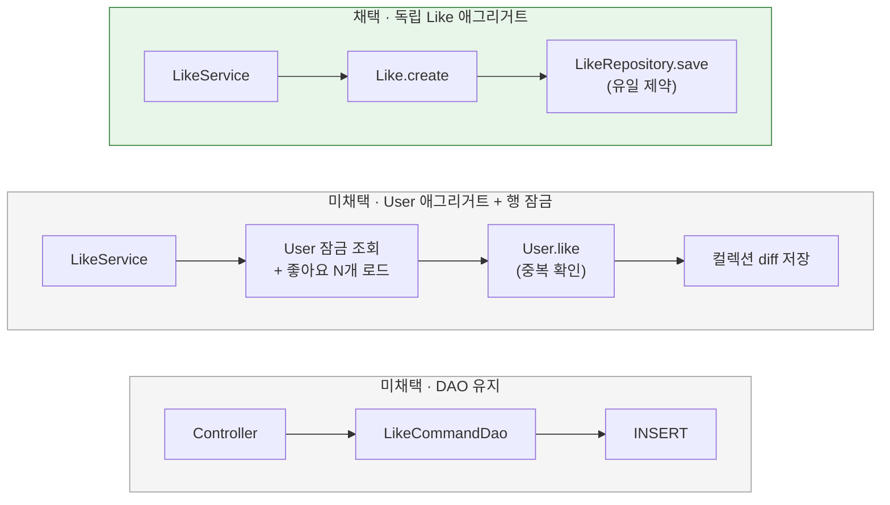

# 좋아요의 도메인 구조

[← 전체 선택 현황](total_trade_off.md)

## 판단할 문제

좋아요 쓰기는 week2부터 도메인 모델 없이 `LikeController` → `LikeCommandDao`(JdbcClient)로 처리했다. 다른 쓰기는 모두 UseCase → 도메인 → Repository를 거친다.
JDBC를 쓰기 경로에서 걷어내면서 좋아요를 어떤 도메인 구조에 둘지 정해야 한다.
판단 기준은 요청당 비용, "같은 사용자·상품의 좋아요는 하나"라는 규칙을 누가 보장하는지, 동시 요청의 안전성, 기존 쓰기 경로와의 일관성이다.

> **채택 — 독립 Like 애그리거트**
>
> `domain.shopping.model.Like(id, userId, productId, likedAt)`를 루트로 두고 `LikeRepository`와 등록·취소 UseCase를 둔다.
> 유일성은 DB 제약 `uk_product_likes_user_product`가 보장하고, 도메인은 생성 시 값 검증만 맡는다.
> 요청당 비용은 O(1)이다. 대신 "한 사용자당 한 번"이라는 규칙이 도메인 코드에서 드러나지 않고 DB 제약에 기대는 것을 감수한다.

## 흐름 비교

## 장단점 비교

| 기준 | 독립 Like 애그리거트 | User 애그리거트 + 사용자 행 잠금 | User 애그리거트, 잠금 없음 | DAO 유지 |
|---|---|---|---|---|
| 요청당 비용 | INSERT·DELETE 1회 | 잠금 1회 + 좋아요 N개 로드·변환 + diff 저장 | 좋아요 N개 로드·변환 + diff 저장 | INSERT·DELETE 1회 |
| 유일성 보장 | DB 제약 | 도메인 확인 + 잠금으로 순서 보장 | 도메인 확인, 경쟁 시 DB 제약 위반 | DB 제약 |
| 동시 중복 요청 | 저장 방식에서 흡수([02](02-like-duplicate.md)) | 직렬화되어 안전 | 뒤 요청이 500, 멱등 200과 충돌 | 예외 catch 후 재확인 |
| 규칙의 가시성 | 도메인에 드러나지 않음 | `User.like`에 드러남 | `User.like`에 드러남 | 드러나지 않음 |
| 쓰기 경로 일관성 | UseCase → 도메인 → Repository | 같음 | 같음 | Controller → DAO 예외 경로 |
| 애그리거트 크기 | 작음 | 좋아요가 계속 늘어나는 컬렉션, 이후 User 기능과 잠금·로딩 비용을 공유 | 같음 | — |

## 옵션별 판단

> **채택 — 독립 Like 애그리거트:** week3-2의 목적(비용 절감)과 맞고, 사용자가 판단한 "유일성은 제약 조건으로 충분"과도 맞는다. 쓰기 경로도 UseCase로 통일된다. Like는 id·likedAt·`restore`까지 두어 다른 도메인 모델과 모양을 맞춘다. 지금은 Like를 도메인으로 불러오는 경로가 없다.

> **미채택 — User 애그리거트 + 사용자 행 잠금:** 사용자가 먼저 제안한 구조다. 규칙의 주인이 사용자라는 점은 자연스럽다. 그러나 도메인과 JPA 엔티티를 매퍼로 분리한 구조에서는 지연 로딩의 이점이 없다. 그래서 좋아요 한 번에 그 사용자의 좋아요 전체를 불러와야 하고, 도메인 확인을 믿으려면 User 행 잠금까지 필요하다. 비용을 줄이려는 이번 작업의 방향과 반대라서 채택하지 않았다.

> **미채택 — User 애그리거트, 잠금 없음:** 같은 요청이 동시에 두 번 들어오면 두 번 모두 "없음"으로 판단한다. 뒤 요청은 DB 제약 위반으로 실패하므로 멱등 200 계약을 지키지 못한다.

> **미채택 — DAO 유지:** 변경 범위는 가장 작다. 하지만 쓰기 중 유일하게 UseCase를 거치지 않는 예외 경로가 남는다.

## 구현 후 조정 — UseCase 형식

처음 구현에서는 `RegisterLikeUseCase.register(long, long)`과 `CancelLikeUseCase.cancel(long, long)`으로 만들었다. `LikeService` 하나가 두 UseCase를 구현하는데, 둘 다 `execute(long, long)`이면 시그니처가 겹치기 때문이다.
다른 UseCase는 모두 `execute(XxxCommand)` 형식이므로 사용자 판단에 따라 `LikeCommand.Register`·`LikeCommand.Cancel` record를 추가하고 `execute(LikeCommand.Register)`·`execute(LikeCommand.Cancel)`로 맞춘다. `BrandCommand`와 같은 방식이다.

## 남은 사항

~~집계 결정에 따라 `LikeRepository.save`가 "새로 저장했는지"를 알려줘야 할 수 있다.~~ → 해소: [08번](08-like-insert-detection.md)에서 `boolean save`·`boolean delete`로 결정했다.
