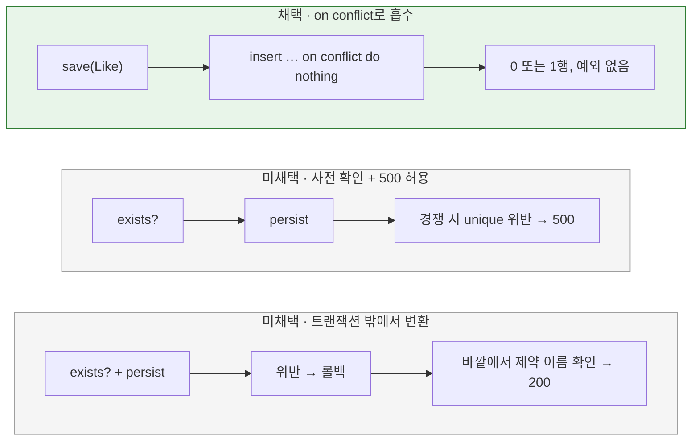

# 좋아요 중복 등록·취소 처리

[← 전체 선택 현황](total_trade_off.md)

> **후속 변경:** 좋아요 집계를 delta 방식으로 바꾸며 "실제로 새로 들어갔는지"를 알아야 해서, 등록 SQL은 [08번](08-like-insert-detection.md)의 native `INSERT IGNORE` + `boolean` 반환으로 대체된다. 멱등 200 계약과 취소 방식(JPQL delete, 이제 `boolean` 반환)은 유지한다. 아래는 R03 초기 결정의 기록이다.

## 판단할 문제

지금 등록은 `EXISTS` → `INSERT` → 중복 예외를 catch한 뒤 재확인하는 3단계다.
JPA에서는 persist 중 unique 위반이 나면 트랜잭션이 rollback-only로 표시되므로, 예외를 잡고 계속 진행하는 방식을 그대로 옮길 수 없다.
중복 등록과 없는 좋아요 취소는 모두 200을 반환한다는 멱등 계약을 유지해야 하고, 같은 요청이 동시에 들어와도 오류가 나면 안 된다.

> **채택 — Repository `save`가 HQL `insert … on conflict do nothing`으로 흡수, 취소는 JPQL delete 1회**
>
> Service는 미리 확인하지 않고 `likeRepository.save(Like.create(userId, productId))`를 호출한다.
> 구현은 HQL insert 한 번이며, 중복이면 아무 행도 바뀌지 않는다. 기존 행의 `created_at`도 유지된다.
> 취소는 `delete from LikeJpaEntity where userId = :userId and productId = :productId` 한 번이며, 없으면 0건이 지워진다.
> 대신 on conflict를 MySQL SQL로 바꾸는 Hibernate 방언의 동작에 의존하는 것을 감수한다.

## 흐름 비교



## 장단점 비교

| 기준 | on conflict로 흡수 | 사전 확인 + 500 허용 | 트랜잭션 밖 변환 |
|---|---|---|---|
| 쿼리 수 (등록) | 1 | 2 | 2 (경쟁 시 롤백 포함) |
| 동시 중복 요청 | 예외 없음, 200 | 뒤 요청 500 | 200, 예외로 흐름 제어 |
| 멱등 계약 | 유지 | 경쟁 시 깨짐 | 유지 |
| 의존 | Hibernate 6.6 HQL on conflict의 MySQL 방언 변환 | 표준 JPA | 표준 JPA + 제약 이름 문자열 |
| 테스트 부담 | 통합 테스트로 중복 1회 확인 | 같음 | 경쟁을 재현해야 검증 가능 |

| 기준 | 취소: JPQL delete 1회 | 취소: 조회 후 삭제 |
|---|---|---|
| 쿼리 수 | 1 | 2 |
| 없는 좋아요 | 0건 삭제, 자연스럽게 멱등 | 조회 결과로 분기 |
| 도메인 관여 | 없음 (취소에는 도메인 규칙이 없음) | Like를 거침 |

## 옵션별 판단

> **채택 — on conflict로 흡수:** 사용자가 판단한 "제약 조건으로 충분"을 가장 적은 비용으로 구현한다. 도메인이 중복을 확인하지 않으므로 경쟁 창도 생기지 않는다. `Repository.save`의 반환은 `void`다. HQL insert는 생성 id를 돌려주지 않고, 저장 후 다시 조회하면 쿼리가 1회 늘기 때문이다. 메서드 이름은 다른 Repository와 맞춰 `save`로 하고, 중복을 무시한다는 점은 계약 주석으로 알린다.

> **미채택 — 사전 확인 + 500 허용:** 데이터는 제약이 지키지만, 드물게 들어오는 동시 중복 요청이 500이 되어 멱등 계약에 예외가 생긴다.

> **미채택 — 트랜잭션 밖에서 변환:** 표준 JPA만 쓰지만, 제약 이름 문자열에 의존하고 예외로 정상 흐름을 만든다.

> **채택 — 취소는 JPQL delete 1회, 상품 확인 없음:** 삭제된 상품의 좋아요도 취소할 수 있고, 없는 상품을 취소해도 200이라는 기존 계약을 유지한다.

> **유지 — 멱등 계약:** 중복 등록에 409를 돌려주는 방식은 API 계약 변경이라 week3-2 범위에서 제외했다.

## 남은 사항

- ~~HQL on conflict의 MySQL 동작 확인~~ → 해소. Hibernate가 생성한 SQL은 다음과 같다.
  ```sql
  insert into product_likes(user_id,product_id,created_at) values (?,?,?) as excluded(user_id,product_id,created_at)
  on duplicate key update user_id=product_likes.user_id
  ```
  중복이면 값이 바뀌지 않는 갱신이 되고, 통합 테스트에서 행 1개와 `created_at` 유지를 확인했다. 대체안은 필요 없다.
- `on duplicate key update`는 `uk_product_likes_user_product`뿐 아니라 **모든 유일 키 충돌**에 반응한다. 지금 `product_likes`의 유일 키는 PK(IDENTITY)와 이 제약뿐이라 문제가 없다. 유일 키를 추가할 때는 이 동작을 다시 확인한다.
