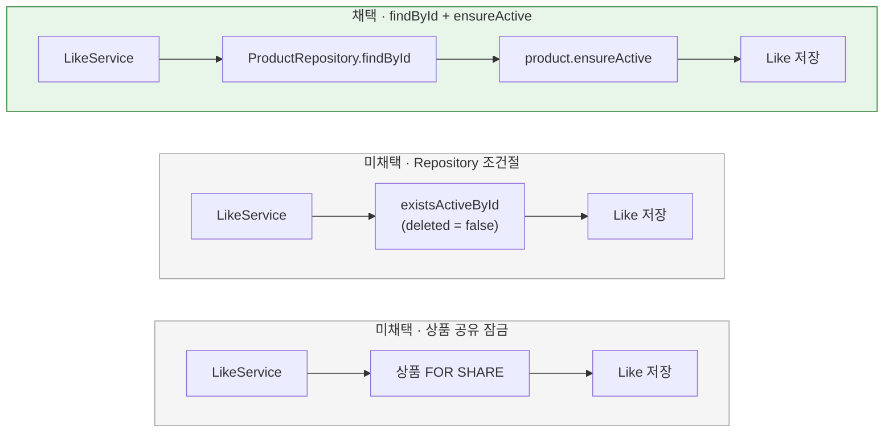

# 좋아요 등록 시 활성 상품 확인

[← 전체 선택 현황](total_trade_off.md)

## 판단할 문제

지금은 `LikeController`가 `existsActiveProduct`(readOnly 트랜잭션 ①)와 `register`(트랜잭션 ②)를 따로 호출한다.
①과 ② 사이에 상품이 삭제되면 삭제된 상품에 좋아요 행이 생긴다.
그래도 내 좋아요 목록은 `deleted = false`로 거르고, 취소도 되므로 실제 피해는 쓰이지 않는 행 하나다.
UseCase를 도입하면서 확인을 어디서, 어떤 방식으로 할지 정해야 한다.

> **채택 — Service가 `productRepository.findById` 후 `product.ensureActive()`, 같은 트랜잭션, 잠금 없음**
>
> 상품이 없으면 `ApplicationException(PRODUCT_NOT_FOUND)`, 삭제된 상품이면 `DomainException(DELETED_PRODUCT)`를 던진다. 둘 다 `ApiErrorMapper`에서 `ErrorType.NOT_FOUND`로 바뀌어 응답은 404, 에러 코드 `"Not Found"`로 기존과 같다.
> "활성 상품" 규칙은 `Product.ensureActive` 한 곳에만 둔다. `OrderService`와 같은 방식이다.
> 구현 중 `PRODUCT_NOT_FOUND`로 한 번 되돌렸다가 다시 이 결정으로 돌아왔다. 경위는 아래 [구현 후 조정](#구현-후-조정--product_not_found로-되돌렸다가-철회)에 남긴다.
> 대신 EXISTS보다 조금 무거운 PK 조회와 도메인 변환 비용, 잠금이 없어 남는 삭제 경쟁을 감수한다.

## 흐름 비교

## 장단점 비교

| 기준 | findById + ensureActive | Repository 조건절 (`existsByIdAndDeletedFalse`) | 도메인 `LikePolicy` | `Like.create(userId, product)` | 상품 공유 잠금 |
|---|---|---|---|---|---|
| 비용 | PK 조회 + 도메인 변환 | EXISTS 1회 | PK 조회 + 변환 | PK 조회 + 변환 | 잠금 조회 |
| 규칙 위치 | `Product.ensureActive` 한 곳 | 도메인과 쿼리 두 곳 | 한 곳 (Policy가 위임) | 한 곳 | 한 곳 |
| 새 코드 | 없음 | Repository 메서드 + JPA 메서드 | 한 줄짜리 Policy 클래스 | Like 팩토리 변경 | 잠금 메서드 |
| 컨텍스트 의존 | application이 mall 도메인 사용 (`OrderService` 선례) | 같음 | shopping policy → mall 모델 (`OrderConfirmationPolicy` 선례) | shopping **모델**이 mall 모델에 의존 (선례 없음) | 같음 |
| 삭제 경쟁 | 허용 | 허용 | 허용 | 허용 | 차단, 대신 주문 확정·재고 설정과 경합 |

## 옵션별 판단

> **채택 — findById + ensureActive:** 사용자 판단이다. 새 Repository 메서드나 클래스 없이 기존 조회와 도메인 규칙을 재사용한다. 비용 차이는 PK 한 행 조회 수준이다.

> **미채택 — Repository 조건절:** 가장 가볍지만, 사용자가 원하지 않았다. `ProductRepository.existsActive`를 추가하고 구현체에서 `existsByIdAndDeletedFalse`를 쓰는 방식이다. "활성"의 정의가 도메인과 쿼리 두 곳에 생긴다.

> **미채택 — 도메인 `LikePolicy`:** 규칙에 이름이 붙고 단위 테스트가 쉬워지지만, `ensureActive` 한 줄을 감싸는 클래스가 하나 늘어난다.

> **미채택 — `Like.create(userId, product)`:** 기존 코드에서 컨텍스트를 넘는 것은 Policy뿐이고, 모델은 원시값만 받는다(`OrderItem.create`). 이 관례를 깨고 shopping 모델이 mall 모델에 의존하게 된다.

> **미채택 — 상품 공유 잠금:** 쓰이지 않는 행 하나를 막으려고 인기 상품의 좋아요와 주문 확정이 서로 기다리게 만드는 것은 비용이 크다.

## 구현 후 조정 — PRODUCT_NOT_FOUND로 되돌렸다가 철회

**경위**

1. 첫 구현(`ensureActive`) 후 "삭제된 상품이면 응답 본문의 에러 코드가 `PRODUCT_NOT_FOUND`에서 `DELETED_PRODUCT`로 바뀐다"는 보고가 있었다. 코드로 확인하지 않은 채 사용자에게 전달했다.
2. 사용자는 API 계약을 바꾸지 않는다는 전제에 따라 `PRODUCT_NOT_FOUND`로 되돌리기로 했고, Service가 `isDeleted()`로 직접 확인하도록 바꿨다(`ead09de`).
3. 이후 E2E에 응답 코드 단언을 추가하면서 확인해 보니 전제가 틀렸다. 응답 본문의 `errorCode`는 도메인 코드 이름이 아니라 `ApiErrorMapper`가 바꾼 `ErrorType`의 코드다.

| 항목 | 기존 (`LikeController` + JDBC) | `ensureActive` 구현 |
|---|---|---|
| 예외 | `ApplicationException(PRODUCT_NOT_FOUND)` | `DomainException(DELETED_PRODUCT)` |
| `ApiErrorMapper` 결과 | `ErrorType.NOT_FOUND` | `ErrorType.NOT_FOUND` |
| HTTP 상태 / 응답 `errorCode` / 메시지 | 404 / `"Not Found"` / 상품을 찾을 수 없습니다. | 404 / `"Not Found"` / 상품을 찾을 수 없습니다. |

4. 응답 계약은 바뀐 적이 없으므로 되돌린 이유가 사라졌다. 사용자 판단에 따라 `ensureActive`로 다시 돌아왔다(`872510a`).

> **채택 — `ensureActive` 유지:** 응답 계약이 같으므로, 규칙을 한 곳에 두는 원래 결정의 장점을 버릴 이유가 없다.

> **철회 — `PRODUCT_NOT_FOUND`로 되돌리기:** 틀린 전제(응답 코드 변경)에서 나온 조정이었다. 삭제 여부 판단만 두 곳에 생긴다.

**교훈:** 응답 계약 변화를 주장할 때는 예외 타입이 아니라 실제 응답 본문(`ApiErrorMapper`를 거친 결과)으로 확인한다. `LikeApiE2ETest`의 삭제된 상품 케이스에 추가한 `errorCode == "Not Found"` 단언이 이 계약을 지킨다. 도메인 코드의 구분은 `LikeServiceTest`가 검증한다.
