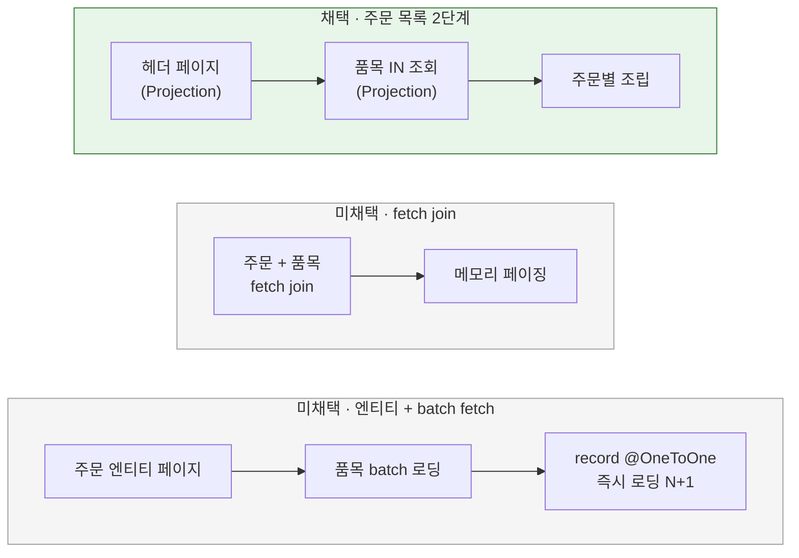
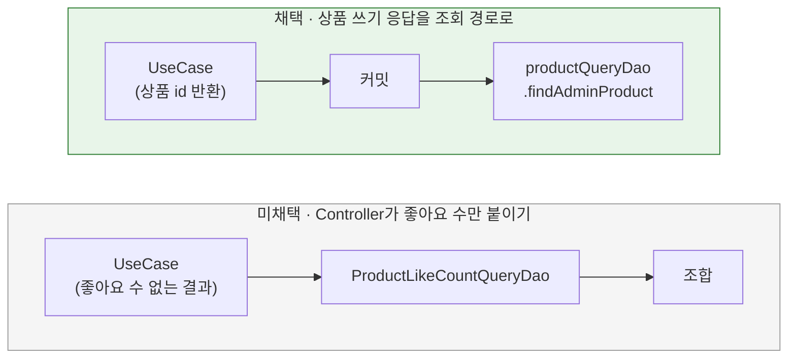

# 조회 DAO의 QueryDSL 전환 방식

[← 전체 선택 현황](total_trade_off.md)

## 판단할 문제

JdbcClient 조회 DAO 6개를 QueryDSL로 옮긴다.
- 단순 조회: Brand, ProductLikeCount, Wallet, User. User는 `@XUserId` resolver가 모든 요청에서 호출한다.
- 조인·페이징 조회: Order(헤더 페이지 → 품목 `IN` 2단계), Like(4개 테이블 조인).

결과를 객체에 담는 방식, 중간 Row의 사용, 주문 목록 조회 구조, 이름, 테스트, 커밋 단위를 정해야 한다.
전환하면서 쓰기 Service인 `ProductService`가 조회 계약 `ProductLikeCountQueryDao`에 의존하는 구조도 드러나 함께 다룬다.
판단 기준은 기존 응답 계약 유지, 계층 규칙, 쿼리 수, 기존 QueryDSL 코드(`QueryDslProductQueryDao`)와의 일관성이다.

> **채택 — `Projections.constructor` + 필요할 때만 Row, 주문 목록 2단계 유지, `QueryDsl*QueryDao`, 상품 쓰기 응답은 조회 경로로 다시 읽기**
>
> 전환 대상은 5개다(ProductLikeCount 제거). 기존 조회 통합 테스트는 이름만 바꾸고 기대값은 유지하며, 커밋은 컨텍스트별로 나눈다.
> 대신 생성자 Projection의 인자 순서·타입 오류가 컴파일이 아니라 실행 시점에 드러나는 것과, 상품 쓰기 응답을 커밋 뒤 별도 트랜잭션에서 읽는 것을 감수한다.

## 흐름 비교

## 장단점 비교

| 주제 | 채택 | 미채택 |
|---|---|---|
| Projection | **`Projections.constructor`**: 기존 코드와 같고 record와 잘 맞음. application View가 QueryDSL을 몰라도 됨. 인자 오류는 실행 시점에 드러남 | `@QueryProjection`: 컴파일 시점 검사. View에 붙이면 application이 QueryDSL에 의존. Tuple 직접 매핑: RowMapper처럼 장황함 |
| Row | **필요할 때만**: 필드가 1:1이면 View를 바로 만듦(Brand, Wallet, User). 중첩 View·변환·여러 View가 필요한 경우만 Row(Order의 `OrderHeaderRow`·`OrderItemRow`, Like) | 항상 Row: 단순 DAO에도 record가 늘어남. 항상 View 직접: 여러 View를 만드는 주문 헤더에서 어색함 |
| 주문 목록 | **2단계 유지**: 페이징은 DB에서, 쿼리 수는 페이지 크기와 무관하게 일정(COUNT·헤더·품목 3회) | fetch join: 컬렉션 페이징을 메모리에서 수행(HHH90003004). 엔티티 + batch fetch: 역방향 `@OneToOne` 즉시 로딩으로 N+1, 영속성 컨텍스트를 거침 |
| 이름 | **`QueryDsl*QueryDao`**: 기존 `QueryDslProductQueryDao`와 같은 규칙. 남는 `Jdbc*`(집계)와 구분됨 | `*QueryDaoImpl`: 기존 클래스까지 바꿔야 일관됨 |
| 상품 쓰기 응답 | **UseCase는 상품 id만 반환, Controller가 `findAdminProduct`로 응답 생성**: 쓰기가 조회 계약에 의존하지 않음. `ProductLikeCountQueryDao`·`JdbcProductLikeCountQueryDao`·`ProductResult`·`AdminProductView.from` 제거. 조회 경로가 하나로 합쳐짐 | Controller가 좋아요 수만 붙이기: DAO 하나를 전환해 남겨야 하고 응답 조합이 둘로 나뉨. 수정 응답에서 좋아요 수 제거: API 계약 변경 |
| 테스트 | **기존 테스트 이름만 변경, 기대값 유지**: Order·Wallet·Like·User 통합 테스트는 이름만 바꿈. Brand는 `BrandApiE2ETest`, 상품 쓰기 응답은 `ProductApiE2ETest`·관리자 E2E가 계약을 지킴. 새 테스트 없음 | 모든 DAO에 통합 테스트 추가: 테스트가 늘어남 |
| 커밋 | **컨텍스트별**: 상품 쓰기 응답 정리(선행) → mall(Brand) → pay(Wallet) → shopping(User, Like) → ordering(Order) | DAO별 6개, 한 번에 |

## 옵션별 판단

> **채택 — `Projections.constructor`, 필요할 때만 Row:** 기존 QueryDSL 코드와 같은 방식이고 계층 규칙을 지킨다. 엔티티를 조회하지 않고 Projection으로만 만들어, 역방향 `@OneToOne`(주문 → 주문 기록)의 즉시 로딩과 영속성 컨텍스트 관리 비용을 피한다.

> **채택 — 주문 목록 2단계 유지:** 지금 구조가 이미 페이징과 쿼리 수 면에서 맞다. 도구만 바꾼다.

> **채택 — 상품 쓰기 응답을 조회 경로로 다시 읽기:** 사용자 판단이다. 쓰기 Service가 조회 계약에 기대던 의존이 사라지고, 전환할 DAO도 하나 줄어든다. 응답은 쓰기 트랜잭션이 커밋된 뒤 readOnly 트랜잭션에서 읽으므로 방금 쓴 값을 그대로 본다. 생성·수정·재고 설정 직후에는 상품과 브랜드가 모두 활성이므로 `findAdminProduct`의 삭제 필터에 걸리지 않는다. 다만 커밋과 조회 사이에 삭제되면 404가 날 수 있는데, 이 극단적인 경우는 허용한다. 브랜드 활성 확인(`brand.ensureActive`)은 업무 규칙이므로 Service에 남긴다.

> **미채택 — Controller가 좋아요 수만 붙이기:** 쓰기와 조회의 의존은 끊기지만, 좋아요 수 단건 DAO를 전환해 남겨야 하고 응답 조합 경로가 둘이 된다.

> **채택 — 테스트는 이름만 변경:** 사용자가 가벼운 테스트를 원했다. 전환 전후 결과가 같다는 것은 기존 기대값이 그대로 통과하는 것으로 확인한다.

## 테스트 코드의 JdbcClient 허용 (6번)

> **채택 — 테스트에서는 허용:** 테스트의 데이터 준비·검증용 JdbcClient는 운영 코드의 접근 방식과 상관없이 DB 상태를 직접 확인하는 도구로 본다. 트랜잭션이 끝난 뒤 DB를 다시 조회한다는 3주차 검증 기준과도 맞고, 17개 파일을 바꾸지 않아도 된다.

> **미채택 — 테스트도 JPA·QueryDSL로:** 검증 코드가 검증 대상과 같은 경로를 타게 된다. 새 테스트만 금지하는 방식은 기준이 둘로 나뉜다.

## 남은 사항

`QueryDslProductQueryDao`의 좋아요순 정렬·`COUNT` 비용은 R04에서 다룬다.
