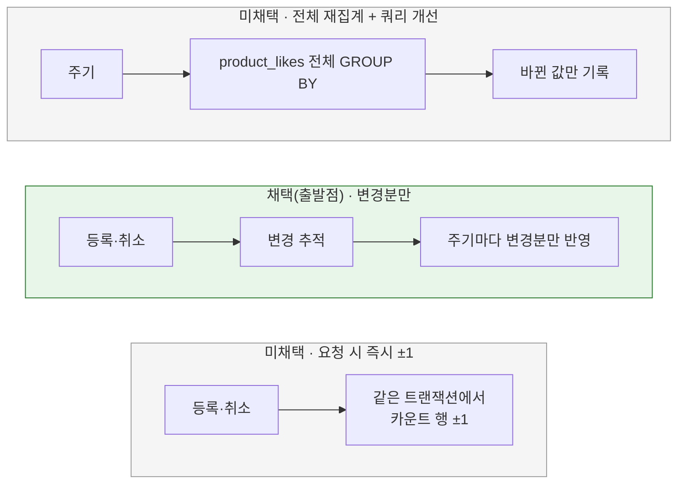

# 좋아요 수 집계 전략

[← 전체 선택 현황](total_trade_off.md)

## 판단할 문제

좋아요 수(`product_like_counts.like_count`)는 상품 목록·상세의 숫자와 좋아요순 정렬에 쓰인다.
지금은 스케줄러가 10초마다 한 트랜잭션에서 아래 두 SQL을 실행한다(`JdbcLikeCountAggregationDao`).

1. `UPDATE product_like_counts SET like_count = 0` — 모든 카운트 행 초기화
2. `INSERT INTO product_like_counts … SELECT product_id, COUNT(*) FROM product_likes GROUP BY product_id ON DUPLICATE KEY UPDATE …` — 좋아요 전체 재집계

문답 중 확인한 비용은 세 가지다.

- **변경이 없어도 전체 비용:** 한 주기 비용이 전체 좋아요 행 수에 비례하고, 매번 모든 카운트 행에 쓴다.
- **좋아요 쓰기 차단:** MySQL 기본 격리 수준(REPEATABLE READ)에서 `INSERT … SELECT`는 원본 `product_likes` 행에 공유 잠금을 건다. 집계가 끝날 때까지 좋아요 등록·취소가 기다린다. 초기화 UPDATE는 카운트 행 전체를 잠가 인기순 조회와도 경합한다.
- **상품별 인덱스 부재:** `product_likes`에는 `(user_id, product_id)` 유니크 키와 `(user_id, created_at, product_id)` 인덱스만 있다. 상품 하나를 다시 세는 것도 전체 스캔이 된다.

판단 기준으로 규모 가정(좋아요 수백만 건, 인기 상품 편중), 반영 지연 허용 범위, 사용자 요청 경로의 비용·잠금, 정확성과 복구 가능성을 합의했다.

> **채택 — 변경분만 반영하는 방식, 반영 지연 허용**
>
> week2 계약(좋아요 여부·목록은 즉시, 숫자·인기순은 집계 후)을 유지하고, 지연은 지금(10초)보다 느슨해도 된다고 합의했다.
> 집계 비용이 전체 데이터가 아니라 변경량에 비례하도록 바꾸고, 집계가 좋아요 쓰기를 막는 문제도 이번에 해소한다.
> 구체적인 변경 추적·감지·반영 방식은 [07](07-like-change-tracking.md)·[08](08-like-insert-detection.md)·[09](09-like-count-flush.md)에서 정했다.
> 결과적으로 "변경된 상품 재집계"에서 출발해 "메모리 증감분(delta) 누적"으로 좁혀졌다.

## 흐름 비교

## 장단점 비교

| 기준 | 전체 재집계 + 쿼리 개선 | **변경분만 반영** | 요청 시 즉시 ±1 |
|---|---|---|---|
| 한 주기 비용 | 전체 좋아요 수에 비례 | 변경량에 비례 | 스케줄러 없음 |
| 반영 시점 | 주기 지연 | 주기 지연 | 즉시 |
| 사용자 요청 경로 | 영향 없음 | 변경 기록만 추가 | 카운트 행 잠금 추가 |
| 인기 상품 편중 | 전체 스캔은 편중과 무관하게 큼 | 편중 상품도 변경량만큼 | 인기 상품 카운트 행 하나에 잠금이 몰림 |
| 좋아요 쓰기 차단 | `INSERT … SELECT` 공유 잠금 남음 | 해소 가능 | 해소되지만 대신 행 잠금 경합 |
| 정확성 | 항상 원본 기준 | 방식에 따라 다름([07](07-like-change-tracking.md)) | 새로 들어갔는지 정확히 알아야 함([08](08-like-insert-detection.md)) + 오차 보정 장치 필요 |
| 변경 범위 | 가장 작음 | 중간 | 중간 |

## 함께 고민한 내용

- **반영 지연:** 선택지는 현행 유지 / 즉시 반영 / 더 느슨하게였다. 사용자는 "더 느슨해도 됨(예: 1분)"을 골랐다. 즉시 반영이 필요 없으므로 요청 시 ±1(C)을 택할 이유가 약해졌다.
- **규모 가정:** "좋아요 수백만, 인기 상품 편중"으로 합의했다. 이 가정에서는 전체 스캔 비용과 인기 상품 행 잠금 경합이 모두 실제 문제가 된다. 두 비용을 모두 피하는 방향이 변경분 반영이다.
- **잠금 차단 해소:** 규모 가정 아래에서는 "짧게 끝나니 허용"하기 어렵다고 보고, 이번에 해소하기로 했다.
- **주기와 캐시:** 사용자가 "캐시를 쓰면 집계 주기를 짧게 해도 된다"고 제기했다. 변경분 방식은 비용이 시간이 아니라 변경량에 비례하므로 맞는 지적이다. 이 판단으로 주기를 60초에서 5초로 다시 줄였다([09](09-like-count-flush.md)).

## 옵션별 판단

> **채택 — 변경분만 반영:** 규모 가정에서 전체 스캔과 행 잠금 경합을 모두 피하고, 반영 지연 계약과도 맞는다.

> **미채택 — 전체 재집계 + 쿼리 개선:** 쓰기 양은 줄지만 전체 스캔과 좋아요 쓰기 차단이 남는다. 대신 "앱 시작 시 1회 전체 재집계"라는 보정 장치로는 계속 쓴다([09](09-like-count-flush.md)).

> **미채택 — 요청 시 즉시 ±1:** 즉시 반영이 필요 없다고 합의했고, 인기 상품 카운트 행 하나에 모든 요청의 잠금이 몰린다. 다만 "증감분으로 더한다"는 발상 자체는 메모리 누적 방식으로 이어졌다([07](07-like-change-tracking.md)).

## 남은 사항

좋아요 수의 저장 위치(`product_like_counts` 유지 또는 `products.like_count` 비정규화)는 R04에서 정한다. R03은 `product_like_counts`를 유지한다.
