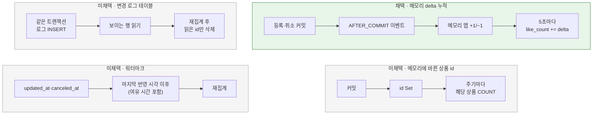

# 좋아요 변경 추적 방식

[← 전체 선택 현황](total_trade_off.md)

## 판단할 문제

변경분만 반영하려면([05](05-like-count-strategy.md)) 집계가 "무엇이 바뀌었는지" 알아야 한다.
어디에 무엇을 기록할지 정해야 한다.
기준은 사용자 요청 경로의 추가 비용, 인기 상품 행 잠금, 서버 재시작·비정상 종료 시 유실, 서버 여러 대, 롤백된 변경의 배제, 정확성이다.

> **채택 — 애플리케이션 메모리에 상품별 증감분(delta)을 누적**
>
> 좋아요 등록·취소가 **커밋된 뒤** 애플리케이션 이벤트(`@TransactionalEventListener(AFTER_COMMIT)`)로 상품별 +1/−1을 메모리 맵(`ConcurrentHashMap<Long, Long>`, `merge`로 누적)에 더한다.
> 5초마다 꺼내 DB에 `like_count = like_count + delta`로 반영한다([09](09-like-count-flush.md)).
> 사용자 요청 경로에 DB 쓰기가 늘지 않고, 인기 상품도 주기당 O(1)이다.
> 대신 실제로 새로 들어갔는지·지워졌는지를 정확히 알아야 하고([08](08-like-insert-detection.md)), 비정상 종료 시 반영 전 증감분(최대 한 주기)을 잃는 것을 앱 시작 시 전체 재집계로 보정하는 것을 감수한다.
> 구현은 Spring Cache 추상화 대신 `ConcurrentHashMap` 기반 컴포넌트로 한다.

## 흐름 비교

## 장단점 비교

| 기준 | **메모리 delta** | 메모리 상품 id Set | 변경 로그 테이블 | 카운트 행 dirty 플래그 | 워터마크 + 소프트 삭제 | 워터마크만 |
|---|---|---|---|---|---|---|
| 요청 경로 추가 비용 | 없음(메모리) | 없음(메모리) | INSERT 1회 | 카운트 행 UPDATE | 좋아요 모델·SQL 변경 | 없음 |
| 인기 상품 행 잠금 | 없음 | 없음 | 없음(항상 새 행) | **몰림** | 없음 | 없음 |
| 주기당 인기 상품 비용 | O(1) | 좋아요 전체 재COUNT | 재COUNT | 재COUNT | 재COUNT | 재COUNT |
| 취소 감지 | 됨 | 됨 | 됨 | 됨 | 소프트 삭제로 됨 | **안 됨**(DELETE된 행은 안 보임) |
| 커밋 순서 문제 | 없음(커밋 후 이벤트) | 없음 | 읽은 id만 지우면 없음 | 없음 | 여유 시간·겹침 처리 필요 | **있음** |
| 비정상 종료 | 최대 한 주기 유실 → 시작 시 전체 재집계 | 같음 | 유실 없음 | 유실 없음 | 유실 없음 | 유실 없음 |
| 서버 여러 대 | 서버마다 자기 delta 반영(합산이라 충돌 없음) | 서버마다 재집계(멱등) | 공유 | 공유 | 공유 | 공유 |
| 정확성 조건 | 새로 들어갔는지 정확히 알아야 함 | 원본 기준이라 항상 정확 | 원본 기준 | 원본 기준 | 원본 기준 | 취소 누락 |

## 함께 고민한 내용

1. **처음 제시한 세 안:** 변경 로그 테이블(추천) / 카운트 행 dirty 플래그 / 메모리 Set.
   - dirty 플래그는 인기 상품 행 하나에 요청 잠금이 몰려, 즉시 ±1안의 문제를 그대로 가져온다.
   - 메모리 Set은 재시작하면 유실되고, 커밋 전에 기록될 위험이 있다고 설명했다.
2. **사용자 제안 — "이전 배치가 어디까지 반영했는지 표시하면 안 되나?"(워터마크):** 별도 기록이 없어 가장 가볍지만, 현재 구조에서는 두 가지 구멍이 있다.
   - **취소가 안 보인다:** 좋아요 취소는 DELETE라서, "마지막 id·시각 이후 바뀐 행"을 찾아도 삭제된 행은 나오지 않는다.
   - **커밋 순서가 id·시각 순서와 다르다:** 트랜잭션 A가 id 10을 받고 B가 id 11을 받아 먼저 커밋했다. 이때 집계가 "11까지 반영"으로 표시하면, 나중에 커밋된 A(id 10)는 영원히 누락된다. `created_at`도 커밋 전에 정해지므로 같다.
   - 보완하려면 취소를 소프트 삭제(`canceled_at`, 재등록 시 되살림)로 바꾸고, `updated_at` 워터마크를 "지금 − 여유 시간"까지만 올리며 겹치는 구간은 멱등 재집계로 흡수해야 한다. 좋아요 모델·조회 조건·등록 SQL이 모두 바뀌고 취소된 행이 쌓인다.
   - 비교 과정에서 변경 로그 테이블의 약점도 보완했다. 처리 후 `id <= max`로 지우면 늦게 커밋된 행을 지울 수 있으므로 **실제로 읽은 id만 삭제**해야 한다.
3. **사용자 제안 — "스프링 캐시 사용하는 방식으로":** 세 가지 해석을 제시했고, 사용자는 1번을 확인했다.
   - ① 변경된 상품을 메모리에 모으기
   - ② 좋아요 수 조회 결과를 `@Cacheable`로 캐싱하기: 상세 숫자 읽기만 줄고, 좋아요순 정렬(DB 정렬)과 집계 비용은 그대로다.
   - ③ Redis 카운트: week3-2 범위에서 캐시 서버 도입을 제외했고, 정렬하려면 DB 동기화가 필요하다.
   - Spring Cache 추상화(`@Cacheable`, `Cache.get/put/evict`)는 메서드 결과 캐싱용이다. "모았다가 원자적으로 꺼내 비우기"에는 맞지 않아 구현은 `ConcurrentHashMap` 컴포넌트로 한다.
   - 여러 서버여도 각 서버가 자기가 본 변경만 반영하면 된다. 재집계는 멱등이고 delta는 합산이라 충돌하지 않는다.
   - 커밋 뒤에만 기록해야 롤백된 변경이 섞이지 않으므로 `AFTER_COMMIT` 이벤트를 쓴다.
4. **참고 자료 검토(사용자 제공 블로그, kdh0518.tistory.com/73):** Spring Cache + Redis로 좋아요/취소 시 Redis 카운트를 `INCR`/`DECR`하고, `@Cacheable`로 읽으며, 5분마다 스케줄러가 DB에 동기화하는 구조다.
   - 그 글이 해결한 문제("조회마다 COUNT")는 우리에게 이미 없다. 우리는 집계 테이블이 있다.
   - Redis가 전제이고, 로컬 메모리로 옮기면 비정상 종료 시 반영 전 증감분이 영구히 사라져 전체 재집계로 보정해야 한다.
   - 우리 등록은 멱등이라 요청마다 +1을 하면 중복 요청에서 숫자가 틀어진다.
   - 이 검토로 "증감분을 모아 더한다"는 발상을 메모리 버전으로 가져왔다.
5. **무엇을 모을지 — 바뀐 상품 id vs 증감분:**
   - id를 모아 다시 세는 방식은 항상 원본 기준이라 정확하다. 하지만 좋아요 100만 개인 인기 상품은 주기마다 인덱스 100만 건을 다시 센다. 주기를 짧게 할수록 부담이 커져 규모 가정과 맞지 않는다.
   - 증감분은 상품당 O(1)이라 짧은 주기에 맞는다. 대신 "실제로 바뀌었는지"를 정확히 알아야 한다([08](08-like-insert-detection.md)).
   - 둘을 함께 쓰는 안(평소엔 delta, 긴 주기로 재검증)도 제시했지만, 장치가 둘이라 채택하지 않았다.
6. **기록 방식:** 이벤트 + `AFTER_COMMIT` 리스너(채택)와 Service가 추적기를 직접 호출하고 `TransactionSynchronization.afterCommit`에 등록하는 안을 비교했다. 이벤트 방식은 좋아요 쪽이 집계를 몰라도 되고, 롤백되면 자동으로 빠진다.

## 옵션별 판단

> **채택 — 메모리 delta + AFTER_COMMIT 이벤트:** 요청 경로 비용과 행 잠금이 없고, 규모 가정의 인기 상품도 O(1)이며, 짧은 주기와 맞는다. 유실은 시작 시 전체 재집계로 보정한다.

> **미채택 — 메모리 상품 id Set:** 정확하지만, 인기 상품 재COUNT 비용이 주기마다 반복된다.

> **미채택 — 변경 로그 테이블:** 유실이 없고 정확하지만, 요청마다 INSERT가 늘고 로그 정리가 필요하다. 메모리 방식으로 결정되며 대체되었다.

> **미채택 — 카운트 행 dirty 플래그:** 인기 상품 행 잠금이 몰린다.

> **미채택 — 워터마크(+ 소프트 삭제):** 사용자 제안이다. 취소 감지와 커밋 순서 문제를 풀려면 좋아요 모델 전체를 바꿔야 한다. 워터마크만 쓰면 취소가 누락된다.

> **미채택 — 좋아요 수 `@Cacheable` 캐싱, Redis 카운트:** 집계 비용을 해결하지 못하거나 범위 제외 항목(캐시 서버)을 바꿔야 한다.

## 남은 사항

- 서버가 여러 대이고 그중 한 대가 재시작하면, 시작 시 전체 재집계가 **다른 서버의 반영 전 delta**(최대 한 주기)와 겹쳐 그만큼 이중 반영될 수 있다. 현재 단일 인스턴스 구성에서는 해당하지 않으며 한계로 기록한다([09](09-like-count-flush.md)).
- 정상 종료 시 남은 delta를 내보내지 않는다(사용자 결정). 다음 시작 시 전체 재집계가 맞춘다.
