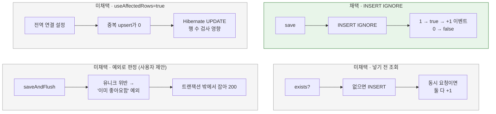

# 좋아요가 실제로 추가·삭제됐는지 감지

[← 전체 선택 현황](total_trade_off.md)

## 판단할 문제

delta 방식([07](07-like-change-tracking.md))은 **실제로 새 좋아요가 생겼을 때만** +1, **실제로 지워졌을 때만** −1을 해야 한다.

예를 들어 사용자 A가 상품 7의 좋아요를 두 번 누른다(더블클릭·재시도).
우리 API는 멱등이라 두 번째 요청도 200이고 DB 행은 1개 그대로다.
그런데 요청마다 +1을 하면 카운터가 2가 된다. 실제 1명인데 2로 표시된다.

그래서 등록 직후 "이번에 행이 진짜 추가됐나?"를 알아야 하고, DB가 돌려주는 "영향받은 행 수"로 판단한다.
취소는 DELETE가 실제로 지운 행 수(1 또는 0)를 정확히 돌려주므로 문제가 없다.
문제는 등록이다.

**R03 초기 등록 SQL의 한계.** [02](02-like-duplicate.md)에서 채택한 HQL `insert … on conflict do nothing`은 MySQL에서 다음 SQL로 실행된다.

```sql
insert into product_likes(user_id,product_id,created_at) values (?,?,?) as excluded(...)
on duplicate key update user_id=product_likes.user_id
```

MySQL은 이 SQL의 영향받은 행 수를 두 방식으로 셀 수 있다.

| 상황 | "바뀐 행" 기준 | "찾은 행" 기준 (MySQL JDBC 드라이버 기본값, `useAffectedRows=false`) |
|---|---|---|
| 새로 들어감 | 1 | 1 |
| 이미 있어 아무것도 안 바뀜 | 0 | **1** |

드라이버 기본값에서는 둘 다 1이라 구분할 수 없다.

> **채택 — 등록 SQL을 native `INSERT IGNORE`로 바꾸고, Repository가 `boolean`을 반환**
>
> `INSERT IGNORE`는 중복이면 행을 무시하고 영향받은 행 수 0을 돌려준다. 새로 들어가면 1이다. 드라이버 기본 설정에서도 동시 요청에서도 정확하다.
> 계약은 `boolean save(Like)`(새로 저장됐으면 true), `boolean delete(userId, productId)`(실제로 지웠으면 true)로 바꾸고, `LikeService`는 true일 때만 증감 이벤트를 발행한다.
> 대신 HQL을 MySQL 전용 native SQL로 바꾸는 것과, `IGNORE`가 중복 외 오류(NOT NULL 위반, 값 잘림 등)도 경고로 넘길 수 있다는 점을 감수한다. 이 테이블은 모든 컬럼을 값으로 채우고 FK가 없어 영향이 작다.
> 중복일 때 0이 나오는지는 통합 테스트로 확인한다. 예상과 다르면 구현을 멈추고 다시 문답한다.

## 흐름 비교



## 장단점 비교

| 기준 | **`INSERT IGNORE`** | 넣기 전 조회 | `useAffectedRows=true` | 예외로 판정 | 중복 시 값을 바꿔 2 받기 |
|---|---|---|---|---|---|
| 동시 중복 요청 정확성 | 정확 | 드물게 +2 오차 | 정확 | 정확(DB 제약이 판정) | 정확 |
| 영향 범위 | 좋아요 등록 SQL만 | 없음 | **앱 전체 연결** | 좋아요 쓰기 구조 | 좋아요 데이터 |
| SQL | native | HQL 유지 | HQL 유지 | 표준 JPA `persist` | HQL 수정 |
| 구조 | Repository `boolean` 반환 | 쿼리 1회 추가 | 설정 1줄 | 트랜잭션 없는 바깥 계층 + 예외 변환 + 제약 이름 확인 | 불필요한 컬럼 갱신 |
| 중복 요청 비용 | 쿼리 1회 | 쿼리 2회 | 쿼리 1회 | 예외 생성 + 트랜잭션 롤백 | 쿼리 1회 + 행 갱신 |

## 함께 고민한 내용

1. **처음 제시:** 드라이버 `useAffectedRows=true`(추천) / 넣기 전 조회.
2. **추천 철회 — `useAffectedRows=true`:** 영향 범위를 확인해 보니 이 설정은 JDBC URL의 전역 연결 설정이라 좋아요 쿼리에만 적용할 수 없다.
   - Hibernate는 엔티티 UPDATE 후 "1행이 영향받았는지"로 충돌을 감지하고, 0이면 다른 트랜잭션이 바꾸거나 지웠다고 보고 예외를 던진다.
   - "바뀐 행" 기준이 되면 값이 그대로인 UPDATE가 0을 돌려줘 정상 저장이 실패할 위험이 있다. 그래서 추천을 철회했다.
   - 현재 코드에서 update 반환값을 직접 쓰는 곳은 없었다.
3. **사용자 요청으로 쉬운 설명 재정리:** 두 번 누르는 상황 → 행 수로 판단해야 하는 이유 → "찾은 행" 기준이라 둘 다 1이 되는 문제 → 해결책 3가지 순서로 다시 설명했다.
   - ① `INSERT IGNORE`
   - ② 넣기 전 조회
   - ③ 드라이버 설정
   - 편법: 중복일 때 일부러 요청 시각 컬럼을 바꿔 "새로 1, 중복 2"로 구분
4. **사용자 제안 — "인프라에서 이미 존재한다고 오류를 내고, 애플리케이션에서 200으로 바꾸고, 그 오류 기준으로 값을 넣으면?":** DB 유니크 제약이 판정하므로 동시 요청에서도 정확하고, 롤백된 쪽은 `AFTER_COMMIT` 이벤트도 나가지 않는다. 대신 성립 조건이 세 가지다.
   - **트랜잭션 밖에서 잡아야 한다:** JPA에서 제약 위반이 나면 트랜잭션이 rollback-only가 된다. Spring Data 저장소 메서드도 `@Transactional`이라 예외가 빠져나오는 순간 바깥 트랜잭션까지 표시된다. `LikeService` 안에서 잡으면 커밋 때 `UnexpectedRollbackException`(500)이 되므로, 트랜잭션 없는 바깥 application 계층이 필요하다.
   - **제약 이름을 확인해야 한다:** `uk_product_likes_user_product` 위반만 "이미 좋아요함"으로 바꾸고 나머지 무결성 오류는 그대로 던진다.
   - **INSERT가 저장 호출 시점에 실행돼야 한다:** `saveAndFlush`를 쓴다(IDENTITY라 persist 즉시 INSERT되지만 명시).
   - 이는 [02](02-like-duplicate.md)에서 채택하지 않았던 "트랜잭션 밖에서 위반을 성공으로 변환"안이 정확한 감지라는 새 장점을 얻어 다시 올라온 것이다. 비교 후 사용자는 `INSERT IGNORE`를 골랐다.
5. **결과 전달 위치:** Repository가 `boolean`을 반환하고 Service가 이벤트를 발행(채택)하는 안과, Repository 구현이 행 수를 보고 직접 발행하는 안을 비교했다. 후자는 "좋아요 수가 바뀐다"는 업무 흐름이 인프라에 숨는다. [01](01-like-aggregate.md) 남은 사항에서 예상한 변화다.

## 옵션별 판단

> **채택 — `INSERT IGNORE` + `boolean` 반환:** 동시 요청에서도 정확하고 영향이 좋아요 등록 SQL에 한정된다. 구조가 가장 단순하다.

> **미채택 — 넣기 전 조회:** 드문 동시 중복에서 +2 오차가 생기고, 시작 시 전체 재집계 때까지 남는다.

> **미채택(추천 철회) — `useAffectedRows=true`:** 앱 전체 연결 설정이라 Hibernate의 UPDATE 행 수 검사와 충돌할 위험이 있다.

> **미채택 — 예외로 판정:** 정확하고 표준 JPA만 쓰지만, 트랜잭션 없는 바깥 계층·예외 변환·제약 이름 의존이 필요하고 중복 요청마다 롤백 비용이 든다.

> **미채택 — 중복 시 값을 바꿔 2 받기:** 구분을 위해 좋아요 데이터를 불필요하게 바꾸는 편법이다.

## 남은 사항

- 중복 `INSERT IGNORE`가 드라이버 기본 설정에서 0을 돌려주는지 통합 테스트로 확인한다. 1이 나오면 구현을 멈추고 다시 문답한다.
- [02](02-like-duplicate.md)의 채택안(HQL on conflict)은 이 결정으로 대체된다. 멱등 200 계약과 취소 방식은 그대로다.
