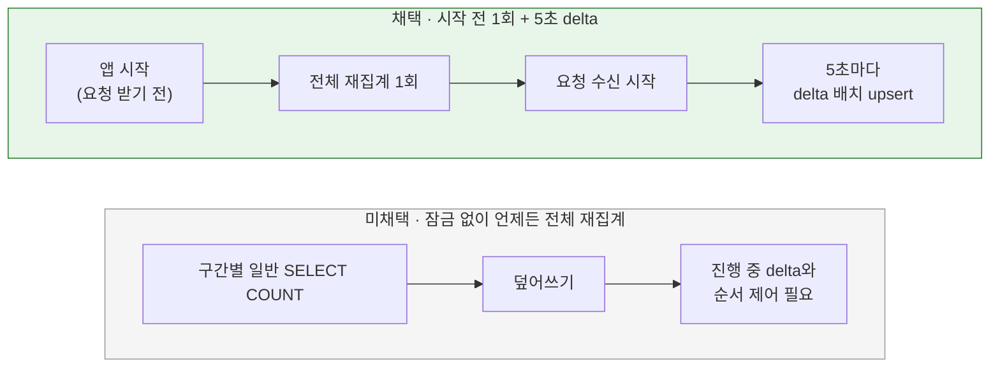

# 증감분 반영과 전체 재집계

[← 전체 선택 현황](total_trade_off.md)

## 판단할 문제

메모리에 모은 증감분([07](07-like-change-tracking.md))을 언제, 어떤 쿼리로 DB에 반영할지 정해야 한다.
반영이 실패하거나 서버가 종료될 때 어떻게 할지, 유실을 보정하는 전체 재집계를 언제 어떻게 돌릴지, 상품별 조회에 필요한 인덱스를 어떻게 만들지도 정한다.

> **채택 — 5초 주기 JDBC 배치 upsert, 실패 시 되돌려 재시도, 정상 종료 flush 없음, 트래픽 전 1회 전체 재집계, 유니크 키 순서 변경**
>
> - **반영:** 5초마다 메모리 맵을 상품별로 원자적으로 꺼낸다(`remove`). 그다음 `INSERT INTO product_like_counts (product_id, like_count) VALUES (:id, GREATEST(0, :delta)) ON DUPLICATE KEY UPDATE like_count = GREATEST(0, like_count + :delta)`를 JDBC 배치로 한 번에 보낸다. 카운트 행이 없는 상품도 처리되고 음수가 되지 않는다.
> - **실패:** 반영에 실패하면 꺼낸 값을 메모리에 다시 합쳐(`merge`) 다음 주기에 재시도한다.
> - **종료:** 정상 종료 때 남은 값은 내보내지 않는다. 다음 시작 시 전체 재집계가 맞춘다.
> - **전체 재집계:** 앱이 요청을 받기 전에 기존 SQL(0 초기화 + `INSERT … SELECT`)로 1회 실행한다. 10초 주기 전체 재집계는 없앤다.
> - **인덱스:** `product_likes` 유니크 키를 `(product_id, user_id)` 순서로 바꾼다.
>
> 대신 비정상 종료 시 최대 한 주기(5초)분을 다음 시작까지 잃는 것, 서버 여러 대일 때 재시작 서버의 전체 재집계와 다른 서버 delta가 겹칠 수 있는 것을 감수한다.

## 흐름 비교

## 장단점 비교

| 주제 | 채택 | 미채택 |
|---|---|---|
| 반영 주기 | **5초**: 비용이 변경량에 비례해 짧아도 부담이 작다. 비정상 종료 시 잃는 값도 최대 5초분이다 | 10초(현행): 같은 반영 시점. 60초: 처음 고른 느슨한 주기였으나 유실 범위가 커져 되돌렸다 |
| 반영 쿼리 | **JDBC 배치 upsert**: 배치 작업은 JDBC라는 기준에 맞고, 행이 없으면 생성, `GREATEST(0, …)`로 음수 방지 | JPA 상품별 조회+UPDATE: 상품 수만큼 왕복하고 배치 JDBC 기준과 어긋남 |
| 실패 처리 | **꺼낸 값을 다시 합쳐 재시도**: 값이 유실되지 않음 | 버리고 로그: 오차가 다음 전체 재집계까지 남음 |
| 정상 종료 | **flush하지 않음(사용자 결정)**: 코드가 줄고, 재시작하면 전체 재집계가 맞춘다 | 종료 직전 flush(`@PreDestroy`·`SmartLifecycle.stop`): 배포 시에도 값이 바로 반영됨 |
| 전체 재집계 시점 | **요청 받기 전 1회**: 메모리가 비어 있어 이중 반영이 없고, 막힐 요청도 없음. 기존 SQL 재사용 | 잠금 없이 언제든: 운영 중 실행 가능하나 delta와의 순서 제어가 복잡 |
| 인덱스 | **유니크 키 `(product_id, user_id)`로 순서 변경**: 인덱스 하나로 유일성과 상품별 COUNT를 모두 처리하고, 쓰기 시 유지할 인덱스가 늘지 않음. 사용자별 목록은 기존 `(user_id, created_at, product_id)` 사용 | `(product_id)` 인덱스 추가: 쓰기마다 유지 비용 +1 |

## 함께 고민한 내용

1. **주기 변화 — 60초 → 5초:** 처음에는 "더 느슨해도 된다"는 판단에 맞춰 "변경분 60초 + 시작 시 전체 1회"를 골랐다. 이후 사용자가 "캐시를 쓰면 주기가 짧아도 되겠다"고 제기했다. delta 방식은 비용이 변경량에 비례하므로 5초로 줄였다. 유실 범위도 함께 줄어든다.
2. **전체 재집계가 필요한 이유:** delta는 메모리에 있어 비정상 종료 시 반영 전 값이 사라진다. 원본(`product_likes`)을 처음부터 다시 세는 보정 장치가 필요하다.
3. **지금 SQL을 운영 중에 돌리면 생기는 문제 두 가지**
   - **좋아요 쓰기 차단:** `INSERT … SELECT`의 공유 잠금 때문이다([05](05-like-count-strategy.md)).
   - **delta와의 이중 반영.** 예를 들면 다음과 같다.
     - 09:00:00 A의 좋아요가 커밋되고 메모리 delta가 +1이 된다.
     - 09:00:01 전체 재집계가 A의 행을 포함해 101로 기록한다.
     - 09:00:05 delta +1이 반영되어 102가 된다. 실제는 101이다.
   - 그래서 **메모리가 비어 있고 요청이 없는 시점(시작 직후, 요청 받기 전)**에만 돌리기로 했다. 이 시점에는 잠금 차단도 문제가 되지 않아 기존 SQL을 그대로 쓴다.
4. **서버 여러 대 한계:** 서버 1이 재시작하며 전체 재집계를 돌릴 때 서버 2의 메모리에 반영 전 delta가 있으면, 그 delta가 재집계 결과에 이미 포함된 좋아요를 한 번 더 더할 수 있다(최대 한 주기분). 현재 단일 인스턴스라 한계로만 기록한다.
5. **정상 종료 flush:** 추천은 "종료 직전 한 번 더 반영"이었으나, 사용자는 "하지 않음"을 골랐다. 재시작하면 전체 재집계가 바로 맞추므로 단일 인스턴스에서는 결과가 같고 코드가 줄어든다.
6. **인덱스:** 상품별 재집계를 검토하며 `product_id`로 시작하는 인덱스가 없다는 것을 확인했다. delta 방식으로 바뀐 뒤에도 시작 시 전체 재집계의 `GROUP BY product_id`와 R04의 상품별 조회에 쓰이므로 유지한다. 운영 DB는 `ddl-auto: none`이라 스키마 변경을 따로 적용해야 한다(local·test는 `create`).
7. **요청 받기 전 시점:** Spring Boot는 컨텍스트 초기화 마지막에 웹 서버를 시작한다. 그래서 전체 재집계는 웹 서버가 시작되기 전(예: `SmartInitializingSingleton`)에 실행하고, `@Scheduled` delta 반영은 그 뒤에 시작된다. 기존 `scheduler.like-count.enabled`로 함께 켜고 끈다(test 프로필은 false).

## 옵션별 판단

> **채택 — 5초 JDBC 배치 upsert + 실패 시 재시도:** 인기 상품도 O(1)이고, 좋아요 쓰기를 막는 잠금이 없다. 실패해도 값을 잃지 않는다.

> **채택 — 요청 받기 전 1회 전체 재집계:** 이중 반영과 쓰기 차단이 생기지 않는 유일한 시점이라 기존 SQL을 그대로 쓸 수 있다.

> **미채택 — 잠금 없는 상시 전체 재집계:** 진행 중인 delta와의 순서 제어가 필요해 복잡하다.

> **미채택 — 정상 종료 flush:** 사용자 결정. 재시작 시 전체 재집계로 대체된다.

> **채택 — 유니크 키 순서 변경:** 인덱스를 늘리지 않고 상품별 조회를 지원한다.

## 남은 사항

- 서버 여러 대로 늘릴 때는 재시작 시 전체 재집계와 다른 서버 delta의 겹침을 다시 검토한다.
- 운영 DB의 유니크 키 순서 변경은 스키마 변경 절차가 필요하다(이번 범위에서는 엔티티 정의만 바꾼다).
