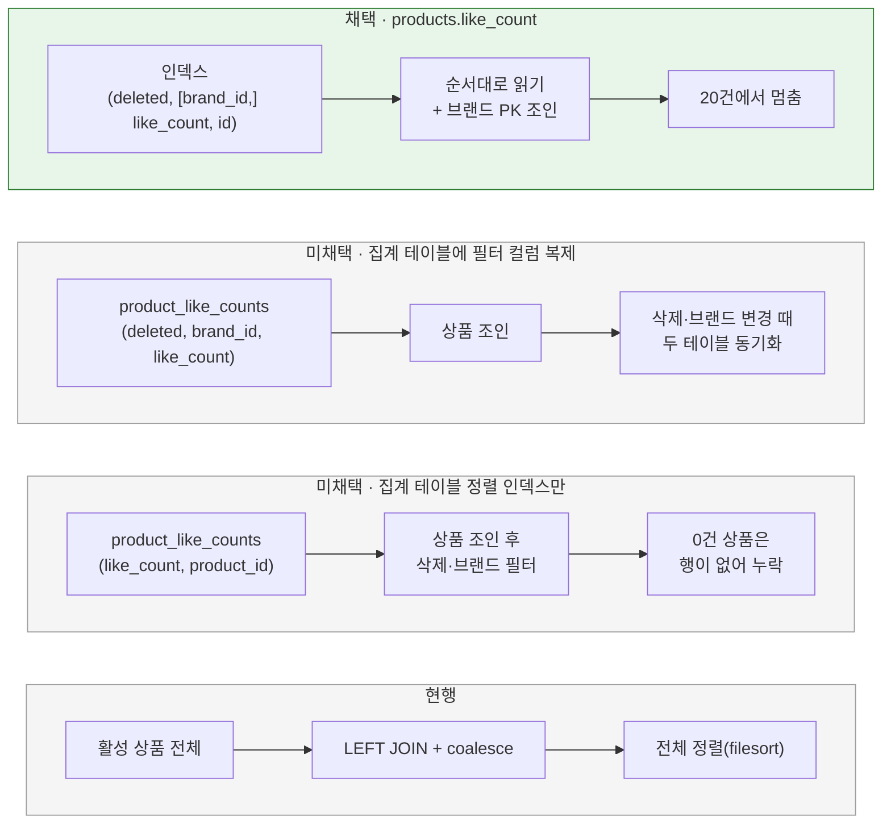

# 좋아요 수 저장 위치

[← 전체 선택 현황](total_trade_off.md)

## 판단할 문제

좋아요순 목록은 `product_like_counts`를 LEFT JOIN하고 `coalesce(like_count, 0) desc, id desc`로 정렬한다.
정렬 값이 다른 테이블의 계산식이라 어떤 인덱스로도 순서를 얻을 수 없고, MySQL은 활성 상품 전체를 읽어 조인·정렬한 뒤 20개만 쓴다.
인덱스 순서대로 읽다가 `limit`에서 멈추려면 정렬 값이 필터 컬럼(`deleted`, `brand_id`)과 같은 테이블·같은 인덱스에 있어야 한다.

규모 가정: 활성 상품 약 100만 건(Q1), 좋아요 수백만·인기 상품 편중(R03 [05](../../r03-jdbc-and-like-aggregation/trade_off/05-like-count-strategy.md)).

> **채택 — `products.like_count` 비정규화 + 복합 인덱스 2개, `product_like_counts` 제거, 엔티티는 읽기 전용 매핑**
>
> - **컬럼:** `products.like_count bigint not null default 0`. R03의 5초 반영과 시작 시 전체 재집계가 이 컬럼을 갱신한다([02](02-flush-and-recount.md)).
> - **인덱스:** `idx_products_deleted_like (deleted, like_count DESC, id DESC)`(브랜드 필터 없음), `idx_products_deleted_brand_like (deleted, brand_id, like_count DESC, id DESC)`(브랜드 필터).
> - **집계 테이블:** `product_like_counts`와 `ProductLikeCountJpaEntity`를 없앤다. 상품 목록·상세·관리자 조회와 내가 좋아요한 목록 모두 `products.like_count`를 읽어 LEFT JOIN이 사라진다.
> - **매핑:** `ProductJpaEntity`에 `@Column(name = "like_count", insertable = false, updatable = false, columnDefinition = "bigint not null default 0")`. JPA는 이 컬럼을 쓰지 않는다. 도메인 `Product`에는 두지 않는다.
>
> 대신 `products` 행을 JDBC 배치가 갱신하게 되어 주문 확정의 상품 잠금과 짧게 겹칠 수 있다([02](02-flush-and-recount.md)에서 잠금 순서로 대응). 인덱스가 2개 늘어 좋아요 반영마다 인덱스 항목 이동 비용이 생긴다.

## 흐름 비교

## 장단점 비교

| 기준 | **A. `products.like_count`** | B. 집계 테이블에 필터 복제 | C. 집계 테이블 정렬 인덱스만 |
|---|---|---|---|
| 좋아요순 첫 페이지 | 인덱스 순서로 20건 읽고 멈춤 | 인덱스 순서로 읽음 | 삭제·브랜드 조건을 인덱스로 거르지 못해 버려지는 행이 생김 |
| 브랜드 필터 | 전용 인덱스로 처리 | 가능 | 불가(상품 조인 후 필터) |
| 좋아요 0건 상품 | 기본값 0으로 자연스럽게 포함 | 모든 상품에 행이 있어야 함 | 모든 상품에 행이 있어야 함 |
| 동기화 부담 | 없음(값이 한 곳) | 상품 삭제·브랜드 이동 때 복제 컬럼 갱신 | 상품 생성 때 집계 행 생성 |
| 쓰기 경합 | `products` 행을 5초 반영이 갱신 → 주문 확정 잠금과 겹칠 수 있음 | 없음 | 없음 |

## 함께 고민한 내용

1. **R03 결정이 비정규화를 싸게 만들었다.** 좋아요 요청마다 `products`를 갱신했다면 인기 상품 행이 주문 확정의 `PESSIMISTIC_WRITE`와 계속 부딪혔을 것이다. R03에서 5초 배치 반영으로 바꿨기 때문에 한 상품 행은 5초에 최대 한 번만 갱신되어 경합이 짧은 대기 수준이다.
2. **집계 테이블을 남길지(Q4):** 두 곳 모두 갱신하면 값이 어긋날 수 있고 쓰기가 두 배다. 집계 테이블을 원본으로 두면 "어느 쪽이 기준인가"라는 규칙이 하나 더 생긴다. 좋아요 원본은 `product_likes`이고 `like_count`는 파생값이므로 파생값은 한 곳이면 충분하다고 보고 제거했다.
3. **JPA 덮어쓰기 함정(Q5):** 주문 확정이 재고를 차감하며 상품을 저장할 때, 엔티티가 `like_count`를 쓰는 컬럼으로 매핑돼 있으면 5초 반영이 올린 값을 로드 시점의 옛 값으로 덮어쓴다. `insertable = false, updatable = false`로 JPA가 이 컬럼을 쓰지 않게 막는다. 상품 생성 시에는 DB 기본값 0이 들어간다.
4. **매핑하지 않는 안을 버린 이유:** test·local은 `ddl-auto: create`라 엔티티에 없는 컬럼은 스키마에 생기지 않는다. 별도 DDL 스크립트를 관리해야 한다.
5. **도메인에 두지 않는 이유:** 좋아요 수는 상품의 업무 규칙(가격·재고·삭제)에 쓰이지 않는 조회용 집계값이다. 도메인 `Product`가 알면 덮어쓰기 문제가 그대로 남고 도메인 순수성도 흐려진다.
6. **정렬 규칙 유지:** 컬럼이 `not null default 0`이라 `coalesce` 없이도 "집계 없는 상품은 0" 규칙이 유지된다. 동점은 `id desc`로 인덱스의 마지막 컬럼과 같다.

## 옵션별 판단

> **채택 — A. `products.like_count` 비정규화:** 인덱스 하나로 필터·정렬·멈춤이 모두 가능한 유일한 안이다. 쓰기 경합은 R03의 5초 배치 덕분에 작다.

> **미채택 — B. 집계 테이블에 필터 컬럼 복제:** 사실상 `products`를 한 번 더 복제하는 것이고 상품 삭제·브랜드 변경 때 동기화가 필요하다.

> **미채택 — C. 집계 테이블 정렬 인덱스만:** 브랜드·삭제 조건을 인덱스로 거를 수 없고 0건 상품 처리가 어렵다.

> **미채택 — 집계 테이블 유지(두 곳 갱신 / 집계 테이블 원본):** 파생값이 두 곳에 생겨 어긋날 수 있다.

> **미채택 — 엔티티 미매핑 / 도메인 `Product.likeCount`:** 각각 테스트 스키마 관리 부담, 덮어쓰기·도메인 오염 문제가 있다.
