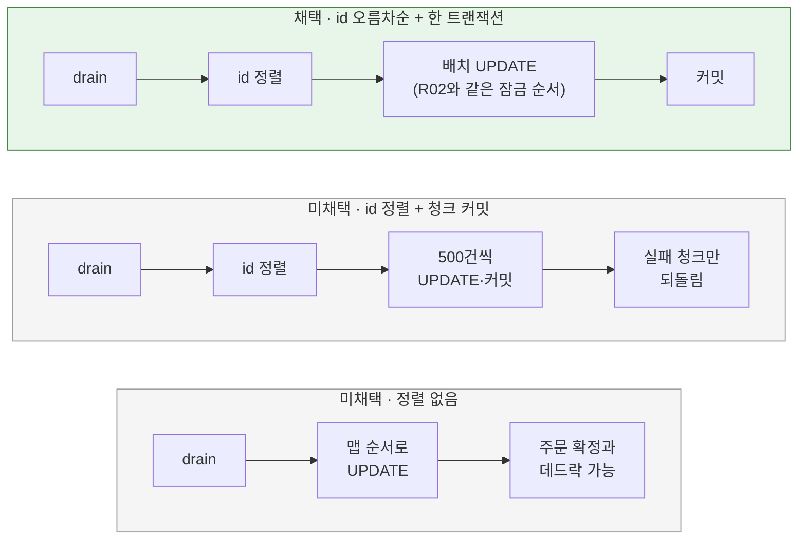

# 좋아요 수 반영·재집계와 상품 잠금

[← 전체 선택 현황](total_trade_off.md)

## 판단할 문제

좋아요 수가 `products`로 옮겨지면([01](01-like-count-location.md)) R03의 5초 반영과 시작 시 전체 재집계가 `products` 행을 갱신한다.
주문 확정은 R02 결정에 따라 상품 행을 id 오름차순으로 `PESSIMISTIC_WRITE` 잠근다. 두 쓰기가 같은 행을 다른 순서로 잡으면 대기와 데드락이 생길 수 있다.
또한 전체 재집계 대상이 100만 행이 되므로 SQL 비용과, 좋아요 반영이 상품의 `updated_at`을 바꿀지도 정해야 한다.

> **채택 — id 오름차순 정렬 후 한 트랜잭션 배치 UPDATE, 값이 다른 행만 쓰는 단일 재집계 SQL, `updated_at` 유지**
>
> - **5초 반영:** `UPDATE products SET like_count = GREATEST(0, like_count + ?) WHERE id = ?`를 상품 id 오름차순으로 JDBC 배치 실행한다. 한 트랜잭션이며 실패하면 R03과 같이 버퍼로 되돌린다.
> - **시작 시 전체 재집계:** 한 문장으로 값이 다른 행만 갱신한다.
>   ```sql
>   UPDATE products p
>   LEFT JOIN (SELECT product_id, COUNT(*) c FROM product_likes GROUP BY product_id) a ON a.product_id = p.id
>   SET p.like_count = COALESCE(a.c, 0)
>   WHERE p.like_count <> COALESCE(a.c, 0)
>   ```
> - **`updated_at`:** 좋아요 반영은 상품 수정이 아니므로 건드리지 않는다.
>
> 대신 반영 배치가 도는 동안 해당 상품의 주문 확정이 배치 길이만큼 기다리는 것을 감수한다.

## 흐름 비교



## 장단점 비교

| 주제 | 채택 | 미채택 |
|---|---|---|
| 잠금 순서(Q6) | **id 오름차순 + 한 트랜잭션**: R02와 순서가 같아 데드락이 없다. 5초 동안 바뀐 상품은 많아야 수천 개라 배치가 짧다 | 청크 커밋: 잠금 시간이 짧지만 청크별 복구가 필요. 정렬 없음: 데드락 시 주문 확정 쪽이 롤백되면 사용자 요청 실패 |
| 전체 재집계(Q12) | **단일 UPDATE JOIN + 값이 다른 행만**: 정상 재시작이면 쓰기가 거의 없다 | 0 초기화 + UPDATE JOIN: 두 번 훑고 매번 100만 행을 씀 |
| `updated_at`(Q13) | **유지**: 관리자 입장의 수정 시각 의미를 지킴. JDBC라 `@PreUpdate`도 돌지 않음 | 함께 갱신: 좋아요만 눌려도 수정된 상품처럼 보임 |

## 함께 고민한 내용

1. **데드락 시나리오:** 반영 트랜잭션이 상품 7 → 3 순서로 잠그고, 주문 확정이 3 → 7 순서로 잠그면 서로를 기다린다. R02가 주문 확정의 잠금 순서를 id 오름차순으로 정했으므로 반영도 같은 순서로 맞추면 순환 대기가 생기지 않는다.
2. **R03의 upsert가 필요 없어지는 이유:** 상품 행은 항상 먼저 존재하므로 `INSERT … ON DUPLICATE KEY UPDATE` 대신 `UPDATE`면 된다. 이미 삭제된 상품의 행이 갱신되는 것은 해롭지 않다.
3. **청크 커밋은 측정 후:** 대기가 실제 문제로 측정되면 그때 도입한다.
4. **전체 재집계 시점은 R03 그대로:** 웹 서버 시작 전 1회(`SmartInitializingSingleton`)라 요청·반영과 겹치지 않는다. 기존 `resetAllCounts`·`aggregateAllCounts` 두 단계는 한 문장이 되므로 DAO 계약도 하나로 합친다.

## 옵션별 판단

> **채택 — id 오름차순 + 한 트랜잭션:** 데드락을 없애는 가장 단순한 방법이다.

> **미채택 — 청크 커밋:** 필요가 측정되기 전의 복잡도다.

> **미채택 — 정렬 없음:** 데드락으로 사용자 주문이 실패할 수 있다.

> **채택 — 값이 다른 행만 쓰는 단일 재집계:** 100만 행 전체 쓰기를 피한다.

> **채택 — `updated_at` 유지:** 좋아요는 상품 수정이 아니다.

## 남은 사항

- 반영 배치 중 주문 확정 대기가 문제로 측정되면 청크 커밋을 다시 검토한다.
