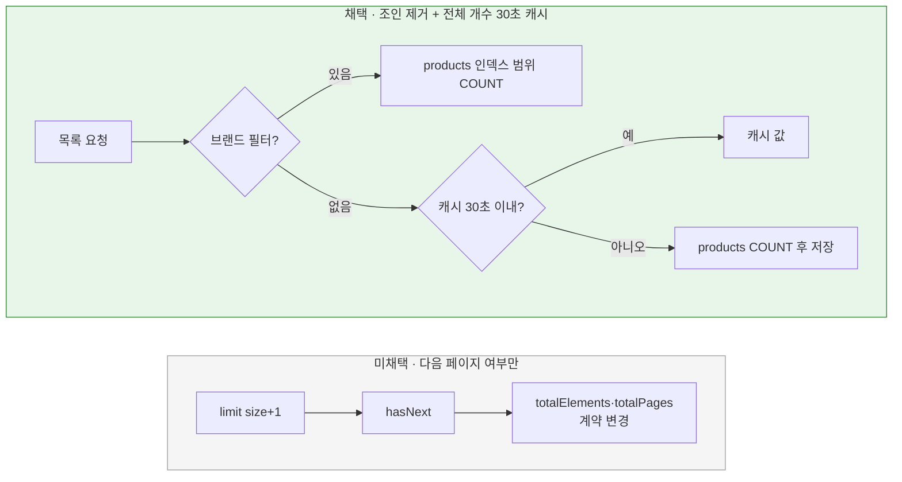

# 목록 전체 개수 처리

[← 전체 선택 현황](total_trade_off.md)

## 판단할 문제

상품 목록은 요청마다 `products ⋈ brands`에서 활성 상품 수를 `COUNT`한다. 100만 규모에서 브랜드 필터가 없는 COUNT는 요청마다 활성 상품 인덱스 약 100만 건을 훑는다. 브랜드 필터가 있으면 해당 브랜드 범위만 보므로 가볍다.
응답 `PageResult`는 `totalElements`·`totalPages`를 담으므로 개수 자체를 없애면 계약이 바뀐다.

> **채택 — COUNT에서 브랜드 조인 제거 + 브랜드 필터 없는 전체 개수만 메모리에 30초 캐시**
>
> - **조인 제거:** 브랜드를 삭제하면 같은 트랜잭션에서 소속 상품도 삭제되므로(R01, `Brand.delete`) "활성 상품이면 브랜드도 활성"이 보장된다. COUNT는 `products`의 `deleted`(+`brand_id`) 조건만으로 센다.
> - **목록의 브랜드 조건은 유지:** 목록은 브랜드 이름 때문에 행마다 브랜드 PK를 어차피 조회하므로 `b.deleted = false` 방어 조건을 남겨도 비용이 거의 없다.
> - **캐시:** `QueryDslProductQueryDao` 안에 "값 + 계산 시각"을 담은 `AtomicReference` 필드를 두고 30초가 지나면 다시 센다. 브랜드별 개수는 매번 센다. 상품 생성·삭제 때 비우지 않고 TTL로만 갱신한다. 라이브러리를 추가하지 않는다.
>
> 대신 필터 없는 목록의 `totalElements`·`totalPages`가 최대 30초 늦게 반영되는 것을 감수한다. R01 보장이 깨지면 목록과 개수가 어긋날 수 있으나 그 경우는 버그로 본다.

## 흐름 비교

## 장단점 비교

| 기준 | (a) COUNT 유지·조인만 제거 | **(b) (a) + 전체 개수 캐시** | (c) 다음 페이지 여부만 | (d) 개수 전용 테이블 |
|---|---|---|---|---|
| 응답 계약 | 유지 | 유지 | `totalElements`·`totalPages` 변경 | 유지 |
| 필터 없는 요청 비용 | 매번 약 100만 건 스캔 | 30초에 한 번 | 없음 | 행 1개 조회 |
| 정확성 | 즉시 | 최대 30초 지연 | — | 즉시 |
| 쓰기 경로 영향 | 없음 | 없음 | 없음 | 상품 생성·삭제마다 카운터 갱신·잠금 |

| 캐시 구현(Q11) | **`AtomicReference` 필드** | Spring Cache + Caffeine |
|---|---|---|
| 의존성 | 없음 | 라이브러리·설정 추가 |
| 코드 | 10줄 내외 | `@Cacheable` + 캐시 매니저 설정 |
| 확장성 | 값 하나 전용 | 캐시 대상이 늘 때 유리 |

## 함께 고민한 내용

1. **브랜드별 개수는 캐시하지 않는 이유:** `(deleted, brand_id, …)` 인덱스 범위만 세므로 이미 가볍다. 브랜드 수만큼 캐시 키가 늘면 관리 부담만 커진다.
2. **TTL 30초:** 5초(좋아요 반영 주기와 같음)도 가능했으나 개수는 상품 등록·삭제로만 바뀌어 변화가 느리다.
3. **무효화 없음:** 상품 생성·삭제가 조회 캐시를 비우게 하면 쓰기 경로(application)가 조회 구현(infrastructure)의 캐시를 알게 된다. TTL만으로 충분하다.
4. **서버 여러 대:** 캐시가 서버마다 따로 있어도 각자 30초 안에 수렴하므로 문제가 없다.
5. **같은 조건의 방어 필터를 남기는 기준(Q8):** 제거했을 때 실제로 비용이 줄어드는 곳(COUNT)에서만 뺐다.
6. **테스트 격리(계획 작성 중 발견, 합의):** DAO는 모든 Spring 테스트가 공유하는 싱글톤이라 캐시된 개수가 다른 테스트 클래스의 `totalElements` 기대값에 샐 수 있다. TTL을 프로퍼티(`query.product-count-cache.ttl`, 기본 30초)로 받고 `test` 프로필은 0초(캐시 끔)로 둔다. 캐시 로직은 작은 클래스로 분리해 POJO 테스트 1개로 확인한다. 처음 합의한 "캐시 TTL 단위 테스트 없음"(Q15)을 이 이유로 바꿨다.

## 옵션별 판단

> **채택 — (b) 조인 제거 + 전체 개수 30초 캐시(`AtomicReference`):** 계약을 지키며 가장 무거운 경우 하나만 줄인다.

> **미채택 — (a) 조인 제거만:** 필터 없는 요청마다 전체 스캔이 남는다.

> **미채택 — (c) 다음 페이지 여부만:** 응답 계약 변경이라 범위 밖이다.

> **미채택 — (d) 개수 전용 테이블:** 쓰기 경로에 카운터 갱신과 잠금이 추가된다.

> **미채택 — Spring Cache + Caffeine:** 값 하나를 위한 의존성·설정이 과하다.

> **채택 — COUNT에서만 브랜드 조건 제거(목록은 유지):** 효과가 있는 곳에서만 뺀다.
