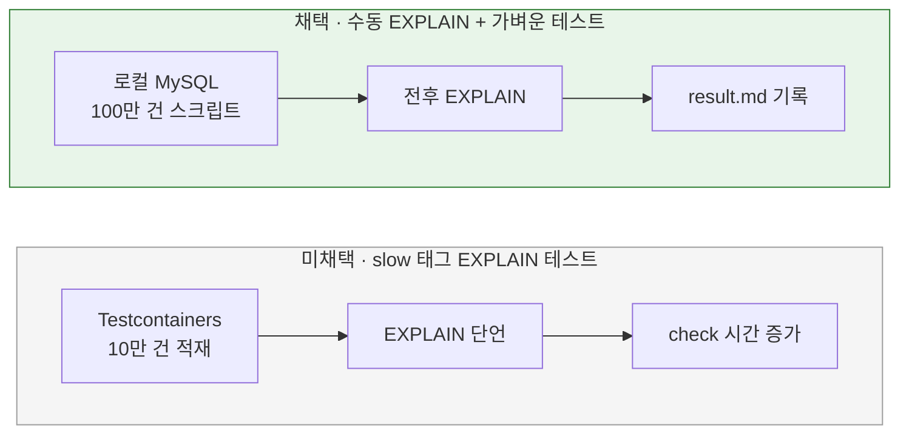

# 범위와 검증 방식

[← 전체 선택 현황](total_trade_off.md)

## 판단할 문제

좋아요순 외에 문답 중 드러난 비용(필터 없는 최신순·가격순 정렬, 깊은 페이지)을 R04에서 다룰지, 인덱스 효과를 어떻게 증명할지, 운영 스키마 변경과 테스트를 어디까지 준비할지 정해야 한다.

> **채택 — 좋아요순에 집중, EXPLAIN은 로컬 대량 데이터로 수동 확인, 마이그레이션 SQL은 문서 기록, 가벼운 테스트**
>
> - **최신순·가격순(Q3):** 이번에는 바꾸지 않는다. 필터 없는 경우의 EXPLAIN만 확인해 남은 사항에 기록한다.
> - **깊은 페이지(Q9):** offset 방식을 유지하고 한계로 기록한다.
> - **EXPLAIN(Q10):** 로컬 Docker MySQL에 상품 약 100만 건을 넣는 SQL 스크립트로 변경 전후 계획을 확인하고 `result.md`에 기록한다. 테스트로 계획을 단언하지 않는다.
> - **운영 스키마(Q14):** `result.md`에 마이그레이션 순서만 기록한다(컬럼 추가 → 기존 집계에서 값 채우기 → 인덱스 2개 생성 → `product_like_counts` 삭제).
> - **테스트(Q15):** `QueryDslProductQueryDao` 통합 테스트 1개 신설, 집계 통합 테스트를 `products.like_count` 기준으로 수정하고 JPA 저장이 좋아요 수를 덮어쓰지 않는지 단언 1개 추가. 동시성 테스트는 추가하지 않는다. 캐시 TTL은 처음에 테스트하지 않기로 했으나, test 프로필에서 캐시를 끄게 되어 POJO 테스트 1개로 확인하기로 바꿨다([03](03-list-count.md) 6번).
>
> 대신 인덱스 회귀는 자동 테스트로 잡지 못하고, 깊은 페이지와 필터 없는 최신순·가격순의 전체 정렬은 남는다.

## 흐름 비교

## 장단점 비교

| 주제 | 채택 | 미채택 |
|---|---|---|
| 최신순·가격순(Q3) | **확인·기록만**: R04를 좋아요순에 집중 | R04에 인덱스 추가: 동작은 그대로지만 범위가 넓어짐. 별도 요구사항: 지금은 근거(EXPLAIN)가 없음 |
| 깊은 페이지(Q9) | **offset 유지·한계 기록**: 좋아요순을 수천 페이지 넘기는 요청은 드묾 | 2단계 조회(id만 인덱스로 찾고 본문 `IN`): 쿼리 +1. 커서 페이지네이션: 계약 변경 |
| EXPLAIN(Q10) | **로컬 스크립트 + 기록**: 테스트가 가볍다 | slow 테스트: 자동 회귀지만 무거움. 적은 fixture: 옵티마이저가 다른 계획을 골라 신뢰 불가 |
| 운영 스키마(Q14) | **순서 기록**: R03 유니크 키 변경과 같은 방식 | 실행 SQL 파일 추가: 마이그레이션 도구가 없는 상태에서 관리 대상만 늘어남 |

## 함께 고민한 내용

1. **발견한 비용:** 최신순·가격순 인덱스는 `(deleted, brand_id, created_at|price, id)` 순서라 브랜드 필터가 있을 때만 정렬이 인덱스를 탄다. 필터가 없으면 좋아요순과 같은 전체 정렬이 일어날 가능성이 크다. 요구사항은 "최신순·가격순 동작 변경 제외"라서 이번에는 EXPLAIN으로 사실만 확인한다.
2. **깊은 페이지 비용:** `offset N`은 인덱스를 따라 앞의 N행을 건너뛰며, 지금 구조에서는 건너뛰는 행마다 본문·브랜드 조인도 읽는다. 첫 몇 페이지는 새 인덱스로 충분히 빨라진다.
3. **대량 데이터 스크립트:** 테스트 코드가 아니라 검증 도구다. 저장 위치와 형식은 plan.md에서 정한다.

## 옵션별 판단

> **채택 — 좋아요순에 집중, 최신순·가격순은 확인·기록만**

> **채택 — 깊은 페이지는 한계로 기록**

> **채택 — 로컬 대량 데이터 수동 EXPLAIN + 가벼운 테스트**

> **채택 — 마이그레이션 순서는 문서 기록**

## 남은 사항

- 필터 없는 최신순·가격순의 EXPLAIN 결과에 따라 후속 요구사항으로 뺄지 판단한다.
- 깊은 페이지가 실제 문제가 되면 2단계 조회를 다시 검토한다.
