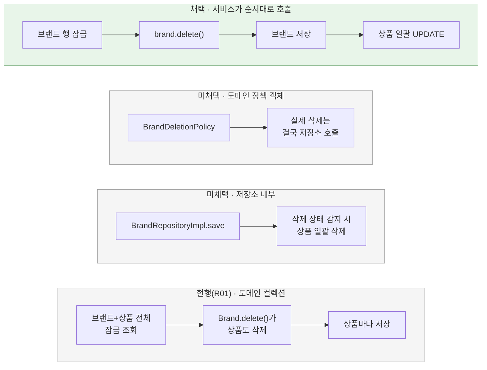

# 브랜드 삭제 규칙의 위치

[← 전체 선택 현황](total_trade_off.md)

## 판단할 문제

R01은 "브랜드를 지우면 상품도 지운다"를 도메인 `Brand.delete()`에 두고, 이를 위해 브랜드가 삭제 시에만 상품 목록을 갖게 했다([R01 01](../../../week3/r01-brand-bulk-delete/trade_off/01-lifecycle.md), [02](../../../week3/r01-brand-bulk-delete/trade_off/02-policy-location.md)).
이 구조 때문에 삭제 조회가 상품 전체를 읽어야 하고, 그 잠금 조회가 상품 테이블 전체를 잠근다([요구사항 2절](../requirement.md#2-현재-동작과-변경점)). 상품을 일괄 UPDATE로 지우면 브랜드가 상품 목록을 가질 이유가 사라지므로 규칙을 어디에 둘지 다시 정한다.

> **채택 — `BrandService`가 순서대로 호출(사용자 제안)**
>
> `findByIdForUpdate`(브랜드 행 잠금) → `brand.delete()`(브랜드 상태만) → `brandRepository.save(brand)` → `productRepository.deleteAllByBrandId(brandId)`.
> `Brand.products`, `restoreForDeletion`, `toDomainForDeletion`, `BrandJpaEntity`의 `@OneToMany`, `findForDeletion`을 제거한다.
>
> 대신 연쇄 삭제 규칙이 도메인 모델이 아니라 서비스의 호출 순서로 표현된다. R01의 "순수 도메인 정책" 결정을 대체한다.

## 흐름 비교

## 장단점 비교

| 기준 | **서비스 호출** | 도메인 정책 객체 | 저장소 내부 | 현행(R01) |
|---|---|---|---|---|
| 규칙이 보이는 곳 | 서비스 코드 4줄 | 정책 객체(실행은 저장소) | 인프라 안에 숨음 | 도메인 모델 |
| 상품 로딩 | 없음 | 없음 | 없음 | 상품 전체를 메모리로 |
| 연관관계 | 불필요 | 불필요 | 불필요 | 조회용 `@OneToMany` 필요 |
| 잠금 범위 | 브랜드 1행 + 해당 브랜드 활성 상품 | 같음 | 같음 | 상품 테이블 전체(측정) |

## 함께 고민한 내용

1. **R01에서 왜 도메인에 뒀는가:** 브랜드와 상품의 생명주기를 모델로 표현하려 했다. 그러나 실제로 브랜드가 상품을 다루는 경우는 삭제뿐이었고, 그 한 경우를 위해 삭제 전용 조회·복원 메서드·연관관계가 추가됐다.
2. **정책 객체를 버린 이유:** 일괄 삭제는 저장소의 SQL 한 번이라 정책 객체가 할 일이 "둘 다 지운다"는 선언뿐이다. 한 줄짜리 클래스가 된다.
3. **저장소 내부를 버린 이유:** 브랜드 저장이 상품까지 바꾸는 부수효과가 생기고, 서비스만 읽어서는 연쇄 삭제가 보이지 않는다.
4. **R01 `04-save-unit`의 "직접 bulk UPDATE" 미채택과의 관계:** R01에서는 도메인이 상품별 삭제를 판단하므로 bulk UPDATE가 도메인을 우회한다는 이유로 버렸다. 규칙을 서비스로 옮기면 그 이유가 사라진다.

## 옵션별 판단

> **채택 — 서비스가 순서대로 호출:** 사용자 제안. 규칙이 서비스에 그대로 드러나고 연관관계가 필요 없다.

> **미채택 — 도메인 정책 객체:** 실질 동작이 없는 클래스가 된다.

> **미채택 — 저장소 내부 처리:** 규칙이 숨는다.

> **대체 — R01 도메인 컬렉션:** 상품 테이블 전체 잠금과 삭제 전용 구조의 비용이 크다.
