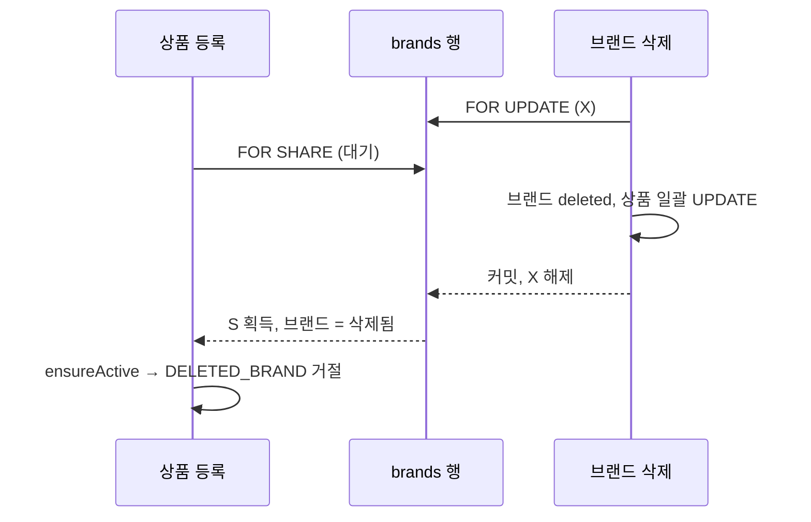

# 동시 상품 쓰기와 잠금 순서

[← 전체 선택 현황](total_trade_off.md)

## 판단할 문제

상품 등록은 브랜드를 잠그지 않고 활성 여부만 읽는다. 그래서 브랜드 삭제와 거의 동시에 들어온 등록이 "삭제된 브랜드의 활성 상품"을 남길 수 있다(현행에도 있는 구멍, R01은 범위에서 제외). R04는 "활성 상품이면 브랜드도 활성"을 전제로 목록 COUNT의 브랜드 조인을 뺐으므로 이 구멍을 막을지 정한다.
막는다면 상품 수정·재고 설정, 주문 확정과의 잠금 순서가 엇갈리지 않게 해야 한다.

> **채택 — 막는다(Q3). 삭제는 브랜드 `FOR UPDATE`, 상품 등록만 브랜드 `FOR SHARE`(Q4). 주문 확정과의 데드락은 한계로 기록(Q5)**
>
> - 삭제: `BrandRepository.findByIdForUpdate` → 브랜드 저장 → 상품 일괄 UPDATE.
> - 등록: `BrandRepository.findByIdForShare` → `ensureActive` → INSERT. 같은 브랜드의 등록끼리는 서로 막지 않고 삭제와만 순서가 정해진다.
> - 수정·재고 설정·단건 삭제: 변경 없음. 상품 행 잠금이 이미 일괄 UPDATE와 순서를 정한다.
>
> 대신 같은 브랜드 상품 여러 개가 브랜드 삭제와 주문 확정에 동시에 얽히면 데드락이 날 수 있고, MySQL이 한쪽을 롤백한다.

## 흐름 비교

## 장단점 비교

| 주제 | 채택 | 미채택 |
|---|---|---|
| 등록 경쟁(Q3) | **막는다**: R04의 COUNT 전제를 지킨다 | 한계로 기록: 드물지만 데이터가 어긋남. 삭제만 잠금: 등록 경쟁을 못 막음 |
| 잠금 위치(Q4) | **등록만 `FOR SHARE`**: 브랜드 → 상품 순서가 모든 경로에서 같다 | 수정에도 걸고 순서 맞추기: 상품을 먼저 잠금 없이 읽어야 해 쿼리 증가·R02 흐름 변경. 수정에 그대로 걸기: 수정(상품→브랜드)과 삭제(브랜드→상품)가 데드락 |
| 주문 확정(Q5) | **한계로 기록**: 브랜드 삭제는 드문 관리자 작업, 현행은 상품 전체를 잠가 더 나쁨 | 삭제 쪽 id 순 선잠금: InnoDB는 `ORDER BY`가 아니라 스캔 순서로 잠가 인덱스 설계가 따로 필요. 데드락을 409로: 응답 계약 추가 |

## 함께 고민한 내용

1. **수정·재고 설정이 브랜드 잠금 없이 안전한 이유**
   - 수정이 먼저: 수정이 상품 행을 `FOR UPDATE`로 잡고 있으면 일괄 UPDATE가 그 행을 기다린 뒤 최신 값(활성)을 보고 삭제한다.
   - 삭제가 먼저: 수정의 `FOR UPDATE`가 기다린 뒤 삭제된 상품을 읽어 `ensureActive`에서 거절된다.
   - 구멍은 새 행을 만드는 등록에만 있다.
2. **수정에 공유 잠금을 그대로 걸면 생기는 데드락:** 수정은 상품 X → 브랜드 S 순서, 삭제는 브랜드 X → 상품 X 순서라 서로를 기다린다. 이 발견으로 Q3(a)의 적용 범위를 등록으로 좁혔다.
3. **주문 확정과의 데드락:** 일괄 UPDATE는 인덱스 순서(`created_at` 역순)로, 주문 확정은 id 오름차순으로 잠근다. 같은 브랜드 상품 두 개 이상이 동시에 얽혀야 생긴다. 데드락 전용 예외 처리가 없어 롤백된 쪽은 500 응답이 될 가능성이 크다(구현 중 확인).

## 옵션별 판단

> **채택 — 등록 경쟁을 막는다 + 등록만 브랜드 `FOR SHARE`**

> **채택 — 주문 확정과의 데드락은 한계로 기록**

> **미채택 — 수정·재고 설정에 브랜드 잠금 추가**: 불필요하고 데드락 위험이 생긴다.

## 남은 사항

- 브랜드 삭제와 주문 확정의 데드락이 실제로 관찰되면 삭제 쪽 잠금 순서나 재시도를 다시 검토한다.
