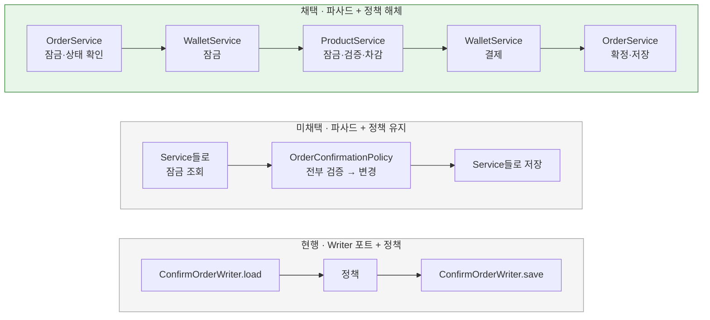

# 주문 확정의 조율 구조와 도메인 정책 해체

[← 전체 선택 현황](total_trade_off.md)

## 판단할 문제

주문 확정은 주문·상품·지갑 세 컨텍스트를 함께 바꾼다. 지금은 인프라의 `JpaConfirmOrderWriter`가 저장소 4개로 잠금 조회·저장을 묶고, 도메인 `OrderConfirmationPolicy`가 규칙 전체를 갖는다(R02 [01](../../../week3/r02-order-consistency/trade_off/01-business-policy.md)).
사용자는 파사드가 컨텍스트별 Service를 호출하는 구조를 제안했고, 목적을 "서비스별 책임 분리, `ConfirmOrderWriter` 제거, Service 재사용"으로 정했다. 이 목적에서 조율 구조와 도메인 정책을 어떻게 둘지 정한다.

> **채택 — 파사드가 Order·Wallet·Product Service를 순서대로 호출, `OrderConfirmationPolicy` 해체**
>
> - 파사드: `orderService.lockForConfirm` → `walletService.lockByUserId` → `productService.decreaseStocks` → `walletService.pay` → `orderService.confirm`.
> - 각 Service가 자기 검증·변경·저장을 맡는다. 수량 합산은 `Order.quantitiesByProductId()`로 옮긴다.
> - `ConfirmOrderWriter`·`ConfirmOrderLoad`·`JpaConfirmOrderWriter`·`OrderConfirmationPolicy`·`OrderConfirmation`을 제거한다.
>
> 대신 "모든 검증을 끝낸 뒤 변경"이 메모리 수준에서는 깨진다. 예를 들어 잔액이 부족하면 재고 차감이 먼저 일어난 뒤 실패한다. 이 경우 정합성은 트랜잭션 롤백이 보장하고, 통합 테스트("포인트가 부족하면 재고 차감을 포함해 전체를 롤백한다")가 이를 검증한다. R02 01의 "도메인 서비스로 묶기" 결정을 대체한다.

## 흐름 비교

## 장단점 비교

| 기준 | **파사드 + 정책 해체** | 파사드 + 정책 유지 | 현행 |
|---|---|---|---|
| 서비스별 책임 | 각 Service가 조회·검증·변경·저장 | Service는 조회·저장 래퍼 | 인프라 포트가 4개 저장소를 묶음 |
| Service 재사용 | `decreaseStocks`·`pay`를 그대로 재사용 | 업무 동작은 정책 안에 남아 재사용 어려움 | 없음 |
| 규칙 위치 | 각 Service와 도메인 모델, 순서는 파사드 | 순수 도메인 함수 하나 | 순수 도메인 함수 하나 |
| 컨텍스트 의존 | ordering 도메인이 mall·pay 모델을 몰라도 됨 | `domain.ordering.policy`가 mall·pay 모델에 의존 | 같음 |
| "전부 검증 후 변경" | 트랜잭션 롤백으로 보장(메모리에서는 아님) | 메모리에서 보장 | 메모리에서 보장 |
| 테스트 | Service·파사드 단위 + 통합 | 정책 단위(Mock 없음) + 통합 | 같음 |

## 함께 고민한 내용

1. **정책 유지의 이점이 작다고 본 이유:** 확정 전체가 한 트랜잭션이라 중간 실패 시 이미 바꾼 값도 롤백된다. 메모리에서 "전부 검증 후 변경"을 지키는 것은 DB 결과에 영향이 없다. 오류 우선순위는 파사드가 주문 → 상품 → 지갑 결제 순서로 부르면 현행과 같다.
2. **처음 추천과 바뀐 이유:** 처음에는 "정책 유지"를 추천했다. 사용자가 목적 세 가지(책임 분리·Writer 제거·재사용)를 정한 뒤 다시 비교했고, 정책을 남기면 Service가 래퍼가 되어 재사용 목적에 맞지 않아 해체로 바꿨다.
3. **상품 단계 안의 검증:** `decreaseStocks`는 모든 품목을 먼저 검증한 뒤 차감한다. 뒤쪽 품목이 실패하면 앞쪽 재고가 메모리에서도 바뀌지 않는다는 기존 규칙을 상품 단계 안에서는 유지한다.

## 옵션별 판단

> **채택 — 파사드 + 정책 해체:** 사용자 목적 세 가지에 모두 맞는다.

> **미채택 — 파사드 + 정책 유지:** 규칙은 한 곳에 남지만 Service가 조회·저장 래퍼가 된다.

> **대체 — 현행(Writer 포트 + 정책), R02 01 결정**
