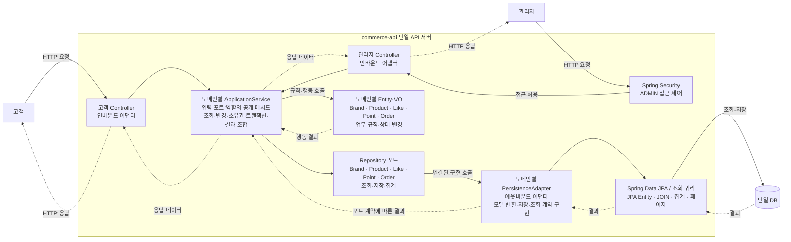
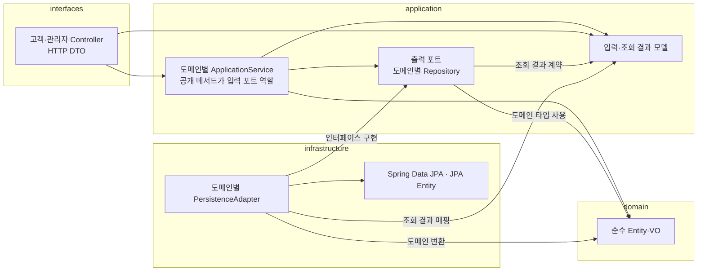
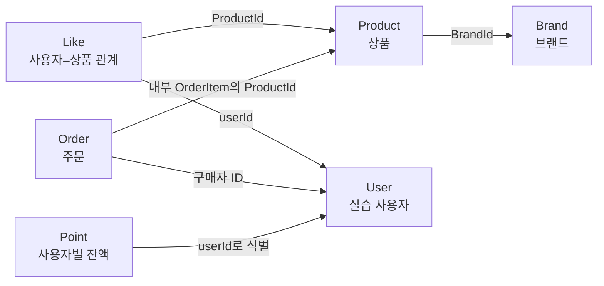
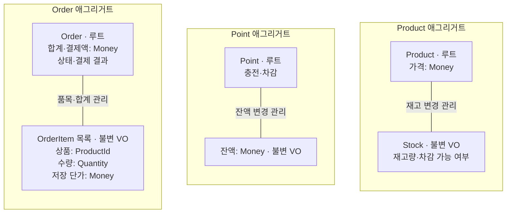

# Week 3 — 커머스 설계 (트랜잭션·동시성)

이 문서는 `docs/week2/commerce-design.md`를 복사해 3주차 과제(트랜잭션 경계, 브랜드 일괄 삭제·비노출, 재고·포인트 경쟁 제어)를 반영한 현재 설계 기준이다. 2주차 문서는 제출 당시 기록으로 그대로 둔다. 1~7절은 2주차 설계를 이어받고 바뀐 부분만 수정했으며, 8절부터 3주차 내용을 추가했다. 2주차 대비 변경은 14절에 모았다.

> **표시 규칙** — `[확정]`: 승인 없이 변경하지 않는 합의. `[임시]`: 연속 구현 중 사용자 승인으로 정한 현재 기준이며, 변경은 제안·승인 후 이 문서와 구현·테스트에 함께 반영한다. 하위 절은 상위 절의 표시를 따르며, 하위 절에 별도 표시가 있으면 그 표시를 따른다. 구체적인 HTTP 계약과 잠금 전략은 6절의 구현 정책과 8~13절의 3주차 설계를 따른다. 작업 방식은 `AGENTS.md`를 따른다.

## 1. 버드뷰 [확정]

고객과 관리자는 하나의 API 서버와 DB를 사용한다. 고객은 상품 조회·좋아요·포인트·주문을 요청하고, 관리자는 브랜드·상품·재고를 관리하고 주문을 조회한다.



실선은 실행 중 요청·호출, 점선은 결과·응답이다. 반환 경로는 일부 축약했다. application이 도메인 행동과 포트 호출을 조율하며, domain은 DB를 직접 호출하지 않는다. 도메인별 Repository와 어댑터가 조회·저장을 함께 처리하며 별도 UseCase·Facade 계층은 두지 않는다.

## 2. 구조와 의존 [확정]

순수 도메인과 JPA 모델을 분리한 헥사고날 구조를 사용한다. **Controller → ApplicationService → Entity·VO / 출력 포트 → JPA 어댑터**를 기본 구성으로 한다.

| 계층 | 역할 | 허용하는 주요 의존 |
| --- | --- | --- |
| interfaces | 고객·관리자 HTTP 입력·응답, 식별 정보 전달, 오류 매핑 | application |
| application | 도메인별 ApplicationService에서 실행 순서·소유권·트랜잭션 조율, 출력 포트 정의 | domain, Spring 트랜잭션 |
| domain | Entity·VO의 상태와 업무 규칙 | Java, 필요한 도메인 타입 |
| infrastructure | 출력 포트 구현, JPA 저장·조회, 도메인 모델 변환 | application의 포트·결과 모델, domain, JPA |



이 그림은 소스의 의존 방향이다. infrastructure가 application의 출력 포트를 구현한다. application은 infrastructure 구현에, domain은 다른 계층·Spring·JPA·HTTP에 의존하지 않는다. interfaces는 infrastructure를 직접 사용하지 않는다.

### 필요한 구성만 유지

- Controller는 인바운드 어댑터다. 고객·관리자 Controller와 DTO를 구분하되 같은 도메인을 사용한다.
- application은 Brand·Product·Like·Point·Order별 ApplicationService 하나로 시작한다. 공개 메서드가 입력 포트 역할을 하며 별도 UseCase 인터페이스·Facade·Command Handler는 두지 않는다. 입력·반환에 HTTP DTO를 사용하지 않는다.
- Repository는 아웃바운드 포트이고, PersistenceAdapter가 이를 구현해 Spring Data JPA를 사용한다.
- 도메인별 어댑터로 시작한다. ProductPersistenceAdapter처럼 해당 도메인의 Repository를 구현해 조회·저장을 함께 처리한다. 전체 도메인을 통합하거나 메서드마다 어댑터를 나누지 않는다. 단순 모델 변환은 내부 메서드로 처리하고 Mapper 클래스를 일괄 추가하지 않는다.
- 이름·설명까지 모두 VO로 만들거나 단순 규칙을 별도 도메인 서비스로 옮기지 않는다. 기존 경계를 유지하는 내부 리팩터링은 자율적으로 수행하고, 새 계층·입력 인터페이스 도입이나 서비스 책임 경계 변경은 이유와 영향을 설명하고 확인받는다.

| 서비스 | 책임 |
| --- | --- |
| BrandApplicationService | 브랜드 CRUD·조회, 브랜드와 연결 상품의 일괄 논리 삭제 |
| ProductApplicationService | 상품 CRUD·재고 설정·조회 |
| LikeApplicationService | 좋아요 등록·취소·내 목록 |
| PointApplicationService | 충전·잔액 조회 |
| OrderApplicationService | 주문 생성·확정·고객/관리자 조회 |

### 조회·변경 경계

CQRS를 적용하지 않는다. 도메인별 ApplicationService와 Repository가 조회·변경을 함께 처리한다. 별도 조회 전용 포트·서비스를 두지 않는다. 포트는 해당 application 기능의 `port` 패키지에 두며, 도메인 또는 application 타입을 사용한다. JPA Entity·Spring Data `Page`·HTTP DTO는 노출하지 않는다.

고객 상품 목록·상세와 변경 대상은 **ProductRepository**에서 Product로 조회한다. 상품 변경은 Product의 행동을 호출한 뒤 저장한다. 조회 결과 조합은 **ProductApplicationService**에서 수행한다.

1. ProductRepository에서 조건에 맞는 상품 페이지를 조회한다.
2. 페이지의 브랜드 ID 목록으로 BrandRepository에서 브랜드를 일괄 조회한다.
3. 페이지의 상품 ID 목록으로 LikeRepository에서 좋아요 수를 일괄 집계한다.
4. application 결과 DTO로 조합하고 Controller가 HTTP 응답으로 변환한다. 상세 조회도 같은 책임 배치를 따른다.

상품마다 추가 조회하지 않는다. 좋아요 순 정렬은 ProductPersistenceAdapter의 쿼리가 전체 후보에 대해 JOIN·집계·정렬한 뒤 페이지 처리하며 Product 목록을 반환한다. 페이지를 가져온 뒤 application에서 재정렬하지 않는다. SQL의 테이블 참조는 애그리거트 간 객체 연관관계를 뜻하지 않는다.

Product에 응답 조합용 브랜드명·좋아요 수를 추가하지 않고 결과 DTO로 상태를 변경하지 않는다. 브랜드 응답 필드가 바뀌면 브랜드 조회·application 결과 조합·HTTP DTO 등 관련 부분을 수정하며 Product의 재고 규칙은 유지한다. 별도 조회 포트가 줄어드는 대신 결과 조합 코드와 DB 조회 횟수는 늘어날 수 있다.

### 저장과 복원

도메인을 영속 기술에서 분리하기 위해 JPA 모델을 별도로 둔다. 그 대신 명시적 저장과 모델 변환이 필요하며, 필드 변경 시 도메인·영속 모델·매핑을 함께 수정하는 비용을 감수한다. 도메인 객체에는 더티 체킹이 적용되지 않지만 어댑터 내부의 JPA 관리 엔티티에는 적용할 수 있다.

도메인 객체는 JPA 관리 객체가 아니므로 행동 호출 후 Repository로 명시적으로 저장한다. 복원은 저장된 ID·상태·금액을 되살리는 작업이며 신규 생성·충전·확정 행동을 다시 실행하지 않는다. DRAFT 확정 시 가격 재산정 여부는 복원과 별개로 결정한다.

### AI와 설계 다듬기

- **상황:** 초안의 상품 조회 전용 포트를 바탕으로 AI와 상품 규칙·조회 조합의 책임 중복을 검토하고, 조회 전용 포트와 UseCase·Facade의 필요성을 비교했다.
- **대안:** 역할별 분리는 조회 최적화와 계약 명시에 유리하지만 관리할 구조가 늘고, 통합은 단순하지만 결과 조합 코드와 DB 호출이 증가할 수 있다.
- **선택:** **헥사고날의 경계는 유지하면서 과제에 불필요한 추상화를 줄이기 위해** CQRS와 별도 UseCase·Facade를 두지 않는다. ApplicationService의 공개 메서드는 입력 포트, Repository는 출력 포트로 사용한다. 다섯 도메인과 도메인별 Entity·VO를 유지하고 조회 결과는 application에서 조합한다.
- **재검토:** 실제 조회 성능 문제나 결과 조합의 복잡도가 커지면 전용 조회 구조를 검토한다.

## 3. 도메인 관계 [확정]

Brand·Product·Like·Point·Order의 도메인과 Entity·VO 역할은 유지한다. Entity·VO는 각 도메인 패키지에 함께 두며 별도의 공통 `entity`·`vo` 패키지로 나누지 않는다.

| 패키지 | 소속 타입 |
| --- | --- |
| domain.brand | Brand, BrandId |
| domain.product | Product, ProductId, Stock |
| domain.like | Like |
| domain.point | Point |
| domain.order | Order, OrderItem, Quantity |

공유 금액 VO는 `domain.common.Money`에 둔다. long의 0 이상 범위를 사용하고 연산 범위 초과를 거절한다.

### 애그리거트 사이의 관계

각 상자는 독립 애그리거트 루트다. User는 실습 사용자 식별 대상이며, 여기서 신규 애그리거트 설계를 추가하지 않는다. 화살표는 호출 순서가 아니라 **ID를 보관하는 쪽 → 참조 대상**이다.



Order와 Product의 연결은 **OrderItem이 상품 ID를 보관한다는 뜻**이며, Order에 Product 객체나 별도 상품 ID 필드를 추가한다는 뜻이 아니다. ID 참조는 JPA 객체 연관관계를 강제하지 않는다.

### 애그리거트 내부의 책임

아래 상자 묶음은 각각 하나의 애그리거트다. 실선은 루트가 관리하는 내부 구성이다. Brand와 Like는 위 관계도에 표시하고, 재고·잔액·주문 품목의 내부 구성만 펼쳤다.



Money는 각 값의 타입이며, 여러 애그리거트가 하나의 잔액 객체를 공유한다는 뜻이 아니다. Point는 최초 잔액 조회·충전 시 생성하며 주문은 1~100개 품목을 허용한다.

| 관계·객체 | 책임과 경계 |
| --- | --- |
| Brand–Product | 독립 애그리거트다. Product는 BrandId로 소속을 표현한다. application이 상품 생성 시 활성 브랜드를 확인하고, 브랜드 삭제 시 연결된 미삭제 상품을 함께 논리 삭제한다(11절). |
| User–Like–Product | Like는 사용자–상품 관계를 표현한다. DB 유일 제약으로 중복 관계를 막고 좋아요 수는 관계에서 집계한다. |
| Order–OrderItem | Order가 품목·합계·상태·결제 결과를 관리한다. OrderItem은 상품 ID·수량·단가를 담는 불변 VO다. |
| Product–Stock | Product 루트가 재고 변경을 관리한다. Stock VO가 음수 재고와 재고 부족을 거절한다. |
| User–Point | Point는 사용자별 잔액을 관리하며 충전·차감을 수행한다. 잔액은 Money VO로 표현한다. |

Brand·Product·Like·Point·Order는 각각 애그리거트 루트다. 내부 변경은 루트의 행동을 통하며, 다른 애그리거트는 ID로 참조한다. 재고·잔액 연산과 상태 규칙은 Entity·VO가 수행하고 application에 중복 작성하지 않는다. StockRepository·OrderItemRepository는 만들지 않는다.

브랜드·상품은 논리 삭제한다. 브랜드를 삭제하면 재고 0을 포함한 연결된 미삭제 상품도 같은 트랜잭션에서 함께 논리 삭제한다(11절). 상품 수정 시 브랜드를 유지하고, 이미 삭제된 브랜드·상품의 수정과 삭제된 상품의 재고 변경을 거절한다. 기존 주문 품목이 연쇄 삭제되지 않게 한다.

## 4. 대표 흐름 [확정]

### 좋아요 등록·취소

- 등록: 요청자 확인 → 활성 상품 확인 → 사용자–상품 관계 저장.
- 취소: 요청자 확인 → 자신의 관계 삭제. 삭제된 상품에 남은 좋아요도 취소할 수 있다.
- 내 목록에서는 삭제 상품을 제외한다.

### 포인트 충전 → 주문 확정

1. 요청자의 Point를 조회하고 충전 후 잔액을 저장한다.
2. 상품·수량을 확인하고 품목·단가·합계를 가진 DRAFT 주문을 저장한다. 생성 시 차감하지 않는다.
3. 최초 확정은 본인의 DRAFT 주문에 대해서만 수행하며 상품 사용 가능 여부·재고·잔액을 확인한다. 이미 CONFIRMED인 주문의 재요청은 409로 거절한다.
4. OrderApplicationService가 필요한 Repository를 직접 사용하고 Product·Point·Order의 행동을 호출한다. 변경 저장은 하나의 트랜잭션으로 묶고 실패하면 전체를 롤백한다.
5. 저장된 주문과 잔액을 조회한다. 가격 변경이 없는 경우 10,000원 충전 후 7,000원 결제 시 잔액은 3,000원이다.

트랜잭션의 롤백이 동시 요청의 이중 차감까지 해결하지는 않는다. 주문 → 상품 ID 오름차순 → 포인트 순서로 DB 행을 잠그며, 이벤트·분산 처리 계층은 추가하지 않는다.

### 관리자 변경 → 고객 조회

1. Controller 진입 전에 Spring Security가 관리자 접근을 확인한다. Controller가 입력을 변환하고 application이 상품을 조회한다.
2. Product의 정보·재고 변경 행동을 호출하고 DB에 저장한다.
3. 고객 조회 시 ProductApplicationService가 ProductRepository·BrandRepository·LikeRepository로 변경된 상품·브랜드·좋아요 수를 조회하고 결과를 조합한다.
4. 고객용 응답으로 반환한다.

## 5. 기본 API 계약 [확정]

### 공통

- 고객은 `X-USER-ID`로 식별하며 자신의 좋아요·포인트·주문만 다룬다.
- `/api-admin/**`는 ADMIN만 허용하고 일반·미식별 요청은 403으로 거절한다.
- 생성은 201, 조회·변경·삭제는 200이다. 입력 오류 400, 사용자 식별 누락·없는 사용자 401, 관리자 접근 거절 403, 없는 대상·타인 주문 404, 업무 상태 충돌 409, 잠금 대기 시간 초과·교착 503을 사용한다(12절).

### 구현 확정: 브랜드 생성·상세

- 관리자 생성은 `POST /api-admin/v1/brands`, 입력은 `{"name":"브랜드"}`이며 설명은 받지 않는다. 이름은 공백이 아닌 1~100자 문자열이다. 성공은 201과 `data.id`, 잘못된 입력은 400이다.
- 고객 상세는 `GET /api/v1/brands/{brandId}`, 성공은 200과 `data.id`, `data.name`이다. 없거나 삭제된 브랜드는 404다.
- 고객은 `X-USER-ID`로 식별한다. 누락·없는 사용자는 401, 숫자로 해석할 수 없는 ID는 400이다. 실습 사용자 테이블에는 테스트 fixture로 사용자를 준비하며 회원가입 API는 추가하지 않는다.
- Controller 응답은 기존 ApiResponse를 사용한다. 오류 코드는 기존 ErrorType의 HTTP reason phrase를 따른다. 관리자 일반·미식별 요청의 403은 과제 Security 설정의 sendError를 사용하며 ApiResponse 본문을 보장하지 않는다.
- BrandApiIntegrationTest에서 실제 DB·MockMvc로 생성→상세, 입력 오류, 고객 식별, 관리자 접근, 없는·삭제된 대상을 검증한다.

### 고객: 브랜드·상품·좋아요

| Method | Path | 입력 | 성공 결과 | 대표 오류 |
| --- | --- | --- | --- | --- |
| GET | `/api/v1/brands/{brandId}` | 브랜드 ID | 활성 브랜드 상세 | 없음·삭제된 브랜드 |
| GET | `/api/v1/products` | 브랜드 필터·페이지·정렬 | 브랜드·좋아요 수 포함 목록 | 잘못된 페이지·정렬·필터 형식 |
| GET | `/api/v1/products/{productId}` | 상품 ID | 브랜드·좋아요 수 포함 상세 | 없음·삭제된 상품 |
| POST | `/api/v1/products/{productId}/likes` | 요청자·상품 ID | 좋아요 관계 등록 | 없음·삭제된 상품; 중복 등록은 200 |
| DELETE | `/api/v1/products/{productId}/likes` | 요청자·상품 ID | 자신의 관계 취소 | 식별 오류; 없는 관계도 200 |
| GET | `/api/v1/users/{userId}/likes` | 요청자·경로 사용자 ID | 자신의 좋아요 목록, 삭제 상품 제외 | 타인 사용자 ID 접근 |

상품 정렬은 `latest`(생성 시각 내림차순), `price_asc`, `likes_desc`를 지원한다. 동률은 상품 ID 내림차순이며 page=0, size=20(1~100)을 사용한다.

### 고객: 포인트·주문

| Method | Path | 입력 | 성공 결과 | 대표 오류 |
| --- | --- | --- | --- | --- |
| POST | `/api/v1/points/charge` | 요청자·양의 정수 amount | 충전 후 저장된 잔액 | 누락·타입·0 이하·합산 범위 초과 |
| GET | `/api/v1/points` | 요청자 | 자신의 저장된 잔액 | 식별 오류 |
| POST | `/api/v1/orders` | 상품 ID·수량 목록 | 품목·단가·합계·DRAFT 상태 저장 | 상품 없음·삭제됨, 양수가 아닌 수량 |
| POST | `/api/v1/orders/{orderId}/confirm` | 요청자·주문 ID | CONFIRMED·결제액·결제 결과 저장 | 타인 주문, 상품 사용 불가, 재고·잔액 부족; 재확정 409 |
| GET | `/api/v1/orders` | 요청자·조회 조건 | 내 주문 목록 | 식별·조회 입력 오류 |
| GET | `/api/v1/orders/{orderId}` | 요청자·주문 ID | 내 주문 품목·금액·상태·결제 결과 | 주문 없음·타인 접근 |

### 관리자

| Method | Path | 입력 | 성공 결과 | 대표 오류 |
| --- | --- | --- | --- | --- |
| GET | `/api-admin/v1/brands` | 조회 조건 | 관리자 브랜드 목록 | 조회 입력 오류 |
| POST | `/api-admin/v1/brands` | 브랜드 정보 | 브랜드 생성 | 유효하지 않은 정보 |
| GET | `/api-admin/v1/brands/{brandId}` | 브랜드 ID | 관리자 브랜드 상세 | 대상 없음 |
| PUT | `/api-admin/v1/brands/{brandId}` | 브랜드 ID·수정 정보 | 브랜드 정보 변경 | 대상 없음·삭제됨·입력 오류 |
| DELETE | `/api-admin/v1/brands/{brandId}` | 브랜드 ID | 브랜드와 연결된 미삭제 상품 일괄 논리 삭제 | 대상 없음; 반복 삭제 200 |
| GET | `/api-admin/v1/products` | 조회 조건 | 관리자 상품 목록 | 조회 입력 오류 |
| POST | `/api-admin/v1/products` | 브랜드 ID·상품 정보 | 상품 생성 | 브랜드 없음·삭제됨, 잘못된 상품 정보 |
| GET | `/api-admin/v1/products/{productId}` | 상품 ID | 관리자 상품 상세 | 대상 없음 |
| PUT | `/api-admin/v1/products/{productId}` | 상품 ID·이름·가격 등 허용된 정보 | 브랜드 유지, 상품 정보 변경 | 대상 없음·삭제됨·입력 오류 |
| DELETE | `/api-admin/v1/products/{productId}` | 상품 ID | 상품 논리 삭제 | 대상 없음; 반복 삭제 200 |
| PUT | `/api-admin/v1/products/{productId}/stock` | 상품 ID·0 이상 최종 수량 | 재고 설정 | 음수·타입 오류, 대상 없음·삭제됨 |
| GET | `/api-admin/v1/orders` | 구매자 등 조회 조건 | 구매자별 품목·상태·금액·결제 결과 목록 | 조회 입력 오류 |
| GET | `/api-admin/v1/orders/{orderId}` | 주문 ID | 관리자 주문 상세·결제 결과 | 주문 없음 |

## 6. 검증 범위와 구현 정책 [확정]

| 경계 | 확인할 내용 |
| --- | --- |
| domain | 재고 부족, 충전·잔액 범위, 주문 합계·상태; 대표 Stock 규칙에 TDD |
| application | 소유권, 브랜드 일괄 삭제 범위, 객체 협력 |
| DB | flush/clear 후 저장·재조회, 좋아요 유일 제약, 전체 롤백 |
| HTTP | 실제 구성 요소를 연결한 정상·대표 오류, 관리자 접근, 고객 소유권 |
| ArchUnit·Checkstyle | 계층 의존과 코드 규칙 |

신규·수정 커머스 테스트는 한글 `@DisplayName`을 사용한다. domain의 모든 경계값을 HTTP에서 반복하지 않는다. 기존 Example은 수정 대상에서 제외한다.

연속 구현 중 필요한 최소 정책을 임시 결정하도록 사용자 승인을 받았다. 아래 결정은 현재 구현과 테스트에 적용했으며 향후 변경 시 비용과 영향을 검토한다.

### 연속 구현의 임시 정책 [임시]

사용자 승인에 따라 미정 정책은 필요한 최소 단위로 선택하고 구현·테스트와 함께 기록한다. 상품은 이름 1~100자(공백만 입력 거절), 설명 없음, 가격은 0 이상 long, 재고는 0 이상 int로 정한다. 브랜드·상품 반복 삭제는 성공으로 처리한다.

관리자 브랜드·상품 목록·상세는 삭제 데이터를 포함한다. 목록은 page=0, size=20(1~100)을 기본으로 ID 내림차순 조회한다. 수정·재고 설정·삭제 성공은 200, 생성은 201, 입력 오류 400, 없는 대상 404, 삭제된 대상의 상태 변경은 409다. 상품 생성과 브랜드 삭제는 브랜드 행 잠금으로 직렬화하고, 브랜드 일괄 삭제는 브랜드 → 상품 ID 오름차순으로 잠근다(10절). 상품 변경은 상품 행 잠금을 사용한다.

좋아요 등록·취소는 200이며 중복 등록·없는 관계 취소도 상태 변화 없이 성공한다. 타인의 좋아요 목록 접근은 409로 거절한다. 상품 latest는 생성 시각 내림차순이며 모든 정렬 동률은 ID 내림차순이다. page=0, size=20(1~100), 잘못된 정렬·페이지·필터 형식은 400으로 거절한다. 상품 검색·좋아요 집계는 DB에서 수행하고 application이 브랜드 정보를 일괄 조회해 조합한다.

포인트는 최초 잔액 조회·충전 시 0원 행을 생성한다. 충전 입력은 양의 long 정수이며 JSON 문자열·소수·누락·범위 초과는 400이다. 충전과 조회 성공은 200 및 data.balance다. 동일 사용자의 충전·결제는 포인트 행 잠금으로 직렬화한다. 최초 생성은 사용자 ID 유일 키와 DB upsert로 중복을 방지한다.

주문은 1~100개 품목, 양수 int 수량, 중복 상품 거절이다. 생성 시 단가를 고정하고 이후 상품 가격 변경은 반영하지 않는다. 생성은 201/DRAFT, 조회·확정은 200, 재확정과 재고·잔액 부족은 409, 타인 주문·없는 주문은 404로 거절한다. 0원 주문은 허용한다. 확정 잠금 순서는 주문 → 상품 ID 오름차순 → 포인트이며 전체를 한 DB 트랜잭션으로 묶는다. 성공 결제 결과는 SUCCESS, DRAFT는 NOT_PAID·결제액 0이다. 확정 실패는 DRAFT와 기존 잔액·재고를 유지한다.

주문 생성도 상품 ID 오름차순으로 상품 행을 잠근 뒤 단가·삭제 상태를 확인하고 DRAFT를 저장한다. 품목 응답 순서는 상품 ID 오름차순이다. 이는 생성과 상품 변경·삭제 사이의 경쟁을 방지하며 생성 시 차감하지 않는 정책은 유지한다.

## 7. 구현 제약 [확정]

1~6절을 보충하는 계층·모델·업무·접근 경계의 설계 제약이다.

### 계층·오류

- infrastructure는 HTTP 응답·권한·판매 정책을 결정하지 않는다. config는 실행 환경과 객체 연결만 담당하며 업무 규칙을 넣지 않는다.
- domain 내부의 ID 타입 참조는 허용한다. Entity가 Repository를 직접 호출하지 않는다.
- application의 Spring 트랜잭션 사용은 허용하며 필요한 출력 포트를 직접 주입한다. 별도 `XxxUseCase` 인터페이스·Facade·Command/Query Service·Dispatcher를 두지 않는다.
- 도메인 오류는 HTTP 상태 코드에 의존하지 않는다. interfaces가 확정된 오류 계약으로 변환한다. 예상하지 못한 예외를 일괄적으로 입력 오류로 처리하거나 내부 예외 내용을 응답에 노출하지 않는다.

### 애그리거트·모델

| 루트 | 정체성·내부 구성 |
| --- | --- |
| Brand | 브랜드 ID, 브랜드 정보·삭제 상태 |
| Product | 상품 ID, BrandId, Money, Stock, 삭제 상태 |
| Point | 사용자 ID, 잔액 Money |
| Like | 사용자 ID와 상품 ID의 조합으로 식별하는 관계 |
| Order | 주문 ID, 구매자 ID, OrderItem 목록, 합계·상태·결제액·결과 |

- `BrandId`, `ProductId`, `Money`, `Quantity`, `Stock`, `OrderItem`은 불변 VO다. 값 변경은 새 객체로 교체한다.
- 금액에 부동소수점을 사용하지 않고 덧셈·곱셈의 표현 범위 초과를 검사한다.
- 임의 setter나 수정 가능한 내부 컬렉션을 노출하지 않는다.
- Order가 품목과 합계를 관리한다. 외부 입력 합계를 신뢰하지 않고 서버가 조회한 단가와 수량으로 계산한다.
- OrderItem은 독립적인 수정·배송·취소가 없는 VO다. 저장용 JPA 행의 ID 때문에 도메인 Entity로 바꾸지 않는다.
- Brand는 상품 컬렉션을 갖지 않는다. 여러 루트를 함께 변경한다는 이유로 Product·Point를 Order 애그리거트에 포함하지 않는다.
- 목록의 필터·정렬·페이지 처리는 저장소 조회에서 수행한다. 전체 데이터를 읽어 메모리에서 페이지 처리하거나 목록의 각 항목마다 추가 조회하는 구현을 피한다.
- 기본 기능을 위해 이벤트·분산 트랜잭션·별도 조회 DB를 도입하지 않는다.

### 업무 규칙 보충

- 좋아요 수를 위한 별도 카운터를 기본 설계로 도입하지 않는다. 좋아요 취소 시 활성 상품 존재를 필수 조건으로 만들지 않는다.
- 1포인트는 1원이다. 잔액 0은 허용하며 충전·결제 실패 시 기존 잔액을 유지한다.
- 주문 확정 시 각 상품별 수량으로 재고를 확인한다.
- 삭제 상품은 새 주문·주문 확정·새 좋아요의 대상으로 사용하지 않는다.

### 고객·관리자·실행 환경

- 관리자 허용, 일반 사용자·미식별 요청 거절을 검증한다. 경로·클래스 이름만으로 권한을 보장한다고 가정하지 않는다.
- 입력 본문의 사용자 ID를 신뢰해 소유자를 결정하지 않는다.
- 고객 주문 조회와 관리자 조회는 `getMyOrder`와 `getAdminOrder`처럼 명시적인 메서드로 구분한다. `isAdmin` 플래그로 한 메서드의 조회 범위를 전환하지 않는다.
- 도메인에 관리자 여부나 Spring Security·HTTP 객체를 전달하지 않는다. 관리자도 같은 도메인 규칙을 따른다. 고객·관리자 응답 필드를 구분한다.
- 실습 실행은 `server.address=127.0.0.1`을 적용한다. 공개 배포와 실제 비밀정보·개인정보 사용을 하지 않는다. 모의 식별을 운영 인증으로 취급하지 않는다.

## 8. 3주차 범위

2주차의 브랜드·상품·포인트·주문을 이어서 개선한다. 패키지·도메인 책임, 고객·관리자 경계, Checkstyle·ArchUnit은 유지한다.

| 흐름 | 함께 성공·실패할 변경 | 보존할 것 |
| --- | --- | --- |
| 브랜드 일괄 삭제·비노출 | 브랜드와 연결된 미삭제 상품의 삭제 상태 | 다른 브랜드·상품, 과거 주문의 품목·수량·단가·총액·결제 결과 |
| 최초 주문 확정 | 재고 차감, 포인트 차감, CONFIRMED 전이, 결제액·결과 저장 | 실패한 주문의 DRAFT와 변경 전 재고·잔액 |
| 같은 재고·잔액의 동시 변경 | 읽기·검사·변경을 같은 행 잠금 안에서 수행 | 성공한 업무와 최종 재고·잔액의 일치 |

제외: 선택 확장(잠금 전략 비교, 주문 12건 실험, 브랜드 삭제와 상품 등록 동시 실행)은 시간이 남을 때 진행한다. 새 요청키·성공 응답 재사용, JVM `synchronized`, 이벤트·분산 트랜잭션은 도입하지 않는다.

## 9. 트랜잭션 경계

- **시작점:** Controller가 호출하는 ApplicationService 공개 메서드다. 서비스는 Spring bean으로 주입되어 호출이 프록시를 거친다. 같은 객체의 다른 `@Transactional` 메서드를 호출해 경계를 만들지 않는다.
- **선언:** `Order`·`Product`·`PointApplicationService`는 클래스 단위, `BrandApplicationService`는 변경 메서드 단위 `@Transactional`이다. 영속 어댑터에도 선언이 있지만 전파가 REQUIRED라 서비스 트랜잭션에 참여한다. 어댑터를 서비스 밖에서 직접 호출하면 저장마다 따로 commit되므로 변경은 항상 서비스 메서드에서 시작한다. `REQUIRES_NEW`·`NESTED`는 부분 commit을 만들므로 쓰지 않는다.
- **rollback:** 업무 예외(`RuleViolationException`·`InvalidValueException`·`*NotFoundException`)와 잠금 실패 예외는 모두 RuntimeException이다. 서비스 안에서 catch 후 정상 반환하지 않고 밖으로 전달해 전체를 rollback한다.
- **JPA와 JdbcTemplate:** 상품·주문·브랜드는 JPA, 포인트는 JdbcTemplate을 쓴다. 같은 DataSource라 JPA 트랜잭션 관리자가 묶은 커넥션에 JdbcTemplate도 참여하며, 주문 중간 실패 테스트(`OrderTransactionTest`)로 포인트 UPDATE까지 rollback되는 것을 확인했다.
- **flush:** JPA 변경은 commit 직전이나 쿼리 전에, JdbcTemplate UPDATE는 즉시 DB로 나간다. rollback 테스트는 실패 직전에 flush해 실제 변경 SQL이 나간 상태를 만든다.

| 흐름 | 호출 경로 (→ 는 프록시를 거치는 bean 호출) | 경계 |
| --- | --- | --- |
| 브랜드 일괄 삭제 | `AdminBrandController.delete` → `BrandApplicationService.delete` → `BrandPersistenceAdapter`(잠금·save) / `ProductPersistenceAdapter`(대상 조회·잠금·save) | `delete`의 `@Transactional` |
| 주문 확정 | `OrderController.confirm` → `UserIdentificationService.exists`(읽기 전용, 별도 트랜잭션) → `OrderApplicationService.confirm` → `Order`·`Product`·`PointPersistenceAdapter` | 클래스 `@Transactional` |
| 포인트 충전 | `PointController` → `PointApplicationService.charge` → `PointPersistenceAdapter` | 클래스 `@Transactional` |
| 관리자 재고 설정 | `AdminProductController` → `ProductApplicationService.setStock` → `ProductPersistenceAdapter` | 클래스 `@Transactional` |

경계 반례 검토 (`application`·`infrastructure` 커머스 코드 대상):

| 반례 | 확인 방법 | 결과 |
| --- | --- | --- |
| 자기 호출 | 서비스가 같은 객체의 공개 트랜잭션 메서드를 부르는지 검색 | 없음. 내부 호출은 private 메서드(`locked`, `compose`)뿐 |
| 예외 삼키기 | `catch` 검색 | 서비스·어댑터에 없음. interfaces 2곳은 DB 변경 전 ID 형식 오류를 400으로 바꾸는 변환 |
| 독립 commit | `REQUIRES_NEW`·`rollbackFor`·`noRollbackFor` 검색, 한 요청에서 변경 서비스를 여러 번 부르는지 확인 | 없음 |
| 빠진 잠금 대상 | 재고·잔액·주문 상태·삭제 상태를 바꾸는 모든 경로의 조회 확인 | 브랜드 삭제도 브랜드 → 상품 ID 오름차순으로 잠근다. 대상 상품 ID를 조회한 뒤 기본 키로 잠그는 구현은 11절을 따른다 |

## 10. 잠금 전략 [확정]

재고·잔액·주문 상태·삭제 상태는 모두 **행 쓰기 잠금(`SELECT … FOR UPDATE`) 후 도메인 규칙으로 판단**한다(비관적 잠금). 2주차 구현을 유지하고 모든 변경 경로가 따르는지 보강한다.

| 버린 대안 | 이유 |
| --- | --- |
| 조건부 갱신 (`UPDATE … WHERE stock >= ?`) | 재고 판단이 SQL로 옮겨져 `Stock`·`Money` 규칙과 중복된다. 주문 확정은 여러 행과 포인트를 함께 바꾸므로 트랜잭션·순서 제어는 여전히 필요하다 |
| 낙관적 잠금 (`@Version`) | 같은 행에 경쟁이 몰리는 시나리오(재고 5에 주문 8건)에서 충돌·재시도가 많고, 재시도 한도·재조회 구조가 추가된다 |

| 실패 처리 | 결정 |
| --- | --- |
| 잠금 대기 시간 | **3초.** `jpa.yml` 공통 데이터소스의 MySQL 세션 변수 `innodb_lock_wait_timeout=3`. JPA·JdbcTemplate에 같은 값이 적용된다. MySQL에는 문장 단위 대기 시간 문법이 없어 JPA 힌트에 의존하지 않는다. 기본값 50초 대기를 막고 Hikari 커넥션 대기 3초와 맞춘다 |
| 대기 초과·교착 응답 | **503**, "잠시 후 다시 시도해 주세요." 업무 거절(409·404)과 구분한다 |
| 재시도 | 서버 자동 재시도 없음. 클라이언트가 다시 요청한다 |
| rollback | 대기 초과 시 MySQL은 해당 문장만 되돌리므로, 예외를 catch하지 않고 전달해 Spring이 트랜잭션 전체를 rollback하게 한다 |
| 잠금 조회 규칙 | 잠글 엔티티를 같은 트랜잭션에서 먼저 일반 조회하지 않는다. 사전 조회가 필요하면 ID만 조회한다. 영속성 컨텍스트에 있던 엔티티는 잠금 조회 후에도 예전 값이 반환될 수 있다 |
| 잠금 구간 | 외부 호출·sleep을 두지 않는다 |

| 경로 | 잠금 순서 | 같은 행을 바꾸는 다른 경로 |
| --- | --- | --- |
| 주문 생성 | 상품(ID 오름차순) | — |
| 주문 확정 | 주문 → 상품(ID 오름차순) → 포인트 | 재고: 관리자 재고 설정 / 잔액: 충전 |
| 포인트 충전·잔액 조회 | 포인트 (최초 행은 user_id 유일 키 upsert) | 잔액: 주문 확정 |
| 관리자 상품 수정·재고 설정·삭제 | 상품 | 재고: 주문 확정 / 삭제 상태: 브랜드 일괄 삭제 |
| 상품 생성·브랜드 수정 | 브랜드 | — |
| 브랜드 일괄 삭제 (3주차) | 브랜드 → 상품(ID 오름차순) | 삭제 상태: 관리자 상품 삭제 |

같은 행을 바꾸는 경로는 모두 같은 행을 잠근 뒤 Entity 행동으로 변경한다. 상품을 잡은 채 브랜드를, 포인트를 잡은 채 상품을 기다리는 경로가 없고 여러 상품은 항상 ID 오름차순이므로 순환 대기가 생기지 않는다고 판단한다. 그래도 대기 초과·교착은 발생할 수 있다고 보고 503으로 처리한다. 잔액 조회가 쓰기 잠금을 거는 비용은 3주차 범위에서 바꾸지 않는다.

## 11. 브랜드 일괄 삭제·비노출 [확정]

`DELETE /api-admin/v1/brands/{brandId}`가 연결 상품이 있을 때 409로 거절하던 동작을, **브랜드와 연결된 미삭제 상품(재고 0 포함)을 함께 논리 삭제**하는 동작으로 바꾼다.

| 입력·상태 | 결과 |
| --- | --- |
| 활성 브랜드 (연결 상품 0개 이상) | 200, 브랜드와 연결된 미삭제 상품 전체 `deleted=true` |
| 이미 삭제된 브랜드 | 200, 변화 없음 |
| 없는 브랜드 | 404 |
| 일반 사용자·미식별 요청 | 403, DB 변경 없음 |
| 처리 중 예외 | 브랜드·상품 변경 전체 rollback |

처리 순서 (`BrandApplicationService.delete`, 한 트랜잭션):

1. 브랜드 행을 잠근다. 상품 생성도 이 행을 잠그므로 삭제 중 같은 브랜드에 상품이 추가되지 않는다. 이미 삭제됐으면 반환한다.
2. `ProductRepository.findActiveByBrandIdForUpdate`로 대상 상품을 잠근다. 미삭제 상품 **ID만** 일반 조회한 뒤 `WHERE id IN (…) ORDER BY id FOR UPDATE`로 기본 키만 잠그고, 잠근 뒤 읽은 상태가 미삭제인 행만 반환한다. `products.brand_id`에는 인덱스가 없어 `WHERE brand_id = ? FOR UPDATE`는 스캔한 모든 상품 행을 잠글 수 있기 때문이다. 인덱스 추가는 스키마 변경이라 이번 범위에서 제외한다.
3. 상품마다 `Product.delete()` 후 저장하고, 마지막에 `Brand.delete()` 후 저장한다.

- 사용처가 없어지는 `existsActiveByBrandId`는 위 메서드로 대체한다. Product에 새 필드를 추가하지 않는다.
- 주문 품목은 상품 ID와 주문 당시 단가를 저장하므로 상품 행을 남긴다. DB cascade로 주문을 지우지 않는다.
- 삭제 후에는 기존 `deleted` 검사가 그대로 적용된다. 고객 목록·상세와 내 좋아요 목록에서 제외, 새 좋아요·새 주문·확정 거절(삭제 전에 만든 DRAFT 포함, 404), 관리자 수정·재고 변경 거절. 자기 좋아요 취소는 유지한다.

## 12. 최초 주문 확정과 오류 분류

`POST /api/v1/orders/{orderId}/confirm`의 2주차 구현을 유지하고 중간 실패·경쟁을 검증한다.

1. 주문 행을 잠그고 본인 주문인지 확인한다(아니면 404). 잠근 상태에서 DRAFT인지 확인한다(CONFIRMED면 409).
2. 품목을 상품 ID 오름차순으로 순회하며 상품을 잠그고 삭제 여부를 확인한 뒤 `Product.decreaseStock`으로 차감·저장한다. 중복 품목은 생성 시 거절하므로 상품별 총수량은 품목 수량과 같다.
3. 포인트 행을 잠그고 `Point.pay`로 차감·저장한 뒤 `Order.confirm`으로 CONFIRMED·결제액·SUCCESS를 저장한다.

어느 단계에서 실패하든 앞의 차감까지 전부 rollback된다. 상태 검사를 잠금 후에 하므로 같은 주문의 동시 확정은 하나만 성공한다.

| 분류 | 예외 | HTTP |
| --- | --- | --- |
| 업무 거절 | `RuleViolationException` (재고·잔액 부족, 재확정, 삭제 상품 변경) | 409 |
| 업무 거절 | `Product`·`Order`·`BrandNotFoundException` (삭제·없음·타인 주문) | 404 |
| 입력 오류 | `InvalidValueException`, 형식 오류 | 400 |
| 기술 오류 | 잠금 대기 초과·교착 (`PessimisticLockingFailureException` 계열) | 503 |
| 기술 오류 | 그 밖의 예외 | 500 |

기술 오류를 재고·잔액 부족으로 바꾸지 않으며, 동시성 테스트도 이 분류로 집계한다.

## 13. 검증 계획

공통: 기존 `MySqlTestContainersConfig`(MySQL 8.0)와 `DatabaseCleanUp`을 쓴다. 데이터는 worker 시작 전에 commit하고, 테스트를 부모 트랜잭션으로 감싸지 않으며, 서비스 트랜잭션이 끝난 뒤 새 조회로 확인한다. 실패 주입은 테스트 설정에서 실제 어댑터를 감싼 `@Primary` 저장소가 지정 순번의 저장에서 `EntityManager.flush()` 후 RuntimeException을 던지는 방식이며, 운영 코드에는 실패용 분기·API·sleep을 넣지 않는다.

| 테스트 | 준비·실행 | 기대 결과 |
| --- | --- | --- |
| `BrandRemovalTransactionTest` 정상 | 브랜드 B, 상품 P1·P2(P2 재고 0), 다른 브랜드 상품 Q, P1을 산 CONFIRMED 주문 | B·P1·P2 삭제, Q·주문의 품목·단가·총액·결제 결과 유지 |
| 〃 중간 실패 | 두 번째 상품 저장에서 flush 후 실패 | 새 조회에서 B·P1·P2 미삭제, Q·주문 유지 |
| 〃 삭제 후 제한 | 일괄 삭제 후 | 11절 삭제 후 제한 전부, 과거 주문 조회 결과 유지 |
| `BrandApiIntegrationTest` | 재고 0 상품이 연결된 브랜드 삭제 / 일반·미식별 DELETE(유효한 CSRF) | 200·브랜드와 상품 삭제(2주차 409 기대값 변경) / 403·변경 없음 |
| `OrderTransactionTest` | 여러 품목 DRAFT, 재고·포인트 UPDATE 후 주문 저장에서 실패 | DRAFT·NOT_PAID, 재고·잔액 변경 전과 같음 |
| `OrderConcurrencyTest` 재고 | 재고 5, 서로 다른 DRAFT 8건(각 1개), 충분한 잔액 | 성공 5·재고 부족 3·기술 오류 0·최종 재고 0, 확정 주문만 수량·결제액 반영 |
| 〃 포인트 | 잔액 10,000원, 서로 다른 상품(각 4,000원·재고 10)의 DRAFT 3건으로 상품 잠금 직렬화를 피하고 같은 잔액에서 경쟁 | 성공 2·잔액 부족 1·기술 오류 0·최종 잔액 2,000원. 요청별 성공은 CONFIRMED·SUCCESS·결제액 4,000원·재고 9, 거절은 DRAFT·NOT_PAID·결제액 0원·재고 10 |
| 〃 충전과 결제 | 잔액 10,000원에 2,000원 충전과 7,000원 확정 동시 | 둘 다 성공·기술 오류 0·최종 잔액 5,000원 |
| `LockTimeoutTest` | 테스트 트랜잭션이 상품 행을 잠근 동안 같은 상품 확정 | 약 3초 후 잠금 실패(HTTP 503), 상태 변화 없음. 잠금 해제 후 같은 요청 성공 |
| `AdminStockLockTest` | 다른 트랜잭션이 상품을 삭제 처리하며 행을 잠근 동안 관리자 재고 설정 | 관리자 요청이 행 잠금 대기에 들어간 뒤 해제되면 삭제 상태를 읽고 거절(409), 삭제 유지·재고 변화 없음 |
| `LostUpdateControlTest` (대조군) | 아래 설명 | 성공 2·최종 재고 4, `2 + 4 ≠ 5` |

- 재고·잔액 부족 rollback, 여러 품목 정상 확정, 같은 주문 동시 확정은 2주차 `OrderApiIntegrationTest`로 회귀 검사한다. HTTP 연결은 브랜드 삭제와 주문 확정 대표 사례로 확인한다.
- **대조군:** 재고 5를 commit한 뒤 독립 트랜잭션 두 개가 잠금 없는 SELECT로 읽고, 둘 다 5를 읽은 것을 확인한 다음(읽기 후 장벽) 각자 상수 4를 조건·version 없이 저장·commit한다. `stock = stock - 1` SQL은 쓰지 않는다. 장벽은 대조군에만 두며 timeout·SQL 오류는 재현으로 세지 않는다. 이 테스트의 통과는 실제 주문 정합성의 증거가 아니다.
- **동시성 실행 규칙:** 실제 서비스 테스트는 시작 latch만 맞춘다. 각 worker는 실제 ApplicationService bean을 호출하고 결과를 성공·업무 거절·기술 오류로 수집한다. 대기에는 제한 시간을 두고 timeout을 업무 거절로 세지 않으며 finally에서 executor를 정리한다. 테스트 커넥션 풀 10개는 worker 8개와 테스트 스레드에 충분하다.
- **불변식:** `초기 재고 − 성공 수량 합 = 최종 재고`, `초기 잔액 + 성공 충전 합 − 성공 결제 합 = 최종 잔액`, 실패 확정은 DRAFT·NOT_PAID·결제액 0, `성공 + 업무 거절 + 기술 오류 = 전체 요청`. 최종 재고가 음수가 아니라는 확인만으로 끝내지 않는다.

```bash
./gradlew :apps:commerce-api:test --tests '*BrandRemovalTransactionTest' --tests '*OrderTransactionTest'
./gradlew :apps:commerce-api:test --tests '*OrderConcurrencyTest' --tests '*LostUpdateControlTest' --tests '*LockTimeoutTest' --tests '*AdminStockLockTest'
./gradlew :apps:commerce-api:check
```

## 14. 변경 내역·미확인 사항·과제 대조

2주차 문서 대비 변경: 2절 서비스 책임(삭제 전 확인 → 일괄 논리 삭제), 3절 관계 표·본문(재고 0이어도 삭제 거절 → 함께 삭제), 5절 공통 상태 코드(503 추가)와 DELETE 브랜드 대표 오류(연결 상품 존재 → 대상 없음), 6절 검증 범위(삭제 조건 → 일괄 삭제 범위)와 임시 정책(409 거절 제거, 브랜드 → 상품 잠금), 8~14절 추가. 2주차 문서는 제출 기록으로 수정하지 않는다.

검증 결과와 미확인 사항:

- (확인됨) JPA와 JdbcTemplate의 같은 트랜잭션 참여는 `OrderTransactionTest`, 세션 변수 잠금 대기 시간 3초 적용은 `LockTimeoutTest`로 확인했다.
- 잠금 순서 분석은 코드 검토 결과이며 교착이 없다는 실험 증거는 아니다.
- (확인됨) 2026-10-06 macOS에서 Java 21과 기존 Testcontainers의 `mysql:8.0` 설정으로 `:apps:commerce-api:check --rerun-tasks`를 실행해 테스트 111건(실패·오류·skip 0), Checkstyle 위반 0, ArchUnit 3건 통과를 확인했다. CI 환경 실행은 별도 확인이 필요하다.

| 과제 체크리스트 | 근거 | 상태 |
| --- | --- | --- |
| 재고 0 포함 연결 상품과 브랜드가 함께 삭제되고 다른 대상은 유지 | 11절, `BrandRemovalTransactionTest`·`BrandApiIntegrationTest` | 완료 |
| 실제 DB 변경 뒤 실패를 유발해 전체 rollback을 별도 재조회로 확인 | 13절 실패 주입 | 완료 |
| 과거 주문·기존 접근·삭제 후 사용 제한 유지 | 11절, 삭제 후 제한·403 테스트 | 완료 |
| 재고·포인트·주문 확정이 함께 commit 또는 rollback | 12절, `OrderTransactionTest` | 완료 |
| 선택한 제어가 실제 SQL에 적용되고 다른 경로가 우회하지 않음 | 10절 경로표, 동시성·`LockTimeoutTest`·`AdminStockLockTest`, 잠금 제거 변이 검사 | 완료 |
| 재고·포인트 경쟁, 충전과 결제의 결과와 최종 DB 상태 일치 | `OrderConcurrencyTest` | 완료 |
| 대조군과 실제 서비스 검증 구분, 대기·자원 정리 | 13절 | 완료 |
| 프록시·예외·전파·잠금 범위와 diff 확인 | 9절 반례 검토, 구현별 diff 검토 | 완료 |
| 회귀 테스트·lint·ArchUnit 실행, 선택 이유 반영 | 10절, `check` | 완료 |

제출물: 변경 코드·테스트, 이 설계 문서, PR 설명(트랜잭션 경계·선택한 제어·핵심 결과).
