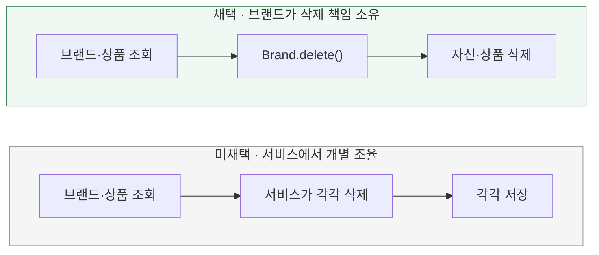

# 삭제 생명주기를 어디에 표현할까?

[← 전체 선택 현황](total_trade_off.md)

## 판단할 문제

브랜드가 삭제되면 소속된 미삭제 상품도 삭제되어야 한다.
이 책임을 브랜드의 구조·행동으로 표현할지, 서비스에서 개별 객체의 작업을 조율할지 비교한다.

> **채택 — 브랜드의 상품 컬렉션**
>
> 도메인 `Brand`와 JPA `BrandJpaEntity` 양쪽에 상품 컬렉션을 둔다.
> 삭제 생명주기를 브랜드에 표현하는 대신 컬렉션의 로딩·변환·저장 비용을 감수한다.

## 흐름 비교

아래는 설계안이다. 아직 구현하지 않았다.

## 장단점 비교

| 기준 | 브랜드의 상품 컬렉션 | 서비스에서 개별 조율 |
|---|---|---|
| 책임 표현 | 브랜드의 행동에 삭제 생명주기가 드러남 | 서비스의 호출 순서에 규칙이 드러남 |
| 기존 구조 | 도메인·JPA 컬렉션과 매핑 추가 필요 | 기존 독립 모델·저장소를 활용하기 쉬움 |
| 유지보수 | 컬렉션 완전성과 생명주기 행동 관리 | 삭제 진입점마다 조율 규칙 누락 방지 필요 |

## 옵션별 판단

> **채택 — 컬렉션 구성:** 브랜드가 소속 상품의 삭제를 함께 책임지는 의도를 우선한다.

> **미채택 — 개별 조율:** 구현 가능한 방식이지만, 이번에는 삭제 규칙을 서비스의 반복 처리에 두지 않는다.

## 적용 범위

이번 결정은 **R01 삭제 책임**에 대한 것이다. 상품 수정·재고 변경 등 기존 경로를 모두 브랜드 루트로 옮기는 개편은 합의하지 않았다.
`OneToMany`만으로 논리 삭제가 전파되지는 않으며, 실제 삭제 정책의 위치는 [다음 주제](02-policy-location.md)를 따른다.
[조회용 단방향 OneToMany와 기존 상품 brandId 저장](08-association-mapping.md)을 채택했다.
