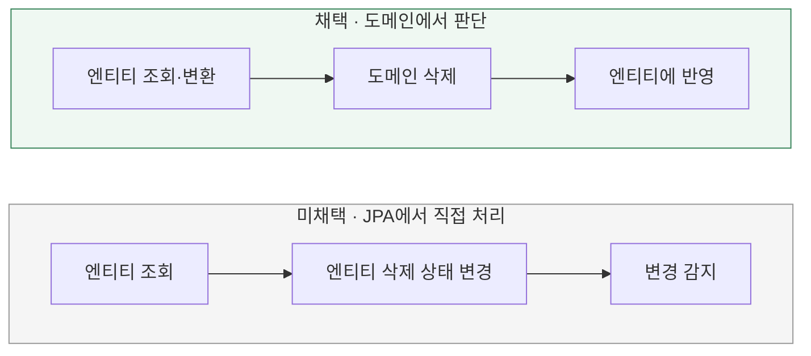

# 삭제 정책은 누가 수행할까?

[← 전체 선택 현황](total_trade_off.md)

## 판단할 문제

현재 프로젝트는 순수 도메인과 JPA 엔티티를 분리한다.
삭제 규칙을 도메인에서 수행할지, 변환을 생략하고 JPA 엔티티에서 직접 수행할지 비교한다.

> **채택 — 순수 도메인**
>
> `Brand.delete()`가 자신과 미삭제 상품의 삭제를 책임진다.
> 기존 업무 규칙 소유 원칙과 DB 없는 도메인 테스트를 위해 변환 비용을 감수한다.

## 흐름 비교

아래는 설계안이다. 아직 구현하지 않았다.

## 장단점 비교

| 기준 | 순수 도메인 | JPA 엔티티 직접 처리 |
|---|---|---|
| 정책 위치 | 기존 domain 소유 원칙 유지 | Repository·JPA 쪽에서 정책 수행 |
| 구현 비용 | 도메인 변환과 엔티티 재반영 필요 | 변환 없이 흐름을 짧게 구성 가능 |
| 검증 | DB 없이 생명주기 규칙 검증 가능 | 정책이 놓인 위치에 맞춘 테스트 필요 |
| 모델 활용 | Brand의 상품 컬렉션을 실제 행동에 사용 | 순수 도메인 컬렉션이 삭제에 사용되지 않을 수 있음 |

## 옵션별 판단

> **채택 — 도메인:** 생명주기를 구조뿐 아니라 실제 행동으로 표현한다. Mapper는 결정된 결과만 반영한다.

> **미채택 — JPA 직접 처리:** 단순함은 장점이지만 이번 삭제 정책은 순수 도메인에 두기로 했다.

`restore()`는 전달받은 값으로 도메인 객체를 복원하며 DB를 조회하지 않는다.
도메인 테스트는 삭제 규칙을 확인하고, 실제 DB 롤백은 별도 통합 테스트로 확인한다.
도메인의 변경을 엔티티에 반영하는 방법은 [상태 반영 방식](05-state-mapping.md)을 따른다.
