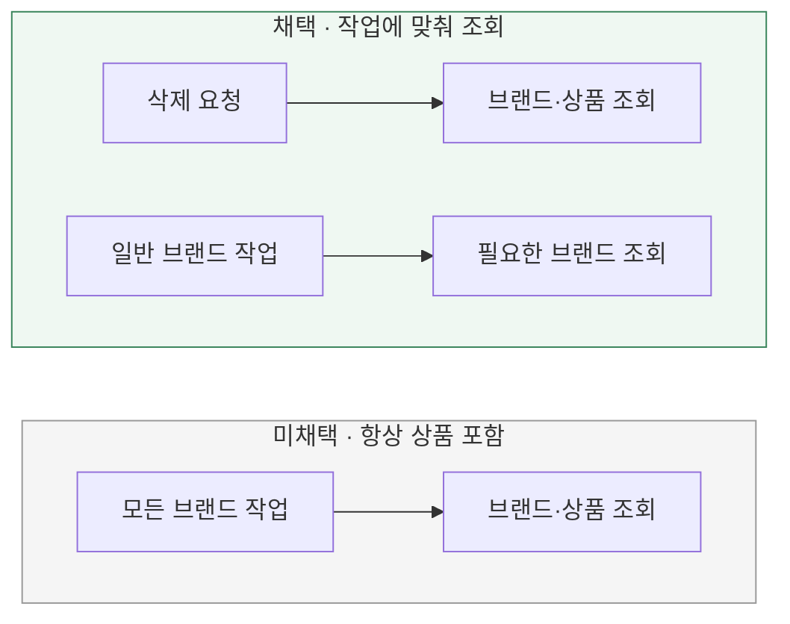

# 소속 상품은 언제 조회할까?

[← 전체 선택 현황](total_trade_off.md)

## 판단할 문제

일괄 삭제에는 소속 상품이 필요하지만 브랜드 정보만 다루는 작업에도 항상 필요한 것은 아니다.
조회 계약의 단순함과 불필요한 상품 로딩·변환 비용을 비교한다.

> **채택 — 삭제 전용 조회**
>
> 삭제할 때 필요한 상품을 함께 가져오고, 일반 브랜드 조회에는 전체 상품 로딩을 강제하지 않는다.
> 조회 계약을 구분하고 불완전한 삭제를 막는 비용을 감수한다.

## 흐름 비교

아래는 설계안이다. 아직 구현하지 않았다.

## 장단점 비교

| 기준 | 삭제 전용 조회 | 모든 조회에 상품 포함 |
|---|---|---|
| 조회 비용 | 상품이 필요한 작업에서만 로딩 | 브랜드만 필요해도 상품 전체 로딩 |
| 계약 | 일반·삭제용 조회를 구분해야 함 | 반환 그래프의 계약이 단순함 |
| 완전성 | 삭제용 데이터가 준비됐는지 보장 필요 | 항상 상품을 로딩한다는 일관된 전제 |
| 영향 범위 | 삭제용 흐름에 비용을 한정 | 상품 수 증가가 다른 브랜드 작업에도 영향 |

## 옵션별 판단

> **채택 — 전용 조회:** 삭제에 필요한 상품을 확보하면서 다른 작업에 로딩 비용을 전파하지 않는다.

> **미채택 — 항상 포함:** 단순한 계약보다 작업에 필요한 데이터만 가져오는 것을 우선한다.

## 후속 결정과 구현 검증

구체적인 조회 방식은 [JPQL LEFT JOIN FETCH](07-fetch-strategy.md)로 확정했다.
`findForDeletion()`은 설명용 이름이며 실제 메서드 이름은 구현 계획에서 구체화한다.

구현 시 삭제용 조회가 필요한 상품을 모두 제공하는지 검증한다. 읽지 않은 상품을 빈 목록으로 취급하지 않고,
상품이 없는 브랜드도 조회하며 재고 0인 상품도 누락하지 않는다. 이를 별도 상태 모델을 추가하기 위한 필수 트레이드오프로 확대하지 않는다.

조회 N+1과 상품별 UPDATE는 다른 문제다. 저장 호출과 SQL의 차이는 [저장 단위](04-save-unit.md)에서 비교한다.
