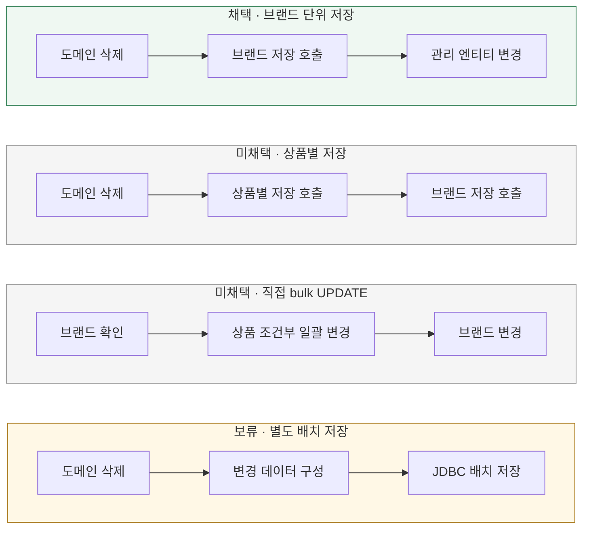

# 상품 변경은 어떤 단위로 저장할까?

[← 전체 선택 현황](total_trade_off.md)

## 판단할 문제

상품별 도메인 행동을 수행한다고 상품별 Repository 호출이 반드시 필요한 것은 아니다.
초기에 검토한 개별 저장·bulk UPDATE·배치 저장과 이후 선택한 브랜드 단위 저장 호출을 비교한다.

> **채택 — 브랜드 단위 저장 호출**
>
> 서비스에서는 브랜드 저장 한 번으로 삭제 결과를 전달하고, 저장소가 상품 변경까지 반영한다.
> 컬렉션 매핑 비용과 상품별 UPDATE 가능성은 감수하며 별도 배치 저장은 보류한다.

## 흐름 비교

아래는 설계안이다. 아직 구현하지 않았다. 호출 한 번이 SQL 한 번을 뜻하지는 않는다.

## 장단점 비교

| 기준 | 브랜드 단위 호출 | 상품별 호출 | 직접 bulk UPDATE | 별도 배치 저장 |
|---|---|---|---|---|
| 도메인 정책 | 유지 | 유지 | 상품별 행동 생략 | 유지 |
| 상품 로딩 | 필요 | 필요 | 전체 객체 로딩 생략 가능 | 필요 |
| 저장 책임 | 브랜드 저장소에 모음 | 개별 저장을 조율 | 조건·SQL에 명시 | 전용 배치 저장에 모음 |
| 이점 | 기존 관리 엔티티 활용 | 기존 상품 저장소 재사용 | 상품을 한 문장으로 변경 | 저장 요청을 묶을 여지 |
| 비용·주의 | 컬렉션 매핑·상품별 UPDATE | 반복 호출·변환 | 도메인 우회·영속성 컨텍스트 상태 | 별도 SQL·실패 검증 |

## 옵션별 판단

> **채택 — 브랜드 단위 호출:** 삭제 생명주기의 진입점과 저장 호출을 브랜드 단위로 표현한다.

> **미채택 — 상품별 호출:** 최초 후보였지만, 브랜드 저장소에서 함께 반영할 수 있어 개별 호출을 요구하지 않는다.

> **미채택 — 직접 bulk UPDATE:** 상품별 도메인 행동 없이 SQL로 삭제를 결정하는 방식은 선택한 정책 위치와 맞지 않는다.

> **보류 — 별도 배치 저장:** 현재 필수 검토에서 제외한다. 실제 처리에서 성능 문제가 확인될 때 재검토하며 측정 없이 우열을 단정하지 않는다.

## 재검토 조건

배치 적용 판단을 구현 시작·완료의 필수 조건으로 두지 않는다. 성능 개선이 필요한 구체적인 근거가 생기면 다시 비교한다.
별도 JDBC 저장과 Hibernate의 JDBC 배치 설정은 구분하며, 어느 쪽도 이번 문서에서 확정하지 않는다.
브랜드 저장 호출 내부의 매핑 방식은 [상태 반영 방식](05-state-mapping.md)을 따른다.
